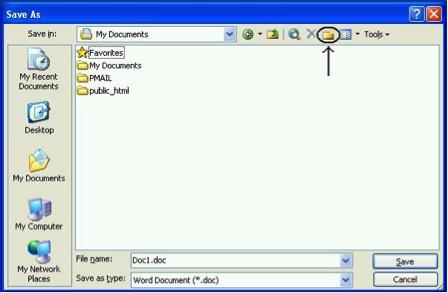
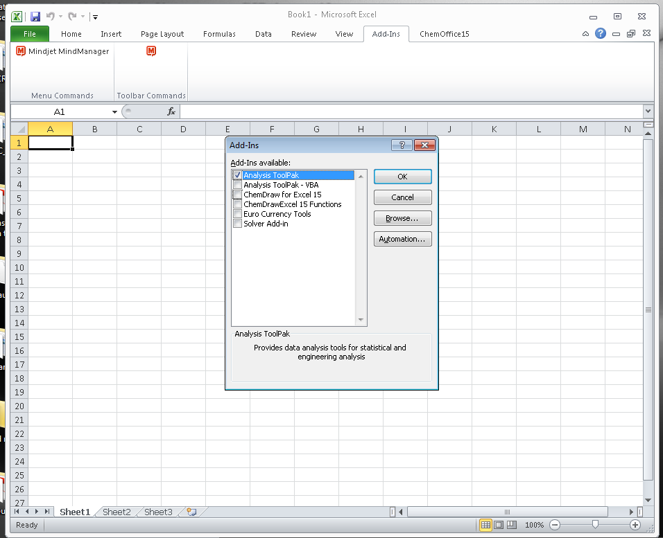
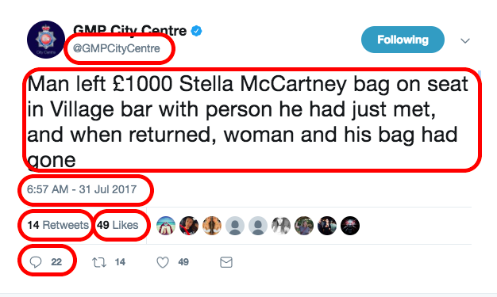
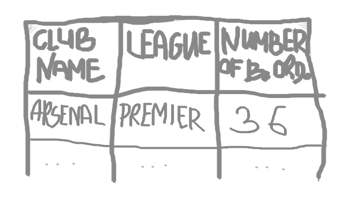
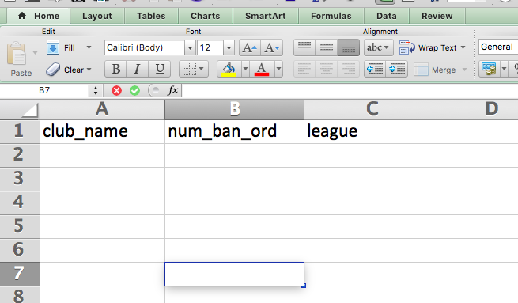
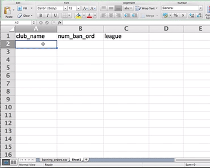
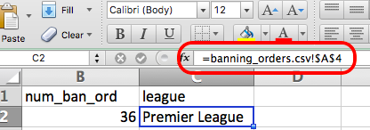
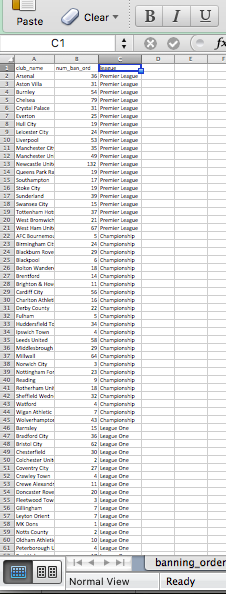

```{r setup, include=FALSE}
knitr::opts_chunk$set(echo = TRUE)
```


#Hello world

Hi there and welcome to your very first data analysis lab session. Today we will learn about the general concepts of data sets and variables. 


But before that, a quick intro into what these sessions will look like. 

When you come into a lesson, you will be able to sit at a PC and get started straight away. You will find the instructions for each week under the relevant Blackboard section. You can open up the link, and read through the instructions chronologically. That just means start at the top, and read through to the bottom. We will start with some general introduction to the topc, with links to [videos](http://www.gapminder.org/videos/the-joy-of-stats/) or further [reading](http://flowingdata.com/2015/10/26/top-brewery-road-trip-routed-algorithmically/). You should come equipped with headphones to watch the videos. 


These introductions will be accompanied by activities. You should do these activities in the lab, and ask for our help when you are stuck, or if you do not understand a concept. These activities will help you with your learning, but also will contribute towards your homework. The tasks that you have to complete in order to be able to take the homework quiz will always mirror the in-lab activities. Don't forget your homework is graded, and counts towards your final mark. But you get to practice for completing the tasks with the activities in the lab. And if you have time left over, you can always complete these tasks here in the lab. No matter where you do them, by havign the tasks completed and with you when you take the quiz, you will be more confident in the homework quiz exercises. 


<!--


, which will be indicated by special notation (colour):


<span style="color:#a50026">Where you see text in red, this is an instruction to carry out a task or activity. Make sure you do these in the lab, so if you have any questions about it, you can ask the teaching team!</span>

<span style="color:#313695">Where you see text in blue, this is an instruction to carry out a task or activity that will then feed into your final assignment. You can do these in the lab, or you can do these on your own time and bring them to get some feedback, however you will not get as much feedback as you would on the homework, as this will be all going into your final assignment. There is a list of all of these tasks available on your [document about the final assigment](), however they are included in each week's lab notes to help you build towards it, and not have to do everything in one large panicked go at the end of term. Because you wouldn't do that would you. You are a forward planning, non-procastinating student. Good. </span>
-->

Alright, now that we have the basic strucure for these lab notes covered, we can move on to setting up your working environment. 

#Setting up your working environment

There is a myth about the scientist and the messy workspace, typically illustrated with Albert Einstein: 


However many of us need order to be able to work properly. An organised workspace is also prominent, as we can see with these famous work spaces: 


```{r, out.width = "250px", echo=FALSE}
knitr::include_graphics("http://s-media-cache-ak0.pinimg.com/236x/67/75/9f/67759f0b23e8e39bb53bca497edc7b75.jpg") 
knitr::include_graphics("http://s-media-cache-ak0.pinimg.com/236x/f7/cd/d5/f7cdd5ddf82968c2df75a21184d8f456.jpg") 
knitr::include_graphics("http://static.artuk.org/w1200h1200/OU/OU_HMC_NO47.jpg") 
knitr::include_graphics("http://static1.squarespace.com/static/5365bed7e4b0d9593917b669/55d2a259e4b069700c36e0f7/55ced1f6e4b0e9aecb83b4b1/1439867195259/Writer+-+Voltaire.gif")
knitr::include_graphics("http://farm8.static.flickr.com/7631/16842204112_b4b5d11683.jpg") 
knitr::include_graphics("http://static1.squarespace.com/static/5365bed7e4b0d9593917b669/55d2a259e4b069700c36e0f7/55ce49cfe4b068d2e791f3bd/1439862429942/Writer+-+Charles+Dickens.jpg?format=500w") 


```


(Galileo, Marie Curie, John Dalton, Voltaire, Alan Turing, Charles Dickens)


When working with data, you have to consider your workspace. It helps immensely to keep our data, your code and your notes organised. You will likely have a project folder, where you save your data, your graphs, your analysis outputs, etc. You want to consider the layout of this folder, how many subfolders will you have, what is the best structure to work for you? You might think this is trivial, but when you are working on a project with multiple data sets, or many graphs, it can get very messy very quickly. I recommend going through [this resource from the university of Cambridge data management guide](https://www.data.cam.ac.uk/data-management-guide/organising-your-data) to consider Naming and Organising Files, Documentation and Metadata, Managing References, and Organising E-mail. 


Normally, say when you are working on a Windows PC at home, you can save files to your c: drive, and easily access them the next time you turn the computer on. When you are using computers at the university, however, you cannot be certain of being able to use the same computer again when you want to find and use your file again. Fortunately, once you have logged on to a computer at the university, a personal drive is available for you to use, and in effect, this drive follows you around to whichever PC you are logged on to. All students and staff have a personal file storage space on the network - known as the P: drive as this is usually the network drive letter allocated to it. Wherever you log on to the campus network your P: drive is available (in PC Clusters the My Documents icon on the desktop is a shortcut to the P: drive).


You should already have a username and password with which to log on. Your user name has 7 or 8 letters/digits, typically beginning 'msr...'. On the computers in the Faculty clusters (where you work in class time) you will see the Faculty computer 'image' and a version of the operating systems Windows 7.


Away from the campus you can download and upload files to and from your P: drive over an Internet connection - for example to and from your home computer, but please remember that large files may take a long time to upload/download depending on the speed of your home internet connection. [See here for details about remote access](http://servicedesk.manchester.ac.uk/portal/app/portlets/results/viewsolution.jsp?solutionid=040918305513985&SToken=A9F6241A4BCC47E813D7C92C68B579F7).
 

It's generally good to create a folder to save your data and our outputs in, which we will call a **working directory**. So firstly, before we begin to do any work, we should create our **working directory**. This is simply a folder where you will save all our data, and also where you will be reading data in from. You can create a new folder, where you will save everything for this course, or you can choose an existing folder. It's advised that you create a folder, and also give it some name you remember, that will be meaningful. Generally try to avoid spaces and special characters in folder (and file) names. [Here is a handy guide you should read about naming files and folders that will be relevant for all your future work](http://www2.stat.duke.edu/~rcs46/lectures_2015/01-markdown-git/slides/naming-slides/naming-slides.pdf). 


It's not necessarily a good idea to just dump everything into 'Desktop' either, as you want to be able to find things later, and maybe keep things tidy. We will now show you where your personal drive is and how to save your word file to it.

<span style="color:#a50026"> Just to have some practice with doing this, create a Word document to put into the folder. Open Microsoft Word now (you can find this on the 'Start' button in the bottom left corner of your screen). The only thing you have to type in the document is your name. 

<span style="color:#a50026"> Save the file to your p: drive as follows. Click on the *save* button (or click File then Save in the drop down menus). The dialogue box below will appear. Click on the down arrow in the 'Save in:' box to change the default directory to your P: drive. The P: drive is the one that starts with your user name. Click on this drive. 


  
<span style="color:#a50026"> Now create a new folder within your P: drive, especially for material for this course. To do so, click on the 'Create new folder' icon, as shown in the dialogue box below.




 
 
<span style="color:#a50026"> Label the new folder 'LAWS20441'. You will now have a series of folders in your p: drive (some of these you haven't created yourself, they have been provided for you by the university), one of which you can store course material in. 
Finally, name your Word document 'Trial Document' (in the filename box) and click 'Save'. As noted above, you can remotely access your p: drive (from home or elsewhere). You can do this by logging into your personalised university portal (https://my.manchester.ac.uk).
</span> 


A word of caution, if your p: drive is full (and this tends to happen when you save image or sound files to it), there is a chance that some of the applications you want to use do not work. So make sure you keep your p: drive tidy if you don’t want to run into problems.


#Getting to know your tools


Besides having a folder where you save something, you should also get comfortable with the tools which you will be using throughout this course. These are [Microsoft Excel](https://en.wikipedia.org/wiki/Microsoft_Excel) and [Inzight](https://www.stat.auckland.ac.nz/~wild/iNZight/index.php). You will be using these tools to explore, learn about, and manipulate criminological data throughout this course. 


Now you likely have come across excel before,  but it's also possible that you have not, so I will start with the assumption that this is your first time opening it up. Exciting. So let's get to it. To open excel, click on the windows icon, and select Microsoft Excel from the Microsoft Office bundle.


You are also welcome to follow along on your own laptops. In fact I would encourage that. In this case, you can download microsoft excel for free, courtesy of the UoM library. [Follow the instructions here to get Microsoft Office on your laptops](http://www.itservices.manchester.ac.uk/students/office365/). 


Now you should have excel open, and you will see an empty spreadsheet. We will be using this just a little bit later on. But for now there is one more step we need to do, to be fully set up. We need to install the data analysis toolpak. 


To do this, click on the 'File' tab, and click on 'Options':


This will bring up a popup window. Here click on 'Add-Ins', then highlight 'Analysis Toolpak' and click on 'Go':


This will open another popup window. Here make sure you tick the box next to 'Analysis Toolpak' and click 'OK':





Click 'OK' and you should be done! You can check by clicking on the 'Data' tab, and checking to see if a little Data Analysis icon has appeared: 


If you are confused, see [here](https://support.office.com/en-gb/article/Load-the-Analysis-ToolPak-6a63e598-cd6d-42e3-9317-6b40ba1a66b4) for instructions how to get this. Once you have successfully installed the data analysis toolpak it will appear.  


And that's it you are now set up! Excellent! 

You can now move on to the subtantive part of today's course. In the next section we will learn about variables and data.


#Data: Variables and observations

```{r, echo=FALSE, warning=FALSE, message=FALSE}
library(tidyverse) 
library(lubridate)

#gmp_crimes <- read.csv("/Users/reka/Desktop/MSCD/data/gmp_crimes.csv")
gmp_crimes <- read.csv("https://www.dropbox.com/s/8tkpjwsmtqeddr9/gmp_crimes.csv?dl=1")

topCrimTyp <- gmp_crimes %>%
  group_by(Crime.type) %>%
  summarise(n=n()) %>%
  arrange(-n)


```


We know that in the period from May 2016 to May 2017, Greater Manchester police recorded a total of `r I(nrow(gmp_crimes))` crimes. We also know that the largest number were recorded in `r I(head(topCrimTyp$Crime.type, n=1))` crime categeory, with  `r I(head(topCrimTyp$n, n=1))` instances, while the fewest in `r I(tail(topCrimTyp$Crime.type, n=1))`, with `r I(tail(topCrimTyp$n, n=1))` instances.


We can also track changes in the number of crimes over time:


```{r, echo=FALSE}
gmp_crimes %>%
  group_by(Month) %>%
  summarise(n=n()) %>%
  arrange(-n) %>%
  ggplot(., aes(x = Month, y = n, group=1)) +
  geom_line() +
  ylim(c(20000,40000)) +
  theme_bw() + 
  theme(axis.text.x = element_text(angle = 90, hjust = 1))
  

```


How do we do this? Well, in the United Kingdom, since 2011 data regarding individual police recorded crimes have been made openly available to the public via the [police.uk](http://www.police.uk/) website [1](http://www.tandfonline.com/doi/abs/10.1080/15230406.2014.972456). This means that by visiting the [data.police.uk/](https://data.police.uk/) website you can access data about street-level crime, outcome, and stop and search information, broken down by police force. What does this mean? What do these data look like? Let's have a look:


```{r, echo=FALSE}
gmp_crimes %>%
  select(-Crime.ID) %>%
  head(n=3) %>%
  knitr::kable() 
  
```


In this data set each row is one crime record:


For every single crime event recorded in this data, there is a row, and it contains all the information that we know about this crime incident. It will have a value for each variable that we are interested in. The variables are the columns. 


So for example, *month* is a variable in our data, and for every row (which is every crime incident) this variable can take a value. Every crime incident occurred at one specific month, and that month when each incident happened will be the value that the *month* variable will take. And the month column will contain all the instances of the month variable for each crime incident recorded. Each observation (crime) will have a value for this variable (the month that it was recorded).


Let's have a go at recording some crimes and putting them into a database, to give you some hands on experience here. 


##Activity 1: Building your own data


<!--Often you will have data readily created for you, such as we saw with the police.uk data set, which can be downloaded in the rectangle format, where your columns are your variables, and your rows are your observations. But data can take many forms. So we will have a go at dealing with some data that comes in a very unruly form: tweets!-->


You will get a better understanding of how data represents what you are measuring if you have a go at building your own data set. We will do this here by using data from twitter. You are most likely familiar with twitter. You probably even tweet yourself. But even if you have never used twitter, you will no doubt know someone who does. In fact, many police forces use twitter. GMP is one of these forces, and in particular, GMP city centre like to keep their followers updated. Recently, the MEN had an article based on following GMP city centre's tweets for one Saturday night. [You can read about that here](http://www.manchestereveningnews.co.uk/news/greater-manchester-news/what-police-city-centre-deal-13441129). 


Evidently tweets present really exciting and rich data. However they do not come in a format that is readily available for analysis in the form that we just presented here. But what you can do is collect data from tweets. And this is your task for your first lab activity. 


I have collected for you a set of tweets. Your task is to turn this into a rectangular data format, with the columns as variables, and the rows as observations (tweets). Don't worry though, I'll walk you through it.


So first things first, we need a tool. As discussed we'll mostly be using Excel in this course. So open up excel and create a brand new spreadsheet. 


Your first activity is to create a column header for each variable we want to collect. The easiest way to do this is just to make the first row your column headers. You can go ahead and create a column for each of the variables we are interested in collecting about each tweet. These are: 

- Month: The month in which the tweet was sent
- Day: The day of the month in which the tweet was sent
- Hour: The hour when the tweet was sent
- Account: The account who tweeted this tweet
- Tweet: The content of the tweet
- Likes: Number of likes for this tweet
- Retweets: Number of times this tweet was retweeted
- Comments: Number of comments made as reply to this tweet


Now you will just have to create a new row for each tweet, and populate a value for each variable we are collecting in our data. I'll go through the first tweet with you, so we're clear on what's happening. 
This is tweet number 1: 

- [ Tweet 1 ](https://twitter.com/GMPCityCentre/status/891900693585506304) 

You will see this open in a new window. Now let's try to find the value for each variable in this tweet: 





- *Month*: July
- *Day*: 31
- *Hour*: 06
- *Account*: GMPCityCentre
- *Tweet*: Man left £1000 Stella McCartney bag on seat in Village bar with person he had just met, and when returned, woman and his bag had gone
- *Likes*: 14
- *Retweets*: 49
- *Comments*: 22


So when you enter these values, your data will look like this: 


Make sure that you are copy and pasting the 'Tweet' variable, rather than typing it out yourself, to save time and also ensure accuracy. OK, ready? Then let's build our data by adding the following tweets as additional rows: 

- [Tweet 2](https://twitter.com/GMPCityCentre/status/891762454337867776)
- [Tweet 3](https://twitter.com/GMPCityCentre/status/894515606321590273)
- [Tweet 4](https://twitter.com/GMPCityCentre/status/894024570109386752)
- [Tweet 5](https://twitter.com/GMPCityCentre/status/891247668772708352)
- [Tweet 6](https://twitter.com/GMPCityCentre/status/891254643078176768)
- [Tweet 7](https://twitter.com/GMPCityCentre/status/890871354924421120)
- [Tweet 8](https://twitter.com/GMPCityCentre/status/890594946536927233)
- [Tweet 9](https://twitter.com/GMPCityCentre/status/890161961626996736)
- [Tweet 10](https://twitter.com/GMPCityCentre/status/889084990495051776)


Once you have entered all these, you should have a pretty solid set of tweets. The twitter data contains all the variables we have gathered here. You can see there are some tweets of information, some tweets for community engagement, and some appeals to the public for information, such as asking to locate people they might recognise from CCTV footage. 


Once you are done, save your data. You can do this by clicking on "file" and then "save as" and navigating to your working directory to save your file. You can save it as a *comma separated value* file, or .csv . Next term you will be dealing with data in this format. This way any formatting that you do to the spreadsheet (eg making the column titles bold etc) will *not* be preserved, however the data is available to read by more software, not just excel. It doesn't hugely matter at this stage how you save your data. 


In any case, if you follow these steps, you will have a saved set of data, in a csv file, hopefully with some meaningful name: 


And now you have created your first data set. Your columns are your variables, which correspond to Month, Day, Hour, Account, Tweet, Likes, Retweets, and Comments. Your rows are the 10 tweets which you have collected this information about. 


##Code books


Creating data is a gift that keeps on giving, not just for yourself, but for others as well. Data collected by researchers is often shared and made available for others to use as well, so that they can explore their own research questions. For example, the [UK Data Service](https://www.ukdataservice.ac.uk/) is a large repository of data where you can sign up, and access secondary data to analyse. You may have heard of the [Crime Survey for England and Wales](http://www.crimesurvey.co.uk/) or the [ Smoking, Drinking and Drug Use among Young People Survey](http://content.digital.nhs.uk/catalogue/PUB17879). The data collected by  these surveys are online. Many many variables collected about individuals, neighbourhoods, and other units of analysis (to be returned to later) are available to us. Isn't that really cool!? If you want to know, what thousands of people replied to the question asking them what the most important issue was to them when they voted in an election, you can find out just by downloading the correct data set!


But there is one important consideration when you are sharing a data set, and something that is very important to you if you are using a data set someone else has created - you need to know what the variables *mean*. This is made possible by the creation of something called a *codebook* (and sometimes called a *data dictionary*). This is a note that accompanies a data set, telling the user a bit about the data, including what each variable means. 


Have a look at the codebook for the CSEW [here](http://doc.ukdataservice.ac.uk/doc/7889/mrdoc/excel/7889_csew_data_dictionary_2002-03_to_2014-15.xlsx) - note that this will open a force download. Just download it, save it to your working directory, and then open it up with excel. 


It will look something like this: 


You see there is quite a bit of information provided, including the variable name, the question that was asked, a label, which is a bit of a description about the variable, and the possible values which the variable can take. 


If we were to share our tweet data, we would have to create something similar to this for that as well. Something like this perhaps: 


```{r, echo=FALSE}

df <- data.frame(Variable = c(
  "Month", "Day", "Hour"), 
  Description = c("The month in which the tweet was sent", 
                  "The day of the month in which the tweet was sent", 
                  "The hour when the tweet was sent")
  )

df %>%
  knitr::kable()


```


Is there anything else that you would include? Why or why not? Have a think, and if you want discuss with a friend. The important thing here is that you understand what a codebook (or data dictionary) is, and that if you come across a data set, always make sure to look for the associated codebook/ data dictionary to be able to understand what each variable means. If you download your data from the web, you will usually find a link to the data dictionary on the site where you downloaded the data from. 


#Questions about your data


Why would we do this? Well turning information into data allows us to ask questions, and draw meaningful conclusions. For example, by looking at your newly created data set of tweets, you can easily answer the question below: 


- *Which tweet has the highest number of likes?*


##Activity 2: Thinking about what our data tells us

Take a moment to look at your data to answer this question (*Which tweet has the highest number of likes?*). Which one is it? Read the content, have a think, and turn to the person next to you to ask them, why they think that this particular tweet has the highest number of likes in the group. Now try to come up with an alternative explanation. I would like you to now talk about your two possible explanations for why this tweet has the highest number of likes, and note these down somewhere. Keep this for later. 


Similarly, access to anonymised crime data through [police.uk](www.police.uk) allows us to ask questions about levels of crime in our local area, and use these data to answer them. Access to this data allows us to study crime trends across the UK. It allows us to answer questions that we might have - such as, which crime category had the highest number of recorded crimes in the last year? Or is the volume of crime increasing, decreasing, or staying the same? 


To answer these questions we need **data**. The data you can see above, on crimes that fall under GMP between May 2016 and May 2017 can be used to measure crime during this time period in this area. You can access the data dictionary for these data [on the police.uk site here](https://data.police.uk/about/#columns). 


> The word data is the plural of the Latin datum, meaning a given, or that which we take for granted and use as the basis of our calculations. This meaning is carried in the French word for statistical data, données. We ordinarily think of data as derived from measurements from a machine, survey, census, test, rating, or questionnaire — most frequently numerical. In a more general sense, however, data are symbolic representations of observations or thoughts about the world. As we have seen, we do not need to begin with numerals to create a graphic. Text strings, symbols, shapes, pictures, graphs themselves, can all be graphed. 

- Leland Wilkinson (2005) *The Grammar of Graphics*


As Leland Wilkinson points out, data can be numeric, but it can be other things as well. Data could be text, such as the tweets. It can also be a date, which is a special kind of number, because it has some meaning. Pictures can also be data, as can video, or audio. You can also have spatial data, perhaps in the form of the coordinates for where a particular crime event took place. We can speak about the **level of measurement** of a variable, which just refers to whether that variable belongs to the category of *nominal*, *ordinal*, or *numeric*. Let's explore what these categories encompass in the next section. 


#Levels of measurement


If we set out to collect our own data, we make sure that we collect all the variables needed to answer our question, from all the observations that we have. The kinds of variables we have, determine the kinds of questions that we ask. For example, if we want to ask questions such as the one about the tweets above: "*Which tweet has the highest number of likes?*" we need to have **numeric** a variable. **Numeric** variables let us answer questions about quantity. For example, if we want to know the *average number of crimes per month*, we will need a numeric variable of number of crimes, for each month. Just like for the tweets, we had a numeric variable of the *number of likes* for each tweet. Put simply, number questions are answered by **numeric** variables. 


##Activity 3.1: Levels of measurement pt. 1
Have a look back at your tweet data that you created. Which variables are numeric?


Stop here again and turn to the person next to you. Discuss with them which variables you think are numeric. Do you agree on your choices? 


It's important that you take some time to actually try to think of this on your own - and I would recommend that you talk this through with someone. If you are happy to chat to the person next to you - do this now. If not, then raise your hand, and myself or one of the TAs will come over. Tell us that you don't want the answer, you just want to talk through which variables you think are numeric. We will listen, and not judge. I'll just wait a moment while you take time to speak to someone now. 


You're back! Yay! Now I hope at this point you have talked through your thoughts, because I'm about to reveal the answer... Ready? 


So is this the same as you thought? If yes, nice work! 


If you did not get this right, was that because you also selected the day and the hour variables? If it was, then that is perfect, because that is what I was secretly hoping you would do! 


Why are day and hour not numeric variables? After all they *are* numbers, right? Well a simple way to think about that is - does it make sense to calculate the average hour for tweets to be sent? If I told you, the average hour for GMP tweets if 13.5, is that something meaningful? Or if I told you that the average day is 15? Not hugely. Hour of the day, and day of the month, which is what these variables represent, are variables which fall into a different level of measurement. These are **ordinal** variables. What does that mean? Well the clue is in the name, **ordinal** variables that are not numeric, but they do fall into a natural order. *Natural order*?? What's that? Well natural order just means that there is a meaningful order that you can put these variables in. You know which comes after which one. For example you can consider letters of the alphabet to follow a natural order, so common we call it alphabetical order. If I tell you to arrange medium, large, small, you know that what I mean is to put them in this order: small, medium, large. **Ordinal variables** are variables where such a known order exists. 


##Activity 3.2: Levels of measurement pt. 2
So on that note - can you find the other ordinal variables in your tweets data? 


I'll wait again while you look. 


Done?
 
 
Yes you are right, it's *Month*. You know that if I say January, February, March, then the value to follow is April, and not November. There is an order that these values fall, making *Month* an **ordinal** variable. 


So what about the others? *Account* and *Tweet*? These are **nominal** variables. These are sometimes also referred to qualitative variables. But you can still carry out quantitative analysis on them. You will very often see **nominal** variables in quantitative analysis. In this case, the *Account* variable tells you who is tweeting, and if you have tweets from many different accounts, for example we also looked at \@gmptraffic and \@GMPMcrAirport, we could compare tweets between them. These variables are **nominal** and **not** ordinal, because they do not fall into any particular order. You can arrange them in any order, and it would look just as legitimate as any other order. 


Starting to make sense? To recap, there are levels of measurement that each variable can fall into , and these are **numeric**, **ordinal**, or **nominal**. By the way, **ordinal** and **nominal** are also called **categorical** variables, because they assign each observation into a *category*. Then, depending on whether the category values can be put in a meaningful order or not, you can tell if it's an ordinal-categorical, or nominal-categorical variable. 


Confused? Let's look at this again, but with the crimes data. 


<!--


> In science, we use measurement to make accurate observations. All measurement must begin with a classification process—a process that in science is carried out according to systematic criteria. This process implies that we can place units of scientific study in clearly defined categories. The end result of classification is the development of variables.

- *Chapter 2 Statistics in Criminal Justice - David Weisburd, Chester Britt*


We will talk more about how to create these measurements, and what that means for your research in week 4, but for now it is enough to understand that data are a way of representing information about the world, which can be used to answer questions that we may have. 


For example, we can ask the question: Which borough in Greater Manchester had the highest number of burglaries in this time period. Take a moment to think about this - what sort of data would you need to be able to answer this question? 


You would need to know firstly the name of all the boroughs - right? So you would know how to identify them. Then you would also need to know the number of burglaries that occurred in each borough. Can you imagine what the data will look like? 


Well 


> The word variable is derived from the Latin variare, to vary. A variable gives
us a method for associating a concept like income with a set of data. 

- Leland Wilkinson (2005) *The Grammar of Graphics*
-->

Let's glance back at the crimes data set first:


```{r, echo=FALSE}
gmp_crimes %>%
  select(-Crime.ID) %>%
  head(n=3) %>%
  knitr::kable() 
  
```


One variable you can see there is the one called **Crime.type**. This variable can take a value that corresponds to one of the crime types listed in the [Police.UK FAQ](https://www.police.uk/about-this-site/faqs/#what-do-the-crime-categories-mean). For every crime incident recorded, an officer will have to classify this crime incident into one of these categories. All of these categories are all the possible **values** that the Crime.type **variable** can take. This is a  **categorical** variable, as its possible values are categories. Further subset, this is a **nominal** variable, because the categories do not fall into a natural order. These categories are mutually exclusive (a crime is classed as either a Burglary or Vehicle Crime, but not both at the same time) and cannot be ordered in a meaningful way (alphabetical is not meaningful!). If they did have a meaningful order (for example days of the week have an order, or the values *small, medium, large* have an order) they would be **ordinal** variables. Both ordinal and nominal variables are categorical, because they deal with values that can take a finite number of values, or in other words, belong to a set number of categories. They group your data into one of the available categories. 


But not all variables are categorical, some are **numeric** . These types of varibles are numbers, and include things like the *number of burglaries*. For example, suppose we have created this data set, which has 2 variables, one *Borough* variable with the name of each borough, and one *Number of burglaries* variable, with... you guessed it... the number of burglaries in that borough. 


it would look something like this: 


```{r, echo=FALSE}
#create variable for boroughs in lazy way
gmp_crimes$borough <- substr(as.character(gmp_crimes$LSOA.name), 1, nchar(as.character(gmp_crimes$LSOA.name))-5)

gmp_crimes %>%
  filter(Crime.type=="Burglary") %>%
  group_by(borough) %>%
  summarise(number.of.burglaries = n()) %>%
  arrange(-number.of.burglaries)%>%
  filter(number.of.burglaries > 10) %>%
  knitr::kable()

```


This data set is made up of 10 **observations** and 2 **variables**. You might notice that this maps nicely onto your 10 rows of 2 columns. As noted in the previous section, the columns represent your **variables**. The rows reporesent your **observations**. Your observations (or rows) are every single record in your data. So in the case above, every borough has one observation, or the number of crimes in each area. For each observation, we record 2 variables. One variable is the name of the borough. This variable is called *borough*. The other varible is the number of burglaries that took place in that borough. It's called *number.of.burglaries*, and it is a **numeric** variable. 


**Numeric** variables can also be assigned into sub groups. **Interval** variables have values of equal intervals that mean something. For example, if you have results from an IQ score, the difference of 1 score between 90 and 91 is the same as 91 to 92. But there is no *true* zero value, and it doesn't make sense to say someone is twice as smart as someone else. **Ratio** variables however have an absolute zero (a point where none of the quality being measured exists), and using a ratio scale permits comparisons such as being twice as high, or one-half as much. This can get somewhat confusing, and there are sometimes people who argue that a particular type of variable belongs to one group or the other. For example, if you have a Likert scale of Strongly agree, Agree, Neutral, Disagree, Strongly disagree, you can say that this is an ordinal variable (categories that have a natural order). But you could also translate them into numbers, saying it measures agreement from a scale of 1 (Strongly disagree) to 5 (Strongly agree). In this case it is possible to treat this as an interval scale variable. The truth is, you can choose either option, **but you have to have some good justification why**. Did someone else do this before you? Did you read a recent paper where one method was argued to be better than the other? For some instances it will always be clear what type of variable you have. But you should always take time to consider what the level of measurement of your variable is, and what that means for what you can say about your data. As a personal preference, I'd advise against treating ordinal data as numeric, but others will advise that it's generally OK to take means and apply statistical tests to ordinal data, just be careful about making interval claims such as "twice as satisfied." [2](http://www.usablestats.com/lessons/noir)

<!--It's nice to know the distinction between these (see Chapter 2 Statistics in Criminal Justice - David Weisburd, Chester Britt for interval/ratio, or for discrete/continuous), but for the purposes of what we cover here it's not vital. -->


The reason we need to know what type of variable we are dealing with, is because this will determine the kinds of analyses we can do to it, further down the line. For example, next week we'll talk about summarising data. As discussed above, for a numeric variable, we can take the average, and use this to summarise it, whereas for a categorical variable you can't.Think about if someone asked you: "what is the average gender in the class?" This doesn't make sense, instead you would look at the proportions. Gender is a categorical variable. However, if someone asked you what is the average age in the class, that is a more possible query to answer. Because age is a numeric variable. 


Here are some more examples of each:

- Nominal variables: 
    + Gender: Male, Female, Other.
    + Hair Color: Brown, Black, Blonde, Red, Other.
    + Type of living accommodation: House, Apartment, Trailer, Other.
    + Religious preference: Buddhist, Mormon, Muslim, Jewish, Christian, Other.

- Ordinal variables: 
    + Socioeconomic status: poor, middle class, rich.
    + The Likert Scale: strongly disagree, disagree, neutral, agree, strongly agree.
    + Level of Agreement: yes, maybe, no.
    + Time of Day: dawn, morning, noon, afternoon, evening, night.

- Interval variables:
    + Celsius Temperature.
    + Fahrenheit Temperature.
    + IQ (intelligence scale).
    + SAT scores.

- Ratio variables:
    + Bank account balance
    + Age in years
    + Height in cm
    + Number of children 


Now before we move on to the exercise, have another dose of these concepts through the power of video. Remember in school when the teacher put on the video to watch? That was the best. Here I will do this too, keep the nostalgia alive. 


Start with this quick one: - [Levels of measurement summary here](https://www.youtube.com/watch?v=hZxnzfnt5v8) 6.19min


and then continue by watching Chris Wilde describe them: 


- [Data Organisation ](https://www.youtube.com/watch?v=_ROBwTFVldo&list=PL8CRAVedURQpYNoFt7w6maxaQCn3ZLytu&index=3) 5.18min
- [Categorical variables ](https://www.youtube.com/watch?v=38oQwFeCEag&list=PL8CRAVedURQrlxeFfme0TEgaj1_h67JUR&index=2) 4.58min
- [Ordering categories ](https://www.youtube.com/watch?v=xmRuRRHsUeg&index=3&list=PL8CRAVedURQrlxeFfme0TEgaj1_h67JUR) 2.27min
- [Numeric variables ](https://www.youtube.com/watch?v=U3lk2nQYfAQ&list=PL8CRAVedURQrlxeFfme0TEgaj1_h67JUR&index=4) 5.52min


Great, by now you are an expert on levels of measurement. 


<!--Your data should look something like this: 


```{r, echo=FALSE, eval=FALSE}
gmp_tweets <- read.csv("/Users/reka/Desktop/MSCD/data/gmp_tweets.csv")
gmp_tweets$Tweet <- gsub("\x9c", "£", gmp_tweets$Tweet)
gmp_tweets %>%
  knitr::kable()

```


So now you have some data, where you have 8 variables for 10 observations of tweets by GMP City Centre. Your first variable is *Month*. What *level of measurement* is this variable?


To answer this question, think of the levels of measurement as going through a flowchart. Ask yourself - is this a category or a number? If it's a category - does it have an order or not? Maybe something like this: 

-->


#Unit of analysis


We've been speaking (reading) about our variables (columns) a lot, but let's also not forget to discuss the importance and meaning of our rows. We know by now that each row is an observation. So in the original data set about crimes, every single crime incident represents one row. Here are 3 crimes:


```{r, echo=FALSE}
gmp_crimes %>%
  select(-Crime.ID) %>%
  tail(n=3) %>%
  knitr::kable() 
  
```


But we also saw above a case where we were looking at the number of crimes per borough. In that case, there were only 10 rows, because there are 10 boroughs, and we only had one observation per borough. Here is that data set again: 


```{r, echo=FALSE}
gmp_crimes %>%
  filter(Crime.type=="Burglary") %>%
  group_by(borough) %>%
  summarise(number.of.burglaries = n()) %>%
  arrange(-number.of.burglaries)%>%
  filter(number.of.burglaries > 10) %>%
  knitr::kable()

```


What is the significance of this? 


The unit of analysis is the major entity that is being analyzed in a study. It is the *what* or *who* that is being studied. Your unit of analysis will depend on the questions that you are going to be asking. You will always want your rows to represent your unit of analysis, so that you can collect data *about* these in the variables, and you can answer your questions. 


Take this example:


We want to see whether boroughs with higher population count have higher numbers of crime. To be able to explore this question, we need information about the number of crimes, and the number of the population in each...

...

...

... borough!


What about this one: 

We want to see whether men consume more illegal drugs than women. To be able to explore this we need information about the gender and the drug consupmtion of each... 
... 

... 

... 

... person!


Are you seeing the pattern? If you are comparing things, whether thats population and crime, or gender and drug consumption, you are comparing this between *things*. You are comparind population and crime rates between *boroughs* and you are comparing gender and drug consumption between *people*. These are your **units of analysis**. 


##Activity 4: *Abstract*-ing the unit of analysis

Let's do an exercise. Read this abstract: 


> Over the last 40 years, the question of how crime varies across places has gotten greater attention. At the same time, as data and computing power have increased, the definition of a ‘place’ has shifted farther down the geographic cone of resolution. This has led many researchers to consider places as small as single addresses, group of addresses, face blocks or street blocks. Both cross-sectional and longitudinal studies of the spatial distribution of crime have consistently found crime is strongly concentrated at a small group of ‘micro’ places. Recent longitudinal studies have also revealed crime concentration across micro places is relatively stable over time. A major question that has not been answered in prior research is the degree of block to block variability at this local ‘micro’ level for all crime. To answer this question, we examine both temporal and spatial variation in crime across street blocks in the city of Seattle Washington. This is accomplished by applying trajectory analysis to establish groups of places that follow similar crime trajectories over 16 years. Then, using quantitative spatial statistics, we establish whether streets having the same temporal trajectory are collocated spatially or whether there is street to street variation in the temporal patterns of crime. In a surprising number of cases we find that individual street segments have trajectories which are unrelated to their immediately adjacent streets. This finding of heterogeneity suggests it may be particularly important to examine crime trends at very local geographic levels. At a policy level, our research reinforces the importance of initiatives like ‘hot spots policing’ which address specific streets within relatively small areas.


- [Is it Important to Examine Crime Trends at a Local “Micro” Level?: A Longitudinal Analysis of Street to Street Variability in Crime Trajectories](https://link.springer.com/article/10.1007/s10940-009-9081-y)


What is the unit of analysis here? Take a moment again, turn to the person next to you, or if you will, get up, stretch your legs, and go speak to someone on the other side of the room. Go! Get some steps in! Discuss what you think the unit of analysis is, and more importantly, why you think this! Then come back. 


What did you decide on? The helpful thing here, is to look at what is the question they are asking - and what are they asking this about? The key sentence here is this one: *"Indeed, just 86 street segments in Seattle include one-third of crime incidents in which a juvenile was arrested during the study period."* You can see that they are talking about the *number of arrests* per each *street segment*. So your unit of analysis is street segments. 


Want to play again?


Try this one: 


> This paper examines the importance of neighbourhood context in explaining violence in London. Exploring in a new context Sampson’s work on the relationship between interdependent spatial patterns of concentrated disadvantage and crime, we assess whether collective efficacy (i.e. shared expectations about norms, values and goals, as well as the ability of members of the community to realize these goals) mediates the potential impact on violence of neighbourhood deprivation, residential stability and population heterogeneity. Reporting findings from a dataset based on face-to-face interviews with 60,000 individuals living in 4,700 London neighbourhoods, we find that collective efficacy is negatively related to police-recorded violence. But, unlike previous research, we find that collective efficacy does not mediate the statistical relationship between structural characteristics of the neighbourhood and violence. After finding that collective efficacy is unrelated to an alternative measure of neighbourhood violence, we discuss limitations and possible explanations for our results, before setting out plans for further research.

-[Collective Efficacy, Deprivation and Violence in London](https://academic.oup.com/bjc/article-abstract/53/6/1050/418215)


This one is a bit trciky. You can see they talk about how they collected data, in the sentence *"Reporting findings from a dataset based on face-to-face interviews with 60,000 individuals living in 4,700 London neighbourhoods..."*. But remember, we want to look at the questions they were asking - and you can see they are talking about **neighbourhood violence**. You can see this because they talk about looking into *"statistical relationship between structural characteristics of the neighbourhood and violence"*. Their unit of analysis is the neighbourhood. 


Of course, you could have also cheated and read the paper. It will not always be obvious from the paper abstract what the unit of analysis is. Unless of course, you come across a helpful abstract like this one: 


> Objectives: To test the generalizability of previous crime and place trajectory analysis research on a different geographic location, Vancouver BC, and using alternative methods.
Methods: A longitudinal analysis of a 16-year data set **using the street segment as the unit of analysis**. We use both the group-based trajectory model and a non-parametric cluster analysis technique termed k-means that does not require the same degree of assumptions as the group-based trajectory model.
Results: The majority of street blocks in Vancouver evidence stable crime trends with a minority that reveal decreasing crime trends. The use of the k-means has a significant impact on the results of the analysis through a reduction in the number of classes, but the qualitative results are similar.
Conclusions: The qualitative results of previous crime and place trajectory analyses are confirmed. Though the different trajectory analysis methods generate similar results, the non-parametric k-means model does significantly change the results. As such, any data set that does not satisfy the assumptions of the group-based trajectory model should use an alternative such as k-means.

-[Crime and Place: A Longitudinal Examination of Street Segment Patterns in Vancouver, BC](https://link.springer.com/article/10.1007/s10940-014-9228-3)


But the most important thing here is that you understand what is meant by unit of analysis. It is not always the level at which your data is collected. For example, we have the crime data from [police.uk](police.uk) where each row is one measurement. This is called **individual level** unit of analysis. But we can still use that to talk about the number of crimes per neighbourhood. But for us to be able to do that we need to convert that into a table where each row is the borough, we need to aggregate up, and just count the number of crimes in each one. Therefore this is an **aggregate level** unit of analysis. 


Have a watch of this quick video [here](https://www.youtube.com/watch?v=XHXTR8jeEUg) for some more examples and explanation. 


#Data quality

> There are three separate factors that affect the quality of a measure. The researcher should strive for a measure that has (1) a high scale of measurement (one that uses the most information); (2) a high level of validity (one that provides an accurate reflection of the concept being studied); and (3) a high level of reliability (one that provides consistent results across subjects or units of study).

- Weisburd & Britt ()


There are some very important considerations about considering the quality of your data. You want to consider the **validity** - is it measuring what you think it's measuring, and the **reliability** - is it consistently measuring the thing it's measuring, of your data. There is a lot of emphasis on this in your textbooks and in social science methods teaching in general. You will be able to read up on these, and so I will not spend too much time on that in the exercises. Instead I want to cover something here that is not so much discussed, but if you will be dealing with data, it will be a large part of your everyday life. And a source of great pain and misery. But it needs to be done. [Data scientists spend about 80% of their time cleaning data](https://www.forbes.com/sites/gilpress/2016/03/23/data-preparation-most-time-consuming-least-enjoyable-data-science-task-survey-says/#5d6a72af6f63) and I can tell you, it's that much or more for crime analysts. Yet no one teaches you this. Well I'm changing that. I would like to initiate you to the pain of messy data. 


> Happy families are all alike; every unhappy family is unhappy in its own way.” 
–– Leo Tolstoy

> Tidy datasets are all alike, but every messy dataset is messy in its own way.” 
–– Hadley Wickham


But what makes data messy? What is it like when it's clean? Most of the time, in this course, in the one next term, and working with secondary data from sources like the [UK Data Service](https://www.ukdataservice.ac.uk/) you will receive 'tidy data'. And all that means is that the data looks the way we expect it to, as I've been describing here today with your (say it with me) **variables in the columns and your observations in the rows**. 


> Tidy data is important because the consistent structure lets you focus your struggle on questions about the data, not fighting to get the data into the right form for different functions. 
Getting your data into this format requires some upfront work, but that work pays off in the long term. Once you have tidy data and the tidy tools provided by packages in the tidyverse, you will spend much less time munging data from one representation to another, allowing you to spend more time on the analytic questions at hand.

- [Hadley Wickham](http://r4ds.had.co.nz/) 

(If you’d like to learn more about the underlying theory, you might enjoy the Tidy Data paper published in the Journal of Statistical Software, [http://www.jstatsoft.org/v59/i10/paper](http://www.jstatsoft.org/v59/i10/paper).)


So how do we tidy data? You can do this many ways. The ideal approach is to do it programatically, and you will deal with this more in the second semester. For now, I just want you to have a go at thinking about turning some messy data into tidy data. And that leads us to our final activity for today. 


##Activity 5: Tidy data


The Home Office collects statistics on [football related arrests and banning orders in England and Wales](https://www.gov.uk/government/publications/football-related-arrests-and-banning-orders-england-and-wales-season-2015-to-2016/football-related-arrests-and-banning-orders-england-and-wales-season-2015-to-2016). Isn't that exciting? We can ask all sorts of questions. For example, we could ask which club's supporters have the most banning orders. Or whether supporters of teams in Premier League or Championship League have more banning orders? 


The questions we want to ask are important. They determine the variables we will want. 


If we want to ask about the number of banning orders, and we want to look at which league has more, and which team has more - what variables will we need here? 


It might help to draw the table you think you will need. Take a piece of paper. Or open up MS Paint. Lucky for us, the Uni is still on Windows 7, far from the [newest release which kills MS Paint](https://www.theguardian.com/technology/2017/jul/24/microsoft-paint-kill-off-after-32-years-graphics-editing-program). I hope that you guys are not too young to have missed the glory that is MS paint. If I keep teaching this course for long enough, students eventually will be. This is a terrifying thought, but for now, we are young, and we still have paint. So let's draw our ideal data set. Take a moment to draw yours. You can discuss with a neighbour. I'll draw mine in the meantime. Don't look ahead though, try to come up with it yourself. 


OK are you ready? Do you have your beautiful perfect data set all drawn out?


Here's mine: 





I know this seems silly, you might be thinking, *SHOW ME THE DATA!*. But it's actually very important to know from the outset what you need the data to look like, in order for you to be able to answer your questions. You need 3 variables, the name of the club, the league of the club, and the number of banning orders. When your data is tidy you will have these variables as columns. You will have each observation, in this case each club, as the rows. Every row should have only one observarion, that is every row should correspond to only 1 club. Like the beautiful illustration above. 


Did your drawing look similar? If you are at all confused at this point stick your hand up in the air, and ask us to talk you through it. Don't be shy, we're here to help. Ask away. 


Right. So now we know what we want our data to look like. Go ahead and download the .csv file from blackboard. Once you've saved it to your working directory, open it up with excel. 


It will look something like this: 


It's awful isn't it. BUT you are well prepared to deal with it. Because you know how your data *should* look, you can rearrange these data here, to match what your ideal setting would be. To do this, create a new tab by clicing on the little plus sign next to the current tab's label, on the bottom of your spreadsheet: 


Now create columns for each variable: 





Now you could copy and paste the relevant information into each cell. This would be the manual way of going about it. But I thought for our final task we could learn some neat excel tricks. The power of excel really lies in using formulas. If you go on a job interview and they ask if you can use excel - this is usually what they mean. Have a look at questions 3, 4, 5, and 6 in these [top excel interview questions](https://www.deskbright.com/excel/excel-interview-questions/), 


So let's learn some formulas. For you to tell excel that you are writing a formula, you have to start typing with an `=`. For example, if you wanted to add numbers in some cells together, you would use the `SUM()` function, by typing `=SUM(` then highlighting the relevant cells, then typing a close bracket `)` to end your equation, and hitting enter. Like this: 


Easy peasy. Now, to copy over some values from one cell to the other, you simply use the `=` sign and name the cell you want to copy from. Cells are names by combining their column letter and row number. So the topmost left hand cell is A1. You can either type the name of the cell you want to copy from, or you can click on it. This is called a cell reference.  Cell references allow users to include the values of external cells in formulas dynamically — rather than hard-coding particular values manually. To copy from another sheet, simply select from that sheet. 


So in this case, let's start by copying over the first cell. You just click in the first column of the first row, type `=`, and then click to the other tab, and select the first value for club name, in this case *Arsenal*. 





So excel makes our life easy, in that you can copy formatting from a cell to the one next to it, or the one under it, by clickin on the cell, and dragging the corner to the other cells, where we would like the formula copied to. 


So if we want to copy over the cells next to the one that said 'Arsenal', we don't need to go back to the first sheet. Like so: 


 Keep dragging until you get 0s as results. You don't want that, so you can drag back up, to make sure you're only copying data over, not empty cells. Now you want to copy over the league as well.
 
 
Click on the first row of the 'league' column, type `=` and go back to the first sheet and click on 'Premier League'. The same process as we did for copying over 'Arsenal' above. 


We can see that everything under the Premier League heading belongs to the Premier League. So the value for the 'league' variable is Premier league for all of these clubs. Therefore, we just need to replicate this for every one of these observations. 

Now there is another neat trick here. If you were to drag the cell to copy the formatting again, you would be copying the cells below, rather than replicating 'Premier League', it would start to copy the cells below. Like this: 


This is because excel adjusts the formatting for you to match what you are moving - you are using **relative cell references**. By default, Excel uses relative cell references, which change dynamically as they are copied and pasted around a sheet. For example, if a reference to cell A1 is copied and pasted one row down and one column to the right, the new reference will point to cell B2. This allows users to perform similar calculations on different ranges of cells quickly and easily. We made use of this function when copying over the club names and the associated number of banning orders. 

In contrast, **absolute cell references** do not change when they are copied and pasted to other locations within a sheet. Absolute cell references can be used on either rows, columns, or both at the same time, and are indicated using the \$ sign. For example, if a reference to cell \$A\$1 is copied and pasted one row down and one column to the right, the new reference will point to cell A1 — it won't change at all, because both the row and column are locked. If a reference to cell \$A1 is copied and pasted one row down and one column to the right, the new reference will point to cell A2 — only the row number will change, because the column letter is locked.


So in this case, we want to put in two `$`s because you want it to fix both column and row. So click on the cell where it now says *Premier League* and you will see the formula appear in the formula bar. Click in the formula bar, and insert two `$`s to change the formula from `=banning_orders.csv!A4` to `=banning_orders.csv!$A$4`. 





Now try to drag the Premier League cell again, to copy its value for all these clubs. You will see that it will work this time. Exciting!


So now you repeat this by clicking in the next cell, and copying over all the data, filling in the blanks, until your data set looks something like this: 





OK now we can answer questions like this one:

- *Which Club had the highest number of banning orders?*


Tip: if you don't want to go reading through them all and making sure that you didn't miss one with an even higher value, you can **sort** your data. To sort by a specific variable, click on the 'Data' tab, then on the little black downwards pointing triange next to the sort icon: 


This will allow you to select how you want to sort your data. Select the 'Custom sort...' option. 


Now you can choose which variable you want to sort by: 


And you can also select if you want to sort in ascending (smallest to largest) or descending (largest to smallest) order: 


Ta-daa. This should reveal to you your result, something like this: 


Is Newcastle United a surprising result? Also which leagues would you expect at the top. We see a lot of 'Premier League' and 'Championship', but there is also a team fro 'League One' (Bristol City) and one from 'Football Conference3'. They appear to both be Bristol based teams. Is this interesting? Take a moment to discuss these results from this final task with someone. If you know anything about this raise your hand and tell me. I actually know nothing about football, so would be interested to hear any possible explanations for these results!


#Summary


In sum, you should now be more familiar with data than you were when you started. And you should be comfortable with the following terms: 

- working directory
- data
- codebook/ data dictionary
- variable
- observation
- levels of measurement
  + nominal, ordinal, numeric
- unit of analysis
- tidy data

From your readings you should also be comfortable with: 

- reliability
- validity
- descriptive statistics
- inferential statistics


