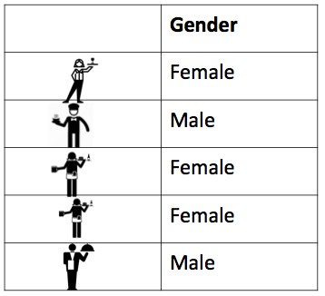

```{r setup, include=FALSE}
knitr::opts_chunk$set(echo = TRUE)
```

#Learning outcomes: 

- Univariate analysis
- Frequency
- Histograms
- Distributions
- Box plot
- Measures of central tendency
- Measures of variance


#Univariate analysis

You want to summarise your data. So let's think about this. 


Grab the crime data from Blackboard. Save it into your workin directory, and open it up with excel. 

```{r, echo=FALSE, warning=FALSE, message=FALSE}
library(tidyverse) 
library(lubridate)

gmp_crimes <- read.csv("/Users/reka/Desktop/MSCD/data/gmp_crimes.csv")

```


It should open up like this, with your **variable** names as column headers:


Under the column headers you have your `r I(nrow(gmp_crimes))` rows, one for each of the `r I(nrow(gmp_crimes))` crimes in your data. Recall that these are your **observarions**. Also, that therefore your **unit of analysis** in this data at this moment is each individual crime. 


Anyway let's say we want to talk about your variables. Like let's say that you want to talk about the variable crime type. What level of measurement does this variable have? Is it a category? (hint: yes) Does it have a meaningful order? (hint: no). So it's a nominal variable. 


Okay so we want to find out about this variable. We know it's a categorical variable, so if you've done your reading you will now know that you want to be looking at a frequency table to describe it. A **frequency table** will tell you the number of times that each value that the variable can take appears in your data. In other words, the frequency! Since each row is a crime incident, every time a particular value appears in your data, it means that a crime that belongs to that crime category occurred. 


Here's an example of a frequency table. Let's say we have this data set of waiters and waitresses who work at Lil' Bits restaurant. Here is our data in table format:




A frequency table of this would count the number of males and females in this table, and display that. Something like this: 


I hope that illustrates the concept. However in real life you are unlikely to want to manually count each occurrence of each value the variable can take in your data. Definitely would not be a fun activity with the `r I(nrow(gmp_crimes))` rows in your GMP crimes data. Luckily excel makes this much easier for us. 


##Creating a frequency table in Excel


So we will cover an excel specific concept called a **pivot table**. Something about pivot tables here. 


So you can easily create a frequency table using pivot tables in Excel. 


Basically steal steps from [here](http://documents.routledge-interactive.s3.amazonaws.com/9780415628129/Chapter%2013%20-%20Data%20exploration%20with%20Excel%20-%20univariate%20analysis%20final_edited.pdf)


You will often want to display percentage as well as/ instead of count. So you might want to say something like ...
\

#Measures of central tendency


You will often hear numeric variables summarised by the measure of central tendency, most commonly the average. To compute the average in Excel is very easy. Just click on 


White rainbow.


#Distributions

> Al Gore's new documentary is divisive. “An Inconvenient Sequel” is among the most controversial and polarizing titles of the year. Because of the politics surrounding Gore and climate change, the film divides men and women, critics and fans, and even people who saw the movie and people who are just rating it. But the movie’s aggregate rating hides many of those divisions, giving us a perfect case study for understanding a big weakness of online rating systems: separating the controversial from the mediocre. That weakness could discourage ambitious-but-controversial work.

The above is from an [article from the website fivethirttyeight](https://fivethirtyeight.com/features/al-gores-new-movie-exposes-the-big-flaw-in-online-movie-ratings/). It points out that the average IMDB rating for this film, which is 5.2, actually masks what is interesting about this film - the extent to which it polarizes people. 


We spoke about the measures of central tendencies above, and how they can be effective summaries of data, but can also mask some important information. This is a good example of that. Let's consider 6 films from 2017 which all have an IMDB rating of 5.2. This means that the average of all the ratings from all the people who have seen the film, and then scored it on IMDB. These are: 

- xXx: Return of Xander Cage
- Voice from the Stone
- Once Upon a Time in Venice
- Phoenix Forgotten
- Vengeance: A Love Story
- An Inconvenient Sequel: Truth to Power


If we only know the average score on IMDB for these movies, we would believe that they perform similarly. However we want to look at the distribution of scores as well. And that is what the guys at fivethirtyeight did. Have a look at these bar charts that demonstrate the number of people who gave each star rating to each film: 


You can see that for the other 5 films, the ratings follow what is essentially a normal distribution. Peple seem to agree on these films. Very few people think that *xXx: Return of Xander Cage* is a terrible movie, meriting a score of 1 or 2, but also very few people thing that it's great, worthy of a 9 or a 10. Instead, most people think that it's a mediocre film, and give it a 5 or a 6 out of 10. This pattern is reflected in all the other films, **with the exception of Al Gore's film**. What's going on there? Well it appears that people either love it, giving it a score of 10, or they absolutely hate it, giving it a score of 1. Because of this, when all the scores are added up and divided by the total number of people who have rated the film, we get a value in the middle, 5.2, just like we did for *xXx: Return of Xander Cage*. Except while most viewiers agree that film is mediocre, most people are **not** evaluating *An Inconvenient Sequel: Truth to Power* as mediocre. In fact we see that most people are saying it's great or it's terrible. And this is why distribution also matters. 


