# Week 3 {#week3}

## Learning outcomes

Much of statistics is about making comparisons. Human beings are not good at sifting through large streams of data; we understand data much better when it is summarized for us. This is true for looking for patterns in both *uni*variate and *bi*variate analysis. As discussed last week with univariate, when presenting descriptive analysis, we often display summary statistics in one of two ways: with tables and figures. 

Tables of summary statistics are very common (we have already created some of these last week) – nearly all published studies in criminology will contain a table of basic summary statistics describing their sample. However, figures offer a visually more appealing interpretation of our data, that allows people to easily identify trends from large amounts of information. This is also true for exploring relationships between two variables. In this course we will have a look at ways of producing these visuals (and some tables) that can help you get started in thinking about the relationships between different variables in your data. Not only do we want to be able to summarise one variable, but we want to know, is it related to another variable. Because this is where the interesting questions are that we can start asking. 

For example here are some criminological papers that explore the relationship between two variables: 

- [Do older people have higher fear of crime?](http://onlinelibrary.wiley.com/doi/10.1111/j.1745-9125.1989.tb01051.x/full) compares the variables age and worry about crime
- [Is there a relationship between adolescent drug use and psychological health?](http://psycnet.apa.org/record/1990-22928-001) compares the variable measuring psychological health with drug use in adolescence
- [Does design of a street affect burglary risk of the houses on it?](https://link.springer.com/article/10.1007/s10940-009-9084-8) looks at the variable of design of street, and considers its relationship with increased burglary risk
- [Does ethnicity affect trust in the police?](http://journals.sagepub.com/doi/abs/10.1177/1098611104271105) looks at the variable of ethnicity, and its relationship with variable measuring trust in the police.

And so on and so on and so on. You will notice that most of the research questions that criminological research attempts to address are based on comparisons. You want to be able to explore the relationship that one variable has with other variables. That is where exciting new insights come from. We will talk next week about how you can go about identifying what variables to test against each other to be able to answer your research questions, including how to measure these variables, or even define them in the first place. But today we will explore how to go about assessing any *bivariate* (meaning two-way) relationships - relationships between two variables. 

### Terms for today

- Bivariate analysis
- Categorical v categorical
    + Crosstabs with pivot tables
    + Stacked column chart
- Categorical v numeric 
    + Summaries by group with pivot tables
- Numeric v numeric
    + Scatterplot
    + Association, strength, and form of relationship
    

## Categorical v categorical

Here's an example of a bivariate frequency table. Remember **bivariate** just means that there are **two variables**.  Let's say we have this data set of waiters and waitresses who work at Lil' Bits restaurant. But this time we don't just have their gender, we also have some information about their tip earnings. We know whether they are high earners or low earners. Here is our data in table format:

Again, all we are doing with a frequency table is counting the number of occurrences. Except this time we need to know the number of occurrences of variable *pairs*. So we need to know not only the number of times that *female* appears, but when the pair of *female* and *high earner* appear. Again, I made a gif to illustrate: 

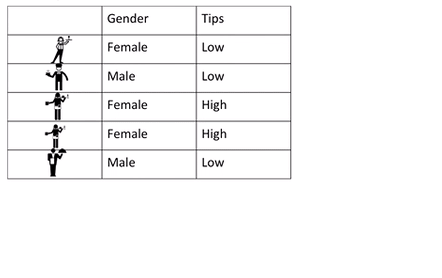

This two-way frequency table is also called a **cross table** or **crosstab**. Also a **contingency table**. We like to give the same thing many names, but just know, if you hear any of these terms, people are referring to the frequency table that considers the relationship between **two categorical variables**. 

> The table of counts for the various combinations of categories is a contingency table.
 
 - Agresti, Alan, and Maria Kateri. "Categorical data analysis." International encyclopedia of statistical science. Springer Berlin Heidelberg, 2011. 206-208.

For example, a researcher might be investigating the relationship between the class on which a passenger was travelling on the RMS Titanic (which, in case you're not familiar, was a British passenger liner that sank in the North Atlantic Ocean in 1912, after it collided with an iceberg) and whether that person survived or not. The two variables would be class (1st, 2nd, 3rd, or crew) and survived (yes/no). The question is "Is there a significant relationship between class of passenger and survival?" In this course, we don't yet learn how to answer this question with  *inferential statistics*. Instead, here we  only begin to explore this question (and other questions of comparison) using *descriptive statistics*. If you are unsure about the difference, ask now, or consult your readings from the first week. 

### Activity 1: Surviving the Titanic

So let's return to our question about survival in the Titanic. We want to know the relationship between the variable for class of passenger, and the variable for survival. First, we need some data. Data about the fate of the RMS Titanic's passengers is actually available open data, so we can use it to explore any questions we might have about it. [You can read a bit about the data here, and also find the data dictionary](http://www.public.iastate.edu/~hofmann/data/titanic.html). In this instance though, you can download the data from blackboard. As always it's in a folder under course content > week 3 > data for week 3. It is the one labelled "Titanic survivors data". Under it you will see a link to titanic3.xls. Right click and select "Save link as", and save it in your working directory you had set up for this course. 

Once you download the data open it up in excel. You should see it's the usual dimension of your variables in your columns, and your observations in your rows. Each observation is one passenger who was on board the ship. The variable "Class" tells whether the passenger was travelling 1st class, 2nd class, 3rd class, or as a member of the crew. The variable "Survived" tells whether that person has survived the RMS Titanic's collision with the iceberg or not. 

We might be interested in looking at the rate of survival by passengers who were travelling on various class tickets. For example, we might have seen the 1997 classic film [Titanic](http://www.imdb.com/title/tt0120338/) by James Cameron, and might be wondering - was there a priority given to first class passengers when boarding the lifeboats, and did that result in them being more likely to survive? Well to be able to answer questions like this, we would need to compare the survival (yes/no) between the class (1st/2nd/3rd/crew) variables. Both of these are categorical, and so to be able to talk about their relationship, we will have to build a **crosstab**.

So to do this, we return to our trusty friend, the pivot table again. But this time, instead of using it to summarise one variable, we can use it to summarise the relationship between two variables. The same way that the gif above illustrated with gender and the tips example, what this does is it counts the frequency of the combination of each category. But lets see how to do this. 

So first just create the pivot table environment to be able to build our pivot table. Just like last week, click into the **Insert** tab, click on **pivot table**  and then again on **pivot table**:

This will open a popup window, where you want to make sure that you select 'New worksheet' where it asks where your pivot table should be placed, and then click OK, again just like last week. When you click OK, excel should take you to the new worksheet where it has set up a pivot table for you, ready to get into your data, again exactly the same as last week. Remember, if the toolbar doesn't appear, or ever disappears, to summon it you have to do one simple step, which is to click *anywhere* inside the pivot table area.

 

Great, now you can create your two-way frequency table. First, drag the "Class" variable to the "Row labels" box, and also into the values box. This should produce a table that looks familiar, it's a one-way frequency table. It's what we would do if we were carrying out some *univariate*  analysis on the "Class" variable. It should look something like this: 

We can take a moment to look at the frequency table of just the class variable. It tells us how many passengers were travelling aboard the ship in each group. You can see there were the most people travelling as crew, while the least populous group is the 2nd class ticket holders. 

But to answer our question about the relationship between survival and class, we don't want *univariate*  analysis on the "Class" variable. We want to compare the survival of passengers between these classes, so we want *bivariate* analysis on the "Class" variable with the "Survival" variable.

Luckily, there is really only one more step we need to take to achieve this, which is to introduce the Survived variable into our pivot table. To do this, drag the "Survived" variable into the "Column Labels" box. Once you've done that, you should see your frequency table appear:

You can see that we have a frequency table that has the variable of *Class* as the rows, and the variable of *Survived* across the columns. Note that this is different from a data set, where each variable would be a column and each row an observation. This here is a frequency table (or cross tab, or contingency table). 

Now you might notice one thing that could be bothering you? So think back to *levels of measurement*. The "Survived" variable is categorical - nominal. However, the "Class" variable does have an order, it's categorical - ordinal.  But Excel here puts it in alphabetical order. 

You can rearrange this manually, and copy over into a new sheet. 

To rearrange the order manually just click on the arrow next to "Class" > "More sort options" > "Manual". To open a new sheet just click on the little plus sign on the bottom of your current sheet: 

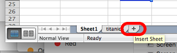

Then copy over the values from your pivot table, making sure that your rows are in order, from 1st, to 2nd, to 3rd, to crew. You can also add labels if you  like. In the end you should have something like this: 

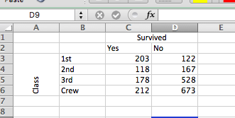

So you can see here the number of people who survived or died on the Titanic, by the class on which they were travelling. Do you see any interesting patterns? If you've heard of the incident, or watched that film with Kate Winslet and Leo Dicaprio, then you might be expecting to see more 1st class ticket holders amongst the survivors than 2nd and 3rd class, or crew. However if we look at the number of people who survived, is there a lot of difference? In fact it looks like more crew members survived than did 1st class passengers... 

But what about if you look at the column that represents the number of people who didn't survive instead? Now we see that a lot more people, volume-wise, did not survive in the 3rd class and Crew groups. But how can we make meaningful comparisons between these groups? How do we make sense of this?

One thing you will be able to use, which we approached last week, is the use of percentages, to make sense of your data. With a frequency table of only one variable, this was easy, you just consider what percentage of the whole, each cell represents. However with a **bivariate**  frequency table, we have *three* different options for percentages. We can consider the **row percentage**, the **column percentage** or the **total percentage**. And all three tell us very different things. Let's take a look. 

### Row percentage, column percentage, or total percentage

Column percentages are computed by dividing the counts for an individual cell by the total number of counts for the column. A column percent shows the proportion of observations in each row from among those in the column. Row percentages are computed by dividing the count for a cell by the total sample size for that row. A row percent shows the proportion of observations in a column category from among those in the row. Total percentages are computed by dividing the count for a cell by the total sample size - the grand total. A total percent shows the proportion of all observations in you sample that match that particular row and column combination. 

Simply put:

- **row percentage** is the percent that each cell represents of the **row total**
- **column percentage** is the percent that each cell represents of the **column total**
- **total percentage** is the percent that each cell represents of the **grand total**

In the case of the Titanic survivors data, we might be wondering three things: 

- **row percentage:** what percent of the passengers in 1st class survived vs did not survive?
- **column percentage:** what percent of the survivors were passengers in 1st class vs 2nd, 3rd class or Crew?
- **total percentage:** what percent of all passengers were those who were 1st class and survived, 1st class and did not survive, 2nd class and survived, 2nd class and did not survive, etc etc

So to calculate each one of these, we need to know each  **row total**, each **column total**, and the **grand total**. In this case, if we look at our data, our rows are represented by the classes, and the columns represent the survival (or not) of passengers (and crew). 

So the row total for the 1st class row will just be the sum of all people (both those who survived and those who did not) who had 1st class tickets. And the row total for the 2nd class row will just be the sum of all people (both those who survived and those who did not) who had 2nd class tickets. And so on, and so on. Like this: 

For column totals it's the same thing, except you are calculating the total of each column, so the total number of people who survived, by adding up survivors in 1st class, 2nd class, 3rd class, and crew, and the total of those who did not survive, adding up non-survivors in 1st class, 2nd class, 3rd class, and crew. Like so: 

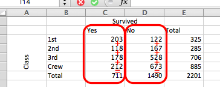

Summing the observations in either way give you a column total and a row total column. If you take the sum of those (so the sum of the column totals, that is all the people who survived and all the people who did not, **or** the sum of the row totals, which is the sum of all people in all the classes and crew), that gives you the grand total, which, incidentally, is all the people who were on board the RMS Titanic, in all classes, and whether they survived or not. In this case, that is a total of 2201 people. You can get this from either the row total or the column total, they will both equal the same thing, which is *all your observations*. 

###Activity 2: Calculating row vs column percentages

You can calculate these yourself, in the excel sheet you have downloaded from blackboard, using the `=SUM()` function, the way that we did this in the previous session. 

So now that we have these totals, we can calculate our percentages. 

To get your row percentage, you have to take each cell and divide it by the row total (and then times by 100 to get the percent value). You can do this in a new column, creating a new column for survived - Yes % and No % : 

Now you can enter the calculation as a formula for each row. Remember for something to be a formula, you will start with `=`, and then follow with your equation. Here the equation will be:

`cell divided by the total, times 100`

`cell/total*100`

So for example, for the Yes percent column for first class passengers, you have to find the cell reference for the cell that represents the number of people who survived and were 1st class ticket holders, and divide by the cell reference of the total number of first class ticket holders (your row total for this row). You can do this by typing in the reference for each cell (so typing out `C3` and `E3`) or you can do it by highlighting as well. If you're not sure how to do the highlighting approach, raise your hand now, we will come to help!

But in any case, for the cell that represents the row percentage for the yes survived and first class combination, you should have the below formula: 

`=C3/E3*100`

Once you type this, you will see the percent value appear for the percent of all first class passengers who survived: 

You will see that in the formula bar at the top, you see the formula you typed, but in the cell you see the value appear. In this case we can see that about 62.5% of first class passengers survived the sinking of the RMS Titanic. Let's calculate the values for the other cells as well: 

Row percentages allow you to talk about the percentage of each value in the variable that's displayed along the rows, in terms of the outcomes displayed across the columns. What does that mean? Essentially, you can talk about the percent of each class that belong to each survival outcome. So you use row percentages to say: 62.5% of those in first class survived, but only 25% of third class passengers did. This is the kind of stuff we can say with row percentages. You get all sorts of better insight, than just talking about the number of passengers who survived. There were 203 1st class survivors, and 178 3rd class, however this doesn't seem to be that much of a difference. But once you take into account, how many *more* 3rd class passengers were than 1st class, you can see that actually it does make a huge difference, as percentage wise, many more 1st class passengers survived. Turning your numbers into percentages tells you these kinds of things. Isn't that exciting? Well, not for Leo...

But what about column percentages? What do those tell us? Well just as row percentages tell you about the percent of the *row* values, distributed across the categories of the *columns*, column percentages tell you about the percent of the *column* values, distributed across the categories of the *rows*. In this case, the column percentages would tell us what percent of the survivors were 1st, 2nd, 3rd class or crew. Similarly it can also tell us what percent of the non-survivors were 1st, 2nd, 3rd class or crew. This is a *slightly* different story to what the row percent says. 

So why is that? Well let's look at the numbers to illustrate. To calculate the column percentages, you have to do the mirror image of what we did for row percentages, just create some new rows, one percentage equivalent for each class, so 1st %, 2nd %, 3rd % and crew %, and again for each one, populate it with a formula starting with the `=` sign, then the cell of the matching value (so C3 for 1st class survived) divided this time by the column total (C7), and again times by 100. As such: 

Repeat the same for all cells (remember how you can copy formulas by clicking on the bottom right corner of the cell there, and dragging? No? Raise your hand now to ask about it! It saves time, I swear...!)

Then you will end up with some results like this: 

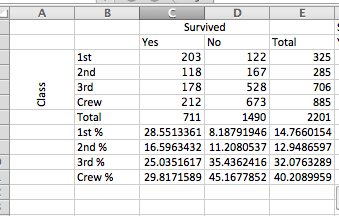

So what does that tell you? Well this tells you about the % of Survivors who were travelling in each class. So we can now see that of all the survivors, 28.6% were 1st class, 16.6% were 2nd class, 25% were 3rd class, and 30% were crew. This doesn't really illustrate any huge disproportionality, does it? Well again, that's because it doesn't compare to those who died. Instead it just looks at the distribution of the survivors between those travelling in different class. And this is why it's really important for you to consider - what is the best way of presenting the data, that considers all angles, and presents the most truthful story? There is a popular book used to teach statistics called [How to Lie With Statistics](https://en.wikipedia.org/wiki/How_to_Lie_with_Statistics). This is a good point to illustrate again, how important it is for you to understand how to make sense of data, and how to draw meaning from it, in order to be able to scrutinize what stories people may tell you. Depending on what results would be presented from this analysis, we could easily write a different headline. 

Consider this: 

**Crew save themselves before passengers - 30% of the survivors were Crew members, with 1st class passengers lagging behind at 28.6%**

The numbers in this headline are all correct. It is true that 30% of the survivors were crew members. But it doesn't take into account the original number of crew members present, from which the survivors could be selected. A very different headline would be: 

**Rich leave the poor to sink into icy ocean - 62.5% of 1st class passengers survive, compared with 41.4% of 2nd class, 25.2% 3rd class, and only 24% of crew members who made it out**

Very different conclusions, no? All from the same data. The numbers are correct, but they are framed very very differently. This is why it is so important to report all your findings, including the right statistics, as well as to be able to scrutinize other reports as well. To the first statement you might want to pose the question - OK but what percentage of the non-survivors were crew members? You would receive the figure of 45%, immediately indicating that they would be the largest group represented in the fatalities as well. Then you would begin to realise that the reason they might be a large proportion of the survivors, is because they made up such a large proportion of anyone on board, in the first place. There was simply more of them present! But when you consider their survival rate (which is illustrated better by the row percentages) you gain some insight into the inequalities. And our qualitative information from the movie Titanic further supports this finding, that we need to consider the proportion who did not make it out as well: 

I hope that illustrated a bit how you can calculate your row and column percentages, as well as what they mean, and how they help you extract meaning from your data. Usually you will only display *either* row percentages *or* column percentages, *not both*. You will have to choose which one you think is most appropriate for telling your story. 

But what about total percentages?!?! The truth is, you will very rarely use these. Total percentages tell you what proportion of all your passengers were 1t class and survivors, or 2nd class and survivors, and so on and so on. They are not frequently used to show relationships between variables. If you want to calculate them, you just have to divide each cell by the grand total (all the passengers) and times that by 100. You can go ahead and try if you want. But you won't really get a lot of insight from it, I have to tell you... So we won't even bother with them any more. 

So which one you use (row or column) is dictated by the question you ask. There's also this youtube video (made for someone called Michelle apparently... I'm not sure the backstory here, but it sounds like our video creator is excited for Michelle to get back from Spring Break, and talk about column vs. row percentages. But in any case, I'm sure that since it's on YouTube, the rest of us can use it...) where the video's creator switches between row and column percents, this can further illustrate how it makes a difference which one you use: [you can watch the video here](https://www.youtube.com/watch?v=cdvTpnHwKjs). 

If you're still unsure about these let us know, raise your hand, and we will come to help!

### A note on formatting cells

Just before we move on, I quickly want to take a side step and talk about formatting of the cells. You can see that here we see our percentages appear to very accurate precision, displayed up to 7 decimal places. This isn't always necessary. Do you think it makes a big difference to someone if you say "32% of all Titanic passengers survived" or if you say "32.303498% of all Titanic passengers survived", in terms of their understanding of what that means? In some cases it might be important to retain such precision. But often, when talking about people, (or number of crimes) it doesn't necessarily need to be so specific. So what if you wanted to format your results?

Well you can always round your numbers manually. But as always, there is a way you can just do this using excel. To do this, highlight all the cells with the percentages inside. When you have done this, right-click anywhere inside this area that you have just highlighted. A menu of options will appear. Select the option to "Format Cells..."

This will bring up another window, where on the left hand side you will see a list of possible types of data that your cell could contain. Most likely this will be set to "General" which is a pretty meaningless category. Instead, choose the "Number" option, as your cells contain numbers (percentages). When you click on the "Number" option, you will see a text box, that says "Decimal places: " in front of it. 

Here you can enter the number of decimal places you want to display. Change it to "1". Then click OK. Once you've done that, your percentages should now be displayed with only one decimal point. A bit less noise, don't you agree?

### Activity 3: Visualising the relationship - stacked bar charts, and conditional formatting

So last week we visualised frequency tables using a bar chart. This week we have two variables to visualise. Luckily we can still do this, but with a stacked bar chart. What is this? Well this time, the bar chart will have a consistent height (100%) but will be shaded according to which percentage each category takes up. Let's illustrate to make this more clear. 

We've decided that row percentages are the more meaningful of the two here for us, so let's go ahead, and highlight the cells where we have our row percentages. Once this is highlighted, select the stacked bar chart. 

Once you click on that, our chart will appear: 

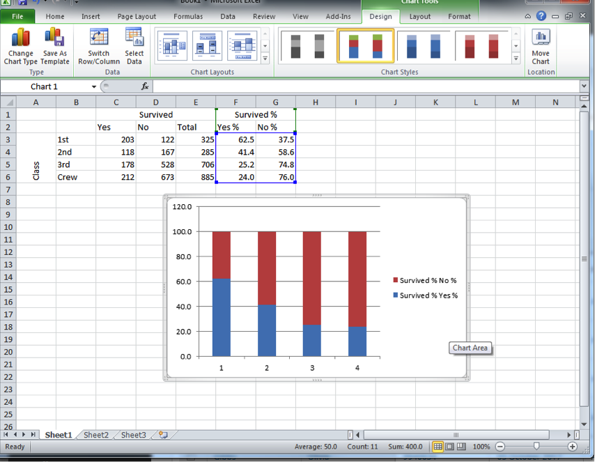

This looks about right, however you can see that our axes are not properly labelled. Each category is called 1, 2, 3, and 4, instead of 1st class, 2nd class, 3rd class, and crew. So to fix this, you can right click anywhere in the chart area, and as the little window of options appears, click on "Select data...":

This will open up another pop up window, where you should see the following:

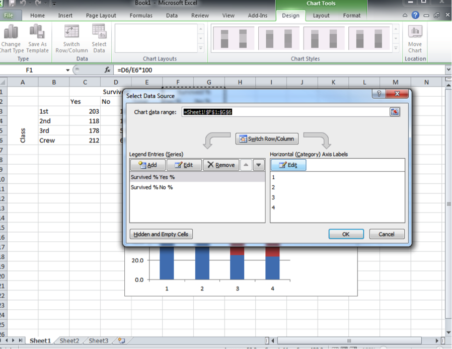

Above the right-hand box, you can see a label telling you that this is to do with the "Horizontal (Category) Axis Labels. You can click on the "Edit" button under that which will open a selection window. Select the row labels by clicking and dragging to highlight them all:

Once you hit enter it will populate, and you can click on "OK" to update your graph. You will see it updated hopefully looking like the graph below: 

you might have noticed there was an option for stacked bad with percentage next to it. This is quite handy if you have not computed row percentages. Excel will go ahead and do this for you in graph form. If you want to give this a go, go back and this time, highlight the count of the people who survived, not your percentage calculations. Now when you've highlighted that this time select the percentage graph bar charts: 

When your new graph appears, you will see that it looks exactly the same as when you created the stacked chart from your calculations. Exciting! 

You might be wondering - how does excel know that you want the row percentages, and not the column percentages, when you are creating your stacked percentage bar graph just from the counts? Well, tradition holds in data analysis that you should arrange your data in a way that the row percentages are the meaningful ones. Think about it, if I wrote the table with the survival in the rows, and the class in the columns, that still makes sense - it is still the same data, right? But then what is represented by column and by row percentages gets switched. The meaning is the same, but they are just calculated into different places. 

Another way to visually display the differences in your data, while still presenting the numbers in a table, is to use conditional formatting. To do this, select again the cells with your percentage values in it:

This time in the "Home" tab, you will see a little sign that says conditional formatting. Click on the little arrow next to it (with your data still highlighted):

Hover over "colour scales" and pick a colour scale that you think is appropriate. Often you will hear people talk about a "RAG" rating (red, amber, green). So you might want to choose a red-amber-green colour scale. However, you might want to consider that some people have red-green colour blindness. To make your representation accessible to people with this particular condition, you might actually want to use a scale that goes from red to blue. Also you want to decide what is coloured red. You can see the same colour scales on there twice, once with red at the top, and once flipped around with red at the bottom. Which one you choose is dependent on the *meaning* of your colour scale. Is a high number a good thing or a bad thing? In this case this changes between our two columns. However if we were colour-coding the number of crimes per borough for example, a table we created last week, then red would be better suited to illustrate higher numbers (so we would pick the scales with the red on top) to indicate more crimes in an area. You can also choose a neutral scale, going from yellow to green for example and so on. The choice is yours, you have options!

Here's mine anyway:

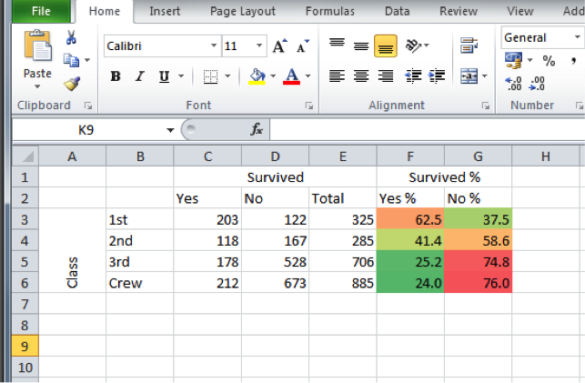

You can see that the yes % is quite a high value, an appears with an orange colour for the 1st class passengers, but for all others, it is their no % which contains the higher numbers, with dark red especially for 3rd class and crew members. Using conditional formatting in this way can help draw out patters, that further emphasise the story that the numbers in your crosstab are telling. They can be useful in reports (just make sure that whoever will be reading them will be reading on screen, or has access to a colour printer!). 

## Categorical v numeric

The Arrestee Survey, 2003-2006, was the first nationally representative survey of drugs and crime among the population of individuals representing arrest events in England and Wales. The survey aimed to provide information on a range of areas within the drugs and crime nexus, including the prevalence of problematic drug misuse among respondents representing arrest events; drug and/or alcohol consumption; availability of drugs; levels of demand (met and/or unmet) for drug and alcohol treatment services among respondents; levels of intravenous drug use among respondents; and gang membership. Topics covered include: demographic characteristics; arrest, prison history and past contact with CJS; offending and offence categories; drug and alcohol use; drug purchasing and availability; drug and alcohol treatment needs; treatment offered and received; and gang involvement. Some of the above questions were answered by self-completion questionnaire, and an oral fluid (saliva) sample was also taken.

If you wanted to have a look at this data set, you can access it through the UK data service website [here](https://discover.ukdataservice.ac.uk/catalogue/?sn=5807). However to make things easier, I have selected just a few variables for you here, and uploaded this subset onto blackboard. So go now to blackboard (course content > week 3 > data for week 3) and download the arrestees_subset file. Once downloaded onto your PC, open it up with excel. 

So the first thing we want to do is have a look at our variables. We have 5 variables, which are: 

- **Interview reference index:** This is just a reference number to identify each person interviewed. For anonymity reasons, a number is used to identify them, rather than their names 	
- **Age:**	Age of the person being interviewed, at the time of interview
- **Age at first arrest:** The age at which they person had their first arrest	
- **Number of times arrested:**	The number of times this person has been arrested, up to this point.
- **Reason for arrest:** The reason given for this particular arrest 

In the following questions, we will explore the relationship that age has with offending. In the first instance, we might want to find out the age profile for different offences. Do you think there would be a difference between the different offences that people are likely to get arrested for?

For example [joy riding is a crime traditionally associated with younger people](http://www.tandfonline.com/doi/abs/10.1080/10683160512331316343). Joyriding is associated with 'theft of vehicle' which appears in our data as a possible value for the "Reason for Arrest" variable. So we might expect for the distribution for age (a numeric variable) to be different for those arrested for 'theft of vehicle' than a crime that might be associated with an older demographic. Any ideas what crime types those could be? 

### Activity 4: Age of offenders

Let's have a look at just the possible values that the "Reason for Arrest" variable. To do this, let's start building a pivot table once again. You should be pretty comfortable with this by now. Make sure you are clicked anywhere on a cell that's part of our data set, and then go to Insert (or Data on a mac) and choose pivot table:

Now take the variable 'reason for arrest', and drag it to the "Row Labels" box. You should see all the values for the "Reason for arrest" variable :

You can see here a list of all the possible values that the "Reason for arrest" variable can take. Let's take some time to think about these categories. We've already discussed joyriding as something that is generally considered a crime to be committed more often by younger people. What about the other reasons above. Are there any other ones that you think would have a generally younger demographics? Let's take some time to guess first, just to test your possible understanding, and then check our assumptions with data. After all, that's what this course is about, right?

So, answer the following questions for me, without peaking ahead, or checking the data, just in terms of your perceptions of the relationship between age and types of offences committed:

- Which reason for arrest do you think has the oldest arrestee?
- Which reason for arrest for you think has the highest average age of arrestees?
- Which reason for arrest for you think has the lowest average age of arrestees?

Take some time to think about this. 

So now that you've hopefully chosen some categories that you think would fit the image of younger/ older age profiles, let's have a look at what the data says. In order to be able to compare a numeric variable across values of a categorical variable, we can consider different summaries across each value. Remember last week when we looked into summaries of numeric variables when considering *uni*variate analysis? Well now we do the same, create these summaries for the numeric variables, but we do this *for each value of the categorical variable*. So we can consider the minimum, the maxiumum, the mean, the median, and the standard deviation for age across each one of the values given for 'reason for arrest'. Let's have a look on how to do this. 

On our pivot table panel, grab the age variable, and drag it into the "Values" box. When you let it go, your table should look something like this: 

Have a look at this table. What does it tell you? It looks a bit strange no, these are not really numbers that make sense when we are talking about people's ages... What does 9882 mean when it comes to 'Theft of vehicle'? Well if we look back at our "Values" box in the pivot table panel it gives us an indication as to what's going on. Since we didn't specify how we want the age variable summarised, Excel has decided to select the "sum" function for us. So what we are seeing here is essentially a sum of all the ages for all arrests made for reason of "theft of vehicle". This is very hard to make sense of, and instead we would prefer to see some of our summaries that we discussed above, as well as last week when we were performing univariate analysis. So how do we do this? 

Well on the right hand side of the item "Sum of Age" in the Values box there is a little letter "i". This is on a mac so on a PC it might be a downwards arrow. Whatever it is, click on it, and a new popup window will appear. 

If you're on a PC, when you click on the downward arrow this set of options will appear: 

In this case select "Value Field Settings..." - this is the same as the steps we followed last week to add the column of percentages for out univariate frequency table. Then the popup that appears will look roughly the same, with the option to change the Field Name (as "Custom Name") and the Summarize by (as "Summarize Values By"). 

In the new popup window, you can see that you have a list of options in a window under the description that says "Summarize by". You can see that initially (by default) this is set to sum: 

Change this to select "Average", like so: 

Click OK, and you will see your column updated: 

<!--

The label for the column in this table though still says "Total" which is not a hugely meaningful name, is it? Re-write this (simply by clicking in the cell and deleting "Total" and writing its new name). For example here I've re-labelled it to say "Average Age":

-->

So now we have a column that tells us the average age of people arrested for each value of the variable "Reason for arrest". So which one has the highest average age? It appears to be "Sex Offence" with an average age of 35 years old for people arrested for this reason. Is this what you were expecting? Did you choose something different? What is the average age for the value for reason of offence that you thought would be oldest? Were you far off? Take a moment to chat about this with the person next to you. Hopefully you might find these results interesting, and therefore are getting some insight into offender demographics for various crime types. Our youngest average age of offenders does appear to be in the theft of vehicle category. 

But remember our first question - *Which reason for arrest do you think has the oldest arrestee*? Well this question is not answered by the average age column here. And also, we discussed last week why the mean alone is not always the best summary of our data. We might want to know about the spread, and the variance as well. So let's add a few more columns to our summary statistics table here. To do this, just drag "Age" to the "Values" box again and again, and each time, click on the little i (or arrow) and select what summary you want to display. So to add a new column, for minimum value you would drag age, and select minimum, like so: 

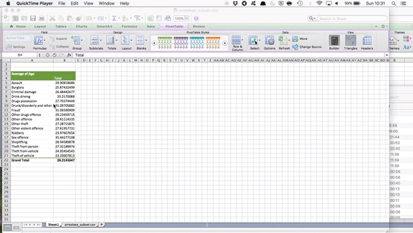

Now do this again to create a column for maximum, and another column for standard deviation to be able to talk about variance as well. 

In the end your table should look like this: 

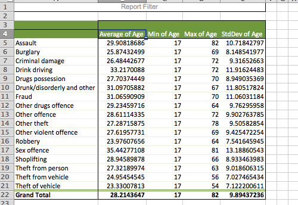

If it doesn't, just raise your hand and we can come around to help you get there. 

Note: for creating the standard deviation column you have two choices there, StdDev and StdDevp. The one to choose will depend if you would like to know the standard deviation of your sample or your population. We will speak about this more next week, but you can imagine that the data we have come from a *sample* of people, who are used to draw conclusions about the whole *population*. Rather than interview everyone who has ever been arrested, we rely on gathering data from the interviews of enough people that we can make generalisations. These people who we actually speak to, they are our sample. Once we use inferential statistics, we can use data from the sample to make generalisations about the whole population. But with descriptive statistics we are actually talking only about our sample. So in this case you want to select  *StdDev* and **not** *StdDevp*. If you're confused about this ask now!

Right, so now, we can finally answer our first question, *Which reason for arrest do you think has the oldest arrestee*? So, which is it? 

Well the oldest arrestee appears to have been arrested for *Assault*, at the age of 82 years old. Is this the category you were expecting the oldest offender in our sample to appear? Why or why not? Take a moment to try to interpret the data. It's important to always return to the meaning that we can extract from our numbers. Talk to someone next to you about this. 

The other interesting column here to pay attention to is the standard deviation (the minimum age column is not super exciting. People under 17 were excluded from the survey, and so the youngest possible age in the sample is 17. It appears that at least one 17-year-old was arrested in every single one of these offence categories.) But the standard deviation, that tells us something new. Remember that it is a measure by which we can describe the variation of our individual observations around the mean. So the larger the standard deviation the larger the variation around the mean age in a particular subset of our data. Which offence category has the highest standard deviation? Which has the lowest? 

Theft of and theft from vehicle both have a standard deviation of about 7, as well as young mean ages. It appears that these crimes are mostly committed by younger offenders, with only a few of them committed by older offenders. Sex offences however appear to have a greater standard deviation, where offenders come from all ages. Any particular reasons why you think this might be the case? 

Now finally, before we move on, there is something you might have noticed. We did not include the **median** in our summary. Did you see it anywhere in your drop down menu, when selecting how to summarise the "age" variable? Well for some reason it's not as easy as calculating the other ones. Instead, to display the median we have to rely on building our own formulas. But you're getting good at formulas by now, so let's give it a go!

### Activity 5: Adding a column for median

To add a column for median, we will have to use something called an "IF" statement in Excel. The IF function is one of Excel's logical functions, used to return one value if a condition is true and another value if it's false. We can use that here, because we want to include a value in our calculations *if* if belongs to the value of reason for offence that we are calculating the median for. If it's any of the other offences, we *do not* want to include it. 

It might help to think about this conceptually, before we write the formula. Let's say we go through our data row by row. Remember in our data, each row is one arrestee who was interviewed. We want to go through every one of these people, and include their age in our calculation for the median ror each offence category, **only if** the reason that that particular person was arrested *is* the offence category for which we are calculating the median. 

So for every person, we want to check if their value for *reason for arrest* is the one we are currently interested in. 

For example, if we are calculating the median age for theft of vehicle, for every line we first need to make sure that the value in the *reason for arrest* column is equal to *assault*. If it does, then we use that person's age to calculate mean age for theft of vehicle. If it is not, we do not. 

How would you write this in a formula? Well for assault we could say something like: 

`include IF 'Reason for arrest column' = 'assault'`

Now we just have to translate this to excel language, and put it inside a median calculation formula. Remember this one from last week? It's simply `=MEDIAN()`. 

Now we also have to refer to some cells. You can select these values by simply clicking on the cells that you need, but I'll go through the notation here again, just as a refresher. 

To specity what sheet you are taking your data from, you put the sheet name followed by an exclamation mark (`!`). So to refer to columns that are on the arrestees_subset.csv sheet, Excel notation for that is: `arrestees_subset.csv!`. 

A cell you refer to by the letter of the column it's in, and the number of the row that it's in. So the cell that contains the value for "Assault" is "A5". However, when you copy references, this will change. If you wanted to statically **always** refer to A5 you have to use the dollar sign in front of each element (row letter, column number). So if I always want A5 to be the cell I refer to, I would type: `$A$5`. 

And to refer to a range of values, you denote them as `first value:last value` . SO to get all the values from row 2 of column E to row number 19897 of column E, I would type: `E2:E19897`. And if I wanted to make sure that I **always** refer to these values, again I just inject a `$` in front of the column reference (E) and the row reference (2 and 19897). Like so: `$E$2:$E$19897`. 

Now building it all together, for assault, we could calculate the median like so: 

`=MEDIAN(IF(arrestees_subset.csv!$E$2:$E$19897=A5,arrestees_subset.csv!$B$2:$B$19897))`

Just to re-iterate again, this is what each part of this formula does:

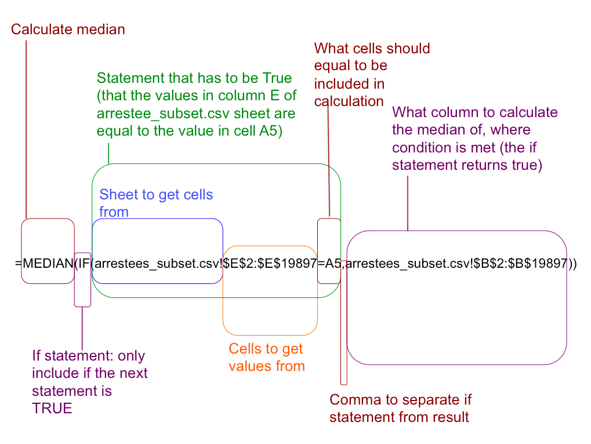

When you are comfortable with this formula, paste it over into the cell in the new "median" column you've created in your table, and hit Ctrl+Shift+Enter. 

**NOTE: Hit Ctrl+Shift+Enter** This is important! *Don’t just hit enter* to complete the formula. You must hold Ctrl+Shift+Enter down together to complete the formula and tell Excel that it is an array formula. Excel will add curly braces around the formula if this is done correctly:

You can simply copy the formula by double clicking on the bottom right hand corner of the cell, or grabbing it and dragging it down. Whichever option you prefer, they achieve the same thing. After which you will end up with a brand new column you made all on your own, for the median: 

Now, finally you have a median column in your pivot table as well. You can now begin to think about what the difference between mean and median means in terms of the skew in your data as well. We don't seem to be getting huge differences, and this can potentially be put down to our *large sample size*. We have almost 20,000 rows in this data, which is 20,000 people who were interviewed and answered all these questions. We'll speak more about the importance of sample size later in the course, but now you know, that your means and your medians are not too far apart in either of the offence categories people were arrested for, with a maximum difference of around 3 years. 

<!--

### Visualising the differences between groups

Remember that we spoke about box plots last week? You had the option of having a go at making one, but we didn't get too much into it. Well that's because the strength of the boxplot lies more in comparing groups, so in other words, in *bi*variate analysis, rather than *uni*variate analysis. 

Now to be able to visualise the differences with boxplots, you will need all the 5 elements of the 5 number summary in your table, separated out by all the possible values for reason for arrest. We already have the minimum and the maximum, and the median, but we are missing Q1 and Q3, our first and third quartile. To calculate these, we can use the same approach as we used to calculate the median, by making use of the `IF` function of Excel. Except this time, instead of the `MEDIAN()` function, we use the `QUARTILE()` function. And remember that for the `QUARTILE()` function you also have to add a number at the end, between 0 and 4, indicating if you want the minimum value, the 1st quartile, the median, the 3rd quartile, or the maximum value. 

So create two new columns, next to where you created the median column, one for Q1, and one for Q3: 

Then you simply amend your formula. So to get the first quartile (Q1) for Assault, you simply put: 

`=QUARTILE(IF(arrestees_subset.csv!$E$2:$E$19897=A5,arrestees_subset.csv!$B$2:$B$19897),1)`

and to get the 3rd quartile, you would put:

`=QUARTILE(IF(arrestees_subset.csv!$E$2:$E$19897=A5,arrestees_subset.csv!$B$2:$B$19897),3)`

**Remember to hit ctrl+shift+enter instead of just enter** 

Again, a breakdown of what everything in the formula means: 

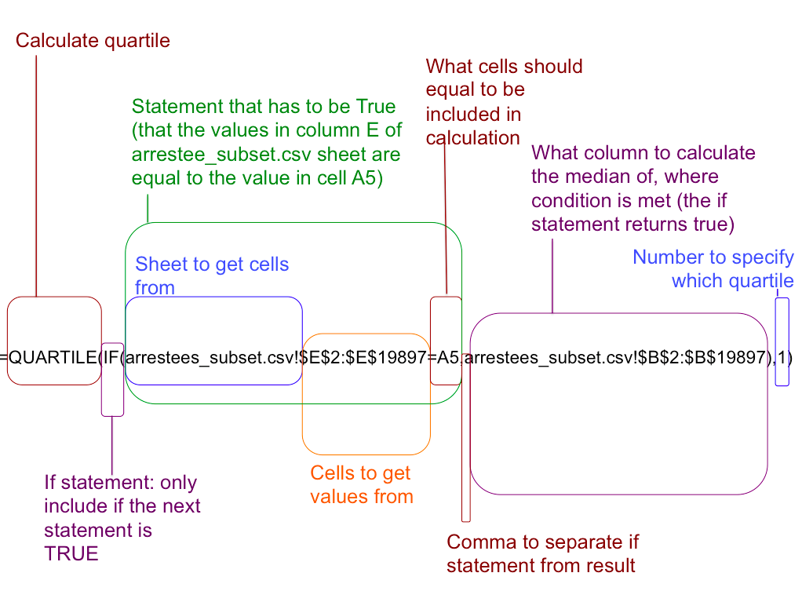

In the end, you should end up with a table of values just like this: 

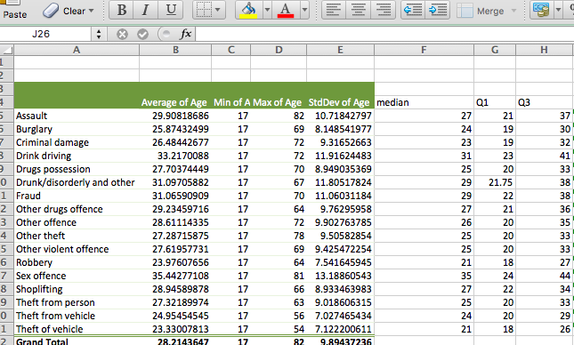

Now we have all of our 5 numbers for our 5 number summaries for all of our possible values that the categorical variable *reason for arrest* can take. This is all the information that we need in order to be able to visualise the difference in the numeric variable (age) across the values for the categorical variable (reason for arrest). 

So as a first step, you will have to compute some distances between some of our 5-numer summary values.
We will put each one in a new column. We need: 

- `Q1 - minimum`
- `median - Q1`
- `Q3 - median`
- `maximum - Q3`

You can create these with simple mathematical functions in excel. Remember that you always start a function with `=`, and you can identify cells by either naming them (so typing out `A5`, or by click on them). 

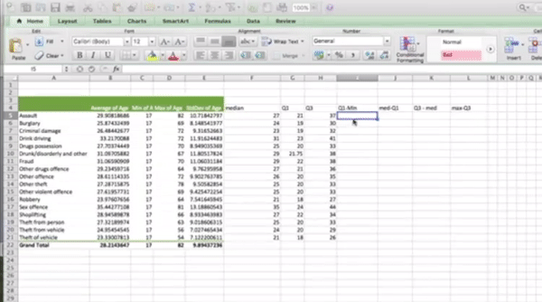

This final group of statistics holds the values you put directly into the box-and-whisker plot. Why is this group necessary?

You can turn a Stacked Column chart into a box-and-whisker plot. In a stacked column, each segment’s size is proportional to how much it contributes to the size of the column. In a box-and-whisker box, however, the size of a segment represents a difference between one value and another — like the difference between the quartile and the median, or between the median and the first quartile.

So the box is really a stacked column with three segments. The first segment is the first quartile. The second is the difference between the median and the first quartile. The third is the difference between the third quartile and the median.

But wait. Won’t that just look like a column that starts at the x-axis? Not after you make the first segment disappear!

The other two differences — between the maximum and the third quartile and between the first quartile and the minimum— become the whiskers. Let's see for ourselves. I've adapted the steps from [statistical Analysis with Excel For Dummies by Joseph Schmuller](http://www.dummies.com/education/math/statistics/box-and-whisker-charts-for-excel/) that make use of these statistics and a stacked bar chart to build your very own boxplots, to compare the distribution of the numeric variable of age across the values for the categorical variable of reason for arrest. 

So first, highlight the columns for `Q1`, `med-Q1`, and `Q3-med`. You can highlight multiple columns that are not connected to each other by holding down the `cmd` button on a mac, or the *??* button on a PC. 

So make sure all 3 columns are highlighted, and then select a stacked column graph from the *Charts* tab on a mac, or *Insert* tab on a PC: 

A chart like this should appear: 

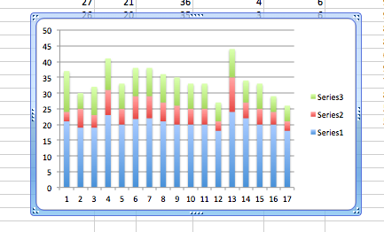

First, let's create the bottom whisker. To do this click on any one of the bottom (blue in the chart above) segments of the stacked bar charts. Then select "Chart Layout" tab, and then on there, click on the "Error Bars" option: 

Select "Error Bar Options...":

This will bring up a new popup window. Make sure that the "Error Bars" tab is selected on the left hand side. Then select the "Minus" option under Display, and under "Error amount" tick the button next to "Custom". Once you've done that, click on the button that says "Specify value":

This brings up a new window, where you can select the value for the positive and negative error. Leave the positive as it is, and click inside the box next to "Negative Error Value", and then highlight the values in the `Q1-Min' column. Then click OK, like so: 

This will take you back to the original window, where you just need to click "OK" and you will see the bars appear. 

Now you want to take away the background bar so to do this, click on the blue bars again. Make sure that you click on the blue bars, and **not**  the error bars that you just created. When you have highlighted the blue bars, select the "Format" tab, and there you will see an option for "Fill" and "Line". Set the fill to "No fill" and the line to "No line": 

This should make the blue part disappear. 

Alright now let's make the top bar. This time click on the top bar (here in green) and again click on chart layout, error bars, error bar options... :  

This will open the pop up window again. This time select "Plus" under "Display", and again check "Custom" and click on "Specify Value":

This time, leave the "Negative Error Value" as it is, and click inside the box next to "Positive Error Value", and then highlight the values in the `Max-Q3` column:

Click on OK, and then again, and you should see the top whiskers appear like so: 

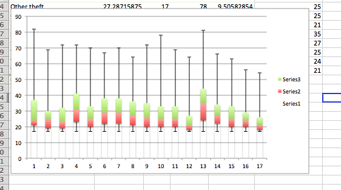

So now you just have to change the formatting on the green and red parts, by clicking on each, and going again into the formatting tab, and selecting "No fill" for fill, and just a black colour for the outline under "Line":

Then, finally you should have a box plot that shows you the distribution of the numeric variable of age across each reason for offence: 

There is one last step to do though. The labels aren't very meaningful. They are just 1-17. Let's change these to meaningful labels. To do this, click on the labels, and right click, which should make a set of options appear. Click on "select data...":

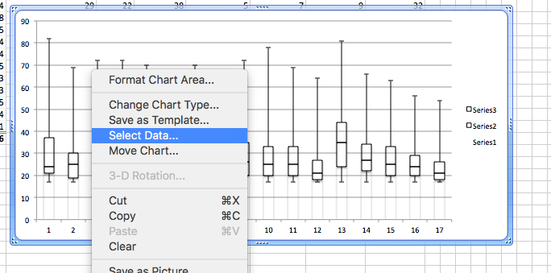

This will open a new window. Click in the text box next to "Category (X) axis labels", and highlight the names of all the values for "reason for arrest" which we have here in column A: 

Then click "OK" and ta-daa you have a boxplot comparing the age distribution of people arrested for each one of these offences:

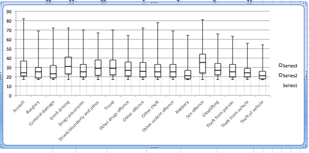

You can see that you tend to get younger arrestees for robbery as well as theft of vehicle. You can also see that the offences with older age groups being more represented are sexual offences, but also drink driving, drunk and disorderly, and also fraud. Of course there is quite a lot of overlap between the categories. 

-->

## Numeric v numeric

Regarding descriptive statistics to explore the relationship between two numeric variables in our sample, to analyse the relationship between two quantitative variables, we consider how one variable, called a response variable, changes in relation to changes in the other variable called an explanatory variable. Graphically we use scatterplots to display two quantitative variables, as comparing two numeric variables is best achieved through the use of graphics and visualisation. As you might imagine, it becomes very difficult to create any sort of crosstabs between numbers. Instead, you want to be able to determine whether there is a relationship between two numbers in other ways. We'll illustrate with two other variables from the arrestee survey. Let's consider the relationship between "Age at first arrest" and "Number of arrests". We might be interested about this if we are thinking about criminal trajectories, for example [delinquency careers](http://www.journals.uchicago.edu/doi/abs/10.1086/449107) or [life course trajectories](http://onlinelibrary.wiley.com/doi/10.1111/j.1745-9125.1995.tb01173.x/full). 

What would our inclination be? Clearly if the person has their first arrest earlier on in life, they have a lot more time to also have some more arrests. Or they might have an early arrest and part take in some sort of intervention whereby they turn their life around, and never offend again. In other words, we are thinking that either **as age of 1st arrest decreases, number of arrests will increase**, or we think that **as age of 1st arrest decreases, number of arrests will also decrease**. These two scenarios describe two different kinds of relationships, a positive relationship or a negative relationship. In either scenario we assume that as one goes up the other one goes up or as one goes up the other one goes down, but that this takes a linear relationship. If you imagine one numeric variable across the x axis and another cross the y axis, a positive and a negative relationship would look something like this: 

*Note:* 
The figure above shows you what a perfect positive relationship would look like, or a perfect negative relationship would look like. It also assume a **linear** relationship. This just means that we are looking at a "straight line trend " between the two variables. 

So as discussed, a graphical representation, in this case a scatterplot is the most useful display technique for comparing two quantitative variables. We plot on the y-axis the variable we consider the response variable and on the x-axis we place the explanatory or predictor variable.

How do we determine which variable is which? In general, the explanatory variable attempts to explain, or predict, the observed outcome. The response variable measures the outcome of a study. One may even consider exploring whether one variable causes the variation in another variable – for example, a popular research study is that taller people are more likely to receive higher salaries. In this case, age at first arrest would be the explanatory variable used to explain the variation in the response variable number of arrests.

In summarizing the relationship between two quantitative variables, we need to consider:

- Association/Direction (i.e. positive or negative)
- Form (i.e. linear or non-linear)
- Strength (weak, moderate, strong)

A scatter plot is a useful visual representation of the relationship between two numerical variables (attributes) and is usually drawn before working out a linear correlation or fitting a regression line, which are the next steps that you would take, if you were to also perform *inferential statistics*. The resulting pattern indicates the elements of the relationship outlined above, the association, the form, and the strength of the relationship between two variables. 

So what are some examples of correlations? Here are a few: 

- [Interactive Correlation Matrix and Scatter Plot All NBA Team Statistical Data 1951-2015 Seasons](http://asbcllc.com/blog/2014/december/nba_team_corr_matrix/scaled/)
- [Scatterplot of the Relationship Between Rotten Tomatoes Tomatometer Score and Box Office Revenue for Movies, for each movie genre](http://rebrn.com/re/relationship-between-rotten-tomatoes-tomatometer-score-and-box-o-2558335/)
-[Correlation between statewise obesity and voting for Trump](https://fsmedia.imgix.net/af/f3/d7/f5/b2df/470f/8f8c/4b41daf55348/the-correlation-between-trump-voters-and-obesity-has-a-strong-positive-correlation-at-0717.png?auto=format%2Ccompress&w=700)

You can understand the basic premise. 
### Activity 6: Does age at first arrest correlate with total number of arrests?

So let's build one for our arrestees. Since we are trying to explain number of arrests with the age of first arrest, we would plot on the y-axis the variable we consider the response variable (number of arrests) and on the x-axis we place the explanatory or predictor variable (age of first arrest).

First, just return to the excel spreadsheet where you have your data. Firstly arrest the two columns that contain our variables of interest: 

Then select charts > scatter > marked scatter:

The graph that initially appears might look something like this: 

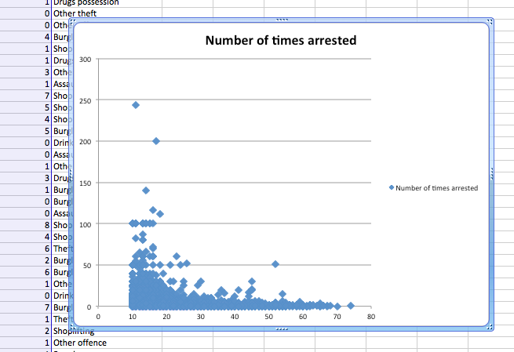

You can see that actually we have age of first arrest on the x axis, and number of arrests on the y axis, as we prefer. If this was not the case, you can change this by right clicking anywhere on the chart, and selecting "Select Data..." on the options that pop up: 

 

and then on the popup there is an option to switch row/column: 

But in this case we are alright. One thing you should do though, is label your axes. Although, we might be able to infer that the axis with a value that goes up to 300 is not *likely* to be the one for age, it's always nice to have some certainty, and axis labels will provide this. To do this, click anywhere inside the chart, and click n the "Chart Layout" tab:

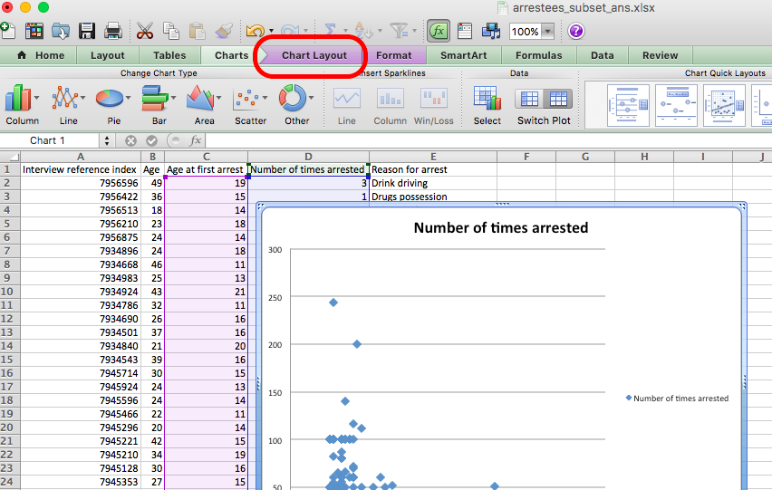

Then click on the "Axes" option, and for both horizontal and vertical axes add a title:

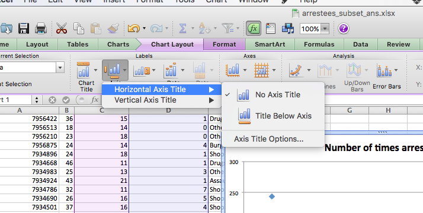

You can also stylize your scatterplot, make it look the way that you are most happy with it. [Here are some tips on making your graphs look pretty](http://strategyandanalytics.com/5-steps-creating-beautiful-eye-catching-charts-excel/). Here's mine:

So let's try to infer our indicators of the relationship between the two variables. What about association/direction? Form? And strength? Well the easiest way to think about this is to think about drawing a *line of best fit*. Could you draw a straight line through the cloud of points? If yes what does this line look like? 

We can ask Excel to draw this line for us. You can do this by going back to the "Chart layout" tab, and this time clicking on the "Trendline" option: 

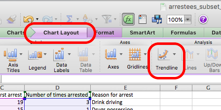

From the dropdown options, select "Linear trendline": 

Now you can see your trendline appear: 

So what does this line look like? Well it definitely has a negative slope (it's pointing down, rather than pointing up). Therefore, in terms of the direction of the relationship, we can conclude that it is negative. In terms of strength, we want to look at the slope of the line. We saw above what a perfect linear relationship looks like. It's a slope of basically one-to-one. In this case it would mean that for every one year earlier that someone has their first arrest, they have one more arrest. We can see that the slope of our line is very close to *no slope* or a slope of zero, because it is essentially a straight line. To give you an idea of weak/strong relationships based on slope of a line, here is a handy image: 

You can imagine here that our relationship is quite weak, as it is close to a zero slope. Finally is the relationship linear or non linear? Well how well does this straight line represent your data? And where the points deviate from the line, do they do so in a systematic manner? To be fair, this question is a bit tough to answer, just on visual assessment through a scatterplot alone. As is the strength without a numeric interpretation of the slope. 

So far we have visualized relationships between two quantitative variables using scatterplots, and described the overall pattern of a relationship by considering its direction, form, and strength. We noted that assessing the strength of a relationship just by looking at the scatterplot is quite difficult, and therefore we need to supplement the scatterplot with some kind of numerical measure that will help us assess the strength. This is what inferential statistics like correlation coefficients will be able to do, but that's for the future. 

Even though in the rest of the time we talk about these we are going to focus only on linear relationships, it is important to remember that not every relationship between two quantitative variables has a linear form. There are several examples of relationships that are not linear. The statistical tools that will be introduced here are appropriate only for examining linear relationships, and as we will see, when they are used in nonlinear situations, these tools can lead to errors in reasoning. While we don't require it for this session, if you wanted to read up a bit about identifying linear vs non-linear relationships [here](http://blog.minitab.com/blog/adventures-in-statistics-2/linear-or-nonlinear-regression-that-is-the-question). 

But based on our observations, we can say that there appears to be a very weak negative relationship between the age of first arrest, and the number of times that someone has been arrested to date, in our sample of arrestees interviewed as part of this arrestee survey. And we can support this with our scatterplot as well. 

### Correlation does not mean causation

You may have heard this phrase before - that correlation does not mean causation. This is important to mention here, and for you to take this forward. Just because two variables show a relationship, even if it is a strong relationship, it does not mean that one actually causes the other, no matter how attractive telling that story would be.

There is an interesting site here that has a lot of **spurious** correlations. Spurious correlations are when there is a strong correlation between two or more variables that are not causally related to each other, yet it may be wrongly inferred that they are, due to either coincidence, or the presence of a certain third, unseen factor (referred to as a "common response variable", "confounding factor", or "lurking variable"). A good example is the relationship between drownings and ice cream. Ice cream consumption per capita increases at the same rate as people drowning in pools. But if you think about why this might be, I think you might struggle to find a reason why ice cream would cause drownings. But there is something that would cause an increase in both...! And that is the temperature. As temperature increases, particularly in the summer, there are more people outside, buying ice cream, but also more people outside swimming in pools, lakes, and rivers. 

Have a listen to this [ted talk](https://www.youtube.com/watch?v=8B271L3NtAw) which explains better. 
 

Spurious correlations are all over the place, and while sometimes they are very obvious, for example, here is one that correlates the number of films that Nicholas Cage has appeared in, and the number of people who drowned by falling into a pool: 

([and you can see more strange correlations here](http://www.tylervigen.com/spurious-correlations))

But in other cases its much more subtle. And can happen between variables that you can weave together a very nice story or explanation as for why they should be related. No matter what, you should think about these examples always when you are looking at correlations. We will talk later about study design, especially in relation to being able to infer causality, but do make a note now, to keep in mind in the future, that *correlation does not prove causation*. 

## Summary

In sum, you should now be able to begin to make comparisons between two variables in your data set, and talk about the possible relationships between them, and support (or question) the assumptions that you might have with some evidence. You should be comfortable with the following terms: 

- bivariate
- crosstab (or two-way frequency table, or contingency table)
- row percentage
- column percentage
- stacked bar chart
- conditional formatting
- producing summary statistics by groups
- if statements in excel
- association/ direction of a relationship between numeric variables
  + positive relationship
  + negative relationship
- form of a relationship between numeric variables 
  + linear relationship
  + non-linear relationship
- strength of a relationship between numeric variables
  + weak
  + moderate
  + strong
- scatterplot
- trendline
- correlation
- correlation does not mean causation

