# Week 5 {#week5}

## Learning outcomes

This week we are interested in in taking a step back even further from the analysis of data than last week. Last week we spoke about conceptualisation and operationalisation, the steps that you take as a researcher to turn your ideas and topics of interest into variables to measure. But how do you then go about designing your research study? We talked a bit about sampling, the ways that you select your sample to collect information from, and how you ensure that this is done in a way that reflects the population, about which you want to be drawing conclusions. This week we take a step back, conceptually, to the highest level of research oversight, to consider the process of research design, and consider the various ways that you can go about collecting data. 

Much of the data that we work with are collected as part of research. There are many many different approaches to this process, and you will have come across a good sample of them in your readings.  Research design can be described as a general plan about what you will do to answer your research question. Research design is the overall plan for connecting the conceptual research problems to the pertinent (and achievable) empirical research. In other words, the research design articulates what data will be required, what methods are going to be used to collect and analyse the data, and how all of this is going to answer your research question. Both data and methods, and the way in which these will be configured in the research project, need to be the most effective in producing the answers to the research question (taking into account practical and other constraints of the study). Different design logics are used for different types of study, and the best choice depends on what sorts of reaserach questions you want to be able to answer. 

Since your reading provides a comprehensive overview of different types of research designs, I will not attempt to replicate this here. Instead I will cover some general practical points, with focus on two different study designs. These are experiments, and longitudinal studies. However the skills we will practice today are relevant for data collected from various research resigns. For example, missing data is something that is an issue for cross sectional studies as well as longitudinal ones. Similarly, the Gantt chart as a way to plan your study design can be applied to any form of research design. 

### Terms for today

- Research Design
- Evaluation & Experiments
    + RCT
    + Working with experimental data
    + Meta-analysis (a note on the tip of the evidence-pyramid)
- Longitudinal Study Designs
    + The importance of time
    + Linking data 

## Research Design 

When you're designing your research, and developing your research design, you can imagine yourself as the architect of the research project. You lay down the blueprints and identify all the tasks and elements that will need to be realised in order for your research project to be successful. The type of research design used in a crime and justice study influences its conclusions. Studies suggest that design does have a systematic effect on outcomes in criminal justice studies. For example, when determining the effect of an intervention (known as evaluation research, as you are *evaluating* the effect of the intervention), when comparing randomized studies with strong quasi-experimental research designs, systematic and statistically significant differences are observed ([Weisburd et al 2001](http://cebcp.org/wp-content/publications/Does%20Research%20Design%20Affect%20Study%20Outcomes.pdf)). 

Those interested in the study of criminology and criminal justice have at their disposal a wide range of research methods. Which of the particular research methods to use is entirely contingent upon the question being studied. Research questions typically fall into four categories of research: 

- (1) *descriptive* (define and describe the social phenomena), 
- (2) *exploratory* (identify the underlying meaning behind the phenomena), 
- (3) *explanatory* (identify causes and effects of social phenomena), and 
- (4) *evaluative* (determine the effects of an intervention on an outcome). 

Your readings will have gone through a lot of examples and details about each one of these approaches, and what research design you can use to answer which sort of categories of research questions. These books give you a fantastic theoretical overview of the methods, and so I will not reiterate those here. Instead I will try to focus on the practicalities associated with some research designs. While I will use the example of evaluative research here, you can use similar methods when appropriate for all sorts of research design. 

## Experiments and evaluation

Experimental criminology is a family of research methods that involves the controlled study of cause and effect. Research designs fall into two broad classes: quasi-experimental and experimental. In experimental criminology, samples of people, places, schools, prisons, police beats, or other units of analysis are typically assigned (either randomly or through statistical matching) to one of two groups: either a new, innovative **treatment**, or an alternate intervention condition (**control**). Any observed and measured differences between the two groups across a set of “outcome measures” (such as crime rates, self-reported delinquency, perceptions of disorder) can be attributed to the differences in the treatment and control conditions. Exponential growth in the field of experimental criminology began in the 1990s, leading to the establishment of a number of key entities (such as the Campbell Collaboration, the Academy of Experimental Criminology, the Journal of Experimental Criminology, and the Division of Experimental Criminology within the American Society of Criminology) that have significantly advanced the field of experimental criminology into the 21st century. These initiatives have extended the use of experiments (including randomized field experiments as well as quasi-experiments) to answer key questions about the causes and effects of crime and the ways criminal justice agencies might best prevent or control crime problems. The use of experimental methods is very important for building a solid evidence base for policymakers, and a number of advocacy organizations (such as the Coalition for Evidence- Based Policy) argue for the use of scientifically rigorous studies, such as randomized controlled trials, to identify criminal justice programs and practices capable of improving policy-relevant outcomes. 

- [Experimental Criminology by Lorraine Mazerolle, Sarah Bennett](http://www.oxfordbibliographies.com/view/document/obo-9780195396607/obo-9780195396607-0085.xml)

- How much crime does prison prevent--or cause--for different kinds of offenders?
- Does visible police patrol prevent crime everywhere or just in certain locations? 
- What is the best way for societies to prevent crime from an early age?
- How can murder be prevented among high-risk groups of young men?

These and other urgent questions can be answered most clearly by the use of a research design called the "randomized controlled trial." This method takes large samples of people--or places, or schools, prisons, police beats or other units of analysis--who might become, or have already been, involved in crimes, either as victims or offenders. It then uses a statistical formula to select a portion of them for one treatment, and (with equal likelihood) another portion to receive a different treatment. Any difference, on average, in the two groups in their subsequent rates of crime or other dimensions of life can then be interpreted as having been caused by the randomly assigned difference in the treatment. All other differences, on average, between the two groups can usually be ruled out as potential causes of the difference in outcome. That is because with large enough samples, random assignment usually assures that there will be no other differences between the two groups except the treatment being tested.

Watch this [6 minute video from Cambridge University to learn a bit more about experimental crim](https://www.youtube.com/watch?v=IGDF1-B1Yjs&feature=player_embedded) If you are on the BA Crim programme, you may have seen this video in your lecture for Criminal Justice in Action, when learning about how criminology has an impact. 

And then [this video that describes the Philadelphia foot patrol experiment](http://www.cla.temple.edu/cj/center-for-security-and-crime-science/the-philadelphia-foot-patrol-experiment/). Pay attention to how the blocks are assigned to the treatment (foot patrol) and the control (normal, business as usual policing) groups. 

**Do take the time to watch the videos above**, they will help you understand how and why we can use experiments in criminological research! Take time to get through these, it will help, but also I hope that they are interesting examples of criminological research in action! Quantitative criminology isn't all about sitting around playing with spreadsheets and reading equations - we do get out sometimes, and get to have an impact on things like policing :)  So watch the above two films, I'll wait here. 

Evaluation of programmes is very important. As you heard the police chiefs explain in the Philadelphia video above, it can make the difference between investing in a helpful intervention (foot patrols in this case) or not. By being able to quantify the crime reduction effect that foot patrols had on particular areas, it became possible to support and lobby for these to be implemented. 

While it's great that evaluations can be used to build a case for effective interventions, it is equally important to know whether something doesn't work. Have you heard of the scared straight program? The term “scared straight” dates to 1978, and a hit documentary by the same name. The film featured hardened convicts who shared their prison horror stories with juvenile offenders convicted of arson, assault, and other crimes. The convicts screamed, yelled, and swore at the young people. The concept behind the approach was that kids could be frightened into avoiding criminal acts. 

It is an idea that has also been tested in drivers’ education classes across the US. For several decades beginning in the 1960s, many soon-to-be-drivers watched a graphic video of mangled bodies being pulled from automobile wreckage – described in one magazine review as a “twenty-eight-minute gorefest” meant to deter reckless driving.

You can see how people are immediately averse to this idea. It is, quite obviously distressing to kids that are being subjected to these scared straight programmes, through the yelling, the gruesome violence, and so on. But if the end result is that this shock and horror deters kids from offending, or young drivers from being careless on the roads, then it might be considered a "necessary evil", right? It might be short-term pain inflicted, but in the interest of long-term gain, whereby these kids will avoid a life of offending, or ending up in a horrible road traffic collision. But in order to make this argument, we need to be able to tell - does this work? 

To be able to answer such questions we can devise experiments, in the form of research design of experimental and quasi-experimental research. Some scholars believe that experimental research is the best type of research to assess cause and effect (Sherman; Weisburd). True experiments must have at least three features: 

- at least two comparison groups (i.e., a treatment group and a control group), 
- variation in the independent variable before assessment of change in the dependent variable, and 
- random assignment to the groups.

*What do each of these mean?*

Well first we need to establish our dependent and independent variables, to determine what we expect is evoking a change in what. 

What is a **dependent variable**? It's what you are looking to explain. Remember in week 3, when we were talking about bivariate analysis to assess the relationship between two variables? And we spoke about one of them being a **response** variable and the other the **predictor** variable, and how do we determine which variable is which? In general, the explanatory variable attempts to explain, or predict, the observed outcome. The response variable measures the outcome of a study. One may even consider exploring whether one variable causes the variation in another variable – for example, a popular research study is that taller people are more likely to receive higher salaries. In this case, age at first arrest would be the explanatory variable used to explain the variation in the response variable number of arrests.

Well these variables can also be called **dependent** and **independent** variables. **Dependent variables** are another name for response variables. They *depend* on the values of the independent variable. It can also have a third name, and be called an *outcome variable*.  The **independent variable** on the other hand is another name for predictor variables. 

For example, if you are trying to predict fear of crime using age (so your research question might ask:  *are older people more worried about crime?*) then in this case, you belueve that age will be influencing fear, right? Old age will cause high fear, and young age will cause low fear. In this case, since age is influencing fear, a person's level of fear of crime *depends* on their age. So your *dependent* variable is age. And since it's influenced by fear, fear if the *independent* variable. 

So what about in the case of an experiment? Let's return to our example with the scared straight programmes. We want to know whether scared straight has an effect on future offending, correct? So what are our variables here? Remember last week, when we were identifying concepts in research questions in the feedback session? That might help. So we want to know the effect of *scared straight* on the people's *future offending*. Our variables are in italics; they are: 

- exposure to scared straight programme
- future offending behaviour.

Now which influences which one? Well the clue is always in our question. And our question is whether kids who participate in scared straight offend less than they would have if they didn't participate. So for this we know that we have one variable (in this case offending) that *depends on* the other (participating in scared straight or not). So what does this mean for which is dependent variable and which is the independent?

Take a moment to try to answer this yourself. Think about which one is *predicting* which *outcome* if the dependent/independent division doesn't work for you. You should definitely have a go at trying to guess here, because I will give you the answer later, and it will help you check your understanding, and if you are unsure, then do ask now. The dependent/independent variable distinction will be important throughout your data analysis career, even if that is only this one course. 

So take a moment to think through, and decide which variable is dependent or independent. Here is a corgi running around in circles to separate the answer, so you don't accidentally read ahead: 

Right so now you're hopefully reading on after your own consideration, and you may have found that your **dependent variable** is the one that depends on the intervention, which is - whether the young person exposed to the scared straight programme offends or not. So your *dependent* variable is *future offending*. This would have to be conceptualised (how far in the future, what counts as offending, etc) and then in turn operationalised, to be measured somehow. 

Your independent variable on the other hand is the thing that you want to see the effect of, in this case, it's participation in the scared straight programme. Right? You are interested in whether participation causes less offending in the future. So your *independent* variable is *participating in scared straight*. Again you would have to conceptualise scared straight participation (can they go to one event, do they have to attend many? does it matter what happens to them? whether they get yelled at or not? whether they go into prison or not, etc) and then also operationalised in a way (do we just measure did this young person ever take part as a yes/no categorical variable? Do we count the number of times they took part?)

But no matter how you conceptualise and operationalise these variables, you will still have to be able to determine the effect of one or the other. And the *research design* of your study will greatly affect whether or not you can do that. 

Experiments provide you with a research design that *does* allow you to make these cause and effect conclusions. If you design your study as experiments, you will be able to control for certain variation, and employ methods that give you certainty about what causes what, and which event came first. This is a huge strength of experimental design. When talking about causation, or in evaluations, experimental design has features that mean that it is an optimal methodology for evaluation. Of course this does *not* mean it's the *only* appropriate design. But it's one approach that we will cover here in detail. 

So for your research design to be considered an experiment the three criteria listed above should be met. You need your dependent and independent variables, but you also need variation in your independent variable (usually between 2 groups). So the first thing you need is two groups, between who you can compare the value of the dependent variable, after having exposed them to some difference in the independent variable. What you need from these two groups, is that they are *different* on this value of the independent variable. This is because you want to compare them. As you will have picked up from your readings, these two groups are often called your **treatment** and your **control** groups, because one group is administered some treatment (such as they took part in the intervention you are hoping to evaluate) while the other one receives the business as usual approach. Think back to the Philadelphia foot patrol video above: one group of street segments (treatment) received foot patrols, right? That's where beats were drawn up to, and where foot patrol officers went on their shifts, to do their thing, and keep the streets safe. But there were also another set of street segments, right? The ones that were assigned to the control groups did *not* receive foot patrol. Police still responses to calls for service, and everything went on as usual, but there was no patrol there - this is the control group. 

So you have 2 groups - treatment and control - and you also have a difference in the independent variable between the two - for example where one group is given the treatment, and the other is not. 

Watch [this video](https://www.youtube.com/watch?v=igm0oanTFJI) to make sure that you get this concept. 

For another angle [this video](https://www.youtube.com/watch?v=aLesk8fujH8) is also worth a watch (if for nothing else then for the beautiful MS Paint style graphics)

Now the last point there is to do with random assignment. Our main goal is to assess change in the dependent variable between the two groups, after exposing them differently to the independent variable. But we want to be entirely sure that one group isn't systematically different to the other. One way to achieve this is to use random assignment into the groups. Randomization is what makes the comparison group in a true experiment a powerful approach for identifying the effects of the treatment. Assigning groups randomly to the experimental and comparison groups ensures that systematic bias does not affect the assignment of subjects to groups. This is important if researchers wish to generalize their findings regarding cause and effect among key variables within and across groups. Remember all our discussion around validity and reliability last week!

Random assignment is a criteria for experiment research. A research (or evaluation) design is experimental if subjects are randomly assigned to treatment groups and to control (comparison) groups. A research (or evaluation) design is quasi-experimental if subjects are not randomly assigned to the treatment or control conditions but rather if statistical controls are used to study cause and effect. You will have learned about quasi-experimental design in your readings, so here I will focus on experimental designs. 

> Consider the following criminal justice example. Two police precincts alike in all possible respects are chosen to participate in a study that examines fear of crime in neighborhoods. Both precincts would be pre-tested to obtain information on crime rates and citizen perceptions of crime. The experimental precinct would receive a treatment (i.e., increase in police patrols), while the comparison precinct would not receive a treatment. Then, twelve months later, both precincts would be post-tested to determine changes in crime rates and citizen perceptions.

-[Criminology and Criminal Justice Research: Methods - Quantitative Research Methods](http://law.jrank.org/pages/923/Criminology-Criminal-Justice-Research-Methods-Quantitative-research-methods.html)

You can read about these studies above for some examples of experiments in criminal justice research. The Philadelphia foot patrol experiment was just one of many. In particular, the Philadelphia foot patrol experiment is an example of a **randomised control trial**. You will have read about a few types of experimental design in your textbooks, but here we will focus on this particular one. The randomised controlled trial (RCT for short) is considered often as the most rigorous method of determining whether a cause-effect relationship exists between an intervention and outcome . The strength of the RCT lies in the process of randomisation that is unique to this type of research study design.

## Randomised Conrtol Trial: RCT

An RCT presents a study design that randomly assigns participants into an experimental group or a control group. As the study is conducted, the only expected difference between the control and experimental groups in the RCT is the outcome variable being studied.

There are several advantages and disadvantages to RCTs: 

Advantages

- Good randomization will “wash out” any population bias
- Results can be analyzed with well known statistical tools
- Populations of participating individuals are clearly identified

Disadvantages

- Expensive in terms of time and money
- Volunteer biases: the population that participates may not be representative of the whole

Do engage with the reading around the advantages and disadvantages of RCTs. They are often looked at as the gold standard for determining the effect of a particular intervention, but that does not mean they are without flaws, or are the only way forward, there are situations where they may or may not be appropriate. But here we are getting practical, so let's make the assumption, that for our evaluation of scared straight, we have decided that we are going to evaluate using an RCT. 

So the first step is to design our study. 

### Designing an RTC

When you are designing any research, you will have to map out all the elements of the study in detail. One of the key issues with designing your research that you have to keep in mind is that it is feasible to carry out, given the resources which you have. These resources include your time, funding, any available staff, and basically everything that you need to be able to carry out your work. It can be write a large task to try to estimate all elements of a study. In order to help you break down your tasks into individual elements, and to be able to assign a time element to each one, to be able to more accurately estimate the time it will take you to carry out your study, you can use all sorts of project planning tools. One of these is a Gantt chart. We will illustrate the use of a Gantt chart here through planning an RCT, to evaluate the effectiveness of the scared straight programme. But you can use a Gantt chart to plan any sort of research project. You could even use it to plan your dissertations next year!

#### What is a Gantt chart?!

A Gantt chart, commonly used in project management, is one of the most popular and useful ways of showing activities (tasks or events) displayed against time. On the left of the chart is a list of the activities and along the top is a suitable time scale. Each activity is represented by a bar; the position and length of the bar reflects the start date, duration and end date of the activity. This allows you to see at a glance:

- What the various activities are
- When each activity begins and ends
- How long each activity is scheduled to last
- Where activities overlap with other activities, and by how much
- The start and end date of the whole project

To summarize, a Gantt chart shows you what has to be done (the activities) and when (the schedule). It looks like this: 

In order to be able to build a Gantt chart, you need to know the following about your project: 

- The tasks required to carry it out
- The length of time available for the whole project
- Approximate start and finish dates for the individual tasks

Gantt charts can help you make sure that your project is feasible in the time you have. It can also be a way for you to think about all the tasks that are involved with your project. The goal is for you to identify overarching tasks (eg "data collection") and be able to sub-divide into the individual elements that make up that task (eg "identify population", "plan sampling strategy", "recruit sample", "deploy survey", "collect completed surveys", "input data into excel"). Once you consider each element required for you to complete a particular part of your project, you can start thinking about how long each will take, and how feasible it is within your given set of resources (including your time). 

So how is this helpful in research design? Well let's consider the example of designing an RCT to evaluate Scared Straight. In order to be able to carry out this RCT, we need to be able to grab a basic outline for one, and turn it into a Gantt chart. Then we can assess how long this will take, what resources we will need, and whether or not this would be feasible for us to carry out. 

Let's start with the basic outline

### Activity 1: Research Planning with Gantt Charts: Design an RTC example

The basic outline of the design of a randomised controlled trial will vary from trial to trial. It depends on many many factors. The rough outline for all research designs will follow something like this: 

- Planning and conceptualisation
- Operationalisation and data collection
- Data analysis
- Writing up of results 

This is not necessarily always a linear process. It can be that after data analysis you return for more data collection, or even go back to the conceptualisation stage. 
But as I mentioned above, the aim of the Gantt chart is to break down these tasks into the smallest possible components. Why is this?

Well let's try to build a Gantt chart with just these elements first to illustrate. As I said you need to know the approximate duration for your project, the tasks, and how long they will take. 

Let's say that we have 1.5 years to carry out our RCT for Scared Straight. This is our approximate duration. We also have our list of tasks, up there. But how long will each of these take? How long should you budget for Planning and conceptualisation? What about for Operationalisation and data collection or the Data analysis? Take a moment to think about this.

Was it difficult to estimate? Why would you think that is? Do you think it would be easier if you had more experience with research? Well probably not by much. Each research project comes with its own complexity and nuance, and to estimate how long something as vague as "data analysis" will take, would be an incredible tough task even for the most seasoned researcher. Instead, the way to be able to better guestimate the length for tasks is to break them into their components, which can give you a better indicator of how long things will take. 

Let's try this for the Scared Straight RCT. 

Let's start with our main overarching categories for above, but break each one down into its components. Something like this: 

- Planning and conceptualisation
    + Background/review of published literature
    + Formulation of hypotheses
    + Set the objectives of the trial
    + Development of a comprehensive study protocol
    + Ethical considerations
- Operationalisation and data collection
    + Sample size calculations
    + Define reference population
    + Define way variables will be measured
    + Choose comparison treatment (what happens to control group)
    + Selection of intervention and control groups, including source, inclusion and exclusion criteria, and methods of recruitment
    + Informed consent procedures
    + Collection of baseline measurements, including all variables considered or known to affect the outcome(s) of interest
    + Random allocation of study participants to treatment groups (standard or placebo vs. new)
    + Follow-up of all treatment groups, with assessment of outcomes continuously or intermittently
- Data analysis
    + Descriptive analysis
    + Comparison of treatment groups
- Writing up of results 
    + Interpretation (assess the strength of effect, alternative explanations such as sampling variation, bias)
    + First draft
    + Get feedback & make changes
    + Final write-up of results

So how do you come up with individual sub-elements? Well there is no simple answer to this, the way that you come up with these categories is by thinking about what it is that you need to do in each stage to achieve your goals. What do you need to do to collect your data? What are all the steps, all the actions that you need to take, to reach your end goal of a set of data that you can analyse in order to be able to talk about the difference between your control and treatment groups? What do you need to do when you write up? What are the stages of writing up? How long do each one of these normally take you? There are some people who can write a rough 1st draft quickly, and send it to a colleague for comments and feedback. Others need to be very comfortable with their draft first, and spend more time on it, before they can show someone else to receive comments. Because of this, not only does each project have its nuances and differences when building a Gantt chart, but each person will as well. 

This exercise is aimed to help you get thinking about projects in this way, but also to illustrate, once you have the above information for a project, how you can draw it up into a visual timeline that can help you plan your research project, and make sure that it runs on time. So let's build a Gantt chart for our RCT of the Scared Straight programme, using the tasks above to guide us. 

First you will have to open a new Excel spreadsheet. Just a blank one. We'll be building our Gantt chart from scratch. 

So once you have your blank Excel sheet, create 4 columns:

- Task
- Start date
- End date
- Duration

Something like this: 

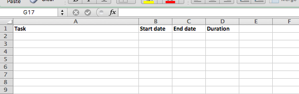

The *Task* column refers to each individual activity, that are the detailed steps that we have to take, in order to be able to complete our project. These are all the activities that we've broken the tasks into. If we were considering this Gantt chart table as a data set, you can now begin to guess, that our unit of analysis is the *task*. Each one activity we have to do is one row. These include the bigger group that each sub-task it belongs to as well as the sub tasks themselves. This will be meaningful later on. 

In the other columns, *start date*, *end date*, and *duration* we will record the temporal information around each task - that is - when will it start? when will it end? how long will it take?

So as a first step, let's populate the *task* column. You can copy and paste from the list above.  Should look something like this: 

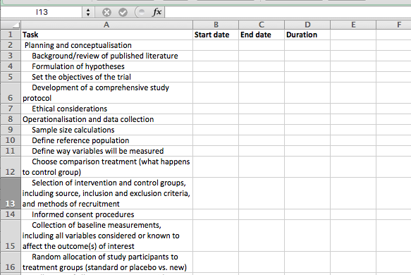

Great, now how will we populate the start date and end date columns. This is where the Gantt chart is very much a tool for you to plan your research project. How can we know how long will something take? The short answer is: we can't.  We don't have a crystal ball. But we can *guess*. We can start with the project start date (or if you work better counting backwards, you can start with the project end date if it's a known hard deadline), and then just try to estimate how long each phase will take to complete, and when we can start the next. 

Tasks can run simultaneously. You don't always have to wait for one task to finish before you start the next. Sometimes one task needs to finish for the next to start, for example: you cannot begin data analysis until you have finished data collection. On the other hand, you can (and should) begin writing while still continuing your data analysis. So you can have temporal overlap - or be working on multiple projects at once. 

Now let's say that we are starting our Scared Straight evaluation quite soon, we have a start date of the 1st of November. Using some very rough guessing, this is the relative timeline that I've come up with: 

- Background/review of published literature:	01/11/18	to 01/12/18
- Formulation of hypotheses	01/12/18	07/12/18
- Set the objectives of the trial	02/12/18	08/12/18
- Development of a comprehensive study protocol	08/12/18 to 18/12/18
- Ethical considerations	08/12/18 to	18/12/18
- Sample size calculations	18/12/18 to	19/12/18
- Define reference population	18/12/18 to	28/12/18
- Define way variables will be measured	28/12/18 to	07/01/19
- Choose comparison treatment (what happens to control group)	01/01/19 to	07/01/19
- Selection of intervention and control groups, including source, inclusion and exclusion criteria, and methods of recruitment	18/01/19 to	21/01/19
- Informed consent procedures	22/01/19 to	23/01/19
- Collection of baseline measurements, including all variables considered or known to affect the outcome(s) of interest	23/01/19 to	23/01/19
- Random allocation of study participants to treatment groups (standard or placebo vs. new)	21/01/19 to	23/01/19
- Follow-up of all treatment groups, with assessment of outcomes continuously or intermittently	24/01/19 to	23/01/20
- Descriptive analysis	24/01/20 to	24/02/20
- Comparison of treatment groups	30/01/20 to	24/02/20
 - Interpretation (assess the strength of effect, alternative explanations such as sampling variation, bias)	20/02/20 to	20/03/20
- First draft	20/03/20 to	25/03/20
- Get feedback & make changes	25/03/20 to	05/04/20
- Final write-up of results	05/04/20 to	30/04/20

You should be able to copy this over into Excel if you roughly agree with these time scales. If not, you can do this yourself, and come up with how long you think each stage would take you. 

Notice that I did not give a start or end time to the *overarching categories* of planning and conceptualisation
, operationalisation and data collection
, data analysis
, and writing up of results? We mentioned earlier, that these categories are so vague, that it becomes a very difficult task indeed to be able to guess their duration. Instead we break them down into smaller tasks, and calculate those. Well to get the start and end date for the overarching tasks, you just need the first start date for the first task, and the last end date for the last task that belongs to this overarching group. How can we find this? Well we can use the `=MIN()` and the `=MAX()` functions in Excel. 

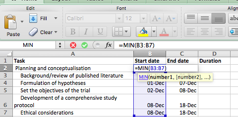

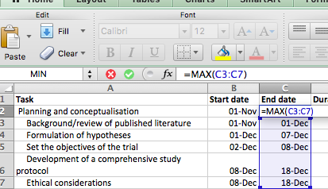

Make sure that you only select the sub-tasks that belong to each individual overarching task. So for example, for Planning and conceptualisation, only select up until "Ethical considerations" and *do not* also include the "Operationalisation and data collection" stage!

Once you have all your start and end dates, your table should look something like this: 

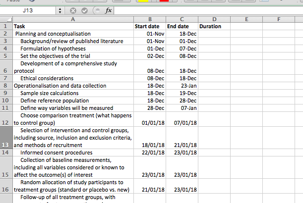

You might find that Excel changes the formatting of your dates in some of the cells, like mine did on the first 8 rows. You can see in those, the date is formatted as 01-Dec for example, whereas later it is formatted the way we entered it, such as 22/01/19. This is because Excel *knows* that the value you are entering here is a *date*.  It doesn't just think you're entering some weird words, it deduces that if what you are entering follows this rough format of 2 digits/ 2 digits / 2 digits, then it's likely to be a date. This is really handy, because you can do calculations on these cells now, that you would not be able to do, if Excel just thought that these were weird words. We will take advantage of this to calculate the duration column here. Do you really want to count out how many days are between the start and end date? Well in some cases it might be easy. It could be that you thought, "well I will start my random allocation of study participants into treatment and control groups on the 21st of January, and I think it will take about 2 days to do this, so I will end on the 23rd of January", but often you will have deadlines, that you need to work towards, or you might want to double check that you are counting correctly. In any case, to get the last, *duration* column, you can simply use an equation, where you subtract the start date from the end date, and you get the number of days that are inbetween. Isn't that neat? You can simply apply some simple maths notations to your date data in Excel, and you get meaningful results, such as the number of days that exist between two dates! We will play around more with dates and such in week 7 of this course, so you can see some more date-related tricks then!

Right, back to our dates, so remember, all formulas start with the `=` equation, and here all we are doing is subtracting the value of one cell (start date) from another cell (end date). Like so: 

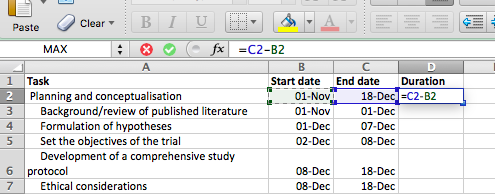

Copy and paste the formatting all the way down, and ta-daa you have your column for the duration of each task:

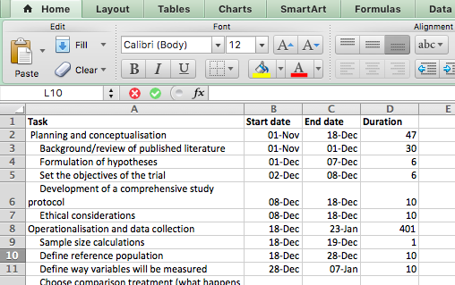

Now you have all the columns you need, to be able to build your Gantt chart. 

To do this, click on an empty cell, anywhere *outside* your table, and select Charts > Stacked Bar Chart: 

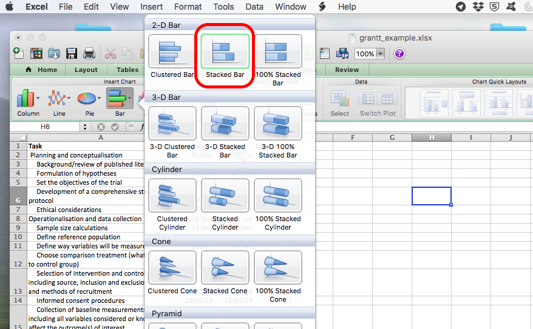

An empty chart will appear like so: 

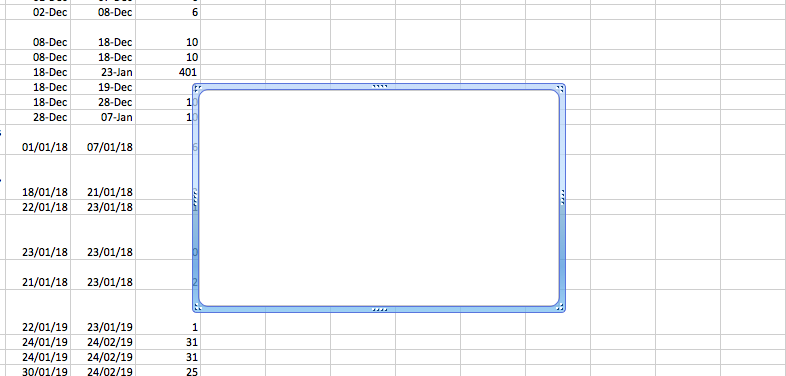

Right-click anywhere in the empty chart space, and choose the option "Select Data...":

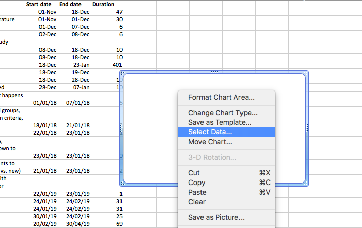

This will open a dialogue box. This dialogue box might look different if you're on PC or on Mac (and even on Mac your version will be newer than mine, so might look slightly different) but the basic commands should be the same. If you cannot find anything, let us know!

So on this popup window, select the option to *Add* data. 

On PC: 

On Mac: 

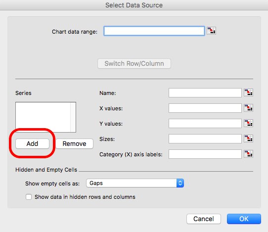

When you select this option, you have to supply 2 values to this series. First you have to tell it the name. This is simply the cell that contains your column header. Then you have to tell it the values. These are all your start dates. You can select by clicking in the blank box for each value, and then clicking/ drag dropping on the spreadsheet. Like so: 

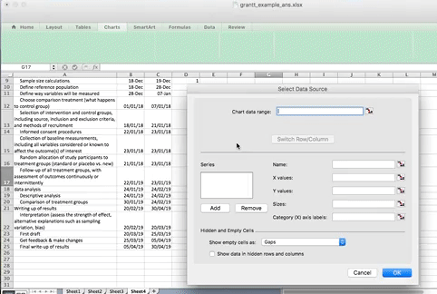

When you're done, click "OK". 

On a PC, when you click the "Add" button it will open a new window, but again, all you have to enter in that new window is the name and the values, the exact same way. Here is an illustrative example of what this will look like on PC: 

Now click OK, and you will see some bars appear, reaching to each start date that we have. Now we have to add the *duration*. To do this, just repeat the steps, for adding a series, but with the duration column this time.

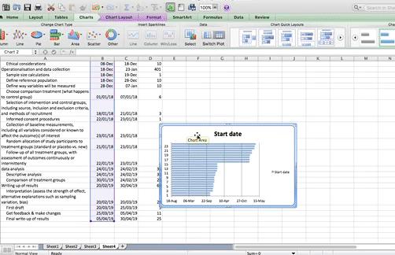

The part that appears in red above represents the duration of each task. The blue part now is actually redundant. We just needed it there, so that the red part (the actual task) begins at the correct point. So just like we did when making that box plot a few weeks ago, we clear the fill, we clear the line, and in case there is a shadow there, we clear that as well, so that we don't confuse ourselves by having that blue part there. 

Just to show something new, I will show you a different way of going about this here, buy you can just as easily follow the same steps you took when making things invisible in your boxplot. 

But the other things you can do is to click on the blue section of the graph to select it: 

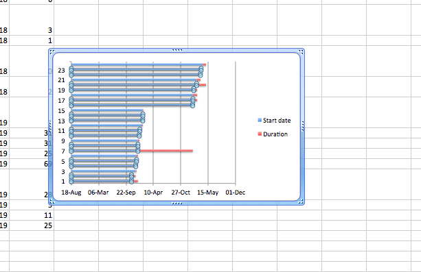

And then right click and choose 'Format Data Series...':

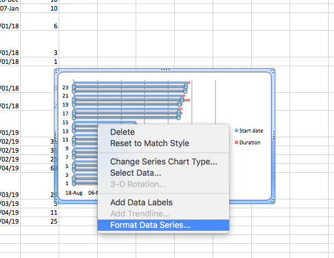

Then on the side tabs, you can go through and select fill, and line, and even shadow, and make sure that they are all set to no fill/ no line/ no shadow: 

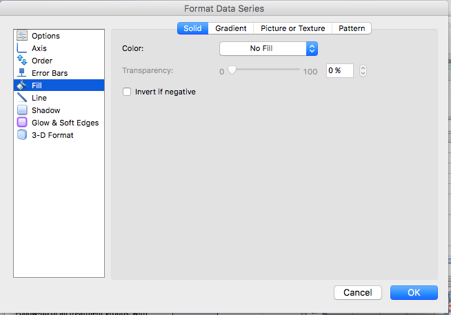

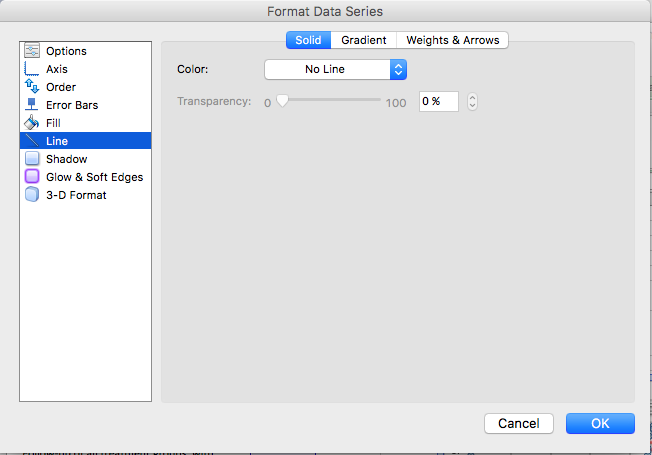

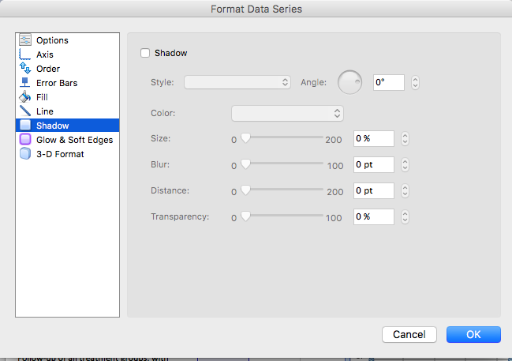

Then click OK, and you will see only the red parts of your graph, which represent each task and the duration it lasts: 

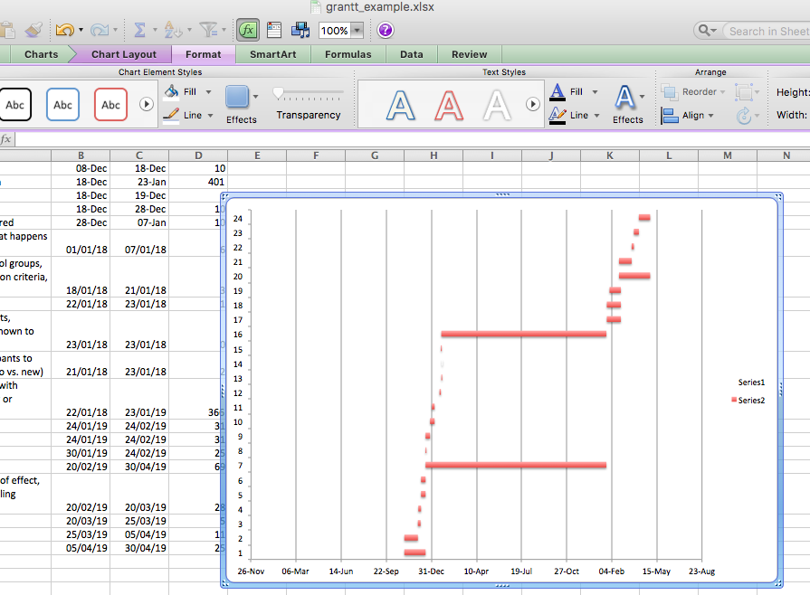

**NOTE**: you might have an issue where Excel starts counting at the year 1900 for some reason. In that case your chart might have looked like this: 

In this case, you can fix this by editing the axis through right click, format axis, put in the correct minimum, like so: 

Now you have a timeline for each task.. but how do you know what is each task? I just see numbers? Well we need to add the labels, from the task column of your data, to give it some sort of meaning. To do this, once again right click anywhere on your chart area, and select "Select Data...", and this time, for where it asks for axis labels, click in that box, and then highlight the column with the tasks in it: 

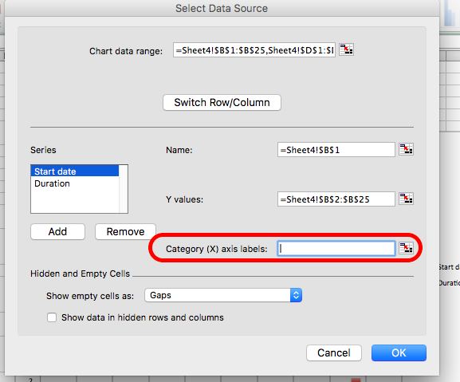

On a PC you will have to click the "Edit" button under the "Horizontal category axis labels" box. This will look something like this: 

When you then select the column with the tasks in it and click OK, it should label your tasks properly now: 

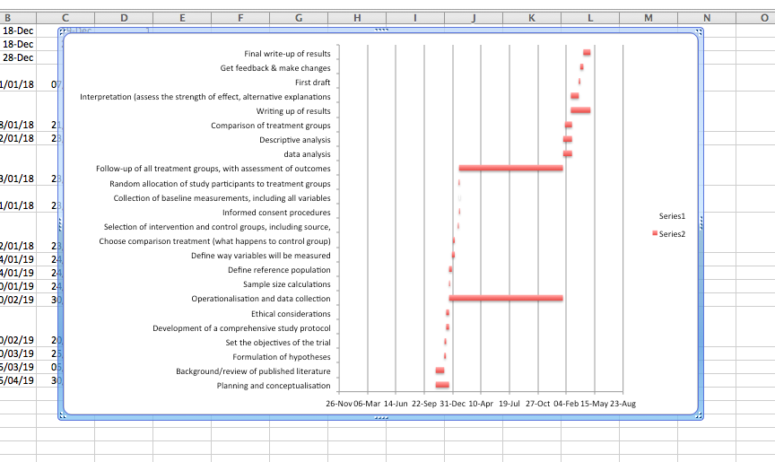

Now your Gantt chart is basically ready. It can be that yours looks sort of in a different order? If this is the case, go back to your data, and sort your data on the "End date" column. If you do this, then you will have your fist tasks at your top, and the last tasks at the bottom. This should help you plan your tasks. You can take some time to edit your Gantt chart formatting to make it look the way that you would find it the most helpful. For example, here's mine: 

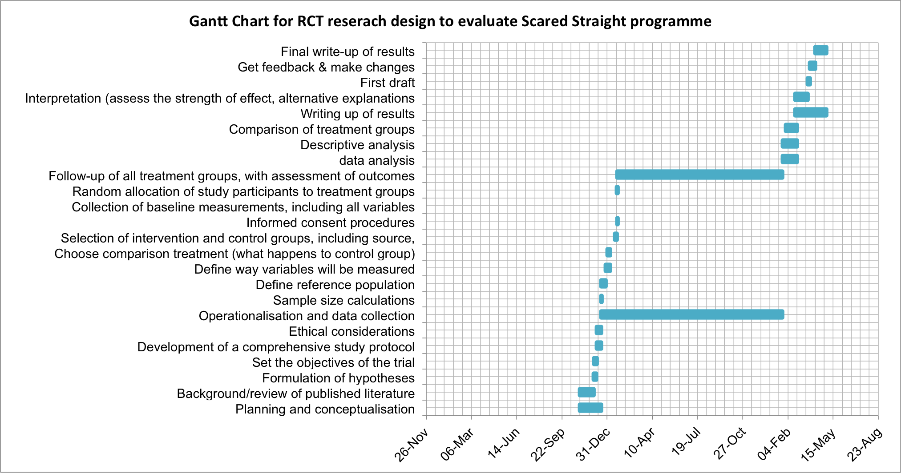

So what's going to take the longest? As you can see there, the longest duration is for the operationalisation and data collection tab. It's an overarching category, but there are not any sub-tasks associated with it for the majority of its duration. Well, the thing is, even though we are not actively collecting data in that longer period, we are still in the data collection phase. Can you think why?

Well we want to know if scared straight works on reducing offending right? So for this, we need to recruit our people, assign them into a control and a treatment group, and then *wait for a pre-determined amount of time* before we can collect the follow-up data - or the *after* data. 

Remember back ton conceptualisation. How do we conceptualise reoffending? Well in this case, we conceptualise it as if the person has offended in the 12 months following taking part in the scared straight programme. Because of this, we have to wait 12 months until we collect our "after" data. 

Planning is a very important part of the research project, and the research design which you pick will greatly affect your research plan. Think about if we considered instead a one-time survey? We could ask people - "have you ever taken part in a scared straight programme?" And then ask them "have you offended in the last 12 months?". But this is a **cross-sectional** study design, in which we only take measurement at one point in time. This is a very different study design, and the advantages of an RCT over a cross-sectional survey in terms of determining the effect of an intervention are widely discussed in your readings. However you can also imagine how it would be an easier study to carry out, right? The data collection part of your Gantt chart there would reduce significantly, from over 12 months, to something much shorter, just the length of time it takes to conduct one survey. Maybe a month. 

Hopefully you are beginning to get an idea into the nuances of finding your optimal research design. To a certain extent this is dictated by your research question. If you want to know whether scared straight works or not, and you want to design a study to assess this, an RCT is your ideal way forward. However your hands may be tied. If you wanted to do this as part of an undergraduate dissertation project for example, you cannot just wait 12 months to follow up people's offending, as your deadlines will have all passed by then. 

The Gantt chart is a handy tool for research planning, and considering all the tasks that you need to carry out, as dictated by your research design. We illustrated here with the example of planning an RCT. To get the steps for these we can consult the reading, we can look at previous studies, or we can browse around for outlines others have used. For example, the RCT one is based on [this proposed outline](https://www.healthknowledge.org.uk/e-learning/epidemiology/practitioners/introduction-study-design-is-rct) for RCTs.  Your readings around each research design will give you an indication of what tasks are involved with each one, and you should be able to produce such an outline for any kind of project. It is a good way to keep yourself on track, to make sure that you do not take on too many tasks, and also to show your supervisor/ employer/ person marking your project proposal, in case that is the stream you choose for your dissertation, that you are thinking about feasibility of your tasks. 

Once you have planned your project, you need to carry out each task. Something like a literature review you will be familiar with from your work on other modules. You have to have a read through the relevant literature, in order to be able to identify whether your research question has already been answered, to look into what other people are researching in your topic area, to consider the approached to conceptualisation and operationalisation that others before you have taken, and to engage with what is currently happening in this topic you're interested in. This will lead you to your research question, and your hypotheses. Hypotheses are the testable versions of your questions. 

For example if our research question is: does scared straight deter reoffending in young people? your hypothesis would look something like this: those who did not receive scared straight program intervention will offend more than those who did.  

Once you have this you're almost good to go, except you will have to make sure that you are addressing any ethical considerations with the research. We'll return to this a bit later, in its own section. 

But fast forward to the point where you have your sample. Let's say you've carried out all your planning, all your calculations, and you now have a set of people who you want to assign to your control and your treatment groups. The distinguishing feature of an RCT is the random assignment of people in your sample to either group. How does this work? Well the next section will explore just this.

### Activity 2: Random assignment into control and treatment

So how does random assignment work? Well we could achieve this by going old-school, and writing everyone's name on a piece of paper, and drawing the names out of a hat. But here we will use Excel's ability to programmatically assign people into treatment or control.  You are all Excel pros by now, with your formulas, and your lookups and pivot tables. So might as well hone these skills some more. 

So to have random assignment to a group, each member of your sample has to have the same probability of being selected for each group. Let's say we want to assign two groups. We want to assign people to a **control group** and a **treatment group**. Remember that the control and the treatment must be must be coming from the same sample, so that they are similar in all characteristics *except* in the particular thing you are interested in finding out the effect of. By random assignment, each person has the same probability of being in the treatment or the control group, and so there is no chance for systematic bias, as there would be for example if you were asking people to *self-select* into treatment or control. If people were given the chance to volunteer (*self-select*) it would leave open a possibility that people with certain traits are more likely to volunteer, and there might be some systematic differences between your two groups.  

So let's say we have our sample of people who will be assigned either to the treatment group, of recieving the scared straigh treatment, or the control group, who do not have to go through this treatment. Well let's say we have our class here. We've got a total of 83 students enrolled in the class. Go ahead and download this list, from Blackboard. You can find it under week 5 > data > student.xlsx

Once you have downloaded the data, open it with excel, and have a look at it. You can see that we have 83 rows, one for each student. You can also see that we have 3 variables: ID,	Name, and	Program. 

To assign people randomly to a group, we can use Excel's `=RAND()` function. The Excel RAND function returns a random number between 0 and 1. For example, `=RAND()` will generate a number like 0.422245717. RAND recalculates when a worksheet is opened or changed. This will become important later. 

So give it a go. Create a new column called "random number" on our data. Like so: 

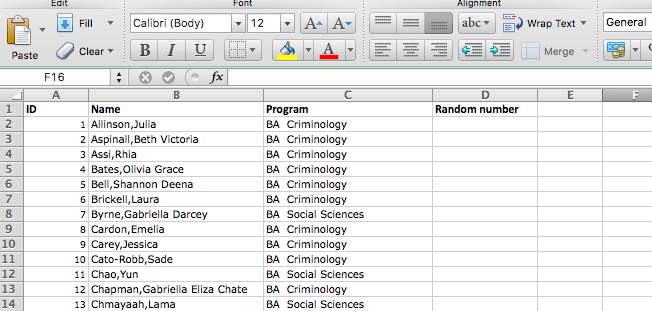

Now simply type `=RAND()` into the first cell and press Enter: 

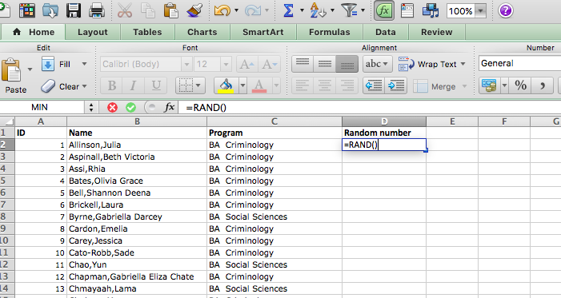

When you hit enter, the formula will generate a random number, between 0 and 1. Something like this: 

Did you get a different number for Julia there, than I did? Chances are, you did. This `RAND()` function generates a random number each time used. If I did this again (and try this on your data), it will give a different number. Try. Go into the cell, where you've typed =RAND(), and instead of exiting out of the formula with the tick mark next to the formula bar, just press enter again. You should, now, have another random number appear. Now copy and paste the formula (and make sure its the formula you're copying, and not the value) to every single student in our sample. You will end up with a whole range of values, between 0 and 1, randomly assigned to everyone. Something like this: 

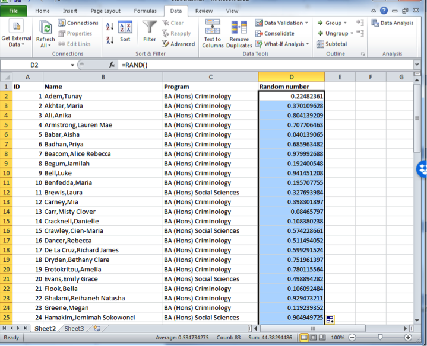

Now we can use these values, which have been assigned *randomly* to assign students to a control or treatment groups. Remember last week when we were doing some re-coding? Remember when we were recoding the numeric variable into a categorical one? And I left a little bonus question at the end? Well the bonus question was asking essentially, what value can you use, as a cut-off point, to make sure that 50% of your data get put into one group, and 50% of your data into the other group? This question should already be familir to you, but let me re-phrase: what measure of central tendency cuts your data right in half based on considering the values on a numeric variable? 

Are you thinking **median**??

Nice work! Indeed the median is the value that divides our data right smack in half. Now are you starting to realise where I'm going with this? Basically, if you want to assign each student, based on this randomly assigned score, to either control or treatment groups, and we want to make sure that equal amounts of students go to either group, then what we can do is use the `IF()` statements we were using last week to re-code data!

How? Well remember what we did to assign people into tall or short categorical variable values, based on the numeric value for height? We decided that if a  person is taller than average, they will be labelled "Tall" and "Short" if they are not. So what are the elements of our statement? We need to check *if* the person height is *greater than* the *average height* and if it is, type "Tall", else type "Short". Remember now? 

We can apply this again here. So to recap,  we know that the `IF()` function takes 3 arguments. 1st the logical statement, that has to be either true or false. Then the other 2 values that the `IF()` function needs is what to do if the statement is true, and what to do if the statement is false. 
So altogether, your function will look like this:

`=IF(condition, do if true, do if false)`

What is our condition here. Well we are using this time the median to divide our randomly assigned numbers into 2. So we want to assign people into treatment or control, if they are above or below the median in their random number, that was allocated to them randomly. This ensures the *random* element of the randomized control trial, and ensures that people have equal probability of ending up in either group. 

Let's say anyone with a random number above the median will be in the treatment group, and anyone with a random number below the median will be in the control group. What is our condition in this case? What is it that we are testing each number against?

Well in this case we are testing people against whether their random number is greater than the median of all the random numbers. If their random number is greater than the median of all random numbers, then they are part of the treatment group (what happens if condition is true). On the other hand, if their random number is **not** greater than the median of all the random numbers, then they are assigned to the control group (what happens if condition is false). If any of this is unclear for you at the moment, then please raise your hand, and make one of us explain this. 

Translated into Excel language, our formula is: 

`=IF(random number value > median(all random numbers), "Treatment", "Control")`

For example, for our first person in the list there, the formula will look like: 

`=IF(D2 > MEDIAN(D:D), "Treatment", "Control")`

As such :

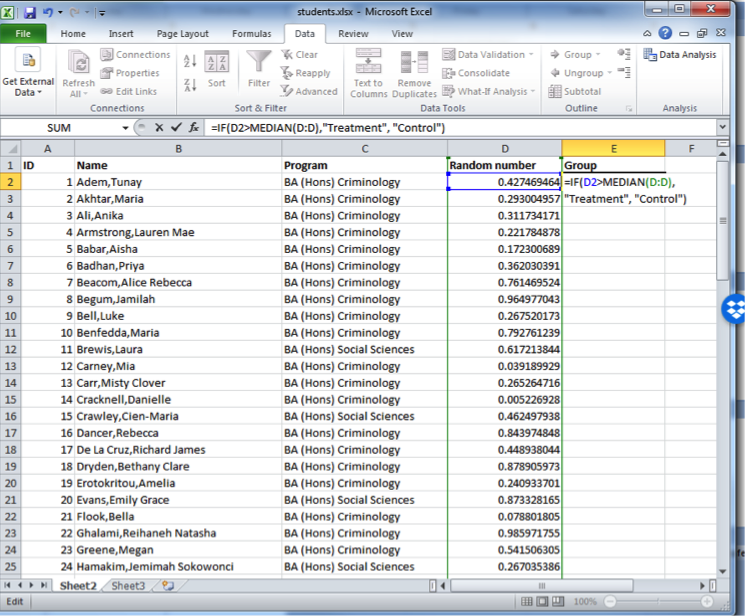

Hit Enter, and then copy the formatting all the way down, so that everyone in the class has been assigned to the control and treatment groups. 

You should have something like this: 

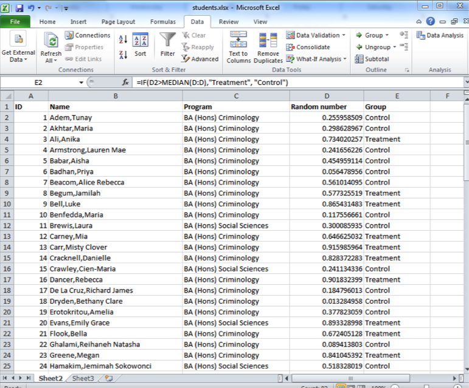

Don't worry if you don't get the same values, as I said this is *random* and so you should not get consistently the same answers. In fact you should get different ones to your friends next to you as well. 

One way that you can sense check your results is to have a look at your treatment and control groups. Let's see how many students we have in each. You can use a pivot table to do this, and create a *univariate* *frequency table* to look at this new "Group" variable. 

You've built enough of these by now that you should be OK making this pivot table on your own, without guidance. If you get stuck on something though, let us know!

If all goes well, your pivot table should let you know that you have either 41 or 42 students in your control group, and that minus 83 (your total) students in your treatment group: 

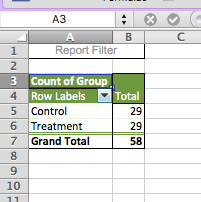

So, how did it go? Who's in your treatment and who's in your control group? Where did you end up? Find your name in your sample. Are you in the treatment or the control group? What about in the spreadsheet of the person next to you? 

If you were assigned to the treatment group, as treatment [watch this Saturday Night Live skit on Scared Straight](https://www.youtube.com/watch?v=sw1vm_PO8ss). Let's see what it does for your offending...

If you were assigned to the control group, you can instead [watch this Saturday Night Live skit on Star Wars auditions](https://www.youtube.com/watch?v=-T_pjMr7-n0).
 

Now you've been exposed to either the treatment or the control condition. I'll be in touch in 12 months time to follow up, and find out about your offending behaviour. I'll report the results back in a paper. Science...!

<!--

### Activity 3: Stratified randomisation

Randomization is important because it is almost the only way to assign all the other variables equally except for the factor (A and B) in which we are interested. However, some very important confounding variables can often be assigned unequally to the two groups. This possibility increases when the number of samples is smaller, and we can stratify the variables and assign the two groups equally in this case.

For example, if the smoking status is very important, what will you do? First, we have our method of randomization that we learned previously. Just to put a name to this, the approach we had followed was **simple randomisation** There are two randomly assigned separate sequences for smokers and non-smokers. Smokers are assigned to the smoker's sequences, and non-smokers are assigned to the non-smoker's sequences. Therefore, both smokers and non-smokers groups will be placed equally with the same numbers.

So we can use 'simple randomization with/without stratification'. However, if there are multiple stratified variables, it is difficult to place samples in both groups equally with the same numbers. Usually two or fewer stratified variables are recommended.

What does that look like? Well let's illustrate again with assigning you, the class, into control and treatment groups for the scared straight programme. Let's say that we knew that there was a different effect of Scared Straight possibly on those in BA Criminology and BA Social Sciences programme participants. This means that we've identified the *program* variable to be a **confounding variable**. A confounding variable is an outside influence that changes the effect of a dependent and independent variable. To account for this, we want the same number of BA Crim and BA Social Science students in both groups. Because if we didn't control for this, it could be that through the random assignment alone, one group would have only BA Crim students, and the other have all the BA Social Science students. Now if we think that program is a **confounding variable**, in other words it's something that might influence our dependent variable, then we want to account for this, because otherwise, even if we find a difference between the two groups, we'll be unable to say whether it's due to the Scared Straigh intervention, or this variable of degree program!  

So how can we make sure that both BA Criminology and BA Social Sciences groups will be placed equally with the same numbers?

Well to do this, you would go back to your random numbers that we created with the `=RAND()` function. The important thing here is, that you consider how we assigned people into control/treatment groups. We decided that everyone with a random number above the total group median gets treatment, and everyone below gets control. The total group median was used to divide the total group into two. So what do you think can be done to do this for 2 groups? You guessed it, *you have to assign each group based on their own group median!*. 

There are two ways of doing this, the long manual hard way, or the easy lazy code way. Let's start with the code way. 

Just like before, we use an IF statement. Except this time the condition will change. Instead of saying, if this person's random score is above the median score for all students, we have to change it to say that "if this person's random number is above the median *for his/her group*" then assign him/her to the treatment. Else assign him/her to the group. The important extra addition there is the *for his/her group*. This means that we are changing what data to calculate the median from. 

We've calculated conditional medians before. Do you remember? This was in the third week, when we were carrying out bivariate analysis between a categorical and a numeric variable, and you had to calculate the median for each possible value of the categorical variable. 

Here we apply the exact same logic, but we select for each person to calculate the median for all the others who match his/her value for the program variable. 

The outer IF statement remains exactly the same procedure as it was for the one group, but now you are doing it for the two. This means that only your *condition* in your "IF" statement changes. Remember our IF statement for assigning based on the total median?

`=IF(D2>MEDIAN(D:D), "Treatment", "Control")`

To change, we change only the condition. The condition here is the `D2>MEDIAN(D:D)` part. That part assesses whether the person's random number was above the total median. Well now we need to introduce another IF into this equation, to make sure that we are calculating the appropriate group median, for the program. So if they student's value for the program variable is BA Crim, we should calculate the crim median, and if it's BA Soc Sci, then we should calculate the soc sci median. Sounds familiar?

So if total median is `MEDIAN(D:D)`, then our conditional mean calculation is...:

`MEDIAN(IF(C2=C2:C59, D2:D59))`

Where you are saying, if the cell value of C2 (so the program for the person in row 2) is equal to the values in the program column (c column), then include those random numbers in the calculation of the median. So if you just replace the median statement from the initial IF with this, creating a new condition, like so: 

`D2 > MEDIAN(IF(C2=C2:C59, D2:D59))`

And now, all you need to do, is plug in this new condition into your outer IF statement:

`=IF(D2 > MEDIAN(IF(C2=C2:C59, D2:D59)), "Treatment", "Control")`

Don't forget to add your dollar signs, for copy and pasting the formula: 

`=IF(D2 > MEDIAN(IF(C2=$C$2:$C$59, $D$2:$D$59)), "Treatment", "Control")`

And also don't forget to hit `Ctrl` + `Shift` + `Enter` instead of *just* Enter. 

You should get, for each person, an evaluation against the median of the particular group that this person belongs to. Again you can check whether or not this has worked, in terms of assigning half the people to treatment and the other half to control, by producing a pivot table to look at the frequency of the stratified group variable, that you've now created. 

You might notice that your pivot table shows a no longer even distribution between the groups: 

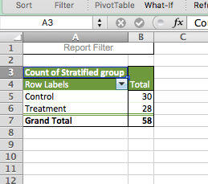

Take a moment to think about why this might be? Maybe consider the number of people in each group. Is this an even or an odd number? In the event that there is an odd number, then when you divide the data into half, since we are splitting people, you will end up with one group larger than the other (by 1 person). Unless someone volunteers to be split in half, and half of them being put in one group, and the other half in the other, this can happen. So what can you do? Well I'll leave this here as something for you to think about. If you have an idea, or if you have no idea, and want to discuss, raise your hand now, we will come around to talk through it. 

But create a bivariate frequency table though, using your stratified group variable and the program variable: 

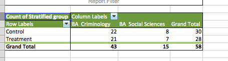

You can see that both BA Crim and BA Soc Sci are split about half and half, assigned into treatment and control. 

What about using the other treatment/control grouping, the one where we **did not** stratify by programme?

You will all have different results here, since it's randomly assigned, but it's possible that for some of you BA Soc Sci might be overrepresented in one group versus the other. If this were the case, and we knew (or suspected) that this variable of what program you're enrolled in had an effect on offending behaviour, then this might influence the validity and generalisability from your study. 

-->

### Freeze!

Now before you're done here there is one last thing to note. Remember when describing the `=RAND()` formula, I mentioned that RAND recalculates when a worksheet is opened or changed? Now let's say we've assigned everyone to treatment or control conditions, we make you all watch your appropriate videos, and then, we save our worksheet, to return to it 12 months later. In 12 months, we may not wholly remember who was assigned to which group. You yourself might not remember either. But if upon reopening, the random numbers are changed, then the assigned groups will also change! So since we don't want this, we want to somehow "freeze the values". 

You can do this by highlighting the column and going to Formulas > Settings > and selecting "Calculate Manually":

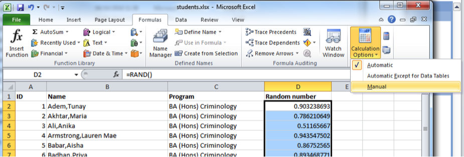

On mac: 

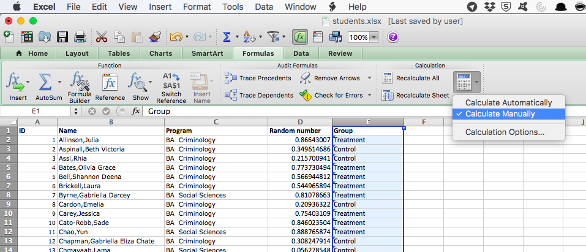

And on PC: 

This way you will be able to keep track of who was assigned to control and who was assigned to the treatment groups. 

## A final note on evidence: Meta Analysis

So let's say we ran our RCT on Straight and we found some sort of effect between those exposed to it and those not. While we make all arrangements possible to ensure the reliability, validity, and generalisability of our study, we are only human, and we can make mistakes. Even if we don't make mistakes, the way that inferential statistics works, is that one out of every 20 studies will be wrong, just probabilistically. This will make more sense if you move on to study inferential statistics, but basically we, as social scientists, resign ourselves to work with a 95% confidence rate, so on the whole, we are admitting to be wrong about 5% of the time (1 out of 20). So yes, while RCTs are strong, robust evidence for or against a programme, often they can still be disputed. 

This is very well illustrated in reception of actual evaluations of Straight programmes. And there are many. This is mostly because studies either find **no effect** or a **negative effect** of the programme on at-risk youth. This means that it either doesn't stop their offending, OR MAKES IT WORSE, compared with control groups. Hold on a second?!? Why are we implementing programmes that *at best* don't work, and at worst, make offending worse? Well like all businesses, Scared Straight programmes will tug at the credibility of individual studies, and if you are up against something that is making a lot of money for someone, you will need to produce quite robust evidence to bring it down. 

You may have come across something called the "evidence pyramid". This is a visual representation of the hierarchy of evidence, so basically the credibility of a study in evaluating an intervention, based on its study design. The most robust evidence is at the top, while the least is at the bottom. 

Here it is: 

Well here is *a* version. There are many versions of this out there. But you can see, for all we've been praising RCTs here, there is actually a step above. This is *systematic reviews*. I'm not going to hugely go into this, but essentially these represent the *study of studies*. So what a systematic review, and in particular, it's subset, the **meta-analysis** do, is consider *all previous studies* and evaluate their results. That way, you can draw conclusions and say that many studies are all finding that Scared Straight has no or negative effect, and it becomes much harder to criticise! 

Meta-analysis is the quantitative analysis of findings from multiple studies. At its core, meta-analysis involves researchers pulling together the results of several studies and making summary, empirical statements about some cause and effect relationship. A classic example of meta-analysis in criminology was performed by Wells and Rankin and concerned the relationship between broken homes and delinquency.

After observing a series of findings showing that the broken-homes-causes-delinquency hypothesis was inconclusive, Wells and Rankin identified fifty studies that tested this hypothesis. After coding the key characteristics of the studies, such as the population sampled, age range, measures (both independent and dependent) used, the authors found that the average effect of broken homes across the studies was to increase the probability of delinquency by about 10 to 15 percent. Perhaps more importantly, they found that the different methods used across the studies accounted for much of the variation in estimating the effect of broken homes. For example, the effect of broken homes on delinquency tended to be greater in studies using official records rather than self-report surveys.

Although the research community has not spoken with one voice regarding the usefulness of meta-analysis, one thing is clear: meta-analysis makes the research community aware that it is inappropriate to base conclusions on the findings of one study. It is because of this important lesson that meta-analysis has become a popular technique in criminological and criminal justice research.

If you are still interested in the outcomes of Scared Straight, you can read a [meta analysis here](http://onlinelibrary.wiley.com/doi/10.1002/14651858.CD002796.pub2/full). TL;DR: It doesn't work

## Longitudinal data

There are two commonly used longitudinal research designs,** panel **and **cohort** studies. Both study the same group over a period of time and are generally concerned with assessing within- and between-group change. Panel studies follow the same group or sample over time, while cohort studies examine more specific populations (i.e., cohorts) as they change over time. Panel studies typically interview the same set of people at two or more periods of time. 

For example, the 1970 British Cohort Study (BCS70) follows the lives of more than 17,000 people born in England, Scotland and Wales in a single week of 1970. Over the course of cohort members' lives, the BCS70 has broadened from a strictly medical focus at birth to collect  information on health, physical, educational and social development, and economic circumstances among other factors.

The Millennium Cohort Study (MCS), which began in 2000, is conducted by the Centre for Longitudinal Studies (CLS). It aims to chart the conditions of social, economic and health advantages and disadvantages facing children born at the start of the 21st century.

Our Future (formerly the Longitudinal Study of Young People in England (LSYPE2)), is a major longitudinal study of young people that began in 2013. It aims to track a sample of over 13,000 young people from the age of 13/14 annually through to the age of 20 (seven waves).

These are some examples from the UK Data Service ([see those and more here](https://www.ukdataservice.ac.uk/get-data/key-data/cohort-and-longitudinal-studies))

The main advantage of longitudinal studies is that you can track change over time, and you meet the temporal criteria for causality. You collect data from people across multiple **waves**. Waves refer to the times of data collection in your data. For example, if you follow a cohort from birth until their 30th birthday, and you take measurements every 10 years, once at point of birth, once at age 10, once at age 20, and finally at age 30, then you will have 4 waves in this longitudinal data about these people you're following. 

### What does longitudinal data look like?

So far we've only shown you cross-sectional data. Each row was one observation, each column as one variable, and they were collected at a single point in time. So what do longitudinal data look like? 
A longitudinal study generally yields multiple or “repeated” measurements on each subject. So you will have many, repeated measure, from the same person, or neighbourhood, or whatever it is that you are studying (most likely people though... when you take repeated observations about places it's more likely to be a time-series designs. Time-series designs typically involve variations of multiple observations of the same group (i.e., person, city, area, etc.) over time or at successive points in time. Typically, they analyze a single variable (such as the crime rate) at successive time periods, and are especially useful for studies of the impact of new laws or social programs. An example of a time-series design would be to examine the burglary rate across the boroughs of Greater Manchester over the last five years. We'll be dealing with time series in week 7.)

Okay so what do these data actually look like? Well have a look at the description for the [Next Steps (formerly the Longitudinal Study of Young People in England (LSYPE1))](https://discover.ukdataservice.ac.uk/series/?sn=2000030). Briefly mentioned above, the Next Steps (formerly the Longitudinal Study of Young People in England (LSYPE1)) is a major longitudinal study that follows the lives of around 16,000 people born in 1989-90 in England. The first seven sweeps of the study (2004-2010) were funded and managed by the Department for Education (DfE) and mainly focused on the educational and early labour market experiences of young people.

The study began in 2004 and included young people in Year 9 who attended state and independent schools in England. Following the initial survey at age 13-14, the cohort members were interviewed every year until 2010. The survey data have also been linked to the National Pupil Database (NPD) records, including cohort members’ individual scores at Key Stage 2, 3 and 4.

In 2013 the management of Next Steps was transferred to the Centre for Longitudinal Studies (CLS) at the UCL Institute of Education and in 2015 Next Steps was restarted, under the management of CLS, to find out how the lives of the cohort members had turned out at age 25. It maintained the strong focus on education, but the content was broadened to become a more multi-disciplinary research resource.

There are now two separate studies that began under the LSYPE programme. The second study, Our Future (formerly LSYPE2), began in 2013 and will track a sample of over 13,000 young people from the age of 13/14 annually through to the age of 20 (seven waves).

There are a lot of interesting variables in there for those interested in young people and delinquent behaviour. There is some data about drug and alcohol, some about offending such as graffiti, vandalism, shoplifting, as well as social control factors such as family relationship, bullying, and so on. If you are interested in the data, you can always have a browse through the [site here](https://discover.ukdataservice.ac.uk/Catalogue/?sn=5545&type=Data%20catalogue&lt) and [have a read of one of the questionnaires as well](http://doc.ukdataservice.ac.uk/doc/5545/mrdoc/pdf/5545age_25_survey_questionnaire.pdf). 

In any case, we should get back to our question, what does this data look like. And it looks exactly as you would imagine, it looks like the results of survey questionnaires, completed by people, but over time. If you were to download the next steps data for example, you will end up with a separate file for each wave. But in each wave, you would have **repeat measures** of the same variables, from the same people. So each wave you see the exact same variables, and the exact same people making up the rows of answers, but you know that time has passed. 

The benefit of a longitudinal study is that researchers are able to detect developments or changes in the characteristics of the target population at both the group and the individual level. The key here is that longitudinal studies extend beyond a single moment in time. As a result, they can establish sequences of events. It is generally admitted that causes precede their effects in time. This usually justifies the preference for longitudinal studies over cross-sectional ones, because the former allow the modelling of the dynamic process generating the outcome, while the latter cannot. Supporters of the longitudinal view make two interrelated claims: (i) causal inference requires following the same individuals over time, and (ii) no causal inference can be drawn from cross-sectional data. 

Anyway have a look at a small subset of 3 waves of the data. There are 4 variables in each wave. The first one,  "NSID" is the unique identifier for each person. Then there are three variables that contain the answers that each person gave to some questions. * W1canntryYP*	is the answer to whether the young person ever tried Cannabis. *W1alceverYP*	is the answer to whether the young person ever had proper alcoholic drink, and *W1cignowYP*	is the answer to whether the young person ever smoked cigarettes.

So you can download these three waves of young people being surveyed from blackboard. You can find them labelled wave_1.xlsx, wave_2.xlsx, and wave_3.xlsx in the data folder for this week on BB. Download all three onto your computer, and open them up in excel. 

### Activity 3: Linking data

So hopefully if I've taught you anything about the structure of data, is that you have *all* your observations in your rows and *all* your variables in your columns. So if you want to be able to look at changes in people's responses over time, for example, you will need to be able to link these data sets together into one spreadsheet. 

So how do we do this? Well what you can do is to link one data set with another.  Data linking is used to bring together information from different sources in order to create a new, richer dataset. This involves identifying and combining information from corresponding records on each of the different source datasets. The records in the resulting linked dataset contain some data from each of the source datasets. Most linking techniques combine records from different datasets if they refer to the same entity. (An entity may be a person, organisation, household or even a geographic region.) 

You can merge (combine) rows from one table into another just by pasting them in the first empty cells below the target table—the table grows in size to include the new rows. And if the rows in both tables match up, you can merge columns from one table with another by pasting them in the first empty cells to the right of the table—again, the table grows, this time to include the new columns.

Merging rows is pretty straightforward, but merging columns can be tricky if the rows of one table don't always line up with the rows in the other table. By using `VLOOKUP()`, you can avoid some of the alignment problems.

To merge tables, you can use the VLOOKUP function to lookup and retrieve data from one table to the other. To use `VLOOKUP()` this way, both tables must share a common id or key.

This is a standard "exact match" `VLOOKUP()` formula (remember that means you have to set the last parameter to 'FALSE' for an exact match). 

So first things first, open up all three waves in three separate excel spreadsheets. Have a look at them all. You can see the first one has the following columns: 

- *NSID*: the unique ID
- *W1canntryYP*: ever tried cannabis	
- *W1cignowYP*: ever smoked	
- *W1alceverYP*: ever had alcohol

Then you can have a look at wave 2. You will see in wave two that the unique ID column stays the same (*NSID*: the unique ID), but the other three columns are named slightly different: 

- *W2canntryYP*: ever tried cannabis	
- *W2cignowYP*: ever smoked	
- *W2alceverYP*: ever had alcohol

It might be a subtle difference, but the first two characters in the variable name actually refer to the wave in which this variable was collected. This is very handy, because if you imagine that they were just called "canntryYP" and "cignowYP" and "alceverYP", once they would be joined together into one data set, then how would you be able to tell which one came from which wave? You could rename them yourself (which is what you would do in this case) but it's very nice that these data were already collected with this joining in mind, and so the variable naming was addressed for us in this way. 

If you're still curious, have a look at wave 3, where you will see the familiar NSID column, as well as these three: 

- *W3canntryYP*: ever tried cannabis	
- *W3cignowYP*: ever smoked	
- *W3alceverYP*: ever had alcohol

So why doesn't the NSID column change? Well this is the same value for all participants all throughout. This is so that we can identify each one. Due to ethics and the data protection act, we cannot share data that contains personally identifiable information, especially in cases where it refers to some pretty sensitive stuff, such as someone's drug use, alcohol use, or some delinquent behaviour. Instead each person is given a unique code. This code can be used to track them, over time, without identifying them personally. 

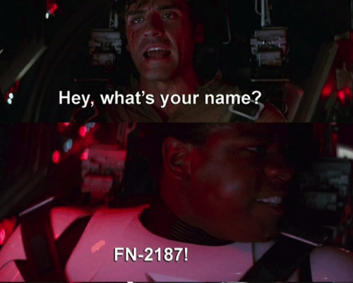

You need a unique identifier to be present for each row in all the data sets that you wish to join. This is how Excel knows what values belong to what row! What you are doing is matching each value from one table to the next, using this unique identified column, that exists in both tables. For example, let's say we have two data sets from some people in Hawkins, Indiana. In one data set we collected information about their age. In another one, we collected information about their hair colour. If we collected some information that is unique to each observation, and this is the *same* in both sets of data, for example their names, then we can link them up, based on this information.  Something like this: 

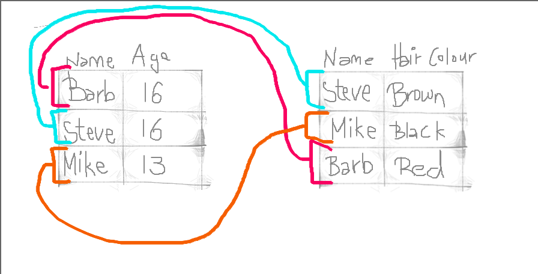

And by doing so, we produce a final table that contains all values, lined up *correctly* for each individual observation, like this: 

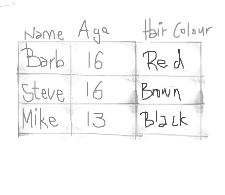

This is all we are doing, when merging tables, is we are making use that we line up the correct value for all the variables, for all our observations. 

So let's do this with our young people. Let's say we want to look at the extent of cannabis, alcohol, and cigarette trying in each wave of our cohort, as they age. To do this, we need to link all the waves in to one data set. We have established that the variable *NSID* is an anonymous identifier, that is unique to each person, so we can use that to link their answers in each wave. 

So remember the parameters you need to pass to the `VLOOKUP()` function, from last week? You need to tell it:

- first *what value to match*, 
- then *where the lookup table is*, 
- then *which column of this table you want*, 
- and finally *whether or not you want exact match*. 

In this case, we want to match the unique identifier, found for each person in the *NSID* column. This is the value to match. Then our lookup table is now *the other data set* which we want to link. The column will be the matching column to what we are copying over, and the exact match parameter we will set to "FALSE" (meaning we *do* want exact matches only). 

So what does this look like in practice? 

Well let's open up our wave 1 (well technically you have them all open, so just bring wave 1 to the front). Now we don't want to overwrite this file, so save it as something new. Do this by selecting File > Save As... and choosing where to save it, and giving it a name. Here I will save it in the same folder where I've saved the individual waves data, and call it "next_stepsw1-3.xlsx" as it will contain waves one through three of the next steps longitudinal survey:

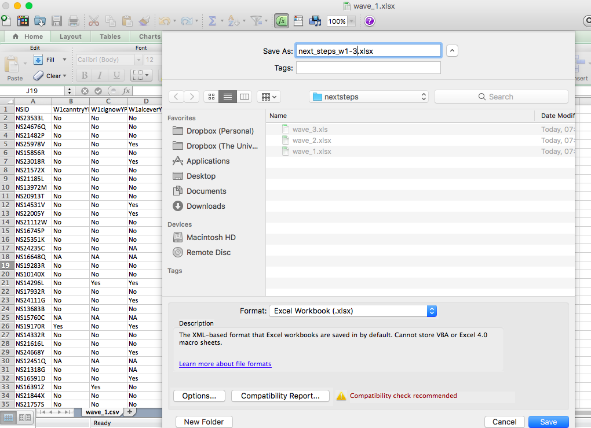

Now that you have this as a new file (which already contains the data from wave 1), you can get ready to merge in the data from waves 2 and 3. First, lets create column headers for the variables we will copy over. You can do this by simply copying over the column headers from the other data sets (waves 2 and 3). Like so: 

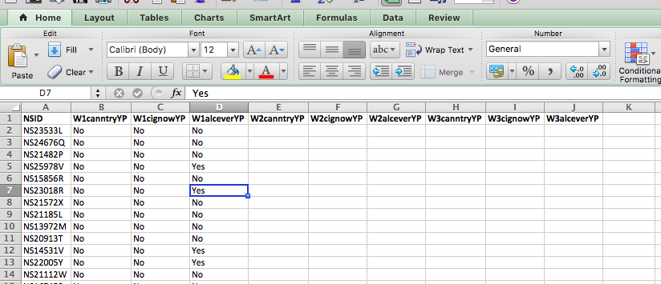

Notice that I'm not copying over the NSID column. This is because it would be exactly the same. It's enough to have this once, there is no need for three replications of the same exact column. If you are participant NS23533L, you will always have this value for the NSID column. This is used to match all your answers, and to copy over into this sheet, but it is *not* itself copied over. If this is confusing as to why, just raise your hand now, and we will come around to talk through it. 

Right so now we have all our column headers, let's copy over the column contents. When you type in the `VLOOKUP()` function into Excel, it gives you a handy reminder of all the elements you need to complete: 

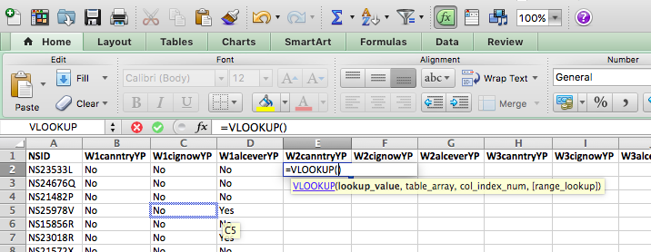

- *lookup value* - what value to match, 
- *table array* - where the lookup table is, 
- *col index num* - which column of this table you want, 
- and finally *range lookup* - whether or not you want exact match.

Our lookup value will be the NSID for this particular person. Here we find this in cell A2: 

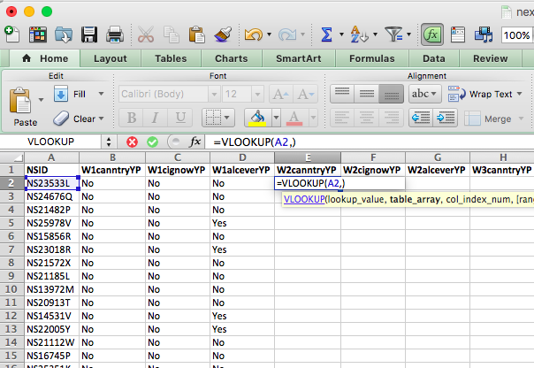

Now the table array is the lookup table. Where can we find the values for "W2canntryYP"? Well this is in the data set for wave 2. We've grabbed data from other sheets before, but never from a totally different file...! However the process is exactly the same. All you need to do, is find the data set, and select the range that represents your lookup table, which is all the data in this sheet!

Something like this: 

You can see that by going to the  sheet and highlighting the appropriate columns, your formula bar there, in your original file, is populated with the code to refer to those columns in that file! Just like we did when grabbing data from a different sheet within the same file. 

Remember the reference of a cell is `column letter + row number`? The reference for a cell from a sheet is `sheet name + ! + column letter + row number`? Well the reference for a cell from a sheet on an entirely different file is `[ + file name + ] + sheet name + ! + column letter + row number`. 

So you can see that by clicking and highlighting, excel has automatically populated with the reference, which in my case is: 

`[wave_2.xlsx]wave_2.csv!$A:$D` - which means I want from wave_2.xlsx file, the wave_2.csv sheet, columns A through D (static, because I've included the dollar signs there). 

If any of this is unclear flag us down to talk through these now. You've been slowly building up to this though. We have gradually made formulas more and more complex, so all these are, are formulas you've learned before, but all patched together, to be making some new formulas. 

So now we still have two parameters to define, the column index number, and the range lookup. Column index number asks you, which column, from your reference table do you want to grab. Since we've copied over our headings in order, we know that the first heading will be column number 2 (column 1 contains the reference IDs in the NSID variable. Remember the reference tables you made for recoding last week? Same concept, the values *to match* are in the first column). Then the second one will be column number 3, and the third, column number 4. So in this case, our column index number is 2, and the range lookup is FALSE, because we want an *exact match*. 

So our final formula looks like this: 

`=VLOOKUP(A2,[wave_2.xlsx]wave_2.csv!$A:$D,2,FALSE)`

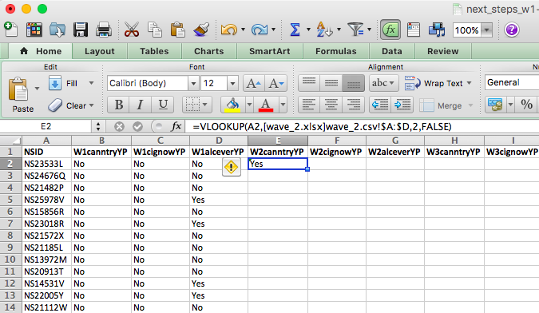

**NOTE** it's possible that for some of you (likely those on PCs) there will be quotes around the sheet reference in this formula, something like this: 

`=VLOOKUP(A2,'[wave_2(1).xlsx]wave_2.csv'!$A:$D,4,FALSE) `

see the `'` around the `[wave_2(1).xlsx]wave_2.csv`? You *might* see this in your version. But still achieves the same thing. 

Double click on the little blue square on the bottom right hand of the blue frame around this cell to copy the formula all the way to the bottom. 

To get the other two columns from the same sheet, you use the *exact same formula* except you change the column index number. Does it make sense why you do this? Because you're grabbing a *different column*. You're always grabbing the one that corresponds to your header, which you've copied over. If this is unclear make sure to raise your hand, so we can go through this. It's worth going through it even if you feel like you get it, as you will be doing this again in your task, and it's something much easier explained in person!

So now, copy the formula for the next two columns, change the column index number to 3 and to 4 as appropriate:

and you will see the values for each person from both wave 1 and wave 2 in there:

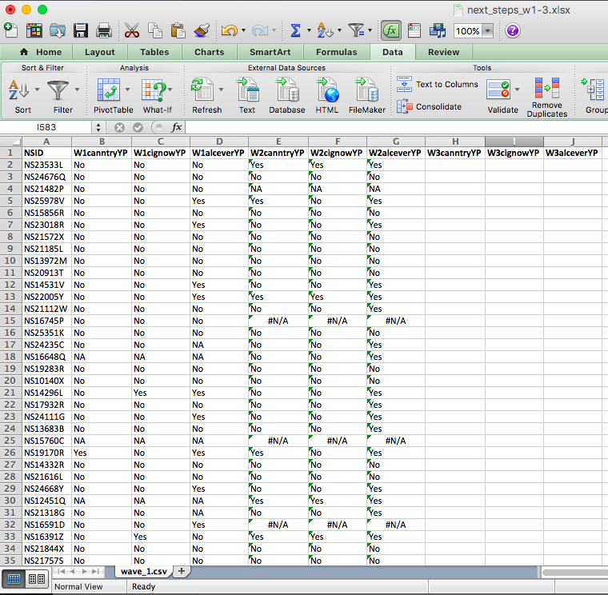

You can see that for some rows, in wave 2 we have a value of `#N/A`. This is because, that NSID is *not* found in the wave 2 data. 

One issue with longitudinal studies is something called **attrition**. Attrition occurs when cases are lost from a sample over time or over a series of sequential processes. One form of sample attrition occurs in longitudinal research when the subjects studied drop out of the research for a variety of reasons, which can include: unwillingness of subjects to continue to participate in research, difficulties in tracing original respondents for follow-up (for example, because of change of address) and nonavailability for other reasons (for example, death, serious illness). A survey of major longitudinal studies in the United States found that the average attrition rate was 17 per cent (Capaldi and Patterson, 1987, cited in Sapsford and Jupp, 1996). Therefore, quite a lot of cases may be lost. Attrition is one of the major methodological problems in longitudinal studies. It can deteriorate generalizability of findings if participants who stay in a study differ from those who drop out.

What you are seeing here are the presence of people who took part in wave 1, but not in wave 2. Attrition rates are important to know and mention in analysis of longitudinal data, to be able to discuss the issues which it may cause, as described above and in your readings. 

Attrition is only one cause of **missing data**. Sooner or later (usually sooner), anyone who does statistical analysis runs into problems with missing data. In a typical data set, information is missing for some variables for some cases. In surveys that ask people to report their income, for example, a sizable fraction of the respondents typically refuse to answer. Outright refusals are only one cause of missing data. In self-administered surveys, people often overlook or forget to answer some of the questions. Even trained interviewers occasionally may neglect to ask some questions. Sometimes respondents say that they just do not know the answer or do not have the information available to them. Sometimes the question is inapplicable to some respondents, such as asking unmarried people to rate the quality of their marriage. In longitudinal studies, people who are interviewed in one wave may die or move away before the next wave. When data are collated from multiple administrative records, some records may have become inadvertently lost.

You can see our second person with NAs there, NS15760C, also has NA values for the first wave. This means that while NS15760C was interviewed in the 1st wave (and potentially in waves 2 and 3 as well), they did not answer these questions! This could be because they put one of the answers that were coded as "NA", such as Refused to answer, wrote "Not applicable", or responses "Don't know", or because they were unable to complete or refused this whole section. Missing data is important, and it's important to know *why* your data is missing. When people refuse to answer something, it might be motivated by very different things than when people say "don't know" to something. If people with certain characteristics are more likely to not respond, then there might be systematic biases introduced through missing data. This is important to keep in mind. 

OK so let's copy over wave 3 as well, and then we can have a look at our attrition and so on rates. 

Have a go at doing this on your own, following the steps from when we copied over wave 2, but this time from the wave 3 file. 

If you need a little nudge, the formula which I ended up with was: `=VLOOKUP(A2,[wave_3.xls]wave_3.csv!$A:$D,2,FALSE)`. Yours might look something similar. 

Then, when that is done, you will see a final data set with all the three waves of these questions present in your data:

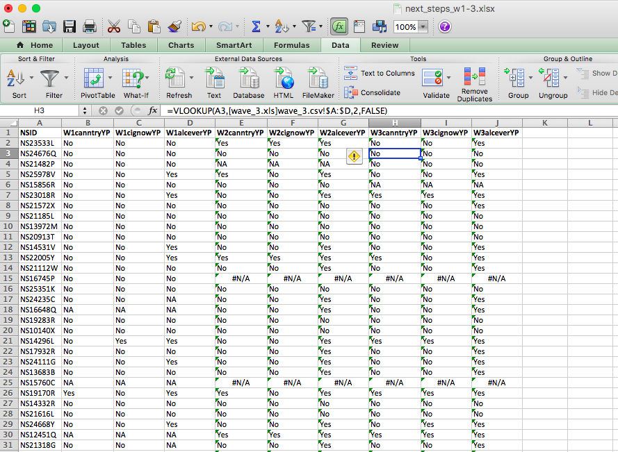

We picked up in the #N/A last time, there is another issue with longitudinal, and generally self-report data collection methods, available to spot here. Remember that all of our questions are asking people whether they have *ever* smoked, or *ever* tried cannabis, or *ever* had an alcoholic drink. So surely, once someone answers yes, you would expect them to keep answering yes, correct? Well, have a look at respondent number "NS23533L". While in wave 2, they admit to trying all cannabis and cigarettes and  alcohol, in wave three they seem to have forgotten this experience, and report that they have not ever tried either cannabis or cigarettes. The issue here is called **response bias**. 

Response bias is a general term for anything that influences the responses of participants away from an accurate or truthful response. These biases are most prevalent in the types of studies and research that involve participant self-report, such as structured interviews or surveys. It can be caused by a variety of factors, for example the phrasing of questions in surveys, the demeanour of the researcher, the way the experiment is conducted, or the desires of the participant to be a good experimental subject and to provide socially desirable responses may affect the response in some way. All of these " artefact" of survey and self-report research may have the potential to damage the validity of a measure or study. Because of response bias, it is possible that some study results are due to a systematic response bias rather than the hypothesized effect, which can have a profound effect on psychological and other types of research using questionnaires or surveys. It is therefore important for researchers to be aware of response bias and the effect it can have on their research so that they can attempt to prevent it from impacting their findings in a negative manner. Response biases can have a large impact on the validity of questionnaires or surveys.

There isn't much that we can do (at the stage of data analysis) to control for this. If you suspect that you will encounter response bias, you should consider this in your research design, and build measures into the data collection phase, that try to  account for or at least identify sources of response bias in your survey. 

## Complete cases (an approach to missing data)

There are a vast range of statistical techniques for accommodating missing data (see [www.missingdata.org.uk](www.missingdata.org.uk)). Perhaps the most commonly adopted is to simply exclude those participants in our dataset who have any data missing (in those variables we are concerned with) from our analysis. This is what is commonly known as a '**complete case analysis**' or 'listwise deletion' - we analyse only the complete cases. This approach simply says "we will not deal with any of the missing data", and instead subsets the analysis to the sample where participants have answered every question - in other words, only use the rows which do not have missing data. 

If data are missing complete randomly, meaning that the chance of data being missing is unrelated to any of the variables involved in our analysis, a complete case analysis is unbiased. This is because the subset of complete cases represent a random (albeit smaller than intended) sample from the population. In general, if the complete cases are systematically different from the sample as a whole (i.e. different to the incomplete cases), i.e. the data are not missing completely randomly, analysing only the complete cases will lead to biased estimates.

For example, suppose we are interested in estimating the median income of the some population. We send out an email asking a questionnaire to be completed, amongst which participants are asked to say how much they earn. But only a proportion of the target sample return the questionnaire, and so we have missing incomes for the remaining people. If those that returned an answer to the income question have systematically higher or lower incomes than those who did not return an answer, the median income of the complete cases will be biased. This is something to keep in mind when choosing the route of complete case analysis. 

### Activity 4: Selecting Complete Cases

But how can we include only the compete cases? Well for this you can use the filter function of Excel. Remember the little funnel icon? Well if you go to the Data tab, you will see it: 

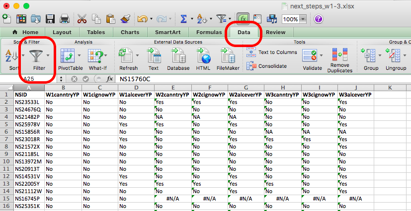

If you click on the Filter icon, you will see small downwards arrows appear on the column headers for your data, like so: 

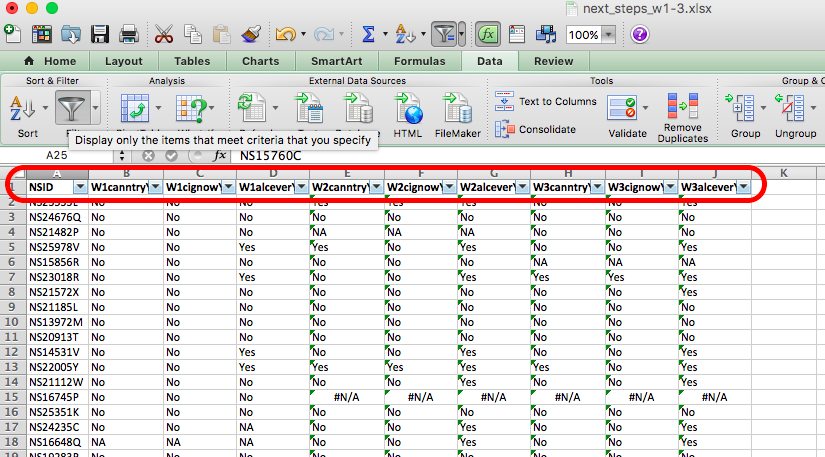

If you click on these arrows, you can see all the possible values that the variable can take, and you can see little check boxes next to these values. If you click in them you can toggle the tick/untick of these boxes, which means that you can hide the values which are not ticked. So in the first column, untick any value that is not "Yes" or "No", like so: 

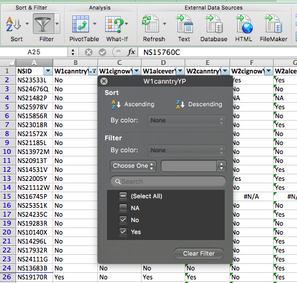

You can see that any rows that had an NA value have been hidden. For example in the above image you can see that row 18 is gone, and instead we see row 17 followed by row 19. You can repeat this for all your rows, and you will end up with only cases where the person has answered "Yes" or "No" to these questions across all three waves of the study. You now have only the *complete cases* for your analysis. 

Filtering only hides these rows though, and they could still show up in your analysis. You don't really want to delete data, because that's never a good idea in case you make a mistake, or want to go back and re-do some analysis this time including some missing variables as well. Instead, one thing that you could do is to copy the complete cases only, over to a new sheet called "complete cases". To do this, create a new sheet (remember, plus sign at bottom of spreadsheet) and call it  "complete cases".

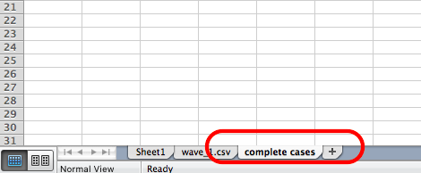

Then go back to your wave_1 sheet and copy all the columns, and then go back to your new, complete cases sheet, and paste in the values. You now have a new sheet, in your excel workbook, that has only the complete cases. 

So what do these complete cases look like? I can tell you, that there were originally 1000 people in this sample that I've subset for you. So now, after you've removed all the NAs, and have only complete cases, how many complete cases do you have?

If you did the same thing to me, you should have 622 cases left. Pretty big attrition rate, eh? Something to think about...!

Now, finally, since we've worked so hard on this data, let's have a look at it. Can you tell me, whether the percent of those who answered all questions in all three waves who *have* tried cannabis increases from wave to wave? 

If your gut reaction to this question was to do with fear and confusion, one thing you could do is think back to all the skills that we've learned so far, and which one of these you would need to draw on, to be able to answer this question. First, if you want to know if the percent of people who have tried cannabis (that is - answered yes to the question about trying cannabis) is greater for each wave than the wave before, you need to find out: what percent of people tried cannabis in wave 1, what about wave 2, and what about wave 3? In our newly created, complete cases data set, we know that we have one variable for cannabis trying in each wave. These are W1canntryYP for wave 1, W2canntryYP for wave 2, and W3canntryYP for wave 3. How can you find out the % who said yes for each one of these? Well remember our univariate analysis of a categorical variable, where we can find out the count of values for each variable with a pivot table? And then how we can translate those into percentages? 

If not, then refer back to your notes from the 2nd week on univariate analysis. If yes, you now know you need to make 3 pivot tables, and save the answers from each. You can then combine those into a **complex table**. Remember complex tables from the feedback session after the bivariate analysis labs, on week 3? 

So you can do something like this: 

In the end you will end up with a table like this: 

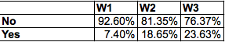

And you can even get fancy and plot this change over time, to emphasise that indeed, there is an increase in the percent of respondents who answer yes to trying cannabis wave on wave: 

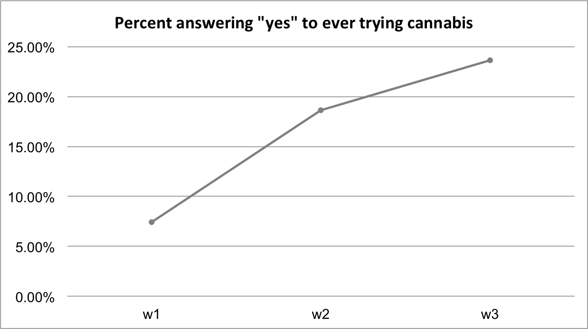

But we'll do more plotting and visualisation after reading week, when we have our data viz session. 

## Ethics

I wanted to leave you with a final note on research ethics. It's an essential part of your research design that you consider the ethical implication of your study, both on your participants, on your researchers (including yourself), and on the wider community. 

Watch [this 7 minute video that gives a good introduction to research ethics](https://www.youtube.com/watch?v=Zbi7nIbAuMQ), and pay particular attention to the concepts of: 

- informed consent
- beneficence (benefits and harms to society)
- justice

The "IRB" section is specific to the USA, however, we also have our own code of ethics, and all research needs to undergo an ethical review. Internally, the University of Manchester has created an ethics decision tool. You can navigate through this tool to determine whether or not your research requires ethical approval. You can access the tool, and read more about the university's ethics procedures [here](https://www.manchester.ac.uk/research/environment/governance/ethics/)

## Summary

In sum, you should now be able to think about the research design that either you need to create to collect data, or that someone else has created in order to collect the data that you are working with. There are many decisions that go into designing a research study, and there are pros and cons associated with each approach. When you use randomised control trials, you have to consider the random assignment, when you use longitudinal data, you will have to join the data sets collected at different points in time, and think about things like attrition. The study design has implications for what research questions the data you collect will allow you to answer, and what analysis you'll be able to carry out.  You should be comfortable with the following terms:

- dependent (response/ outcome) variable
- independent (predictor) variable
- treatment
- control
- evaluation
- simple randomization
- stratified randomisation
- confounding variable
- waves
- attrition
- missing data
- response bias
- complete cases
- ethics
    + informed consent
    + beneficence (benefits and harms to society)
    + justice

<!--
#Sources

- [Alex R. Piquero & Nicole Leeper Piquero](http://www.encyclopedia.com/law/legal-and-political-magazines/criminology-and-criminal-justice-research-methods)
- [Jonathan Bartlett](http://thestatsgeek.com/2013/07/06/when-is-complete-case-analysis-unbiased/)

-->
