# Week 6 {#week6}

## Learning outcomes

This week is the most fun week in all of data analysis - the week where we learn about the principles of data visualisation. The visual display of your data is so important because it gives you a chance to communicate what is interesting in pictures. Simple, neat graphs can tell you in one glance, what you might have to read many paragraphs of text to otherwise learn. Visualisation is an art and a science, and this week we will explore the work in this area, and hopefully you will only produce beautiful, and meaningful visualisations of your data from now on. 

Here are some terms that we will cover today: 

- Visualising data
- Principles of good data visualisation
    + Ink to data ratio
- Grammar of graphics
- Exploratory viz
- Communicating results


## Visualising data


A picture is worth a thousand words; when presenting and interpreting data this basic idea also applies. There has been, indeed, a growing shift in data analysis toward more visual approaches to both interpretation and dissemination of numerical analysis. Part of the new data revolution consists in the mixing of ideas from visualisation of statistical analysis and visual design. Indeed data visualisation is one of the most interesting areas of development in the field.

Good graphics not only help researchers to make their data easier to understand by the general public. They are also a useful way for understanding the data ourselves. In many ways it is very often a more intuitive way to understand patterns in our data than trying to look at numerical results presented in a tabular form. 

Recent research has revealed that papers which have good graphics are perceived as overall more clear and more interesting, and their authors perceived as smarter (see [this presentation](https://vimeo.com/181771433))


## Why visualise data?


New insights. Visualising data can give you new insights into your own data (exploratory data visualisation) as well as effectively communicate the results from your studies to your audiences. 


Interactive data visualisation is something that has the power to really engage people with a topic. Instead of just passively telling people numbers in a table, visualisations can help engage your reader. But don't take my word for it, give it a go yourself! Have a look at [this article in The Upshot (NYT's data-driven venture, focused on politics, policy and economic analysis) ](https://www.nytimes.com/interactive/2017/04/14/upshot/drug-overdose-epidemic-you-draw-it.html). It should be an interesting little activity - you can draw the graph that represents the trends you think are happening, and then compare with the actual figures. Seriously try it out, it should be fun!


So we won't quite be learning how to make these kinds of interactive visualisations, but we will learn some basic principles behind effective data visualization. By the end of today you should also have a practical sense for why some graphs and figures work well, while others may fail to inform or actively mislead. You will know how to create a wide range of plots in Excel as well as how to refine plots for effective presentation.


## Anatomy of a plot - the Grammar of Graphics


>  The grammar of graphics takes us beyond a limited set
of charts (words) to an almost unlimited world of graphical forms (statements).
The rules of graphics grammar are sometimes mathematical and
sometimes aesthetic. 

- Leland Wilkinson (2005) *The Grammar of Graphics*


The grammar of graphics is about creating graphs mathematically. Essentially the philosophy behind this as that all graphics are made up of layers, the idea that you can build every graph from the same few components: a data set, a set of geoms—visual marks that represent data points, and a coordinate system.

Take this example (taken from *Wickham, H. (2010). A layered grammar of graphics. Journal of Computational and Graphical Statistics, 19(1), 3-28.*)

You have a table such as: 


You then want to plot this. To do so, you want to create a plot that combines the following layers: 

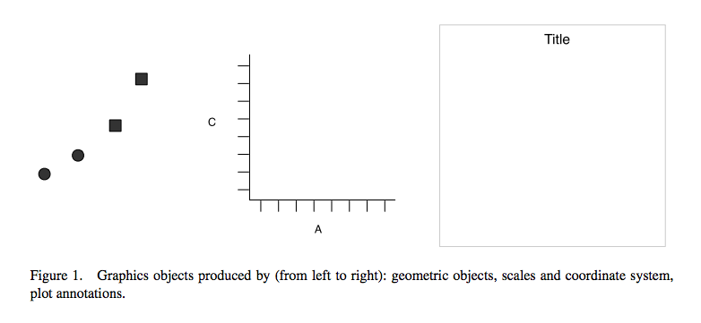

This will result in a final plot: 

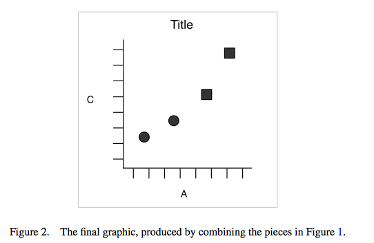


> We often call graphics charts (from or Latin charta, a leaf of paper or papyrus). There are pie charts, bar charts, line charts, and so on. [The Grammar of Graphics] shuns chart typologies. For one thing, charts are usually instances of much more general objects. Once we understand that a pie is a divided bar in polar coordinates, we can construct other polar graphics that are less well known. We will also come to realize why a histogram is not a bar chart and why many other graphics that look similar nevertheless have different grammars. (...) The concept of a graphic is so general that we need organizing principles to create instances of graphics. We may not want to put a pie chart in a catalog, but we need to give users some simple way to produce one. 

- Leland Wilkinson (2005) *The Grammar of Graphics*


## Principles of good data visualisation 


There is a vast amount of research into what works in displaying quantitative information. 
The classic book is [The Visual Dispay of Quantitative Information by Edward Tufte](https://www.edwardtufte.com/tufte/books_vdqi), but since him there are many other researchers as well who focus on approaches to displaying data. Your reading for this week will provide you a crash course into data viz. 


The **Data-Ink ratio** is a concept introduced by Edward Tufte, the expert whose work has contributed significantly to designing effective data presentations. In his 1983 book, The Visual Display of Quantitative Data, he stated the goal is to "Above all else show the data". 

> A large share of ink on a graphic should present data-information, the ink changing as the data change. Data-ink is the non-erasable core of a graphic, the non-redundant ink arranged in response to variation in the numbers represented

- [Tufte, 1983](https://www.edwardtufte.com/tufte/books_vdqi)


Tufte refers to data-ink as the non-erasable ink used for the presentation of data. If data-ink would be removed from the image, the graphic would lose the content. Non-Data-Ink is accordingly the ink that does not transport the information but it is used for scales, labels and edges. The data-ink ratio is the proportion of Ink that is used to present actual data compared to the total amount of ink (or pixels) used in the entire display. (Ratio of Data-Ink to non-Data-Ink).


Good graphics should include only data-Ink. Non-Data-Ink is to be deleted everywhere where possible. The reason for this is to avoid drawing the attention of viewers of the data presentation to irrelevant elements.
The goal is to design a display with the highest possible data-ink ratio (that is, as close to the total of 1.0), without eliminating something that is necessary for effective communication.


###  An example: 


This is an example of a graph with a low Data-Ink Ratio:


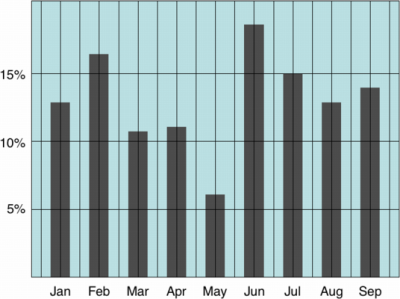


The border around the graph, the background color and the grid lines are all unnecessary data ink.


Now an example of a graph with a high Data-Ink Ratio:


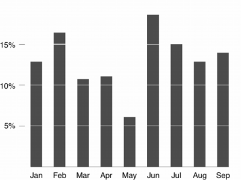

We have deleted the border around the graph, the background color and the grid lines and have thus drawn the viewer's attention to horizontal scales that are data-ink. There is nothing else to distract and the key features of the data stand out clearly. 


### Criticisms


Inbar, et al, evaluated in 2007 the people's acceptance of the minimalist approach to visualize information. They asked 87 students to rate their preference for two different graphs displaying identical information - a standard bar-graph and a minimalist version [Inbar, 2007](http://portal.acm.org/citation.cfm?id=1362587). The results showed that the majority students did not like Tufte's minimalist design of bar-graphs - instead they seem to prefer "chartjunk". [Inbar, 2007](http://portal.acm.org/citation.cfm?id=1362587).


In the example shown above, increasing the data-ink ratio made it harder to read most of the data. For example, removing the top border of the chart removed an implied 20% line. It also made it harder to see how much the graph lies (in that it does not show a range from 0% to 100%, and/or does not show the domain from January through December). [How to Lie with Statistics](https://www.librarysearch.manchester.ac.uk/primo-explore/fulldisplay?docid=44MAN_ALMA_DS21134626320001631&context=L&vid=MU_NUI&search_scope=BLENDED&isFrbr=true&tab=local&lang=en_US) discusses this flaw in the example charts.


## What makes a bad graph bad?


Whether or not you subscribe to Tufte's school of minimalism, you should be able to recognise *bad* graphs. What makes a bad graph bad though? The generic overview answer to this is that bad graphs are the ones where it becomes difficult for your audience to interpret the meaning you are trying to convey. 


On the other hand, your audience might have some sort of expectations for what they require from you. You will have to manage a route between what you might be told that you need to produce, for example by a boss, and what is the best method for visualising your data in a way that communicates your results effectively. 


A good example of this dilemma is the pie chart. 

> A pie chart is perhaps the most ubiquitous of modern graphics. It has been reviled by statisticians (unjustifiably) and adored by managers (unjustifiably). It may be the most concrete chart, in the sense that it is a pie. A five-year-old can look at a slice and be a fairly good judge of proportion. (To prevent bias, give the child the knife and someone else the first choice of slices.) The pie is so popular nowadays that graphical operating systems include a primitive function for drawing a pie slice.

- Leland Wilkinson (2005) *The Grammar of Graphics*


Indeed, a lot of people shun the pie chart (see for example this blog entry titled [death to pie charts](http://www.storytellingwithdata.com/blog/2011/07/death-to-pie-charts)) or this story from Business Insider titled [pie charts are the words](http://www.businessinsider.com/pie-charts-are-the-worst-2013-6?IR=T), but managers have a particular affinity towards it.  While these seem emotional and unfair, there is actually justification for these. People are actually *not* that great in telling proportions from pie charts. If you are interested, have a look at [this study](https://eagereyes.org/blog/2016/a-reanalysis-of-a-study-about-square-pie-charts-from-2009), where researchers found that a square pie chart performs the best, when people have to guess the proportion that it represents. 


There are other charts as well, which are less popular to hate, but in certain situations may obscure important information. In some cases bar plots can hide important features of your data, and might not be the most appropriate means for comparison. See the below image for example, where the same data about 2 groups, green and purple, are visualised using 3 different methods, a histogram, which shows the green group following a normal distribution, and the purple group following a heavily skewed distribution (remember week 5), a boxplot that shows the same, and finally a bar plot, which makes the green and purple group appear identical: 


Now potentially, the  [kickstarter campaign](https://www.kickstarter.com/projects/1474588473/barbarplots/description) around actually banning bar plots might be a bit of an extreme leap, but it is important to keep in mind that the kind of visualisation that you choose might greatly impact the conclusions that people will draw about your data, and the story that you are able to tell. 


There are some recommendations on what to use (and not use) in certain contexts, which can help you avoid making a bad graph. For example, most data visualisation experts agree that you should not use 3D graphics unless there is a meaning to the third dimension. So using 3D graphics just for decoration, as in [this case](https://mir-s3-cdn-cf.behance.net/project_modules/disp/2505dd10837923.56030acd2ef20.jpg) is normally frowned upon. However there are cases when including a third dimension is vital to communicating your findings. See this [example](http://www.visualisingdata.com/2015/03/when-3d-works/).


You can see also an example in the graph below:


Because of the angle and the 3D you cannot really read off the extent of differences between regions. 


We want to create pictures of data that people, including ourselves, can look at and learn from.

But it is not always enough for you to know the perfect visualisation, it is important that you also know that your audience is comfortable interpreting these types of visualisations. Before I became a lecturer at Manchester, I worked as a crime analyst. I love data, and I was just coming out of my education, so I felt very comfortable with stats and data analysis, however my lack of real-world experience was made very evident when I entered my first ever briefing, with 3 Chief Inspectors from the Met Police to present them the work I'd done analysing confidence in police. My second slide was a set of boxplots, comparing the scores on a public attitudes survey between their sectors. It might have looked something like this (the data is fictitious by the way): 


```{r, echo=FALSE, message=FALSE, warning=FALSE}

library(ggplot2)
ggplot(mtcars, aes(y=mpg, x=as.factor(cyl)))+
  geom_boxplot() +
  ylab("Confidence score (out of 50)") +
  scale_x_discrete(name ="Sector",labels=c("North","East","Central"))


```


It was useless. I spent basically all my alloted time trying to talk through the graph, and it achieved the opposite effect of clearly displaying information, and telling the story of the different levels of confidence in each Sector. I did not take my audience into account, and that made my visualisation ineffective. It was not a great moment, but at least I got an embarrassing story to tell when teaching people about data visualisation. 


## What graph should I use?


There are a lot of points to consider when you are choosing what graph to use to visually represent your data. There are some best practice guidelines, but at the end of the day, you need to consider what is best for your data. What do you want to show? What graph will best communicate your message? Is it a comparison between groups? Is it the frequency distribution of 1 variable? 


As some guidance, you can use the below [cheatsheet, taken from Nathan Yau's blog Flowingdata](https://flowingdata.com/2009/01/15/flow-chart-shows-you-what-chart-to-use/):


However, keep in mind that this is more of a guideline, aimed to nudge you in the right direction. There are many ways to visualise the same data, and sometimes you might want to experiment with some of these, see what the differences are. You can also consider some inspiration [here](http://datavizproject.com/). 


Channels for mapping ordered data (continuous or other quantitative measures), arranged top-to-bottom from more to less effective, after Munzer (2014, 102) created by [Kieran Healy](http://socviz.co/):


Channels for mapping unordered categorical data, arranged top-to-bottom from more to less effective, after Munzer (2014, 102) created by [Kieran Healy](http://socviz.co/):


## Edges, Contrasts and Colors

Looking at pictures of data means looking at lines, shapes, and colors. Our visual system works in a way that makes some things easier for us to see than others. I am speaking in slightly vague terms here because the underlying details are the remit of vision science, and the exact mechanisms responsible are often the subject of ongoing research. I will not pretend to summarize or evaluate this material. In any case, independent of detailed explanation, the existence of the perceptual phenomena themselves can often be directly demonstrated through visual effects or “optical illusions” of various kinds. These effects demonstrate that, perception is not a simple matter of direct visual inputs producing straightforward mental representations of their content. Rather, our visual system is tuned to accomplish some tasks very well, and this comes at a cost in other ways.

The active nature of perception has long been recognized. The Hermann grid effect, shown in the figure below, was discovered in 1870. Ghostly blobs seem to appear at the intersections in the grid but only as long as one is not looking at them directly. 


A related effect is shown below. These are Mach bands. When the gray bars share a boundary, the apparent contrast between them appears to increase. Speaking loosely, we can say that our visual system is trying to construct a representation of what it is looking at based more on relative differences in the luminance (or brightness) of the bars, rather than their absolute value. 


Similarly, the ghostly blobs in the Hermann grid effect can be thought of as a side-effect of the visual system being tuned for a different task.


These sorts of effects extend to the role of background contrasts. The same shade of gray will be perceived very differently depending on whether it is against a darker background our a lighter one. Our ability to distinguish shades of brightness is not uniform, either. We are better at distinguishing darker shades than we are at distinguishing lighter ones. And the effects interact, too. We will do better at distinguishing very light shades of gray when they are set against a light background. When set against a dark background, differences in the middle-range of the light-to-dark spectrum are easier to distinguish.

Our visual system is attracted to edges, and we assess contrast and brightness in terms of relative rather than absolute values. Some of the more spectacular visual effects exploit our mostly successful efforts to construct representations of surfaces, shapes, and objects based on what we are seeing. Edward Adelson’s checkershadow illusion, shown below, is a good example.


## Colour


When choosing color schemes, we will want mappings from data to color that are not just numerically but also perceptually uniform. The goal in each case is to generate a perceptually uniform scheme, where hops from one level to the next are seen as having the same magnitude. Excel will take care of these for you, by offering colour palettes in the "Design" section of the Chart Layout tab: 


Gradients or sequential scales from low to high are one of three sorts of color palettes. When we are representing a scale with a neutral mid-point (as when we are showing temperatures, for instance, or variance in either direction from a zero point or a mean value), we want a diverging scale, where the steps away from the midpoint are perceptually even in both directions. The blue-to-red palette in the design layouts above is one example. Finally, perceptual uniformity matters for unordered categorical variables as well. We often use color to represent data for different countries, or political parties, or types of people, and so on. In those cases we want the colors in our qualitative palette to be easily distinguishable, but also have the same valence for the viewer. Unless we are doing it deliberately, we do not want one color to perceptually dominate the others. 


The main message here is that you should generally not put together your color palettes in an ad hoc way. It is too easy to go astray. In addition to the considerations we have been discussing, there we might also want to avoid producing plots that confuse people who are colour blind, for example, and color blindness comes in a variety of forms. Fortunately for us, almost all of the work has been done for us already. Different color spaces have been defined and standardized in ways that account for these uneven or nonlinear aspects of human color perception.


A good resource website is [colorbrewer](http://colorbrewer2.org/). This site offers many colour schemes that you can use in your graphs if you wanted to introduce manual colours. The site looks somewhat like this: 


Go to the site, and select  a colour scheme that you like. When you do you can see that you can adjust the number of categories that you need to create a colour scheme for: 


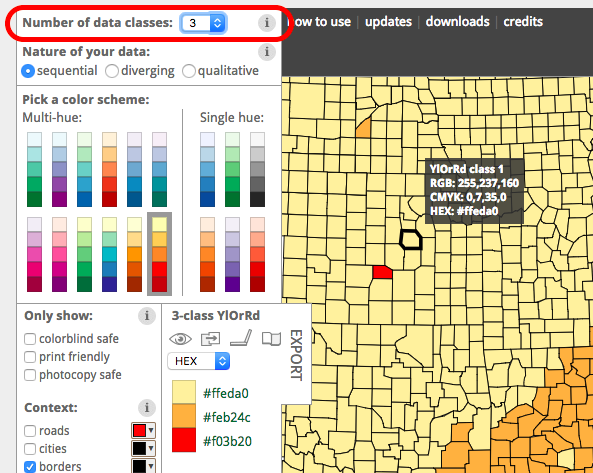


You will set these to the number of values in your categorical variable for example. 


Then you can also select the colur scheme that is most appropriate for your variable. If you have ordinal categories for example, then you could use a sequential scale - going from dark blue to light blue. On the other hand, if you have nominal variable, then a sequential colour scale would not make sense. In this case you would use a qualitative scale. If you are unsure why this is the case, raise your hand now, and we can help explain. 


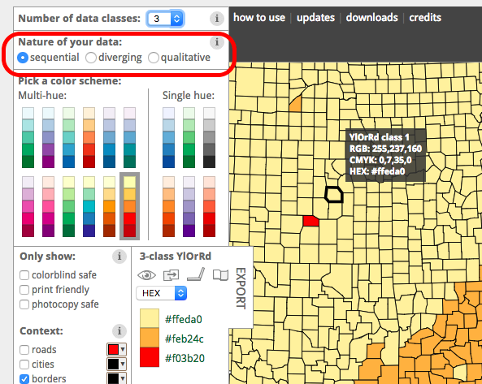


You might be thinking that that's real nice, but how do we get these colours into our excel graphs? Well you may notice the code next to the colours:


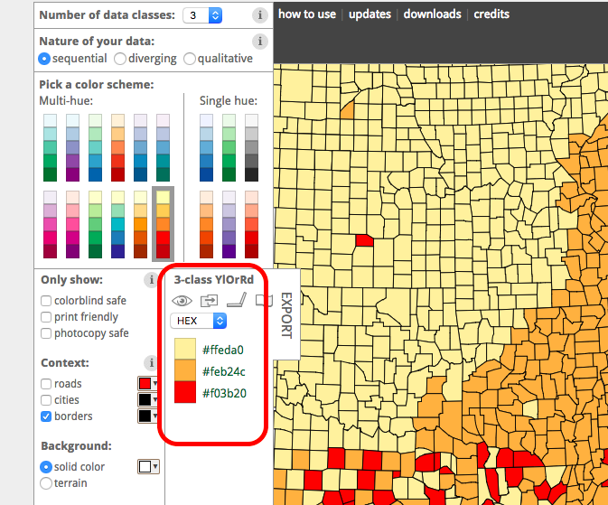


These are ways for the computer to be able to understand what the value is for that colour. There are a few options. Here we see HEX values for each colour. 


A hex triplet is a six-digit, three-byte hexadecimal number used in HTML, CSS, SVG, and other computing applications to represent colors. The bytes represent the red, green and blue components of the color. One byte represents a number in the range 00 to FF (in hexadecimal notation), or 0 to 255 in decimal notation. This represents the least (0) to the most (255) intensity of each of the color components. Thus web colors specify colors in the True Color (24-bit RGB) color scheme. The hex triplet is formed by concatenating three bytes in hexadecimal notation, in the following order:

- Byte 1: red value (color type red)
- Byte 2: green value (color type green)
- Byte 3: blue value (color type blue)


Not sure if you might still be the generation that had any interaction with MySpace, but that was an excellent venue to learn about hex colours and html customisation. I guess a potentially more relevant venue would be tumlbr, if any of you use this and want to customise your pager, [you can use html to do this](https://www.tumblr.com/docs/en/custom_themes). Now you don't need to do this at all, but you should now know, that if you want to change the colour of something, you need to know the hex code for this colour. And this is what colourbrewer is telling you above. 


If you want the three colours you see there you have to use the codes `#ffeda0`, `#feb24c`, `#f03b20`. 


You can also change the display, from HEX to RGB or CMYK codes, which are just used in different contexts. You can ask colourbrewer to display these codes instead by changing the value in the dropdown menu: 


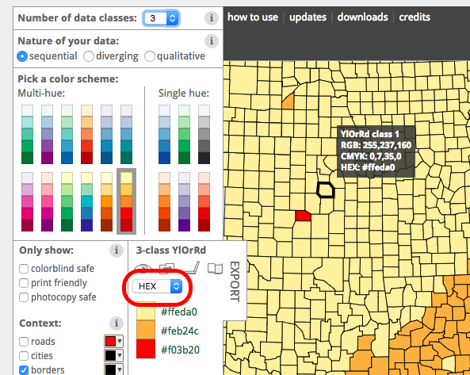


If this is something you're interested in I'm happy to chat about these, raise your hand now. 


Right, but how do we get these colours into our excel graph? Well let's give it a go.


### Activity 1: Custom colours in Excel graphs. 

<span style="color:#d95f02">
Download the FBI crime statistics data from Blackboard under the Week 6 materials in course content.


Open the data up in excel, and have a look at it. You can see that it include the number of crimes for various crime types for each year from 1994 to 2013, as well as some columns for crime rate. Crime rate is important because it normalises the *number* of crimes by the population at risk. Why is this important?


Well think about this - where do you expect more pickpocketing incidents, outside Piccadilly station, or in Platt Fields Park? Why? 


My guess is that you said Piccadilly station, and because there are more people close together. There are **more possible targets**. That's what you are accounting for when calculating crime rate. In this case, they are accounting for changes in the population between the years, to make sure that you can compare the crimes between the years. It might not make a lot of sense to say that a particular crime is increasing if the population is also increasing, because as a percentage, the crime might not actually be increasing at all. So instead we consider the population. 


But is the population increasing? Well lets create a column graph of the population. 


To do this, select the *Population* column, and choose the clustered column graph option: 


You can see however that the category axis labels are not very meaningful. They are only numbers, from 1 to 20, and do not help you answer whether population changes between the years. 


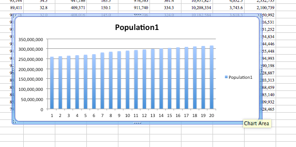


To add axis labels, right click anywhere on the chart area, and select the "Select Data..." option: 


Then, click into the text box next to the *Category (X) axis labels*, and then select the values in the *Year* column. Make sure to select only the values, and not also the column header: 


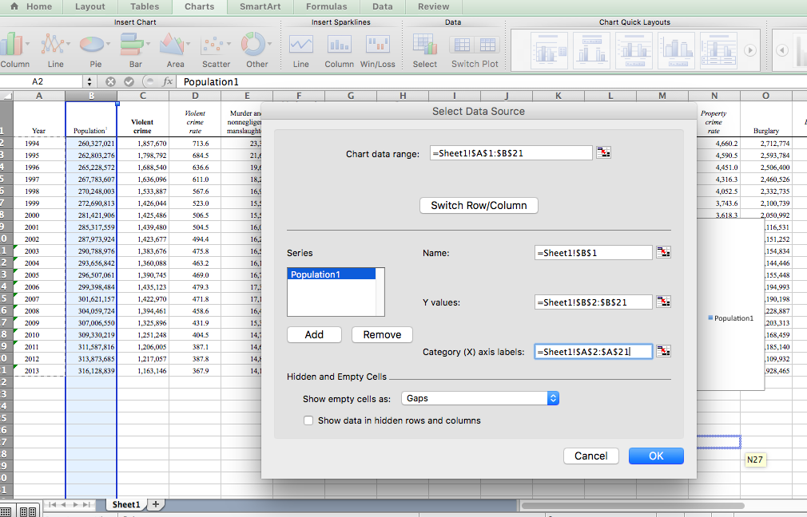


Now we can see the differences. However what we wanted to demonstrate here is how to change the colour of your graphs to what you wanted, potentially some colours from colourbrewer. 


Well to do this, you can double click on any of the bars, which should open up a popup window. 

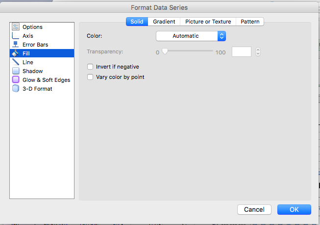


On this, select the "Fill" option. On this you can see there is a dropdown menu, where you can select the fill. 


If you're on a PC, if you double click on the bars to change the fill, the pop up window doesn't have the color option immediately like what is shown above (for mac). Instead you will have to first select the option for "Solid fill", an then the colour option will appear: 


Click on the option for "More Colours..."


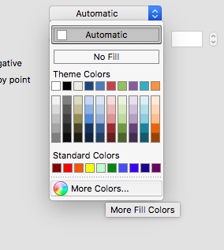


This opens up a new set of options. You can see it's set to RGB sliders. If you wanted to, you could use the RGB code, and set the red, green, and blue levels in a way that gets you your colour. If you are using a PC you will have to use the RGB code for the rest of the exercise (we'll get to this in a second). If you're using a mac, you can also just paste your hex code in the box below the sliders, that says "Hex Color #". 


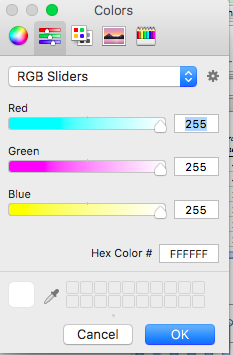


So let's say that we want to change the colour to the middle value from the colourbrewer scale above. Well we can see that the hex code for that is `#feb24c`. So what we need to do is change the code in the text box above, where it says "FFFFFF" to "feb24c": 


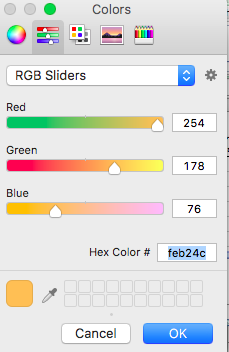


If you're on a PC, then you will have to change the drop down selection menu on the colorbrewer2.org:


and set it to "RGB" scale. This will give you the values for the red, green, and blue sliders. In this case, that will be:

- R: 254
- G: 178
- B: 76


Enter those values in the pop-up window that appears:


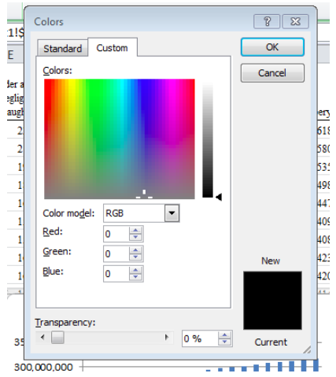


So set each colour to this value, and click "OK", and ta-daaa, your graphs will appear with manual colour: 


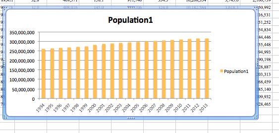

</span>


In this case we don't have a stacked bar, we just have the one variable, so it's not hugely useful, but I wanted to demonstrate how you can insert your own colours there. You might want to do this later, in the more complex graphs. Your decisions about color will focus more on when and how it should be used. Colour is a powerful channel for picking out visual elements of interest, and can really make a difference to your graph. You are very welcome to use the excel default colours in your graphs within this course, but if you're interested in learning more about colour [have a look at this page](https://lisacharlotterost.github.io/2016/04/22/Colors-for-DataVis/). 


## Reading between the lines (points) 


What sorts of relationships are inferred, and under what circumstances? In general we want to identify groupings, classifications, or entities than can be treated as the same thing or part of the same thing:

- **Proximity:** Things that are spatially near to one another are related.
- **Similarity:** Things that look alike are related.
- **Connection:** Things that are visually tied to one another are related.
- **Continuity:** Partially hidden objects are completed into familiar shapes.
- **Closure:** Incomplete shapes are perceived as complete.
- **Figure/Ground:** Visual elements are either in the foreground or the background.
- **Common Fate:** Elements sharing a direction of movement are perceived as a unit.


## Exploratory data visualisation


Data visualisation helps you unlock the hidden meaning in your data. It is the first tool of the data analyst. When you are given a heap of data, the only way to start getting some insight into it is to start making some visualisations. If you remember in weeks 2 and 3, when we did our univariate and bivariate analyses, we always started with graphing our data. And in some instances, visualising data itself can lead to surprising insights. 


I suggest that in your own time, you listen to [this episode of the datastories podcast](http://datastori.es/66-iquantnyc/) which consists of an interview with Ben Wellington, the author of the blog [I Quant NY](http://iquantny.tumblr.com/). I mentioned him in the opening lecture, he's the guy who found the [fire hydrant that earns $30,000 a year](http://iquantny.tumblr.com/post/87573867759/success-how-nyc-open-data-and-reddit-saved-new). It's a good interview, so definitely bookmark it for later!


Exploratory data visualisation is a way for you to get to know your data. It is a way to explore patterns and trends that you might not immediately see. We've covered some of this when we were performing univariate and bivariate analyses, but we will focus on how data visualisation can help you answer questions about your data, and also spend some time on making sure these graphs are in line with good practice. 


### Comparing categories

<span style="color:#d95f02">
Let's practice answering questions with data. Go back to the FBI data you downloaded from Blackboard. 


So firstly, let's say we want to know the answer to the following question: 

- **What year had the highest violent crime rate?**


You can see that the appropriate data is in the column labelled *Violent Crime Rate*. So what do you think is the best way to visualise this? You could look at your chart selection thought starter above, and see that one option for comparisons is to use column graphs. So let's give that a go: 


Select the column that contains the data for violent crime rate. Highlight it. When you have highlighted that column then go to your chart selector, and select *Column* > *2-D Column* > *Clustered Column*. Like so: 


Once you select this, a default column chart should appear. You can see however that the category axis labels are not very meaningful. They are only numbers, from 1 to 20, and do not help you answer your question, *What year had the highest violent crime rate?*. 


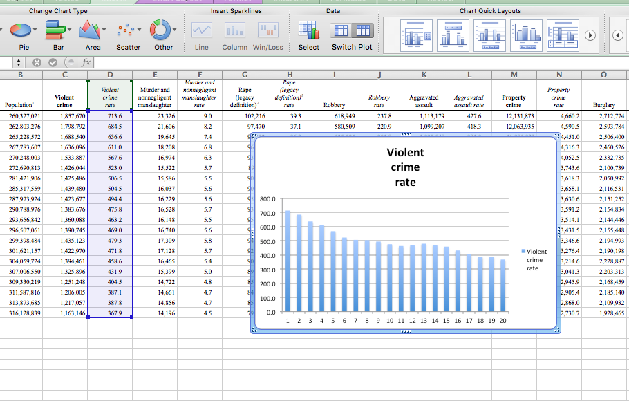


To add axis labels, right click anywhere on the chart area, and select the "Select Data..." option: 


Then, click into the text box next to the *Category (X) axis labels*, and then select the values in the *Year* column. Make sure to select only the values, and not also the column header: 


Once you've done that, click on "OK", and you will see the labels updated: 


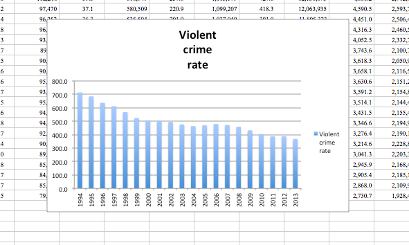


Now you can see that your x-axis labels are meaningful, and essentially from this point on, you can use this graph to answer your question: *What year had the highest violent crime rate?*. 


We can see that 1994 had the highest violent crime rate. 


But this graph is not necessarily in line with the best practice around data ink, and around all of the visuals introduced having meaning. 


Firstly, we are talking about number of crimes per 100,000 population. Since we are talking about **number of crimes** we know that we will be talking about whole numbers. Even if we end up with some decimal points after dividing by population to get the rate, it would not necessarily be meaningful to report fractions of crimes. So we can remove the .0 from the y-axis labels, as it adds no value to our graph. To do this, double click on the text in the y-axis labels. It will bring up a window where you can see some choices to select what to edit, in the left hand side of the window. 


It might automatically be selected to "Scale":


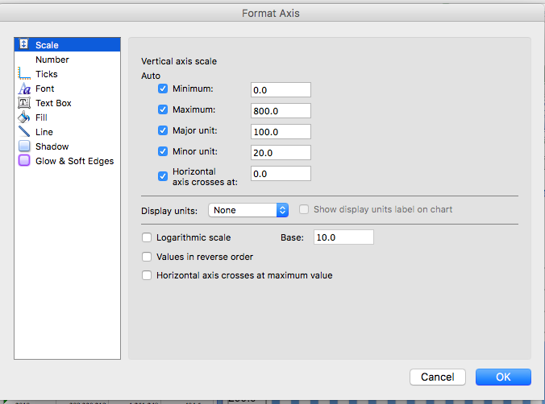


Click on the next one down, the one that says "Number". In the options that come up, *untick* the box next to "Linked to source". Once you untick this box you should have available some options for you to make changes. You can then edit the text box next to where it says "Decimal places", and set it to 0, like so: 


You can now also go to the other options, and make changes there. For example, you might decide that you want to increase the font size, to make your graph easier to read, and also that you might want to change your font to something easier to read, such as Arial:


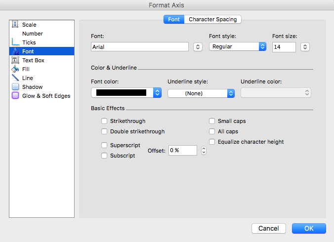


On a PC, the "format axis" window has different options. There is no font or text box options for example. However you can do those things on the main screen of Excel (using the toolbar at the top). Just select the axis and change the fonts from there. Or you can change the font with this menu as well:


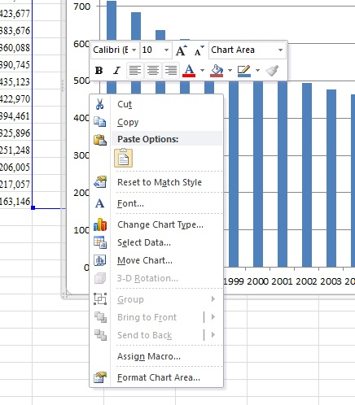


Click "OK" when you are finished. 


If you change your font, and also your font size, you should make sure to apply to all of your axis labels. To do this, just double click on the x-axis labels (the years) and the same pop-up window will appear. Make sure to set the font to the same font, and the font size to the same size for both axes, to ensure consistency: 


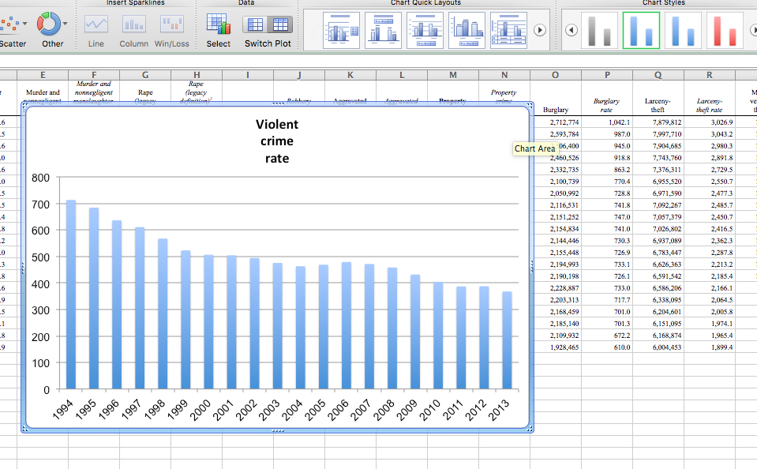


The other bit of information you're providing here that doesn't really have much meaning attached to it here is colour. What does the blue in the bars mean? And why is there a gradient? Why are the bars lighter blue on the top, and darker blue on the bottom? These are questions that people looking at this chart might ask, and we, the people who made the chart, do not actually have any good answers to!
(actually on the PC there might not be a gradient, but on a mac there is, and just in case, it's good to note this). 


So to get around this, let's set our bars to solid black, to get around any possible issues with introducing colour. To do this, this time double click on any of the bars, to open up a popup window. Again there will be options on the left hand side. First select the option for "Line" and make sure that you set this to "No Line": 


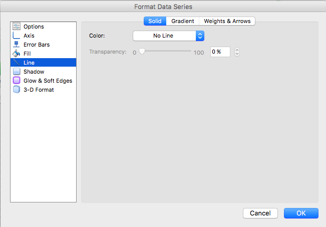

Then click on "Shadow" and make sure to just untick the box next to where it says "Shadow". Again there is no point to introduce a shadow here, as it would give you no additional information, it represents no data, and therefore can only introduce confusion into your chart. 


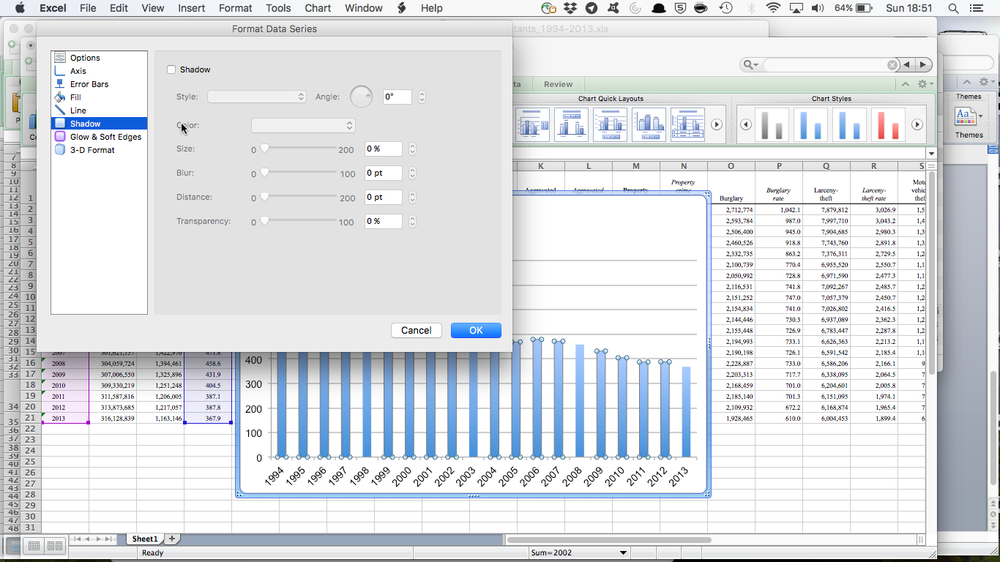


Finally, select fill, and set your fill colour to black: 


Once you are done with all this, you can click on "OK" and you will have your final bar graph ready to be inserted into a report: 


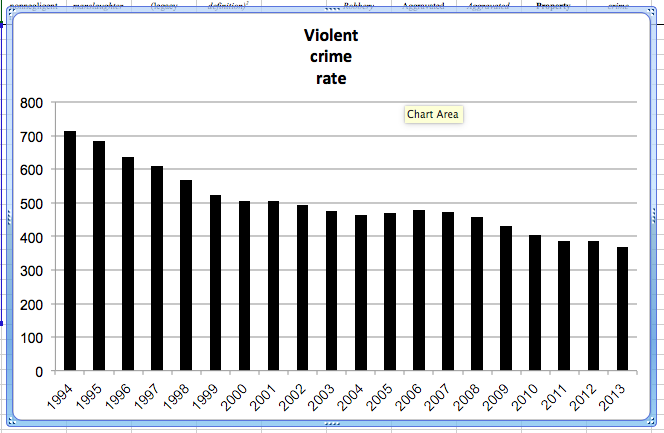


</span>


Ta-daaa. So is this the best graph to answer our question? Well you could explore a few more, and see what happens. 

<!--
Let's try a pie chart. We keep hating on it, let's see if we should give it another chance. 


Once again, select the column you're interested in , which is the rate of violent crimes. Now, instead of choosing a column chart, choose a pie chart as your visualisation strategy. 


Now how does that look? Is it something like this: 


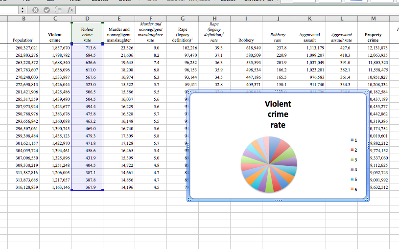


Can you answer your question using this chart? Do you know, from this, which year had the highest violent crime rate? 


How about from a donut chart:


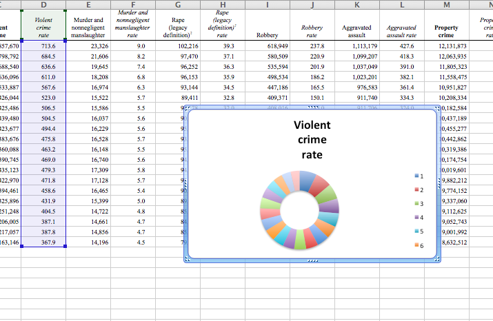


Not really, eh? Well it takes some time and thought to be able to determine what is best, and you can always try out a couple of options, and see which one you like best, and which one best helps you tell your story, and answer the question you are asking. And there might be more than one right answer. 


For example, to answer our question *What year had the highest violent crime rate?*, we could have just as well used a bar graph, as a column graph. A bar graph is basically a column graph on it's side:


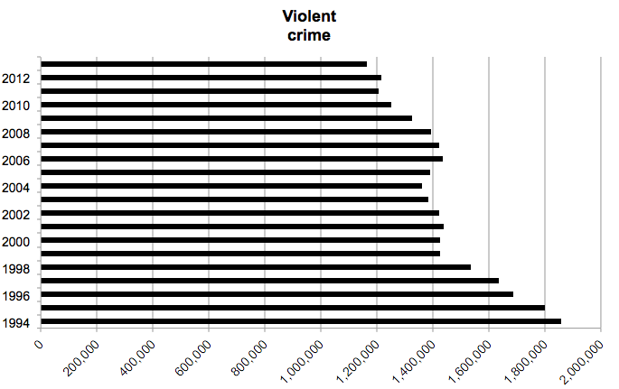
-->

### Activity 2: Exploring trends


We'll be talking about changes over time and trends and such next week, but it's interesting to note here how it would (or at least should) influence your chart choice if the question we ask is slightly different. Let's say we are still interested in trends in violent crime rate, but instead of asking which year had the highest violent crime rate, instead this time we are interested in a new question: 


- **Is violent crime rate going up, going down, or staying the same?**


Now we could, in theory, answer this question by looking at our bar graphs above. But the slight difference is, bar graphs are good at comparing **categories**. But what they dont do, is they do *not* link up these categories. And rightly so. Such charts are for visualising categorical variables, which should not hugely link. 


However, those of you still on top of your *levels of measurement* will have noticed, that year can actually be considered a continuous variable. And so it might lend itself to better *trend* visualisation by being presented through a *line graph*. 

<span style="color:#d95f02">
To select this, once again highlight the column with the data of interest (violent crime rate) and then this time select Line > Line for chart type: 


Once again you will see that your x-axis labels are not very helpful, they are numbersfrom 1 to 20, rather than labelled with the years that each data point represents. To address this, once again right-click anywhere in the chart, and select the "Select Data..." option: 


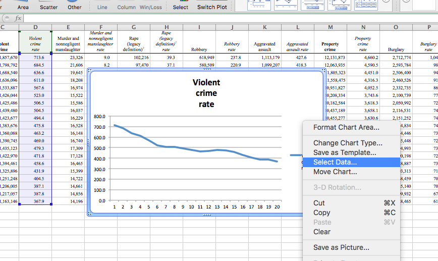


In the popup, once again click into the text box next to the *Category (X) axis labels*, and then select the values in the *Year* column. Make sure to select only the values, and not also the column header: 


When you click OK, the labels should appear on your chart: 


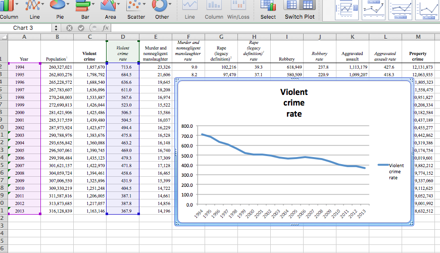


Now you don't always have to manually change the bits of the graph, you can also use some pre-created layouts that exist. You can find this in the top bar of excel, under a label called "Chart Quick Layouts": 


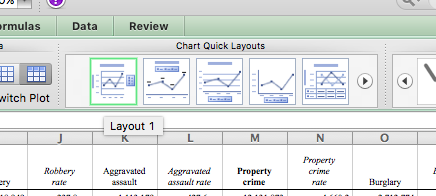


Again, a difference on the PC: When editing the line graph, there is not a heading called "Chart Quick Layouts". Instead, you can find the options for different layouts under the **"chart tools"** section and the tab called **"design"**. 


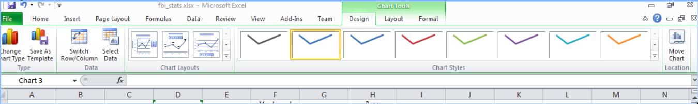


You can browse through and select one that looks like something you would like. 


Once you pick a quick chart format, you can still make edits to your graphs. For example, you can double click on the line to make another popup window appear. 


On this new window, you can click on "Line" option, and choose the colour you would like for the line. 


You can also see 3 options along the topic there, where you can choose between whether you want to edit the line etc, under the "Solid" option, but also change gradients under the "Gradient" option, and also edit the style of the line using the "Weights & Arrows" option. Click on this, and have a play with this as well: 

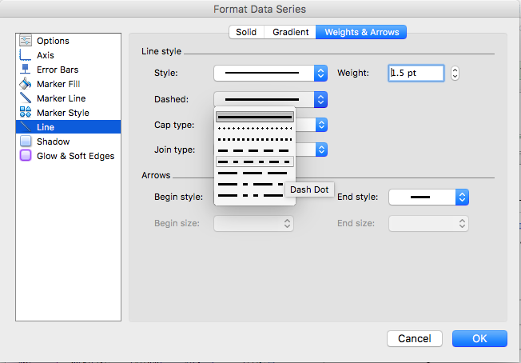


Again these might be slightly different on your version, or on a PC to a mac. For editing the line, all the options there are different as well. The main point here is for you to just play around and see what is available to change in the graph, so have a look, but here is the equivalent PC screen shot to show you:


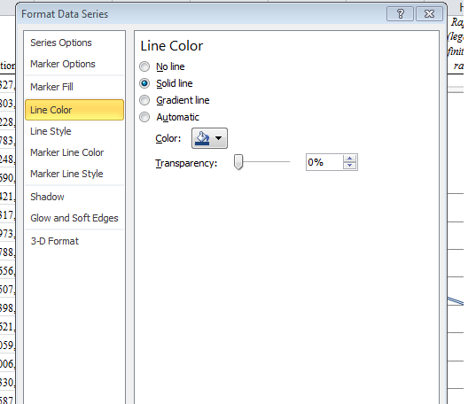


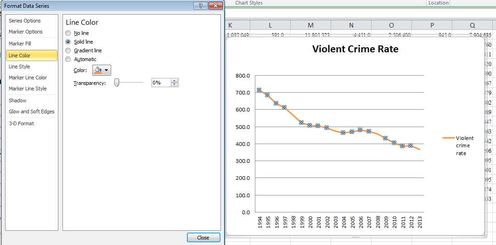

You can also add point markers to the line, this can help add clarity to your graph. Select the "Marker Style" option and you can choose a marker.


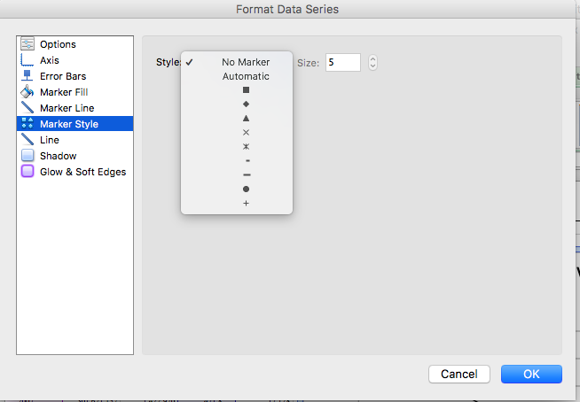


On PC: 


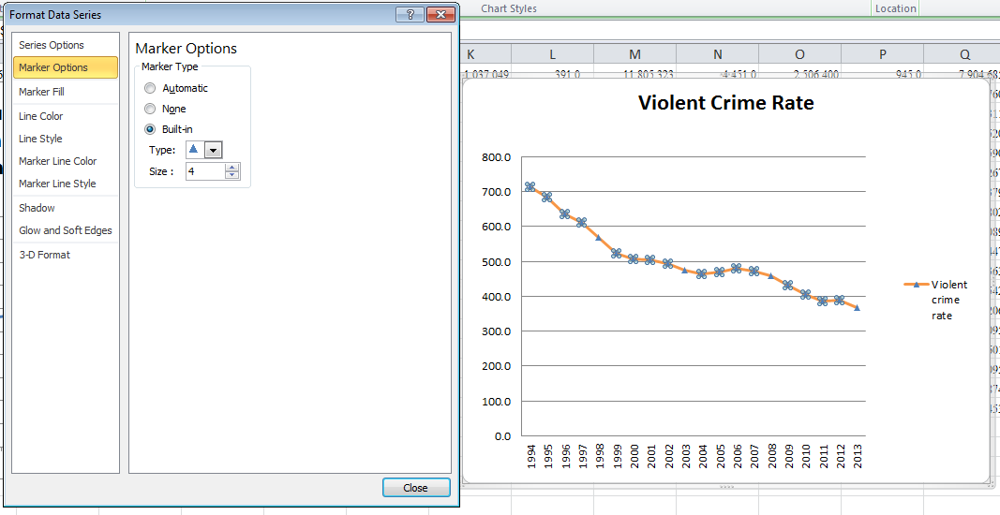


Make any changes you would like, and finally click "OK" to produce your final graph. 


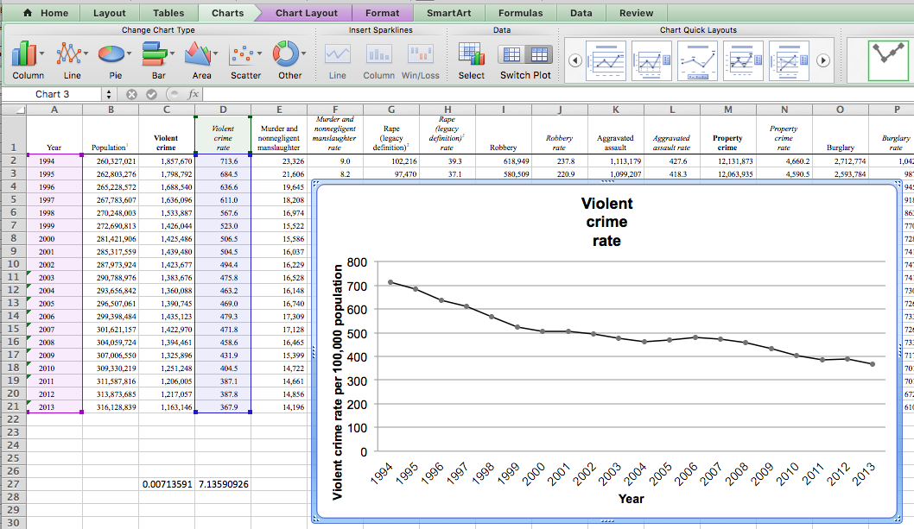


</span>


### Activity 3: Making a chart template

<span style="color:#d95f02">
Now you will probably find your own style for a graph, and you might not want to change these settings every time you create a graph. Let's say we want to create a separate graph for the rates of various crime types in this data. To make our lives easier, once we've gotten one graph to look just how we would like, we can save this as a template. 


To do this, click anywhere in the graph, and select "Save as Template...". 


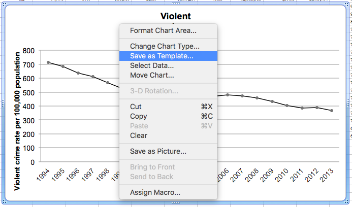


On a PC you won't have this option appear from the right-clicked menu, but you can find the "Save As Template" on the Chart tools > Design tab on the top menu in Excel: 


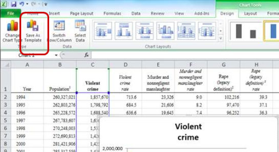


Choose a location to save, give it a name you might remember (here I call this "bw", short for black and white): 


On PC: 


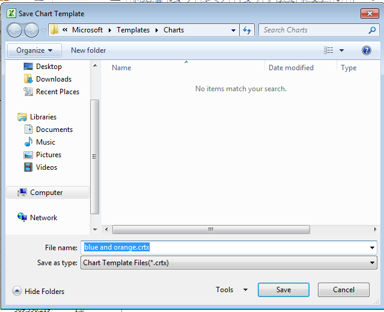

Now, next time you build a graph you can use this template. Let's try, let's create another line graph this time for the rate of murder and nonnegligent manslaughter. So as you would, select the column with the data for rate of murder and nonnegligent manslaughter:


but instead of selecting Line graph, click on the "Other" option for graphs, and scroll to the bottom. You should see your template appear as one of the possible selections!


Again on the PC this is slightly different, you first create your graph with the line graph, and then when it's created, you right click anywhere in the chart and choose: 


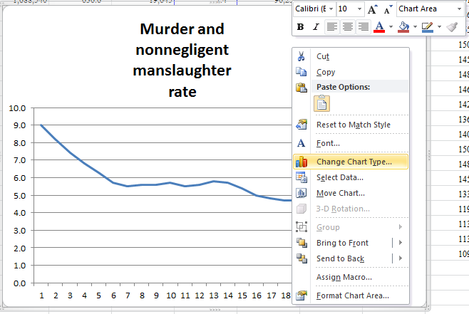


Then go to templates, and choose "My templates":


Click on the template, then click OK, and you should have your graph be updated to the new template. 
</span>

You can now see that the default chart that appears follows the formatting that you have carefully devised as your ideal format. You will still have to add any sort of data addition (for example specify where to find the years to populate the Category (X) axis labels). But it definitely saves you some time in terms of formatting. 


### Activity 4: Saving your graph

<span style="color:#d95f02">
When you are making your reports, there are two ways you can include your graph. 


One approach is just to save your graphs as pictures. To do this, you can just right click anywhere in the graph area, and select the "Save as picture..." option. 


Navigate to a folder where you collect your results, and save the image there. 


Of course, because nothing is easy, this option does not exist on PC. Instead, perhaps the best option may just be copying the graph and pasting it into a word doc and saving it there. 


Then when you are writing your essay, you can insert an image using the Insert > Picture from file option: 

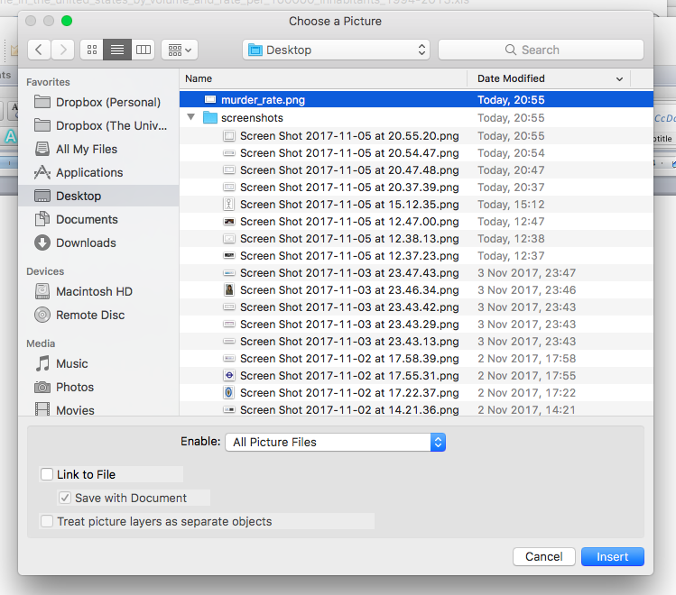

This will open up a popup window you can use to navigate to the picture you just saved, and selecting it. When you are done, click "OK", and your graph will appear :


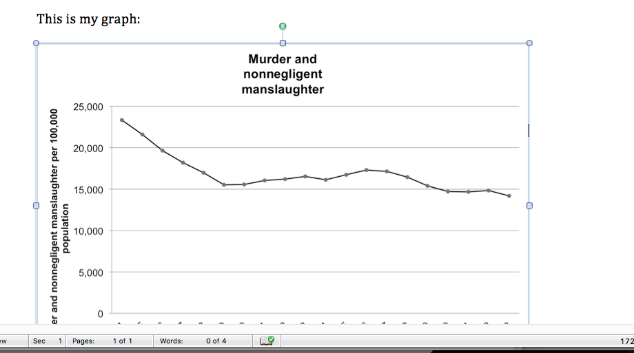


It is important that you label your graphs. You should include a short and to-the-point caption for the graph. You should also refer to the graph in your writing. Something like this: 


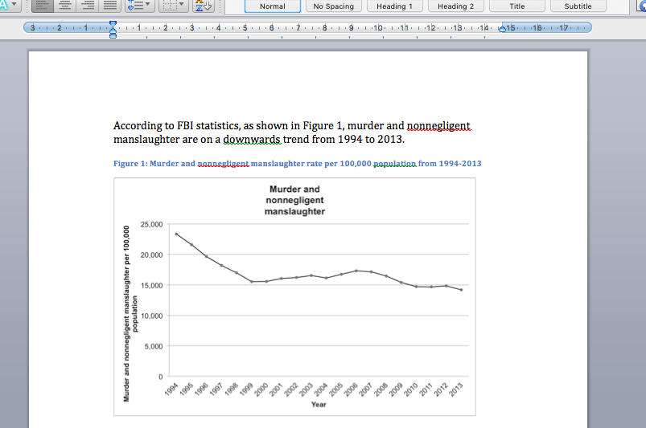

</span>

## Acvitity 5: More complex graphs


While we only covered descriptive analysis for univariate and bivariate analysis, when it comes to making sense of your data graphically, you can include further variables. 

<span style="color:#d95f02">
Let's show an example now. 


In the FBI data, you can see that we have quite a few columns (variables) for crime rates for various crime types. We looked at rates of violent crime and also murder and nonnegligent manslaughter, but there is also robbery, Aggravated assault, burglary, and some more. Let's say that we want to compare the trajectories of all these variables over the years, over time. 


You can start with a simple line graph for one of the variables. Let's select the violent crime rate, and build a line chart for this variable. You should be able to do this by now without guidance, but if you need assistance, just scroll up to where we did this earlier. 


Now once you've created this graph, right-click anywhere on the chart itself, and select the "Select Data..." option: 


In the popup that appears, under the series box, click on the "Add" button:


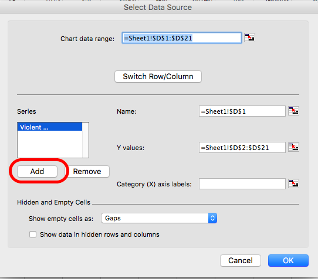


Once you clicked on the "Add" button, the field for "Name" and "Y values" should appear empty. Click in the text box next to name, and then click on the column header (variable name) for the next variable. Select "Robbery Rate":


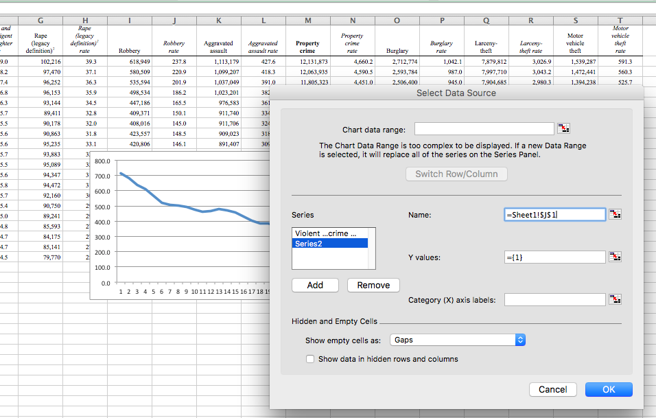


Then, click in the text box next to the "Y values:" and then select the values in the robbery rate column: 


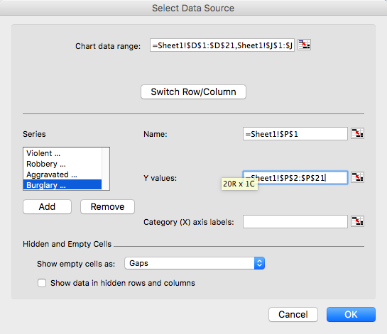


Then repeat this for every variable you want to add. For every variable, click on "Add", then for "Name" select the column header, and for "Y values" select the values for that variable. 


Repeat this for "Aggravated Assault Rate" and again for "Burglary Rate": 


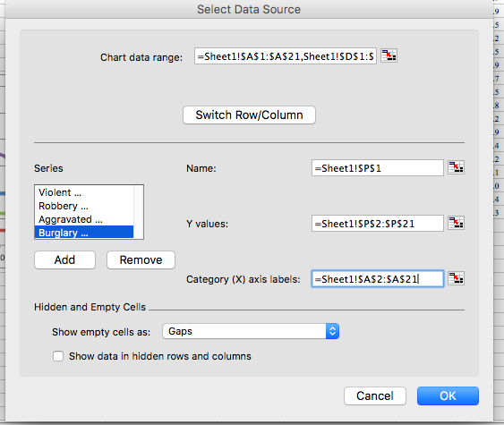


Finally, when you have added all these variables, click on OK, make any changes you'd like to, to the graph, and then ta-daa you will see all 4 variables on one graph: 


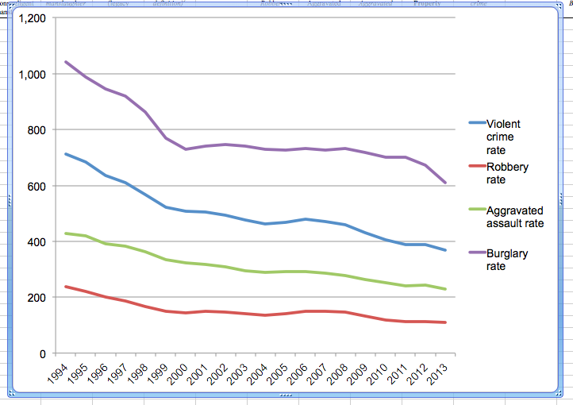


You could also create a stacked column chart, that shows you the cumulative crime rate in each year, while separating out for categories, using all the same variables. 


Again, start with building a column chart for just one of the variables. Let's build this for rate of violent crimes: 


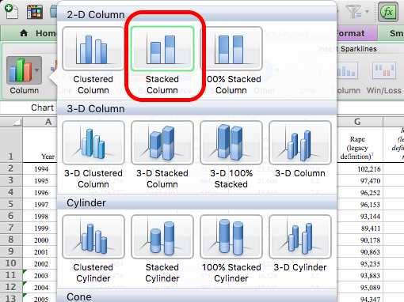


So that will create this column chart: 


Now, just as we did with the line charts, just right-click anywhere on the chart area, and again select "Select Data...". 

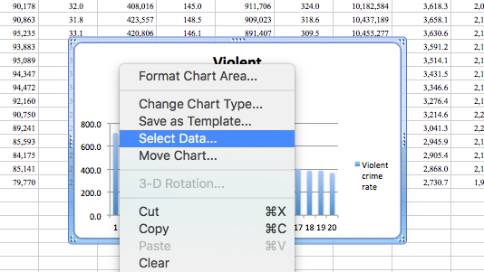


And again this will bring up a popup. Here, once again you can add variables with the "Add" button: 


Once you clicked on the "Add" button, the field for "Name" and "Y values" should appear empty. Click in the text box next to "Name", and then click on the column header (variable name) for the next variable. Select "Robbery Rate" column header. Then click in the text box next to "Y values",  and then select the values for robbery rate: 


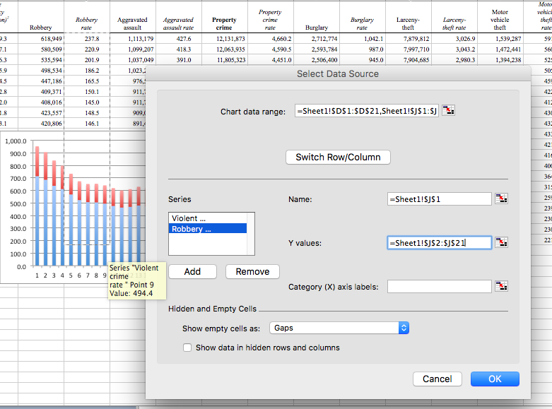


Then repeat this for every variable you want to add. For every variable, click on "Add", then for "Name" select the column header, and for "Y values" select the values for that variable. So in this case, again as we did for the line graphs, repeat this for "Aggravated Assault Rate" and again for "Burglary Rate": 


Then finally you should end up with a stacked bar chart of all these variables, that allows you to compare the rate of each crime type between years, but also allows you to compare a cumulative crime rate, if you consider the crimes of Violent crimes, Robbery, Assault, and Burglary together: 


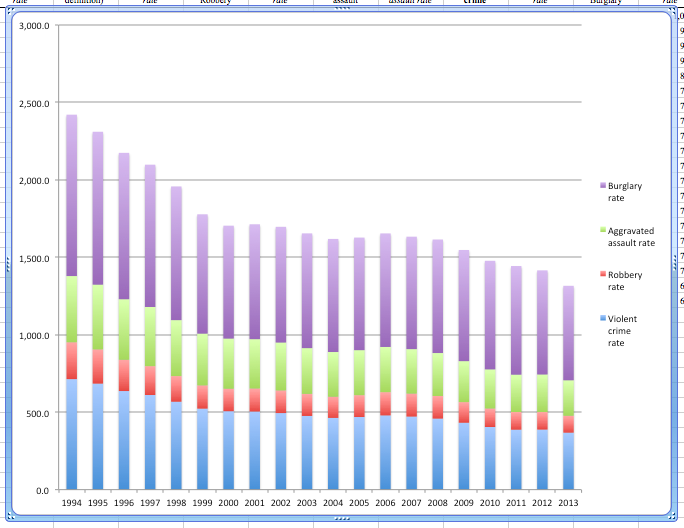

</span>

So you can see that you can use data visualisation as a way of putting together many variables into one graph. 


## More guidance on chart design

Read through this list on ["Dos and Don'ts of Charts and Graphs"](https://guides.library.duke.edu/datavis/topten) and have a look at some of [these examples](http://datajournalismhandbook.org/1.0/en/introduction_3.html) as well for some further inspiration. 


## Communicating results


We have been covering exploratory data analysis, where you take your data, and produce visualisations from that, but sometimes you can also compliment your results by visualising your tables and other outputs. An example would be the conditional formatting, which we covered in week 3. 


The most important thing when communicating your results is that you know your audience. Know what they understand, what they don't, and what you can tell them in one graph. Your graph has to tell a story. Think about why you are making it? What is the message that you want to convey? What is the story this graph is telling? You need to be clear with this to yourself, to make sure that your graph accomplishes it's mission in telling an interesting story about your data. 

> You should look at your data. Graphs and charts let you explore and learn about the structure of the information you collect. Good data visualizations also make it easier to communicate your ideas and findings to other people. Beyond that, producing effective plots from your own data is the best way to develop a good eye for reading and understanding graphs—good and bad—made by others, whether presented in research articles, business slide decks, public policy advocacy, or media reports.

- [Kieran Healy](http://socviz.co/)


### Activity 6: Interpreting results


You should, by becoming a maker of good graphs, become literate about graphs as well. If you are interested in something like a role as a crime analyst, part of your interview process might include something like a numeracy test, which will test your ability to interpret trends and data from graphs (amongst some other things). 

<span style="color:#d95f02">
Here's an example: 


#### Question 1  {-}

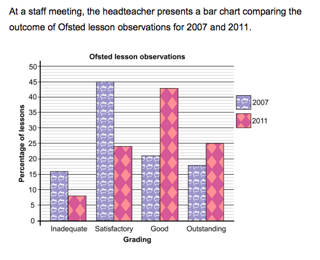

Then the test question could be something like this: 


Tick all the true statements:

- 68% of observed lessons were graded 'Good' or 'Outstanding' in 2011.
- In 2011 the percentage of lessons that were graded 'Good' or 'Outstanding' was twice the percentage of lessons that were graded 'Good' or 'Outstanding' in 2007.
- The percentage of lessons graded 'Inadequate' was halved between 2007 and 2011.


So, which one of these do you think are true statements? 


OK try again: 


#### Question 2  {-}


Tick all the true statements:

- The range of marks in Test A was greater than in Test B.
- The median mark in Test B was approximately 10 percentage points higher than the median mark in Test A.
- In Test B one-quarter of the pupils achieved 75% or more. 


And again: 


#### Question 3  {-}


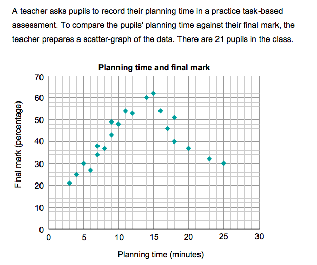


Tick all the true statements:

- Two-thirds of the pupils spent 15 minutes or less on planning.
- The range of time used for planning was 22 minutes.
- The pupil with the median planning time achieved a final mark of 54. 


And finally:


#### Question 4  {-}


Tick all the true statements:

- All the pupils completed the test within the maximum time allowed.
- The median time taken was 40 minutes.
- No pupils recorded a time less than 29 minutes. 


Alright. Make a note of all of your answers before reading the results ahead. 
</span> 

#### Results {-}

OK I have the answers for you now: 


- For question 1 the correct answers were Options A and C
- For question 2 the correct answers were Option B
- For question 3 the correct answers were Options A, B and C
- For question 4 the correct answers were Options A and B


So, how did you do? If you are unsure about any of the answers, ask us now!


<!--
## Note on your feedback session 

The session next Tuesday will be a joint session between Lisa Williams, who will give you a brief overview of the Q-step programme, and also a chance to ask any questions that you have about this, and followed by an embedded employability session, where you will be taught an employable skill. Attendance will still be taken, the same way as I usually do, but there is no feedback lecture for this session. Instead, it is up to you to take your own time to watch the below video to learn more about data visualisation: 

- [video to watch for feedback session](https://vimeo.com/124674889)


If you have any questions about this just post on the discussion board where I will try to answer, or book office hours or ask away in the lab session. 

-->

## Summary

In sum, you should now be able to select a graph that represents your data in a meaningful way, that helps you describe your data as well as communicate your results to your audiences. You should be familiar with the following terms: 

- bar chart
- column chart
- line chart
- data ink ratio
- stacked bar chart
- conditional formatting
- producing summary statistics by groups
- if statements in excel
- box plots in excel
- association/ direction of a relationship between numeric variables
  + positive relationship
  + negative relationship
- form of a relationship between numeric variables 
  + linear relationship
  + non-linear relationship
- strength of a relationship between numeric variables
  + weak
  + moderate
  + strong
- scatterplot
- trendline
- correlation
- correlation does not mean causation


