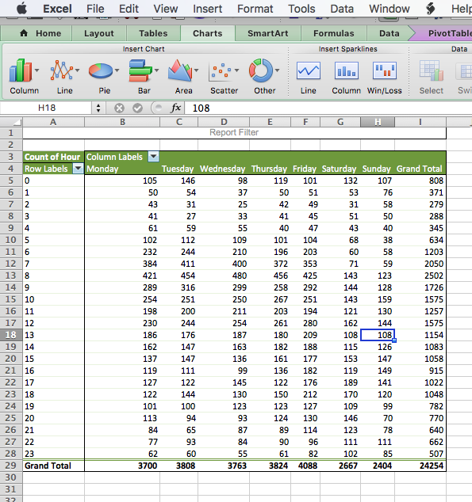

# Week 7 {#week7}

## Learning outcomes

This week we consider another important factor that is present in our data that we don't always talk about, and that is the importance of *time*. The importance of place in criminology and crime analysis is widely discussed. We know certain areas can be crime hotspots, and we know that whether you come from a well of or depreived area you have different access to resources, and therefore your outcomes in terms of involvement with criminal justica system also differs. However time is just as important as place. We often hear that crime is "going up" or "going down" over time. It is very important, that as well-rounded criminologists, you are able to talk about these concepts with appropriate knowledge and understanding. 

When violence increases bewteen March and August, is that because we are seeing an increase in crime and offending? Or is it possible that the time of year has something to do with this? How much must crime increase and over how long of a time, in order to be able to confidently say that crime is on the increase? These are important, and not always easy questions to answer, and this week we will begin to think about this. 

Here are some terms that we will cover today: 

- Crime trends
- Temporal crime analysis
- Seasonality
- Time series data analysis
    + Moving averages
    + Smoothing techniques
    + Seasonal decomposition
- Signal vs noise

## Crime and incident trend identification

All crimes occur at a specific date and time, however such definite temporal information is only available when victims or witnesses are present, alarms are triggered, etc., at the time of occurrence. This specific temporal data is most often collected in crimes against persons. In these cases, cross-tabulations or histogram6 of weekday and hour by count will suffice. The great majority of reported events are crimes against property. In these cases, there are seldom victims or witnesses present. These events present the analyst with ‘ranged’ temporal data, that is, an event reported as occurring over a range of hours or even days. In the case of ranged temporal data, analysis is possible through use of equal chance or probability methods. If an event was reported as having occurred from Monday to Tuesday, in the absence of evidence to the contrary, it is assumed the event had an equal chance or probability of occurring on each of the two days, or .5 (%50). In the same manner, if an event was reported as having occurred over a 10 hour span there is a 10% chance the event occurred during any one of the hours. This technique requires a reasonable number of events in the data set to be effective. The resulting probabilities are totalled in each category and graphed or cross-tabulated. This produces a comparison of relative frequency, by weekday or hour [source](http://cradpdf.drdc-rddc.gc.ca/PDFS/unc76/p530054.pdf).

**Temporal crime analysis** looks at trends in crime or incidents. A crime or incident trend is a broad direction or pattern that specific types or general crime and/or incidents are following.

Three types of trend can be identified:

- overall trend – highlights if the problem is getting worse, better or staying the same over a period of time
- seasonal, monthly, weekly or daily cycles of offences – identified by comparing previous time periods with the same period being analysed
- random fluctuations – caused by a large number of minor influences, or a one-off event, and can include displacement of crime from neighbouring areas due to partnership activity or crime initiatives.

### Activity 1: Extracting temporal variables from dates

This week we will be looking at crime data from the USA. As you saw, the data from police.uk is aggregated by months. We do not know when the offences happened, only the month, but nothing more granular than that. American police data on the other hand is much more granular. 

Cities release their own data. Here, we will be looking at crimes from Dallas, Texas. [You can see more about these data, and find the download link to the data dictionary here](https://www.dallasopendata.com/Public-Safety/Police-Bulk-Data/ftja-9jxd). You can download a subset of Dallas crime data from blackboard. Go to course content > week 7 > Data for week 7, and the file is *dallas_burg.xlsx*. Download this and open it up in excel. 

When you open the excel spreadsheet, you will see that there is a column for date called **Date.of.Occurrence**. The date is in the format dd/mm/yyyy. So the first date on there you can see is  16/11/2016. 

But what if I asked you the question: which year had the most residential burglaries? Or what if I want to know if residential burglaries happen more in the weekday, when people are at work, or in the weekends, maybe when people are away for a holiday? You have the date, so you should be able to answer these questions, right? 

Well you need to be able to have the right variables to answer these questions. To know what year saw the most residential burglaries, you need to have a variable for year. To know what day of the week has the most burglaries, you need to have a variable for day of the week. So how can we extract these variables from your date column? Well luckily excel can help us do this. 

So first you want to make sure that your date column is, in fact, a date. To be sure, you can right click on the column, and select "Format cells...":

Under the "Category" sidebar select "Date", and pick a format that matches your date layout (for example, in this case it's date-month-year). 

This way you make sure that Excel knows that your date column is a date. 

### Activity 2: Extract year from date column

Now, let's start by answering our first question: which year had the most burglaries. To answer this, we first need a variable for year. Let's extract this from the date column. We can do this with the `=year()` function. Inside the brackets, you just have to put the date from which to extract the year. 

First, let's create a new column, called "Year", like so:

Then for the first cell, enter the formula `=year()`, and inside the brackets, put the date value for the first row, in this case, cell `C2`: 

You will see the cell be populated with the value for year, in this case 2016. Copy the formatting down to populate the whole "Year" column: 

Ta-daa! You now have a column of years! Now how do you find out which year has the most number of burglaries? Well it's simple univariate analysis that we should be so familiar with by now! Yay!

So go ahead, build a pivot table to count the frequency of each variable for year. Try to do this now with no further guidance. If you do need some help, have a look at your notes from the univariate analysis lab, in week 2. But try to have a go. 

So which year had the most residential burglaries? 

To answer this question, hopefully you built a pivot table with the year variable, and your table look should like this:

If not raise your hand now, and we will come around and help!

If it does, nice work! You can now identify that the year with the highest number of residential burglaries in Dallas was 2015. You should however note that since 2017 is not yet over, you have incomplete data for this year, and so you're not comparing like for like. Always think about how to interpret your findings, and keep in mind any possible limitations and issues associated with your data. 

### Activity 3: Extract day of week from date column 

Now let's go back to our 2nd question - do residential burglaries happen more in the weekday, when people are at work, or in the weekends, maybe when people are away for a holiday? 

To answer this question, we need a variable for day of the week. First, create a new column call it Day.of.Week: 

Then populate this column with the day of the week. To do this, you can use the `=text()` function. You have to pass this function two parameters. The first is the value of the date column again, as was the case with the year function, and the second is the format that you want the text to take. 

If you ever forget this, excel will remind you: 

The value parameter, just like with the year function, is the cell in the *Date.of.Occurrence* column. In the case of our first row here, it's C2. The second value is the format parameter. Depending on what you pass here, a different value will be returned by the `text()` function. Here is a list of values, and their results: 

- *d:*	9
- *dd:*	09
- *ddd:*	Mon
- *dddd:*	Monday
- *m:*	1
- *mm:*	01
- *mmm:*	Jan
- *mmmm:*	January
- *mmmmm*:	J
- *yy:*	12
- *yyyy:*	2012
- *mm/dd/yyyy:*	01/09/2012
- *m/d/y:*	1/9/12
- *ddd, mmm d:*	Mon, Jan 9
- *mm/dd/yyyy h:mm AM/PM:*	01/09/2012 5:15 PM
- *dd/mm/yyyy hh:mm:ss:*	09/01/2012 17:15:00

Let's use the "dddd" option here to extract the full name of each weekday. So to do this, your formula should be: 

`=year(C2, "dddd")`

Like so: 

Now copy this for each row, and you will now find out the day of the week that each one of these burglaries falls on:

Can you make a pivot table that answers our question about weekends and weekdays yet? Well, not quite just yet. You would need a column for weekday/weekend. How can we do this?

Well think back to when we did re-coding in week 4. Remember the `VLOOKUP()` function? Remember the `VLOOKUP()` function takes 4 parameters. You have to tell it the **lookup_value** - the value to search for. You then have to tell it the **table_array** - which is your lookup table, with two columns of data. The VLOOKUP function *always* searches for the lookup value in the first column of table_array. Your table_array may contain various values such as text, dates, numbers, or logical values.You then have to tell it the **col_index_num** - the column number in table_array from which the value in the corresponding row should be returned. Finally, you still have to specify the **range_lookup**. This determines whether you are looking for an exact match (when you set to FALSE) or approximate match (when you set to TRUE or you omit it).

So the first thing you have to create is your lookup table. For each value of day of the week, you should assign a value of Weekday or Weekend. Something like this: 

Now let's try to apply the formula. 

- **lookup_value** is the day of the week
- **table_array** is this table we just created
- **col_index_num** is the column which contains the values to translate into 
- **range_lookup** set this to FALSE, so we match on exact matched only

So 

Make sure to add the dollar signs, to ensure that you can copy the formatting!

Now, finally you have a variable that tells you whether each burglary took place on a weekday or a weekend: 

Now you can use this variable to create a pivot table, and see the number of burglaries on weekdays or weekends. Let's create this pivot table: 

Unsurprisingly, there are a lot more burglaries on weekdays than weekends. Why do you think that is? Take a moment to chat to the person next to you and discuss. 

So what did you discuss? I am hoping that you mentioned that there were a lot more weekdays than weekend-days in our data, and in fact, in all weeks. There are 2.5 times as many weekdays than weekends in a week. I know, it's a sad truth, we work a lot more than we get to rest. But another thing that happens because of this, is that simply looking at the number of burglaries in weekdays and in weekdays might not be a very meaningful measure. Remember earlier, when we spoke about comparing like for like? Or last week, when we talked about the crime rate (per 100,000 population) versus the number of crimes? Well again here, we should calculate a rate; to truly be able to compare, we should look at a rate such as the number of burglaries *per day* for weekdays, and the number of burglaries *per day* for weekend-days. 

How do you calculate the rate? Well you do this simply by dividing the numerator (number of burglaries) by an appopriate denominator. What is the best denominator? Well it depends on the question you're looking to answer. Usually it's what comes after the *per*. If we are looking for number of crimes *per population* then we will be dividing by the population. If we are looking at number of burglaries *per household* we will be dividing by the number of households in an area. In this case, we were talking about the number of burglaries *per day* to compare between weekends and weekdays. So, your denominator will be the number of days for each group. 

So, to get the burglary rate (per day), we simply take our total number of burglaries from our pivot table, and divide by the number of days for each. As we know, there are 5 weekdays (boo) and 2 weekends (yaay). So let's divide accordingly: 

And copy also for the weekends, and voila we have our answer to the question, are there more burglaries on weekdays or weekends:

Now you can discuss again why you think this might be. For example, during the week, people are away from their homes for work, for the majority of each day, which leaves their home unprotected. I've mentioned the [crime triangle]() before. If the resident is not home, then there is an absence of a capable guardian, and there is an increased risk for a crime (such as burglary) to occur! 

There are many things that peak on certain days of the week. If you're interested in some more examples, [read this article in the Guardian about the most dangerous days of the week](https://www.theguardian.com/lifeandstyle/2013/may/29/most-dangerous-day-of-week). 

## Aggregating to simple intervals

Above the activities have you the ability to extract certain types of date categories from the date column. If we want to compare year on year increase or decrease, this is one approach. Or if we want to compare day of week, month of year, and so on. We did this by creating a new variable, and then using a pivot table. We could also look at the date as it is, we could have a look at the number of crimes each day, but often this can be noisy. Instead, sometimes we want to aggregate (group) these into simpler time intervals.

First, we've not had a look at our time variable yet, so we could start with that. 

### Activity 4: Aggregate to hour

First create a new column for 'Hour':

Then, use the `=HOUR()` function to extract the hour, just like we did to get the year using the `=YEAR()` function. Except, this time we are extracting hour from the "Time.of.Occurrence" variable, rather than the "Date.of.Occurrence" variable. Like so: 

And finally, copy your formatting to all the rows: 

Now you have a column for the hour that the offence was committed in! 

You could also extract something else, for example the month and year from the date. To do this, you simply use this, you again create a new column, and this time use a formula that extracts text from the date: 

`=TEXT(*cell reference*,"mmm-yyyy")`

In where it says cell reference, just put in the reference to the column from the date (in this case it's C) and the cell number (2 for the first row). 

`=TEXT(C2,"mmm-yyyy")`

You can then copy this formula down the whole data set. 

NOTE: Now there is also a new feature in Excel 2016 that allows you to do automatic grouping by time. You can have a look through [this tutorial](https://blogs.office.com/en-us/2015/10/13/time-grouping-enhancements-in-excel-2016/?eu=true) to show you how you can use this new feature. 

So what can we do with all this great temporal data? Well let's start by visualising!

## Visualising time

Depending on what you're visualising, you can use either a linear approach, or a cyclical approach. A linear approach makes sense if you're plotting something against passing time. If you are looking at whether a trend is increasing or decreasing, this is something you would look at over time, because it would be moving forward. 

On the other hand, many measures of time are cyclical. For example, remember in the very first week, when we spoke about *levels of measurement* of variables, and we had a variable for time, and mentioned that this was *not* a numeric variable, instead it was categorical-ordinal, because it loops back around. After the 23rd hour of a day comes the 0 hour of the next! So representing this on a linear graph may mask some important variation. Let me show you an example: 

The above is some made-up data, of something, over the hours of a day. What do the peaks there look like to you? If I were looking at this, I would say we have 3 peaks. There is a peak in the early hours of the morning, like 1-2am, then again a peak midday, and again another peak in the evening around 9pm. 

This is the same data, but visualised in a cyclical way. In this visualisation, it actually appears that there are two main peaks. The peaks that were previously identified as two separate, possibly independent peaks have now bridged into 1, and we can see that instead there might be a continuum, and an ongoing event from 9pm to 2am. It is important to consider the cyclical nature of some of your temporal variables, and use the appropriate means to visualise them. 

It might be worth to have a look at some examples of temporal data being visualised, as well as making our own visualisations of time. Here I will focus on 3 approaches, **line graphs**, **radar graphs**, and **heatmaps**. 

### Activity 5: Line graphs

Let's start with viewing some examples of time visualised using a timeline, of continuous time passing: 

The world of sports is rich with data, but that data isn't always presented effectively (or accurately, for that matter). The folks over at FiveThirtyEight do it particularly well, though. In this interactive visualization below, they calculated what's called an "Elo rating" -- a simple measure of strength based on game-by-game results -- for every game in the history of the National Football League. That's over 30,000 ratings in total. Viewers can compare each team's Elo to see how each team performed across decades of play. [See here](http://projects.fivethirtyeight.com/complete-history-of-the-nfl/#ari)

Another example of a continuous timeline is the "what is warming the world" visualisation. Ever heard a version of the advice, "Don't simply show the data; tell a story with it"? That's exactly what this visualization from Bloomberg Business does -- and it's the interactive part that makes the story move along from beginning to end.

The point of the visualization is to disprove theories that claim that natural causes explain global warming. The first thing you'll see is the observed temperature as it's risen from 1880 to present day. As you scroll down, the visualization takes you through exactly how much different factors contribute to global warming in comparison to what's been observed, adding a richer layer of storytelling. The conclusion the authors want viewers to draw is made very clear. [See here](http://www.bloomberg.com/graphics/2015-whats-warming-the-world/)

To make a line graph, we need to think about what we will represent on our horizontal (x) axis, and what we will represent on our vertical (y) axis. Let's say that on the Y axis we want to represent *number of burglaries*. OK, so what should we have on our X axis? That will be whatever we use to fill in the blank in the sentence: number of burglaries per _____________. Let's say we want to know any changes in the number of burglaries *per day*. Well to do this we will need to *count the number of times that each date appears in the data*. Remember what this means?

That's right! Univariate analysis time. Go ahead and use a pivot table to build a frequency table of the "Date.of.Occurrence" variable. You will eventually end up with something like this: 

Now to turn this into a line graph. We've made quite a few line graphs before, including last week as well, but never with this many data points. However, the motions are still the same. You highlight your data, you select your appropriate chart (line graph), and then you also add the labels, using "Select Data" and populating the 'Category (X) axis labels' section in the popup window that appears. If any of this is confusing to you, re-visit last week's lab notes about data visualisation. 

When all said and done, you should end up with a chart that looks like this: 

So is residential burglary going up or down in the city of Dallas? It's not easy to tell from this, is it? The thing with data at these intervals is that there is a lot of day-to-day variation, and what we would refer to as the **noise**. And in this **noise** we can loose sight of the **signal**. 

Signal-to-noise ratio (abbreviated SNR or S/N) is a measure used in science and engineering that compares the level of a desired signal to the level of background noise. While SNR is commonly quoted for electrical signals, it can be applied to any form of signal, and is sometimes used metaphorically to refer to the ratio of useful information to false or irrelevant data. 

One of my favourite books I've read in recent years is called [The Signal and the Noise by Nate Silver](https://www.theguardian.com/books/2012/nov/09/signal-and-noise-nate-silver-review) and if you enjoyed anything about this class, or you enjoyed reading the Tiger that Isn't text, I would highly recommend it! It can get a bit more technical in places, but it's got loads of very neat examples, and is an entertaining read overall. In this book, the author talks about the need to see past all the noise (the random variation in the data) in order to be able to make predictions (using the signal). 

So in this case of our burglaries, we would need to be able to somehow look past this variation in day-to-day changes, to be able to look at overall trends. For example, we could start to **smooth** this data, and instead of looking at the number of burglaries each day, begin to consider the *average number of burglaries every 10 days*, which would be something called the **10-point moving average**. This would be one approach to smooth our data. I will return to this later today. 

### Activity 6: Radar graphs

There are also multiple cyclical ways to visualise your data. One approach is to use radar graphs The below graphs all represent the same data, of page views for a website across different times of day. Here’s an example by Purna Duggirala that is essentailly a bubble chart that uses two clocks side by side: 

The biggest problem with the chart is the incorrect continuity. A single clock on its own isn’t a continuous range, it’s really only half a range. So the clock on the left is showing 12am – 12pm, but when you reach the end of the circle the data doesn’t continue on like the representation shows. Instead you need to jump over to the second clock and continue on around. It’s difficult to see the ranges right around both 12pm and 12am, since you lose context in one direction or another (and worse, you get the incorrect context from the bordering bubbles).

In a great show of Internet collaboration, the double clock chart spurred some other experimentation. Jorge Camos came up with a polar chart that plots the data on a single “clock face,” showing two 12 hour charts overlaid on top of each other.

Given that the 12-hour clock is a difficult metaphor to use for a visualization, many people choose to use a 24-hour circle. 24-hour circular charts typically start with midnight at the top of the chart and then proceed clockwise, showing all 24 hours in one 360-degree range. The benefit of a 24-hour circular chart is that the cyclical nature of the data is represented and the viewer can easily read the continuity at any point on the chart.

A simple example of a 24-hour circle comes from Stamen Design‘s Crimespotting. This isn’t a data-heavy visualization chart, since it doesn’t actually show any data other than sunrise and sunset times (instead it’s main purpose is as a filtering control). But it’s a good example of the general layout of 24-hour charts, and it’s very clean and well-labeled. You can read about the thinking that went into designing this “time of pie” on Stamen’s blog.

The inspiration for this time selector, which is documented in Tom Carden’s blog post, was the real-life timer control used for automating lights in your house.

This above is known as a radial chart. We will now learn how to build one in Excel. But before we do, I wanted to remind you guys the story of Florence Nightingale, the original data visualisation pioneer (I spoke about her in the lecture about data visualusation on Tuesday). I know, I know, we covered data visualisation last week, can I please get over it. But it's one of the most fun aspects of data analysis so no, I cannot, and now I will tell you about why Florence Nightingale wasn't just a famour nurse, she was a famous data pioneer!

This is Florence Nightingale's 'coxcomb' diagram on mortality in the army:

We all have an image of Nightingale - who died 100 years ago today - as a nurse, lady with the lamp, medical reformer and campaigner for soldiers' health. But she was also a datajournalist. After the disasters of the Crimean war, Florence Nightingale returned to become a passionate campaigner for improvements in the health of the British army. She developed the visual presentation of information, including the pie chart, first developed by William Playfair in 1801. Nightingale also used statistical graphics in reports to Parliament, realising this was the most effective way of bringing data to life.

Her report on mortality of the British Army, published in 1858, was packed with diagrams and tables of data. The coxcomb chart demonstrates the ratio of British soldiers who died during the Crimean War of sickness, rather than of wounds or other causes. Her work changed the course of history, enabling pro-active change through data collection. In 1858 Nightingale presented her visualisations to the health department demonstrating the conditions of the hospitals, and whose actions resulted in deaths being cut by two thirds.

So, how do we make these in Excel. Well let's return to our within-day variation in residential burglaries. Let's visualise when they take place. 

To do this, we will first need to create a frequency table of the hour variable. Remember we are graphing UNIVARIATE ANALYSIS. We are describing one variable in our data, which is the hour variable. To know the frequency of each value of this variable (the number of burglaries in each hour), we must build a pivot table. 

So do this, create a pivot table that tells you the frequency of each hour: 

Now highlight the "Total" column, as it represents the number of burglaries in each hour, and this is what you want to graph. Then for charts select "Other", and then "Radar":

A radar graph will appear, something like this: 

Now there is something wrong with this graph. Can you spot it? Take a moment now to look... I'll wait here. 

Did you notice? If not, look again, this time, look at the graph, and tell me which hour has the most burglaries. Great, now look at the pivot table. Is it the same hour? (hint: no)

Why is this? Well our axes are not actually labelled! Remember, to label your axes, do as you did in the line graph, right click on the graph, "Select Data..." and populate the 'Category (X) axis labels' section in the popup window that appears with the hours. Now your graph should make sense: 

Much better. Clearly residential burglaries are happening in the morning, and in the day, and much less so in the night. But, is this any different between weekend and weekday? 

Now we are introducing a *second* variable. By now you should know that this means to answer this question, we will need **bivariate** analysis. So, create a bivariate table, by dragging the weekday variable which we created earlier into the "Column Labels" box in the pivot table options. This will create a crosstab for you: 

Now select the values for the "Weekday" column, and again for charts choose Other > Radial:

A chart will appear, showing you only the weekday burglaries. Now, right click this chart and select "Select Data..." option: 

First, label your current data. Do this by clicking in the textbox next to the "Name:" label, and then clicking on the column header (cell B4):

Then add the correct labels, but clicking on the box next to "Category (X) axis labels", and selecting the hours in the "Row Labels" column.

Now, add the weekend burglaries. Do this the same way we added multiple lines last week. You click on the "Add" button, and you put the name in the textbox next to "Name:", and the values in the text box next to the "Y-values" box. This time you can leave "Category (X) axis labels" empty, as it's already populated by the previous series:

Ta-daa here is your 2-variable radial graph. 

One issue though. Can you think of it? 

No? Well look how tiny the circle for the weekend is. This is because of the problem that we discussed earlier, there are simply many more burglaries in the weekday. So if we want to look at how within-day patterns differ between weekend and weekday, this graph isn't necessarily the best approach. Instead, we might want to look at *percentage* distribution, instead of count. 

To do this, change the pivot table to display percent instead of count. A reminder how to do this: you click on the little i (or arrow on a PC) to bring up a popup window, on which you select options: 

This brings up a menu where you can select what to "show data as". Choose % of column (because we want to know the percent of weekday crimes in each hour, and percent of weekend crimes in each hour, so our 100% are our columns, so we are looking at column percentages):

For doing this on a PC, to get the percentages for weekday/weekend burglaries, the options are slightly different. Need to go to the tab called "Show Values As" and then select % of Column:

And finally, ta-daa you have a radial graph that helps you compare the within-day temporal patterns of residential burglary between weekdays and weekends. 

 

## Activity 7: Heatmaps

Heatmaps visualise data through variations in colouring. When applied to a tabular format, Heatmaps are useful for cross-examining multivariate data, through placing variables in the rows and columns and colouring the cells within the table. Heatmaps are good for showing variance across multiple variables, revealing any patterns, displaying whether any variables are similar to each other, and for detecting if any correlations exist in-between them.

Typically, all the rows are one category (labels displayed on the left or right side) and all the columns are another category (labels displayed on the top or bottom). The individual rows and columns are divided into the subcategories, which all match up with each other in a matrix. The cells contained within the table either contain colour-coded categorical data or numerical data, that is based on a colour scale. The data contained within a cell is based on the relationship between the two variables in the connecting row and column.

A legend is required alongside a Heatmap in order for it to be successfully read. Categorical data is colour-coded, while numerical data requires a colour scale that blends from one colour to another, in order to represent the difference in high and low values. A selection of solid colours can be used to represent multiple value ranges (0-10, 11-20, 21-30, etc) or you can use a gradient scale for a single range (for example 0 - 100) by blending two or more colours together.

Because of their reliance on colour to communicate values, Heatmaps are a chart better suited to displaying a more generalised view of numerical data, as it’s harder to accurately tell the differences between colour shades and to extract specific data points from (unless of course, you include the raw data in the cells).

Heatmaps can also be used to show the changes in data over time if one of the rows or columns are set to time intervals. An example of this would be to use a Heatmap to compare the temperature changes across the year in multiple cities, to see where’s the hottest or coldest places. So the rows could list the cities to compare, the columns contain each month and the cells would contain the temperature values.

-[data viz catalogue](https://datavizcatalogue.com/methods/heatmap.html)

So let's make a heatmap for burglary, from a crosstab looking at the frequency of burglary across days of the week *and* hours of the day. 

You can know, by the way that question is phrased, that your task here will require a bivariate analysis. To produce this, we will need a pivot table. So let's create our crosstab with pivot table, where we have day of week in the columns, and hour of day in the rows: 

Now this tells you all the information you want to know, but there are a lot of cells, with a lot of numbers, and it's not immediately obvious where we should be looking. A heatmap (via conditional formatting) creates an option for us to nudge people to find the high and low values in this table. 

To implement this, highlight the values in your table: 

Then find the conditional formatting tab, and select a colour scheme that works for you. Remember to consider whether red values should be high or low? Is a high number good? Or is it bad? 

In this case, red is bad because it means more burglaries! So select this colourscheme and as if by magic, our table will now be highlighted in the form of a heatmap: 

Now your eyes are immediately drawn to where the high values are, which apparently is Monday to Friday, 7 and 8 AM. We can see that on Saturday and Sunday even burglars want a lie-in, and therefore you see the green low burglary rate creep up later than on weekdays. Exciting stuff!
 

### More charts?

The Gantt chart is also a way to visualise the passage of time, or rather the tasks that you must complete as this time passes. You learned in the session covering research design about Gantt chards, which are essentially horizontal bar charts showing work completed in a certain period of time with respect to the time allocated for that particular task.

It is named after the American engineer and management consultant Henry Gantt who extensively used this framework for project management. We covered how to do these in the research design session, so please do refer back to those if you are not sure how to make them any more...!

There are also some non-conventional line-graph based timelines. While these appear initially like linear representations, it's actually possible for these to loop back, and reverse in time, making them slightly different. For example [this one about gas prices and driving practices](http://www.nytimes.com/imagepages/2010/05/02/business/02metrics.html), or this one about [driving safely](http://www.nytimes.com/interactive/2012/09/17/science/driving-safety-in-fits-and-starts.html) demonstrate this approach quite neatly. 

You could also have a stacked line chart to represent time: 

Stacked area charts are useful to show how both a cumulative total and individual components of that total changed over time.

The order in which we stack the variables is crucial because there can sometimes be a difference in the actual plot versus human perception. The chart plots the value vertically whereas we perceive the value to be at right angles to the general direction of the chart. For instance, in the case below, a bar graph would be a cleaner alternative.

Time is dynamic, and as a result there are many dynamic visualisations of time as well. For example, it is possible to build a gif as a graph output, with each measurement in time being one frame. This example, which represents time as frames in a gif, shows how the percent of the US population by age group has changed, and is predicted to change over time: 

Similarly Hans Rosling, who you might remember from the Joy of Stats video, was known for his dynamic representation of time, using videos and gifs:

You can see that there are many cool ways to represent time, and I've shown you only few. I hope you are interested to explore more!

## Time series

A Time Series is an ordered sequence of values of a variable at equally spaced time intervals.
Time series occur frequently when looking at industrial data. The usage of time series models is threefold:

- To help reveal or clarify trends by obtaining an understanding of the underlying forces and structure that produced the observed data
- To forecast future patterns of events by fitting a model
– To test the impact of interventions 

Time Series Analysis is an analytic technique that uses a sequence of data points, measured typically at successive, uniform time intervals, to identify trends and other characteristics of the data. For example, a time series analysis may be used to study a city’s crime rate over time and predict future crime trends.

All time-series data have three basic parts:

- A trend component;
- A seasonal component; and
- A random component.

Trends are often masked because of the combination of these three components – especially the random noise!

Two types of patterns are important:
- Linear or non-linear trends - i.e., upwards or downwards or both (quadratic); and
- Seasonal effects which follow the same overall trend but repeat themselves in systematic intervals over time. 

Smoothing data removes random variation and shows trends and cyclic components. Inherent in the collection of data taken over time is some form of random variation. There exist methods for reducing of canceling the effect due to random variation. An often-used technique in industry is "smoothing". This technique, when properly applied, reveals more clearly the underlying trend, seasonal and cyclic components.

In this course we will stick to the first option, and in particular we will look into producing *moving averages*. You should also know about the existence of *smoothing techniques*, and the sophisticated method for revealing trends is known as *seasonal decomposition*, however we will not be performing these ourselves today. 

### Moving averages

A moving average is a technique to get an overall idea of the trends in a data set; it is an average of any subset of numbers. The moving average is extremely useful for forecasting long-term trends. You can calculate it for any period of time. For example, if you have sales data for a twenty-year period, you can calculate a five-year moving average, a four-year moving average, a three-year moving average and so on. Stock market analysts will often use a 50 or 200 day moving average to help them see trends in the stock market and (hopefully) forecast where the stocks are headed.

An average represents the “middling” value of a set of numbers. The moving average is exactly the same, but the average is calculated several times for several subsets of data. For example, if you want a two-year moving average for a data set from 2000, 2001, 2002 and 2003 you would find averages for the subsets 2000/2001, 2001/2002 and 2002/2003. Moving averages are usually plotted and are best visualized.

Among the most popular technical indicators, moving averages are used to gauge the direction of the current trend. Every type of moving average (commonly written in this tutorial as MA) is a mathematical result that is calculated by averaging a number of past data points. Once determined, the resulting average is then plotted onto a chart in order to allow traders to look at smoothed data rather than focusing on the day-to-day price fluctuations that are inherent in all financial markets. 

The simplest form of a moving average, appropriately known as a simple moving average (SMA), is calculated by taking the arithmetic mean of a given set of values. For example, to calculate a basic 10-day moving average you would add up the closing prices from the past 10 days and then divide the result by 10. In Figure 1, the sum of the prices for the past 10 days (110) is divided by the number of days (10) to arrive at the 10-day average. If a trader wishes to see a 50-day average instead, the same type of calculation would be made, but it would include the prices over the past 50 days. The resulting average below (11) takes into account the past 10 data points in order to give traders an idea of how an asset is priced relative to the past 10 days. 

Perhaps you're wondering why technical traders call this tool a "moving" average and not just a regular mean? The answer is that as new values become available, the oldest data points must be dropped from the set and new data points must come in to replace them. Thus, the data set is constantly "moving" to account for new data as it becomes available. This method of calculation ensures that only the current information is being accounted for. In Figure 2, once the new value of 5 is added to the set, the red box (representing the past 10 data points) moves to the right and the last value of 15 is dropped from the calculation. Because the relatively small value of 5 replaces the high value of 15, you would expect to see the average of the data set decrease, which it does, in this case from 11 to 10. 
- [Moving Averages: What Are They?](http://www.investopedia.com/university/movingaverage/movingaverages1.asp#ixzz4xbKq8xgI )

It is important that you understand the concept of what we are covering, before we move on to the excel part of things, so I really want you to take time and watch this  [video on how to calculate moving average by hand](https://www.youtube.com/watch?v=vvbvVJiJ2fI). If you have any questions about this, ask now!

### Activity 8: Moving average in Excel

Right now let's calculate the moving average in excel, using some example data on temperature measurement. You can download this data from the week 7 folder, in the data for week 7 subfolder. It should be called mov_avg_temp_example.xlsx. Then you can use it to follow along below this tutorial taken from [dummies.com](http://www.dummies.com/software/microsoft-office/excel/how-to-calculate-moving-averages-in-excel/)

The Data Analysis command provides a tool for calculating moving and exponentially smoothed averages in Excel. Suppose, for sake of illustration, that you’ve collected daily temperature information. You want to calculate the three-day moving average — the average of the last three days — as part of some simple weather forecasting. To calculate moving averages for this data set, take the following steps.

To calculate a moving average, first click the Data tab’s Data Analysis command button.

When Excel displays the Data Analysis dialog box, select the Moving Average item from the list and then click OK.

Identify the data that you want to use to calculate the moving average.
Click in the Input Range text box of the Moving Average dialog box. Then identify the input range, either by typing a worksheet range address or by using the mouse to select the worksheet range.
Your range reference should use absolute cell addresses. An absolute cell address precedes the column letter and row number with `$` signs, as in `$A$1:$A$10`.
If the first cell in your input range includes a text label to identify or describe your data, select the Labels in First Row check box.

In the Interval text box, tell Excel how many values to include in the moving average calculation.
You can calculate a moving average using any number of values. By default, Excel uses the most recent three values to calculate the moving average. To specify that some other number of values be used to calculate the moving average, enter that value into the Interval text box.

Tell Excel where to place the moving average data.
Use the Output Range text box to identify the worksheet range into which you want to place the moving average data. In the worksheet example, the moving average data has been placed into the worksheet range B2:B10.

(Optional) Specify whether you want a chart.
If you want a chart that plots the moving average information, select the Chart Output check box.

(Optional) Indicate whether you want standard error information calculated.
If you want to calculate standard errors for the data, select the Standard Errors check box. Excel places standard error values next to the moving average values. (The standard error information goes into C2:C10.)

After you finish specifying what moving average information you want calculated and where you want it placed, click OK.

**Note:** If Excel doesn’t have enough information to calculate a moving average for a standard error, it places the error message into the cell. You can see several cells that show this error message as a value.

If any of that was a bit unclear, you can have a go with another, different example, by following the steps in [this tutorial here](http://www.excel-easy.com/examples/moving-average.html)

So that's about it. If you're feeling very adventurous you can have a look at [seasonal decomposition in excel](https://www.searchlaboratory.com/2013/09/time-series-decomposition-using-excel/) and ome more in-depth learning about [moving average and soothing techniques in excel](http://www.informit.com/articles/article.aspx?p=2433607) as well. 

<!--
- [how to excel](http://www.dummies.com/software/microsoft-office/excel/how-to-calculate-moving-averages-in-excel/)
- [how to excel](http://www.excel-easy.com/examples/moving-average.html)
- [how to excel](http://www.statisticshowto.com/moving-average/)

- [Seasonal decomposition in excel](https://www.searchlaboratory.com/2013/09/time-series-decomposition-using-excel/)

[Moving average and soothing techniques in excel](http://www.informit.com/articles/article.aspx?p=2433607)

[more here: http://www.itl.nist.gov/div898/handbook/pmc/section4/pmc42.htm](http://www.itl.nist.gov/div898/handbook/pmc/section4/pmc42.htm)

-->

## Summary

In sum, you should now be able to begin to make sense of temporal data in criminology. You should know how to extract variables from a date variable, how to aggregate into meaningful intervals, know how to best visualise temporal trends, and knwo the appraoch of the moving average in order to be able to find the signal amidst the noise. You should be comfortable with the following terms: 

- time-series
- seasonality
- cyclical variable
- radar graph
- heatmap
- moving average
- smoothing
- signal & noise
- trend, seasonality, and randomness
- how to use the following formulas
  + text()
  + year()
  + hour()

