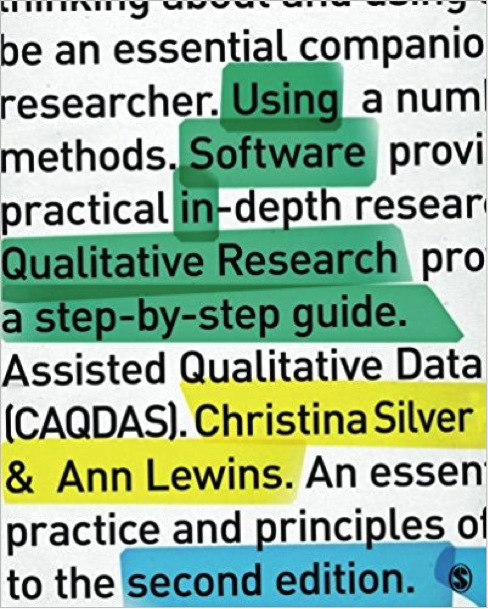
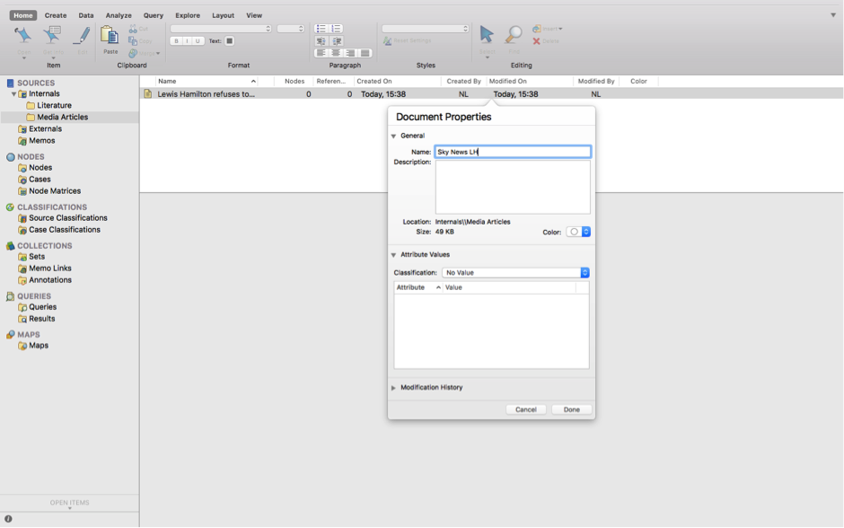
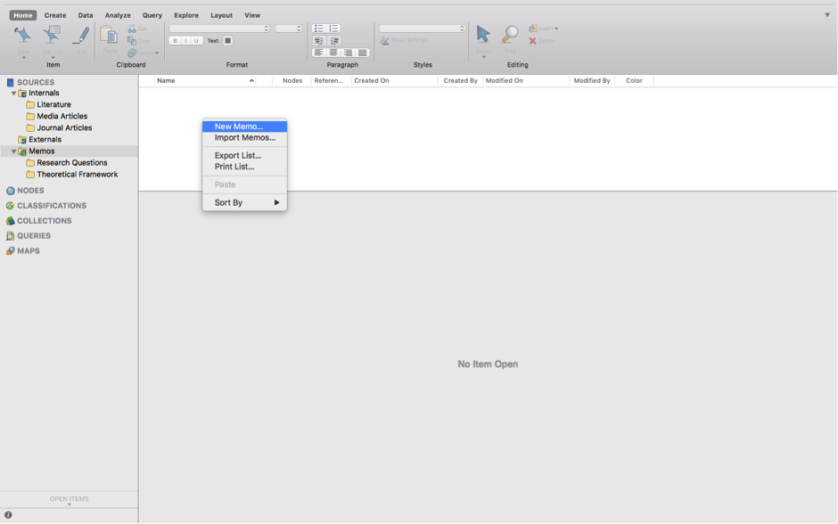

# Week 8 {#week8}

## Learning outcomes

Hello, and welcome to the first of two qualitative data analysis lab sessions. Today we will learn about the software package NVivo and how you can use this to analyse and manage your qualitative data (and literature).

In this session you’ll learn:

- Why we use computer aided qualitative data analysis software (CAQDAS) to manage and interrogate qualitative data, and more importantly, how to do it!
- Some basic but fundamental processes for importing your data into the software and how to organise your files.
- How to run some preliminary analysis in preparation for the real, heavy duty thought work next week.
Qualitative Data Analysis

## Why use software in qualitative data analysis?

To give you the corporate spiel:

NVivo provides a flexible range of different ways to handle the analysis of qualitative data - good code and retrieve tools with powerful tools for data visualisation and interrogation. A wide range of multimedia and social media data types are acceptable to NVivo.  Certain types of information are auto-processed on import. 

Essentially, the NVivo Software allows you to analyse and manage a range of qualitative data, from textual data such as interview transcripts or government documents, to videos, pictures and audio files. In these two sessions we’ll focus on textual data mainly, but once you feel comfortable with NVivo you might want to explore all the available functionality.

Note: the directions below are for the Mac version of NVivo. For those of you using the University computers, the Windows versions of NVivo 11 should be installed and ready for you to use. The functionality between the two versions is slightly different, but not drastic, so you should be able to figure it out.

I know some of you are Mac users too. If you prefer to use your Mac, you’ll need to download the latest version of NVivo. You can do this from the QSR website [here](http://www.qsrinternational.com/nvivo/support-overview/downloads).  Download NVivo for Mac (Version 11). 

You’ll need the License code to complete installation: **NVT11-LZ000-ADA20-WX6WD-D55VO**

The lab sessions will be accompanied by chapter readings from this:

 

I’ve uploaded relevant chapters to Blackboard so you can make do with that for now. There is a eBook of the first edition available via the University Library catalogue too. Or, if you’re really into qualitative data analysis, you might want to purchase the book at some point, but that is definitely not vital.

The lab sessions will also be strongly supplemented with video tutorials from the QSR website. QSR is the organisation that manages NVivo. 

 

### Activity 1: 

Discover more about the NVivo tutorials [here](https://www.qsrinternational.com/nvivo/free-nvivo-resources/tutorials). Take a look at the website now and watch some of the starter videos. You can choose to watch the Windows or Mac tutorials; whichever suits your needs. If you haven’t watched them already, I would recommend watching the following before you get into the main lab work:

- Explore NVivo 11 Pro for Windows - [video here](https://www.youtube.com/watch?v=S7Z8izUiQjA) – and Mac – [video here](https://www.youtube.com/watch?v=ONUACL9UcWY). 
- How to [‘Import Documents’](https://www.youtube.com/watch?v=68OOsulWjGM). 
- How to [‘Create Memos’](https://www.youtube.com/watch?v=6Mkgh2B25RM).
- How to [‘Run a Word Frequency Query’](https://www.youtube.com/watch?v=Pm2sgWuGvTI).

I’ll be talking you through most of the above in the session notes today (see below). If you get stuck at any point, it’s worth re-watching these videos or seeing if there is a video available for your specific query. It’s a useful website.

## What kinds of data can I input into NVivo for analysis?

In brief, and just for your information, you can analyse the following kinds of data in NVivo:

**Text** – NVivo 11 can manage files that are .txt, .rtf, .doc, .docx, and .pdf. It is fine to include embedded charts, tables, graphs, or images. However, in Word files, headers and footers, page numbers, line numbering, comment boxes (as per MSWord) will not be visible once imported. 

**PDF format** - where the file has been converted into PDF from Word or similar application etc., the file can be imported as it is, though some functions- like Text search will not work quite as well as if they were in Word/RTF/plain text. If the PDF document was created (possibly scanned) without optical character recognition it may just be an image style format which can still be imported but the more limited ‘region selection’ mode not ‘text’ mode will be required to apply codes or annotations and text search tools are unlikely to work. 

- WE’LL BE DOING SOME IMPORTING OF DOCUMENTS AND PDFs TODAY…

**Datasets** – Import e.g. survey data direct from Excel and other database formats. 

**Multimedia** – NVivo 8 onwards recognizes many formats for visual, audio, and audiovisual materials. Most common formats are useable. For video files, the general rule of thumb is that if they will play in Windows Media PlayerTM, they will work in NVivo. 

**Social media data** (e.g. from Facebook, LinkedIn and Twitter) and Evernotes – can be imported into NVivo.  - WE’LL BE DOING THIS NEXT WEEK…

**Ncapture** – an interface between Internet Explorer and NVivo can be used to capture web pages, pre-code them and then import them into a project 

### Activity 2: Find some data…

Before we start with NVivo, I’d like you to find some data that you’ll use in the session today – you can use the data that I use and which are available on Blackboard but I think it’s more interesting for you (and will help you remember the processes better!) if you find some data that reflect your own criminological interests.

For instance, given my research expertise and the major news coverage of the Panama Papers last year, in my example I collected the top 5 Google news stories on Lewis Hamilton and Tax Avoidance from the end of 2017:

But not everyone gets as excited as I do about researching the tax noncompliance of global individual and corporate elites…(Though I can never understand why!).

I’ve simply saved each news article in a folder on my desktop:

 

I then searched for reports and documents on tax avoidance from governmental authorities and non-governmental organisations. I simply searched ‘tax avoidance pdf’ and an array of official documents were found. I’ve saved five of these to my documents folder. 

I then searched for ‘tax avoidance criminology’ on Google Scholar – you could also try the University’s online databases (probably a more systematic approach in actual fact). 

In order to keep it nice and tidy, I’ve organised my documents into three folders: ‘Media Articles’, ‘Literature’ and ‘Journal Articles’

Nice and tidy.
 
 
 
 

They are now ready for ‘importing’ into NVivo later. 

So, go and find your own media articles (x 5), academic journal articles (x 5) and non-academic official sources (x 5). Save these to your p:Drive or in an accessible location. 

**NOTE: this is just an example data set, in a real research project, your literature and data search would need to be much more extensive and systematic, but for the purposes of demonstrating NVivo, it will suffice!.**

Ok, so now you’ve identified 15 textual data sources and saved them somewhere easily accessible (e.g. in a folder entitled ‘NVivo Sessions’)

So forget about these for now. We’ll be back. 

## Creating your NVivo project

### Activity 3: Getting started with NVivo

Let’s get started then. First, you’ll need to open NVivo from your computer. Search for it on your computer. This will open up a folder something like the following:

 

Second, you need to ‘create new project’. So click on the appropriate option. You’ll then need to name and save the project, put it in the same folder as your data:

 

Click ‘Create’ and hey presto:

 
 
 

Everything you do in NVivo saves automatically. However, it’s worthwhile getting into the habit of saving after you do something important, just in case something goes wrong! You can ‘Save’ via the file tab.

So, what can you see in the interface?

## Understanding the interface

At the top of the screen are the ‘ribbon tabs’:

 

Ribbon tabs provide access to varying functions.

Basic ribbon tabs consist of: 

- *File* - Saving, Managing etc, 
- *Home* - editing functions etc., 
- *Create* - making new things 
- *Data* – various import options, 
- *Analyse* - Coding, linking, annotating, 
- *Query* - range of functions to vary queries and query views and output, 
- *Explore* - Charting, queries, models, 
- *Layout* – manipulating tabular outputs, 
- *View* – altering what you can see, arrangement of windows, coding stripes etc.

**NOTE: There are a few aspects of work that are only accessible via the ribbon tabs (for instance some of the editing tools are only accessible from the Home Tab, varying Code stripe views is only available from the View ribbon tabs, Charts and other visualisations are only accessible via the Analyse ribbon tab). But there are many other functions which are accessible more easily from the right button in the List panes. Some ribbon tabs only open up when you are in a particular function, for instance when you are in a Model, a specialized Model ribbon tab appears, but you create a new Model from the Explore Ribbon tab. You’ll figure this out through trial and error.**

So, below is the main window of the interface:

 

You organise all your research materials in the ‘Navigation View’. The navigation pane (left hand portion of the screen) is the main way of moving around the main functional areas of the software, Sources, Nodes etc. – and getting into the right folder you need in order to see the relevant ‘list’ so that you can open individual items. When you select a function – a set of folders appears in the top half of the pane. Select a folder and the relevant List appears on the right. Double click on an item in the list and the relevant item opens up in the Detail pane below. Successive opened items are tabbed I along the central bar separating the List pane from the Detail pane.

## Navigation View

Today you’ll learn about three of the sections in the Navigation View: Sources, Nodes and Memos

### Sources
Sources can be any type of data file or memo, embedded or external to the project.

Sources can be text, multimedia and datasets. There are three main folders associated with
sources.

### The ‘internals’ section:
Internals folder is designed to hold all ready-made data (to be ‘imported’) that you wish to work with directly within NVivo.

### Memos
Memo folder allows you to create any number of new documents as locations to write
notes and keep track of your analysis. If the new documents are created within or moved into the memo folder, the software sees them as memos and each memo can be linked to one document or node.

Material inside any of the above sources can be classified, coded, linked, and annotated according to needs of the researcher. We’ll do this mostly next week…

### Activity 4: Folders

Have a go at creating folders to house your data in the Internals section.
In a project consisting of different types of data we’d usually recommend that folders could be based on the type of data. This choice will vary depending on the complexity and variety of types of data. If you only have Interview data for instance, you might just create a folder called ‘Interviews’. You can decide to organise your folders in a way that suits your own thinking style.

**TIP:**  Keep the folder structure simple - although you can scope and filter later queries by folder - folders cannot reflect all the different features of your data. The assigning of attributes (via node classifications) will eventually reflect things like socio demographic information about your data/respondents/cases etc. You’ll need to think about this more if you decide to use NVivo at some point in your research, but don’t worry about these complexities just now!

So, right click at the top level (e.g. Internals) > New Folder – provide a name for your folder:
 
 
 
 
Then select ‘New Folder’
 
 
  
 
 
This will open a dialogue box where you can input your folder name. In this one, type ‘Media Articles’, or something along these lines. 

 
 
Then click ‘Done’. You can then create a second folder entitled ‘Literature’ and a third folder entitled ‘Journal Articles’. We’re now beginning to organise where our documents will go.

## Importing Data

Now we have folders we can import our data into these.

There are different things enabled during the import of data. For now, the straightforward importing of data, whether it is Text, PDF or the full range of audio-visual data – can follow essentially the same process. You just have to be careful to tell the software what type of data you are looking for e.g. ‘document’, ‘PDF’ etc.

Remember that ‘data’ and sources in NVivo are any material at all that will help you to integrate all the information that feeds into your project.

### Activity 5: Import data

For now, let’s just import your data and not worry about how you will organise data (with attributes or socio demographic variables).
First, make sure the Internals folder where you want to import your documents in the Navigation View is highlighted. For instance, we’ll start by importing our media articles, so single click the ‘Media Articles’ folder to highlight it.
 
 
 
Second, right click in the ‘List View’ to access the menu. Your ‘List View’ always corresponds to which ‘Source’ is in use in your Navigation View. Now select ‘Import’ and then ‘Documents’.

  

This will bring up your computer’s file search folder. Locate the folder where you saved your media articles and select the first one to import. Double click or select it and click Import.

Once imported, you’ll then need to name this document. I’ve called my first media article ‘Sky News LH’. Then click ‘Done’.

 
 

Your first article will now be imported. You’ll see it has appeared in your List View and the contents of the article can be seen in the Detail View.

You now need to repeat this process for all your media articles, your journal articles and your other literature. You’ll then have 15 documents imported into NVivo.

**NOTE: The key point to note here is that we can integrate different sources of data (e.g. media articles, academic literature, official reports) into one place to manage them together. You can even use NVivo to undertake your literature reviews in preparation for essay writing – we’ll look at this next week.**

When you import documents they can sometimes look a bit messy as below:

 

So you might want to tidy these up. To do this, simply open the document by double-clicking on it in the List View. Then ensure the ‘edit’ option is selected on the right hand side. You can then highlight text you wish to delete to tidy up your documents. 

NOTE: Edit mode/Read only mode: note that it is always possible to make changes to textual documents once you’ve imported them, but unless you change the default option, your files by default will be in protected Read only format when on display in the Detail pane.

Everything is now neat and tidy:

  

If you wish to close documents, you need to do this in the bottom left hand corner by clicking the small cross in the corner of the document you wish to close.

So we now have all our documents in NVivo. So what next? We need to think about why we are going to analyse these documents. To do this, let’s use the ‘Memos’ folder.

## Memos

Memos are related to planning, tracking processes and thinking ‘out loud’ about what is going on in your data. With that in mind, let’s create a framework of memos.
You can create folders to organize different aspects of note-making. Or you can have the one predefined folder Memos, but within it name your memos carefully with standard prefixes which tell you and others what type of memo it is – “PROCESS-…”, “THEORY…”

You create folders from the memos folder – Right click/New folder /name the folder as above. Or create memos within your chosen folder by using the Create ribbon tab along the tab/choose the memo icon - or alternatively as usual – you can select the correct folder and then right click in the List pane to create the new memo. I find right clicking is always the most straightforward way.
The new memo opens up in Edit mode so that you can begin work in it. If the memo closes, double click on the memo in the list, it will re-open but you will have to ‘click to edit ’ in order to write in it. 
So let’s try this.

### Activity 6: Memos

See if you can follow what I’ve done for your own data.

I’ve created two folders: ‘Research Questions’ and ‘Theoretical Framework’

 
 

I’ve highlighted the research questions folder, then right clicked in the List View to create a new Memo called ‘RQs’. I’ve then clicked in the Detail View and starting making notes on my research questions.

 
 

As you can see, in my first research question I’m interested in analysing how the media represented Lewis Hamilton following allegations of tax avoidance.

In the second question I’m aiming to analysis how media constructions differ from official constructions, if at all.

I’ve also created a second Memo entitled ‘Theoretical Framework’. In here I’ve made notes on which criminological theories I might use to inform my analysis. For instance, I’ve made notes about rational choice theory and routine activities theory. These theories can guide my analysis.

 
 

When I analyse my data (we’ll do this properly next week), we can begin to integrate our different data sources together and organise the data around key themes and codes. Coding our data is by far the most important step!!! Coding schemes and coded retrieval are key tools of qualitative analysis. To do this in NVivo, we use ‘Nodes’. 

For now, forget about ‘nodes’ and coding your data. We’ll do this next week in much more depth. For now, we’re going to learn to do a basic, superficial analysis of our textual data.

## Word frequency

Finding ways to give others insight into your qualitative survey data can be challenging. You often end up with pages of response text, which would quickly overwhelm readers. However, considering word frequency is a great option for instant accessibility to this qualitative data.

Word clouds, a visualisation of word frequency, can add clarity during text analysis in order to effectively communicate your data results. Word clouds can also reveal patterns in your responses that may guide future analysis.

### Activity 7: Word frequency

You’re now going to analyse your imported documents by the frequency with which words appear in them. To do this, first, open up the ‘Queries’ section in the Navigation View. Then select ‘Queries’ and right click in the List View pane. You’ll then get the options as below. Select ‘New Query’ and then ‘Word Frequency’:
 

This will open up the ‘Unnamed Query’ panel in the Detail View. (Ignore the untimely email that came from the TSSO…!). At this point, simply ensure all the default settings are selected and click ‘Run Query’.

 

This will produce a list of all the words in all your documents order them according to ‘Count’ i.e. the word with the most hits appears at the top:

 

This is not great to look at so what we can do is create a ‘Word Cloud. Simply choose the ‘Word Cloud’ option at the top of the Detail View and this translates your query into a neat visualisation of the word frequencies:

 

We can then save this image as a picture. Right click anywhere in the Detail View and you’ll have an option to ‘Export’. Select this:

 

Make sure you choose a suitable file format, such as JPEG Image. Give the Word Cloud a name and click Ok.

 

Your Word Cloud is then saved as a picture, like below. You could then insert this into any of essays or reports as an example of a superficial, but indicative, insight into the content of your documents.

 

That said, considering all my documents were identified in relation to ‘Tax’, it was pretty obvious that ‘Tax’ would be the main word, isn’t it?! In other words, the findings here are an artefact of my data search at the start.

So how about we remove ‘Tax’ from our word frequency query? To do this, you can go back to the ‘Summary’ tab, right click on the word you want to exclude, and then choose ‘Add to Stop Words List’.

 

Then run another query, as above, and see what happens now. 

If you like the new Word Cloud better, you can then ‘Save Query’, give it an appropriate title and it will save in your project.

 

I’ve then followed the above directions again to save the Word Cloud as a JPEG for future use.
 
 
 
 

What does this tell us? Well, to be clear, this is a crude analysis. But it does throw up some interesting key words: ‘HMRC’, ‘Scheme’, ‘Arrangements’.

We can use these words to direct our coding of the data (or not). We’ll look at this more next week.

## Summary

You now know how to create a project in NVivo, import relevant documents, organise them into folders, tidy them up, create memos to structure your thinking, and undertake a basic analysis of your documents for frequencies.

These are all fundamentals to using NVivo. Of course, there are lots of tabs, functions and areas we haven’t explored, and won’t explore. These are much more advanced tools.

Next week we’ll build on these basics and put our minds to work on developing conceptual frameworks through coding our data – this is where the systematic analysis begins…

