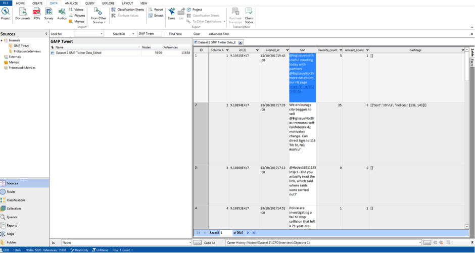
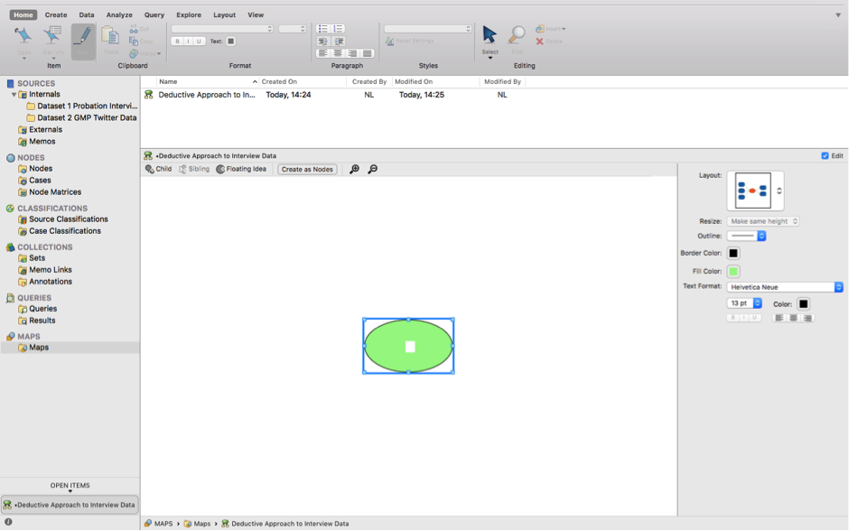

# Week 9 {#week9}

## Learning outcomes

In this session you’ll learn:
- How to interrogate qualitative data using NVivo.
- How to build theory through deductive, inductive and abductive strategising.
- Some useful analysis features in NVivo, including how to work with non-textual data.

## Deduction, induction, adaption – key analytical strategies for qualitative data 

To recap from the lecture, this diagram gives some indication as to the directions of data analysis:

 

We discussed this in the lecture so you’ll have an understanding now of strategies for approaching research including data collection and data analysis. 

**Induction** is considered to be ‘bottom-up’ where we start with very broad general interests but build theory and concepts by first coding and interrogating the data. The key here is to ensure existing theoretical perspectives and concepts do not over-define our analysis and thus obscure the possibility of identifying and developing new concepts and theories. 

**Deduction** is considered to be ‘top-down’ reasoning where we have predetermined ideas and theories and seek to test or evidence these. The coding categories we use are therefore explicit in directing the focus of our analysis.

**Abduction** integrates these two approaches, giving flexibility across the analytical process, and ensuring interplay between our ideas and data.

In this session you’ll learn how to interrogate your qualitative data using NVivo from all perspectives. You can read more about these strategies here.

## ‘Coding’ qualitative data using ‘nodes’

A ‘code in qualitative inquiry is most often a word or short phrase that symbolically assigns a summative, salient, essence-capturing, and/or evocative attribute for a portion of language-based or visual data’ (Saldaña, 2016: 3). You can read the [first chapter of Saldaña’s The Coding Manual here](http://stevescollection.weebly.com/uploads/1/3/8/6/13866629/saldana_2009_the-coding-manual-for-qualitative-researchers.pdf).

‘Coding’, ‘coding schemes’ and ‘coded retrieval’ of our data are key tools of qualitative analysis. The terminology and philosophies that underpin coding processes are explained below (but mainly in the lectures) and we find that specific methodologies use particular routines when coding. For instance, one common approach is informed by ‘Grounded Theory’ that involves both induction and deduction to code data. Here, researchers would undertake a first layer of ‘coding’, often called [‘open coding’](http://methods.sagepub.com/reference/sage-encyc-qualitative-research-methods/n299.xml), to break down data into indicative themes and concepts. This precedes more granular coding referred to as [‘axial coding’](http://methods.sagepub.com/reference/encyc-of-case-study-research/n54.xml), where categories and concepts are further refined. We’ll draw on this approach in today’s session. The structures of coding schemes, alternate groupings and basic retrieval mechanisms are key to moving forward with analysis. 

In NVivo we code our data using ‘nodes’. This is sometimes also termed the ‘indexing’ of our data.

**NOTE: If you only take one thing away from today’s session then it should be the importance of nodes. These are the fundamental building blocks of the theories and concepts we interpret in our data.**

So, let’s learn how to code using ‘nodes’.

### What are ‘Nodes’?

Node is a term which refers to a point in the NVivo database but a code label may be the name you give the node. Codes or nodes can be your ideas about the data – they can be generated inductively, deductively or abductively and may be refined, changed, grouped or deleted at any time. Applying nodes etc., to passages of source data at a minimum, provides the basic code and retrieve actions needed to accumulate together, all the bits of data linked by common threads and themes. 

**Nodes can be containers** within which we locate our data related to particular themes or ideas of interest. We can use them in this way organise our thinking. For instance, if we were looking at the Lewis Hamilton data from last week, we might have created nodes such as: ‘methods’, ‘ethics’ or ‘perceptions’ of tax avoidance. Within each of these ‘nodes’ we could copy key sections from our media articles, journal articles and policy documents into them in order to collect data about key themes. Nodes here then are more reflective and act as containers for or links to data exemplars based on, conceptual ideas, themes, codes or more structurally for people, contexts, places etc. Essentially, the terms nodes, codes, keywords, and themes are used similarly.

**Nodes can also be empty** – for example, they can act like hierarchical top-level codes with nodes underneath them that do contain or have been applied to, data. So, we might have created a top-level node entitled ‘tax avoidance’ and then created sub-level nodes entitled ‘methods’, ‘ethics’ and ‘perceptions’. We might even created further layers of nodes within each sub-level e.g. in the ‘perceptions’ node, we might break that down further to ‘perceptions of the public’, ‘perceptions of enforcement authorities’, ‘perception of politicians’, and so on.

These node layers therefore build a structural framework for our data. Plus, each Node of any sort can be linked directly to one memo – so that relevant analytic notes are easily accessible from the node itself. 

Let’s do this then. Here we’ll focus on using nodes for reflective purposes and for thematic purposes.

### Activity 1: Coding

We need to start by importing our data. Start by opening NVivo and creating a new project – call it something relevant for today’s session e.g. Lab Session Week 8.

On Blackboard you’ll fine two datasets in the Week 9 folder: 
1. Dataset 1 Probation Interviews
2. Dataset 2 GMP Twitter data. 

You’ll need to download and save these to your p:drive. (Dataset 1 is a zip file, you’ll need to unzip it). Once you’ve done this, go back to NVivo and import them, using the knowledge you gained last week. For instance, first, create folders within your internals section to house the data (see below). Second, import your data. If you import all the interviews at once, there is a small chance you computer will explode, catch fire, and burn the lab down. But let’s hope not. Be patient though, it can take a few minutes to import so much data at once. If it does crash though, you might just need to import the transcripts in smaller numbers. You can see what I’ve done in the screenshot below:

 

If you double click on any of the transcripts in the List Pane you’ll be able to see the content in the Detail Pane.

For Mac users, when you import the GMP Twitter Data, you can import as a ‘Dataset’, rather than as ‘Documents’. You’ll first encounter the screen below:
 
 

Simply click ‘next’, then ‘next’ again in the following window and then ‘Import’. You’ll then be able to see the Twitter data in the Detail View as below:

 
 

For Windows users, the process is slightly different as there is no ‘Datasets’ option. To import data from an Excel file on the Windows version of NVivo, go to “Import”, “Import survey” and “From Microsoft Excel File”. Alternatively, click on the “Data” heading and select “Survey”. In the drop down menu, select the file type (Excel or CSV, in this case our data is an Excel file). 

  

You will have to click through the Survey Import Wizard which looks like this: 

  

There are four steps to click through where you check to ensure the data will be imported correctly. In this case, you can just click ok through each step without making any changes. After step 4, click “Finish”. It may take a few minutes for NVivo to process the request. 
 
  

This should be the end result when you finish the import wizard:
 
 

Ok. So now we have both our datasets imported into NVivo. It’s probably worth saving your project now, just in case something goes wrong.

Usually, as these two datasets are very separate in terms of the purpose, we would probably create two separate projects in NVivo in order to keep our separate research projects apart. For the purposes of getting to know the software though, we can analyse both in one project today.

## Using ‘mind maps’ to organise your ‘analytical process and framework’ 

At this point, we need to give our coding some focus. To do this we can use ‘mind maps’ so we know how to code our data. To demonstrate this, we are going to code the interview data in Dataset 1 using a deductive approach; and then code the Twitter data in Dataset 2 using an inductive approach.

### Activity 2: Deductive coding

First, single click on ‘Maps’ in the Navigation Pane, then right click in the List Pane to create a new mind map. Call it Deductive Approach to Probation Interview Data. You should end up with the following:
 
 

Now, deductive logic assumes that we have a predetermined set of codes, ideas and themes that we intend to better understand. For instance, the interviews that were carried out with Chief Probation Officers (CPOs) in this research had the following clear research objectives:

1.	to investigate the social and educational backgrounds and career histories of CPOs;
2.	to explore their perceptions of community penalties, developments in these over the course of their careers and potential changes in the future;
3.	to examine the role of CPOs as managers and their relationships with central government, local agencies and their probation committees.
So we can extrapolate key ideas from these objectives and use them to guide our coding of the data. I’ve broken down the research objectives into key concepts and organised this in my mind map. Take a look at my screenshot below and see if you can replicate what I’ve done. You might choose to pick a different structure, or different codes, that’s fine too. Play around with creating ‘children’, ‘siblings’ and ‘floating ideas’. Play around with colours and structure.

  

What we’ve done here is create a predetermined framework for coding the interview data. That is, when we read the transcripts, we can assign these themes to what was said in the interviews. Plus, to save us having to create all the nodes individually, we can now just use the ‘create as nodes’ option. Click it then choose ‘Nodes’. Now click on ‘Nodes’ in the Navigation Pane and you’ll see the following – open up the folders so you can see all the nodes:

 
 

This is where the hard work begins. We now have to code our interview data.

There are multiple ways to code data at nodes you have already created. You can also use some of these methods to select more than one code to apply to the selected passage of data. 

The easiest way to do this is as follows (though NVivo gives you many ways to code the data). First, go back to your internals, click on the Dataset 1 folder, and double click on Interview 1 (int01). This will open the transcript in the Detail Pane. For ease, now click  on ‘Nodes’ so you can see all your created nodes and have them in mind when you read the transcript. Now start reading the transcript and each time you read something that corresponds with your ‘nodes’, you need to ‘code’ it.

For Mac users, to do this, simply highlight the text and right-click on it, choose ‘code selection’ and then ‘at existing nodes or cases’:

 

For Windows users this looks slightly different. You have to have to click on “Code” then a new window pops up with the nodes and you select from there. The right-click menu to code selected text looks like this:
 

You’ll notice the passage I’ve selected relates to career histories so I’m going to code this sentence in the corresponding node. However, I also think it relates to ‘educational background’ so I’m going to code this sentence in two ‘nodes’:

 

In Windows, to select multiple codes, you must hit “ctrl” and then click the additional node you want:
 

Keep reading through the transcript and coding segments at single or multiple nodes as you see fit. You’re now coding your data deductively using a predetermined conceptual/thematic framework.

Keep coding until you feel like you fully understand how this works and until you’ve coded some data for each of the predetermined ‘nodes’.  There is an option for “recent codes” that shows what nodes you have been using and this can be slightly easier than opening the window back up, but it depends on how you wish to code the data. Perhaps also code text from other interviews too. You don’t have to read all the transcripts, just read enough to understand the process and be comfortable with the software.

But where has all our coding gone? The best way to visualise what we’ve done is to go to the ribbon tab at the top, chose ‘view’, then ‘coding stripes’, then ‘nodes recently coding’ and you’ll see the following:

 

At the bottom right corner in the Detail Pane you’ll be able to see the nodes that we have coded.

To speed up the coding, you might want to ‘drag and drop’. This is a favourite for many researchers, as coding in this way allows you to drag a highlighted selection of data onto any code showing in the List pane. This, of course, necessitates the list pane be showing Nodes (as opposed to Sources or anything else from the Navigation pane). Simply hold down left click of mouse and drag it onto the desired node 

IMPORTANT: One way to speed up drag and drop coding and see the most nodes possible on the screen at one time is to rearrange the windows so that the List containing the nodes is on the left side, and the Detail pane of the source is on the right side. Do this by going to View Ribbon tab /Detail View /Right. Then arrange vertical splitter bars to accommodate as much text on the right as possible while seeing enough of the code labels on the left. You’ll then be able to view like this:

 

In theory, you would now read every single transcript and code your data. We’ll look at what you can do with this coding after we’ve looked at inductive coding.

### Activity 3: Inductive coding

To better organise our data and to keep our nodes for our two datasets separate, it’s worth creating two ‘node folders’. If we were working on only one dataset we wouldn't necessarily need to do this. However, for now, right-click on the ‘Nodes’ folder in the Nodes section in the Navigation Pane. Create a folder called Dataset 1, then another called Dataset 2. Now, click back on the Nodes folder, select all the Nodes you created, and drag them into the Dataset 1 folder. We can then put all our new Nodes for the Twitter data in the folder entitled Dataset 2, as below:

 

Now let’s start our Twitter data inductive coding. As above, let’s start by creating another mind map, but this time for the Twitter data. We’re not looking to create predetermined codes as with the deductive approach. Instead, we want to remain open minded about what themes are in the data. So let’s remind ourselves of this. See if you can produce something like the following:

 
 
 

Remember, we don’t want to approach the data with too many concrete, predetermined ideas about what we will find in the data. Instead, we want to have a few open, guiding questions that will allow us to code our data as we read it.

So now to the hard work again. But this time we’ll need to create out nodes, inductively, as we read through the tweets. 

Start by clicking on Dataset 2 in the Sources section in the Navigation Pane, then double clicking on the dataset in the List Pane to open it up in the Detail Pane. For the purpose of the coding today we’re only really interested in the texts of the tweets. 

Read through the tweets one by one and each time you come across a theme of interest, code it by highlighting it, right-clicking and choosing ‘code selection’ then ‘at new node’. I think the first tweet relates to ‘partnership working’, so this is what I’ve called the node. I’ve now gone on to create more Nodes, some of the text relates to more than one Node. I’ve also started to create a hierarchy of Nodes and Sub-Nodes, as with the ‘Crime Types’ node folder. As you’ll see, I’ve changed the view to make it easier to create new Nodes and code at existing Nodes by dragging and dropping. I’ve also viewed the code stripes on the right hand side. You’ll notice that when you create Nodes that they are located in the top-level Nodes folder. So once you’ve finished your coding you can select and drag them into your Dataset 2 Nodes folder to keep it all well organised:

 

In theory, you’d read through all the tweets and code everything you consider important thematically in this case. You’d then read them all again; and again; and then again, and so on, until you're happy with the coding framework you’ve developed. You can do this in your own time. You could end up with hundreds of Nodes; you can merge Nodes; un-code text; delete nodes etc., until you’re satisfied.

**TIP: The great thing about folders in NVivo is that you can change your mind, restructure them and move or drag nodes around between them whenever you like – really easily. I’ll let you explore all this in your own time. It’s all intuitive and if you ever get stuck you can watch the tutorials on the QSR website.**

## Abductive coding

Essentially, this involves going back and forth between the deductive approach and the inductive approach. You might wish to create some pre-determined codes/nodes based on your interests and/or theory and then flexibly adapt these as you interrogate your data.

### Activity 4:  Retrieval – viewing coded data 

If you need to look vertically through one file at a time, reviewing what you have done, open a document and ensure Select Coding stripes /All has been selected:

 

This way, you will see any codes appearing in the data. Though this is not so easy since all codes may occupy a very wide margin space and require much scrolling. Or you can selectively review codes (

Once you have done some coding, you may want to review the passages you have selected for a particular node. To do so, double click on the code you want in the List pane. This will open the code in the Detail pane. Each source that has references to the chosen code is listed, headed by a hyperlink back to the source.

The tabs down the side provide different ways to view the references, and are dependent on the type of data media coded there.

**ANALYSIS COMMENT: There are many reasons why you may wish to see what coding you’ve done, or what content is coded at a node. You may want to review your coding, to compare each passage with the other passages or by means of showing Coding stripes to browse what else is coded in this source at that node, or simply to get back to coding where you left off. **

### Activity 5: Viewing more context 

It may be useful to be able to see the surrounding context of a coding reference you’re examining. This can be done in several ways: 

- You can jump to the source by Right-clicking on the passage > Open Referenced Source. This will take you to the source and highlight the passage in which you were interested:

- You can view additional content surrounding your passage of interest without going back to the whole source by R-clicking on the passage > Coding Context > and choosing how much you wish to see:

 

this will bring in your selected quantity in light grey type so you can differentiate it from what’s actually coded at that node at which point you can select more of it to code into that node if you would like. 

## Export coded data 

There are extensive ways to output data material about your data to other formats and applications. Not all ways are included here since there are infinite combinations of settings required for different reasons which will be based on your own particular requirements. 

### Activity 6: Exporting via the list pane 

This is the general and usually used qualitative form of output which can be achieved almost anywhere in the package by different methods. This would usually be what is required for e.g. coded output and is easier to generate than the more formal Reporting functions below. 

In List pane – select the item/s you want to export content for, say a Node or a Document, Right click > Export 

**IMPORTANT: If you accept the default Entire Content an html file will be created** 

If you want a Word file or files to be created click on down arrow and select Reference View(Check any of the additional options carefully e.g. always check the Name option, this will insert the name of the item in the content itself. If you are uncertain about where the file will go, pay special attention to the File saving window which opens to allow you to create a new folder or to locate the file usefully. Similarly check the Open on Export option so that you can see the editable file/s you have generated on screen before closing them down. 

Give this a go now with the Nodes for Dataset 1. First, click on Dataset 1 Nodes in the Navigation pane. Then Right-click on the Node you want a report on (I’ve chosen the  ‘Career History’ Node) and choose Export. Find a suitable location to save the data and ensure you save as a Word file. This will be easiest to view. Now, you should have a neat overview of your Node that you could use for quotes in your essays, dissertations, or journal articles.

## Reports (NOTE: WINDOWS ONLY USERS! NOT SUPPORTED BY MAC, YET!!)

The formalized **Reports** and associated **Extracts** function (in Navigation bar or Explore/Ribbon group) specifically concerns the support provided for mixed qual/quant methods. Some of the reports only provide quantitative information or summaries. Experiment with these via the Help Menu. 

Two standardized Reports will also provide e.g. qualitative coded source data. 

- Coding Summary Report by Node 
- Coding Summary Report by Source 

These reports are essentially the same but allow for different sorting mechanisms. This would be a quick way to export many codes at once. Experiment with all the drop-down options and Select buttons. 

See if you can create a Report on your Nodes and Sources.

MAC USERS – play around to see what kind of things you can create. It's all about trial and error at this stage.

## Some other useful things to do

Below are some more tools you might get some use out of.

### Create another Word Cloud:

See if you can replicate something like this from last week:
 

This is a Word Cloud for Dataset 1 only.

### Create a Word Tree:

Using the Query function, I’ve done a text search for the words ‘Career’ AND ‘Probation’ AND ‘Money’ AND ‘Lifestyle’ in Dataset 1 and then chosen the ‘Word Tree’ option to better understand the key discourse around the term. In Windows, go to “Query” and then “Query Wizard”. Are there any relationships here? My query produced this:

 

Whilst you can export your Word Tree into jpeg or PDF form, in NVivo you can also click on the different branches to better understand the connections. Try it out.

### Create a Concept Map (WINDOWS ONLY!!)

Windows users might want to create a concept map to connect data to different ideas and thoughts. It is very similar to the Mind Map function that we did earlier. [You can learn more about it here](https://www.youtube.com/watch?v=3R5gZKdOJD4).

## Other features…

Finally, here are some features that the more innovative amongst you may wish to make use of. Much of my data is textual in that I often carry out interviews with people knowledgeable of white-collar and corporate crimes. But you might be interested in generating different data, such as audio or visual:

### Graphics/pictures - making linked notes and coding 

Try importing a picture. Find something online and save it. Then import it. Here’s my example:

 

With the picture on view, click to edit, or enable the editing feature. You can then:

- Make a selection within the graphic/right click/ Insert a row – and write notes. 
- Make a selection/right click /Code selection. (
- Code the notes instead(

Have a play with coding and analysing pictures.

### Coding audio/video data 

Coding multimedia data is very similar to coding textual data. For either audio or video sources, you can select transcript text and code per usual, or you can select a segment on the progress bar and code that directly as if you’d highlighted text. 

So, if you have some music on your iTunes, try importing a song to see what it looks like then see if you can code lyrics and sections of the song. I’ve put some Bruce Springsteen in my project if you want to try it out there…

## More on capturing web material 

Last week we tried to import html pages for our media articles. But another, and actually better, way of doing this is by using NCapture.

A growing variety of web content and social media is available to you using NCapture, a web browser extension, that is available for free with NVivo. It allows you to capture and import a screenshot of any webpage as a PDF or various social media sites (such as Twitter, Facebook, and LinkedIn) as a dataset (table). Once you have NCapture installed, open your browser, and navigate to the website of interest. 

To learn more about this [click here](http://www.qsrinternational.com/nvivo/support-overview/faqs/what-is-ncapture). 

You’ll need to do this on your personal machines as it is unlikely to be installed on the lab computers. 

Once installed, the process is as follows:

- Click the NCapture icon in your browser bar 
- A dialogue box opens (right) 
- Choose your source type (probably ‘Web Page as PDF’), source name, optional description, memo nodes, etc. 
- Click Capture 
- See NCapture Progress page below 

**NOTE: WEB PAGES ARE CAPTURED USING THE PDF OPTION – SOCIAL MEDIA WOULD BE CAPTURED USING THE DATASET OPTION** 

- Go to the Sources section of the Navigation pane > Internals > Web Content subfolder (or wherever you’d like the new Sources to be created) (
- Go to the External Data Ribbon tab > From Other Sources > From NCapture (as seen left) (
- A dialogue box opens, as seen below , showing recent captures. Choose the captures you’d like, and click Import. Webpages will be brought in as pdfs; social media files as tables, depending on your choices during capture.

Then analyse as we have been doing in the sessions.

## Summary 

You can use your nodes to build your ideas and theories, or identify evidence to support your theoretical propositions. You can focus in on particular themes, compare across nodes and the data, and extract to support your academic work in a systematic way. Using NVIVO gives you structure and management for your data, helps you develop clear organizing and conceptual frameworks, and allows you to interrogate the data at different levels and in different directions.

