--- 
title: "Making Sense of Crim Data"
author: "Reka Solymosi"
date: "`r Sys.Date()`"
site: bookdown::bookdown_site
output: bookdown::gitbook
documentclass: book
bibliography: [book.bib, packages.bib]
biblio-style: apalike
link-citations: yes
github-repo: rstudio/bookdown-demo
description: "This is a companion workbook for the 2nd year undergraduate module LAWS20441 Making Sense of Criminological Data at the Universit of Manchester"
---

# Introduction {-}

This workbook contains the lab materials and homework assignments for an introduction to data analysis course designed for LAWS20441 Making Sense of Criminological Data, a 2nd year undergraduates on the BA Criminology programme at the University of Manchester. 

It makes use of Excel, as we have identified a gap in training students to use Excel, despite it being a primary tool for data analysis (whether we like it or not) in many public and private sector organisations. As many students take [Q-step internships](https://www.humanities.manchester.ac.uk/q-step/), this skill was identified as important. 


Making Sense of Crim Data introduces students to data, and the concepts of descriptive data analysis. The role of this term is to familiarise students with basic concepts of data analysis, and get aquainted with descriptive statistics to be able to talk about data about crime, policing, and criminal justice topics. Details can be found in the Syllabus.


## Disclaimer

Please beware that:

- In making these notes, while I briefly cover some concepts, students are expected to do the weekly reading, and attend the weekly lectures, as well as participate in lab disucssions to receive a complete course experience. These notes are *not* intended to be a stand-alone reference or textbook, rather a set of exercises to gain hands-on practice with the concepts introduced during the course.
- These pages are the content of the BA Criminology 2nd year course Making Sense of Criminological Data. They are meant to (very gently) introduce undergraduates to the concept of data analysis, and cover descriptive statsitics and the key concepts required to build an understanding of quantitative data analysis in crime research. It is followed in the second term by Modeling Criminological Data where students cover inferential statistics. The notes presented here are supported by compulsory reading and some lectures, and so do not provide a comprehensive description of these techniques and tools and how to use them.
- The handouts below use, among other data sets, dara from the UK data service such as the Crime Survey for England and Wales that is available under a Open Government Licence. This dataset is designed to be a learning resource and should not be used for research purposes or the production of summary statistics.


```{r include=FALSE}
# automatically create a bib database for R packages
knitr::write_bib(c(
  .packages(), 'bookdown', 'knitr', 'rmarkdown'
), 'packages.bib')
```

<!--chapter:end:index.Rmd-->

## Overview of course {#overview}
<!--
You can label chapter and section titles using `{#label}` after them, e.g., we can reference Chapter \@ref(intro). If you do not manually label them, there will be automatic labels anyway, e.g., Chapter \@ref(methods).

Figures and tables with captions will be placed in `figure` and `table` environments, respectively.

```{r nice-fig, fig.cap='Here is a nice figure!', out.width='80%', fig.asp=.75, fig.align='center'}
par(mar = c(4, 4, .1, .1))
plot(pressure, type = 'b', pch = 19)
```

Reference a figure by its code chunk label with the `fig:` prefix, e.g., see Figure \@ref(fig:nice-fig). Similarly, you can reference tables generated from `knitr::kable()`, e.g., see Table \@ref(tab:nice-tab).

```{r nice-tab, tidy=FALSE}
knitr::kable(
  head(iris, 20), caption = 'Here is a nice table!',
  booktabs = TRUE
)
```

You can write citations, too. For example, we are using the **bookdown** package [@R-bookdown] in this sample book, which was built on top of R Markdown and **knitr** [@xie2015].


-->

### Module structure

Hi there and welcome to this course for making sense of criminological data. This introduction will explain the structure of the course.  

The course is 10 weeks, each week made up of 5 elements: 

1) Preparatory reading
2) Lab session
3) Post-lab task
4) Homework quiz
5) Lecture


#### 1) Preparatory reading

For each week you will receive some preliminary reading or videos to watch, before coming to the session. It is very important that you read these before coming to the lab session, as it will make engaging with the lab material easier. Also, you can take the labs as an opportunity to ask questions about the readings, and discuss with myself and the teaching assistants during the 2-hour lab sessions. 

#### 2) Lab session
Lab sessions are the two-hour sessions in computer labs, where you are to work through the lab notes included in this book. You should take time to engage with these notes, and ask lots of questions from myself and the teaching assistants present. This is a time to really engage with the materials. 

When you come into a lesson, you will be able to sit at a PC and get started straight away. You will find the instructions for each week in this booklet. You can open up the link via Blackboard, and read through the instructions chronologically. That just means start at the top, and read through to the bottom. 

Usually within the notes there are some general introduction to the topic covered that week, with links to [videos](http://www.gapminder.org/videos/the-joy-of-stats/) or further [reading](http://flowingdata.com/2015/10/26/top-brewery-road-trip-routed-algorithmically/). You should come equipped with headphones to watch the videos. 


These lab notes also contain within them activities. <span style="color:#d95f02">Activities will be denoted by red colour text, just like this one </span> You should do these activities in the lab, and ask for our help when you are stuck, or if you do not understand a concept. These activities will help you with your learning, but also will contribute towards your homework. You are welcome to discuss with each other, and with us, but please do make sure that when it comes to understanding the learning behind these activities, you are confident in your ability. The final essay will rely heavily on your ability to take the concepts you learn duing the activities, and apply them in a way that shows your understanding. 

#### 3) Post-lab task

Each week, after you have completed the lab notes, you must complete some post-lab tasks. These will take the form of a worksheet. You can find each worksheet and relevant material (eg: data) on Blackboard in the folder for that week. There will also always be a link at the bottom of the lab notes. You have to complete these tasks in order to be able to take the homework quiz (which is assessed). The tasks will always mirror the in-lab activities, so if you get through those, the task should be a breeze. 

#### 4) Homework quiz

Each week you will have to complete a homework quiz. This quiz is assessed, and your score on all the quizzes combined counts for 20% of your final mark (the other 80% is your final essay). The questions in the homework quiz will ask about key concepts from your reading, and about the answers to the post-lab task. Make sure that you have finished the task before you begin your homework quiz, and have it with you while you do so. The homework quiz will be available on Blackboard, and will be open on each Friday at 11:00am, and close the following Thursday at 9:00am. You can take the homework quiz any time between these times. You can take it only once. Once you activate the quiz, you will have only 30 minutes to complete it. Please make sure you are in a quiet environment where you will not be disturbed, with your reading notes and your post-lab task with you, so you can complete the homework quiz successfully. Upon submission you will receive immediate feedback. 

Don't forget your homework is graded, and counts towards your final mark. But you get to practice for completing the tasks with the activities in the lab. And if you have time left over, you can always complete these tasks here in the lab. No matter where you do them, by havign the tasks completed and with you when you take the quiz, you will be more confident in the homework quiz exercises. 


#### 5) Lectures

In the lectures we will go over one last time the basic concepts covered in that week. The lecture is the final event that should pull together all your learning from that week. It is your chance to ask questions, discuss, and further interrogate the material we cover. I encourage you to bring your own examples to lectures wherever you encounter them. Lectures are podcast, however they are also attendance monitored. You must attend, and sign in to these lectures to receive attendance credit. 

<!--


, which will be indicated by special notation (colour):


<span style="color:#a50026">Where you see text in red, this is an instruction to carry out a task or activity. Make sure you do these in the lab, so if you have any questions about it, you can ask the teaching team!</span>

<span style="color:#313695">Where you see text in blue, this is an instruction to carry out a task or activity that will then feed into your final assignment. You can do these in the lab, or you can do these on your own time and bring them to get some feedback, however you will not get as much feedback as you would on the homework, as this will be all going into your final assignment. There is a list of all of these tasks available on your [document about the final assigment](), however they are included in each week's lab notes to help you build towards it, and not have to do everything in one large panicked go at the end of term. Because you wouldn't do that would you. You are a forward planning, non-procastinating student. Good. </span>
-->


<!--chapter:end:001-intro.Rmd-->

# Week 1 {#week1}

## Learning outcomes

Welcome to week 1! This week is all about getting set up, and taking some first steps in learning about what is *data*. These are the building blocks of all the weeks to come, so pay special attention, and do set a pattern of asking questions! Now without further ado, let's get started. 


## Setting up your working environment


There is a myth about the scientist and the messy workspace, typically illustrated with Albert Einstein: 
```{r, echo=FALSE}
knitr::include_graphics("imgs/einstein_desk.jpg") 
```


However many of us need order to be able to work properly. An organised workspace is also prominent, as we can see with these famous work spaces of : Galileo, Marie Curie, John Dalton, Alan Turing, and Charles Dickens:


```{r, echo=FALSE}
knitr::include_graphics("imgs/galileo_desk.jpg") 
knitr::include_graphics("imgs/marie_curie.jpg") 
knitr::include_graphics("imgs/Dalton_John_desk.jpg") 
knitr::include_graphics("imgs/alan_turing_desk.jpg") 
knitr::include_graphics("imgs/charles_dickens_desk.jpg") 


```


When working with data, you have to consider your workspace. You can think of your computer folders as your desk. It helps immensely to keep our data, your code and your notes organised. You will likely have a project folder, where you save your data, your graphs, your analysis outputs, etc. You want to consider the layout of this folder, how many subfolders will you have, what is the best structure to work for you? You might think this is trivial, but when you are working on a project with multiple data sets, or many graphs, it can get very messy very quickly. I recommend going through [this resource from the university of Cambridge data management guide](https://www.data.cam.ac.uk/data-management-guide/organising-your-data) to consider Naming and Organising Files, Documentation and Metadata, Managing References, and Organising E-mail. 


Normally, say when you are working on a Windows PC at home, you can save files to your C: drive, and easily access them the next time you turn the computer on. When you are using computers at the university, however, you cannot be certain of being able to use the same computer again when you want to find and use your file again. Fortunately, once you have logged on to a computer at the university, a personal drive is available for you to use, and in effect, this drive follows you around to whichever PC you are logged on to. All students and staff have a personal file storage space on the network - known as the P: drive as this is usually the network drive letter allocated to it. Wherever you log on to the campus network your P: drive is available (in PC Clusters the My Documents icon on the desktop is a shortcut to the P: drive).


You should already have a username and password with which to log on. Your username has 7 or 8 letters/digits, typically beginning 'm...'. On the computers in the Faculty clusters (where you work in class time) you will see the Faculty computer 'image' and a version of the operating systems Windows 7.


Away from the campus you can download and upload files to and from your P: drive over an Internet connection - for example to and from your home computer, but please remember that large files may take a long time to upload/download depending on the speed of your home internet connection. [See here for details about remote access](http://servicedesk.manchester.ac.uk/portal/app/portlets/results/viewsolution.jsp?solutionid=040918305513985&SToken=A9F6241A4BCC47E813D7C92C68B579F7).
 

It's generally good to create a folder to save your data and our outputs in, which we will call a **working directory**. So firstly, before we begin to do any work, we should create our **working directory**. This is simply a folder where you will save all our data, and also where you will be reading data in from. You can create a new folder, where you will save everything for this course, or you can choose an existing folder. It's advised that you create a folder, and also give it some name you remember, that will be meaningful. Generally try to avoid spaces and special characters in folder (and file) names. [Here is a handy guide you should read about naming files and folders that will be relevant for all your future work](http://www2.stat.duke.edu/~rcs46/lectures_2015/01-markdown-git/slides/naming-slides/naming-slides.pdf). 


It's not necessarily a good idea to just dump everything into 'Desktop' either, as you want to be able to find things later, and maybe keep things tidy. We will now show you where your personal drive is and how to save your word file to it.

<span style="color:#d95f02"> Just to have some practice with doing this, create a Word document to put into the folder. Open Microsoft Word now (you can find this on the 'Start' button in the bottom left corner of your screen). The only thing you have to type in the document is your name. 

<span style="color:#d95f02"> Save the file to your p: drive as follows. Click on the *save* button (or click File then Save in the drop down menus). The dialogue box below will appear. Click on the down arrow in the 'Save in:' box to change the default directory to your P: drive. The P: drive is the one that starts with your user name. Click on this drive. 


  
<span style="color:#d95f02"> Now create a new folder within your P: drive, especially for material for this course. To do so, click on the 'Create new folder' icon, as shown in the dialogue box below.


 
 
<span style="color:#d95f02"> Label the new folder 'LAWS20441'. You will now have a series of folders in your p: drive (some of these you haven't created yourself, they have been provided for you by the university), one of which you can store course material in. 
Finally, name your Word document 'Trial Document' (in the filename box) and click 'Save'. As noted above, you can remotely access your p: drive (from home or elsewhere). You can do this by logging into your personalised university portal (https://my.manchester.ac.uk).
</span> 


A word of caution, if your P: drive is full (and this tends to happen when you save image or sound files to it), there is a chance that some of the applications you want to use do not work. So make sure you keep your P: drive tidy if you don’t want to run into problems.


## Getting to know Excel


Besides having a folder where you save something, you should also get comfortable with the tools which you will be using throughout this course. The main tool you'll be using is  [Microsoft Excel](https://en.wikipedia.org/wiki/Microsoft_Excel). You will be using it to explore, learn about, and manipulate criminological data throughout this course. 


If you are following along on your own laptop (I encourage this strongly) you can download microsoft excel **for free**, courtesy of the UoM library. [Follow the instructions here to get Microsoft Office on your laptops](http://www.itservices.manchester.ac.uk/students/office365/). 


Now you likely have come across Excel before,  but it's also possible that you have not, so I will start with the assumption that this is your first time opening it up. Exciting. So let's get to it. To open excel, click on the windows icon, and select Microsoft Excel from the Microsoft Office bundle.


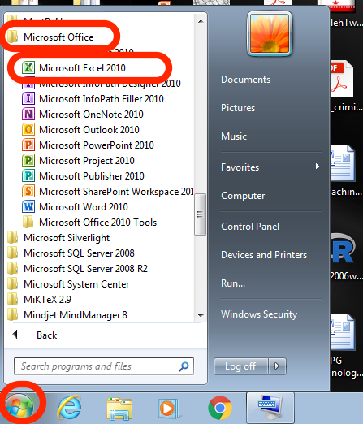


Now you should have Excel open, and you will see an empty spreadsheet. We will be using this just a little bit later on. But for now there is one more step we need to do, to be fully set up. We need to install the data analysis toolpak. 


To do this, click on the 'File' tab, and click on 'Options':


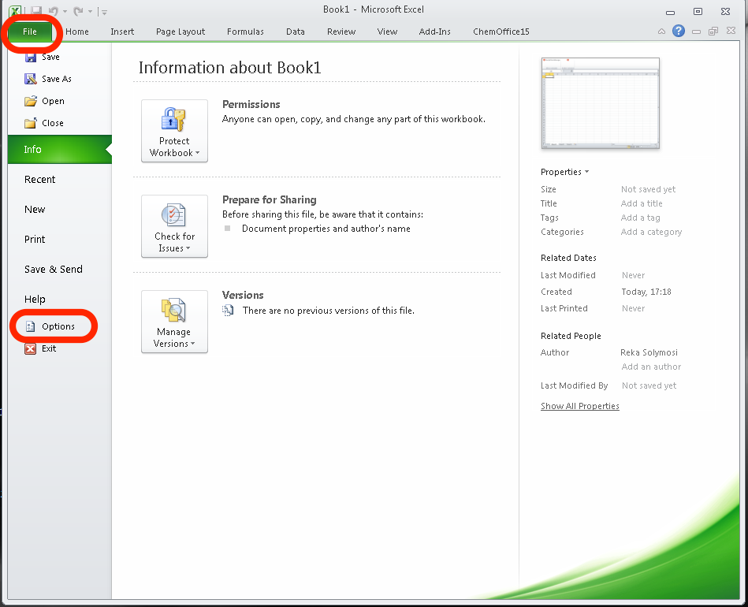


This will bring up a popup window. Here click on 'Add-Ins', then highlight 'Analysis Toolpak' and click on 'Go':


This will open another popup window. Here make sure you tick the box next to 'Analysis Toolpak' and click 'OK':


Click 'OK' and you should be done! You can check by clicking on the 'Data' tab, and checking to see if a little Data Analysis icon has appeared: 


If you are confused, see [here](https://support.office.com/en-gb/article/Load-the-Analysis-ToolPak-6a63e598-cd6d-42e3-9317-6b40ba1a66b4) for instructions how to get this. Once you have successfully installed the data analysis toolpak it will appear.  


And that's it you are now set up! Excellent! 

You can now move on to the subtantive part of today's course. In the next section we will learn about variables and data.


## Data: Variables and observations

```{r, echo=FALSE, warning=FALSE, message=FALSE}
library(tidyverse) 
library(lubridate)

#gmp_crimes <- read.csv("/Users/reka/Desktop/MSCD/data/gmp_crimes.csv")
gmp_crimes <- read.csv("https://www.dropbox.com/s/8tkpjwsmtqeddr9/gmp_crimes.csv?dl=1")

topCrimTyp <- gmp_crimes %>%
  group_by(Crime.type) %>%
  summarise(n=n()) %>%
  arrange(-n)


```


We know that in the period from May 2016 to May 2017, Greater Manchester police recorded a total of `r I(nrow(gmp_crimes))` crimes. We also know that the largest number were recorded in `r I(head(topCrimTyp$Crime.type, n=1))` crime categeory, with  `r I(head(topCrimTyp$n, n=1))` instances, while the fewest in `r I(tail(topCrimTyp$Crime.type, n=1))`, with `r I(tail(topCrimTyp$n, n=1))` instances.


We can also track changes in the number of crimes over time:


```{r, echo=FALSE}
gmp_crimes %>%
  group_by(Month) %>%
  summarise(n=n()) %>%
  arrange(-n) %>%
  ggplot(., aes(x = Month, y = n, group=1)) +
  geom_line() +
  ylim(c(20000,40000)) +
  theme_bw() + 
  theme(axis.text.x = element_text(angle = 90, hjust = 1))
  

```


How do we do this? Well, in the United Kingdom, since 2011 data regarding individual police recorded crimes have been made openly available to the public via the [police.uk](http://www.police.uk/) website [1](http://www.tandfonline.com/doi/abs/10.1080/15230406.2014.972456). This means that by visiting the [data.police.uk/](https://data.police.uk/) website you can access data about street-level crime, outcome, and stop and search information, broken down by police force. What does this mean? What do these data look like? Let's have a look:


```{r, echo=FALSE}
gmp_crimes %>%
  select(-Crime.ID) %>%
  head(n=3) %>%
  knitr::kable() 
  
```


In this data set each row is one crime record:


For every single crime event recorded in this data, there is a row, and it contains all the information that we know about this crime incident. It will have a value for each variable that we are interested in. The variables are the columns. 


So for example, *month* is a variable in our data, and for every row (which is every crime incident) this variable can take a value. Every crime incident occurred at one specific month, and that month when each incident happened will be the value that the *month* variable will take. And the month column will contain all the instances of the month variable for each crime incident recorded. Each observation (crime) will have a value for this variable (the month that it was recorded).


Let's have a go at recording some crimes and putting them into a database, to give you some hands on experience here. 


### Activity 1: Building your own data


<!--Often you will have data readily created for you, such as we saw with the police.uk data set, which can be downloaded in the rectangle format, where your columns are your variables, and your rows are your observations. But data can take many forms. So we will have a go at dealing with some data that comes in a very unruly form: tweets!-->


<span style="color:#d95f02"> You will get a better understanding of how data represents what you are measuring if you have a go at building your own data set. We will do this here by using data from twitter. You are most likely familiar with twitter. You probably even tweet yourself. But even if you have never used twitter, you will no doubt know someone who does. In fact, many police forces use twitter. GMP is one of these forces, and in particular, GMP city centre like to keep their followers updated. Recently, the MEN had an article based on following GMP city centre's tweets for one Saturday night. [You can read about that here](http://www.manchestereveningnews.co.uk/news/greater-manchester-news/what-police-city-centre-deal-13441129). 


Evidently tweets present really exciting and rich data. However they do not come in a format that is readily available for analysis in the form that we just presented here. But what you can do is collect data from tweets. And this is your task for your first lab activity. 


I have collected for you a set of tweets. Your task is to turn this into a rectangular data format, with the columns as variables, and the rows as observations (tweets). Don't worry though, I'll walk you through it.


So first things first, we need a tool. As discussed we'll mostly be using Excel in this course. So open up excel and create a brand new spreadsheet. 


Your first activity is to create a column header for each variable we want to collect. The easiest way to do this is just to make the first row your column headers. You can go ahead and create a column for each of the variables we are interested in collecting about each tweet. These are: 

- Month: The month in which the tweet was sent
- Day: The day of the month in which the tweet was sent
- Hour: The hour when the tweet was sent, in 24h format (where 13:00 is 1pm and 01:00 is 1am)
- Account: The account who tweeted this tweet
- Tweet: The content of the tweet
- Likes: Number of likes for this tweet
- Retweets: Number of times this tweet was retweeted
- Comments: Number of comments made as reply to this tweet


Now you will just have to create a new row for each tweet, and populate a value for each variable we are collecting in our data. I'll go through the first tweet with you, so we're clear on what's happening. 
This is tweet number 1: 

- [ Tweet 1 ](https://twitter.com/GMPCityCentre/status/891900693585506304) 

You will see this open in a new window. Now let's try to find the value for each variable in this tweet: 


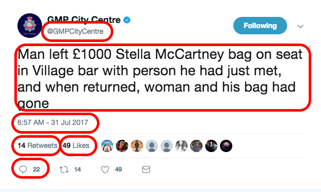


- *Month*: July
- *Day*: 31
- *Hour*: 06
- *Account*: GMPCityCentre
- *Tweet*: Man left £1000 Stella McCartney bag on seat in Village bar with person he had just met, and when returned, woman and his bag had gone
- *Likes*: 14
- *Retweets*: 49
- *Comments*: 22


So when you enter these values, your data will look like this: 


Make sure that you are copy and pasting the 'Tweet' variable, rather than typing it out yourself, to save time and also ensure accuracy. 


NOTE: It is possible that you see a slightly different time than what I have here. This could be because you are logged into your own twitter account, and [twitter shows you the time in your own time zone](http://www.adweek.com/digital/tweet-timestamps/). If this is the case, just log out of twitter (or open an incognito window in Chrome) and it will give you the time in Pacific Time Zone, which is the time zone they are on in California. Now that means they are 9 hours behind us (most of the time, sometimes this varies with daylight savings changes, but should be OK for this exercise). So if you have this problem, you can enter the "hour" variable like this, to get the Greenwich Mean Time version: 


`= hour + 9`


So for example, if you see the time of 10:57pm for the above tweet, you should have


`= 22 + 9`


If this number is greater than 24 (which in this case it is), just subtract 24 - this is because we've ventured over to the following day: 


`= 22 + 9 - 24`


Some of you by now are thinking: "but then we also have to chane the date!" Indeed, if you have stepped ahead to the next day, then the date provided with the tweet is also wrong. I don't know why twitter prefers to display things in Pactific time zone instead of the time zone from which it was tweeted, but unfortunately this is the case. So if you do have a twitter account, I would recommend you log in, and set your time zone to GMT ([see how to here](https://support.twitter.com/articles/20169405)) as it just makes life easier... 


OK, ready? Then let's build our data by adding the following tweets as additional rows: 

- [Tweet 2](https://twitter.com/GMPCityCentre/status/891762454337867776)
- [Tweet 3](https://twitter.com/GMPCityCentre/status/894515606321590273)
- [Tweet 4](https://twitter.com/GMPCityCentre/status/894024570109386752)
- [Tweet 5](https://twitter.com/GMPCityCentre/status/891247668772708352)
- [Tweet 6](https://twitter.com/GMPCityCentre/status/891254643078176768)
- [Tweet 7](https://twitter.com/GMPCityCentre/status/890871354924421120)
- [Tweet 8](https://twitter.com/GMPCityCentre/status/890594946536927233)
- [Tweet 9](https://twitter.com/GMPCityCentre/status/890161961626996736)
- [Tweet 10](https://twitter.com/GMPCityCentre/status/889084990495051776)


Once you have entered all these, you should have a pretty solid set of tweets. The twitter data contains all the variables we have gathered here. You can see there are some tweets of information, some tweets for community engagement, and some appeals to the public for information, such as asking to locate people they might recognise from CCTV footage. 


Once you are done, save your data. You can do this by clicking on "file" and then "save as" and navigating to your working directory to save your file. You can save it as a *comma separated value* file, or .csv . Next term you will be dealing with data in this format. This way any formatting that you do to the spreadsheet (eg making the column titles bold etc) will *not* be preserved, however the data is available to read by more software, not just excel. It doesn't hugely matter at this stage how you save your data. 


In any case, if you follow these steps, you will have a saved set of data, in a csv file, hopefully with some meaningful name: 


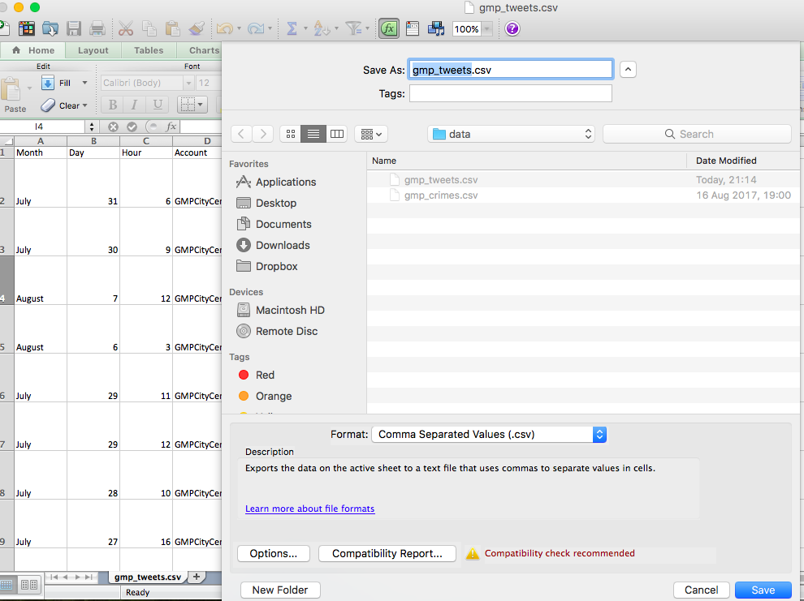


And now you have created your first data set. Your columns are your variables, which correspond to Month, Day, Hour, Account, Tweet, Likes, Retweets, and Comments. Your rows are the 10 tweets which you have collected this information about. 
 </span>

### Code books


Creating data is a gift that keeps on giving, not just for yourself, but for others as well. Data collected by researchers is often shared and made available for others to use as well, so that they can explore their own research questions. For example, the [UK Data Service](https://www.ukdataservice.ac.uk/) is a large repository of data where you can sign up, and access secondary data to analyse. You may have heard of the [Crime Survey for England and Wales](http://www.crimesurvey.co.uk/) or the [ Smoking, Drinking and Drug Use among Young People Survey](http://content.digital.nhs.uk/catalogue/PUB17879). The data collected by  these surveys are online. Many many variables collected about individuals, neighbourhoods, and other units of analysis (to be returned to later) are available to us. Isn't that really cool!? If you want to know, what thousands of people replied to the question asking them what the most important issue was to them when they voted in an election, you can find out just by downloading the correct data set!


But there is one important consideration when you are sharing a data set, and something that is very important to you if you are using a data set someone else has created - you need to know what the variables *mean*. This is made possible by the creation of something called a *codebook* (and sometimes called a *data dictionary*). This is a note that accompanies a data set, telling the user a bit about the data, including what each variable means. 


Have a look at the codebook for the CSEW [here](http://doc.ukdataservice.ac.uk/doc/7889/mrdoc/excel/7889_csew_data_dictionary_2002-03_to_2014-15.xlsx) - note that this will open a force download. Just download it, save it to your working directory, and then open it up with excel. 


It will look something like this: 


You see there is quite a bit of information provided, including the variable name, the question that was asked, a label, which is a bit of a description about the variable, and the possible values which the variable can take. 


If we were to share our tweet data, we would have to create something similar to this for that as well. Something like this perhaps: 


```{r, echo=FALSE}

df <- data.frame(Variable = c(
  "Month", "Day", "Hour"), 
  Description = c("The month in which the tweet was sent", 
                  "The day of the month in which the tweet was sent", 
                  "The hour when the tweet was sent")
  )

df %>%
  knitr::kable()


```


Is there anything else that you would include? Why or why not? Have a think, and if you want discuss with a friend. The important thing here is that you understand what a codebook (or data dictionary) is, and that if you come across a data set, always make sure to look for the associated codebook/ data dictionary to be able to understand what each variable means. If you download your data from the web, you will usually find a link to the data dictionary on the site where you downloaded the data from. 


## Questions about your data


Why would we do this? Well turning information into data allows us to ask questions, and draw meaningful conclusions. For example, by looking at your newly created data set of tweets, you can easily answer the question below: 


- *Which tweet has the highest number of likes?*


### Activity 2: Thinking about what our data tells us

<span style="color:#d95f02">Take a moment to look at your data to answer this question (*Which tweet has the highest number of likes?*). Which one is it? Read the content, have a think, and turn to the person next to you to ask them, why they think that this particular tweet has the highest number of likes in the group. Now try to come up with an alternative explanation. I would like you to now talk about your two possible explanations for why this tweet has the highest number of likes, and note these down somewhere. Keep this for later. 


Similarly, access to anonymised crime data through [police.uk](www.police.uk) allows us to ask questions about levels of crime in our local area, and use these data to answer them. Access to this data allows us to study crime trends across the UK. It allows us to answer questions that we might have - such as, which crime category had the highest number of recorded crimes in the last year? Or is the volume of crime increasing, decreasing, or staying the same? 


To answer these questions we need **data**. The data you can see above, on crimes that fall under GMP between May 2016 and May 2017 can be used to measure crime during this time period in this area. You can access the data dictionary for these data [on the police.uk site here](https://data.police.uk/about/#columns). 

</span>

> The word data is the plural of the Latin datum, meaning a given, or that which we take for granted and use as the basis of our calculations. This meaning is carried in the French word for statistical data, données. We ordinarily think of data as derived from measurements from a machine, survey, census, test, rating, or questionnaire — most frequently numerical. In a more general sense, however, data are symbolic representations of observations or thoughts about the world. As we have seen, we do not need to begin with numerals to create a graphic. Text strings, symbols, shapes, pictures, graphs themselves, can all be graphed. 

- Leland Wilkinson (2005) *The Grammar of Graphics*


As Leland Wilkinson points out, data can be numeric, but it can be other things as well. Data could be text, such as the tweets. It can also be a date, which is a special kind of number, because it has some meaning. Pictures can also be data, as can video, or audio. You can also have spatial data, perhaps in the form of the coordinates for where a particular crime event took place. We can speak about the **level of measurement** of a variable, which just refers to whether that variable belongs to the category of *nominal*, *ordinal*, or *numeric*. Let's explore what these categories encompass in the next section. 


## Levels of measurement


If we set out to collect our own data, we make sure that we collect all the variables needed to answer our question, from all the observations that we have. The kinds of variables we have, determine the kinds of questions that we ask. For example, if we want to ask questions such as the one about the tweets above: "*Which tweet has the highest number of likes?*" we need to have **numeric** a variable. **Numeric** variables let us answer questions about quantity. For example, if we want to know the *average number of crimes per month*, we will need a numeric variable of number of crimes, for each month. Just like for the tweets, we had a numeric variable of the *number of likes* for each tweet. Put simply, number questions are answered by **numeric** variables. 


### Activity 3.1: Levels of measurement pt. 1
<span style="color:#d95f02">
Have a look back at your tweet data that you created. Which variables are numeric?


Stop here again and turn to the person next to you. Discuss with them which variables you think are numeric. Do you agree on your choices? 

</span>

NOTE: It's important that you take some time to actually try to think of this on your own - and I would recommend that you talk this through with someone. If you are happy to chat to the person next to you - do this now. If not, then raise your hand, and myself or one of the TAs will come over. Tell us that you don't want the answer, you just want to talk through which variables you think are numeric. We will listen, and not judge. I'll just wait a moment while you take time to speak to someone now. 


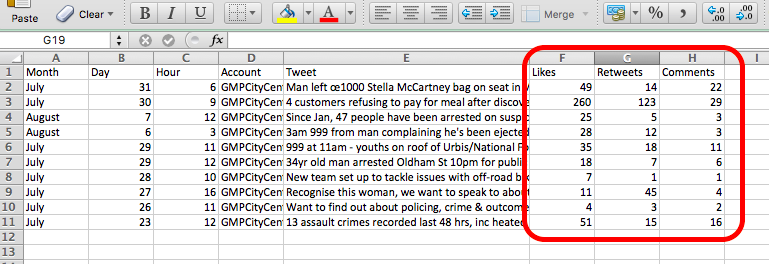


So is this the same as you thought? If yes, nice work! 


If you did not get this right, was that because you also selected the **day** and the **hour** variables? If it was, then that is perfect, because that is what I was secretly hoping you would do! 


Why are day and hour not numeric variables? After all they *are* numbers, right? Well a simple way to think about that is - does it make sense to calculate the average hour for tweets to be sent? If I told you, the average hour for GMP tweets if 13.5, is that something meaningful? Or if I told you that the average day is 15? Not hugely. Hour of the day, and day of the month, which is what these variables represent, are variables which fall into a different level of measurement. These are **ordinal** variables. What does that mean? Well the clue is in the name, **ordinal** variables that are not numeric, but they do fall into a natural order. *Natural order*?? What's that? Well natural order just means that there is a meaningful order that you can put these variables in. You know which comes after which one. For example you can consider letters of the alphabet to follow a natural order, so common we call it alphabetical order. If I tell you to arrange medium, large, small, you know that what I mean is to put them in this order: small, medium, large. **Ordinal variables** are variables where such a known order exists. 


### Activity 3.2: Levels of measurement pt. 2

<span style="color:#d95f02">
So on that note - can you find the other ordinal variables in your tweets data? 
</span>

 
Yes you are right, it's *Month*. You know that if I say January, February, March, then the value to follow is April, and not November. There is an order that these values fall, making *Month* an **ordinal** variable. 


So what about the others? *Account* and *Tweet*? These are **nominal** variables. These are sometimes also referred to qualitative variables. But you can still carry out quantitative analysis on them. You will very often see **nominal** variables in quantitative analysis. In this case, the *Account* variable tells you who is tweeting, and if you have tweets from many different accounts, for example we also looked at \@gmptraffic and \@GMPMcrAirport, we could compare tweets between them. These variables are **nominal** and **not** ordinal, because they do not fall into any particular order. You can arrange them in any order, and it would look just as legitimate as any other order. 


Starting to make sense? To recap, there are levels of measurement that each variable can fall into , and these are **numeric**, **ordinal**, or **nominal**. By the way, **ordinal** and **nominal** are also called **categorical** variables, because they assign each observation into a *category*. Then, depending on whether the category values can be put in a meaningful order or not, you can tell if it's an ordinal-categorical, or nominal-categorical variable. 


Confused? Let's look at this again, but with the crimes data. 


<!--


> In science, we use measurement to make accurate observations. All measurement must begin with a classification process—a process that in science is carried out according to systematic criteria. This process implies that we can place units of scientific study in clearly defined categories. The end result of classification is the development of variables.

- *Chapter 2 Statistics in Criminal Justice - David Weisburd, Chester Britt*


We will talk more about how to create these measurements, and what that means for your research in week 4, but for now it is enough to understand that data are a way of representing information about the world, which can be used to answer questions that we may have. 


For example, we can ask the question: Which borough in Greater Manchester had the highest number of burglaries in this time period. Take a moment to think about this - what sort of data would you need to be able to answer this question? 


You would need to know firstly the name of all the boroughs - right? So you would know how to identify them. Then you would also need to know the number of burglaries that occurred in each borough. Can you imagine what the data will look like? 


Well 


> The word variable is derived from the Latin variare, to vary. A variable gives
us a method for associating a concept like income with a set of data. 

- Leland Wilkinson (2005) *The Grammar of Graphics*
-->

Let's glance at the crimes data set first:


```{r, echo=FALSE}
gmp_crimes %>%
  select(-Crime.ID) %>%
  head(n=3) %>%
  knitr::kable() 
  
```


One variable you can see there is the one called **Crime.type**. This variable can take a value that corresponds to one of the crime types listed in the [Police.UK FAQ](https://www.police.uk/about-this-site/faqs/#what-do-the-crime-categories-mean). For every crime incident recorded, an officer will have to classify this crime incident into one of these categories. All of these categories are all the possible **values** that the Crime.type **variable** can take. This is a  **categorical** variable, as its possible values are categories. Further subset, this is a **nominal** variable, because the categories do not fall into a natural order. These categories are mutually exclusive (a crime is classed as either a Burglary or Vehicle Crime, but not both at the same time) and cannot be ordered in a meaningful way (alphabetical is not meaningful!). If they did have a meaningful order (for example days of the week have an order, or the values *small, medium, large* have an order) they would be **ordinal** variables. Both ordinal and nominal variables are categorical, because they deal with values that can take a finite number of values, or in other words, belong to a set number of categories. They group your data into one of the available categories. 


But not all variables are categorical, some are **numeric** . These types of varibles are numbers, and include things like the *number of burglaries*. For example, suppose we have created this data set, which has 2 variables, one *Borough* variable with the name of each borough, and one *Number of burglaries* variable, with... you guessed it... the number of burglaries in that borough. 


It would look something like this: 


```{r, echo=FALSE}
#create variable for boroughs in lazy way
gmp_crimes$borough <- substr(as.character(gmp_crimes$LSOA.name), 1, nchar(as.character(gmp_crimes$LSOA.name))-5)

gmp_crimes %>%
  filter(Crime.type=="Burglary") %>%
  group_by(borough) %>%
  summarise(number.of.burglaries = n()) %>%
  arrange(-number.of.burglaries)%>%
  filter(number.of.burglaries > 10) %>%
  knitr::kable()

```


This data set is made up of 10 **observations** and 2 **variables**. You might notice that this maps nicely onto your 10 rows of 2 columns. As noted in the previous section, the columns represent your **variables**. The rows reporesent your **observations**. Your observations (or rows) are every single record in your data. So in the case above, every borough has one observation, or the number of crimes in each area. For each observation, we record 2 variables. One variable is the name of the borough. This variable is called *borough*. The other varible is the number of burglaries that took place in that borough. It's called *number.of.burglaries*, and it is a **numeric** variable. 


**Numeric** variables can also be assigned into sub groups. **Interval** variables have values of equal intervals that mean something. For example, if you have results from an IQ score, the difference of 1 score between 90 and 91 is the same as 91 to 92. But there is no *true* zero value, and it doesn't make sense to say someone is twice as smart as someone else. **Ratio** variables however have an absolute zero (a point where none of the quality being measured exists), and using a ratio scale permits comparisons such as being twice as high, or one-half as much. This can get somewhat confusing, and there are sometimes people who argue that a particular type of variable belongs to one group or the other. For example, if you have a Likert scale of Strongly agree, Agree, Neutral, Disagree, Strongly disagree, you can say that this is an ordinal variable (categories that have a natural order). But you could also translate them into numbers, saying it measures agreement from a scale of 1 (Strongly disagree) to 5 (Strongly agree). In this case it is possible to treat this as an interval scale variable. The truth is, you can choose either option, **but you have to have some good justification why**. Did someone else do this before you? Did you read a recent paper where one method was argued to be better than the other? For some instances it will always be clear what type of variable you have. But you should always take time to consider what the level of measurement of your variable is, and what that means for what you can say about your data. As a personal preference, I'd advise against treating ordinal data as numeric, but others will advise that it's generally OK to take means and apply statistical tests to ordinal data, just be careful about making interval claims such as "twice as satisfied." [2](http://www.usablestats.com/lessons/noir)

<!--It's nice to know the distinction between these (see Chapter 2 Statistics in Criminal Justice - David Weisburd, Chester Britt for interval/ratio, or for discrete/continuous), but for the purposes of what we cover here it's not vital. -->


The reason we need to know what type of variable we are dealing with, is because this will determine the kinds of analyses we can do to it, further down the line. For example, next week we'll talk about summarising data. As discussed above, for a numeric variable, we can take the average, and use this to summarise it, whereas for a categorical variable you can't.Think about if someone asked you: "what is the average gender in the class?" This doesn't make sense, instead you would look at the proportions. Gender is a categorical variable. However, if someone asked you what is the average age in the class, that is a more possible query to answer. Because age is a numeric variable. 


Here are some more examples of each:

- Nominal variables: 
    + Gender: Male, Female, Other.
    + Hair Color: Brown, Black, Blonde, Red, Other.
    + Type of living accommodation: House, Apartment, Trailer, Other.
    + Religious preference: Buddhist, Mormon, Muslim, Jewish, Christian, Other.

- Ordinal variables: 
    + Socioeconomic status: poor, middle class, rich.
    + The Likert Scale: strongly disagree, disagree, neutral, agree, strongly agree.
    + Level of Agreement: yes, maybe, no.
    + Time of Day: dawn, morning, noon, afternoon, evening, night.

- Interval variables:
    + Celsius Temperature.
    + Fahrenheit Temperature.
    + IQ (intelligence scale).
    + SAT scores.

- Ratio variables:
    + Bank account balance
    + Age in years
    + Height in cm
    + Number of children 


Now before we move on to the exercise, have another dose of these concepts through the power of video. Remember in school when the teacher put on the video to watch? That was the best. Here I will do this too, keep the nostalgia alive. 


Start with this quick one: - [Levels of measurement summary here](https://www.youtube.com/watch?v=hZxnzfnt5v8) 6.19min


and then continue by watching Chris Wilde describe them: 


- [Data Organisation ](https://www.youtube.com/watch?v=_ROBwTFVldo&list=PL8CRAVedURQpYNoFt7w6maxaQCn3ZLytu&index=3) 5.18min
- [Categorical variables ](https://www.youtube.com/watch?v=38oQwFeCEag&list=PL8CRAVedURQrlxeFfme0TEgaj1_h67JUR&index=2) 4.58min
- [Ordering categories ](https://www.youtube.com/watch?v=xmRuRRHsUeg&index=3&list=PL8CRAVedURQrlxeFfme0TEgaj1_h67JUR) 2.27min
- [Numeric variables ](https://www.youtube.com/watch?v=U3lk2nQYfAQ&list=PL8CRAVedURQrlxeFfme0TEgaj1_h67JUR&index=4) 5.52min


Great, by now you are an expert on levels of measurement. 


<!--Your data should look something like this: 


```{r, echo=FALSE, eval=FALSE}
gmp_tweets <- read.csv("/Users/reka/Desktop/MSCD/data/gmp_tweets.csv")
gmp_tweets$Tweet <- gsub("\x9c", "£", gmp_tweets$Tweet)
gmp_tweets %>%
  knitr::kable()

```


So now you have some data, where you have 8 variables for 10 observations of tweets by GMP City Centre. Your first variable is *Month*. What *level of measurement* is this variable?


To answer this question, think of the levels of measurement as going through a flowchart. Ask yourself - is this a category or a number? If it's a category - does it have an order or not? Maybe something like this: 

-->


## Unit of analysis


We've been speaking (reading) about our variables (columns) a lot, but let's also not forget to discuss the importance and meaning of our rows. We know by now that each row is an observation. So in the original data set about crimes, every single crime incident represents one row. Here are 3 crimes:


```{r, echo=FALSE}
gmp_crimes %>%
  select(-Crime.ID) %>%
  tail(n=3) %>%
  knitr::kable() 
  
```


But we also saw above a case where we were looking at the number of crimes per borough. In that case, there were only 10 rows, because there are 10 boroughs, and we only had one observation per borough. Here is that data set again: 


```{r, echo=FALSE}
gmp_crimes %>%
  filter(Crime.type=="Burglary") %>%
  group_by(borough) %>%
  summarise(number.of.burglaries = n()) %>%
  arrange(-number.of.burglaries)%>%
  filter(number.of.burglaries > 10) %>%
  knitr::kable()

```


What is the significance of this? 


The unit of analysis is the major entity that is being analyzed in a study. It is the *what* or *who* that is being studied. Your unit of analysis will depend on the questions that you are going to be asking. You will always want your rows to represent your unit of analysis, so that you can collect data *about* these in the variables, and you can answer your questions. 


Take this example:


We want to see whether boroughs with higher population count have higher numbers of crimes. To be able to explore this question, we need information about the number of crimes, and the number of the population in each...

...

...

... borough!


What about this one: 

We want to see whether men consume more illegal drugs than women. To be able to explore this we need information about the gender and the drug consupmtion of each... 
... 

... 

... 

... person!


Are you seeing the pattern? If you are comparing things, whether thats population and crime, or gender and drug consumption, you are comparing this between *things*. You are comparind population and crime rates between *boroughs* and you are comparing gender and drug consumption between *people*. These are your **units of analysis**. 


### Activity 4: *Abstract*-ing the unit of analysis

<span style="color:#d95f02">
Let's do an exercise. Read this abstract: 


> Over the last 40 years, the question of how crime varies across places has gotten greater attention. At the same time, as data and computing power have increased, the definition of a ‘place’ has shifted farther down the geographic cone of resolution. This has led many researchers to consider places as small as single addresses, group of addresses, face blocks or street blocks. Both cross-sectional and longitudinal studies of the spatial distribution of crime have consistently found crime is strongly concentrated at a small group of ‘micro’ places. Recent longitudinal studies have also revealed crime concentration across micro places is relatively stable over time. A major question that has not been answered in prior research is the degree of block to block variability at this local ‘micro’ level for all crime. To answer this question, we examine both temporal and spatial variation in crime across street blocks in the city of Seattle Washington. This is accomplished by applying trajectory analysis to establish groups of places that follow similar crime trajectories over 16 years. Then, using quantitative spatial statistics, we establish whether streets having the same temporal trajectory are collocated spatially or whether there is street to street variation in the temporal patterns of crime. In a surprising number of cases we find that individual street segments have trajectories which are unrelated to their immediately adjacent streets. This finding of heterogeneity suggests it may be particularly important to examine crime trends at very local geographic levels. At a policy level, our research reinforces the importance of initiatives like ‘hot spots policing’ which address specific streets within relatively small areas.


- [Is it Important to Examine Crime Trends at a Local “Micro” Level?: A Longitudinal Analysis of Street to Street Variability in Crime Trajectories](https://link.springer.com/article/10.1007/s10940-009-9081-y)


What is the unit of analysis here? Take a moment again, turn to the person next to you, or if you will, get up, stretch your legs, and go speak to someone on the other side of the room. Go! Get some steps in! Discuss what you think the unit of analysis is, and more importantly, why you think this! Then come back. 

</span>

What did you decide on? The helpful thing here, is to look at what is the question they are asking - and what are they asking this about? The key sentence here is this one: *"Indeed, just 86 street segments in Seattle include one-third of crime incidents in which a juvenile was arrested during the study period."* You can see that they are talking about the *number of arrests* per each *street segment*. So your unit of analysis is street segments. 


Want to play again?


Try this one: 


> This paper examines the importance of neighbourhood context in explaining violence in London. Exploring in a new context Sampson’s work on the relationship between interdependent spatial patterns of concentrated disadvantage and crime, we assess whether collective efficacy (i.e. shared expectations about norms, values and goals, as well as the ability of members of the community to realize these goals) mediates the potential impact on violence of neighbourhood deprivation, residential stability and population heterogeneity. Reporting findings from a dataset based on face-to-face interviews with 60,000 individuals living in 4,700 London neighbourhoods, we find that collective efficacy is negatively related to police-recorded violence. But, unlike previous research, we find that collective efficacy does not mediate the statistical relationship between structural characteristics of the neighbourhood and violence. After finding that collective efficacy is unrelated to an alternative measure of neighbourhood violence, we discuss limitations and possible explanations for our results, before setting out plans for further research.

-[Collective Efficacy, Deprivation and Violence in London](https://academic.oup.com/bjc/article-abstract/53/6/1050/418215)


This one is a bit trciky. You can see they talk about how they collected data, in the sentence *"Reporting findings from a dataset based on face-to-face interviews with 60,000 individuals living in 4,700 London neighbourhoods..."*. But remember, we want to look at the questions they were asking - and you can see they are talking about **neighbourhood violence**. You can see this because they talk about looking into *"statistical relationship between structural characteristics of the neighbourhood and violence"*. Their unit of analysis is the neighbourhood. 


Of course, you could have also cheated and read the paper. It will not always be obvious from the paper abstract what the unit of analysis is. Unless of course, you come across a helpful abstract like this one: 


> Objectives: To test the generalizability of previous crime and place trajectory analysis research on a different geographic location, Vancouver BC, and using alternative methods.
Methods: A longitudinal analysis of a 16-year data set **using the street segment as the unit of analysis**. We use both the group-based trajectory model and a non-parametric cluster analysis technique termed k-means that does not require the same degree of assumptions as the group-based trajectory model.
Results: The majority of street blocks in Vancouver evidence stable crime trends with a minority that reveal decreasing crime trends. The use of the k-means has a significant impact on the results of the analysis through a reduction in the number of classes, but the qualitative results are similar.
Conclusions: The qualitative results of previous crime and place trajectory analyses are confirmed. Though the different trajectory analysis methods generate similar results, the non-parametric k-means model does significantly change the results. As such, any data set that does not satisfy the assumptions of the group-based trajectory model should use an alternative such as k-means.

-[Crime and Place: A Longitudinal Examination of Street Segment Patterns in Vancouver, BC](https://link.springer.com/article/10.1007/s10940-014-9228-3)


But the most important thing here is that you understand what is meant by unit of analysis. It is not always the level at which your data is collected. For example, we have the crime data from [police.uk](police.uk) where each row is one measurement. This is called **individual level** unit of analysis. But we can still use that to talk about the number of crimes per neighbourhood. But for us to be able to do that we need to convert that into a table where each row is the borough, we need to aggregate up, and just count the number of crimes in each one. Therefore this is an **aggregate level** unit of analysis. 


Have a watch of this quick video [here](https://www.youtube.com/watch?v=XHXTR8jeEUg) for some more examples and explanation. 

<!--

# Data quality

> There are three separate factors that affect the quality of a measure. The researcher should strive for a measure that has (1) a high scale of measurement (one that uses the most information); (2) a high level of validity (one that provides an accurate reflection of the concept being studied); and (3) a high level of reliability (one that provides consistent results across subjects or units of study).

- Weisburd & Britt (2014)


There are some very important considerations about considering the quality of your data. You want to consider the **validity** - is it measuring what you think it's measuring, and the **reliability** - is it consistently measuring the thing it's measuring, of your data. There is a lot of emphasis on this in your textbooks and in social science methods teaching in general. You will be able to read up on these, and so I will not spend too much time on that in the exercises. Instead I want to cover something here that is not so much discussed, but if you will be dealing with data, it will be a large part of your everyday life. And a source of great pain and misery. But it needs to be done. [Data scientists spend about 80% of their time cleaning data](https://www.forbes.com/sites/gilpress/2016/03/23/data-preparation-most-time-consuming-least-enjoyable-data-science-task-survey-says/#5d6a72af6f63) and I can tell you, it's that much or more for crime analysts. Yet no one teaches you this. Well I'm changing that. I would like to initiate you to the pain of messy data. 


> Happy families are all alike; every unhappy family is unhappy in its own way.” 
–– Leo Tolstoy

> Tidy datasets are all alike, but every messy dataset is messy in its own way.” 
–– Hadley Wickham


But what makes data messy? What is it like when it's clean? Most of the time, in this course, in the one next term, and working with secondary data from sources like the [UK Data Service](https://www.ukdataservice.ac.uk/) you will receive 'tidy data'. And all that means is that the data looks the way we expect it to, as I've been describing here today with your (say it with me) **variables in the columns and your observations in the rows**. 


> Tidy data is important because the consistent structure lets you focus your struggle on questions about the data, not fighting to get the data into the right form for different functions. 
Getting your data into this format requires some upfront work, but that work pays off in the long term. Once you have tidy data and the tidy tools provided by packages in the tidyverse, you will spend much less time munging data from one representation to another, allowing you to spend more time on the analytic questions at hand.

- [Garret Grolemund & Hadley Wickham](http://r4ds.had.co.nz/) 

(If you’d like to learn more about the underlying theory, you might enjoy the Tidy Data paper published in the Journal of Statistical Software, [http://www.jstatsoft.org/v59/i10/paper](http://www.jstatsoft.org/v59/i10/paper).)


So how do we tidy data? You can do this many ways. The ideal approach is to do it programatically, and you will deal with this more in the second semester. For now, I just want you to have a go at thinking about turning some messy data into tidy data. And that leads us to our final activity for today. 


##Activity 5: Tidy data


The Home Office collects statistics on [football related arrests and banning orders in England and Wales](https://www.gov.uk/government/publications/football-related-arrests-and-banning-orders-england-and-wales-season-2015-to-2016/football-related-arrests-and-banning-orders-england-and-wales-season-2015-to-2016). Isn't that exciting? We can ask all sorts of questions. For example, we could ask which club's supporters have the most banning orders. Or whether supporters of teams in Premier League or Championship League have more banning orders? 


The questions we want to ask are important. They determine the variables we will want. 


If we want to ask about the number of banning orders, and we want to look at which league has more, and which team has more - what variables will we need here? 


It might help to draw the table you think you will need. Take a piece of paper. Or open up MS Paint. Lucky for us, the Uni is still on Windows 7, far from the [newest release which kills MS Paint](https://www.theguardian.com/technology/2017/jul/24/microsoft-paint-kill-off-after-32-years-graphics-editing-program). I hope that you guys are not too young to have missed the glory that is MS paint. If I keep teaching this course for long enough, students eventually will be. This is a terrifying thought, but for now, we are young, and we still have paint. So let's draw our ideal data set. Take a moment to draw yours. You can discuss with a neighbour. I'll draw mine in the meantime. Don't look ahead though, try to come up with it yourself. 


OK are you ready? Do you have your beautiful perfect data set all drawn out?


Here's mine: 


I know this seems silly, you might be thinking, *SHOW ME THE DATA!*. But it's actually very important to know from the outset what you need the data to look like, in order for you to be able to answer your questions. You need 3 variables, the name of the club, the league of the club, and the number of banning orders. When your data is tidy you will have these variables as columns. You will have each observation, in this case each club, as the rows. Every row should have only one observarion, that is every row should correspond to only 1 club. Like the beautiful illustration above. 


Did your drawing look similar? If you are at all confused at this point stick your hand up in the air, and ask us to talk you through it. Don't be shy, we're here to help. Ask away. 


Right. So now we know what we want our data to look like. Go ahead and download the .csv file from blackboard. Remember that whenever you need some data for the activities in the course, you will find this data in the relevant week's folder. Do in this case, the data will be in:


`Course Content > Week 1 > Data for week 1` 


You will see an item called football banning order data, you should be able to download this, and save it to your working directory. Once you've saved it to your working directory, open it up with excel. You can either double click the icon for it, and excel shoul dbe the default programme to open it, or you can right-click on the icon, and select "open with..." and then select excel as the application to open your data with. 


Once you've opened it, it will look something like this: 


It's awful isn't it. BUT you are well prepared to deal with it. Because you know how your data *should* look, you can rearrange these data here, to match what your ideal setting would be. To do this, create a new tab by clicing on the little plus sign next to the current tab's label, on the bottom of your spreadsheet: 


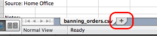


Now create columns for each variable: 


Now you could copy and paste the relevant information into each cell. This would be the manual way of going about it. But I thought for our final task we could learn some neat excel tricks. The power of excel really lies in using formulas. If you go on a job interview and they ask if you can use excel - this is usually what they mean. Have a look at questions 3, 4, 5, and 6 in these [top excel interview questions](https://www.deskbright.com/excel/excel-interview-questions/), 


So let's learn some formulas. For you to tell excel that you are writing a formula, you have to start typing with an `=`. For example, if you wanted to add numbers in some cells together, you would use the `SUM()` function, by typing `=SUM(` then highlighting the relevant cells, then typing a close bracket `)` to end your equation, and hitting enter. Like this: 

```{r, echo=FALSE}
if (knitr:::is_latex_output()) {
  knitr::asis_output('\\url{....}')
} else {
  knitr::include_graphics("imgs/sum_fun.gif")
}

```


Now, to copy over some values from one cell to the other, you simply use the `=` sign and name the cell you want to copy from. Cells are names by combining their column letter and row number. So the topmost left hand cell is A1. You can either type the name of the cell you want to copy from, or you can click on it. This is called a cell reference.  Cell references allow users to include the values of external cells in formulas dynamically — rather than hard-coding particular values manually. To copy from another sheet, simply select from that sheet. 


So in this case, let's start by copying over the first cell. You just click in the first column of the first row, type `=`, and then click to the other tab, and select the first value for club name, in this case *Arsenal*. Once you clicked on the cell, just press **Enter**.  Please note that you need to hit enter while still on the original sheet of data in order for it to fill the cells on your new sheet you are creating. If you type the =, go to the other sheet and click on the cell you want, then go back to the new sheet without having already hit enter, it will fill the cell with the wrong sheet's info. So instead of it being ='fbo-table-2'!A5 it will be =Sheet1!A5. 

```{r}
knitr::include_graphics("imgs/copy_over_sh.gif")
```


So excel makes our life easy, in that you can copy formatting from a cell to the one next to it, or the one under it, by clickin on the cell, and dragging the corner to the other cells, where we would like the formula copied to. 


So if we want to copy over the cells next to the one that said 'Arsenal', we don't need to go back to the first sheet. Like so: 

```{r}
knitr::include_graphics("imgs/drag_copy.gif")
```


Keep dragging until you get 0s as results. You don't want that, so you can drag back up, to make sure you're only copying data over, not empty cells. Now you want to copy over the league as well.
 
 
Click on the first row of the 'league' column, type `=` and go back to the first sheet and click on 'Premier League'. The same process as we did for copying over 'Arsenal' above. 


We can see that everything under the Premier League heading belongs to the Premier League. So the value for the 'league' variable is Premier league for all of these clubs. Therefore, we just need to replicate this for every one of these observations. 

Now there is another neat trick here. If you were to drag the cell to copy the formatting again, you would be copying the cells below, rather than replicating 'Premier League', it would start to copy the cells below. Like this: 

```{r}
knitr::include_graphics("imgs/wrong_copy.gif")
```

This is because excel adjusts the formatting for you to match what you are moving - you are using **relative cell references**. By default, Excel uses relative cell references, which change dynamically as they are copied and pasted around a sheet. For example, if a reference to cell A1 is copied and pasted one row down and one column to the right, the new reference will point to cell B2. This allows users to perform similar calculations on different ranges of cells quickly and easily. We made use of this function when copying over the club names and the associated number of banning orders. 

In contrast, **absolute cell references** do not change when they are copied and pasted to other locations within a sheet. Absolute cell references can be used on either rows, columns, or both at the same time, and are indicated using the \$ sign. For example, if a reference to cell \$A\$1 is copied and pasted one row down and one column to the right, the new reference will point to cell A1 — it won't change at all, because both the row and column are locked. If a reference to cell \$A1 is copied and pasted one row down and one column to the right, the new reference will point to cell A2 — only the row number will change, because the column letter is locked.


[Here is a quick video to explain the use of the \$ symbol](https://www.youtube.com/watch?v=b3i6AgMEssI)


So in this case, we want to put in two `$`s because you want it to fix both column and row. So click on the cell where it now says *Premier League* and you will see the formula appear in the formula bar. Click in the formula bar, and insert two `$`s to change the formula from `=banning_orders.csv!A4` to `=banning_orders.csv!$A$4`. 


Now try to drag the Premier League cell again, to copy its value for all these clubs. You will see that it will work this time. Exciting!


So now you repeat this by clicking in the next cell, and copying over all the data, filling in the blanks, until your data set looks something like this: 


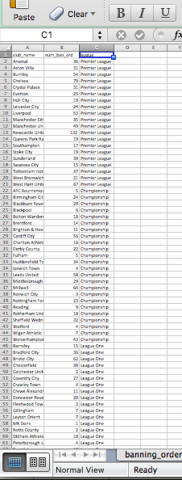


OK now we can answer questions like this one:

- *Which Club had the highest number of banning orders?*


Tip: if you don't want to go reading through them all and making sure that you didn't miss one with an even higher value, you can **sort** your data. To sort by a specific variable, click on the 'Data' tab, then on the little black downwards pointing triange next to the sort icon: 

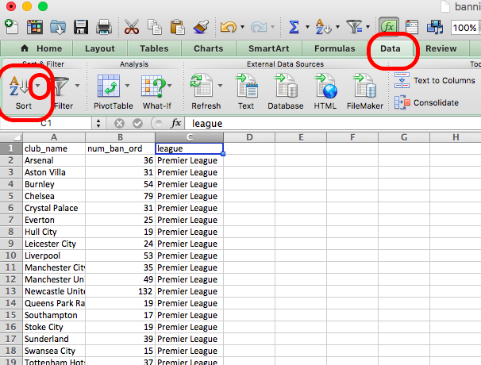


This will allow you to select how you want to sort your data. Select the 'Custom sort...' option. 


Now you can choose which variable you want to sort by: 


And you can also select if you want to sort in ascending (smallest to largest) or descending (largest to smallest) order: 


Ta-daa. This should reveal to you your result, something like this: 


Is Newcastle United a surprising result? Also which leagues would you expect at the top. We see a lot of 'Premier League' and 'Championship', but there is also a team fro 'League One' (Bristol City) and one from 'Football Conference3'. They appear to both be Bristol based teams. Is this interesting? Take a moment to discuss these results from this final task with someone. If you know anything about this raise your hand and tell me. I actually know nothing about football, so would be interested to hear any possible explanations for these results!

-->


## Summary


In sum, you should now be more familiar with data than you were when you started. And you should be comfortable with the following terms: 

- working directory
- data
- codebook/ data dictionary
- variable
- observation
- levels of measurement
  + nominal, ordinal, numeric
- unit of analysis

From your readings you should also be comfortable with: 

- reliability
- validity
- descriptive statistics
- inferential statistics


<!--chapter:end:002-week1.Rmd-->

# Week 2 {#week2}

## Learning outcomes

Today we are going to start summarising our variables in our data, in order to be able to start talking about them in a meaningful way, and begin to be able to tell a story with our data. Consider this [parliament research briefing on UK prison population statistics](http://researchbriefings.files.parliament.uk/documents/SN04334/SN04334.pdf). It looks at the number and make up of people in prison in the UK. To do this, it utilises data about people in prison, which you can imagine based on our experience with data last week as a spreadsheet with each individual row representing one individual prisoner. You can also imagine some columns that contain values that correspond to each prisoner, representing a set of variables recorded about him or her. But it would not be very informative to just print out this spreadsheet and hand it to you - or definitely not to hand it to policy makers who are busy, and most likely looking for a summary of headline figures, rather than rows and rows of data. If you did click on the link, you can see that it instead summarises the data in a way that people can read through, and draw meaningful conclusions from. 

By reading this report, you can come to know that, at 31st March 2017, the total prison population in England and Wales was just over 85,500. But going further, one of the variables in the data set is the person's gender. If we want to talk about this one variable - gender - in this data set - prison population - we can turn to univariate analysis of this variable. For example, we could count the number of men versus the number of women in prison. What do you think this will tell us? Do you think there will be equal number of men and women? If you've been paying attention in some of your other courses, you'll likely suspect that there are some gender differences in the prison population. So if it's not 50-50 men and women in prisons, then what do you think the split is like? Do you think it's 60-40? 70-30? 80-20?

Come on, take a guess, I'll hold off telling you. Speak to someone next to you. Discuss why you think it's the split that you think it is. I'll wait here. 

```{r, echo = FALSE}
knitr::include_graphics("imgs/oitnb_dance.gif")
```


Ready? OK I can tell you now. Actually, according to the count of prison population in September 2017, the number of men in prison in England and Wales is 82,312, while the number of women is 3,982 making the split about 95-5 ([see for yourself here](https://www.gov.uk/government/statistics/prison-population-figures-2017)). Are you surprised? I definitely was! I had no idea the difference was this large! You can often gain valuable insight into topics that you are interested in by looking into one variable - that is performing univariate analysis on your data. And this is what we will learn to do today. Excited? Yaaay

### Terms for today:

- Univariate analysis
- Frequency
- Bar charts
- Measures of central tendency
- Histograms
- Distributions
- Measures of variance


## Univariate analysis

So you want to analyse your variable. As you have likely pieced together by now, that  *uni*variate analysis simply just means - the analysis of *one* variable. I am giving you a sneek peak into next week's session now by telling you that *bi*variate analysis means that you are looking into the relationship between *two* variables...! And just you wait until we get to *multi*variate analysis which is the analysis of the relatioship between *more than two* variables!!!


So just remember - uni = one, bi = two, and multi = many. That's it, no need to count past two. We data analysts are very lazy people, you will begin to figure this out as we go. 


Right, now that we are confident with out terminology, let's think about what we can do, in order to carry out some univariate analysis. As mentioned, univariate analysis is the analysis of one variable. So we know that we want to be able to talk about *one* variable in our data set. For this we will need to select a variable we want to talk about. Often this will depend on the question being asked. So for example, if someone asked you the question "How many more men than women are in prison currently in England and Wales?" you can begin to think about the variable you will have to analyse - perhaps the variable of **gender**. But once you've picked your variable, how do you analyse it? That is what today will be about. 


### The importance of level of measurement


Well remember when we spoke about **levels of measurement** last week? We encountered it in the lab exercise, in the reading, and in the quiz as well. In case you need a refresher, it was the time when we looked at the different variables in terms of whether they were **nominal**, **ordinal**, or **numeric**. If it still doesn't ring a bell, go back to last week's lab and `ctrl + f` for these terms. But hopefully you will have retained some of this. Remember we can differentiate between numeric and categorical, and then categorical we can futher sub-divide into nominal and ordinal. Here's a beautiful and scientific drawing to illustrate: 


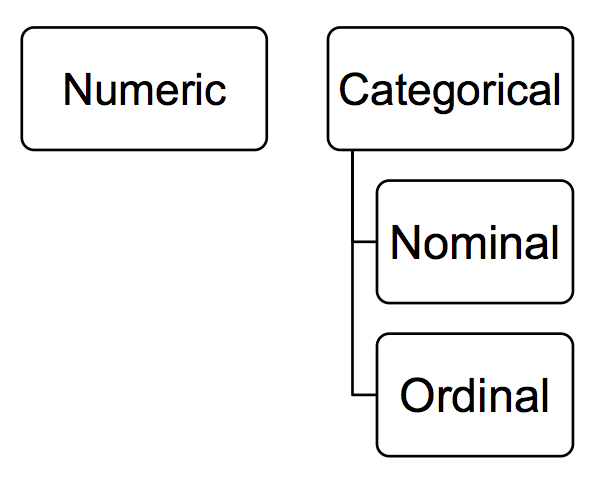


So why is this important? Well what level of measurement your variable falls into dictates what types of summaries are appropriate. Thinking back to the gender example, it would not make huge amount of sense to calculate the "average gender", would it? Gender is a nominal variable, and as so an appropriate way to summarise it is not to calculate an average (mean or median, but we will get into this a bit later). Instead there are other approaches you could take. For example you could look into the modal category - which value of the variable occurs the most frequently? For example, in the prison population data above, the modal category for gender was male, as this was the most frequently occuring value for this variable. It occurred exacly 82,312 times, since there were 82,312 men in the data set. The 'female' value for the gender variable only appeared 3,982 times, since that is how many women were observed. How do we find this out? Well in the simplest term we could count all the occurrences of each value in the data set. But remember what I said about analysts being lazy? We don't want to be going throgh spreadsheets line by line. Instead, we would look at the frequency of all the values the variable can take, in this case the frequency of the male and female values for gender. We could do this by something called a **frequency table**. Frequency tables are valid ways for summarising categorical variables, however they might not be appropriate for numeric variables, which are better suited to measures like **average** and **variance**. But now I'm just throwing words around.


```{r, echo = FALSE}
knitr::include_graphics("b99_hatewords.gif")
```


Hopefully these words sound familiar from your reading. But it might be that their meanings are not entirely clear just yet. That's fine. Let's do some exercises, and demistify these, so that we can get on to telling some interesting stories with our data!


## Summarising categorical data

### Activity 1: Crime types

<span style="color:#d95f02">
Let's start with some exercises in talking about categorical variables. We will do this by looking at crime data from 2016-2017 recorded by Greater Manchester Police, available for download from the [police.uk](police.uk) website. You don't have to go download this yourself though, because I have put the data on blackboard for you. So just go to blackboard, and the course content, and then downlod the file `gmp_crimes.csv` into your working directory. Once you have saved it, open the file using excel. 
</span>

```{r, echo=FALSE, warning=FALSE, message=FALSE}
library(tidyverse) 
library(lubridate)

gmp_crimes <- read.csv("https://www.dropbox.com/s/8tkpjwsmtqeddr9/gmp_crimes.csv?dl=1")

```


It should open up like this, with your **variable** names as column headers:


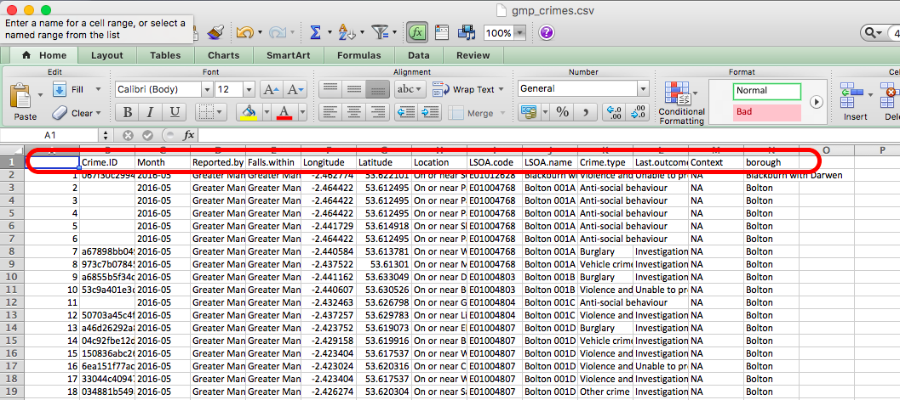


Under the column headers you have your `r I(nrow(gmp_crimes))` rows, one for each of the `r I(nrow(gmp_crimes))` crimes in your data. Recall that these are your **observarions**. Also, that therefore your **unit of analysis** in this data at this moment is each individual crime. 


Anyway let's say we want to talk about your variables. Like let's say that you want to talk about the variable **crime type**. 

<span style="color:#d95f02"> What level of measurement does this variable have? Is it a category? (hint: yes, it's in the 'Summarising categorical data' section, that sort of gives it away...) Does it have a meaningful order? Now this one is one to think about! What do you think? Is crime type nominal or ordinal variable? Do you think it has a meningful order? Take a moment to think about which one you think it is, and most importantly **why** you think this is the case. Turn to a friend, tell them which one you think it is and also why you think this. Then ask them what they think, as well as their reasoning behind this. Here's a gif to separate the answer, so you don't ruin the surprise before you have a chance to discuss. 
</span>


So did you decide that crime type is a nominal variable? If you did nice work! Indeed it would be very hard to find a meaningful order for the categories in there. You could order alphabetically, but remember that is not *meaningful*. You cannot agree what comes first in the same way that you would be able to for a scale of *strongly disagree* to *strongly agree*. Therefore it is nominal. This part also does matter, but we will return to why later. 


### Frequency tables


Okay so for now we want to find out about this variable. We know it's a categorical variable, so if you've done your reading you will now know that you want to be looking at a frequency table to describe it. A **frequency table** will tell you the number of times that each value that the variable can take appears in your data. In other words, the frequency! Since each row is a crime incident, every time a particular value appears in your data, it means that a crime that belongs to that crime category occurred. 


Here's an example of a frequency table. Let's say we have this data set of waiters and waitresses who work at Lil' Bits restaurant. Here is our data in table format:


You can see here again that every row represents one waiter or waitress. I've even put in a little picture of each of them, to make it more personal. You can see them all now, forming rows of your data. You can also see one column, for the one variable here, which is gender. For each person we only recorded their gender, because for now, that's all we are intersted in. We want to look at the gender of waiters and waitresses at Lil' Bits. Maybe we think that the manager is sexist and hires only females. Maybe we want to work out the likelihood of having a male waiter. Whatever our motivation, we just want to know!!! We want to know the number of men, and the number of women who work there. And it really is as simple as that - all we do is count the occurrence of each value of the variable, and then summarise that count in a table. In this case, we could the number of times that we record 'female' value for the gender variable, and then the number of crimes that we record 'male' value for the gender variable, and then we say that there are 3 females and 2 males in our data. That's it. That's a frequency table! You build it by simply counting the number of times each value is present in the data frame. Because if each row is an observation, then every time you see 'female' in the gender column accounts for one observation of this value - one female waitress. 


I've even made a gif to illustrate the process, something like this: 


I hope that illustrates the concept of what a frequency table is. It should be very easy for you to manually count the number of men and women working at the Lil Bits restaurant, as they only have 5 front of house staff apparently, making this a data set of 5 rows. However in real life you are unlikely to want to manually count each occurrence of each value the variable can take in your data. It definitely would not be a fun activity with the `r I(nrow(gmp_crimes))` rows in your GMP crimes data.

Luckily excel makes this much easier for us. 


### Creating a frequency table in Excel


Making a frequency table in excel is quite simple, and it is achieved by using something called a **pivot table**. As far as I know this name is specific to Excel. If you apply to public sector jobs, especially where excel is a requirement, the word pivot table is likely to come up in interview. It's a handy tool for summarising categorical data. A pivot table is a tool that lets you build different types of summary tables from your data. One of these is a frequency table. 

> PivotTables are a great way to summarize, analyze, explore, and present your data, and you can create them with just a few clicks. PivotTables are highly flexible and can be quickly adjusted depending on how you need to display your results.

- [The microsoft excel sales pitch](https://support.office.com/en-gb/article/Create-a-PivotTable-to-analyze-worksheet-data-a9a84538-bfe9-40a9-a8e9-f99134456576)


If you want to go a bit further in the pivot table knowledge, here's a handy list of [23 things you should know about pivot tables](https://exceljet.net/things-to-know-about-excel-pivot-tables). I like it because it's a list, and Buzzfeed has taught me that all information is best presented in list format, preferably with a random number of items in the list, like 23. We'll cover most of these items during the upcoming weeks.


### Activity 2: Looking at frequency

<span style="color:#d95f02">
So for now, we will now use a pivot table to create a frequency table of the crime type variable in the GMP crimes data.  To do this, go to your gmp_crimes data set, opened up in Excel. Download the data from BB, as we did last week. If it's not downloading for any reason stick up your hand, we can come around and trouble shoot this for you! Now once you have the data open in Excel,  you can easily create a frequency table following the below steps:


First you will have to select the pivot tabel option. Click into the **Insert** tab, click on **pivot table** and then again on **pivot table**:


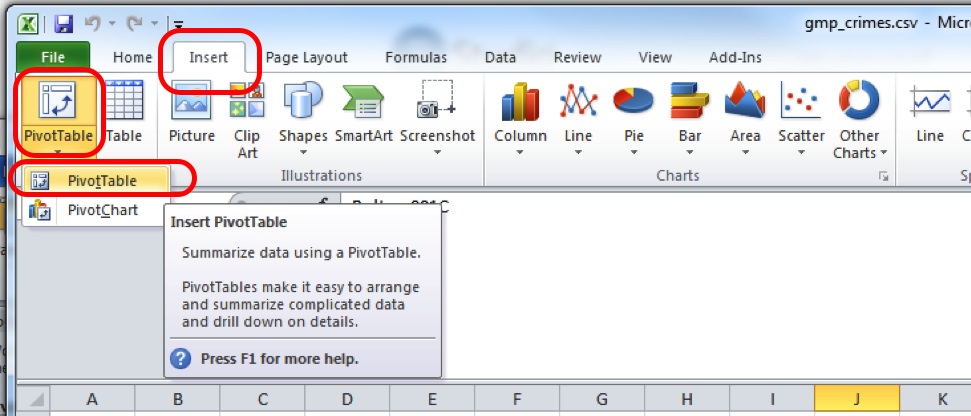


This will open a popup window, where you want to make sure that you select 'New worksheet' where it asks where your pivot table should be placed, and then click OK: 


Don't worry too much about the top option where you select your data, because the pivot table will let you select your variables retrospectively. But just make sure the 'Select table or range' option is selected, and not the 'use external data source one'. 


Now when you click OK, excel should take you to the new worksheet where it has set up a pivot table for you, ready to get into your data. 


It might also open a toolbar on the side, but it might not do this automatically. In any case, if the toolbar ever disappears, to summon it you have to do one simple step, which is to click *anywhere* inside the pivot tabe area: 


Once you do that, a navigation pane should appear. Just like this: 


<!--

Basically steal steps from [here](http://documents.routledge-interactive.s3.amazonaws.com/9780415628129/Chapter%2013%20-%20Data%20exploration%20with%20Excel%20-%20univariate%20analysis%20final_edited.pdf)

-->


Now you should see all your variables on the side there as well, in this little panel that has just appeared. 


You can scroll through and find crime type. This is the variable we want to look at in this case. 


You can see four windows within the pivot table panel. You've got **Filters**, **Columns**, **Rows**, and **Values**. You can drag your variables into these boxes in order to create a table. Whatever you drag into the Columns box becomes the columns, and whatever you drag into the Rows box becomes the Rows. Try it out, drag Crime type into the Rows box. You should see a list of all the possible values that the crime type variable can take in the rows. Now drag it over to columns box, and you'll see it across there. Drag it back to rows and leave it there:


While you see the list of possible crime types, there is no value next to it - it is not yet a frequency table. This is where you need the **Values** box on the pivot table toolbar. What you drag into there determines what values will be displayed. So now grab the "Crime type" label from the top again, and drag down, this time to the values box, like this: 


Now you will see that a new column appeared with the frequency values, letting you know the number of occurrences of each value. Or in other words - the number of crimes for each crime type in the yeat May 2016 - May 2017 in GMP region. Cool, no? Have a look at the resulting table. Which crime type is the most frequent? Which one is the least? Is this in line with what you were expecting? 


We can see that the most frequent crime type in the data set is 'Anti-social behaviour'. This makes anti-social behaviour **the modal category**. The mode is the most frequent score in our data set. It is possible for there to be more than one mode for the same distribution of data, (bi-modal, or multi-modal). It would be possible that there were the same number of crimes recorded in two crime type categories. But in this case, anti-social behaviour is the **mode**. It is the most frequently appearing value for the crime type variable. It is the most frequently occuring crime type. 


But how much of all crimes does 'Anti-social behaviour' account for? When we are talking about your variables, we normally want to give detail and context, so that we tell a comprehensive, and easy to understand story with our data. We can at this stage say that the most frequently occurring crime type (the mode) is anti-social behaviour, with 122,443 incidents recorded by GMP. But *how much* is that? Well we can introduce another column to our pivot table, that tells us more about the **proportion** of all crimes that each crime type accounts for. 


To do this, drag from the top, the variable Crime Type into the values box once more: 


You will see a third column appear, identical to the second one, with the frequencies. To turn this into percent values, click on the little downwards arrow on the yellow box of the value you just dragged into the values box: 


When you click on that downwards arrow a menu will appear. 


Click on the "Value Field Settings..." option, to open up a new menu window, where you can select what you want the column to display.


You can pick any of these, and it will turn your column of counts (you can see that the default is set to **Count**) to whatever it is that you selected. In this case, since we had a frequency table we are looking at the count of each one so leave this as it is. Instead click on the tab "Show Values As". 


Then click on the dropdown menu (initially it will say 'No Calculation'). Again you will see a variety of possible options to choose. Here we want to select "% of Grand Total". Don't worry about the other options for now, we will address those next week, when we make frequency tables with two variables. You can also rename the column using the 'Custom Name' Field. Here I change the name from 'Count of Crime.type2' to '% of all crimes'. As we discussed last week, it's always better to have descriptive and meaningful variable names. 


Then you click OK, and ta-daa a table appears, which tells you not only that the most frequently occurring crime type (the mode) is anti-social behaviour, with 122,443 incidents recorded by GMP, but also that this accounts for 29% of all crimes recorded in this time period. 
</span>


Interesting, no? Sometimes proportions can put things into perspective. So for example, if we look at total crime, we might imagine that it's a larger number than we had thought, and feel worried that perhaps there is more crime in Greater Manchester than we'd anticipated. However, if you have a look into what these crimes are, this may help interpret the data. Robbery for example can be a very traumatic event, and is one that makes people most fearful of crime. However you can see that volume-wise, it makes up just over 1 per cent of all crimes. So if robbery is what we are particularly concerned about, we can rest assured that this is not a frequent crime, all things considered. 


Does the frequency of any of these crime types surprise you? Is this what you expected? When we speak about recorded crime in such general terms, you have to consider that all these very diverse crime types are included in such an umbrella term. So if you begin to hear about an increase in crime, surely you should begin asking - increase in which crimes? An increase in burglaries is a very different thing from an increase in robberies, no? They would require different responses from the police for example, and have different effect on people's experiences of victimisation and fear of crime. Depending on which one is driving the increase would dictate whether we need more on-street foot patrols in robbery hotspots, or whether we need better burglar alarms. Therefore looking into the types of crime, and their frequencies, can lead to some very useful insight indeed. 


### Visualising a frequency table with bar charts


Bar charts are a simple way of visually presenting a frequency table. You will have definitely seen bar charts before. We will talk more about visualisation best practice in later weeks, but for now, have a quick glance at [this article](https://flowingdata.com/2015/08/31/bar-chart-baselines-start-at-zero/). 


In any case, bar charts represent your data by creating a bar for every category, and then varying the height of this bar to represent the frequency. Imagine our frequency table turned on its side!


Now imagine that the number of crimes was represented by a bar with a height that corresponds to the value in each cell. That is a bar chart. 

So in this case, a bar chart would look something like this: 


```{r, echo=FALSE}

gmp_crimes%>%
  group_by(Crime.type) %>%
  summarise(number.of.crimes=n())%>%
  arrange(-number.of.crimes) %>%
ggplot(., aes(x=Crime.type, y=number.of.crimes))+
  geom_bar(stat="identity") + 
  theme_bw() + 
  theme(axis.text.x = element_text(angle = 90, hjust = 1)) 
  
```


I hope that you can see the resemblance between the table on its side and the bar chart now! If unclear call us over, we'll explain! While it's easy to just move on the next step and insert a bar chart, it's important that you know what you are representing with it!


### Activity 3: Bar charts in Excel

OK so let's make our own bar chart in Excel. 
<span style="color:#d95f02"> Go back to your pivot table, that has the frequency of each crime type. Click anywhere in the table, to highlight it all. However you might not want all the values. You can see that on the last row we have a total column. If we're comparing the crime types against each other it might not make sense to also include a bar for the total. So you might want to highlight everything except the total bar:


When the whole pivot table is highlighted, click on the charts tab on the top menu if you are using a mac:


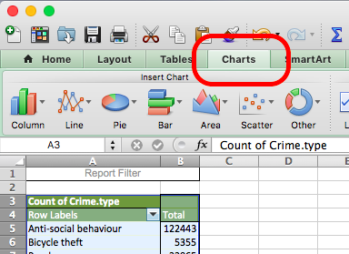


Or the "Insert" tab on a PC: 


Once you click on that you will see a whole menu of possible charts appear. Click on the one that says 'Column'. More options will appear. Choose 'Clustered Column'. 


On mac:


On PC: 


And that's it! Once you click on that, a chart will appear! Yay!


Now you can stylize your graph. First, you might want to arrange crime type in an order from most to least frequent, rather than alphabetical order. To do this, you must sort the data in the table. 


Highlight the values in the total column, and click the data tab. Click the little arrow next to the sort icon, and choose descending. 


</span>

Note, depending on the version of excel you have and if you use PC or Mac, it may say "smallest to largest" instead of ascending and "largest to smallest" instead of descending - but these mean the same thing!


You can also stylize your graph, to make it look the way you like. As I mentioned, we will go through some theory behind data visualisation, but if you want to spend some time making your graphs nice now, then below are some links you might find helpful: 

- [Here is some information on how to change the layout or style of your graph](https://support.office.com/en-gb/article/Change-the-layout-or-style-of-a-chart-a346e438-d22a-4540-aa87-bce9feb719cf). 
- [8 ways to make beautiful charts](http://www.upslide.net/blog/ways-to-make-beautiful-financial-charts-and-graphs-in-excel/)


## Summarising numeric data


So we saw that for categorical data the way we would carry out univariate analysis is to produce a frequency table, identify the modal category (the most frequent one), and we can visualise this with a bar graph. Nice. But what about numeric variables? I've thrown some words around, like average (mean) and median. Also spoke about the variation. In this section we will consider these numeric summaries for numeric variables, and also consider how we can go about visualising these as well. 


But first, to get some numeric data to summarise, let's make another pivot table, to create a new data set, that tells me the **number** of crimes per borough. To do this, let's create a new frequency table in excel, this time using the 'borough' variable. I will leave you on your own to do this. You can refer back up to the steps above which we followed to create the crime type frequency table. But instead of crime type, this time you want to count the frequency of crimes per borough. So in the end you should end up with a table where there are two columns, one for 'borough' and one for 'number of crimes'. 


Note that the column with the number of crimes in it might initially be labelled by your pivot table as something else, for example, it could be labelled as count of borough (as it counts the occurrence of each borough, and might not automatically realise that each row/ observation is one crime). So feel free to rename this column, by simply clicking in the cell, and writing "number of crimes". 


In this case, each row will be one borough. Your table will look like this: 


```{r, echo=FALSE}

per_borough_crimes <- gmp_crimes %>%
  group_by(borough) %>%
  summarise(number.of.crimes = n()) %>%
  arrange(-number.of.crimes)%>%
  filter(number.of.crimes > 100) 

per_borough_crimes %>%
  knitr::kable()

```


If you consider this frequency table your new data, you can see that you have two columns, which means two variables. You have one variabe for the name of each borough. And you have another one, that is the *number of crimes*. While the borough name is a nominal variable, the *number* of crimes is... 

... 

...

...

... numeric! Yay! 


So how do we talk about a numeric variable. You can imagine why a frequency table doesn't quite make sense.  A numeric variable can take any form between two limits, the *minimum* value and the *maximum* value. Because they don't map neatly into a few categories like categorical variables, it is likely that most of them would have a frequency value of 1. And that is not very interesting. 


Dont believe me? You can give it a try. Make a frequency table of a numeric variable, and nothing exciting will happen. See:


```{r, echo=FALSE}

per_borough_crimes %>%
  group_by(number.of.crimes) %>%
  summarise(frequency = n()) %>%
  knitr::kable()

```


The frequency of each **number** of crimes is one. It is unlikely that two boroughs will have exactly the same number of crimes. So it doesn't make sense to think about numeric variables this way. 


**Important note** If you are not sure *why* this is the case, or if anything about the above is confusing, *raise your hand now*. Ask us to explain this. It's not as complicated as it might sound at first, but it's important that you understand what happens. 


Right, so what's a better way to summarise numeric data? It is easier to summarise them by looking at their **measures of central tendencies**. This is what we'll get into in the next section.


### Measures of central tendency


You will often hear numeric variables summarised by the measure of central tendency. These are the **mean** and the **median**. You will have encountered the mean before, but possible referred to as the **average**. In statistical language you will hear people talk about *the mean number of crimes per borough is `r I(as.character(mean(per_borough_crimes$number.of.crimes)))` crimes*. This is the exact same thing as talking about the average number of crimes per borough is `r I(as.character(mean(per_borough_crimes$number.of.crimes)))` crimes. And you would calculate it the same exact same way. 


To calculate the mean, you add up all your observations, and then divide by the number of observations that you have. 


So let's do this for our number of crimes per borough. We have 10 boroughs in total. You know this because you see that there are 10 rows. Or you might just know that [Greater Manchester is made up of 10 metropolitan boroughs](https://www.britannica.com/place/Greater-Manchester). In any case, you know that there are a total of 10 observations. You can denote the **n**umber of observations with `n`. So in this case, we know that `n=10`. 


What is the total number of crimes? Well it's the sum of the number.of.crimes column. The total number of crimes is the sum of the crimes for each borough. In this case, the total number is: 


`22587 + 24588 + 33115 + 34506 + 34619 + 35122 + 37073 + 40058 + 40751 + 117663 `


This number incidentally is `r I(sum(per_borough_crimes$number.of.crimes))`. So how do we get the mean? As I said above, and as your readings mention, you take the sum of all the values, and you divide by the number of observations. 


You can say:


`sum(values)/n`


or in this case


`(22587 + 24588 + 33115 + 34506 + 34619 + 35122 + 37073 + 40058 + 40751 + 117663)/10`


which is 


`420082/10`


which is


`42008.2`.


So what is the mean number of crimes per borough? You guessed it, the mean number of crimes per borough is 42,008.2. That means that on average, there are about 42,000 crimes per borough. And this measure is the mean. 


Is this a good way of describing your data? Well one way to think about it is to consider how much you distort the data if you use that measurement to talk about it. Normally when we think about average, we think that this is a measure that represents a value somewhere in the middle. But if we look at this value, *42,008.2*, we see that actually this number is higher than almost all the boroughs. There is only one borough with a number of crimes that is higher than the average. All the other boroughs have below average crime rates. Why do you think this is?


If you have done your readings, then you will know that this is caused by something called an **outlier**. An outlier is an observation that lies an abnormal distance from other values in a random sample from a population. In a sense, this definition leaves it up to the analyst (or a consensus process) to decide what will be considered abnormal. In the most basic sense, an outlier can be an abnormally high or abnormally low number of crimes per borough, when you compare it to the other boroughs. In this case, we can see that `r I(per_borough_crimes %>% arrange(-number.of.crimes) %>% head(n = 1) %>% select(borough))` borough has far more crimes than any borough, with `r I(per_borough_crimes %>% arrange(-number.of.crimes) %>% head(n = 1) %>% select(number.of.crimes))` crimes. This can be considered an **outlier**. We will talk more later about how you can determine whether you have outliers in your data. 


But take a moment here to think about why `r I(per_borough_crimes %>% arrange(-number.of.crimes) %>% head(n = 1) %>% select(borough))` borough might be such an outlier. It might help to look at where it is on a map, and what sorts of areas fall within this borough, comparet with some of the other ones, such as `r I(per_borough_crimes %>% arrange(-number.of.crimes) %>% tail(n = 1) %>% select(borough))` for example, which has the lowest number of crimes. 


Any thoughts? Turn to the person next to you and have a chat about why you think that we are seeing such a large number of crimes in this borough compared to the other ones. 


Now that you've had this discussion, let's get back to the problem at hand. One of the issues with outliers is that they can skew your results. In this case, our **outlier** borough, `r I(per_borough_crimes %>% arrange(-number.of.crimes) %>% head(n = 1) %>% select(borough))` borough has had a major effect on our **mean**. Because we include all the observations, and then divide by total number, we are essentially assuming an even distribution of crimes in each borough. When we say, that the **mean** number of crimes per borough is 42,000 crimes, we are saying that if you distributed these crimes equally, then that is how many you would get in each borough. But we can clearly see that the number of crimes are not distributed equally between boroughs, and therefore talking about the **mean** number of crimes might not be the best ways to summarise the data. 


Luckily, this section is called **measured of central tendency** rather than **the mean** section, because we have other options. The other measure of central tendency, used to summarise numeric variables is something called **the median**. The median is the middle point of your data. It represents the value where, if you arrange your data, sorting by your numeric variable from smallest to largest, this value splits the data exactly in half. So 50% of your data has values for the numeric variable in question greater than this value, and 50% has values that are smaller than this value. This is the value that is right smack in the middle! 


How do you calculate the median? Well, one approach is to write the numbers in order, from smallest to largest. Then, to find the median number:

- If there is an odd number of results, the median is the middle number.
- If there is an even number of results, the median will be the mean of the two central numbers.


If you only have a few numbers, then this is feasible. Let's try this for our number of crimes per borough again. Let's line them all up: 


`22587, 24588, 33115, 34506, 34619, 35122, 37073, 40058, 40751, 117663`


So, we have them in order. First question: are there an even or an odd number of values? Well, those of us with razor-sharp memories will remember that when we were calculating the mean, we already counted the number of values, and found a result of `n=10`. Those who don't remember this, count the number above. Are there 10? I hope so!


So is 10 an odd or an even number? (hint: it's even). Because of this, we know that the median will be the mean of the two central numbers. Which are the central numbers? Well, count in 5 from the start and 5 from the end of that row, and you will identify our two middle numbers (why 5? Well if you divide 10 by 2, to get to it's middle...!)


Great, now we are almost there! We have identified the two middle numbers as 34,619 and 35,122. So how do we get the mean? Scroll up if you're not sure!


If you are sure, quick calculate it. 


I'll calculate too:


`34,619 + 35,122 =` `r I(as.character(sum(34619 + 35122)))`


`r I(as.character(sum(34619 + 35122)))` `/2=` `r I(as.character(sum(34619 + 35122)/2))`


Woohoo! The mean of the middle two numbers, which is the median is `r I(as.character(sum(34619 + 35122)/2))`. And this gives us our second measure of central tendency. We can see that this number is actually quite far off from our mean number of crimes per borough. This means that our data is **skewed** by our outlier! When our data is **not skewed** our mean and our median should be the *same value*. The more different they are, the greater the skew in our data! We will talk about skew and things like the normal distribution a bit later, and more in your next term, but you should have a basic understanding of the difference between the mean and the median, and what this difference means, and when each one is appropriate to use. 


If you are confused about any of this just now then let us know by raising your hand, and asking one of us to clarify. But first, watch [this video by Chris Wilde](https://www.youtube.com/watch?v=U3lk2nQYfAQ&amp=&list=PL8CRAVedURQrlxeFfme0TEgaj1_h67JUR&amp=&index=4) to explain this to you using some pretty nifty visual aids. You can skip ahead and start from 2:41 if you wish. Now ask away. We are here to help!


### Activity 4: Mean and median in excel


Now that you understand how the mean and median are calculated, what they reprepsent, and what situations are best to each one of them in, let's move on to the practicalities of how you calculate these in excel. Of course, I keep telling you we are lazy, and we don't want to be calculating things by hand. This is why we use Excel. So here's a quick guide to getting the mean and the median in Excel. It's easy, but we'll be using **formulas** again, like last week. 

<span style="color:#d95f02">

You'll recall, you can set a cell value to a formula by starting what you write in there with `=`. 


The formula for calulcating the mean (which is the statistical term for the average) is simply:


`=average()`


Inside the brackets  you have to enter *what* it is that you want to calulate the average of. Remember, you can either type in the cells you want to include manually, or you can highlight by clicking on them, and then hitting Enter. 

So choose a cell where you would like your average value to appear. Type `=AVERAGE(` and then select the cells which you want to include in the calculations (both lower case and all caps work for this, exel likes to shout at you, so it will translate to all caps, but it will understand even if you type `=average(`. This should be the value for number of crimes for each borough. Take care to *not* select the grand total in your calulcations. Then close the bracket by typing `)` and hit enter. The value that appears is the **mean** number of crimes for the 10 boroughs of Greater Manchester:


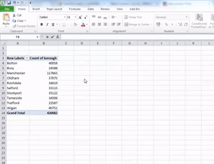


Now Excel is helpful in naming its functions, and the function to calculate the median is called... 

...


...


... yes you guessed it, it's `=MEDIAN()`


Easy to remember right. So to calculate the median, follow the same steps that you did for calculating the average, but with the median function. The result you get should look familiar from our manual calculation. We did the manual calculation so that you understand exactly how we reach this number. But from now on, you can use Excel's formulas to do all this hard work for you. Laziness prevails!

</span>

Measures of central tendency can be useful when we want to talk about our data in a single number. Sometimes it can be helpful to know what the average number of crimes are, or the average numer of arrests per police force, or the average age of offenders, or the average height for basketball players. These can tell us very qick reference values, which we can use to describe our data. It is much more meaningful to tell someone that the average height of basketball players is 200cm, than to list all the heights of every person who has ever played for the NBA. But the using a single number to summarise your data can also hide important information. Remember the white rainbow, from the Tiger that Isn't. If you don't, then go read this chapter from your reading. It's actually a fun read, and also you will understand what I mean. The next section shows you another, current example of what sort of interesting information can be hidden by focusing only on the measures of central tendency. 


### Distributions

> Al Gore's new documentary is divisive. “An Inconvenient Sequel” is among the most controversial and polarizing titles of the year. Because of the politics surrounding Gore and climate change, the film divides men and women, critics and fans, and even people who saw the movie and people who are just rating it. But the movie’s aggregate rating hides many of those divisions, giving us a perfect case study for understanding a big weakness of online rating systems: separating the controversial from the mediocre. That weakness could discourage ambitious-but-controversial work.

The above is from an [article from the website fivethirttyeight](https://fivethirtyeight.com/features/al-gores-new-movie-exposes-the-big-flaw-in-online-movie-ratings/). It points out that the average IMDB rating for this film, which is 5.2, actually masks what is interesting about this film - the extent to which it polarizes people. 


We spoke about the measures of central tendencies above, and how they can be effective summaries of data, but can also mask some important information. This is a good example of that. Let's consider 6 films from 2017 which all have an IMDB rating of 5.2. This means that the average of all the ratings from all the people who have seen the film, and then scored it on IMDB. These are: 

- xXx: Return of Xander Cage
- Voice from the Stone
- Once Upon a Time in Venice
- Phoenix Forgotten
- Vengeance: A Love Story
- An Inconvenient Sequel: Truth to Power


If we only know the average score on IMDB for these movies, we would believe that they perform similarly. However we want to look at the distribution of scores as well. And that is what the guys at fivethirtyeight did. Have a look at these bar charts that demonstrate the number of people who gave each star rating to each film: 


You can see that for the other 5 films, the ratings follow what is essentially a normal distribution (we will return to what a "normal distribution" is later). People seem to agree on these films. Very few people think that *xXx: Return of Xander Cage* is a terrible movie, meriting a score of 1 or 2, but also very few people thing that it's great, worthy of a 9 or a 10. Instead, most people think that it's a mediocre film, and give it a 5 or a 6 out of 10. This pattern is reflected in all the other films, **with the exception of Al Gore's film**. What's going on there? Well it appears that people either love it, giving it a score of 10, or they absolutely hate it, giving it a score of 1. Because of this, when all the scores are added up and divided by the total number of people who have rated the film, we get a value in the middle, 5.2, just like we did for *xXx: Return of Xander Cage*. Except while most viewiers agree that film is mediocre, most people are **not** evaluating *An Inconvenient Sequel: Truth to Power* as mediocre. In fact we see that most people are saying it's great or it's terrible. And this is why distribution also matters. 


What you are seeing in the histograms above are the **distributions** of the scores that are given to each film on the IMDB website. 


It is possible to have a look at the distribution of the number of crimes per borough as well, using a histogram. 


```{r, echo=FALSE, warning=FALSE, message=FALSE}

per_borough_crimes %>%
  arrange(-number.of.crimes)%>%
  ggplot(., aes(x=number.of.crimes)) +
    geom_histogram() +
  theme_bw() +
    theme(axis.text.x = element_text(angle = 90, hjust = 1))

```


So you can see here that the majority of boroughs are clustered on the left side of the graph, with the smaller number of crimes, you can see between over 22,000 and under 40,751 crimes. The position of each bar on the x axis (the horizontal axis) tells you the values we are looking at, and the height tells you how many observations fall into each value. 


### Histograms


This graph is called a **histogram**. While it may at first glance resemble a bar chart, it actually isn't one. If it does't quite make sense, have a look at 
[this interactive essay on histograms](http://tinlizzie.org/histograms/). Even if you are very confident with histograms, I would recomment that you take time to go through this interactive tutorial. It gives you a really great, hands-on experience in building one. The [Chris Wild video I linked earlier](https://www.youtube.com/watch?v=U3lk2nQYfAQ&amp=&list=PL8CRAVedURQrlxeFfme0TEgaj1_h67JUR&amp=&index=4) also shows you about histograms. They are excellent for plotting the dirstribution of numeric data. But how do they work? Well I am really hoping that you have gone through the video and the tutorial, but I will also just to reinforce your learning, explain here. 


Let's say we have some numeric data. We know already that we can't put it into categories, that's why we can't build a frequency table. Every entry would only appear the once. But what we *can* do, is create **bins** for our numeric data to fall into. Think of your numeric variable along the horizontal x-axis. Something like this: 


Now let's say we have some data on the number of chocolate bars that I ate each day last week. Now I'm not great at collecting data, so I only have data for 3 days: Monday, Wednesday, and Friday. This is my data:


```{r, echo=FALSE}
df <- data.frame(day = c("Monday", "Wednesday", "Friday"), 
                 num_choco_bars = c(2, 3, 8))

df %>%
  knitr::kable()

```


Let's say I'm interested in my *numeric* variable here, the number of chocolate bars. I don't care about which days I ate how many on, I just want to carry out some *uni*variate analysis on the numeric variable of number of chocolate bars. I want to look at the distribution of the numbers. I want to plot this. As I mentioned above, if I wanted to plot this data on a histogram, I need to first split my data into **bins**. What are **bins**? **Bins** are the result of the action of "bining" the range of values. That is, you divide the entire range of values into a series of intervals. So for example, we can decide to bin our values into groups of fives. Something like this: 


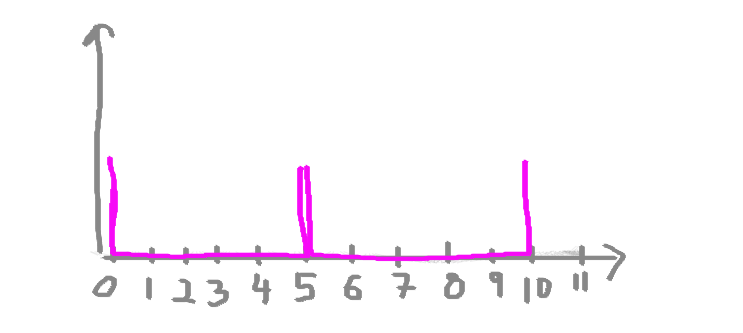


All that means is that if you look at those purple bins there, any value between 0-5 will fall in the first one, and any value between 5-10 will fall in the next one, and so on and so on. The bins are usually specified as consecutive, non-overlapping intervals of a variable.

And that's all there is to it. Once you have your bins, you just count how many values fall into each interval. 


So if I were to draw this historgam for my chocolate consumption data, then if I start with Monday, I can see I had 2 chocolate bars, and therefore I would add one value (one observation) to the 0-5 bin. Like this: 


Then I look at Wednesday, and I see that I had 3 chocolate bars, adding another value to the bin that catches values between 0-5. Like so: 


And finally, with great shame I look at Friday, when I put away 8 whole chocolate bars, and realise that I have to add a value to the next bin, the one that catched values anywhere between 5-10. As such: 


And that is exactly how you build a histogram. You could draw one by hand if you wanted to, building it up one by one. 


So now, looking back at the crimes per borough histogram, does it make more sense?


```{r, echo=FALSE, warning=FALSE, message=FALSE}

per_borough_crimes %>%
  arrange(-number.of.crimes)%>%
  ggplot(., aes(x=number.of.crimes)) +
    geom_histogram() +
    theme(axis.text.x = element_text(angle = 90, hjust = 1))

```


If it does, then that is excellent, and you can move on now. If it does **not** then please raise your hand, and we will come around and try to clarify this for you. But also make sure that before you do this you also go through the resources above, especially [the interactive essay](http://tinlizzie.org/histograms/). 


So looking back up at our crimes per borough histogram, you can now see that the majority of observations fall between some values relatively close together, but there is one observation that has a very high crime score. This is what we discussed earlier, when we were talking about **outliers**. No surprises there. But what is interesting now, is that you can **see the distribution** of your data, and you can see exactly how far this outlier sits. Just like the distribution of the IMDB scores for the Al Gore movie, a histogram of the number of crimes per borough also tells a story. 


### Activity 5: Histograms in Excel

So how do you build a histogram? Of course I won't make you draw one manually, every time you need to build one, so let's get to excel and make our own. This time it's slightly different than just inserting a bar chart. Remeber that bar charts represent the frequency of a categorical variable. Building one for a numeric variable, such as number of crimes, would not make sense. If you are unsure why, look back at our frequency table for the number of crimes variable. All the frequencies are 1. So your bars would all be the same height, and we would be none the wiser about any distribution. One important feature of numeric variables is that **the distance between numbers is meaningful**. Right? Remember this from the definitions for levels of measurement? So that is why we know how far for example 117,663 is from 40,751, and how much farther it is than 40,751 is from the next number in our data, 40,058. A histogram will display this for you. 

<span style="color:#d95f02">
So to build a histogram in Excel, you will have to have your data, and you also have to have an idea of the **bins** that you want. How do you decide this? Well this is again one of those things where the answer is that *it depends* on your data. What are meaningful bins? What are interesting sizes to group the numeric data into? For example, in this case, would it make sense for a bin width of 10 crimes? If we used a bin width of 10, we would see something like this: 


```{r, echo=FALSE, warning=FALSE, message=FALSE}

per_borough_crimes %>%
  arrange(-number.of.crimes)%>%
  ggplot(., aes(x=number.of.crimes)) +
    geom_histogram(binwidth = 10) +
  theme_bw() + 
    theme(axis.text.x = element_text(angle = 90, hjust = 1))

```


This is not great, because if we split everything into 10s, we are unlikely to have more than borough fall within that range. We are dealing with quite high numbers, right? We are dealing with tens of thousands of crimes, rather than tens of crimes. So perhaps a more meaningful bin width would be 10,000. Let's try that: 


```{r, echo=FALSE, warning=FALSE, message=FALSE}

per_borough_crimes %>%
  arrange(-number.of.crimes)%>%
  ggplot(., aes(x=number.of.crimes)) +
    geom_histogram(binwidth = 10000) +
  theme_bw() + 
    theme(axis.text.x = element_text(angle = 90, hjust = 1))

```


Now that's more like it! We can see here, that most of the boroughs fall into the bins that collect boroughs with crimes between 20,000 - 50,000, with our outlier borough of central manchester far away on the right there. Your bin width will always be related to your unit of measurement. If we were talking about numer of crimes a day, this would be a very different story, becuase we'll have smaller numbers. 


So why do we need to decide bin width? Why don't we let the software decide for us? Well because this should be a decition made by you, the analyst. It will depend on how much variety you want to show, or how much you want to group your observations together. For example, with a smaller bin width of 5000 crimes, we can separate out the lower crime boroughs, and see smaller deviations as well.

```{r, echo=FALSE, warning=FALSE, message=FALSE}

per_borough_crimes %>%
  arrange(-number.of.crimes)%>%
  ggplot(., aes(x=number.of.crimes)) +
    geom_histogram(binwidth = 5000) +
  theme_bw() + 
    theme(axis.text.x = element_text(angle = 90, hjust = 1))

```


There is no wrong answer here, but you want to choose a bin width that will make a histogram that will best protray the story you want to tell with your data. 


So once you've decided on your bin width, you have to tell excel what you would like this to be. You can to this by creating a new column, called bin, and putting your bins in there. So let's pick 10,000 for this example. In this case you would enter the bins like this: 


The other thing you will need, besides to decide on some bins, is to use the data analysis toolpak. You will have installed this in the lab session last week. If you didn't, then refer back to the notes for last week on how to do this. 


If you have the data analysis toolpak installed, then go back to your pivot table of number of crimes per borough, and select the "Data" tab. Then click on the "Data Analysis" icon at the top right: 


[](imgs/dat_loc.png)


Click on that and from the pop-up window select "Histogram". Then click "OK":


In the window that pops up, you have to populate the `Input range` and the `Bin range` fields with the relevant cells. Input range refers to your data. For this, click in the box my input range, and then select the cells that contain your numeric data. When you're done, hit enter. 


Then do the same for the bin range, but select the bin range variables:


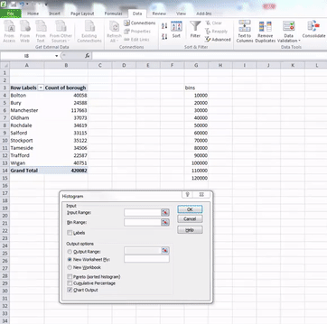


Once you have filled these fields, also click the tick-box next to the `Chart output` option. When this is ticked as well, just click "OK". Your histogram is now ready, and should appear in a new sheet on your excel workbook: 


</span>

Right, so now we know how to get a feel for the distribution from looking at a histogram of our numeric variable. We have also begun to think about outliers, and what they might look like. But how do we actually talk about distribution? We can put numbers to mean and median, but how do we quantify distribution? The next sections will teach you this. 


<!--
Let’s think a bit about this graphic. Does this look as you expected? This is what we call a skewed distribution. It shows the distribution of values for homicide across all the countries. It is a highly skewed distribution that has a few very extreme values, what we call outliers (more on this next).  
Histograms use equal-length bins. Looking at the spread of the values in the horizontal axis and the horizontal length of the bars, perhaps we could guess each bin measures individuals in piles of 10 values (0 to 10, 11 to 20, etc). 

Most countries fall within the first bin, within the group that have (roughly) 0 to 10 homicides per 100,000 inhabitants. That hump in the distribution correspond to the mode. Distributions are said to be unimodal if you only see (like here) one such hump and multimodal if you see various. On the other hand distributions that don’t appear to have any clear humps, any mode, and in which all the bars are about the same are called uniform. Remember to use this terminology when describing histograms you produce as part of homework or the essay.

 
If we look at the other end of the X axis we will see that there is only a minority of countries that have around 100 homicides per 100,000 inhabitants. So few, in fact, that the height of the bars for those cases (even when grouped in bins) is almost imperceptible in this graphical display. 
The (usually) thinner ends of a distribution are called tails. If one tail stretches out farther than the other, the histogram is said to be skewed. The distribution we see for homicide is said to be positively skewed, it has a long tail to the right (that goes all the way to 100 homicides) but with very few countries at the end of this long tail. When the right tail of the distribution is longer and the mass of the values is concentrated in the left we say that we have positive skew (or right-skewed). When it is the other way around we say we have negative skew. 
 
There may be some countries where there are many homicides (up to nearly a 100 per 100,000 inhabitants), but there are very few of them, so few the graphic does a poor job at showing them. We call these observations with extreme values outliers. If you happen to have a few observations with some very extreme values in the distribution you may end up with graphics such as this. 
Count variables (variables that count the number of things that something has happened) or variables with rates of certain phenomena very often have skewed distributions. In criminology we often work with count variables and with rates. We are interested in understanding variation in things such as the number of crimes committed, number of ecstasy pills somebody consumes in a night out, numbers of crimes in a given neighbourhood, etc. Thus, we often have to learn to live with highly skewed distributions and, more critically, learn how to analyse this type of variables. 
Just a final point, as with tables it is important that you label and title your graphics correctly and follow a number of basic conventions. The charts you use should:
•	be self-explanatory, 
•	avoid 3-D graphics (they confuse, are unnecessary and rather tacky), 
•	the text in the labels and title ought to precisely define what each number represented by the graphical elements of the chart means, 
•	avoid redundant and unnecessary text, 
•	and be consistent (across many charts use similar fonts, colours, formatting). 
You may find Chapter 6 of Gary Klass Just Plain Data Analysis a source of inspiration for good graphic design. Check this out too on why data look better naked.

-->


### Five-number summary

Histograms begin to tell you about the **spread** of your data. That is - how are your data points scattered around your measures of central tendency - your mean and your median. But sometimes you want to put numbers to these measures. There are certain numbers you can use to begin to talk about the **spread** of your data. These are together called a five-number summary. So what are these 5 numbers? They are: 

- The minimum value
- The maximum value
- The first quartile
- The third quartile
- The median


Some of these we've covered. The median we just discussed. To recap - The median provides a model for thinking about what a typical value is. The median is literally the value in the middle. If you rank the boroughs from the one with the lowest number of crimes to the one with the highest, the median would be given by the value of crimes in a borough right in the middle of this rank. About 50% of the boroughs would have a crime count higher than this value given by the median and about half would have a lower crime count. Thus, the median is also defined as the 50% percentile.

The minimum and the maxiumum value we touched on last week. These are the smallest number and the largest number in your set of data. So going back to our number of crimes per borouch, the minimum value is the lowest number of crimes per borough (`r I(per_borough_crimes %>% arrange(-number.of.crimes) %>% tail(n = 1) %>% select(number.of.crimes))`), and the maximum value is the highest number of crimes per borough (`r I(per_borough_crimes %>% arrange(-number.of.crimes) %>% tail(n = 1) %>% select(number.of.crimes))`). 


One simple way of characterising how much data values vary is to look at the **range**. The **range** is the difference between the lowest and the highest data value in the distribution. In the table above we can see that the lowest value is (`r I(per_borough_crimes %>% arrange(-number.of.crimes) %>% tail(n = 1) %>% select(number.of.crimes))`), and the maximum value is the highest number of crimes per borough (`r I(per_borough_crimes %>% arrange(-number.of.crimes) %>% tail(n = 1) %>% select(number.of.crimes))`). There are 0 countries with a value lower than `r I(per_borough_crimes %>% arrange(-number.of.crimes) %>% tail(n = 1) %>% select(number.of.crimes))` and 100% of the countries have a value lower than `r I(per_borough_crimes %>% arrange(-number.of.crimes) %>% head(n = 1) %>% select(number.of.crimes))`. The range for the number of crimes is then `r I(per_borough_crimes %>% arrange(-number.of.crimes) %>% head(n = 1) %>% select(number.of.crimes) - per_borough_crimes %>% arrange(-number.of.crimes) %>% tail(n = 1) %>% select(number.of.crimes))`. Because `117,663 - 22,587 = 95,076`. 


The **range** has the disadvantage that a single extreme value can make it very large, giving a value that doesn’t represent the data overall. In these situations a better way to describe spread of a variable might be to ignore the extremes and concentrate in the middle of the data. We could look at the range of the middle half of the data. 


How do you do that? Put all boroughs in a long line ordered by the number of crimes. Then divide the cue in half at the median. Now divide those halves in half again, cutting the data into four quarters. We call these new dividing points quartiles. Just how the median divides your data into the bottom 50% and the top 50%, the quartiles divide your data into the top 25%, the top 50%, the top 75%, and the bottom 25%. Imagine that your median divided your data into two new data sets. The medians of these two new data sets are your quartiles. As always, the clue is in the name. *Quart*iles divide your data into *quarters*. What does this look like?


Well for a moment consider our data of number of crimes per borough. Let's plot this. Here, every point represents the number of crimes in that borogh. They are ordered by number of crimes, from least to most. 


```{r, echo=FALSE}

ggplot(per_borough_crimes, aes(x = reorder(borough, number.of.crimes), y=number.of.crimes)) + 
  geom_point() + 
  theme_bw() +
  xlab("")

```


We can easily identify the minimum and the maximum values, right?

And we can also quite easily draw the median:


Now the quartiles are just the medians for the two halves of the data (which were created by splitting it in half with the median). Like so: 


One quarter of the data lies below the lower quartile, and one quarter of the data lies above the upper quartile, so half the data lies between them. The quartiles border the middle half of the data. The difference between the lower and the upper quartile tells us how much territory the middle half of the data covers and is called the interquartile range (IQR). The lower quartile is also called the 25th percentile, 25% of the cases lies below it, and the upper quartile is also called the 75th percentile, 75% of the cases lies below it. The 1st quartile is also called the lower quartile, and the 3rd quartile is also called the upper quarile. So we are sometimes just saying different names for the same thing. The 0th quartile = the minimum value (although actually no one says 0th quartile...) 1st quartile = the lower quartile, the 2rd quartile = the mediad, the 3rd quartile is the upper quartile, and the 4th quartile is the maximum. 


In the table with our numerical results we saw the lower quartile for number of crimes (or the 25th percentile) is 33,463 (25% of the boroughs have less crimes than that) and the upper quartile (or 75% percentile) was 39,312 (about 25% of the countries have more crimes than that). The interquartile range then is `r I(39312-33463)` (`upper quartile - lower quartile = 39312-33463 = ``r I(39312-33463)`).


Because the interquartile range is excluding everybody with the lowest and the highest values in the distribution (we are only looking at the difference between the lower and the upper quartile) is a measure of spread that is less sensitive to outliers (extreme atypical very high or very low values). 


You will notice that some authors talk about the 5-number summary of a distribution. The 5-number summary for crimes per borough would be:


- The minimum value: 22,587
- The maximum value: 117,663
- The first quartile: 33463
- The third quartile: 39,312
- The median: `r I(median(per_borough_crimes$number.of.crimes))`


These numbers are useful because you can begin to get a feel for your data, not just in terms of a single number summary, such as the mean or median number of crimes in a neighbourhood, but you can begin to describe the spread of the data, and think about what that means. Earlier I asked you to discuss with a partner about why you think that Manchester borough is so far away from the others in terms of numbers of crimes. I hope that your discussion had to do with populations, and that the city centre is contained there, with it's central shopping areas, which can act as crime attractors and generators (if you are not sure what crime attractors/ generators are, I suggest you take some tyime to learn about them [here](http://www.popcenter.org/learning/60steps/index.cfm?stepNum=17)). As well as major transport hubs, and many many people passing through. This is all interesting to know, but not something that would show up, if you were just considering the average number of crimes per borough. 

### Activity 6: Calculate quartiles

To calculate the quartile in excel, you can use the `=QUARTILE()` function. Take a moment and read about how this works [here](https://support.office.com/en-gb/article/QUARTILE-function-93cf8f62-60cd-4fdb-8a92-8451041e1a2a). 


The idea behind this formula is that inside the brackets you have to specify two things. First you have to specity the range from which to calculate. You can specify this by using the drag and drop method, or you can type it out. The other value you have to specify is the one that tells excel which quartile you want. There are, 5 possible values, from 0 to 4. You can see what each number corresponds to in the above link. For example, 0 means the minimum value, and 4 is the maxiumum value. Let's here type 1, to return the value for the first quartile: 


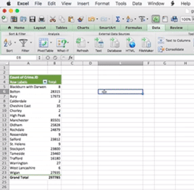


You can set the last parameter of all the values, from 0 to 4, in order to produce all the 5 numbers. So when you type 0 you get the minimum, when you type 1 you get the 1st quartile, when you type 2 you get the median, when you type 3 you get the  3rd quartile, and finally when you type 4 you get the maximum value. Feel free to play around with this, and see how it goes. 

<!--
##Boxplot: visualising the 5-number summary


We can use a [boxplot](http://flowingdata.com/2008/02/15/how-to-read-and-use-a-box-and-whisker-plot/) for visualising these measures. The boxplot also tries to represent five numbers but in a visual way. So the boxplot will give you the “minimum”, the 25th percentile (or lower quartile), the 50th percentile (the median), the 75% percentile (the upper quartile), and the “maximum” like in the graphic below:


In truth the boxplots produced by many software packages are a variation of this. In computing software at the end of the “whiskers” you don’t have the largest and smallest sample values. Instead typically you have the largest and smallest values “within a reasonable distance”. Then, what happens is that if you have outliers they get represented as circles or asterisks at either side of the distribution like in the boxplot displayed in the graphic below. 


At this stage it is enough that you understand how to *read* a boxplot. If you don't, speak up now. Raise your hand and we will come help try to explain. 


As an optional extra though, I'll leave this here: if you want to go ahead and learn how to build one in excel, you can do so by folowing the tutorial below: 

- [Make a boxplot in excel](https://support.office.com/en-gb/article/Create-a-box-plot-10204530-8cdf-40fe-a711-2eb9785e510f)

-->

## Standard deviation


Let’s now discuss the standard deviation. The interquartile range is always a reasonably summary of spread, but because it uses only the two quartiles of the data, it ignores much of the information about how individual values vary. Clearly 117,663 crimes is very different from 33,46 or 39,312, for example. Yet, that’s not something that the interquartile range takes into account. 


A more powerful approach for measuring spread uses the **standard deviation**. Like the mean, the standard deviation only provides a good summary when we do not have highly skewed distributions. What is the standard deviation? This is the most complex concept we have covered so far and by now you may be a bit tired and overwhelmed with all we have covered today; thus, do not worry too much if you get a bit confused. We will come back to it also next week. 

One way of thinking about spread is to examine how far each data value is from the mean. This difference is called a deviation. If we look at our dataset we see that Trafford had 22,587 crimes recorded in our data. If the mean for all the boroughs is 42,008 then Trafford has a deviation of 19,421 (= 42,008 - 22,587).
 
The standard deviation tries to measure what this deviation is on average. That is, what the typical distance to the mean is for all the cases in your data. 
Unfortunately, if you just sum all the deviations in your sample and then divide them by the number of cases (if you attempt to take the mean of the deviations), the positive and negative differences will cancel each other out. As a result you will get “0”. 


So to “average” the deviations first you need to square these deviations and only then add them up. If you then divide the resulting value of summing up the squared deviations by the number of cases, you will obtain the average squared deviation. This value is called the variance. 


If you want to go back to the original scale of measurement, to the original metric, you need to take the square root of the variance (remember the variance is the average squared deviation). The square root of the variance is the standard deviation. It is another way of saying that is the average distance of each observation from the mean.


Conceptually understanding the variance and the standard deviation will possibly take you a while. We will come back to it, so don’t worry too much if you feel a bit confused right now. Make sure you read the recommended textbooks. 

So now we know that to summarise our data, we can produce the following numbers: 

- Mean: `r I(as.character(mean(per_borough_crimes$number.of.crimes)))`
- Standard deviation: `r I(as.character(round(sd(per_borough_crimes$number.of.crimes), digits=2)))`
- IQR: `r I(as.character(IQR(per_borough_crimes$number.of.crimes)))`
- 0%: `r I(as.character(min(per_borough_crimes$number.of.crimes)))`
- 25%: `r I(as.character(quantile(per_borough_crimes$number.of.crimes)[2]))`
- 50%: `r I(as.character(quantile(per_borough_crimes$number.of.crimes)[3]))`
- 75%: `r I(as.character(quantile(per_borough_crimes$number.of.crimes)[4]))`
- 100%: `r I(as.character(max(per_borough_crimes$number.of.crimes)))`


The standard deviation for our data is `r I(as.character(round(sd(per_borough_crimes$number.of.crimes), digits=2)))`. But, wait a minute! That is a bit large, isn’t it? How is it that half the boroughs have a value below  `r I(as.character(quantile(per_borough_crimes$number.of.crimes)[3]))`, the mean is `r I(as.character(mean(per_borough_crimes$number.of.crimes)))`, and you are telling me the standard deviation, in other words, the average distance of each individual value to the mean is `r I(as.character(round(sd(per_borough_crimes$number.of.crimes), digits=2)))`? This makes no sense? Shouldn’t the standard deviation be smaller, given that most boroughs should be close to the mean? 


Remember what I said at the outset. The standard deviation does not quite work when you have highly skewed distributions or outliers. When your standard deviation is larger than the mean, it signifies that you have a skewed distribution. The larger the difference is, the greater the skew. In fact, the more important use of the standard deviation in such cases is as a sign to conclude that you are dealing with a skewed distribution.
-->

### Activity 7: Standard Deviation in Excel

Finally, I will leave you with a note on how to calculate the standard deviation in excel. Similar to how you calculated the mean and the median, you can use the formula option to calculate the standard deviation. The formula you need to use is `=STDEV()`, and you apply it the same way you did the functions above, by selecting the cells which contain the data you want to calulate, to put them inside the brackets. 


## Writing it all up


This is all well and good, but what happens now that we have done all this analysis? Well most of the time you will want to write up your results. You will want to interpret them, of course, and you will want to present these interpretations, as well as supporting evidence from your analysis to share with the world. I will show a brief example here, of how to begin thinking about your report. 


The structure of your report will always depend on what is the purpose you are writing it for. If you are writing a journal article, you will have to conform to journal guidelines. For example, if you were hoping to submit something to the *British Journal of Criminology* you will have to follow their [author guidelines](https://academic.oup.com/bjc/pages/General_Instructions). If you were writing a [What Works Briefing](http://whatworks.college.police.uk/Research/Briefings/Pages/default.aspx) for the [College of Policing](http://www.college.police.uk/Pages/Home.aspx), you would follow their guidelines to make your report follow the [format and structure of other reports](http://whatworks.college.police.uk/Research/Briefings/Documents/What%20Works%20Street%20Lighting%20final%20version%20June%202013.pdf). For the assignment for this class, you will also be given specific guidelines that you will have to adhere to, both in terms of content and format. But these provide just a skeleton, which you populate with your own research, findings, and interpretations of your data. So while there are guidelines and templates, every report is unique. 


Here, we will build a report based on the analysis we carried out above, to give you a bit of experience in building reports. I'll walk you through this one, but make sure to ask about anything that might make you uncertain, as you will be writing your own report for this week's Task. 


### Build a structure


To start, open up a word document. Choose blank document. Before going into details, start by giving your report a title, something like *Exploring Police Recorded Crimes in Greater Manchester Between May 2016 and May 2017*. You can choose an alternative, shorter title if you prefer, but make sure it's descriptive. 


After the title, you can set up some sections, so we know what we want to put there. With most reports there are a few key sections to hit. 


**Headline findings**

You will need to start with some headline findings, these are your top results, the taglines for your work. If you had to get someone excited about your results, what 3 lines would you text them?


**Introduction**

You want to introduce a background to your analysis. This can include things like the *motivation* for your research. What is the task you are fullfilling by carrying this out? What is the research question that you might be answering? What have other people who looked at similar questions/ topics found? These are all important things to include.


**Data**

You also want to quickly discuss about your data. Where does it come from? What does it represent? We will talk more about the detail and importance of concepts such as sampling, research design, and other relevant issues in weeks 4 and 5. For now we will just acknowledge the source of our data. 


**Methods**

After a discussion of your background and your data, you want to mention your methods, and why they were the appropriate choice for interpreting your data. You want to go into enough detail so that people can reproduce your work from reading your description here, and also justify your choices so people know why you chose a particular approach over another. So for example, when you are talking about the frequency of different types of crime in the data, you would mention that you used a frequency table, as this is the appropriate method for univariate analysis for categorical variables. 


**Findings**

Then you want to present your findings. These are the results of any tests you perform (we'll get back to this in a few weeks), your frequency tabes, your graphs. Your summaries, your measures of central tendency. This is where you put all the evidence that will support your conclusions. 


**Discussion/ conslusions**

Finally you will have a discussion/ conclusion (sometimes these are two separate sections, sometimes they can be combined, again it depends where you are sending your report, what their expectations are.) Here you interpret your findings. What do the numbers mean? Are they big numbers (ref: Tiger that Isn't). What implications do the results have for policy and practice? How do they relate to what you thought you would find based on the background? 


**References**

You will be familiar with citing your sources from writing essays. If you need any refreshers on how to cite papers (which you will have mentioned in your **Background** section) you can check out the library's [my learning essentials](http://www.library.manchester.ac.uk/using-the-library/students/training-and-skills-support/my-learning-essentials/online-resources/?level=3&level1Link=2&level2Links=referencing,) helpful resources for referencing. But one thing you might *not* know is that you should also cite your data. Of course some times you will not be able to do this, for example if you collect your own data. However if you are analysing secondary data, you should always cite it. Read [this page](https://www.ukdataservice.ac.uk/use-data/citing-data) on the UK Data Service website, in order to learn about how to cite data. For a TL;DR version, when you serach for your data, you can click on "Item Details" in order to get some details on the data source, and further you can click on the Citation tab, which will open up a section from where you can copy and paste the citation for your data set. We will come back to this later, when we are working with UKDS data. 


In any case, your report should right now look something like this: 


<!--


There are a few key sections that your report will have to have. 


"*Report on the frequency of crimes recorded by Greater Manchester Police in the time period May 2016-May 2017*". 


Let's say we want to write a report about the most frequent categories of crime recorded by GMP over he May 2016 - May 2017 period. And we want to illustrate this with a table. 


Let's begin by talking about the frequency of crimes in different crime types. 

To start, open up a word document. Give your report a title, something like "*Report on the frequency of crimes recorded by Greater Manchester Police in the time period May 2016-May 2017*". You can choose an alternative, shorter title if you prefer, but make sure it's descriptive. 

When you are preparing a research report where you describe the results of some data analysis, you will often want to include some tables. To include tables in any such report you will want to copy your tables over from excel into a word doc. Let's go through this now. 

-->

So what do we want to say. Well this is where your critical thinking skills should come in. What do you think that someone would like to know about the frequency of crimes in our data? What do you think is interesting here? What do you think is worth menioning or highlighting? Remember that the whole point here is to *make sense of the data*. We want to tell a story using our data, and we want that story to be meaningful, and comprehensive. So if we are tasked with telling a story about the frequency of each crime type, then we want that to be an interesting story. 


In this week's task we'll be building a report like this together. It will be quite hand-hold-y, so don't worry, it's meant to guide you through building a research report. It will feel a bit like a fill in the blanks exercise even. When you get to your final assignment, that's when you'll have more freedom to discuss what you wish. So at this point, go ahead and download the task for week 2, and get started on that. 


<!--
So let's put in a few "headline figures". Maybe we want to name the top three most common crime types. Maybe we want to comment on the most and least frequent crime types. This will depend on our angle, on the purpose of the story we are hoping to tell. For example, a crime analyst looking to help their team reduce total crime numbers might want to highlight the most frequent crime categories, and recommend that these be the focus of some problem-solving initiatives, aimed to drive the numbers down. On the other hand, someone looking to explore potential issues with reporting crime to the police might be interested on crimes that show up with low frequency in these data, as it might be that these are not necessarily infrequently occurring crimes, but perhaps just frequently underreported crimes. In this case we might want to look at the bottom three categories. 


In any case, let's put in some summaries, but also present our table, in case the people reading it want to choose for themselves where to focus. 


This is actually quite simple. Just open up a word document. Then return to your pivot table, and highlight the whole thing. You can highlight all in a few ways. One method is to click on the bottom right cell, and just drag the mouse over to the top left cell. When you let go of the mouse, everything will be highlighted. Alternatively you can also click on any cell inside your pivot table and hit `Ctrl+A` on a PC, or `cmd+A` on a mac. Then copy all the table, and paste it over in your word doc. This is an easy way to transfer tables and grapsh from excel into a word doc. 


-->

## Summary


In sum, you should now be more familiar with data than you were when you started. And you should be comfortable with the following terms: 

- univariate
- frequency table
- mode
- pivot table
- bar chart
- mean
- median
- outlier
- standard deviation
- variance
- histogram 
  + bins
- 5 number summary
- quartiles
- inter quartile range


<!--chapter:end:003-week2.Rmd-->

# Week 3 {#week3}

## Learning outcomes


Much of statistics is about making comparisons. Human beings are not good at sifting through large streams of data; we understand data much better when it is summarized for us. This is true for looking for patterns in both *uni*variate and *bi*variate analysis. As discussed last week with univariate, when presenting descriptive analysis, we often display summary statistics in one of two ways: with tables and figures. 


Tables of summary statistics are very common (we have already created some of these last week) – nearly all published studies in criminology will contain a table of basic summary statistics describing their sample. However, figures offer a visually more appealing interpretation of our data, that allows people to easily identify trends from large amounts of information. This is also true for exploring relationships between two variables. In this course we will have a look at ways of producing these visuals (and some tables) that can help you get started in thinking about the relationships between different variables in your data. Not only do we want to be able to summarise one variable, but we want to know, is it related to another variable. Because this is where the interesting questions are that we can start asking. 


For example here are some criminological papers that explore the relationship between two variables: 


- [Do older people have higher fear of crime?](http://onlinelibrary.wiley.com/doi/10.1111/j.1745-9125.1989.tb01051.x/full) compares the variables age and worry about crime
- [Is there a relationship between adolescent drug use and psychological health?](http://psycnet.apa.org/record/1990-22928-001) compares the variable measuring psychological health with drug use in adolescence
- [Does design of a street affect burglary risk of the houses on it?](https://link.springer.com/article/10.1007/s10940-009-9084-8) looks at the variable of design of street, and considers its relationship with increased burglary risk
- [Does ethnicity affect trust in the police?](http://journals.sagepub.com/doi/abs/10.1177/1098611104271105) looks at the variable of ethnicity, and its relationship with variable measuring trust in the police.


And so on and so on and so on. You will notice that most of the research questions that criminological research attempts to address are based on comparisons. You want to be able to explore the relationship that one variable has with other variables. That is where exciting new insights come from. We will talk next week about how you can go about identifying what variables to test against each other to be able to answer your research questions, including how to measure these variables, or even define them in the first place. But today we will explore how to go about assessing any *bivariate* (meaning two-way) relationships - relationships between two variables. 


### Terms for today

- Bivariate analysis
- Categorical v categorical
    + Crosstabs with pivot tables
    + Stacked column chart
- Categorical v numeric 
    + Summaries by group with pivot tables
- Numeric v numeric
    + Scatterplot
    + Association, strength, and form of relationship
    


## Categorical v categorical

Here's an example of a bivariate frequency table. Remember **bivariate** just means that there are **two variables**.  Let's say we have this data set of waiters and waitresses who work at Lil' Bits restaurant. But this time we don't just have their gender, we also have some information about their tip earnings. We know whether they are high earners or low earners. Here is our data in table format:


Again, all we are doing with a frequency table is counting the number of occurrences. Except this time we need to know the number of occurrences of variable *pairs*. So we need to know not only the number of times that *female* appears, but when the pair of *female* and *high earner* appear. Again, I made a gif to illustrate: 


This two-way frequency table is also called a **cross table** or **crosstab**. Also a **contingency table**. We like to give the same thing many names, but just know, if you hear any of these terms, people are referring to the frequency table that considers the relationship between **two categorical variables**. 


> The table of counts for the various combinations of categories is a contingency table.
 
 - Agresti, Alan, and Maria Kateri. "Categorical data analysis." International encyclopedia of statistical science. Springer Berlin Heidelberg, 2011. 206-208.


For example, a researcher might be investigating the relationship between the class on which a passenger was travelling on the RMS Titanic (which, in case you're not familiar, was a British passenger liner that sank in the North Atlantic Ocean in 1912, after it collided with an iceberg) and whether that person survived or not. The two variables would be class (1st, 2nd, 3rd, or crew) and survived (yes/no). The question is "Is there a significant relationship between class of passenger and survival?" In this course, we don't yet learn how to answer this question with  *inferential statistics*. Instead, here we  only begin to explore this question (and other questions of comparison) using *descriptive statistics*. If you are unsure about the difference, ask now, or consult your readings from the first week. 

### Activity 1: Surviving the Titanic

<span style="color:#d95f02">
So let's return to our question about survival in the Titanic. We want to know the relationship between the variable for class of passenger, and the variable for survival. First, we need some data. Data about the fate of the RMS Titanic's passengers is actually available open data, so we can use it to explore any questions we might have about it. [You can read a bit about the data here, and also find the data dictionary](http://www.public.iastate.edu/~hofmann/data/titanic.html). In this instance though, you can download the data from blackboard. As always it's in a folder under course content > week 3 > data for week 3. It is the one labelled "Titanic survivors data". Under it you will see a link to titanic3.xls. Right click and select "Save link as", and save it in your working directory you had set up for this course. 


Once you download the data open it up in excel. You should see it's the usual dimension of your variables in your columns, and your observations in your rows. Each observation is one passenger who was on board the ship. The variable "Class" tells whether the passenger was travelling 1st class, 2nd class, 3rd class, or as a member of the crew. The variable "Survived" tells whether that person has survived the RMS Titanic's collision with the iceberg or not. 


We might be interested in looking at the rate of survival by passengers who were travelling on various class tickets. For example, we might have seen the 1997 classic film [Titanic](http://www.imdb.com/title/tt0120338/) by James Cameron, and might be wondering - was there a priority given to first class passengers when boarding the lifeboats, and did that result in them being more likely to survive? Well to be able to answer questions like this, we would need to compare the survival (yes/no) between the class (1st/2nd/3rd/crew) variables. Both of these are categorical, and so to be able to talk about their relationship, we will have to build a **crosstab**.


So to do this, we return to our trusty friend, the pivot table again. But this time, instead of using it to summarise one variable, we can use it to summarise the relationship between two variables. The same way that the gif above illustrated with gender and the tips example, what this does is it counts the frequency of the combination of each category. But lets see how to do this. 


So first just create the pivot table environment to be able to build our pivot table. Just like last week, click into the **Insert** tab, click on **pivot table**  and then again on **pivot table**:


This will open a popup window, where you want to make sure that you select 'New worksheet' where it asks where your pivot table should be placed, and then click OK, again just like last week. When you click OK, excel should take you to the new worksheet where it has set up a pivot table for you, ready to get into your data, again exactly the same as last week. Remember, if the toolbar doesn't appear, or ever disappears, to summon it you have to do one simple step, which is to click *anywhere* inside the pivot table area.


 


Great, now you can create your two-way frequency table. First, drag the "Class" variable to the "Row labels" box, and also into the values box. This should produce a table that looks familiar, it's a one-way frequency table. It's what we would do if we were carrying out some *univariate*  analysis on the "Class" variable. It should look something like this: 


We can take a moment to look at the frequency table of just the class variable. It tells us how many passengers were travelling aboard the ship in each group. You can see there were the most people travelling as crew, while the least populous group is the 2nd class ticket holders. 


But to answer our question about the relationship between survival and class, we don't want *univariate*  analysis on the "Class" variable. We want to compare the survival of passengers between these classes, so we want *bivariate* analysis on the "Class" variable with the "Survival" variable.


Luckily, there is really only one more step we need to take to achieve this, which is to introduce the Survived variable into our pivot table. To do this, drag the "Survived" variable into the "Column Labels" box. Once you've done that, you should see your frequency table appear:


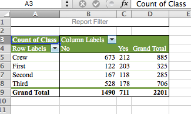


You can see that we have a frequency table that has the variable of *Class* as the rows, and the variable of *Survived* across the columns. Note that this is different from a data set, where each variable would be a column and each row an observation. This here is a frequency table (or cross tab, or contingency table). 


Now you might notice one thing that could be bothering you? So think back to *levels of measurement*. The "Survived" variable is categorical - nominal. However, the "Class" variable does have an order, it's categorical - ordinal.  But Excel here puts it in alphabetical order. 


You can rearrange this manually, and copy over into a new sheet. 


To rearrange the order manually just click on the arrow next to "Class" > "More sort options" > "Manual". To open a new sheet just click on the little plus sign on the bottom of your current sheet: 


Then copy over the values from your pivot table, making sure that your rows are in order, from 1st, to 2nd, to 3rd, to crew. You can also add labels if you  like. In the end you should have something like this: 


</span>


So you can see here the number of people who survived or died on the Titanic, by the class on which they were travelling. Do you see any interesting patterns? If you've heard of the incident, or watched that film with Kate Winslet and Leo Dicaprio, then you might be expecting to see more 1st class ticket holders amongst the survivors than 2nd and 3rd class, or crew. However if we look at the number of people who survived, is there a lot of difference? In fact it looks like more crew members survived than did 1st class passengers... 


But what about if you look at the column that represents the number of people who didn't survive instead? Now we see that a lot more people, volume-wise, did not survive in the 3rd class and Crew groups. But how can we make meaningful comparisons between these groups? How do we make sense of this?


One thing you will be able to use, which we approached last week, is the use of percentages, to make sense of your data. With a frequency table of only one variable, this was easy, you just consider what percentage of the whole, each cell represents. However with a **bivariate**  frequency table, we have *three* different options for percentages. We can consider the **row percentage**, the **column percentage** or the **total percentage**. And all three tell us very different things. Let's take a look. 


### Row percentage, column percentage, or total percentage


Column percentages are computed by dividing the counts for an individual cell by the total number of counts for the column. A column percent shows the proportion of observations in each row from among those in the column. Row percentages are computed by dividing the count for a cell by the total sample size for that row. A row percent shows the proportion of observations in a column category from among those in the row. Total percentages are computed by dividing the count for a cell by the total sample size - the grand total. A total percent shows the proportion of all observations in you sample that match that particular row and column combination. 


Simply put:

- **row percentage** is the percent that each cell represents of the **row total**
- **column percentage** is the percent that each cell represents of the **column total**
- **total percentage** is the percent that each cell represents of the **grand total**


In the case of the Titanic survivors data, we might be wondering three things: 

- **row percentage:** what percent of the passengers in 1st class survived vs did not survive?
- **column percentage:** what percent of the survivors were passengers in 1st class vs 2nd, 3rd class or Crew?
- **total percentage:** what percent of all passengers were those who were 1st class and survived, 1st class and did not survive, 2nd class and survived, 2nd class and did not survive, etc etc


So to calculate each one of these, we need to know each  **row total**, each **column total**, and the **grand total**. In this case, if we look at our data, our rows are represented by the classes, and the columns represent the survival (or not) of passengers (and crew). 


So the row total for the 1st class row will just be the sum of all people (both those who survived and those who did not) who had 1st class tickets. And the row total for the 2nd class row will just be the sum of all people (both those who survived and those who did not) who had 2nd class tickets. And so on, and so on. Like this: 


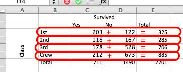


For column totals it's the same thing, except you are calculating the total of each column, so the total number of people who survived, by adding up survivors in 1st class, 2nd class, 3rd class, and crew, and the total of those who did not survive, adding up non-survivors in 1st class, 2nd class, 3rd class, and crew. Like so: 


Summing the observations in either way give you a column total and a row total column. If you take the sum of those (so the sum of the column totals, that is all the people who survived and all the people who did not, **or** the sum of the row totals, which is the sum of all people in all the classes and crew), that gives you the grand total, which, incidentally, is all the people who were on board the RMS Titanic, in all classes, and whether they survived or not. In this case, that is a total of 2201 people. You can get this from either the row total or the column total, they will both equal the same thing, which is *all your observations*. 


###Activity 2: Calculating row vs column percentages


<span style="color:#d95f02">
You can calculate these yourself, in the excel sheet you have downloaded from blackboard, using the `=SUM()` function, the way that we did this in the previous session. 


So now that we have these totals, we can calculate our percentages. 

To get your row percentage, you have to take each cell and divide it by the row total (and then times by 100 to get the percent value). You can do this in a new column, creating a new column for survived - Yes % and No % : 


Now you can enter the calculation as a formula for each row. Remember for something to be a formula, you will start with `=`, and then follow with your equation. Here the equation will be:

`cell divided by the total, times 100`

`cell/total*100`

So for example, for the Yes percent column for first class passengers, you have to find the cell reference for the cell that represents the number of people who survived and were 1st class ticket holders, and divide by the cell reference of the total number of first class ticket holders (your row total for this row). You can do this by typing in the reference for each cell (so typing out `C3` and `E3`) or you can do it by highlighting as well. If you're not sure how to do the highlighting approach, raise your hand now, we will come to help!


But in any case, for the cell that represents the row percentage for the yes survived and first class combination, you should have the below formula: 


`=C3/E3*100`


Once you type this, you will see the percent value appear for the percent of all first class passengers who survived: 


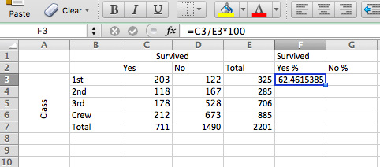


You will see that in the formula bar at the top, you see the formula you typed, but in the cell you see the value appear. In this case we can see that about 62.5% of first class passengers survived the sinking of the RMS Titanic. Let's calculate the values for the other cells as well: 


</span>

Row percentages allow you to talk about the percentage of each value in the variable that's displayed along the rows, in terms of the outcomes displayed across the columns. What does that mean? Essentially, you can talk about the percent of each class that belong to each survival outcome. So you use row percentages to say: 62.5% of those in first class survived, but only 25% of third class passengers did. This is the kind of stuff we can say with row percentages. You get all sorts of better insight, than just talking about the number of passengers who survived. There were 203 1st class survivors, and 178 3rd class, however this doesn't seem to be that much of a difference. But once you take into account, how many *more* 3rd class passengers were than 1st class, you can see that actually it does make a huge difference, as percentage wise, many more 1st class passengers survived. Turning your numbers into percentages tells you these kinds of things. Isn't that exciting? Well, not for Leo...


But what about column percentages? What do those tell us? Well just as row percentages tell you about the percent of the *row* values, distributed across the categories of the *columns*, column percentages tell you about the percent of the *column* values, distributed across the categories of the *rows*. In this case, the column percentages would tell us what percent of the survivors were 1st, 2nd, 3rd class or crew. Similarly it can also tell us what percent of the non-survivors were 1st, 2nd, 3rd class or crew. This is a *slightly* different story to what the row percent says. 


So why is that? Well let's look at the numbers to illustrate. To calculate the column percentages, you have to do the mirror image of what we did for row percentages, just create some new rows, one percentage equivalent for each class, so 1st %, 2nd %, 3rd % and crew %, and again for each one, populate it with a formula starting with the `=` sign, then the cell of the matching value (so C3 for 1st class survived) divided this time by the column total (C7), and again times by 100. As such: 


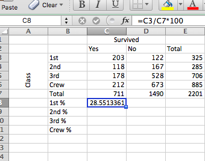


Repeat the same for all cells (remember how you can copy formulas by clicking on the bottom right corner of the cell there, and dragging? No? Raise your hand now to ask about it! It saves time, I swear...!)


Then you will end up with some results like this: 


So what does that tell you? Well this tells you about the % of Survivors who were travelling in each class. So we can now see that of all the survivors, 28.6% were 1st class, 16.6% were 2nd class, 25% were 3rd class, and 30% were crew. This doesn't really illustrate any huge disproportionality, does it? Well again, that's because it doesn't compare to those who died. Instead it just looks at the distribution of the survivors between those travelling in different class. And this is why it's really important for you to consider - what is the best way of presenting the data, that considers all angles, and presents the most truthful story? There is a popular book used to teach statistics called [How to Lie With Statistics](https://en.wikipedia.org/wiki/How_to_Lie_with_Statistics). This is a good point to illustrate again, how important it is for you to understand how to make sense of data, and how to draw meaning from it, in order to be able to scrutinize what stories people may tell you. Depending on what results would be presented from this analysis, we could easily write a different headline. 


Consider this: 


**Crew save themselves before passengers - 30% of the survivors were Crew members, with 1st class passengers lagging behind at 28.6%**


The numbers in this headline are all correct. It is true that 30% of the survivors were crew members. But it doesn't take into account the original number of crew members present, from which the survivors could be selected. A very different headline would be: 


**Rich leave the poor to sink into icy ocean - 62.5% of 1st class passengers survive, compared with 41.4% of 2nd class, 25.2% 3rd class, and only 24% of crew members who made it out**


Very different conclusions, no? All from the same data. The numbers are correct, but they are framed very very differently. This is why it is so important to report all your findings, including the right statistics, as well as to be able to scrutinize other reports as well. To the first statement you might want to pose the question - OK but what percentage of the non-survivors were crew members? You would receive the figure of 45%, immediately indicating that they would be the largest group represented in the fatalities as well. Then you would begin to realise that the reason they might be a large proportion of the survivors, is because they made up such a large proportion of anyone on board, in the first place. There was simply more of them present! But when you consider their survival rate (which is illustrated better by the row percentages) you gain some insight into the inequalities. And our qualitative information from the movie Titanic further supports this finding, that we need to consider the proportion who did not make it out as well: 


I hope that illustrated a bit how you can calculate your row and column percentages, as well as what they mean, and how they help you extract meaning from your data. Usually you will only display *either* row percentages *or* column percentages, *not both*. You will have to choose which one you think is most appropriate for telling your story. 


But what about total percentages?!?! The truth is, you will very rarely use these. Total percentages tell you what proportion of all your passengers were 1t class and survivors, or 2nd class and survivors, and so on and so on. They are not frequently used to show relationships between variables. If you want to calculate them, you just have to divide each cell by the grand total (all the passengers) and times that by 100. You can go ahead and try if you want. But you won't really get a lot of insight from it, I have to tell you... So we won't even bother with them any more. 


So which one you use (row or column) is dictated by the question you ask. There's also this youtube video (made for someone called Michelle apparently... I'm not sure the backstory here, but it sounds like our video creator is excited for Michelle to get back from Spring Break, and talk about column vs. row percentages. But in any case, I'm sure that since it's on YouTube, the rest of us can use it...) where the video's creator switches between row and column percents, this can further illustrate how it makes a difference which one you use: [you can watch the video here](https://www.youtube.com/watch?v=cdvTpnHwKjs). 


If you're still unsure about these let us know, raise your hand, and we will come to help!


### A note on formatting cells


Just before we move on, I quickly want to take a side step and talk about formatting of the cells. You can see that here we see our percentages appear to very accurate precision, displayed up to 7 decimal places. This isn't always necessary. Do you think it makes a big difference to someone if you say "32% of all Titanic passengers survived" or if you say "32.303498% of all Titanic passengers survived", in terms of their understanding of what that means? In some cases it might be important to retain such precision. But often, when talking about people, (or number of crimes) it doesn't necessarily need to be so specific. So what if you wanted to format your results?


Well you can always round your numbers manually. But as always, there is a way you can just do this using excel. To do this, highlight all the cells with the percentages inside. When you have done this, right-click anywhere inside this area that you have just highlighted. A menu of options will appear. Select the option to "Format Cells..."


This will bring up another window, where on the left hand side you will see a list of possible types of data that your cell could contain. Most likely this will be set to "General" which is a pretty meaningless category. Instead, choose the "Number" option, as your cells contain numbers (percentages). When you click on the "Number" option, you will see a text box, that says "Decimal places: " in front of it. 


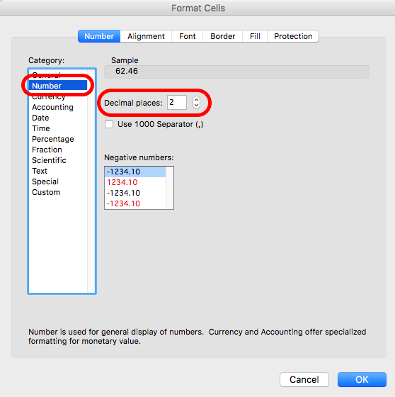


Here you can enter the number of decimal places you want to display. Change it to "1". Then click OK. Once you've done that, your percentages should now be displayed with only one decimal point. A bit less noise, don't you agree?


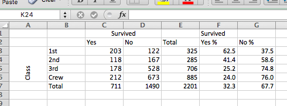


### Activity 3: Visualising the relationship - stacked bar charts, and conditional formatting


So last week we visualised frequency tables using a bar chart. This week we have two variables to visualise. Luckily we can still do this, but with a stacked bar chart. What is this? Well this time, the bar chart will have a consistent height (100%) but will be shaded according to which percentage each category takes up. Let's illustrate to make this more clear. 

<span style="color:#d95f02">
We've decided that row percentages are the more meaningful of the two here for us, so let's go ahead, and highlight the cells where we have our row percentages. Once this is highlighted, select the stacked bar chart. 


Once you click on that, our chart will appear: 


This looks about right, however you can see that our axes are not properly labelled. Each category is called 1, 2, 3, and 4, instead of 1st class, 2nd class, 3rd class, and crew. So to fix this, you can right click anywhere in the chart area, and as the little window of options appears, click on "Select data...":


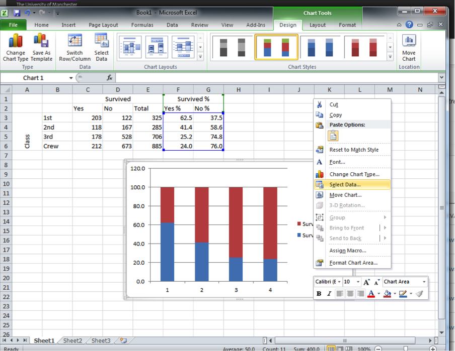


This will open up another pop up window, where you should see the following:


Above the right-hand box, you can see a label telling you that this is to do with the "Horizontal (Category) Axis Labels. You can click on the "Edit" button under that which will open a selection window. Select the row labels by clicking and dragging to highlight them all:


Once you hit enter it will populate, and you can click on "OK" to update your graph. You will see it updated hopefully looking like the graph below: 


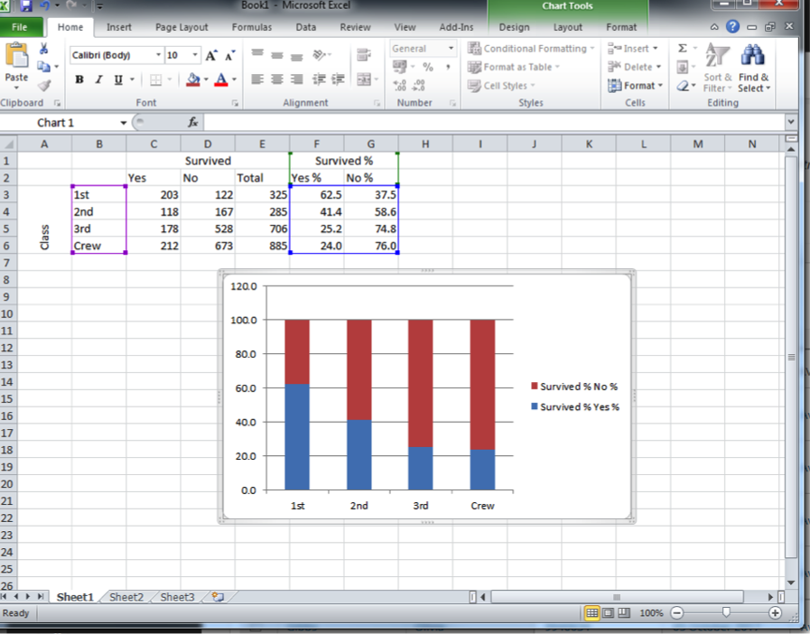


you might have noticed there was an option for stacked bad with percentage next to it. This is quite handy if you have not computed row percentages. Excel will go ahead and do this for you in graph form. If you want to give this a go, go back and this time, highlight the count of the people who survived, not your percentage calculations. Now when you've highlighted that this time select the percentage graph bar charts: 


When your new graph appears, you will see that it looks exactly the same as when you created the stacked chart from your calculations. Exciting! 


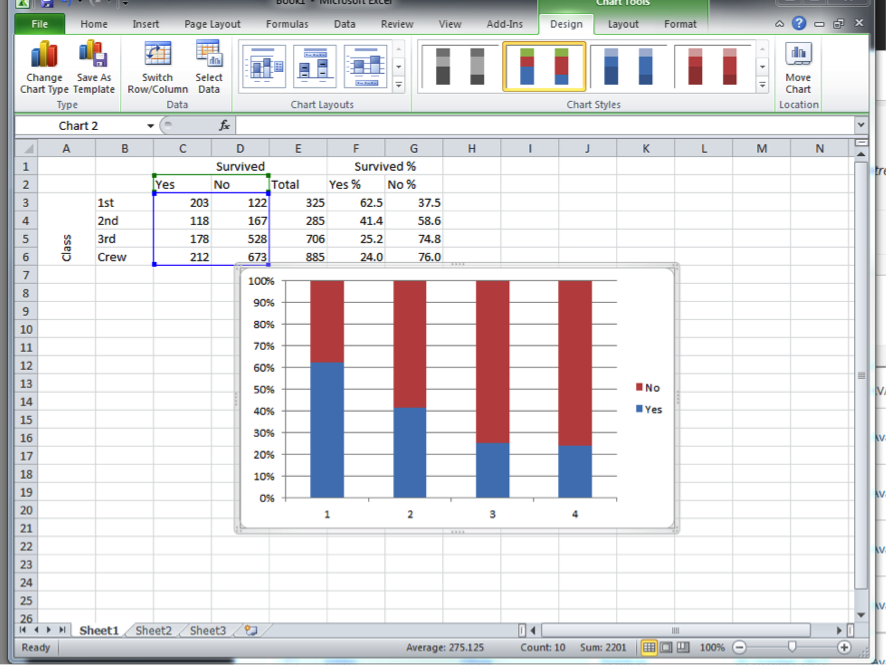


You might be wondering - how does excel know that you want the row percentages, and not the column percentages, when you are creating your stacked percentage bar graph just from the counts? Well, tradition holds in data analysis that you should arrange your data in a way that the row percentages are the meaningful ones. Think about it, if I wrote the table with the survival in the rows, and the class in the columns, that still makes sense - it is still the same data, right? But then what is represented by column and by row percentages gets switched. The meaning is the same, but they are just calculated into different places. 


Another way to visually display the differences in your data, while still presenting the numbers in a table, is to use conditional formatting. To do this, select again the cells with your percentage values in it:


This time in the "Home" tab, you will see a little sign that says conditional formatting. Click on the little arrow next to it (with your data still highlighted):


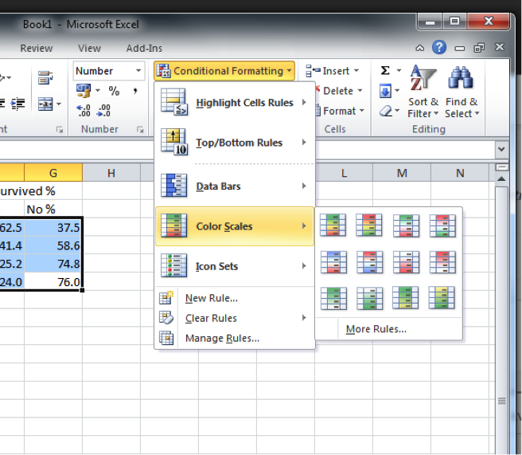


Hover over "colour scales" and pick a colour scale that you think is appropriate. Often you will hear people talk about a "RAG" rating (red, amber, green). So you might want to choose a red-amber-green colour scale. However, you might want to consider that some people have red-green colour blindness. To make your representation accessible to people with this particular condition, you might actually want to use a scale that goes from red to blue. Also you want to decide what is coloured red. You can see the same colour scales on there twice, once with red at the top, and once flipped around with red at the bottom. Which one you choose is dependent on the *meaning* of your colour scale. Is a high number a good thing or a bad thing? In this case this changes between our two columns. However if we were colour-coding the number of crimes per borough for example, a table we created last week, then red would be better suited to illustrate higher numbers (so we would pick the scales with the red on top) to indicate more crimes in an area. You can also choose a neutral scale, going from yellow to green for example and so on. The choice is yours, you have options!


Here's mine anyway:


You can see that the yes % is quite a high value, an appears with an orange colour for the 1st class passengers, but for all others, it is their no % which contains the higher numbers, with dark red especially for 3rd class and crew members. Using conditional formatting in this way can help draw out patters, that further emphasise the story that the numbers in your crosstab are telling. They can be useful in reports (just make sure that whoever will be reading them will be reading on screen, or has access to a colour printer!). 


</span>


## Categorical v numeric


The Arrestee Survey, 2003-2006, was the first nationally representative survey of drugs and crime among the population of individuals representing arrest events in England and Wales. The survey aimed to provide information on a range of areas within the drugs and crime nexus, including the prevalence of problematic drug misuse among respondents representing arrest events; drug and/or alcohol consumption; availability of drugs; levels of demand (met and/or unmet) for drug and alcohol treatment services among respondents; levels of intravenous drug use among respondents; and gang membership. Topics covered include: demographic characteristics; arrest, prison history and past contact with CJS; offending and offence categories; drug and alcohol use; drug purchasing and availability; drug and alcohol treatment needs; treatment offered and received; and gang involvement. Some of the above questions were answered by self-completion questionnaire, and an oral fluid (saliva) sample was also taken.


If you wanted to have a look at this data set, you can access it through the UK data service website [here](https://discover.ukdataservice.ac.uk/catalogue/?sn=5807). However to make things easier, I have selected just a few variables for you here, and uploaded this subset onto blackboard. So go now to blackboard (course content > week 3 > data for week 3) and download the arrestees_subset file. Once downloaded onto your PC, open it up with excel. 


So the first thing we want to do is have a look at our variables. We have 5 variables, which are: 

- **Interview reference index:** This is just a reference number to identify each person interviewed. For anonymity reasons, a number is used to identify them, rather than their names 	
- **Age:**	Age of the person being interviewed, at the time of interview
- **Age at first arrest:** The age at which they person had their first arrest	
- **Number of times arrested:**	The number of times this person has been arrested, up to this point.
- **Reason for arrest:** The reason given for this particular arrest 


In the following questions, we will explore the relationship that age has with offending. In the first instance, we might want to find out the age profile for different offences. Do you think there would be a difference between the different offences that people are likely to get arrested for?


For example [joy riding is a crime traditionally associated with younger people](http://www.tandfonline.com/doi/abs/10.1080/10683160512331316343). Joyriding is associated with 'theft of vehicle' which appears in our data as a possible value for the "Reason for Arrest" variable. So we might expect for the distribution for age (a numeric variable) to be different for those arrested for 'theft of vehicle' than a crime that might be associated with an older demographic. Any ideas what crime types those could be? 

### Activity 4: Age of offenders

<span style="color:#d95f02">
Let's have a look at just the possible values that the "Reason for Arrest" variable. To do this, let's start building a pivot table once again. You should be pretty comfortable with this by now. Make sure you are clicked anywhere on a cell that's part of our data set, and then go to Insert (or Data on a mac) and choose pivot table:


Now take the variable 'reason for arrest', and drag it to the "Row Labels" box. You should see all the values for the "Reason for arrest" variable :


You can see here a list of all the possible values that the "Reason for arrest" variable can take. Let's take some time to think about these categories. We've already discussed joyriding as something that is generally considered a crime to be committed more often by younger people. What about the other reasons above. Are there any other ones that you think would have a generally younger demographics? Let's take some time to guess first, just to test your possible understanding, and then check our assumptions with data. After all, that's what this course is about, right?


So, answer the following questions for me, without peaking ahead, or checking the data, just in terms of your perceptions of the relationship between age and types of offences committed:


- Which reason for arrest do you think has the oldest arrestee?
- Which reason for arrest for you think has the highest average age of arrestees?
- Which reason for arrest for you think has the lowest average age of arrestees?


Take some time to think about this. 


So now that you've hopefully chosen some categories that you think would fit the image of younger/ older age profiles, let's have a look at what the data says. In order to be able to compare a numeric variable across values of a categorical variable, we can consider different summaries across each value. Remember last week when we looked into summaries of numeric variables when considering *uni*variate analysis? Well now we do the same, create these summaries for the numeric variables, but we do this *for each value of the categorical variable*. So we can consider the minimum, the maxiumum, the mean, the median, and the standard deviation for age across each one of the values given for 'reason for arrest'. Let's have a look on how to do this. 


On our pivot table panel, grab the age variable, and drag it into the "Values" box. When you let it go, your table should look something like this: 


Have a look at this table. What does it tell you? It looks a bit strange no, these are not really numbers that make sense when we are talking about people's ages... What does 9882 mean when it comes to 'Theft of vehicle'? Well if we look back at our "Values" box in the pivot table panel it gives us an indication as to what's going on. Since we didn't specify how we want the age variable summarised, Excel has decided to select the "sum" function for us. So what we are seeing here is essentially a sum of all the ages for all arrests made for reason of "theft of vehicle". This is very hard to make sense of, and instead we would prefer to see some of our summaries that we discussed above, as well as last week when we were performing univariate analysis. So how do we do this? 


Well on the right hand side of the item "Sum of Age" in the Values box there is a little letter "i". This is on a mac so on a PC it might be a downwards arrow. Whatever it is, click on it, and a new popup window will appear. 


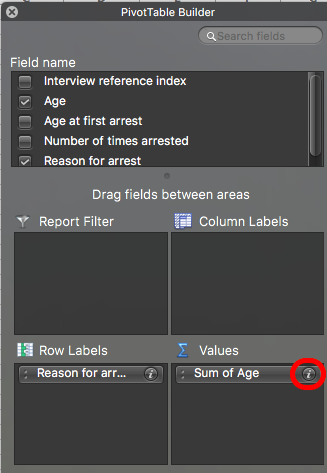


If you're on a PC, when you click on the downward arrow this set of options will appear: 


In this case select "Value Field Settings..." - this is the same as the steps we followed last week to add the column of percentages for out univariate frequency table. Then the popup that appears will look roughly the same, with the option to change the Field Name (as "Custom Name") and the Summarize by (as "Summarize Values By"). 


In the new popup window, you can see that you have a list of options in a window under the description that says "Summarize by". You can see that initially (by default) this is set to sum: 


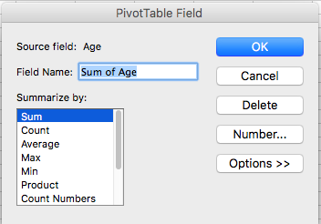


Change this to select "Average", like so: 


Click OK, and you will see your column updated: 


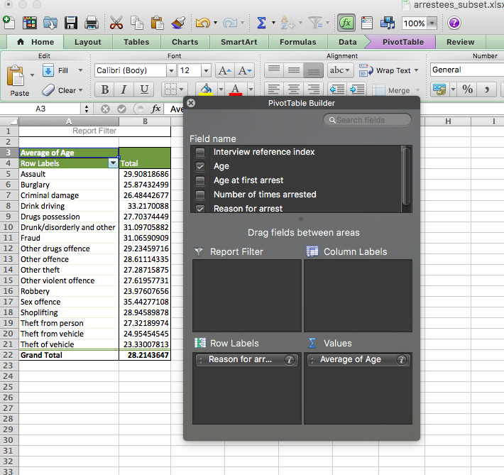

<!--

The label for the column in this table though still says "Total" which is not a hugely meaningful name, is it? Re-write this (simply by clicking in the cell and deleting "Total" and writing its new name). For example here I've re-labelled it to say "Average Age":


-->


So now we have a column that tells us the average age of people arrested for each value of the variable "Reason for arrest". So which one has the highest average age? It appears to be "Sex Offence" with an average age of 35 years old for people arrested for this reason. Is this what you were expecting? Did you choose something different? What is the average age for the value for reason of offence that you thought would be oldest? Were you far off? Take a moment to chat about this with the person next to you. Hopefully you might find these results interesting, and therefore are getting some insight into offender demographics for various crime types. Our youngest average age of offenders does appear to be in the theft of vehicle category. 


But remember our first question - *Which reason for arrest do you think has the oldest arrestee*? Well this question is not answered by the average age column here. And also, we discussed last week why the mean alone is not always the best summary of our data. We might want to know about the spread, and the variance as well. So let's add a few more columns to our summary statistics table here. To do this, just drag "Age" to the "Values" box again and again, and each time, click on the little i (or arrow) and select what summary you want to display. So to add a new column, for minimum value you would drag age, and select minimum, like so: 


Now do this again to create a column for maximum, and another column for standard deviation to be able to talk about variance as well. 


In the end your table should look like this: 


If it doesn't, just raise your hand and we can come around to help you get there. 


Note: for creating the standard deviation column you have two choices there, StdDev and StdDevp. The one to choose will depend if you would like to know the standard deviation of your sample or your population. We will speak about this more next week, but you can imagine that the data we have come from a *sample* of people, who are used to draw conclusions about the whole *population*. Rather than interview everyone who has ever been arrested, we rely on gathering data from the interviews of enough people that we can make generalisations. These people who we actually speak to, they are our sample. Once we use inferential statistics, we can use data from the sample to make generalisations about the whole population. But with descriptive statistics we are actually talking only about our sample. So in this case you want to select  *StdDev* and **not** *StdDevp*. If you're confused about this ask now!


Right, so now, we can finally answer our first question, *Which reason for arrest do you think has the oldest arrestee*? So, which is it? 


Well the oldest arrestee appears to have been arrested for *Assault*, at the age of 82 years old. Is this the category you were expecting the oldest offender in our sample to appear? Why or why not? Take a moment to try to interpret the data. It's important to always return to the meaning that we can extract from our numbers. Talk to someone next to you about this. 

</span>

The other interesting column here to pay attention to is the standard deviation (the minimum age column is not super exciting. People under 17 were excluded from the survey, and so the youngest possible age in the sample is 17. It appears that at least one 17-year-old was arrested in every single one of these offence categories.) But the standard deviation, that tells us something new. Remember that it is a measure by which we can describe the variation of our individual observations around the mean. So the larger the standard deviation the larger the variation around the mean age in a particular subset of our data. Which offence category has the highest standard deviation? Which has the lowest? 


Theft of and theft from vehicle both have a standard deviation of about 7, as well as young mean ages. It appears that these crimes are mostly committed by younger offenders, with only a few of them committed by older offenders. Sex offences however appear to have a greater standard deviation, where offenders come from all ages. Any particular reasons why you think this might be the case? 


Now finally, before we move on, there is something you might have noticed. We did not include the **median** in our summary. Did you see it anywhere in your drop down menu, when selecting how to summarise the "age" variable? Well for some reason it's not as easy as calculating the other ones. Instead, to display the median we have to rely on building our own formulas. But you're getting good at formulas by now, so let's give it a go!


### Activity 5: Adding a column for median

<span style="color:#d95f02">
To add a column for median, we will have to use something called an "IF" statement in Excel. The IF function is one of Excel's logical functions, used to return one value if a condition is true and another value if it's false. We can use that here, because we want to include a value in our calculations *if* if belongs to the value of reason for offence that we are calculating the median for. If it's any of the other offences, we *do not* want to include it. 


It might help to think about this conceptually, before we write the formula. Let's say we go through our data row by row. Remember in our data, each row is one arrestee who was interviewed. We want to go through every one of these people, and include their age in our calculation for the median ror each offence category, **only if** the reason that that particular person was arrested *is* the offence category for which we are calculating the median. 


So for every person, we want to check if their value for *reason for arrest* is the one we are currently interested in. 


For example, if we are calculating the median age for theft of vehicle, for every line we first need to make sure that the value in the *reason for arrest* column is equal to *assault*. If it does, then we use that person's age to calculate mean age for theft of vehicle. If it is not, we do not. 


How would you write this in a formula? Well for assault we could say something like: 


`include IF 'Reason for arrest column' = 'assault'`


Now we just have to translate this to excel language, and put it inside a median calculation formula. Remember this one from last week? It's simply `=MEDIAN()`. 


Now we also have to refer to some cells. You can select these values by simply clicking on the cells that you need, but I'll go through the notation here again, just as a refresher. 


To specity what sheet you are taking your data from, you put the sheet name followed by an exclamation mark (`!`). So to refer to columns that are on the arrestees_subset.csv sheet, Excel notation for that is: `arrestees_subset.csv!`. 


A cell you refer to by the letter of the column it's in, and the number of the row that it's in. So the cell that contains the value for "Assault" is "A5". However, when you copy references, this will change. If you wanted to statically **always** refer to A5 you have to use the dollar sign in front of each element (row letter, column number). So if I always want A5 to be the cell I refer to, I would type: `$A$5`. 


And to refer to a range of values, you denote them as `first value:last value` . SO to get all the values from row 2 of column E to row number 19897 of column E, I would type: `E2:E19897`. And if I wanted to make sure that I **always** refer to these values, again I just inject a `$` in front of the column reference (E) and the row reference (2 and 19897). Like so: `$E$2:$E$19897`. 


Now building it all together, for assault, we could calculate the median like so: 


`=MEDIAN(IF(arrestees_subset.csv!$E$2:$E$19897=A5,arrestees_subset.csv!$B$2:$B$19897))`


Just to re-iterate again, this is what each part of this formula does:


When you are comfortable with this formula, paste it over into the cell in the new "median" column you've created in your table, and hit Ctrl+Shift+Enter. 


**NOTE: Hit Ctrl+Shift+Enter** This is important! *Don’t just hit enter* to complete the formula. You must hold Ctrl+Shift+Enter down together to complete the formula and tell Excel that it is an array formula. Excel will add curly braces around the formula if this is done correctly:


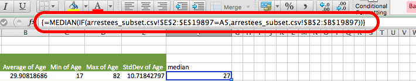


You can simply copy the formula by double clicking on the bottom right hand corner of the cell, or grabbing it and dragging it down. Whichever option you prefer, they achieve the same thing. After which you will end up with a brand new column you made all on your own, for the median: 


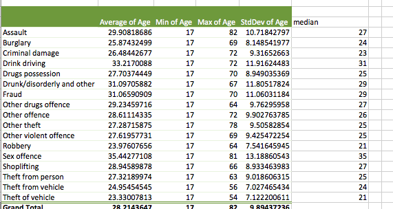


Now, finally you have a median column in your pivot table as well. You can now begin to think about what the difference between mean and median means in terms of the skew in your data as well. We don't seem to be getting huge differences, and this can potentially be put down to our *large sample size*. We have almost 20,000 rows in this data, which is 20,000 people who were interviewed and answered all these questions. We'll speak more about the importance of sample size later in the course, but now you know, that your means and your medians are not too far apart in either of the offence categories people were arrested for, with a maximum difference of around 3 years. 

</span>

<!--

### Visualising the differences between groups


Remember that we spoke about box plots last week? You had the option of having a go at making one, but we didn't get too much into it. Well that's because the strength of the boxplot lies more in comparing groups, so in other words, in *bi*variate analysis, rather than *uni*variate analysis. 


Now to be able to visualise the differences with boxplots, you will need all the 5 elements of the 5 number summary in your table, separated out by all the possible values for reason for arrest. We already have the minimum and the maximum, and the median, but we are missing Q1 and Q3, our first and third quartile. To calculate these, we can use the same approach as we used to calculate the median, by making use of the `IF` function of Excel. Except this time, instead of the `MEDIAN()` function, we use the `QUARTILE()` function. And remember that for the `QUARTILE()` function you also have to add a number at the end, between 0 and 4, indicating if you want the minimum value, the 1st quartile, the median, the 3rd quartile, or the maximum value. 


So create two new columns, next to where you created the median column, one for Q1, and one for Q3: 


Then you simply amend your formula. So to get the first quartile (Q1) for Assault, you simply put: 


`=QUARTILE(IF(arrestees_subset.csv!$E$2:$E$19897=A5,arrestees_subset.csv!$B$2:$B$19897),1)`


and to get the 3rd quartile, you would put:


`=QUARTILE(IF(arrestees_subset.csv!$E$2:$E$19897=A5,arrestees_subset.csv!$B$2:$B$19897),3)`


**Remember to hit ctrl+shift+enter instead of just enter** 


Again, a breakdown of what everything in the formula means: 


In the end, you should end up with a table of values just like this: 


Now we have all of our 5 numbers for our 5 number summaries for all of our possible values that the categorical variable *reason for arrest* can take. This is all the information that we need in order to be able to visualise the difference in the numeric variable (age) across the values for the categorical variable (reason for arrest). 


So as a first step, you will have to compute some distances between some of our 5-numer summary values.
We will put each one in a new column. We need: 

- `Q1 - minimum`
- `median - Q1`
- `Q3 - median`
- `maximum - Q3`


You can create these with simple mathematical functions in excel. Remember that you always start a function with `=`, and you can identify cells by either naming them (so typing out `A5`, or by click on them). 


This final group of statistics holds the values you put directly into the box-and-whisker plot. Why is this group necessary?


You can turn a Stacked Column chart into a box-and-whisker plot. In a stacked column, each segment’s size is proportional to how much it contributes to the size of the column. In a box-and-whisker box, however, the size of a segment represents a difference between one value and another — like the difference between the quartile and the median, or between the median and the first quartile.


So the box is really a stacked column with three segments. The first segment is the first quartile. The second is the difference between the median and the first quartile. The third is the difference between the third quartile and the median.


But wait. Won’t that just look like a column that starts at the x-axis? Not after you make the first segment disappear!


The other two differences — between the maximum and the third quartile and between the first quartile and the minimum— become the whiskers. Let's see for ourselves. I've adapted the steps from [statistical Analysis with Excel For Dummies by Joseph Schmuller](http://www.dummies.com/education/math/statistics/box-and-whisker-charts-for-excel/) that make use of these statistics and a stacked bar chart to build your very own boxplots, to compare the distribution of the numeric variable of age across the values for the categorical variable of reason for arrest. 


So first, highlight the columns for `Q1`, `med-Q1`, and `Q3-med`. You can highlight multiple columns that are not connected to each other by holding down the `cmd` button on a mac, or the *??* button on a PC. 


So make sure all 3 columns are highlighted, and then select a stacked column graph from the *Charts* tab on a mac, or *Insert* tab on a PC: 


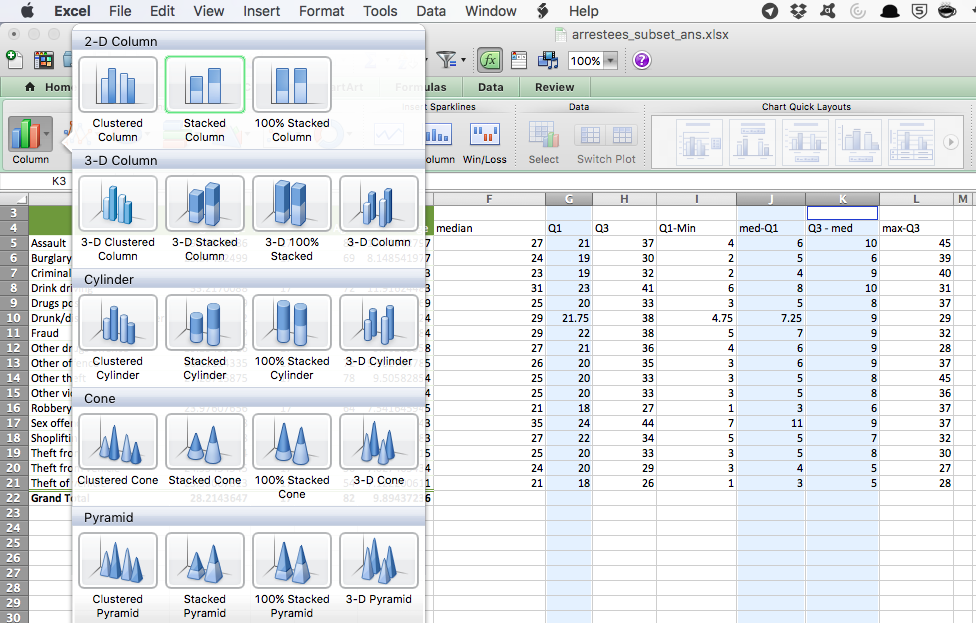


A chart like this should appear: 


First, let's create the bottom whisker. To do this click on any one of the bottom (blue in the chart above) segments of the stacked bar charts. Then select "Chart Layout" tab, and then on there, click on the "Error Bars" option: 


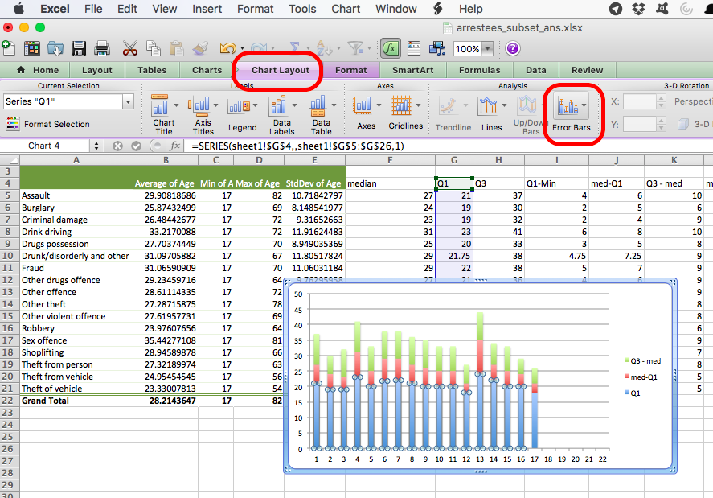


Select "Error Bar Options...":


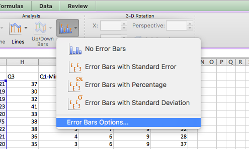


This will bring up a new popup window. Make sure that the "Error Bars" tab is selected on the left hand side. Then select the "Minus" option under Display, and under "Error amount" tick the button next to "Custom". Once you've done that, click on the button that says "Specify value":


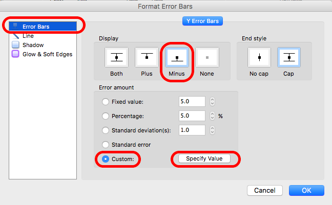


This brings up a new window, where you can select the value for the positive and negative error. Leave the positive as it is, and click inside the box next to "Negative Error Value", and then highlight the values in the `Q1-Min' column. Then click OK, like so: 


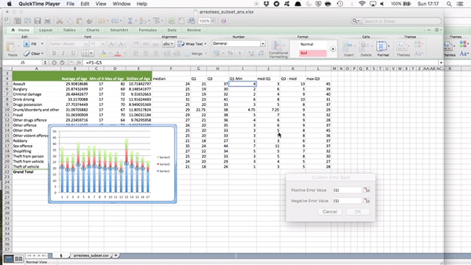


This will take you back to the original window, where you just need to click "OK" and you will see the bars appear. 


Now you want to take away the background bar so to do this, click on the blue bars again. Make sure that you click on the blue bars, and **not**  the error bars that you just created. When you have highlighted the blue bars, select the "Format" tab, and there you will see an option for "Fill" and "Line". Set the fill to "No fill" and the line to "No line": 


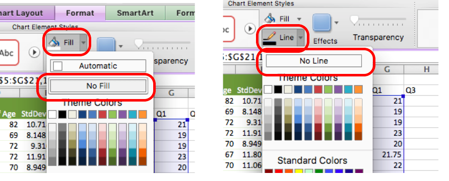


This should make the blue part disappear. 


Alright now let's make the top bar. This time click on the top bar (here in green) and again click on chart layout, error bars, error bar options... :  


This will open the pop up window again. This time select "Plus" under "Display", and again check "Custom" and click on "Specify Value":


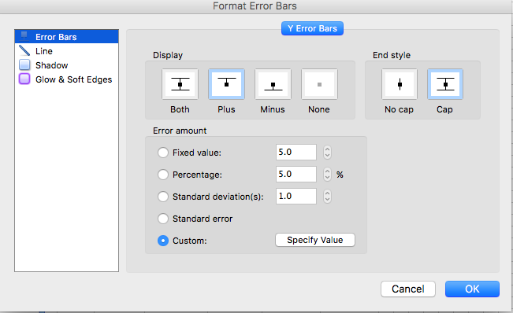


This time, leave the "Negative Error Value" as it is, and click inside the box next to "Positive Error Value", and then highlight the values in the `Max-Q3` column:


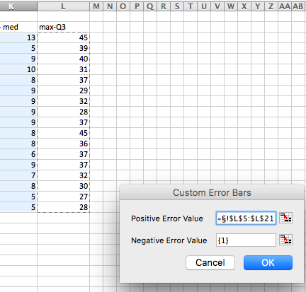


Click on OK, and then again, and you should see the top whiskers appear like so: 


So now you just have to change the formatting on the green and red parts, by clicking on each, and going again into the formatting tab, and selecting "No fill" for fill, and just a black colour for the outline under "Line":


Then, finally you should have a box plot that shows you the distribution of the numeric variable of age across each reason for offence: 


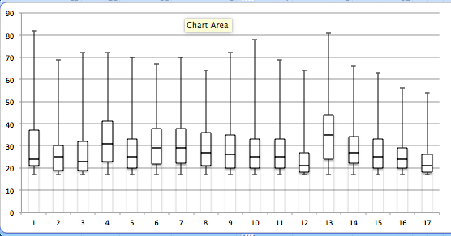


There is one last step to do though. The labels aren't very meaningful. They are just 1-17. Let's change these to meaningful labels. To do this, click on the labels, and right click, which should make a set of options appear. Click on "select data...":


This will open a new window. Click in the text box next to "Category (X) axis labels", and highlight the names of all the values for "reason for arrest" which we have here in column A: 


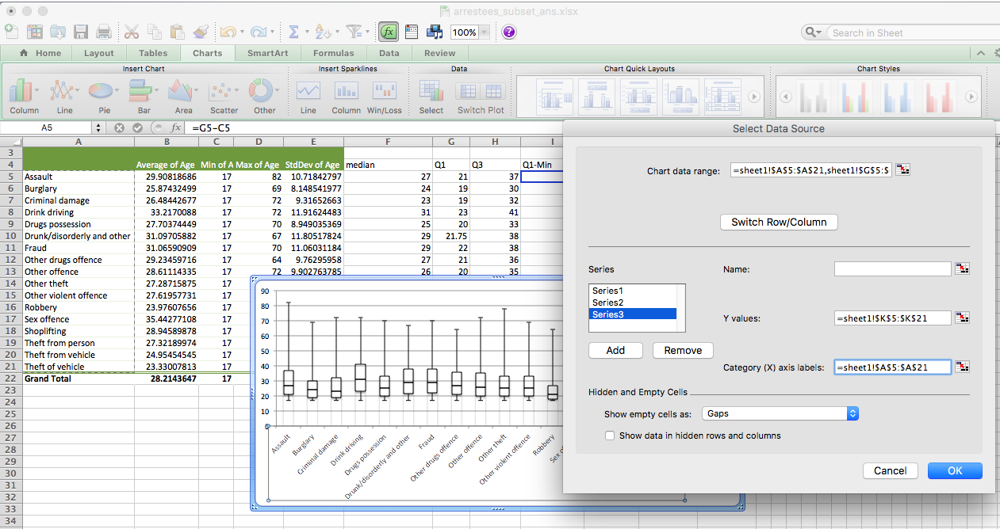


Then click "OK" and ta-daa you have a boxplot comparing the age distribution of people arrested for each one of these offences:


You can see that you tend to get younger arrestees for robbery as well as theft of vehicle. You can also see that the offences with older age groups being more represented are sexual offences, but also drink driving, drunk and disorderly, and also fraud. Of course there is quite a lot of overlap between the categories. 

-->

## Numeric v numeric


Regarding descriptive statistics to explore the relationship between two numeric variables in our sample, to analyse the relationship between two quantitative variables, we consider how one variable, called a response variable, changes in relation to changes in the other variable called an explanatory variable. Graphically we use scatterplots to display two quantitative variables, as comparing two numeric variables is best achieved through the use of graphics and visualisation. As you might imagine, it becomes very difficult to create any sort of crosstabs between numbers. Instead, you want to be able to determine whether there is a relationship between two numbers in other ways. We'll illustrate with two other variables from the arrestee survey. Let's consider the relationship between "Age at first arrest" and "Number of arrests". We might be interested about this if we are thinking about criminal trajectories, for example [delinquency careers](http://www.journals.uchicago.edu/doi/abs/10.1086/449107) or [life course trajectories](http://onlinelibrary.wiley.com/doi/10.1111/j.1745-9125.1995.tb01173.x/full). 


What would our inclination be? Clearly if the person has their first arrest earlier on in life, they have a lot more time to also have some more arrests. Or they might have an early arrest and part take in some sort of intervention whereby they turn their life around, and never offend again. In other words, we are thinking that either **as age of 1st arrest decreases, number of arrests will increase**, or we think that **as age of 1st arrest decreases, number of arrests will also decrease**. These two scenarios describe two different kinds of relationships, a positive relationship or a negative relationship. In either scenario we assume that as one goes up the other one goes up or as one goes up the other one goes down, but that this takes a linear relationship. If you imagine one numeric variable across the x axis and another cross the y axis, a positive and a negative relationship would look something like this: 


*Note:* 
The figure above shows you what a perfect positive relationship would look like, or a perfect negative relationship would look like. It also assume a **linear** relationship. This just means that we are looking at a "straight line trend " between the two variables. 


So as discussed, a graphical representation, in this case a scatterplot is the most useful display technique for comparing two quantitative variables. We plot on the y-axis the variable we consider the response variable and on the x-axis we place the explanatory or predictor variable.


How do we determine which variable is which? In general, the explanatory variable attempts to explain, or predict, the observed outcome. The response variable measures the outcome of a study. One may even consider exploring whether one variable causes the variation in another variable – for example, a popular research study is that taller people are more likely to receive higher salaries. In this case, age at first arrest would be the explanatory variable used to explain the variation in the response variable number of arrests.

In summarizing the relationship between two quantitative variables, we need to consider:

- Association/Direction (i.e. positive or negative)
- Form (i.e. linear or non-linear)
- Strength (weak, moderate, strong)


A scatter plot is a useful visual representation of the relationship between two numerical variables (attributes) and is usually drawn before working out a linear correlation or fitting a regression line, which are the next steps that you would take, if you were to also perform *inferential statistics*. The resulting pattern indicates the elements of the relationship outlined above, the association, the form, and the strength of the relationship between two variables. 


So what are some examples of correlations? Here are a few: 


- [Interactive Correlation Matrix and Scatter Plot All NBA Team Statistical Data 1951-2015 Seasons](http://asbcllc.com/blog/2014/december/nba_team_corr_matrix/scaled/)
- [Scatterplot of the Relationship Between Rotten Tomatoes Tomatometer Score and Box Office Revenue for Movies, for each movie genre](http://rebrn.com/re/relationship-between-rotten-tomatoes-tomatometer-score-and-box-o-2558335/)
-[Correlation between statewise obesity and voting for Trump](https://fsmedia.imgix.net/af/f3/d7/f5/b2df/470f/8f8c/4b41daf55348/the-correlation-between-trump-voters-and-obesity-has-a-strong-positive-correlation-at-0717.png?auto=format%2Ccompress&w=700)

You can understand the basic premise. 
### Activity 6: Does age at first arrest correlate with total number of arrests?

<span style="color:#d95f02">
So let's build one for our arrestees. Since we are trying to explain number of arrests with the age of first arrest, we would plot on the y-axis the variable we consider the response variable (number of arrests) and on the x-axis we place the explanatory or predictor variable (age of first arrest).


First, just return to the excel spreadsheet where you have your data. Firstly arrest the two columns that contain our variables of interest: 


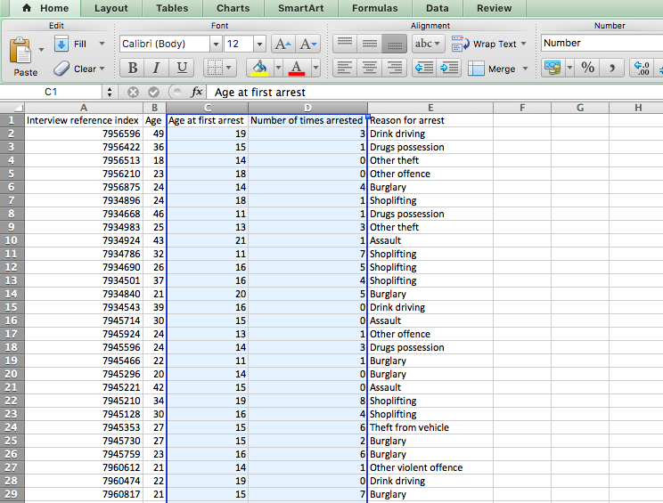


Then select charts > scatter > marked scatter:


The graph that initially appears might look something like this: 


You can see that actually we have age of first arrest on the x axis, and number of arrests on the y axis, as we prefer. If this was not the case, you can change this by right clicking anywhere on the chart, and selecting "Select Data..." on the options that pop up: 


 


and then on the popup there is an option to switch row/column: 


But in this case we are alright. One thing you should do though, is label your axes. Although, we might be able to infer that the axis with a value that goes up to 300 is not *likely* to be the one for age, it's always nice to have some certainty, and axis labels will provide this. To do this, click anywhere inside the chart, and click n the "Chart Layout" tab:


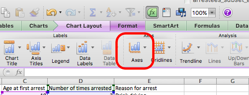


Then click on the "Axes" option, and for both horizontal and vertical axes add a title:


You can also stylize your scatterplot, make it look the way that you are most happy with it. [Here are some tips on making your graphs look pretty](http://strategyandanalytics.com/5-steps-creating-beautiful-eye-catching-charts-excel/). Here's mine:


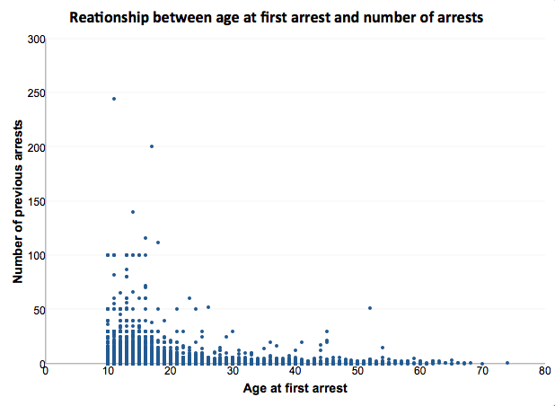


So let's try to infer our indicators of the relationship between the two variables. What about association/direction? Form? And strength? Well the easiest way to think about this is to think about drawing a *line of best fit*. Could you draw a straight line through the cloud of points? If yes what does this line look like? 


We can ask Excel to draw this line for us. You can do this by going back to the "Chart layout" tab, and this time clicking on the "Trendline" option: 


From the dropdown options, select "Linear trendline": 


Now you can see your trendline appear: 


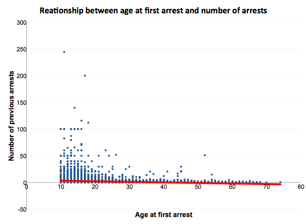
</span>

So what does this line look like? Well it definitely has a negative slope (it's pointing down, rather than pointing up). Therefore, in terms of the direction of the relationship, we can conclude that it is negative. In terms of strength, we want to look at the slope of the line. We saw above what a perfect linear relationship looks like. It's a slope of basically one-to-one. In this case it would mean that for every one year earlier that someone has their first arrest, they have one more arrest. We can see that the slope of our line is very close to *no slope* or a slope of zero, because it is essentially a straight line. To give you an idea of weak/strong relationships based on slope of a line, here is a handy image: 


You can imagine here that our relationship is quite weak, as it is close to a zero slope. Finally is the relationship linear or non linear? Well how well does this straight line represent your data? And where the points deviate from the line, do they do so in a systematic manner? To be fair, this question is a bit tough to answer, just on visual assessment through a scatterplot alone. As is the strength without a numeric interpretation of the slope. 


So far we have visualized relationships between two quantitative variables using scatterplots, and described the overall pattern of a relationship by considering its direction, form, and strength. We noted that assessing the strength of a relationship just by looking at the scatterplot is quite difficult, and therefore we need to supplement the scatterplot with some kind of numerical measure that will help us assess the strength. This is what inferential statistics like correlation coefficients will be able to do, but that's for the future. 


Even though in the rest of the time we talk about these we are going to focus only on linear relationships, it is important to remember that not every relationship between two quantitative variables has a linear form. There are several examples of relationships that are not linear. The statistical tools that will be introduced here are appropriate only for examining linear relationships, and as we will see, when they are used in nonlinear situations, these tools can lead to errors in reasoning. While we don't require it for this session, if you wanted to read up a bit about identifying linear vs non-linear relationships [here](http://blog.minitab.com/blog/adventures-in-statistics-2/linear-or-nonlinear-regression-that-is-the-question). 


But based on our observations, we can say that there appears to be a very weak negative relationship between the age of first arrest, and the number of times that someone has been arrested to date, in our sample of arrestees interviewed as part of this arrestee survey. And we can support this with our scatterplot as well. 


### Correlation does not mean causation


You may have heard this phrase before - that correlation does not mean causation. This is important to mention here, and for you to take this forward. Just because two variables show a relationship, even if it is a strong relationship, it does not mean that one actually causes the other, no matter how attractive telling that story would be.

There is an interesting site here that has a lot of **spurious** correlations. Spurious correlations are when there is a strong correlation between two or more variables that are not causally related to each other, yet it may be wrongly inferred that they are, due to either coincidence, or the presence of a certain third, unseen factor (referred to as a "common response variable", "confounding factor", or "lurking variable"). A good example is the relationship between drownings and ice cream. Ice cream consumption per capita increases at the same rate as people drowning in pools. But if you think about why this might be, I think you might struggle to find a reason why ice cream would cause drownings. But there is something that would cause an increase in both...! And that is the temperature. As temperature increases, particularly in the summer, there are more people outside, buying ice cream, but also more people outside swimming in pools, lakes, and rivers. 


Have a listen to this [ted talk](https://www.youtube.com/watch?v=8B271L3NtAw) which explains better. 
 


Spurious correlations are all over the place, and while sometimes they are very obvious, for example, here is one that correlates the number of films that Nicholas Cage has appeared in, and the number of people who drowned by falling into a pool: 


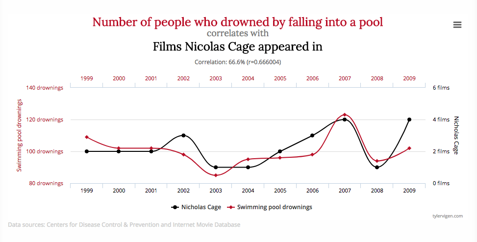

([and you can see more strange correlations here](http://www.tylervigen.com/spurious-correlations))


But in other cases its much more subtle. And can happen between variables that you can weave together a very nice story or explanation as for why they should be related. No matter what, you should think about these examples always when you are looking at correlations. We will talk later about study design, especially in relation to being able to infer causality, but do make a note now, to keep in mind in the future, that *correlation does not prove causation*. 


## Summary


In sum, you should now be able to begin to make comparisons between two variables in your data set, and talk about the possible relationships between them, and support (or question) the assumptions that you might have with some evidence. You should be comfortable with the following terms: 

- bivariate
- crosstab (or two-way frequency table, or contingency table)
- row percentage
- column percentage
- stacked bar chart
- conditional formatting
- producing summary statistics by groups
- if statements in excel
- association/ direction of a relationship between numeric variables
  + positive relationship
  + negative relationship
- form of a relationship between numeric variables 
  + linear relationship
  + non-linear relationship
- strength of a relationship between numeric variables
  + weak
  + moderate
  + strong
- scatterplot
- trendline
- correlation
- correlation does not mean causation


<!--chapter:end:004-week3.Rmd-->

# Week 4 {#week4}


## Learning outcomes

We as researchers all start off with a general area that we're interested in. As someone studying Criminology, you are likely to be interested in Criminology-related topics. You might want to learn about policing, or criminal justice practices, or you might be interested in something like [situational crime prevention](http://criminology.oxfordre.com/view/10.1093/acrefore/9780190264079.001.0001/acrefore-9780190264079-e-3). These are very broad interests that you may have, and within these there are many many sub-topics, and potentially research questions that you might want to explore. During the research process, the researcher becomes an expert in his or her field and the methods and techniques to be used for research. The researcher goes through several stages and must deal with the concept of variable and the assumption of its measurement. 


So far in this course we have always started with our variables. We obtain a data set which has variables that measure the things that we are interested in. The police.uk data has crime records, that we can use to explore difference in volume of different crim types, or difference in number of crimes between neighbourhoods, or potentially look at home crime rates change over time, with seasons for example. Or with the arrestee survey we saw variables that related to people's experiences with their arrests, and in the business victimisation survey with businesse's experiences of victimisation, and their perceptions of safety, as well as the precautions they take, measured in terms of their spending on IT security for example. 


In all these cases, we were presented with a set of variables, but without having much say in how the variables are defined in terms of representing the concepts that we want to be able to talk about when making sense of our data. A variable is a structure of characteristics, qualities, or quantities that in some form provide information about a specific descriptive phenomenon. Information that is provided by variables that are under study is fundamental for the researcher and data analyst. However, this information and its quality will depend on how variables are quantified and on the quality of its measurements. In all these cases we started with the data, but actually, most of the time, you are much more likely to start with the research questions you're answering. As a researcher you are interested to learn more about your chosen topic. Whether that's drugs, probation, stop and search practices of the police, online cryptomarkets, fear of crime, transport crime, police use of twitter, hate crimes, whatever it is, you want to focus on exploring your topic. You can explore these topics through data, if you can collect data, or data is already available for you to analyse. But how do you go from research topics and ideas and questions to actual variables? Well this is what we will learn today. 


Also we will discuss the manner in which you can collect these variables about a *sample* of people who represent the *population* in which you are interested. The term "**population**" is used in statistics to represent all possible measurements or outcomes that are of interest to us in a particular study. On the other hand, the term "**sample**" refers to a portion of the population that is representative of the population from which it was selected. The sample is the set of people from whom you take measurements. Everyone in your sample has one row that represents them in your data set. For example, in the arrestee survey used last week, every person arrested was a part of the **sample**, of people interviewed. Then, the results of any data analysis based on this sample can be used to make inferences about the **population** of all people arrested, if this sample was representative. 


This distinction might seem intuitive, but whether we're talking about our population or our sample when discussing our data, as well as whether we refer to *sample statistics* or *population parameters* will also surface as important in this week's material. 


### Terms for today:

- Sample and population
- Conceptualisation
- Operationalisation
- Measurement
- Constructs and composite variables
- Multi-item scales
- Reliability and validity (round 2)
- Recoding


## Population parameters versus sample statistics


*Hold on a second!* Population standard deviation? But so far we have only been talking about samples? Well, this week we also discuss sampling, right? And the differences between sample statistics and population parameters.  A statistic and a parameter are very similar. They are both descriptions of groups, like “50% of dog owners prefer X Brand dog food.” The difference between a statistic and a parameter is that statistics describe a sample. A parameter describes an entire population.


For example, say you want to know the mean income of the subscribers to a particular magazine—a parameter of a population. You draw a random sample of 100 subscribers and determine that their mean income is \$27,500 (a statistic). You conclude that the population mean income μ is likely to be close to $27,500 as well. This example is one of **statistical inference**.


If you are taking the second term module, Modeling Criminological Data, you will be introduced to techniques for making **statistical inference**. But essentially it refers to any process where you draw conclusions about a population based on the data analysis you perform on a sample of that population. Because you're using the statistics to make inferences, this process is called **inferential statistics**. 


With **inferential statistics**, you are trying to reach conclusions that extend beyond the immediate data alone. For instance, we use inferential statistics to try to infer from the sample data what the population might think. Or, we use inferential statistics to make judgments of the probability that an observed difference between groups is a dependable one or one that might have happened by chance in this study. Thus, we use inferential statistics to make inferences from our data to more general conditions; we use descriptive statistics simply to describe what's going on in our data.


Take the example of the Crime Survey for England and Wales.  The Crime Survey for England and Wales has measured crime in since 1981. Used alongside police recorded crime data it is a valuable source of information for the government about the extent and nature of crime in England and Wales. The survey measures crime by asking members of the public, such as yourself, about their experiences of crime over the last 12 months. In this way the survey records all types of crimes experienced by people, including those crimes that may not have been reported to the police. It is important that we hear from people who have experienced crime and also those who have not experienced any crime in the last 12 months, so that we can show an accurate picture of crime in the country.


Each year around 50,000 households across England and Wales will be invited to participate in the survey. In previous years three quarters of households invited to take part agreed to participate. While this does encompass a lot of people, you can see how it's not the entire population of England and Wales. Instead it is a **representative sample**. 


While reporting sample statistics from the sample might be interesting (ie to talk about whether men or women have higher worry about crime), the more interesting approach is to make inferences about the population at large. Do men and women *generally* have different approached to fear of crime? In order to answer these questions, criminologists use ***p-values** and **effect sizes** to talk about the relationships between two variables in a population. Since in this course we mostly talk about the relationships between variables n a sample, we talk about the sample statistics. So you will learn about inferential statistics in the future. But for now it is important that you note this different between **sample statistics** and **population parameters**. 


They even have different notation. For example, you would use x-bar (x̄) to talk about your sample mean, but mew (μ) to talk about your population mean. Similarly, you can calculate the standard deviation for your sample, or for your population. In each instance, you can measure each for your sample, and then infer it for your population. How do you do this? Well, you make use of something called the **sampling distribution of the mean**. 


The mean of the sampling distribution of the mean is the mean of the population from which the scores were sampled. Therefore, if a population has a mean μ, then the mean of the sampling distribution of the mean is also μ. The symbol μM is used to refer to the mean of the sampling distribution of the mean.


Let's explore this with some data. Download the heightsAndNames.xlsx file from Blackboard. 


Open this data with Excel. You can see we have 3 variables. One variable is the people's names, one is their height, and the third variable, I created, putting these people into 6 different samples, assigning them randomly. Let's assume that everyone in this excel spreadsheet is our population. Everyone here is everyone who exists, these 300 people are the only people that exist in our population. Now let's suppose that we don't have all their heights. Let's suppose that we do not have the budget to measure the height of all these 300 people, and instead we have to measure the height of a sample of 50 people. 


Let's say we initially select sample 1. You can filter to show only sample 1 in excel by using the "filter" option. Click on the data tab in excel, and the filter option (the little funnel icon): 


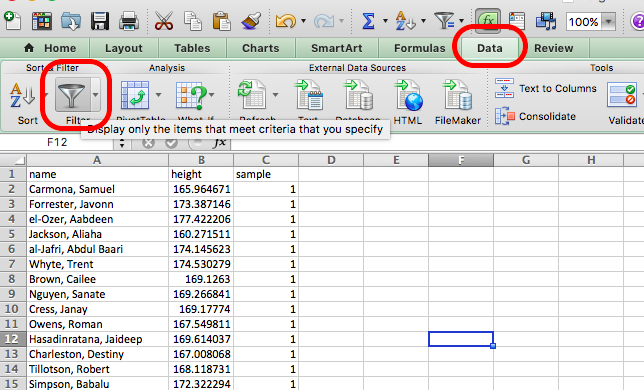


When you click this, little downward arrows should appear next to the column names for each one of your variables. Click on the one next to the "sample" variable: 


When you do this a little window will appear. In this window you will see all the possible values that the "sample" variable can take. In this case, it's the numbers 1 through 6, as there are 6 possible samples of 50 people that we have, from these total population of 300 people. Everything that has a ticked box next to it will appear, while everything that does not will get filtered out. 


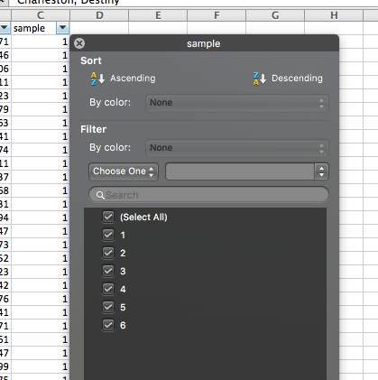


Untick the box next to every single sample, except sample 1. Like so: 


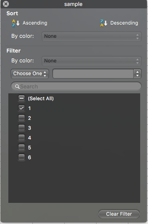


When you do this you should see in your data that all the other rows will disappear, and you will see only the ones where the value for the "sample" variable is "1". 


So now we have our first sample of our population. We have a sample of 50 people, and we use these 50 people to collect data. In this case, the data we collect is their heights. Let's say we're interested in their average height. We can get this, using the `=AVERAGE()` function in excel. 


So let's create a small table in another sheet in our excel spreadsheet, that calculated the average height for our sample 1. To do this, create a new sheet (by clicking on the little plus sign at the bottom of your excel page):


Then in this new sheet, create a cell for each sample, from sample 1 to sample 6. Like so: 


Then, in the cell next to the "sample 1" cell, enter the `=AVERAGE()` formula. Click inside the brackets, and go select the values for height, in your sample 1. 


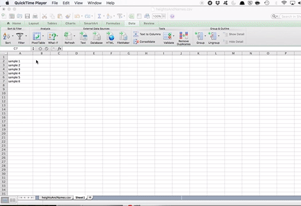


Repeat this for each one of the samples. So each time, go to the little down arrow next to the "Sample" column, select the next sample (so first 2, then 3, then 4, and so on), and each time, calculate the average height for the sample. 


You should end up with the average height for 6 different samples of your 300 people: 


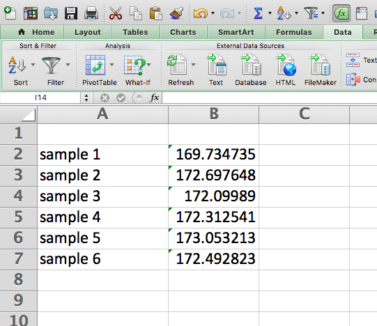


Now this is interesting. Depending on which sample you end up with, you get a different **sample statistic** for the mean. With only one of the samples, you would use that sample statistic to make inferences about the population parameter. So if you ended up with sample 1, you would assume the average height is 169.7 centimetres. On the other hand, if you ended up with sample 5, you would say the average height is 173.1 centimetres. 


Well, in our special case, we can know the population parameter. To get this, simply get rid of your filters, so you have all 300 observations, and get the average for these. I'll let you figure out yourself how to do this. Add it as a row in our table of averages, under the "sample 6" average. 


So... did you get it? 


The average height for our population is about 172.1 centimetres. So our sample statistics are all sort of near this measure, but depending on which sample we end up with, we do better, or worse with getting near this number. Now I'm going to show you something neat. 


Take the average of the averages. That's right. What is the average of all 6 sample averages? You guessed it, it's equal to our population average! It's also about 172.1 centimetres. Now I cheated a bit here, because we have non-overlapping samples without replacement, so you do end up taking your population sample, but actually, if you repeatedly sampled from a population, over and over again, and then took the average height in each sample, and then finally, after infinitely many samples, you took the average of all of the averages, it would be equal to the population parameter. 


This is something called the **sampling distribution of the mean**.  


We will never have many many many samples of the same thing, right? Surveys are costly, and we are happy if we can run it once. So instead of running the same survey many many times on different samples of the population, we can rely on another mathematical rule, called the **central limit theorem**. The Central Limit Theorem states that the sampling distribution of the sampling means approaches a normal distribution as the sample size gets larger. The Central Limit Theorem tell us that as the sample size tends to infinity, the of the distribution of sample means approaches the normal distribution. This is a statement about the SHAPE of the distribution. A normal distribution is bell shaped so the shape of the distribution of sample means begins to look bell shaped as the sample size increases. 


You can watch [this video](https://www.youtube.com/watch?v=JNm3M9cqWyc) to learn about central limit theorem some more. 


Further, something called the **Law of Large Numbers** tells us where the center (maximum point) of the bell is located. Again, as the sample size approaches infinity the center of the distribution of the sample means becomes very close to the population mean. Basically, it means that the larger our sample, to more we can trust that our sample statistic reflects the population parameter. 


Give this a go in our heights data in excel. Let's select a mega sample of 150 people. Let's use odd numbered samples: 1, 3, and 5 to do this. Calculate the average height of all the people who are in these 3 samples. To do this, go back to your filtering, and make sure that the boxes next to 1, 3, and 5 are all ticked. Then calculate the average. Add this as a new row in your sheet where you've already calculated all the averages. Pretty close to our population mean, no? 


Let's try also for the even numbered samples, 2, 4, and 6. Add this as a new row as well. So? Close? I would say so: 


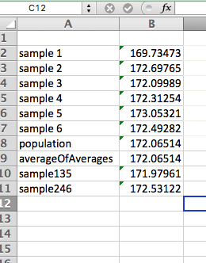


If you're still unsure, [this video may help](https://www.youtube.com/watch?v=agBcvkyi6sg) as well as [this one](https://www.youtube.com/watch?v=iN-77YVqLDw). 


This might not seem obvious at first, but really, it's something that you probably already use in your everyday life. Think about when you are visiting a new city and you are looking to find a nice place to eat. You might use tripadvisor. Or yelp. In case you're not familiar, these are review sites, where people can give a star rating (usually out of 5) to an establishment, and then others looking to visit these venues can see what ratings others have given them. You probably have used something like this, when you are exploring a new part of town, or in an area you might be unfamiliar with. And chances are, you refer to the law of large number when deciding where to eat. Take this example. You come across the below reviews: 


and 


You can see that actually review 1 has the higher mean score, right? It's got a score of 5 stars, the maximum amount of stars which you can have. Compared to that, the restaurant in review 2 has only 4 stars. So based on this rating alone, and no additional information, your ideal option is to choose the restaurant in the first review, "Fantasy Manchester". But you most likely wouldn't. Chances are, if you were going by the rating information only, then you would be more likely to select the restaurant in the 2nd review, Little Yang Sing. And that is because of the number of reviews. With only 2 reviews for "Fantasy Manchester", you cannot be certain that a diverse set of opinions is represented. It could be two people who are really biased for all you know, such as friends of the owner. On the other hand, you know that the 33 people who reviewed "Little Yang Sing" will represent enough variation that it might include some biased people, but on the whole will be a better representation of the experience that all diners have, and therefore a better indication of what your experience will be like. In other words, the sample statistic of the 4 stars, is probably closer to the population parameter, which is the possible star rating that the restaurant would get if everyone who ever visited, and will ever visit, were to rate it. On the other hand, the true score for "Fantasy Manchester" might be very different to the 5 stars we see from the sample, if we were to be able to get a hold of the population parameter. 


Hopefully this illustrates  little bit about the difference between a sample and the population, but also how we can make inferences from the sample about the population, and how the larger your sample is, the more you can rely on the sample statistics reliably representing the population parameters. 


The population standard deviation you can also estimate from your sample, and the relevant sample statistics. In fact, we very briefly touched on this last week. Remember the possible options for STDEV and STDEVP? When we were calculating the standard deviation column there were two choices there, StdDev and StdDevp. The one to choose will depend if you would like to know the standard deviation of your sample or your population. There is a slight difference in how you calculate your standard deviation, based on whether we are talking about our sample or our population. The first part is all the same. We still look at the difference between each measurement and the mean. And then we still take the square of these differences. However, the next step, where we calculate the standard deviation for the sample, we divide by the number of observations in our sample. *However* if we were calculating the standard deviation for our *population* we would divide by the number of observations in our sample **minus one**. Why minus one? Well this is because instead of dividing by the sample size, we are dividing by another values, one called the **degrees of freedom**. 


What is **degrees of freedom**? In statistics, the number of degrees of freedom is the number of values in the final calculation of a statistic that are free to vary. What does this mean? Well imagine that we know what our sample statistic for the mean is. Let's say that it's 172. And we also know how many people are in our sample. Let's assume we have a mini sample of 5 people. The degrees of freedom here represent the number of people for whom we can freely choose any height we wanted. Which just happens to be one minus the sample size. Why? Let me illustrate: 


Here are our 5 people: Alice, Bob, Cecilia, Daniel, and Elizabeth. We know that their average height has to be 172 centimetres. This is a given. 

So how tall can Alice be? Alice can be any height we want. Pick a number for Alice. Let's say she's tall. Alice is 195cm tall. Good. Now Bob. How tall is Bob? Again you are free to pick any number. Bob can be 185 cm tall. Cecilia? Again, any height we want. Let's say 156. Daniel? Again we can pick any height for Danuel. Let's say he's a tall one, at 200cm. What about Elizabeth? Well for her, she can only take one possible height. Why? Well we know the height of the other 4 now, and we also know the average. If we treat Daniel's height as an unknown `X` cm tall, we can write this as the following equation: 


`(195 + 185 + 156 + 200 + X) / 5 = 172`


From your days of maths this might look familiar, but even if it does not, you should be able to know that this equation only has one solution. X can only be one value. Because we *know* what the final average will be, and because we could freely choose the heights of the first 4 people, the 5th height is restricted (in this case it will have to be 124cm, so Daniel is the shortest in our sample). Therefore we are only *free* to choose the first 4 heights, which is our sample *minus 1*. Our degrees of freedom are sample *minus 1*.  As degrees of freedom refers to the number of independent ways by which a dynamic system can move, without violating any constraint imposed on it, this is why it is called number of degrees of freedom. In other words, the number of degrees of freedom can be defined as the minimum number of independent coordinates that can specify the position of the system completely. As illustrated above, in this case that is the sample size minus one. 


So when you are calculating the standard deviation for *the population* you divide by the degrees of freedom, rather than by the number of observations in your sample. This is the difference between the StdDev and StdDevp functions in Excel to calculate your standard deviation. 


Now, why are we talking about this again? Well this will all come in handy when we're calculating and validating our measures for the various concepts that we're going to study and collect data on to be able to draw meaningful conclusions about. But I'm jumping a bit ahead. Let's first start with the concepts. 


## Conceptualisation


We will start this week with introducing the term **conceptualisation**, which seems appropriate, as you would start most of your research with this step of the data analysis process. **Conceptualisation** is the first step in the process of turning your research questions and topics of interest into variables that you can measure and collect data, in order to be able to answer your questions. **Conceptualisation** is the process by which you define the things you're interested in, and define them as **concepts**. This means you have to decide what you will and what you won't include as relevant to your topic, or to your concept. Let's illustrate with an example. 


Let's say we're interested in studying education. Defining what we mean by education here is the process of conceptualisation of this topic. Let's say we conceptualise education as “Amount of knowledge and training acquired in school." Then we can say that we want to consider all the education that people learned while enrolled in the K-12 system, but that means that we would not include in this definition non-traditional approaches to education, such as home schooling, or people who return to school later, or take classes from prison, for example. You can start to get a sense of what impact conceptualisation can have on your findings, no?


Let's take another example, let's consider that we want to study "social status”. How we conceptualise social status will have implications for what it is that we might consider in the scope of our study, and what we would not. For example, if we consider social status to be made up of the *dimensions* of wealth, prestige, and power, then we want to somehow collect data about these particular elements of social status. But we might ignore other elements of the concept, which others might deem relevant, such as social capital (the networks of relationships among people who live and work in a particular society, enabling that society to function effectively). Now this is important, because if someone else wants to also study social status, and has a look at our study, they should be clear on what was and what was not included, and so they can make their own decisions about our study and approach, but at least we are transparent about this, and can use this to make sure that we can justify our results.


To really demonstrate this, it's a good idea for you to have a go at conceptualising something yourself. Let's assume that you are interested in studying hate crime. In particular you are interested in hate speech over social media. Let's say you pick twitter as your case study. Now you have to **conceptualise** what it is that you mean by hate speech. This is important so that both you, and anyone reading your study later is clear about what should be included in your study, and what should be excluded. You can imagine that this is a very important step, since what is included/ excluded. 


So imagine you are about to embark on a study of *hate speech*. You have some twitter data, which includes 100,000 tweets, and you want to be able to select which one of these tweets includes hate speech, and which one does not. For you to be able to carry out this research, and be transparent about it as well, ensuring reproducibility of your work, you need to conceptualise hate speech in a clear, detailed, and specific way. So take a moment now, and working with someone near you, conceptualise hate speech. Write down your conceptualisation of hate speech - how you define hate speech for the purposes of your study. When you have your concept ready, talk it over, and make sure that this is a comprehensive definition that you are all happy with. 


It's important that you play along and do this step. I'll wait here while you discuss. 


OK, ready? Great, now let's test your conceptualisation of hate speech. *Relying strictly on the way that you conceptualised hate crime in the steps above*, for each of the following tweets, record whether it would be included in your study as exhibiting hate speech or not: 


What about this one?


And finally this third one?


All three tweets were considered hateful and as exhibiting hate speech by many people (see [here for the first and last one](http://www.pressgazette.co.uk/katie-hopkins-leaving-lbc-radio-effective-immediately-station-announces/), and [here about the second one](http://www.bbc.co.uk/news/uk-scotland-glasgow-west-30641705)). By reading them, with our human sentiment, we can appreciate that all three tweets are hateful. But how did they do against the way that you conceptualised hate speech? Would they all be included in your study?  Did you include everything according to your criteria that you would have liked to include, based on your human understanding of what hate speech means? 


If you did, that is very impressive. If you did not, don't despair,  I started you off with a tough one. Hate crime in general is very complex, and therefore tough to conceptualise and define. There is no criminological consensus on the definition or even the validity of the concept of hate crime. There is legislation in this country to account for hate crime, and generally they reflect the core belief that hate crime policy should support a basic human right to be free from crime fuelled by hostility because of an individual’s personal characteristics, but even in legislation this is quite hard to pin down.


But conceptualising what you mean (and therefore also what you don't mean) by hate crime a is very important step in your research, as it can influence what data you collect, and therefore the outcomes of your study, and the findings you'll be able to report. For the purposes of a research study, it can influence who your results are relevant for. Remember when we spoke about generalisability and validity in the first week's feedback session? I'll return to these later, but it's important to consider that the way that you conceptualise your concepts will determine how much you can generalise from your results, or how valid your measurements are. For example, did you include hate against all the protected characteristics? Did you consider hate as only threats of violence, or also general antagony as well? Conceptualisation is a very important step, that affects the measurement we will discuss in the next section, but that affects all the next steps in your study. How you decide what to measure has implications for what sorts of conclusions you can draw from your data after analysis. 


You will have seen this in your preparatory reading, in Chapter 5 ("Research Design") of the book 'The Practice of Social Research' by Earl Babbie, but I will quickly re-iterate here: based on your conceptualisation of your variable, it will fall into one of three categories: 


- *Directly observable*: something that you can observe through measuring or counting or physical observation. Examples include physical characteristics of a person. 
- *Indirectly observable*: something that you can measure with a single question. Examples include the person's salary, or their ethnicity - you can just ask one question and this will be enough to identify the value for that variable for the person responding. 
- *Constructs* : a more abstract concept, something that isn't necessarily "out there" to be measured using simple measurement tools. Constructs are often representative of complex social processes, and require more intricate measurement approaches. Examples include fear of crime, and trust in the police. 


So our concept of hate speech, which one of these objectives does it fall under? Can you measure it directly or indirectly with a simple question? Or is it a more complex concept, that perhaps requires the measurement of multiple indicators of hate, in order to build a fully complete picture of what is hate speech? 


Think about this for a moment. Turn to someone next to you and talk through which one of these you think hate speech would fall under. Discuss why you think this. Then read on, to see if you thought the same. 


So you've hopefully taken some time to formulate your own thoughts on this topic, and now I can go on to discuss some approaches conceptualising hate speech. First let's consult the legislation: 


Not all hate incidents will amount to criminal offences, but those that do become hate crimes. The Association of Chief Police Officers and the CPS have agreed a common definition of hate crime: "Any criminal offence which is perceived by the victim or any other person, to be motivated by hostility or prejudice based on a person's race or perceived race; religion or perceived religion; sexual orientation or perceived sexual orientation; disability or perceived disability and any crime motivated by hostility or prejudice against a person who is transgender or perceived to be transgender."


This definition is quite an important one, because it has an effect on sentencing, when it comes to criminal offences. If evidence can be presented that the offence was motivated by hate, or for any other strand of hate crime, the CPS can request enhanced sentencing. So this seems a pretty important definition. But how can we translate this into a concept of hate speech? How do we make sure that our concept encapsulates all the possible versions of hate speech that we are interested to study?


One approach could be to conceptualise hate speech as an **indirectly observable** variable. You, could, as was done in this paper looking at [Cyber Hate Speech on Twitter](http://onlinelibrary.wiley.com/doi/10.1002/poi3.85/full) consider hate speech to be the extent to which people consider a tweet offensive or antagonistic. In this case (we are jumping slightly ahead into measurement, but it all link in any way), this would be measured with a single-item question where you just present people with a tweet, and ask “is this text offensive or antagonistic in terms of race ethnicity or religion?”, providing people with a set of possible answers of yes, no, or undecided. (You might notice that this study did *not* include all protected characteristics, mentioned in the CPS definition, instead they focus on race ethnicity and religion only). In this particular study, they presented the same tweets to many many people, and so possibly the single-item measure could have worked as an indicator of hate, since multiple people rating the same tweet would eventually cancel out people who have a very high or very low threshold for classifying something as offensive or antagonistic. In this case, hate speech is conceptualised as people considering a tweet as antagonistic or offensive in terms of race ethnicity or religion.


However if you were surveying individuals only about each tweet, and were interested in what certain people class as hate speech or not hate speech, you might want to consider a more complex assessment. You might conceptualise something being hate speech as something that evokes a variety of emotions from people and you might want to ask about all these measures in separate questions, to make sure that you are really tapping into what hate crime means to people. In this case, you would be conceptualising hate speech as a **construct**. If you recall from the reading (or above) *constructs are theoretical creations tat are based on observations, but that cannot be observed directly or indirectly. Concepts such as compassion and prejudice are construcs created from your conception of them, my conception of them, and the conceptions of all those who have ever used these terms, They cannot be observed directly or indirectly, because they don't exist. We made them up.* Constructs are usually complex and not easily measured with a single item. Instead we tend to approach them my measuring their many indicators, and assembling the responses to those to create a measure that is more reliable and less prone to random measurement errors than single-item measures, since a single item often cannot discriminate between fine degrees of an attribute. So if you have conceptualised hate crime as something more abstract and complex, and therefore a construct, that would mean you would have to measure in a different way, than the example given from the paper above. In the next section we'll explore exactly how conceptualisation affects measurement. 


## Measurement


> In science, we use measurement to make accurate observations. All measurement must begin with a classification process—a process that in science is carried out according to systematic criteria. This process implies that we can place units of scientific study in clearly defined categories. The end result of classification is the development of variables.

- *Chapter 2 Statistics in Criminal Justice - David Weisburd, Chester Britt*


The point of conceptualising your topics into concepts is to be able to come up with the optimal approach to measuring them, in order to be able to draw conclusions, and talk about criminological concepts with the support of empirical data. Data that arises from measurement are referred to as **empirical** data. So what can be empirical data? Well it's anything that criminologists, data analysts, or anyone interested in and carrying our research will measure, in order to be able to answer their research questions, and be able to talk about their topics of study. 


> Empirical data arise from our observations of the world. (...) Among the many prevailing views of the role of empirical data in modern science, there are two opposing extremes. On the one hand, the realist assumes data are manifestations of latent phenomena. In this view, data are pointers to universal, underlying truths. On the other hand, the nominalist assumes data are what they describe. From this latter point of view, as the philosopher Ludwig Feuerbach noted, “you are what you eat.” We use the historical realist-nominalist terminology to emphasize that these differing perspectives, in one form or another, have origins in Medieval theological controversies and their classical antecedents in Greek philosophy. Many working scientists adopt some form of a realist position, particularly those in the natural sciences. Even social scientists, despite the myriad particulars of their field, have often endorsed a similar position. 

- Leland Wilkinson (2005) *The Grammar of Graphics*


Depending on how you've conceptualised your topics you're interested in will affect how you can measure them. To measure is a process that involves observing and registering information to reflect qualities or quantities of a particular concept of interest. 


Think back to some of the studies you might be learning about in your other courses. What sort of questions do they answer? How do they decide how to measure the concepts that they are interested in? It's worth going through some papers you might be interested in, in order to see how they all go about these steps. You will normally find this sort of detail in the *methodology* section of a paper. 


For example, in this paper by Tom R. Tyler about [ethnic group differences in trust and confidence in the police](http://journals.sagepub.com/doi/abs/10.1177/1098611104271105) if you find the *method* section, you will see a brief discussion of the sample, followed by a list of the concepts of interest (which will be the variables in the analysis, if you skip ahead to results, you will see this), and a description of how they were measured. For example these are a few listed: 


- *Cooperation with the police*: People responded to three questions, which asked “How likely would you be to call the police to report a crime that was occurring in your neighborhood?” “How likely would you be to help the police to find someone suspected of committing a crime by providing them with information?” “How likely would you be to report dangerous or suspicious activities in your neighborhood to the police?”
- *Cooperation with the community*: People responded to three questions, which asked the following: “How likely would you be to volunteer your time on nights or weekends to help the police in your community?” “How likely would you be to volunteer your time on nights or weekends to patrol the streets as part of a neighborhood watch program?” “How likely would you be to volunteer your time on nights or weekends to attend a community meeting to discuss crime in your community?”


So how do we get to this step of measurement, from the conceptualisation step? 


Remember the points from above, and from the reading about how concepts can be directly observable, indirectly observable, or constructs? Well depending on what these are, will affect their operationalisation, or how we can go about measuring them.


Exact sciences work with directly observable variables, such as people's height, body temperature, heart rate, and so on. These are easy to measure through direct observation. There are instances when variables of interest in social sciences as well would fall into the category of directly observable. Directly observable variables are those which you can measure by observing. Can you think of any? 


One example of directly observable variables would be the number of people on the street, at any given time. This would be an important variable to know if we are trying to accurately estimate crime risk. Crime risk is calculated by dividing the number of crimes in an area by a relevant measure of the population at risk. For example, you will often hear about crimes per 100,000 population. This would be important to calculate because sometimes a location can seem like it has very high crime counts, but perhaps that's because there are a lot more people there. Remember when we compared the number of crimes per borough in Greater Manchester, and actually found that Manchester had significantly more than anywhere else? Well Manchester has also a lot more people going through it. So if we are trying to estimate *risk* it's a different question. So if there are two streets, both had 100 robberies on them last year, but one street is oxford road, and the other is a quiet side street with much fewer people passing by, then even thought the count is the same, the risk to each individual is very different. So to be able to calculate this, we would need to count the number of people who walk down each street, to find an accurate measure of the total possible people who *could* become victims, and be able to use this number to calculate risk. This is a **directly observable** variable, and so the approach to measuring it can be something like counting the number of people who walk down the street. 


The next category is the **indirectly observable** variable. They are "terms whose application calls for relatively more subtle, complex, or indirect observations, in which inferences play an acknowledged part. Such inferences concern presumed connections, usually causal, between what is directly observed and what the term signifies" [Kaplan, A. (1964). The conduct of inquiry: Methodology for behavioral science. San Francisco, CA: Chandler Publishing Company, p. 55.](https://books.google.co.uk/books?id=wxwuDwAAQBAJ&pg=PT89&lpg=PT89&dq=%22terms+whose+application+calls+for+relatively+more+subtle,+complex,+or+indirect+observations,+in+which+inferences+play+an+acknowledged+part.+Such+inferences+concern+presumed+connections,+usually+causal,+between+what+is+directly+observed+and+what+the+term+signifies%22&source=bl&ots=0_ySczx0oG&sig=WVdwNE7mUzF_d8dfBk2R_Tq4clw&hl=en&sa=X&ved=0ahUKEwihna-v5OrWAhXMYVAKHXvEBpIQ6AEIJjAA#v=onepage&q=%22terms%20whose%20application%20calls%20for%20relatively%20more%20subtle%2C%20complex%2C%20or%20indirect%20observations%2C%20in%20which%20inferences%20play%20an%20acknowledged%20part.%20Such%20inferences%20concern%20presumed%20connections%2C%20usually%20causal%2C%20between%20what%20is%20directly%20observed%20and%20what%20the%20term%20signifies%22&f=false). If we conducted a study for which we wished to know a person’s income, we’d probably have to ask them their income, perhaps in an interview or a survey. Thus we have observed income, even if it has only been observed indirectly. Birthplace might be another indirect observable. We can ask study participants where they were born, but chances are good we won’t have directly observed any of those people being born in the locations they report. The way that you would measure these concepts is usually through single-item questionnaires. What does this mean? Single-item just means that you ask one single question , and the answer given to that one question is sufficient to measure your concept. 


The next category is where it gets a bit more complicated, but this is where the beauty of social science measurement really comes to life. Because we are interested in complex behaviours, interactions, relationships, and perceptions and opinions, our concepts in social sciences are often too abstract to be approaches through direct or indirect observation. Consider the example from the paper on ethnicity and trust in the police linked above. You can see that each one of those concepts is measured by people's answers to multiple questions, which all come together to indicate the concept. These sort of complex concepts, that require such measurements are our last category, the **constructs**. Constructs such as *cooperation with the police* or *cooperation with the community* are more abstract than either observational terms or indirect observables, but we can detect them based on the observation of some collection of observables. Let's explore how this works, in the section below.


### Measuring constructs with composite variables 


As you see above, **constructs** are complex variables. As researchers we try to measure our constructs as best as we can.  Often we can see and measure indicators of the constructs, but we can not directly observe or measure the constructs themselves. Instead we infer these constructs,  which are unobserved, hidden, or latent, from the data we collect on *related variables* which we *can* observe and directly measure.


We can combine the results from these related variables into a **composite variable**. A **composite variable** is a variable created by combining two or more individual variables, called indicators, into a single variable. Each indicator alone doesn't provide sufficient information, but altogether they can represent the more complex concept. Think of the indicators as pieces of a puzzle that must be fit together to see the big picture. 


A lot of work goes into creating composite variables. The indicators of the multidimensional concept must be specified. It's important that each indicator contribute unique information to the final score. The formula for combining the indicators into a single score, called aggregating data, must be established. The computation involved will depend on the type of data that is being aggregated. To aggregate the data, raw scores might be summed, averaged, transformed, and/or weighted.


One example of a composite measure of health is the Body Mass Index. The BMI was developed by Lambert A. J. Quetelet in the early 19th century as a means for assessing the degree of obesity of the general population. The indicators are height, weight, and age.


A person's BMI is calculated like this: Multiply height in inches by itself (i.e., if x = height, find x^2). Next you would divide the same person's weight in lbs by the first number (the square of his or her height). Last, you would multiply that answer (the quotient) by 705. The result is a person's final score for the composite variable, BMI. Based on this score, we can determine a person's relative degree of obesity - a component of health. 


Methods of simple averaging, weighted averaging, and meaningful grouping can all be used to create composite variables. Different methods are more appropriate in different contexts. Each approach to creating composite variables has advantages and disadvantages that researchers should weigh carefully. 


There are several ways to accomplish averaging. The specific method of averaging can be chosen based on whether the original variables intended to be combined are *numeric* or *categorical*.  When original variables are *numeric*, simple averaging can be considered. I say simple averaging, but nothing's ever truly *simple* is it? Let me briefly touch on this complication: 


When you are working with numbers, the unit of measurement can influence how big or small these numbers are. Consider height for example. If I measure your height in centimetres, milimeters, or inches, I will get very different numbers. But if I measured everyone's heights in the class, and plotted them, no matter what unit I used (*cm*, *mm*, or *in*) I would end up with the sample plot right? You might be taller (or shorter) than the person sat next to you, and no matter what unit I use to measure your height, this will stay true. 


Similarly, where your height sits in comparison to the average height in the class with stay too. Remember how we measured the distribution of data points around the mean in the past weeks? We used the *standard deviation*, right? Standard deviation was something we used to indicate the distribution of the individual points we measured around the mean. And above we discussed how to calculate the standard deviation for the population, and how that's different to the standard deviation for the sample. The standard deviation is a tool that we can use, in order to be able to standardize our numeric measurements. We can do this using **z-scores**. 


*What is a z-score???* Simply put, a *z-score** is the number of standard deviations from the mean a data point is. But more technically it’s a measure of how many standard deviations below or above the population mean a raw score is. A z-score is also known as a standard score and it can be placed on a normal distribution curve. Z-scores range from -3 standard deviations (which would fall to the far left of the normal distribution curve) up to +3 standard deviations (which would fall to the far right of the normal distribution curve). However you can get z-scores larger (or smaller) than 3, in the case of outliers, which are data points that are very far away from the mean. So don't worry when you get z-scores outside this range. In order to use a z-score, you need to know the mean μ and also the population standard deviation σ.


Z-scores are a way to compare results from a test to a “normal” population. Results from tests or surveys have thousands of possible results and units. However, those results can often seem meaningless. For example, knowing that someone’s weight is 150 pounds might be good information, but if you want to compare it to the “average” person’s weight, looking at a vast table of data can be overwhelming (especially if some weights are recorded in kilograms). A z-score can tell you where that person’s weight is compared to the average population’s mean weight.


Let's have a go at calculating z-scores. The basic z score formula for a sample is:


`z = (x – μ) / σ`


For example, let’s say you are 180 cm tall. Given our mean (μ) of 172.1 and a calculating a standard deviation (σ, in the case of our heights data, it's 5), we can calculate the z score. 


But first, to calculate the z-score, our data needs to meet some assumptions. First it needs to be a numeric variable. To be fair though, in order to calculate a mean and a standard deviation in the first place, we needed this variable to be numeric. But the other assumption it makes is that this numeric variable follows a **normal distribution**. You might remember this concept from the very first week, when you watched the [joy of stats](http://www.gapminder.org/videos/the-joy-of-stats/) video by Hans Rosling. If you didn't watch it, well you definitely should! But in any case, here's a quick video to re-cap normal distribution to you, this time by Chris Wilde: 


You can identify a normal distribution, because it follows a normal distribution curve, also called a *bell curve*: 


So how do you test if your numeric variable is normally distributed? Well, for now we can simply decide this by plotting it in a histogram, and see if it (roughly) looks like it follows a bell-curve shape or not. So let's build a histogram of our height variable. Do you remember how to do this? If not, look back to our week of univariate analysis. You will need 3 things,  your data, the data analysis toolpak, and a list of bins. You can choose whatever bins you like, I went for 5 cm intervals. My histogram looks like this: 


Looks like to me this follows our normal distribution curve. There are also numeric ways that test whether our data follows a normal distribution or not, and also ways that you can manipulate the data to make it follow a normal distribution curve, but we don't cover those just yet. For now we will rely on our eyeball measure - does this *look* like it follows a bell curve? I think it does. So now that we know that our numeric variable of height meets the assumptions that it's numeric, and also it follows a normal distribution, we can calculate z-scores for each individual height. 


To calculate the z-score, we just need to subtract the mean from the score, and then divide the result by the standard deviation:


`z = (score - mean) / standard deviation`


`z = (x – μ) / σ`


`z = (180 – 172.1) / 5`


`z = 1.58`


So the z-score for the individual data point (ie: person) who's height is 180cm tall, is 1.58. That means that they are 1.58 standard deviations from the mean. If we think back to the bell curve, they sit somewhere here: 


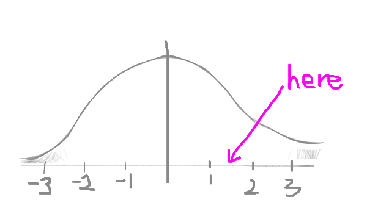


To compute the z-score for each person in excel, you simply have to turn the formula above into excel formula language. We know that all our variables are in the "height" column, which is column "B". So we need to get the values for each cell, then the (population) standard deviation for height, and the mean for height. So for example, for the first row (row 2, since row 1 contains our column headers, or variable names) your cell is B2. In this case you would translate the formula as follows: 


`z = (score - mean) / standard deviation`


`z = (x – μ) / σ`


`=(B2-AVERAGE(B:B))/STDEVP(B:B)`


If any one of these steps doesn't quite make sense, raise your hand now, and ask us to explain!


Now create a column called "z-score", and populate it with the z-scores of each individual's height, using the formula above. You should end up with something like this: 


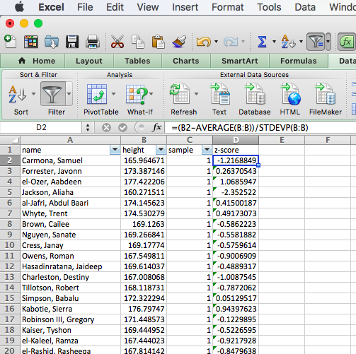


If you had multiple variables, for example we also had measurement for these people for the length of their arms and legs and so on, we could combine all the z-scores into a composite variable, that would be able to tell us about that person's "tallness" is that was a variable we conceptualised as made up of these factors, and operationalised with this composite measure. 


Let's demonstrate with some actual data, that is relevant to criminology. Let's suppose that we are interested in the popularity of tweets sent out by greater manchester police, city centre division. How would we go about measuring popularity? Well it depends on how we conceptualise this. But let's say that we conceptualise the popularity of a tweet, but considering the amount of responses it was getting from the public, both in favourites, in retweets, and in comments. Let's grab a large-ish sample of GMP tweets. Don't worry, I won't make you manually input these again. Instead, you can just download some tweets that I've collected using the [twitter API](https://developer.twitter.com/en/docs). You can download this data from Blackboard. 


Now if you open it up in excel you will see a column for unique ID to identify each tweet, one for the date created which represents when the tweet was written, one for the text of the tweet, then 3 numeric columns, one for the number of favourites, one for the number of retweets, and one for the number of replies. Finally you have a column for the hashtags used by GMP in that tweet. 


So let's say we want to be able to talk about the popularity of these tweets. As discussed, we conceptualise the popularity as having to do with favourites, retweets and responses. We believe that these three dimensions quantify the engagement that each individual tweet is getting. So then, what we can do is use these three **indicators** to create a **composite variable** that takes into account all three directly observable measures to produce an estimate for our construct of popularity of tweet. 


To do this, we have to first convert each column to a z-score, rather than just the count, and then we have to take the average of the z-scores. 


So let's first create 3 columns, one for each z-score: 


Now remember our equation. For each cell, we need to subtract the mean, and then from that divide by the standard deviation, for the appropriate column. So for us to make a z-score for favourites, we must for each number of favourites, subtract the mean number of favourites, and divide by the standard deviation number of favourites. Like so: 


When you are done, you should have three columns for z-scores, one for favourites, one for retweets, and one for replies. 


Now you can use these z-scores to calculate an average between them, which will give you your measure for your composite variable. To take the average of 3 values, you can just use the `=AVERAGE()` formula, and highlight the columns from which you want to use the values to calculate the average from, in this case the new z-score values you've just created: 


Now, finally, you have a popularity score, that tells you which tweets by GMP city centre were most popular, depending on the number of favourites, retweets, and replies, taking into account all these three dimensions that we decided are important indicators of our construct, popularity. Hint: sort your data using the sort option by the popularity variable, from largest to smallest (or in descending order). 


So, based on this measure, which tweet is the most popular?


It appears that the most popular tweet GMP has made is a pun... :


*"Several shoplifters detained today, including woman who stole a vibrator - Why do they do it - is it just for the buzz...'"*


Very good GMP, very good. But something really interesting as well, if you look at a few of the tweets below, that show up as quite highly ranked based on our popularity score, it comes up as high on retweets, but earning 0 favourites! See: 


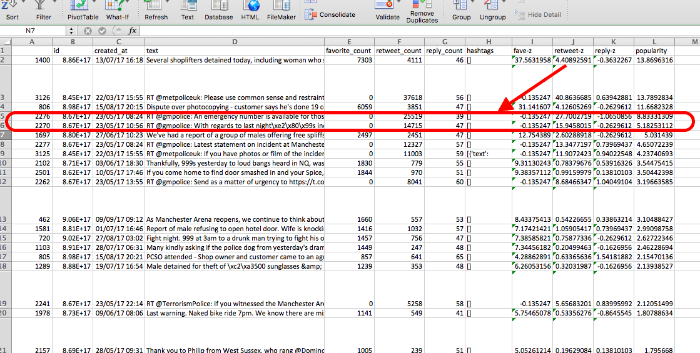


This should illustrate the importance of measuring something as a construct. We could have conceptualised popularity of GMP's tweets as an indirectly observable concept, which we could then operationalise as "number of favourites per tweet". However, this would be a one-dimensional measure of our concept. Instead, by choosing to conceptualise popularity as a construct, made up of favourites, retweets, and replies, we create a composite variable, that reflects more the nuances of our concept. 


In fact most of the things we study in the social sciences, and in criminology, are very complex social processes and often best represented by constructs, which can be measured this way through composite variables. 


Another thing to mention regarding measurement in social sciences, and criminology, is that often times our data come from surveys. And in surveys you don't only deal with numeric variables, but indeed with categorical as well. And it is in these surveys that we can ask people some questions about the really nuanced and complex issues, such as trust in the police, or fear of crime. Of course the responses to such questions tend to be categorical, often ordinal, asking people to rank their agreement with various statements. So we should also take time to consider the other case, where your indicator variables that you wish to combine into a composite measure are *categorical*. These are most often made up of multi-item scales, which we'll move on to in the next section. 


Meaningful grouping is the nonstatistical combination of selected original variables based on the interpretation of the variables’ values or scores, guided by the science of the field. Meaningful grouping can be used to create a composite outcome variable from multiple continuous or categorical variables or both. These original variables, when combined into a composite, can indicate an attribute (e.g., high risk for mortality) that is meaningful. A composite variable created by meaningful grouping is often categorical. For example, a composite variable may include categories improved, no change, and worse to indicate the direction of overall change from baseline, to determine whether or not an intervention was efficacious. The key point is that the composite should be meaningful with respect to the context and purpose of the study and should be determined based on the science of the field, with a predefined algorithm.


Three common composite measures include:

- **indexes** - measures that summarize and rank specific observations, usually on the ordinal scale
- **scales** - advanced indexes whose observations are further transformed (scaled) due to their logical or empirical relationships
- **typologies** - measures that classify observations in terms of their attributes on multiple variables, usually on a nominal scale


Here we will consider scales for creating composite variables from numeric indicators, and indexes for creating composite variables from categorical indicators.


<!--
Sometimes latent variables correspond to aspects of physical reality, which could in principle be measured, but may not be for practical reasons. In this situation, the term hidden variables is commonly used (reflecting the fact that the variables are "really there", but hidden). Other times, latent variables correspond to abstract concepts, like categories, behavioral or mental states, or data structures. The terms hypothetical variables or hypothetical constructs may be used in these situations.

One advantage of using latent variables is that they can serve to reduce the dimensionality of data. A large number of observable variables can be aggregated in a model to represent an underlying concept, making it easier to understand the data. In this sense, they serve a function similar to that of scientific theories. At the same time, latent variables link observable ("sub-symbolic") data in the real world to symbolic data in the modeled world.



Latent refers to the fact that even though these variables were not measured directly in the research design, finding out about them is the ultimate goal of the project.


In statistics, **latent variables** (as opposed to observable variables), are variables that are not directly observed but are rather inferred from the measurement of other variables. Latent variables can correspond to constructs, like *confidence in the police*, or the *fear of crime*, or they can represent aspects of physical reality that potentially *could* be measures, but it may not be practical to do so. They are calculated from their indicators using a latent variable model, which is a statistical model that relates a set of variables (so-called manifest variables) to a set of latent variables.


Characteristics of a latent variable: 

- abstract concept
- cannot be measured directly 
- examples: attitudes, satisfaction


So if we can't measure these concepts, how can we collect data about them? Well, it is possible to measure **indicators** of the **latent variable**. Indicators are use observed responses to questionnaire items, which can then be combined together to create a measure for our contrsuct - the latent variable. Constructs/ latent variables are normally measured using a multi-item scale. 
-->

### Multi-item scales for categorical constructs

 A lot of criminological research uses multi-item scales to measure constructs. For example we saw in the paper earlier how the constructs of *cooperation with the police* or *cooperation with the community* were measured through asking various questions which were compiled together into these variables.


One primary technique for measuring concepts important for theory development is the use of multi-item scales. In many cases, single-item questions pertaining to a construct are not reliable and should not be used in drawing conclusions. There have been examination of the performance of single-item questions versus multi-item scaled in terms of reliability, and [By comparing the reliability of a summated, multi-item scale versus a single-item question, the authors show how unreliable a single item is; and therefore it is not appropriate to make inferences based upon the analysis of single-item questions which are used in measuring a construct](https://scholarworks.iupui.edu/handle/1805/344). 


Oftentimes information gathered in the social sciences, including criminology, will make use of Likert-type scales.  Rensis Likert was one of the researchers who worked in a systematized way with this type of variable. The Likert methodology is one of most used in many fields of social sciences, and even health sciences and medicine. When responding to a Likert item, respondents specify their level of agreement or disagreement on a symmetric agree-disagree scale for a series of statements. Thus, the range captures the intensity of their feelings for a given item.  


You will have definitely seen Likert scales before, but you might have just not known they were called as such. Here is one example: 


So in sum a Likert scale must have: 

- a set of items, composed of approximately an equal number of favorable and unfavorable
statements concerning the attitude object
- for each item, respondents select one of five responses: strongly agree, agree,
undecided, disagree, or strongly disagree.  
- the specific responses to the items combined so that individuals with the most favorable attitudes will have the highest scores while individuals with the least favorable (or unfavorable) attitudes will have the lowest scores  


After studies of reliability and analysis of different items, Rensis Likert suggested that attitude, behavior, or other variables measured could be a result of the sum of values of eligible items, which is something referred to as **summated scales**. While not all summated scales are created according to Likert’s specific procedures, all such scales share the basic logic associated with Likert scaling described in the steps above.  


<!--(pp. 22-
23)
Spector (1992) identified four characteristics that make a scale a summated rating scale
as follows:
First, a scale must contain multiple items. The use of 
summated 
in the name implies that
multiple items will be combined or summed.  Second, each individual item must measure
something that has an underlying, quantitative measurement continuum.  In other words,
it measures a property of something that can vary quantitatively rather than qualitatively

An attitude, for example, can vary from being very favorable to being very unfavorable.
Third, each item has no “right” answer, which makes the summated rating scale different
from a multiple-choice test.  Thus summated rating scales cannot be used to test for
knowledge or ability.  Finally, each item in a scale is a statement, and respondents are
asked to give rating about each statement.  This involves asking subjects to indicate
which of several response choices best reflects their response to the item.  (pp. 1-2)
Nunnally and Bernstein (1994), McIver and Carmines (1981), and Spector (1992) discuss
the reasons for using multi-item measures instead of a single item for measuring psychological
attributes.  They identify the following: First, individual items have considerable random
measurement error, i.e. are unreliable.  Nunnally and Bernstein (1994) state, “Measurement error
averages out when individual scores are summed to obtain a total score” (p. 67).  Second, an
individual item can only categorize people into a relatively small number of groups.  An
individual item cannot discriminate among fine degrees of an attribute.  For example, with a
dichotomously scored item one can only distinguish between two levels of the attribute, i.e. they
lack precision.  Third, individual items lack scope.  McIver and Carmines (1981) say, “It is very
unlikely that a single item can fully represent a complex theoretical concept or any specific
attribute for that matter” (p. 15).  They go on to say,
The most fundamental problem with single item measures is not merely that they tend to
be less valid, less accurate, and less reliable than their multiitem equivalents.  It is rather,
that the social scientist rarely has sufficient information to estimate their measurement
properties.  Thus their degree of validity, accuracy, and reliability is often unknowable.
(p. 15).
Blalock (1970) has observed, “With a single measure of each variable, one can remain blissfully
unaware of the possibility of measurement [error], but in no sense will this make his inferences
more valid” (p. 111).
Given this brief background on the benefits of Likert-type scales with their associated
multi-item scales and summated rating scores, many individuals consistently invalidate research
findings due to improper data analysis.  This paper will show how data analysis errors can
adversely affect the inferences one wishes to make.


-->

In general, constructs are best measured using multi-item scales. Since they are usually complex, they are not easily measured with a single item. Multi-item scales are usually more reliable and less prone to random measurement errors than single-item measures, as a single item often cannot discriminate between fine degrees of an attribute. 


Creating multi-item scales is associated with test results for validity and reliability with respect to each scale are disclosed. 


One important reason for constructing multi-item scales, as opposed to single-item measurements, is that the nature of the multiple items permits us to validate the consistency of the scales. For example, if all the items that belong to one multi-item scale are expected to be correlated and behave in a similar manner to each other, rogue items that do not reflect the investigator’s intended construct can be detected. With single items, validation possibilities are far more restricted.

> Under most conditions typically encountered in practical applications, multi-item scales clearly outperform single items in terms of predictive validity. Only under very specific conditions do single items perform equally well as multi-item scales. Therefore, the use of single-item measures in empirical research should be approached with caution, and the use of such measures should be limited to special circumstances.

- [Guidelines for choosing between multi-item and single-item scales for construct measurement: a predictive validity perspective](https://link.springer.com/article/10.1007/s11747-011-0300-3)


So how do you make one of these? Well you have to consider many factors, and consult both theory, and analysis in order to make sure that your measurement covers everything you need to be able to talk about the construct it is meant to represent. You need theory to identify the indicators of the construct, which you will need to include, as your items that make up the multi-item scale. So let us first consider the construct of feeling unsafe in one's neighbourhood. We can conceptualise this as people feeling unsafe in their neighbourhoods in three separate settings. They can feel unsafe walking around in the daytime. They can feel unsafe walking around after dark. And they can also feel unsafe in their homes. We can consider a 3-item Likert scale, with responses that range from Very safe
to Fairly safe
to A bit unsafe
to Very unsafe. This is the example we'll use throughout this lab. So, download this data set from Blackboard (it's under csew_small.xlsx). You can see that there are the three variables, of walking in day, walking after dark, and feeling safe in home alone. I have included responses from 10 people, so that we can use this to assess reliability and validity of the measures. 


Multi-item scales open up a whole range of techniques for construct validity. For multi-item scales comprised of itemswith discrete response choices, reliability is most commonly assessed using Cronbach’s coefficient alpha, but I'm jumping ahead, we will now explore further the validity and reliability of measures, and how you can test this in the next section.  


## A note on Validity and Reliability

All measurements should satisfy basic properties if they are to be useful in helping researchers draw meaningful conclusions about the world around us. These are primarily validity, reliability, repeatability, sensitivity and responsiveness. We have, briefly, touched on reliability in the first session, and these two are the main concepts which we will cover today as well. but I wanted to mention the others as well, so that you have a complete picture of the expectations your variables need to be able to meet in order to be robust and reliable when used to describe the world of criminology. 


**Validation** is the process of determining whether there are grounds for believing that the instrument measures what it is intended to measure. For example, to what extent is it reasonable to claim that a ‘fear of crime questionnaire’ really is assessing someone's fear of crime? Since we are attempting to measure an ill-defined and unobservable construct, we can only infer that the instrument is valid in so far as it correlates with other observable behaviour. Validity can be sub-divided into: 

- **Content validity**: is the measurement sensible? Do the indicators they reflect the intended construct?
- **Criterion validity**: is the measurement associated with the external criteria, for example other measurements of the same construct?
- **Construct validity**: what is the relationship of the indicators to one another? And to the construct it is intended to measure? Construct validity has two sub-types: 
  + **convergent validity**: extent to which indicators are associated with one-another (they measure the same thing)
  + **divergent validity**: extent to which indicators differ (they measure distinct things)
  


**Reliability** and **repeatability** attempt to address the variability associated with the measure. You want to have a measure that repeatedly produces the same results when administered in the same circumstances, and that any differences in answers between people is the result of their differing attitudes on the construct which you are measuring, rather than due to any variation introduced by the measurement itself. 


The below image might help you conceptualise reliability and validity. Reliability refers to getting consistent results each time you measure your concept. Validity refers to the extent to which your measurement of the concept actually reflects the concept itself. 


> Validity answers the question, "Am I measuring what I think I am?" In shooting terms, this is "accuracy." My shots may or may not be loosely clustered, but they're all relatively close to the bull's-eye. Reliability answer the question, "Am I consistent?" In shooting terms, this is "precision." My shots may or may not be relatively close to the bull's-eye, but they're tightly clustered. This leads us to four possible outcomes as illustrated below.

- [Bradley A. Koch](http://www.socingoutloud.com/2012/10/teaching-validity-and-reliability-in.html)

So you can have a reliable but not valid measure, or a valid but not reliable measure. Imagine it like this: 


> The worst-case scenario, when we have low validity and low reliability (lower left), looks like buckshot, scattered all over the target. We are neither accurate nor precise. We're not measuring what we think we are, and at that even, we're doing it inconsistently.
When we have high validity but low reliability (upper left), our packing may be loose, but the shots are near the bull's-eye. We are accurate but not precise. We're likely measuring what we think we are, just not consistently.
When we have high reliability but low validity (upper right), we may be off of the bull's-eye, but our packing is tight. We are precise but not accurate. We're not measuring what we think we are, but whatever we're measuring, we're doing so consistently.
The best-case scenario, high validity and high reliability (lower right), is when the shots are clustered on the bull's-eye. We are both accurate and precise. In other words, our question/variable consistently measures the intended concept.

-[Bradley A. Koch](http://www.socingoutloud.com/2012/10/teaching-validity-and-reliability-in.html)


**Sensitivity** is the ability of measurements to detect differences between people or groups of people. Your measurement approach should be sensitive enough to detect differences between people for example those who have differing levels of worry about crime. 


**Responsiveness** is similar to sensitivity, but relates to the ability to detect changes when a person fluctuates in the construct being measured. If your measure is meant to detect change over time, for example in fear of crime, it needs to be able to detect changes. A sensitive measurement is usually, but not necessarily, also responsive to changes.


These are the main criteria that your measurements need to meet, in order to be considered robust. Pretty daunting, eh? No wonder secondary data analysis is so popular! (Is it though? Well it should be. It is amongst lazy people like myself, who would much rather acquire data and make pretty graphs, than design multi-scale items for measuring complex constructs in the first place....!) It is much nicer when someone has gone through the hard work of designing great measures for us, and we can use the excellent data provided. And also, we should appreciate the work that these people have put in. There are many initiatives to try to encourage the rest of us to use the data they've collected. Organisations such as the [UK Data Service](https://www.ukdataservice.ac.uk/) (UKDS) collate all sorts of data, and make them easily available and ready for us to use, to make these data more enticing. They also like to reward analysis of their data. For example, next year you will have the option to take a **secondary data analysis pathway** for your dissertation. If you do this, and you make use of a data set from the UKDS, you can enter to win the [dissertation prize](https://www.ukdataservice.ac.uk/use-data/student-resources/dissertation-prize)! It's a pretty awesome thing to have on your CV, and it also comes with a cash prize of £500 for first place. Not bad...! And we have [already had a BA Crim student win from Manchester before](https://www.ukdataservice.ac.uk/news-and-events/newsitem/?id=4650), so it's definitely an attainable goal with your training and skills!


But as I was saying, building reliable and valid measurement is tough work. People at the Office of National Statistics work tirelessly to come up with multi-item scales to measure fear of crime, trust in the police, and similar constructs using the Crime Survey for England and Wales. For them to introduce a new construct, and some new questions takes, *literally* years of work. So it's definitely a good approach to try to make use of the data which they collect. If you are interested, have a watch of [this video on what sorts of data they have](https://www.youtube.com/watch?v=cCpHnqn0Q2c&list=PLG87Imnep1SljSqc0yLIHYBP1w0saMJn-&index=2), and [this other video on how to acquire data](https://www.youtube.com/watch?list=PLG87Imnep1SljSqc0yLIHYBP1w0saMJn-&v=TzRWJK1MtrU). 


But if I've still not convinced you, and you want to go out and collect your own data, by taking the topics that you are interested in and conceptualising and operationalising them your way, and you want to develop your own multi-item scales, and then test their validity and reliability, well then, I guess I should equip you with some basic abilities to know how. You might get asked to create a questionnaire in your next workplace. While creating questionnaires is very tough and nuanced job, and I could write a whole course on only that, replying this to your line manager, when they ask you to build a survey will not win you many brownie points. Instead it's best that you make at least some sort of attempt to ensure that your constructs are being measured by the most valid and reliable measures possible, or at least you can have some indication as to the error produced by your measurement. Later in this lab we will address this through something called Cronbach's alpha. But first, let's calculate a summative score for "feelings of unsafety ". 


### Activity 1: Calculating a summative score


So back to our data about collecting people's feelings of unsafety, in their neighbourhoods. We have our three indicator questions: 

- To what extent do you feel safe walking alone in the day?
- To what extent do you feel safe walking alone after dark?
- To what extent do you feel safe at home alone at night?


Well how can we tell if these measures are any good? One approach is to calculate Cronbach's alpha. There is some debate around what this approach can tell you about your questions, but Cronbach's alpha is used frequently as a measure in constructing a summary scale for Likert type questions or opinions. The Cronbach's alpha gives a measure of the internal consistency or reliability of such a multi-item scale. It essentially considers the variation in one person's answers between the many indicators of the construct. If they are all supposed to measure the same thing, then you should have little variation, and therefore get a high Cronbach's alpha. If on the other hand you have high variation, and get a low Cronbach's alpha, that might mean that your indicators are not so inter-linked as you had imagined, and perhaps measure distinct things, rather than elements of the same construct. 


<span style="color:#d95f02">
So let's give it a go. Open up your data (csew_small.xlsx) and have a look at the answers people provide. Does it look consistent, from question to question? What are your initial thoughts?


Well now we can consider calculating the variation in answers, to be able to support (or challenge) your perceptions with data. But the first step to this is to **re-code** your variables from the text value (very worried, etc) to a number that indicates the **rank** of the ordinal response. How we do this is important. While the order of an ordinal variable is fixed, whether you go from high to low or low to high score is not. How do you determine what your score should be? Well on the first instance, I would suggest that you think about what your construct is. In this case, our construct is fear - or unsafety. In this case, it would make sense for a higher score to represent *more fear*. For the scores to  reflect this, lower scores of worry should have lower numbers, and higher scores of worry should have higher numbers. So "very safe" should be equal to 1, and "very unsafe" should be equal to 4. 


Once we've decided on a scoring system like this, we can write it down in a little table. This is both for ourselves, so we know what the numbers mean later (and maybe also for anyone else using our data afterwards), but also so that we can use this as a lookup table for our re-coding. 


So create a mini table in your data, that has your codes and values. Something like this: 


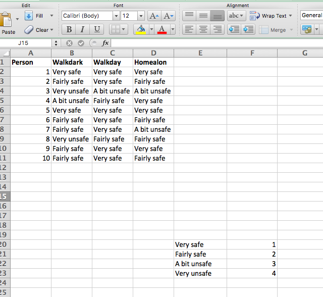


Now also create headings for 3 new columns, one for each of our indicator variables: 


So now we can recode these variables into these new columns, where we will see the numeric value for each text value. We could do this manually. But we don't want to. Remember we are lazy. And also remember that this is a very small subset of the actual Crime Survey for England and Wales (CSEW) data. The actual data has thousands of rows. 46,031 in the 2011/12 sweep to be exact. So that is not something that you would want to do manually, right? No. 


Instead we will learn a new function in excel, one which you will often use, called `VLOOKUP()`. What this function does, is it uses a lookup table, in order to assign variables to a new column. In this case, our lookup table is the one on the bottom there, that we created, that tells excel that for us, Very safe is 1, and Fairly safe is 2, and A bit unsafe is 3, and Very unsafe is 4. We can use this, in order to create our new, re-coded variables. 


The `VLOOKUP()` function takes 4 parameters. You have to tell it the **lookup_value** - the value to search for. This can be either a value (number, date or text) or a cell reference (reference to a cell containing a lookup value), or the value returned by some other Excel function. For example:

    Look up for number: =VLOOKUP(40, A2:B15, 2) - the formula will search for the number 40.


You then have to tell it the **table_array** - which is your lookup table, with two columns of data. The VLOOKUP function *always* searches for the lookup value in the first column of table_array. Your table_array may contain various values such as text, dates, numbers, or logical values. Values are case-insensitive, meaning that uppercase and lowercase text are treated as identical.

    So, our formula =VLOOKUP(40, A2:B15,2) will search for "40" in cells A2 to A15 because A is the first column of the table_array A2:B15. 
    
    
You then have to tell it the **col_index_num** - the column number in table_array from which the value in the corresponding row should be returned. The left-most column in the specified table_array is 1, the second column is 2, the third column is 3, and so on. Well, now you can read the entire formula =VLOOKUP(40, A2:B15,2). The formula searches for "40" in cells A2 through A15 and returns a matching value from column B (because B is the 2nd column in the specified table_array A2:B15).


But finally, you still have to specify the **range_lookup**. This determines whether you are looking for an exact match (when you set to FALSE) or approximate match (when you set to TRUE or you omit it). This final parameter is optional but very important. In this case, we want an exact match, so we will set this parameter to "FALSE". 


So, to look up the value for the cell B2, in the lookup table that ranges from $E$20:$F$23 (remember to include dollar signs to make sure nothing changes when you copy an paste), find the values in the 2nd column of our lookup table, and return only exact matches, we can put the below formula into the first cell for our Walkdark_num variable: 


`=VLOOKUP(B2,$E$20:$F$23,2, FALSE)`


To return this: 


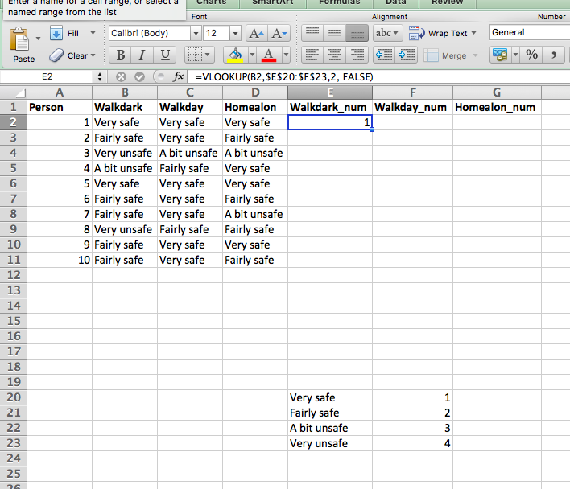


We can quickly verify that this looks right, since the value there in the 'Walkdark' column is "very safe", we know that this should numerically return "1". And it does, so we are happy. Now copy the formula down the column, and also repeat for the other two variables as well. You should finally end up with a table like this: 


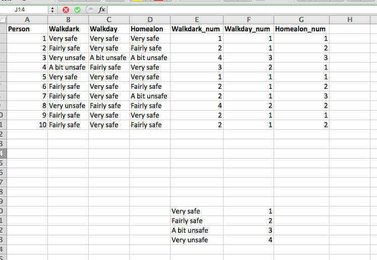


Now you have your numeric values for the indicators of the constrcut. As this is a summative score, it just means that the score is the result of the **sum** of the indicators. So to calculate the value for our composite variable, we need to calculate the total score people achieved, by summing their answers to all three questions. I can do this by creating a new "total" column, and populating it with the sums using the `SUM()` function: 


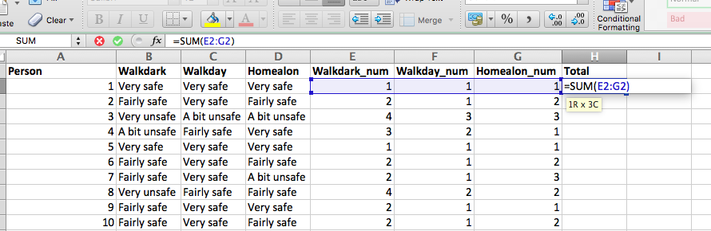


And the values in this column represent the score that these people have on the composite variable "feelings of unsafety". That's it, now you've created this summative score. Woohoo! You can see that the person with the highest score has achieved a score of 10 - this is the hightest score on feeling unsafe in this mini sample. On the other hand, the person with the lowest score are actually two people who achieved a score of 3. They score low on feeling unsafe. 
</span>


But to what extent do these measures all indicate the same concept? Is someone who feels the same towards their safety going to answer similarly on all onf these questions? We want to try to find this out, in order to be able to speak about the our measure confidently. And as mentioned earlier, you can put a number to the extent to which you can rely on your measures, using Cronbach alpha.


### Activity 2: Testing your questions: Cronbach’s alpha


Cronbach's alpha is a measure of internal consistency, that is, how closely related a set of items are as a group. It is considered to be a measure of scale reliability. Cronbach’s alpha is a measure used to assess the reliability, or internal consistency, of a set of scale or test items. In other words, the reliability of any given measurement refers to the extent to which it is a consistent measure of a concept, and Cronbach’s alpha is one way of measuring the strength of that consistency.


Cronbach’s alpha can be written as a function of the number of test items and the average inter-correlation among the items. 


`(number of items/(number of items-1))*(1 - the variance associated with each item/ the variance associated with the observed total scores)`


<span style="color:#d95f02">
With this in mind, we can apply this formula to excel, and use excel to calculate our Cronbach alpha. As I mentioned, Cronbach alpha has to do with variance across the different indicators for the same construct, in this case the three questions about feeling unsafe, within each individual person's answers. Remember that each row is one person, so in each row you have the answers to the questions from the same individual. 


So to do this, you first need some values: 


I'll go through each of these but, k is the number of indicators, sigma (sum of) theta^2 is the sum of the variance between people's answers, and theta^2 is the population variance. Alpha is the end result, that you're calculating. 


So you need: 

- the number of indicators, 
- the sum of variance, and 
- the population variance. 


The last value in there is the alpha, which we obtain at the end. 


So, in cell B19, I put the count of the number of indicators for this construct. As I know there are three, I could simply write in "3". If you want, you can use the `COUNTA()` function as above. It just counts the number of cells with text in them. But since you're highlighting them anyway, it's not much of a time saver. Unless you had a construct with many many many indicators. I guess then it would save some time. But honestly, you should always know how many indicators your construct has, as it should be based in theory and your expert domain knowledge...!


Now the next one is a bit more complex. In order to get the sum of the variance for each question, I will need first to calculate the variance for each question. Let's use the `VARP()` function to do this. I can place these values as the bottom row to my data. Like so: 


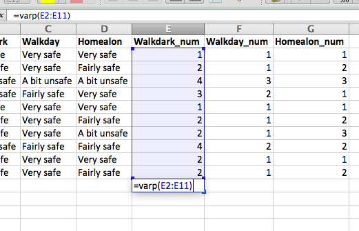


Repeat these for the other two columns as well. Now I have my variance for each indicator question, and I can add them up using the `SUM()` function, in the cell B20: 


Now finally I need the variance between the total scores, between the people. For this, in cell B21 you just have to calculate the variance of these values, again using the `VARP()` function: 


So now you have absolutely everything to calculate your Cronbach alpha. All you have to do, is calculate it using the values for number of indicators, variation within people in their answers to the indicators, and variation between people to their answers to the indicators. And you do this with the following formula: 


`=B19/(B19-1)*(1-B20/B21)`


Like so: 


So that leaves us a value of 0.79. So what does this mean? Well it's a value between 0 and 1, so obviously 0 is the absolute words, and 1 is the perfect score. But what sorts of scores are realistic? Well it depends on the concept you're measuring most likely. But in terms of acceptable thresholds, here is some guidance: 


Our value is acceptable, and so we can rest assured, that these three indicators all tap in to a relatively similar thing, and we can use this result as our justification for bringing them together as multi-item indicators for feeling unsafe in one's neighbourhood. 
</span>

Yay!


A note of caution though. There are some issues with Cronbach alphas. For example, you might see quite high scored for scales with lots and lots of question items. As one increases the numbers of items in a scale, it is more likely that the alpha will be high, but score may be meaningless because it does not represent an underlying construct or worse - it represents multiple underlying constructs. Cronbach's Alpha measures only the reliability of scale of measurement of responses of the cases, in a Likert Scale. But it does not measure the reliability of the respondents' opinion leading to the latent construct. In that case, useful measurements are those of validity. Usually, for the sake of the integrity of the research, it is recommended that the researcher run a series of tests to test reliability and validity of questionnaires. While the Cronbach's alpha is one of these tests, further tests include principle components analysis, factor analysis, and other indicators. Having an integrated set of tests adds more to the value of the research in question. If you are interested, you can read up a bit more [detail on validation here](http://onlinelibrary.wiley.com.manchester.idm.oclc.org/doi/10.1002/9780470024522.ch5/pdf). But that is not something that we will worry about now, instead we can move on to the final part of the day, recoding. 


## Recoding some more: Transforming your variables to fit with your concepts

> Transforms are transformations on variables. One purpose of transforms is to make statistical operations on variables appropriate and meaningful. Another is to create new variables, aggregates, or other types of summaries. 

- Leland Wilkinson (2005) *The Grammar of Graphics*


So we've already covered some re-coding of our variables, transforming them from text values into their rank orders, as they sit in the ordinal variable above, using the `VLOOKUP()` function. The last thing we'll cover today is addressing re-coding of the second variety mentioned above by Leland Wilkindon, when you want to create aggregate summaries of a variable. You might want to do this if you want to turn a numeric variable into a categorical variable for example, or when you want to turn a categorical variable with many possible values into a **binary** variable, a variable with only two possible values. 


Let's start with the second option, because I can demonstrate this on our fear of crime table, that you should still have open, after having just finished calculating your Cronbach's alpha. Let's say that we no longer care about the distinction between all 4 types of worry, and instead wanted to only distinguish between those who are worried or not worried. We only want 2 possible categories. How can we achieve this?


Well one option is to use the `VLOOKUP()` function again. Create another lookup table, but this time, change the column that contains the items to change the values into from numbers, to the corresponding text values. Like so: 


And then create a column for your new variable, for **Walkdark_binary**. Now in this new column, use the `VLOOKUP()` function to change the values to the corresponding binary options. Can you guess what the function will look like, based on what the function looked like above, when translating to the numbers?


Remember you have to specify: 
- what you want to reference
- your lookup table
- the number for the column where your new values are
- that you want *exact* matches


So, got your formula yet? Well if not, I'll help you. It's this: 


`=VLOOKUP(B2,H20:I23,2,FALSE)`


Like so: 


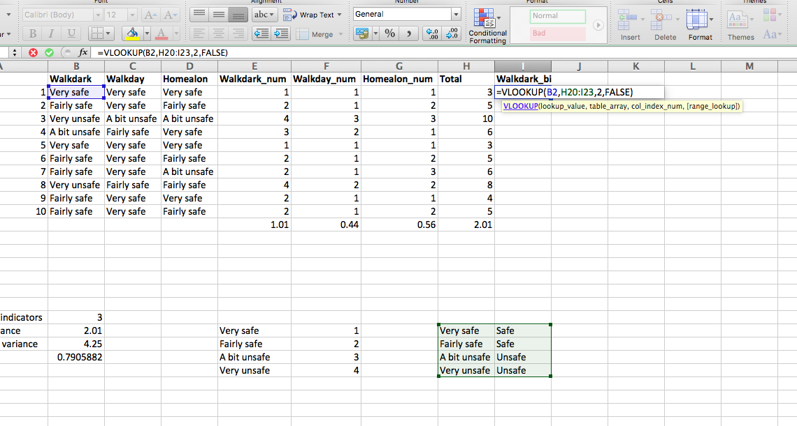


Of course, remember to add your dollar signs if you want to copy and paste that formula: 


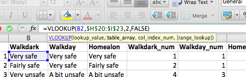


The result should be a new, binary variable, that re-coded your 4 possible values for the walkdark variable into 2: safe/ unsafe. Like so: 


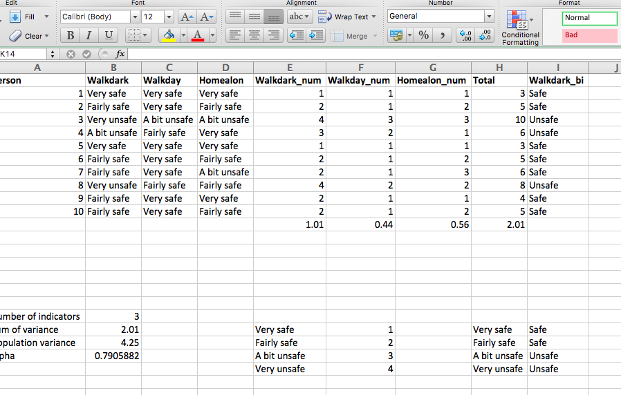


Now the last task is to re-code your numeric variables, into categorical. You may remember from the first week's reading that you can always go up the resolution, but not down, for levels of measurement for variables. This means that you can change a numeric variable into categorical, but you can't change categorical into numeric. Just remember this!

### Activity 3: Recoding Variables

<span style="color:#d95f02">
OK so final thing, to turn a numeric variable into a categorical, go back to your data of people's heights. Let's say we don't want any sophisticated analysis with numbers, we just want to know whether people are short or they are tall. We will decide this, by checking whether they are taller than the group average, or shorter than the group average.


To achieve this, we will return to our trusty `IF()` function. So open up the data set with the heights again, and create a new column, for a new variable called **tall_or_short**:


Great, now this column, we want to populate with the word "Tall" if the person is taller than average and "Short" if they are not. So what are the elements of our statement? We need to check *if* the person height is *greater than* the *average height* and if it is, type "Tall", else type "Short". 


So we know that the `IF()` function takes 3 arguments. 1st the logical statement, that has to be either true or false. In this case, that statement will test whether person height is greater than the average height. This would look something like this: `cell value > average(column)`. 


In the example of our first person, Samuel Carmona, that would be the value of the cell `B2`, being checked against the average for the whole column (`B:B`). So this part of the statement would look like: 


`B2 > AVERAGE(B:B)`


Then the other 2 values that the `IF()` function needs is what to do if the statement is true, and what to do if the statement is false. These are simple. If true, write "Tall", and if false then write "Short". 

So altogether, your function will look like this:


`=IF(B2>AVERAGE(B:B),"Tall","Short")`


Like so: 


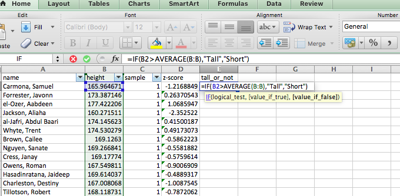


And finally, copy and paste for your whole column, and you will have a range of values of tall and short. Since we used the average as our divider, there should be about as many tall people as short people. You can quickly make a pivot table to see if this is the case: 


You can see that we are close enough: 


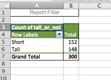


What could we do to split our data exactly in half? Well I'll leave this question as extra credit. Raise your hand and tell one of us what the solution is, and we'll come up with some reward. 
</span>


## Summary

In sum, you should now be able to begin to think about the concepts you wish to study, and the way in which you can turn them into data to be collected, to allow you to talk about htese concepts. You should be able to discuss composite variables, and talk about validity and reliability of measures and research. You should be comfortable with the following terms:

- conceptualisation
- measurement 
- empirical data
- directly measurable concept
- indirectly measurable concept
- construct
- composite variables
- multi-item scale
- single-item scale
- summated scale
- Likert scale
- population
- sample
- sample statistics
- population parameters
- z-score
- degrees of freedom
- law of large numbers
- central limit theorem
- VLOOKUP()
- reliability
- validity
- Cronbach's alpha
- re-coding variables
- binary variable


#Sources
- [Analysis of variables that are not directly observable: influence on decision-making during the research process](http://www.scielo.br/scielo.php?script=sci_arttext&pid=S0080-62342014000100146)
- [Composite Variables: When and How](https://www.ncbi.nlm.nih.gov/pmc/articles/PMC5459482/)
- [Scores and measurements: validity, reliability, sensitivity](http://onlinelibrary.wiley.com.manchester.idm.oclc.org/doi/10.1002/9780470024522.ch4/pdf)

<!--chapter:end:005-week4.Rmd-->

# Week 5 {#week5}

## Learning outcomes

This week we are interested in in taking a step back even further from the analysis of data than last week. Last week we spoke about conceptualisation and operationalisation, the steps that you take as a researcher to turn your ideas and topics of interest into variables to measure. But how do you then go about designing your research study? We talked a bit about sampling, the ways that you select your sample to collect information from, and how you ensure that this is done in a way that reflects the population, about which you want to be drawing conclusions. This week we take a step back, conceptually, to the highest level of research oversight, to consider the process of research design, and consider the various ways that you can go about collecting data. 


Much of the data that we work with are collected as part of research. There are many many different approaches to this process, and you will have come across a good sample of them in your readings.  Research design can be described as a general plan about what you will do to answer your research question. Research design is the overall plan for connecting the conceptual research problems to the pertinent (and achievable) empirical research. In other words, the research design articulates what data will be required, what methods are going to be used to collect and analyse the data, and how all of this is going to answer your research question. Both data and methods, and the way in which these will be configured in the research project, need to be the most effective in producing the answers to the research question (taking into account practical and other constraints of the study). Different design logics are used for different types of study, and the best choice depends on what sorts of reaserach questions you want to be able to answer. 


Since your reading provides a comprehensive overview of different types of research designs, I will not attempt to replicate this here. Instead I will cover some general practical points, with focus on two different study designs. These are experiments, and longitudinal studies. However the skills we will practice today are relevant for data collected from various research resigns. For example, missing data is something that is an issue for cross sectional studies as well as longitudinal ones. Similarly, the Gantt chart as a way to plan your study design can be applied to any form of research design. 

### Terms for today

- Research Design
- Evaluation & Experiments
    + RCT
    + Working with experimental data
    + Meta-analysis (a note on the tip of the evidence-pyramid)
- Longitudinal Study Designs
    + The importance of time
    + Linking data 


## Research Design 


When you're designing your research, and developing your research design, you can imagine yourself as the architect of the research project. You lay down the blueprints and identify all the tasks and elements that will need to be realised in order for your research project to be successful. The type of research design used in a crime and justice study influences its conclusions. Studies suggest that design does have a systematic effect on outcomes in criminal justice studies. For example, when determining the effect of an intervention (known as evaluation research, as you are *evaluating* the effect of the intervention), when comparing randomized studies with strong quasi-experimental research designs, systematic and statistically significant differences are observed ([Weisburd et al 2001](http://cebcp.org/wp-content/publications/Does%20Research%20Design%20Affect%20Study%20Outcomes.pdf)). 


Those interested in the study of criminology and criminal justice have at their disposal a wide range of research methods. Which of the particular research methods to use is entirely contingent upon the question being studied. Research questions typically fall into four categories of research: 

- (1) *descriptive* (define and describe the social phenomena), 
- (2) *exploratory* (identify the underlying meaning behind the phenomena), 
- (3) *explanatory* (identify causes and effects of social phenomena), and 
- (4) *evaluative* (determine the effects of an intervention on an outcome). 


Your readings will have gone through a lot of examples and details about each one of these approaches, and what research design you can use to answer which sort of categories of research questions. These books give you a fantastic theoretical overview of the methods, and so I will not reiterate those here. Instead I will try to focus on the practicalities associated with some research designs. While I will use the example of evaluative research here, you can use similar methods when appropriate for all sorts of research design. 

<!--

With this background, the purpose of this entry will be to introduce the reader to the two major research paradigms and issues that organize the field of criminology and criminal justice: quantitative and qualitative research strategies. After describing the different research methodologies several issues related to internal and external validity are identified that are important to bear in mind when assessing the adequacies of distinct research methodologies. The entry closes by highlighting what appears to be the most promising research strategy for criminology and criminal justice.

Criminal justice Jobs - Search For Criminal justice Jobs.
Search For Criminal justice Jobs. Find Your New Job Today!
indeed.co.uk/Criminal+justice | Sponsored▼
Quantitative research methods
Quantitative research methods are typically concerned with measuring criminological or criminal justice reality. To understand this process several terms must first be identified. Concepts are abstract tags placed on reality that are assigned numerical values, thus making them variables. Variables are then studied to examine patterns of relation, covariation, and cause and effect. At the most basic level, there exists at least one dependent variable and one independent variable. The dependent variable is commonly referred to as the outcome variable. This is what the researcher is attempting to predict. The independent variable is commonly referred to as the predictor variable, and it is the variable that causes, determines, or precedes in time the dependent variable (Hagan). Consider the following examples.

Criminological theorists may be interested in studying the relationship between impulsivity (independent variable) and criminal behavior (dependent variable). In studying such a relationship, scholars create a summated scale of items that is designed to indirectly measure the concept of impulsivity. Then, this impulsivity scale is used to predict involvement in criminal behavior. Criminal justice scholars may be interested in studying the effects of a mandatory arrest policy (independent variable) on future patterns of domestic violence (dependent variable). In studying such a question, scholars typically evaluate the effect of an arrest, compared to some other sanction, on the future criminal behavior of the arrestee. Thus, quantitative research methods involve a pattern of studying the relationship(s) between sets of variables to determine cause and effect.


Three criteria are needed to establish causality. The first is association. That is, the independent and dependent variables must be related to one another. The second is time order; the independent variable must precede the dependent variable in time. Finally, there is the issue of nonspuriousness. This occurs if the relationship between the independent and dependent variables is not due to variation in some unobserved third variable.

There are a number of different quantitative research methods available to researchers, most of which fall under the rubric of a research design, which loosely can be defined as the plan or blueprint for a study that includes the who, what, where, when, why and how of an investigation (Hagan). These research methods include: survey research, experimental and quasi-experimental research, cross-sectional research, longitudinal research, time series research, and meta-analysis.

Survey research. Serving as the most frequently used mode of observation within the social sciences, including criminology (Maxfield and Babbie), survey research involves the collection of information from a sample of individuals through their responses to questions (Schutt). Survey research is generally carried out via mail, telephone, computer, or in person.

Typically, surveys contain a combination of open- and closed-ended questions. Open-ended questions ask the respondent to provide an answer to a particular question. For example, the respondent may be asked: "What do you think is the most important problem facing residents in your neighborhood today?" Then in their own words, the respondent would provide his or her answer. On the other hand, closed-ended questions ask the respondents to select an answer from a list of choices provided. For example, the question asked above would read exactly the same only now respondents are provided with a list of options to choose from: "What do you think is the most important problem facing residents in your neighborhood today? (a) crime, (b) drugs, (c) education, (d) employment, (e) family structure, (f ) poverty, (g) health care, (h) child care, (i) extracurricular activities, ( j) other."

Surveys offer a number of attractive features that make them a popular method of doing research. They are versatile, efficient, inexpensive, and generalizable. At the same time, survey methods may be limited due to problems in sampling, measurement, and overall survey design. When creating a survey, researchers should take care in making sure that the items in the survey are clear and to the point.


Cross-sectional research. Cross-sectional designs involve studies of one group at one point in time. Therefore, they offer a quick glimpse or snapshot of the phenomena being studied. Typically, they refer to a representative sample of the group and thus allow researchers to generalize their findings (Hagan). Cross-sectional research designs permeate criminology and criminal justice research. Hirschi's famous study of causes of delinquency utilized a cross-sectional design in which he asked male respondents a series of questions related to involvement in delinquent activities and emotional ties to social bonds.

Longitudinal research. There are two commonly used longitudinal research designs, panel and cohort studies. Both study the same group over a period of time and are generally concerned with assessing within- and between-group change. Panel studies follow the same group or sample over time, while cohort studies examine more specific populations (i.e., cohorts) as they change over time. Panel studies typically interview the same set of people at two or more periods of time. For example, the National Crime Victimization Survey (NCVS) randomly selects a certain number of households from across the United States and interviews a member from each a series of seven times at six-month intervals. Cohort studies follow individuals or specific cohorts as they change over time. One classic example of a cohort study was conducted by Marvin Wolfgang and his colleagues in Philadelphia. The authors traced the criminal records of all boys born in Philadelphia in 1945 through the age of eighteen. Similarly, Tracy, Wolfgang and Figlio tracked the criminal history of males and females born in Philadelphia in 1958.

Time-series designs. Time-series designs typically involve variations of multiple observations of the same group (i.e., person, city, area, etc.) over time or at successive points in time. Typically, they analyze a single variable (such as the crime rate) at successive time periods, and are especially useful for studies of the impact of new laws or social programs (Schutt). An example of a time-series design would be to examine the murder rate in the United States over the last twenty years or to compare the murder rate of the United States and Canada over the same period of time.

An interrupted time-series design analyzes a single variable at successive time periods with measures taken prior to some form of interruption (i.e., intervention) and other observations taken after the intervention. An example of an interrupted time-series design may be found in Spelman and Eck (1987). These authors studied the number of larcenies from automobiles in Newport News, Virginia. The intervention in this study was a problem-oriented policing program that consisted of special tracking and investigation of crime incidents. The results showed that the number of larcenies dropped significantly immediately after the intervention took place and remained significantly small for over one year after the intervention. In another interrupted time series study, D'Alessio and Stolzenberg investigated the impact of Minnesota sentencing guidelines on jail incarceration. They found that the onset of the sentencing guidelines increased judicial use of the jail sanction beyond the effect of preexisting trends.

Although time-series designs are especially useful in studying trends over time and how such trends are influenced by some sort of intervention, researchers should be aware of one key feature of time-series designs: the inability to control for all potential spurious effects. Consider the following example. Suppose that a researcher is studying the effect on robberies of a mandatory convenience store law that requires stores to have at least two clerks working during hours of operation. After examining the number of robberies before and after the law took effect, the researcher observed that the number of robberies significantly decreased after the law was instituted. Therefore, the researcher claimed that the law led to the decrease in the number of robberies committed and concluded that the law should be generalized to other locales. However, what the researcher may have failed to consider was the recent capture of two offenders who were committing 75 percent of all convenience store robberies, and who just happened to be captured about the time the law took effect. In sum, researchers need to be careful in making sure that their interpretations of interrupted time-series analyses take into consideration as much information, both empirical and nonempirical, as possible.

Meta-analysis. A recent advent in research methodology is the use of meta-analysis. This research approach is the quantitative analysis of findings from multiple studies. At its core, meta-analysis involves researchers pulling together the results of several studies and making summary, empirical statements about some cause and effect relationship. A classic example of meta-analysis in criminology was performed by Wells and Rankin and concerned the relationship between broken homes and delinquency.

After observing a series of findings showing that the broken-homes-causes-delinquency hypothesis was inconclusive, Wells and Rankin identified fifty studies that tested this hypothesis. After coding the key characteristics of the studies, such as the population sampled, age range, measures (both independent and dependent) used, the authors found that the average effect of broken homes across the studies was to increase the probability of delinquency by about 10 to 15 percent. Perhaps more importantly, they found that the different methods used across the studies accounted for much of the variation in estimating the effect of broken homes. For example, the effect of broken homes on delinquency tended to be greater in studies using official records rather than self-report surveys.

Although the research community has not spoken with one voice regarding the usefulness of meta-analysis, one thing is clear: meta-analysis makes the research community aware that it is inappropriate to base conclusions on the findings of one study. It is because of this important lesson that meta-analysis has become a popular technique in criminological and criminal justice research (Lipsey and Wilson).

Threats to validity
Validity refers to the accuracy of measurement or whether the instrument is in fact measuring what it is suppose to measure (Hagan). While quantitative research methods have permeated criminological and criminal justice research, they are not without problems. Threats to validity are perhaps the most profound and should be acknowledged. Some of these threats are internal and are concerned with whether the observational process itself produced the findings, while external threats are concerned with whether the results were unique and applicable only to the group or target studied (Hagan).

Internal threats. According to Campbell and Stanley, a number of internal threats need to be considered, including: (1) history, (2) maturation, (3) testing, (4) instrumentation, (5) statistical regression, (6) selection bias, (7) experimental mortality, and (8) selectionmaturation interaction. In determining whether a particular design rules out threats to internal validity, Cook and Campbell suggest that "estimating the internal validity of a relationship is a deductive process in which the investigator has to systematically think through how each of the internal validity threats can be ruled out" (p. 55).

External threats. Campbell and Stanley also identify several threats to external validity, including: (1) testing effects, (2) selection bias, (3) reactivity or awareness of being studied, and (4) multiple-treatment interference. These threats are greater for experiments conducted under more carefully controlled conditions (Maxfield and Babbie). Perhaps one of the best methods for assessing threats to external validity is replication, or the repetition of experiments or studies utilizing the same methodology. By replication of key findings, researchers can gain confidence that the results observed in one study may not be due to external validity threats. One of the key examples of replication occurred in the late 1980s when the Minneapolis Domestic Violence Experiment was replicated in six cities throughout the United States (Sherman). Importantly, these replications yielded both similar and contradictory conclusions to those observed in the initial experiment.
-->
<!--
##Qual

Unlike quantitative research methods, qualitative approaches are designed to capture life as participants experience it, rather than in categories predetermined by the researcher. These methods typically involve exploratory research questions, inductive reasoning, an orientation to social context and human subjectivity, and the meanings attached by participants to events and to their lives (Schutt). There are a number of distinctive research designs under this paradigm: (1) participant observation, (2) intensive interviewing, (3) focus groups, and (4) case studies and life histories. Each of these will be discussed in turn.

Participant observation. At its most basic level, participant observation involves a variety of strategies in data gathering in which the researcher observes a group by participating, to varying degrees, in the activities of the group (Hagan). Gold discusses four different positions on a continuum of roles that field researchers may play in this regard: (1) complete participant, (2) participant-as-observer, (3) observer-as-participant, and (4) complete observer. Complete participation takes place when the researcher joins in and actually begins to manipulate the direction of group activity. In the participant-as-observer strategy, the researcher usually makes himself known and tries to objectively observe the activities of the group. The observer-as-participant strategy is very much like a one-visit interview, where the interviewees are also short-term participant observers. Typically, these interviews are conducted with individuals who are known to participate in a designated activity. For example, Jacobs interviewed known active drug dealers in order to gain a better understanding of how the crack business actually operates on the streets. Finally, the complete observer strategy relies on sole observation absent participation from the researcher.

Although several issues must be confronted when engaging in this sort of research, two are of vital importance: (1) objectivity, and (2) "going native." The former deals with the researcher's ability to avoid not only overidentification with the study group, but also aversion to it (Hagan). The latter deals with a situation in which the researcher identifies with and becomes a member of the study group, and in the process abandons his or her role as an objective researcher (Hagan). Even with these cautions, a number of important participant observation studies have been undertaken in criminology and criminal justice including Polsky's study of pool hustlers and con artists, as well as Marquart's study of prison life.

Intensive interviewing. Intensive interviewing consists of open-ended, relatively unstructured questioning in which the interviewer seeks in-depth information on the interviewee's feelings, experiences, or perceptions (Schutt, 1999). Unlike the participant observation strategy, intensive interviewing does not require systematic observation of respondents in their natural setting. Typically, interviewing sample members, and identification and interviewing of more sample members, continues until the saturation point is reached, the point when new interviews seems to yield little additional information (Schutt).

A prominent example of the intensive interviewing technique can be found in a series of studies with active residential burglars (Wright and Decker, 1994) and robbers (Wright and Decker, 1997) in St. Louis. These authors have conducted in-depth interviews with active criminals in their natural environment. Some of these interviews have yielded important theoretical insights that perhaps may not have been garnered via traditional survey methods. Other prominent examples may be found in Fagan and Wilkinson's study of gun-related violence in New York and Jacobs's study of crack addicts in St. Louis.

Focus groups. Focus groups are groups of unrelated individuals that are formed by a researcher and then led in group discussions of a topic (Schutt). Typically, the researcher asks specific questions and guides the discussion to ensure that group members address these questions, but the resulting information is qualitative and relatively unstructured (Schutt).

Although generalizations from focus groups to target populations cannot be precise (Maxfield and Babbie), research suggests that focus group information, combined with survey information, can be quite consistent under certain conditions (Ward et al.). One such criminal justice example is provided by Schneider and her colleagues. These authors examined the implementation process and the role of risk/need assessment instruments for decisions about the proper level of supervision among parolees and probationers. Their use of focus group was able to provide a context for a more complete understanding of the survey results from the probation officers interviewed.

Case studies and life histories. In general, case studies and life histories are in-depth, qualitative studies of one or a few illustrative cases (Hagan). Several criminological examples using this approach exist, and a few in particular have produced some of the most important, baseline information in the discipline today. The classic example is Sutherland's The Professional Thief (1937). In this case study, Sutherland's informant, Chic Conwell, described the world of the professional thief. Other examples include Shaw's The Jack-Roller (1930), which tells the autobiographical story of a delinquent's own experiences, influences, attitudes, and values. Finally, Horatio Alger's tale of street life in New York tells the story of Young Dick, a street boy who is involved in a delinquent life but who is also honest and hardworking. Life-history methods generally involve the analysis of diaries, letters, biographies, and autobiographies to obtain a detailed view of either a unique or representative individual (Hagan). A classic example of the life-history method is Teresa and Renner's My Life in the Mafia (1973).

Future of research methods in criminology and criminal justice
Although the preceding discussion has portrayed the two main research paradigms, quantitative and qualitative research methods, as two ends of the research continuum, it was not meant to imply that the two are mutually exclusive. On the contrary, the future of research methods in criminology and criminal justice lies in the combination of quantitative and qualitative research approaches. Illustrated below are two successful integrations.

The first, by Eric Hirsch, used a combination of methods, including participant observation, intensive interviewing, and a standardized survey, to study the 1985 student movement that attempted to make Columbia University divest its stock in companies dealing with South Africa. Hirsch believed that the combination of research methodologies provided a more comprehensive picture of student's motivations.

The second example is from John Laub and Robert Sampson. For quite some time, these two scholars have been working on the reanalysis of one of the classic data sets in criminology, the Unraveling Juvenile Delinquency (UJD) study that was initiated by Sheldon and Eleanor Glueck in 1940. The data contain the original case records of all one thousand sample members as well as detailed archival life records that included information from the "home investigation," which consisted of an interview with family members and offered an opportunity for the investigators to observe the home and family life of sample members. Furthermore, the UJD study included interviews with key informants such as social workers, settlement house workers, clergymen, schoolteachers, neighbors, employers, and criminal justice and social welfare officials. When this detailed information is combined with the statistical information on criminal behavior and other life events, one can begin to appreciate the richness with which Laub and Sampson have been able to document these one thousand lives and contribute much needed information regarding crime over the life course.

The future of criminological and criminal justice research will likely come full circle. Early studies of crime and criminality began with qualitative observations almost to the exclusion of quantitative research. New research topics were observed and highlighted by scholars who wished to forge ahead in the understanding of crime and criminality. Once these topics were brough to the forefront of the field, quantitative research became the choice method of analysis. The future of criminological research must focus on the blending of the two. As John Clausen notes, both case history and statistical data are required "if we are to understand the influences on the lives of persons who have lived through a particular slice of American history" (p. 43).


What is

How to

-->

## Experiments and evaluation


Experimental criminology is a family of research methods that involves the controlled study of cause and effect. Research designs fall into two broad classes: quasi-experimental and experimental. In experimental criminology, samples of people, places, schools, prisons, police beats, or other units of analysis are typically assigned (either randomly or through statistical matching) to one of two groups: either a new, innovative **treatment**, or an alternate intervention condition (**control**). Any observed and measured differences between the two groups across a set of “outcome measures” (such as crime rates, self-reported delinquency, perceptions of disorder) can be attributed to the differences in the treatment and control conditions. Exponential growth in the field of experimental criminology began in the 1990s, leading to the establishment of a number of key entities (such as the Campbell Collaboration, the Academy of Experimental Criminology, the Journal of Experimental Criminology, and the Division of Experimental Criminology within the American Society of Criminology) that have significantly advanced the field of experimental criminology into the 21st century. These initiatives have extended the use of experiments (including randomized field experiments as well as quasi-experiments) to answer key questions about the causes and effects of crime and the ways criminal justice agencies might best prevent or control crime problems. The use of experimental methods is very important for building a solid evidence base for policymakers, and a number of advocacy organizations (such as the Coalition for Evidence- Based Policy) argue for the use of scientifically rigorous studies, such as randomized controlled trials, to identify criminal justice programs and practices capable of improving policy-relevant outcomes. 

- [Experimental Criminology by Lorraine Mazerolle, Sarah Bennett](http://www.oxfordbibliographies.com/view/document/obo-9780195396607/obo-9780195396607-0085.xml)


- How much crime does prison prevent--or cause--for different kinds of offenders?
- Does visible police patrol prevent crime everywhere or just in certain locations? 
- What is the best way for societies to prevent crime from an early age?
- How can murder be prevented among high-risk groups of young men?


These and other urgent questions can be answered most clearly by the use of a research design called the "randomized controlled trial." This method takes large samples of people--or places, or schools, prisons, police beats or other units of analysis--who might become, or have already been, involved in crimes, either as victims or offenders. It then uses a statistical formula to select a portion of them for one treatment, and (with equal likelihood) another portion to receive a different treatment. Any difference, on average, in the two groups in their subsequent rates of crime or other dimensions of life can then be interpreted as having been caused by the randomly assigned difference in the treatment. All other differences, on average, between the two groups can usually be ruled out as potential causes of the difference in outcome. That is because with large enough samples, random assignment usually assures that there will be no other differences between the two groups except the treatment being tested.


Watch this [6 minute video from Cambridge University to learn a bit more about experimental crim](https://www.youtube.com/watch?v=IGDF1-B1Yjs&feature=player_embedded) 


And then [this video that describes the Philadelphia foot patrol experiment](http://www.cla.temple.edu/cj/center-for-security-and-crime-science/the-philadelphia-foot-patrol-experiment/). Pay attention to how the blocks are assigned to the treatment (foot patrol) and the control (normal, business as usual policing) groups. 


Do take the time to watch the videos above, they will help you understand how and why we can use experiments in criminological research! Take time to get through these, it will help, but also I hope that they are interesting examples of criminological research in action! Quantitative criminology isn't all about sitting around playing with spreadsheets and reading equations - we do get out sometimes, and get to have an impact on things like policing :)  So watch the above two films, I'll wait here. 


Evaluation of programmes is very important. As you heard the police chiefs explain in the Philadelphia video above, it can make the difference between investing in a helpful intervention (foot patrols in this case) or not. By being able to quantify the crime reduction effect that foot patrols had on particular areas, it became possible to support and lobby for these to be implemented. 


While it's great that evaluations can be used to build a case for effective interventions, it is equally important to know whether something doesn't work. Have you heard of the scared straight program? The term “scared straight” dates to 1978, and a hit documentary by the same name. The film featured hardened convicts who shared their prison horror stories with juvenile offenders convicted of arson, assault, and other crimes. The convicts screamed, yelled, and swore at the young people. The concept behind the approach was that kids could be frightened into avoiding criminal acts. 


It is an idea that has also been tested in drivers’ education classes across the US. For several decades beginning in the 1960s, many soon-to-be-drivers watched a graphic video of mangled bodies being pulled from automobile wreckage – described in one magazine review as a “twenty-eight-minute gorefest” meant to deter reckless driving.


You can see how people are immediately averse to this idea. It is, quite obviously distressing to kids that are being subjected to these scared straight programmes, through the yelling, the gruesome violence, and so on. But if the end result is that this shock and horror deters kids from offending, or young drivers from being careless on the roads, then it might be considered a "necessary evil", right? It might be short-term pain inflicted, but in the interest of long-term gain, whereby these kids will avoid a life of offending, or ending up in a horrible road traffic collision. But in order to make this argument, we need to be able to tell - does this work? 


To be able to answer such questions we can devise experiments, in the form of research design of experimental and quasi-experimental research. Some scholars believe that experimental research is the best type of research to assess cause and effect (Sherman; Weisburd). True experiments must have at least three features: 


- at least two comparison groups (i.e., a treatment group and a control group), 
- variation in the independent variable before assessment of change in the dependent variable, and 
- random assignment to the groups.


*What do each of these mean?*


Well first we need to establish our dependent and independent variables, to determine what we expect is evoking a change in what. 


What is a **dependent variable**? It's what you are looking to explain. Remember in week 3, when we were talking about bivariate analysis to assess the relationship between two variables? And we spoke about one of them being a **response** variable and the other the **predictor** variable, and how do we determine which variable is which? In general, the explanatory variable attempts to explain, or predict, the observed outcome. The response variable measures the outcome of a study. One may even consider exploring whether one variable causes the variation in another variable – for example, a popular research study is that taller people are more likely to receive higher salaries. In this case, age at first arrest would be the explanatory variable used to explain the variation in the response variable number of arrests.


Well these variables can also be called **dependent** and **independent** variables. **Dependent variables** are another name for response variables. They *depend* on the values of the independent variable. It can also have a third name, and be called an *outcome variable*.  The **independent variable** on the other hand is another name for predictor variables. 


For example, if you are trying to predict fear of crime using age (so your research question might ask:  *are older people more worried about crime?*) then in this case, you belueve that age will be influencing fear, right? Old age will cause high fear, and young age will cause low fear. In this case, since age is influencing fear, a person's level of fear of crime *depends* on their age. So your *dependent* variable is age. And since it's influenced by fear, fear if the *independent* variable. 


So what about in the case of an experiment? Let's return to our example with the scared straight programmes. We want to know whether scared straight has an effect on future offending, correct? So what are our variables here? Remember last week, when we were identifying concepts in research questions in the feedback session? That might help. So we want to know the effect of *scared straight* on the people's *future offending*. Our variables are in italics; they are: 

- exposure to scared straight programme
- future offending behaviour.


Now which influences which one? Well the clue is always in our question. And our question is whether kids who participate in scared straight offend less than they would have if they didn't participate. So for this we know that we have one variable (in this case offending) that *depends on* the other (participating in scared straight or not). So what does this mean for which is dependent variable and which is the independent?


Take a moment to try to answer this yourself. Think about which one is *predicting* which *outcome* if the dependent/independent division doesn't work for you. You should definitely have a go at trying to guess here, because I will give you the answer later, and it will help you check your understanding, and if you are unsure, then do ask now. The dependent/independent variable distinction will be important throughout your data analysis career, even if that is only this one course. 


So take a moment to think through, and decide which variable is dependent or independent. Here is a corgi running around in circles to separate the answer, so you don't accidentally read ahead: 


Right so now you're hopefully read after your own consideration, and you may have found that your **dependent variable** is the one that depends on the intervention, which is - whether the young person exposed to the scared straight programme offends or not. So your *dependent* variable is *future offending*. This would have to be conceptualised (how far in the future, what counts as offending, etc) and then in turn operationalised, to be measured somehow. 


Your independent variable on the other hand is the thing that you want to see the effect of, in this case, it's participation in the scared straight programme. Right? You are interested in whether participation causes less offending in the future. So your *independent* variable is *participating in scared straight*. Again you would have to conceptualise scared straight participation (can they go to one event, do they have to attend many? does it matter what happens to them? whether they get yelled at or not? whether they go into prison or not, etc) and then also operationalised in a way (do we just measure did this young person ever take part as a yes/no categorical variable? Do we count the number of times they took part?)


But no matter how you conceptualise and operationalise these variables, you will still have to be able to determine the effect of one or the other. And the *research design* of your study will greatly affect whether or not you can do that. 


Experiments provide you with a research design that *does* allow you to make these cause and effect conclusions. If you design your study as experiments, you will be able to control for certain variation, and employ methods that give you certainty about what causes what, and which event came first. This is a huge strength of experimental design. When talking about causation, or in evaluations, experimental design has features that mean that it is an optimal methodology for evaluation. Of course this does *not* mean it's the *only* appropriate design. But it's one approach that we will cover here in detail. 


So for your research design to be considered an experiment the three criteria listed above should be met. You need your dependent and independent variables, but you also need variation in your independent variable (usually between 2 groups). So the first thing you need is two groups, between who you can compare the value of the dependent variable, after having exposed them to some difference in the independent variable. What you need from these two groups, is that they are *different* on this value of the independent variable. This is because you want to compare them. As you will have picked up from your readings, these two groups are often called your **treatment** and your **control** groups, because one group is administered some treatment (such as they took part in the intervention you are hoping to evaluate) while the other one receives the business as usual approach. Think back to the Philadelphia foot patrol video above: one group of street segments (treatment) received foot patrols, right? That's where beats were drawn up to, and where foot patrol officers went on their shifts, to do their thing, and keep the streets safe. But there were also another set of street segments, right? The ones that were assigned to the control groups did *not* receive foot patrol. Police still responses to calls for service, and everything went on as usual, but there was no patrol there - this is the control group. 


So you have 2 groups - treatment and control - and you also have a difference in the independent variable between the two - for example where one group is given the treatment, and the other is not. 


Watch [this video](https://www.youtube.com/watch?v=igm0oanTFJI) to make sure that you get this concept. 

For another angle [this video](https://www.youtube.com/watch?v=aLesk8fujH8) is also worth a watch (if for nothing else then for the beautiful MS Paint style graphics)


Now the last point there is to do with random assignment. Our main goal is to assess change in the dependent variable between the two groups, after exposing them differently to the independent variable. But we want to be entirely sure that one group isn't systematically different to the other. One way to achieve this is to use random assignment into the groups. Randomization is what makes the comparison group in a true experiment a powerful approach for identifying the effects of the treatment. Assigning groups randomly to the experimental and comparison groups ensures that systematic bias does not affect the assignment of subjects to groups. This is important if researchers wish to generalize their findings regarding cause and effect among key variables within and across groups. Remember all our discussion around validity and reliability last week!


Random assignment is a criteria for experiment research. A research (or evaluation) design is experimental if subjects are randomly assigned to treatment groups and to control (comparison) groups. A research (or evaluation) design is quasi-experimental if subjects are not randomly assigned to the treatment or control conditions but rather if statistical controls are used to study cause and effect. You will have learned about quasi-experimental design in your readings, so here I will focus on experimental designs. 


<!--
Many experiments contain both a pre-test and a post-test. The former test measures the dependent variable prior to the experimental intervention while the latter test measures the outcome variable after the experimental group has received the treatment. The classic experimental design is one in which there is a pre-test for both groups, an intervention for one group (i.e., the experimental group), and then a post-test for both groups. 
-->


> Consider the following criminal justice example. Two police precincts alike in all possible respects are chosen to participate in a study that examines fear of crime in neighborhoods. Both precincts would be pre-tested to obtain information on crime rates and citizen perceptions of crime. The experimental precinct would receive a treatment (i.e., increase in police patrols), while the comparison precinct would not receive a treatment. Then, twelve months later, both precincts would be post-tested to determine changes in crime rates and citizen perceptions.

-[Criminology and Criminal Justice Research: Methods - Quantitative Research Methods](http://law.jrank.org/pages/923/Criminology-Criminal-Justice-Research-Methods-Quantitative-research-methods.html)

<!--
> There have been several experimental designs in criminology and criminal justice including the Domestic Violence Experiment (Sherman), where offenders were randomly assigned to one of three interventions (arrest, mediation, separation). The Jersey City Police Department's Program to Control Violent Places also utilized an experimental design (Braga et al.). For this study, twenty-four high-activity, violent crime places were matched into twelve pairs and one member of each pair was allocated to treatment conditions in a randomized block field experiment.

-[Criminology and Criminal Justice Research: Methods - Quantitative Research Methods](http://law.jrank.org/pages/923/Criminology-Criminal-Justice-Research-Methods-Quantitative-research-methods.html)


On the other hand, quasi-experimental research lacks the random assignment to experimental and control groups, but can be approximated by close and careful matching of subjects across the two groups on several key variables. The two major types of quasi-experimental designs are: (1) nonequivalent control group designs, which have experimental and comparison groups that are designated before the treatment occurs and are not created by random assignment; and (2) before-and-after designs, which have both a pre- and post-test but no comparison group (Schutt).

An example of a nonequivalent control group design is a study of the effect of police actions on seat-belt law violations. For example, Watson selected two communities of comparable size where police enforcement of the law was low. In the experimental community, Watson instituted a media campaign to increase seat-belt usage, followed by increased police enforcement of the seat-belt law. Watson found that the percentage of drivers using seat belts increased in the experimental community but remained stable or declined slightly in the comparison community.

An example of the before-and-after design is the Pierce and Bowers analysis of the impact of the Massachusetts Bartley-Fox gun law. This law carried a one-year minimum prison sentence for the unlicensed carrying of firearms. Their early evaluation showed a decrease in gun-related assaults, robberies, and homicides, but was offset by increases in nongun assaults and robberies using other weapons.
-->


You can read about these studies above for some examples of experiments in criminal justice research. The Philadelphia foot patrol experiment was just one of many. In particular, the Philadelphia foot patrol experiment is an example of a **randomised control trial**. You will have read about a few types of experimental design in your textbooks, but here we will focus on this particular one. The randomised controlled trial (RCT for short) is considered often as the most rigorous method of determining whether a cause-effect relationship exists between an intervention and outcome . The strength of the RCT lies in the process of randomisation that is unique to this type of research study design.


### RCT


An RCT presents a study design that randomly assigns participants into an experimental group or a control group. As the study is conducted, the only expected difference between the control and experimental groups in the RCT is the outcome variable being studied.

There are several advantages and disadvantages to RCTs: 

Advantages

- Good randomization will “wash out” any population bias
- Results can be analyzed with well known statistical tools
- Populations of participating individuals are clearly identified


Disadvantages

- Expensive in terms of time and money
- Volunteer biases: the population that participates may not be representative of the whole


<!--
Design pitfalls to look out for

Was the randomization actually “random,” or are there really two populations being studied?
The variables being studied should be the only variables between the experimental group and the control group.

Are there any confounding variables between the groups?


-->

Do engage with the reading around the advantages and disadvantages of RCTs. They are often looked at as the gold standard for determining the effect of a particular intervention, but that does not mean they are without flaws, or are the only way forward, there are situations where they may or may not be appropriate. But here we are getting practical, so let's make the assumption, that for our evaluation of scared straight, we have decided that we are going to evaluate using an RCT. 


So the first step is to design our study. 


### Designing an RTC


When you are designing any research, you will have to map out all the elements of the study in detail. One of the key issues with designing your research that you have to keep in mind is that it is feasible to carry out, given the resources which you have. These resources include your time, funding, any available staff, and basically everything that you need to be able to carry out your work. It can be write a large task to try to estimate all elements of a study. In order to help you break down your tasks into individual elements, and to be able to assign a time element to each one, to be able to more accurately estimate the time it will take you to carry out your study, you can use all sorts of project planning tools. One of these is a Gantt chart. We will illustrate the use of a Gantt chart here through planning an RCT, to evaluate the effectiveness of the scared straight programme. But you can use a Gantt chart to plan any sort of research project. You could even use it to plan your dissertations next year!


#### What is a Gantt chart?!


A Gantt chart, commonly used in project management, is one of the most popular and useful ways of showing activities (tasks or events) displayed against time. On the left of the chart is a list of the activities and along the top is a suitable time scale. Each activity is represented by a bar; the position and length of the bar reflects the start date, duration and end date of the activity. This allows you to see at a glance:

- What the various activities are
- When each activity begins and ends
- How long each activity is scheduled to last
- Where activities overlap with other activities, and by how much
- The start and end date of the whole project


To summarize, a Gantt chart shows you what has to be done (the activities) and when (the schedule). It looks like this: 


In order to be able to build a Gantt chart, you need to know the following about your project: 


- The tasks required to carry it out
- The length of time available for the whole project
- Approximate start and finish dates for the individual tasks


Gantt charts can help you make sure that your project is feasible in the time you have. It can also be a way for you to think about all the tasks that are involved with your project. The goal is for you to identify overarching tasks (eg "data collection") and be able to sub-divide into the individual elements that make up that task (eg "identify population", "plan sampling strategy", "recruit sample", "deploy survey", "collect completed surveys", "input data into excel"). Once you consider each element required for you to complete a particular part of your project, you can start thinking about how long each will take, and how feasible it is within your given set of resources (including your time). 


So how is this helpful in research design? Well let's consider the example of designing an RCT to evaluate Scared Straight. In order to be able to carry out this RCT, we need to be able to grab a basic outline for one, and turn it into a Gantt chart. Then we can assess how long this will take, what resources we will need, and whether or not this would be feasible for us to carry out. 


Let's start with the basic outline


### Activity 1: Research Planning with Gantt Charts: Design an RTC example


The basic outline of the design of a randomised controlled trial will vary from trial to trial. It depends on many many factors. The rough outline for all research designs will follow something like this: 

- Planning and conceptualisation
- Operationalisation and data collection
- Data analysis
- Writing up of results 


This is not necessarily always a linear process. It can be that after data analysis you return for more data collection, or even go back to the conceptualisation stage. 
But as I mentioned above, the aim of the Gantt chart is to break down these tasks into the smallest possible components. Why is this?


Well let's try to build a Gantt chart with just these elements first to illustrate. As I said you need to know the approximate duration for your project, the tasks, and how long they will take. 


Let's say that we have 1.5 years to carry out our RCT for Scared Straight. This is our approximate duration. We also have our list of tasks, up there. But how long will each of these take? How long should you budget for Planning and conceptualisation? What about for Operationalisation and data collection or the Data analysis? Take a moment to think about this.


Was it difficult to estimate? Why would you think that is? Do you think it would be easier if you had more experience with research? Well probably not by much. Each research project comes with its own complexity and nuance, and to estimate how long something as vague as "data analysis" will take, would be an incredible tough task even for the most seasoned researcher. Instead, the way to be able to better guestimate the length for tasks is to break them into their components, which can give you a better indicator of how long things will take. 

<span style="color:#d95f02">
Let's try this for the Scared Straight RCT. 


Let's start with our main overarching categories for above, but break each one down into its components. Something like this: 


- Planning and conceptualisation
    + Background/review of published literature
    + Formulation of hypotheses
    + Set the objectives of the trial
    + Development of a comprehensive study protocol
    + Ethical considerations
- Operationalisation and data collection
    + Sample size calculations
    + Define reference population
    + Define way variables will be measured
    + Choose comparison treatment (what happens to control group)
    + Selection of intervention and control groups, including source, inclusion and exclusion criteria, and methods of recruitment
    + Informed consent procedures
    + Collection of baseline measurements, including all variables considered or known to affect the outcome(s) of interest
    + Random allocation of study participants to treatment groups (standard or placebo vs. new)
    + Follow-up of all treatment groups, with assessment of outcomes continuously or intermittently
- Data analysis
    + Descriptive analysis
    + Comparison of treatment groups
- Writing up of results 
    + Interpretation (assess the strength of effect, alternative explanations such as sampling variation, bias)
    + First draft
    + Get feedback & make changes
    + Final write-up of results


So how do you come up with individual sub-elements? Well there is no simple answer to this, the way that you come up with these categories is by thinking about what it is that you need to do in each stage to achieve your goals. What do you need to do to collect your data? What are all the steps, all the actions that you need to take, to reach your end goal of a set of data that you can analyse in order to be able to talk about the difference between your control and treatment groups? What do you need to do when you write up? What are the stages of writing up? How long do each one of these normally take you? There are some people who can write a rough 1st draft quickly, and send it to a colleague for comments and feedback. Others need to be very comfortable with their draft first, and spend more time on it, before they can show someone else to receive comments. Because of this, not only does each project have its nuances and differences when building a Gantt chart, but each person will as well. 


This exercise is aimed to help you get thinking about projects in this way, but also to illustrate, once you have the above information for a project, how you can draw it up into a visual timeline that can help you plan your research project, and make sure that it runs on time. So let's build a Gantt chart for our RCT of the Scared Straight programme, using the tasks above to guide us. 


First you will have to open a new Excel spreadsheet. Just a blank one. We'll be building our Gantt chart from scratch. 


So once you have your blank Excel sheet, create 4 columns:

- Task
- Start date
- End date
- Duration


Something like this: 


<!--
The *tasks* column refers to the overarching, large categories. You need to include these, because you can use these to colour-code the tasks in your Gantt chart. These are your main overall steps, that you've broken down into smaller steps, so they're an easy way to keep a rough eye on where you are spending a lot of time in your project. 
-->

The *Task* column refers to each individual activity, that are the detailed steps that we have to take, in order to be able to complete our project. These are all the activities that we've broken the tasks into. If we were considering this Gantt chart table as a data set, you can now begin to guess, that our unit of analysis is the *task*. Each one activity we have to do is one row. These include the bigger group that each sub-task it belongs to as well as the sub tasks themselves. This will be meaningful later on. 

In the other columns, *start date*, *end date*, and *duration* we will record the temporal information around each task - that is - when will it start? when will it end? how long will it take?


So as a first step, let's populate the *task* column. You can copy and paste from the list above.  Should look something like this: 


Great, now how will we populate the start date and end date columns. This is where the Gantt chart is very much a tool for you to plan your research project. How can we know how long will something take? The short answer is: we can't.  We don't have a crystal ball. But we can *guess*. We can start with the project start date (or if you work better counting backwards, you can start with the project end date if it's a known hard deadline), and then just try to estimate how long each phase will take to complete, and when we can start the next. 


Tasks can run simultaneously. You don't always have to wait for one task to finish before you start the next. Sometimes one task needs to finish for the next to start, for example: you cannot begin data analysis until you have finished data collection. On the other hand, you can (and should) begin writing while still continuing your data analysis. So you can have temporal overlap - or be working on multiple projects at once. 


Now let's say that we are starting our Scared Straight evaluation quite soon, we have a start date of the 1st of November. Using some very rough guessing, this is the relative timeline that I've come up with: 

- Background/review of published literature:	01/11/17	to 01/12/17
- Formulation of hypotheses	01/12/17	07/12/17
- Set the objectives of the trial	02/12/17	08/12/17
- Development of a comprehensive study protocol	08/12/17 to 18/12/17
- Ethical considerations	08/12/17 to	18/12/17
- Sample size calculations	18/12/17 to	19/12/17
- Define reference population	18/12/17 to	28/12/17
- Define way variables will be measured	28/12/17 to	07/01/18
- Choose comparison treatment (what happens to control group)	01/01/18 to	07/01/18
- Selection of intervention and control groups, including source, inclusion and exclusion criteria, and methods of recruitment	18/01/18 to	21/01/18
- Informed consent procedures	22/01/18 to	23/01/18
- Collection of baseline measurements, including all variables considered or known to affect the outcome(s) of interest	23/01/18 to	23/01/18
- Random allocation of study participants to treatment groups (standard or placebo vs. new)	21/01/18 to	23/01/18
- Follow-up of all treatment groups, with assessment of outcomes continuously or intermittently	24/01/18 to	23/01/19
- Descriptive analysis	24/01/19 to	24/02/19
- Comparison of treatment groups	30/01/19 to	24/02/19
 - Interpretation (assess the strength of effect, alternative explanations such as sampling variation, bias)	20/02/19 to	20/03/19
- First draft	20/03/19 to	25/03/19
- Get feedback & make changes	25/03/19 to	05/04/19
- Final write-up of results	05/04/19 to	30/04/19


You should be able to copy this over into Excel if you roughly agree with these time scales. If not, you can do this yourself, and come up with how long you think each stage would take you. 


Notice that I did not give a start or end time to the *overarching categories* of planning and conceptualisation
, operationalisation and data collection
, data analysis
, and writing up of results? We mentioned earlier, that these categories are so vague, that it becomes a very difficult task indeed to be able to guess their duration. Instead we break them down into smaller tasks, and calculate those. Well to get the start and end date for the overarching tasks, you just need the first start date for the first task, and the last end date for the last task that belongs to this overarching group. How can we find this? Well we can use the `=MIN()` and the `=MAX()` functions in Excel. 


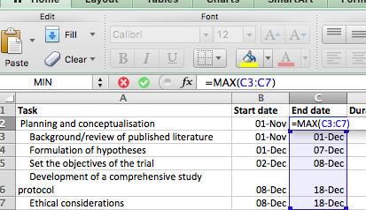


Make sure that you only select the sub-tasks that belong to each individual overarching task. So for example, for Planning and conceptualisation, only select up until "Ethical considerations" and *do not* also include the "Operationalisation and data collection" stage!


Once you have all your start and end dates, your table should look something like this: 


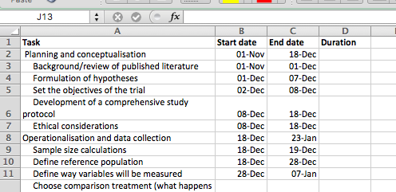


You might find that Excel changes the formatting of your dates in some of the cells, like mine did on the first 8 rows. You can see in those, the date is formatted as 01-Dec for example, whereas later it is formatted the way we entered it, such as 22/01/19. This is because Excel *knows* that the value you are entering here is a *date*.  It doesn't just think you're entering some weird words, it deduces that if what you are entering follows this rough format of 2 digits/ 2 digits / 2 digits, then it's likely to be a date. This is really handy, because you can do calculations on these cells now, that you would not be able to do, if Excel just thought that these were weird words. We will take advantage of this to calculate the duration column here. Do you really want to count out how many days are between the start and end date? Well in some cases it might be easy. It could be that you thought, "well I will start my random allocation of study participants into treatment and control groups on the 21st of January, and I think it will take about 2 days to do this, so I will end on the 23rd of January", but often you will have deadlines, that you need to work towards, or you might want to double check that you are counting correctly. In any case, to get the last, *duration* column, you can simply use an equation, where you subtract the start date from the end date, and you get the number of days that are inbetween. Isn't that neat? You can simply apply some simple maths notations to your date data in Excel, and you get meaningful results, such as the number of days that exist between two dates! We will play around more with dates and such in week 7 of this course, so you can see some more date-related tricks then!


Right, back to our dates, so remember, all formulas start with the `=` equation, and here all we are doing is subtracting the value of one cell (start date) from another cell (end date). Like so: 


Copy and paste the formatting all the way down, and ta-daa you have your column for the duration of each task:


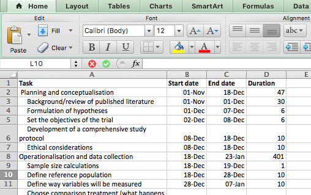


Now you have all the columns you need, to be able to build your Gantt chart. 


To do this, click on an empty cell, anywhere *outside* your table, and select Charts > Stacked Bar Chart: 


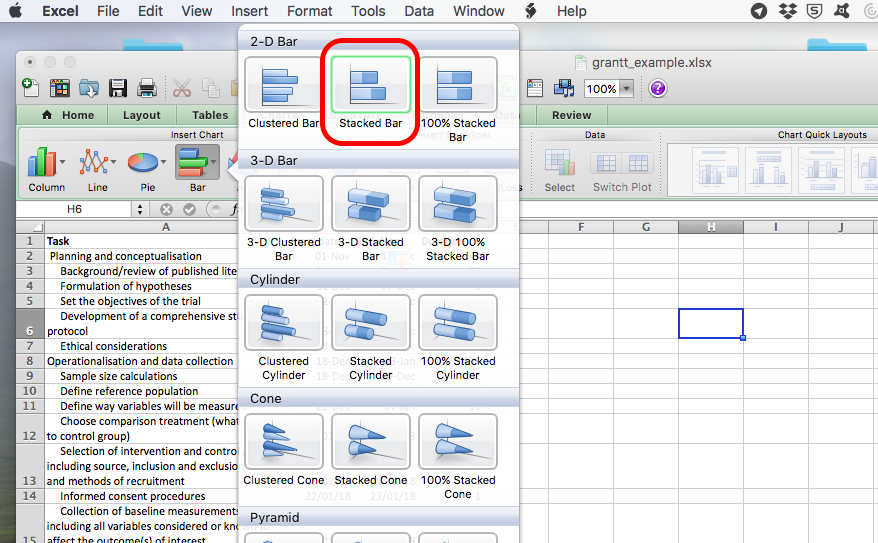


An empty chart will appear like so: 


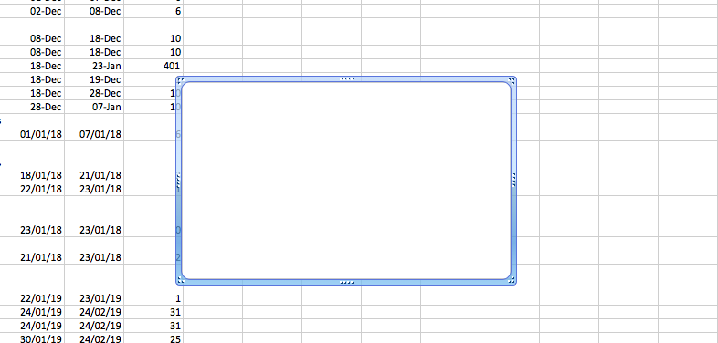


Right-click anywhere in the empty chart space, and choose the option "Select Data...":


This will open a dialogue box. This dialogue box might look different if you're on PC or on Mac (and even on Mac your version will be newer than mine, so might look slightly different) but the basic commands should be the same. If you cannot find anything, let us know!


So on this popup window, select the option to *Add* data. 


On PC: 


On Mac: 


When you select this option, you have to supply 2 values to this series. First you have to tell it the name. This is simply the cell that contains your column header. Then you have to tell it the values. These are all your start dates. You can select by clicking in the blank box for each value, and then clicking/ drag dropping on the spreadsheet. Like so: 


When you're done, click "OK". 


On a PC, when you click the "Add" button it will open a new window, but again, all you have to enter in that new window is the name and the values, the exact same way. Here is an illustrative example of what this will look like on PC: 


Now click OK, and you will see some bars appear, reaching to each start date that we have. Now we have to add the *duration*. To do this, just repeat the steps, for adding a series, but with the duration column this time.


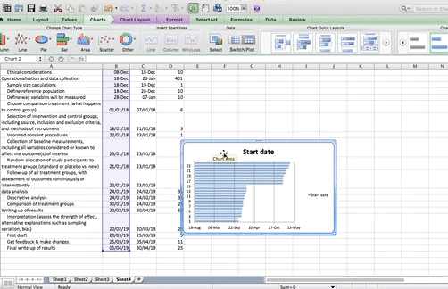


The part that appears in red above represents the duration of each task. The blue part now is actually redundant. We just needed it there, so that the red part (the actual task) begins at the correct point. So just like we did when making that box plot a few weeks ago, we clear the fill, we clear the line, and in case there is a shadow there, we clear that as well, so that we don't confuse ourselves by having that blue part there. 


Just to show something new, I will show you a different way of going about this here, buy you can just as easily follow the same steps you took when making things invisible in your boxplot. 


But the other things you can do is to click on the blue section of the graph to select it: 


And then right click and choose 'Format Data Series...':


Then on the side tabs, you can go through and select fill, and line, and even shadow, and make sure that they are all set to no fill/ no line/ no shadow: 


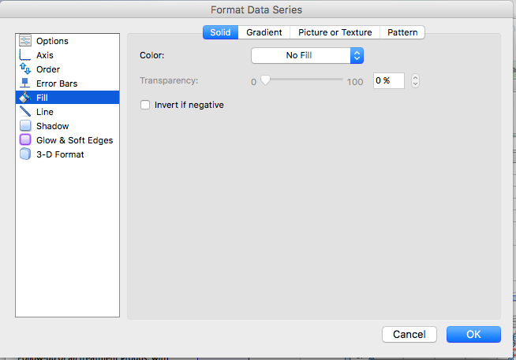


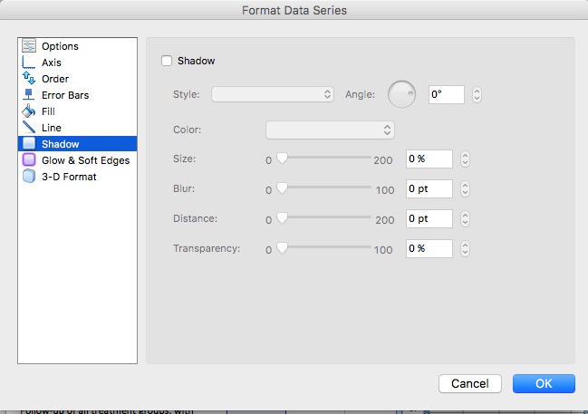


Then click OK, and you will see only the red parts of your graph, which represent each task and the duration it lasts: 


But what is each task? I just see numbers? Well we need to add the labels, from the task column of your data, to give it some sort of meaning. To do this, once again right click anywhere on your chart area, and select "Select Data...", and this time, for where it asks for axis labels, click in that box, and then highlight the column with the tasks in it: 


On a PC you will have to click the "Edit" button under the "Horizontal category axis labels" box. This will look something like this: 


When you then select the column with the tasks in it and click OK, it should label your tasks properly now: 


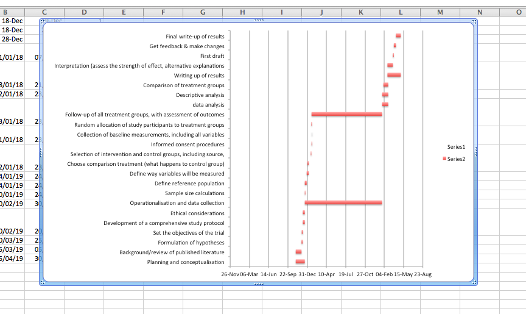


Now your Gantt chart is basically ready. It can be that yours looks sort of in a different order? If this is the case, go back to your data, and sort your data on the "End date" column. If you do this, then you will have your fist tasks at your top, and the last tasks at the bottom. This should help you plan your tasks. You can take some time to edit your Gantt chart formatting to make it look the way that you would find it the most helpful. For example, here's mine: 


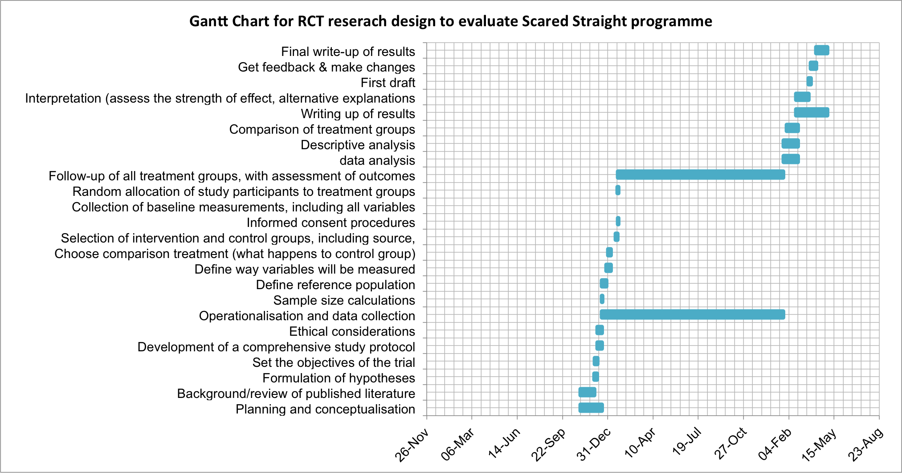

</span>

So what's going to take the longest? As you can see there, the longest duration is for the operationalisation and data collection tab. It's an overarching category, but there are not any sub-tasks associated with it for the majority of its duration. Well, the thing is, even though we are not actively collecting data in that longer period, we are still in the data collection phase. Can you think why?


Well we want to know if scared straight works on reducing offending right? So for this, we need to recruit our people, assign them into a control and a treatment group, and then *wait for a pre-determined amount of time* before we can collect the follow-up data - or the *after* data. 


Remember back ton conceptualisation. How do we conceptualise reoffending? Well in this case, we conceptualise it as if the person has offended in the 12 months following taking part in the scared straight programme. Because of this, we have to wait 12 months until we collect our "after" data. 


Planning is a very important part of the research project, and the research design which you pick will greatly affect your research plan. Think about if we considered instead a one-time survey? We could ask people - "have you ever taken part in a scared straight programme?" And then ask them "have you offended in the last 12 months?". But this is a **cross-sectional** study design, in which we only take measurement at one point in time. This is a very different study design, and the advantages of an RCT over a cross-sectional survey in terms of determining the effect of an intervention are widely discussed in your readings. However you can also imagine how it would be an easier study to carry out, right? The data collection part of your Gantt chart there would reduce significantly, from over 12 months, to something much shorter, just the length of time it takes to conduct one survey. Maybe a month. 


Hopefully you are beginning to get an idea into the nuances of finding your optimal research design. To a certain extent this is dictated by your research question. If you want to know whether scared straight works or not, and you want to design a study to assess this, an RCT is your ideal way forward. However your hands may be tied. If you wanted to do this as part of an undergraduate dissertation project for example, you cannot just wait 12 months to follow up people's offending, as your deadlines will have all passed by then. 


The Gantt chart is a handy tool for research planning, and considering all the tasks that you need to carry out, as dictated by your research design. We illustrated here with the example of planning an RCT. To get the steps for these we can consult the reading, we can look at previous studies, or we can browse around for outlines others have used. For example, the RCT one is based on [this proposed outline](https://www.healthknowledge.org.uk/e-learning/epidemiology/practitioners/introduction-study-design-is-rct) for RCTs.  Your readings around each research design will give you an indication of what tasks are involved with each one, and you should be able to produce such an outline for any kind of project. It is a good way to keep yourself on track, to make sure that you do not take on too many tasks, and also to show your supervisor/ employer/ person marking your project proposal, in case that is the stream you choose for your dissertation, that you are thinking about feasibility of your tasks. 


Once you have planned your project, you need to carry out each task. Something like a literature review you will be familiar with from your work on other modules. You have to have a read through the relevant literature, in order to be able to identify whether your research question has already been answered, to look into what other people are researching in your topic area, to consider the approached to conceptualisation and operationalisation that others before you have taken, and to engage with what is currently happening in this topic you're interested in. This will lead you to your research question, and your hypotheses. Hypotheses are the testable versions of your questions. 


For example if our research question is: does scared straight deter reoffending in young people? your hypothesis would look something like this: those who did not receive scared straight program intervention will offend more than those who did.  


Once you have this you're almost good to go, except you will have to make sure that you are addressing any ethical considerations with the research. We'll return to this a bit later, in its own section. 


But fast forward to the point where you have your sample. Let's say you've carried out all your planning, all your calculations, and you now have a set of people who you want to assign to your control and your treatment groups. The distinguishing feature of an RCT is the random assignment of people in your sample to either group. How does this work? Well the next section will explore just this.


### Activity 2: Random assignment into control and treatment


So how does random assignment work? Well we could achieve this by going old-school, and writing everyone's name on a piece of paper, and drawing the names out of a hat. But here we will use Excel's ability to programmatically assign people into treatment or control.  You are all Excel pros by now, with your formulas, and your lookups and pivot tables. So might as well hone these skills some more. 


So to have random assignment to a group, each member of your sample has to have the same probability of being selected for each group. Let's say we want to assign two groups. We want to assign people to a **control group** and a **treatment group**. Remember that the control and the treatment must be must be coming from the same sample, so that they are similar in all characteristics *except* in the particular thing you are interested in finding out the effect of. By random assignment, each person has the same probability of being in the treatment or the control group, and so there is no chance for systematic bias, as there would be for example if you were asking people to *self-select* into treatment or control. If people were given the chance to volunteer (*self-select*) it would leave open a possibility that people with certain traits are more likely to volunteer, and there might be some systematic differences between your two groups.  

<span style="color:#d95f02">
So let's say we have our sample of people who will be assigned either to the treatment group, of recieving the scared straigh treatment, or the control group, who do not have to go through this treatment. Well let's say we have our class here. We've got a total of 58 students enrolled in the class. Go ahead and download this list, from Blackboard. You can find it under week 5 > data > student.xlsx


Once you have downloaded the data, open it with excel, and have a look at it. You can see that we have 58 rows, one for each student. You can also see that we have 3 variables: ID,	Name, and	Program. 


To assign people randomly to a group, we can use Excel's `=RAND()` function. The Excel RAND function returns a random number between 0 and 1. For example, `=RAND()` will generate a number like 0.422245717. RAND recalculates when a worksheet is opened or changed. This will become important later. 


So give it a go. Create a new column called "random number" on our data. Like so: 


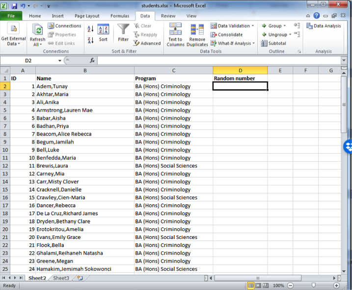


Now simply type `=RAND()` into the first cell and press Enter: 


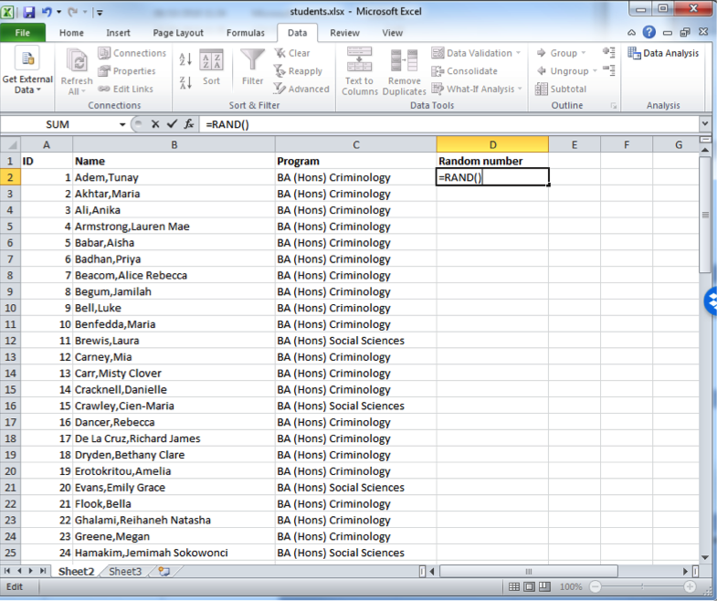


When you hit enter, the formula will generate a random number, between 0 and 1. Something like this: 


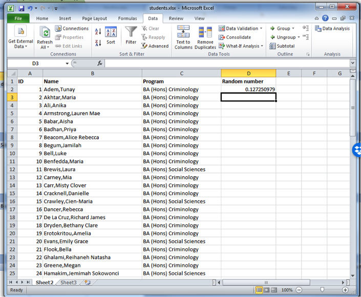


Did you get a different number for Julia there, than I did? Chances are, you did. This `RAND()` function generates a random number each time used. If I did this again (and try this on your data), it will give a different number. Try. Go into the cell, where you've typed =RAND(), and instead of exiting out of the formula with the tick mark next to the formula bar, just press enter again. You should, now, have another random number appear. Now copy and paste the formula (and make sure its the formula you're copying, and not the value) to every single student in our sample. You will end up with a whole range of values, between 0 and 1, randomly assigned to everyone. Something like this: 


Now we can use these values, which have been assigned *randomly* to assign students to a control or treatment groups. Remember last week when we were doing some re-coding? Remember when we were recoding the numeric variable into a categorical one? And I left a little bonus question at the end? Well the bonus question was asking essentially, what value can you use, as a cut-off point, to make sure that 50% of your data get put into one group, and 50% of your data into the other group? This question should already be familir to you, but let me re-phrase: what measure of central tendency cuts your data right in half based on considering the values on a numeric variable? 


Are you thinking **median**??


Nice work! Indeed the median is the value that divides our data right smack in half. Now are you starting to realise where I'm going with this? Basically, if you want to assign each student, based on this randomly assigned score, to either control or treatment groups, and we want to make sure that equal amounts of students go to either group, then what we can do is use the `IF()` statements we were using last week to re-code data!


How? Well remember what we did to assign people into tall or short categorical variable values, based on the numeric value for height? We decided that if a  person is taller than average, they will be labelled "Tall" and "Short" if they are not. So what are the elements of our statement? We need to check *if* the person height is *greater than* the *average height* and if it is, type "Tall", else type "Short". Remember now? 


We can apply this again here. So to recap,  we know that the `IF()` function takes 3 arguments. 1st the logical statement, that has to be either true or false. Then the other 2 values that the `IF()` function needs is what to do if the statement is true, and what to do if the statement is false. 
So altogether, your function will look like this:


`=IF(condition, do if true, do if false)`


What is our condition here. Well we are using this time the median to divide our randomly assigned numbers into 2. So we want to assign people into treatment or control, if they are above or below the median in their random number, that was allocated to them randomly. This ensures the *random* element of the randomized control trial, and ensures that people have equal probability of ending up in either group. 


Let's say anyone with a random number above the median will be in the treatment group, and anyone with a random number below the median will be in the control group. What is our condition in this case? What is it that we are testing each number against?


Well in this case we are testing people against whether their random number is greater than the median of all the random numbers. If their random number is greater than the median of all random numbers, then they are part of the treatment group (what happens if condition is true). On the other hand, if their random number is **not** greater than the median of all the random numbers, then they are assigned to the control group (what happens if condition is false). If any of this is unclear for you at the moment, then please raise your hand, and make one of us explain this. 


Translated into Excel language, our formula is: 


`=IF(random number value > median(all random numbers), "Treatment", "Control")`


For example, for our first person in the list there, the formula will look like: 


`=IF(D2 > MEDIAN(D:D), "Treatment", "Control")`


As such :


Hit Enter, and then copy the formatting all the way down, so that everyone in the class has been assigned to the control and treatment groups. 


You should have something like this: 


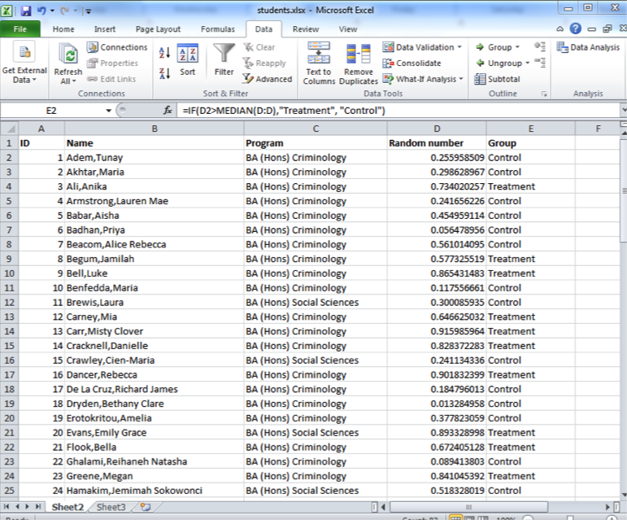


Don't worry if you don't get the same values, as I said this is *random* and so you should not get consistently the same answers. In fact you should get different ones to your friends next to you as well. 


One way that you can sense check your results is to have a look at your treatment and control groups. Let's see how many students we have in each. You can use a pivot table to do this, and create a *univariate* *frequency table* to look at this new "Group" variable. 


You've built enough of these by now that you should be OK making this pivot table on your own, without guidance. If you get stuck on something though, let us know!


If all goes well, your pivot table should let you know that you have 29 students in your control group, and 29 students in your treatment group: 


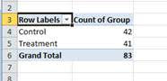

</span>

So, how did it go? Who's in your treatment and who's in your control group? Where did you end up? Find your name in your sample. Are you in the treatment or the control group? What about in the spreadsheet of the person next to you? 


If you were assigned to the treatment group, as treatment [watch this Saturday Night Live skit on Scared Straight](https://www.youtube.com/watch?v=sw1vm_PO8ss). Let's see what it does for your offending...


If you were assigned to the control group, you can instead [watch this Saturday Night Live skit on Star Wars auditions](https://www.youtube.com/watch?v=-T_pjMr7-n0).
 

Now you've been exposed to either the treatment or the control condition. I'll be in touch in 12 months time to follow up, and find out about your offending behaviour. I'll report the results back in a paper. Science...!


## Activity 3: Stratified randomisation


Randomization is important because it is almost the only way to assign all the other variables equally except for the factor (A and B) in which we are interested. However, some very important confounding variables can often be assigned unequally to the two groups. This possibility increases when the number of samples is smaller, and we can stratify the variables and assign the two groups equally in this case.

For example, if the smoking status is very important, what will you do? First, we have our method of randomization that we learned previously. Just to put a name to this, the approach we had followed was **simple randomisation** There are two randomly assigned separate sequences for smokers and non-smokers. Smokers are assigned to the smoker's sequences, and non-smokers are assigned to the non-smoker's sequences. Therefore, both smokers and non-smokers groups will be placed equally with the same numbers.

So we can use 'simple randomization with/without stratification'. However, if there are multiple stratified variables, it is difficult to place samples in both groups equally with the same numbers. Usually two or fewer stratified variables are recommended.

<span style="color:#d95f02">
What does that look like? Well let's illustrate again with assigning you, the class, into control and treatment groups for the scared straight programme. Let's say that we knew that there was a different effect of Scared Straight possibly on those in BA Criminology and BA Social Sciences programme participants. This means that we've identified the *program* variable to be a **confounding variable**. A confounding variable is an outside influence that changes the effect of a dependent and independent variable. To account for this, we want the same number of BA Crim and BA Social Science students in both groups. Because if we didn't control for this, it could be that through the random assignment alone, one group would have only BA Crim students, and the other have all the BA Social Science students. Now if we think that program is a **confounding variable**, in other words it's something that might influence our dependent variable, then we want to account for this, because otherwise, even if we find a difference between the two groups, we'll be unable to say whether it's due to the Scared Straigh intervention, or this variable of degree program!  


So how can we make sure that both BA Criminology and BA Social Sciences groups will be placed equally with the same numbers?


Well to do this, you would go back to your random numbers that we created with the `=RAND()` function. The important thing here is, that you consider how we assigned people into control/treatment groups. We decided that everyone with a random number above the total group median gets treatment, and everyone below gets control. The total group median was used to divide the total group into two. So what do you think can be done to do this for 2 groups? You guessed it, *you have to assign each group based on their own group median!*. 


There are two ways of doing this, the long manual hard way, or the easy lazy code way. Let's start with the code way. 


Just like before, we use an IF statement. Except this time the condition will change. Instead of saying, if this person's random score is above the median score for all students, we have to change it to say that "if this person's random number is above the median *for his/her group*" then assign him/her to the treatment. Else assign him/her to the group. The important extra addition there is the *for his/her group*. This means that we are changing what data to calculate the median from. 


We've calculated conditional medians before. Do you remember? This was in the third week, when we were carrying out bivariate analysis between a categorical and a numeric variable, and you had to calculate the median for each possible value of the categorical variable. 


Here we apply the exact same logic, but we select for each person to calculate the median for all the others who match his/her value for the program variable. 


The outer IF statement remains exactly the same procedure as it was for the one group, but now you are doing it for the two. This means that only your *condition* in your "IF" statement changes. Remember our IF statement for assigning based on the total median?


`=IF(D2>MEDIAN(D:D), "Treatment", "Control")`


To change, we change only the condition. The condition here is the `D2>MEDIAN(D:D)` part. That part assesses whether the person's random number was above the total median. Well now we need to introduce another IF into this equation, to make sure that we are calculating the appropriate group median, for the program. So if they student's value for the program variable is BA Crim, we should calculate the crim median, and if it's BA Soc Sci, then we should calculate the soc sci median. Sounds familiar?


So if total median is `MEDIAN(D:D)`, then our conditional mean calculation is...:


`MEDIAN(IF(C2=C2:C59, D2:D59))`


Where you are saying, if the cell value of C2 (so the program for the person in row 2) is equal to the values in the program column (c column), then include those random numbers in the calculation of the median. So if you just replace the median statement from the initial IF with this, creating a new condition, like so: 


`D2 > MEDIAN(IF(C2=C2:C59, D2:D59))`


And now, all you need to do, is plug in this new condition into your outer IF statement:


`=IF(D2 > MEDIAN(IF(C2=C2:C59, D2:D59)), "Treatment", "Control")`


Don't forget to add your dollar signs, for copy and pasting the formula: 


`=IF(D2 > MEDIAN(IF(C2=$C$2:$C$59, $D$2:$D$59)), "Treatment", "Control")`


And also don't forget to hit `Ctrl` + `Shift` + `Enter` instead of *just* Enter. 


You should get, for each person, an evaluation against the median of the particular group that this person belongs to. Again you can check whether or not this has worked, in terms of assigning half the people to treatment and the other half to control, by producing a pivot table to look at the frequency of the stratified group variable, that you've now created. 


You might notice that your pivot table shows a no longer even distribution between the groups: 


Take a moment to think about why this might be? Maybe consider the number of people in each group. Is this an even or an odd number? In the event that there is an odd number, then when you divide the data into half, since we are splitting people, you will end up with one group larger than the other (by 1 person). Unless someone volunteers to be split in half, and half of them being put in one group, and the other half in the other, this can happen. So what can you do? Well I'll leave this here as something for you to think about. If you have an idea, or if you have no idea, and want to discuss, raise your hand now, we will come around to talk through it. 


But create a bivariate frequency table though, using your stratified group variable and the program variable: 


You can see that both BA Crim and BA Soc Sci are split about half and half, assigned into treatment and control. 


What about using the other treatment/control grouping, the one where we **did not** stratify by programme?


You will all have different results here, since it's randomly assigned, but it's possible that for some of you BA Soc Sci might be overrepresented in one group versus the other. If this were the case, and we knew (or suspected) that this variable of what program you're enrolled in had an effect on offending behaviour, then this might influence the validity and generalisability from your study. 
</span>


### Freeze!


Now before you're done here there is one last thing to note. Remember when describing the `=RAND()` formula, I mentioned that RAND recalculates when a worksheet is opened or changed? Now let's say we've assigned everyone to treatment or control conditions, we make you all watch your appropriate videos, and then, we save our worksheet, to return to it 12 months later. In 12 months, we may not wholly remember who was assigned to which group. You yourself might not remember either. But if upon reopening, the random numbers are changed, then the assigned groups will also change! So since we don't want this, we want to somehow "freeze the values". 


You can do this by highlighting the column and going to Formulas > Settings > and selecting "Calculate Manually". 


On mac: 

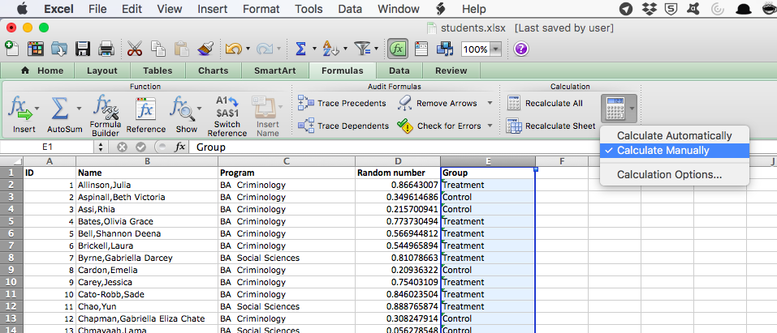


And on PC: 


This way you will be able to keep track of who was assigned to control and who was assigned to the treatment groups. 


## A final note on evidence: Meta Analysis


So let's say we ran our RCT on Straight and we found some sort of effect between those exposed to it and those not. While we make all arrangements possible to ensure the reliability, validity, and generalisability of our study, we are only human, and we can make mistakes. Even if we don't make mistakes, the way that inferential statistics works, is that one out of every 20 studies will be wrong, just probabilistically. This will make more sense if you move on to study inferential statistics, but basically we, as social scientists, resign ourselves to work with a 95% confidence rate, so on the whole, we are admitting to be wrong about 5% of the time (1 out of 20). So yes, while RCTs are strong, robust evidence for or against a programme, often they can still be disputed. 


This is very well illustrated in reception of actual evaluations of Straight programmes. And there are many. This is mostly because studies either find **no effect** or a **negative effect** of the programme on at-risk youth. This means that it either doesn't stop their offending, OR MAKES IT WORSE, compared with control groups. Hold on a second?!? Why are we implementing programmes that *at best* don't work, and at worst, make offending worse? Well like all businesses, Scared Straight programmes will tug at the credibility of individual studies, and if you are up against something that is making a lot of money for someone, you will need to produce quite robust evidence to bring it down. 


You may have come across something called the "evidence pyramid". This is a visual representation of the hierarchy of evidence, so basically the credibility of a study in evaluating an intervention, based on its study design. The most robust evidence is at the top, while the least is at the bottom. 

Here it is: 


Well here is *a* version. There are many versions of this out there. But you can see, for all we've been praising RCTs here, there is actually a step above. This is *systematic reviews*. I'm not going to hugely go into this, but essentially these represent the *study of studies*. So what a systematic review, and in particular, it's subset, the **meta-analysis** do, is consider *all previous studies* and evaluate their results. That way, you can draw conclusions and say that many studies are all finding that Scared Straight has no or negative effect, and it becomes much harder to criticise! 


Meta-analysis is the quantitative analysis of findings from multiple studies. At its core, meta-analysis involves researchers pulling together the results of several studies and making summary, empirical statements about some cause and effect relationship. A classic example of meta-analysis in criminology was performed by Wells and Rankin and concerned the relationship between broken homes and delinquency.

After observing a series of findings showing that the broken-homes-causes-delinquency hypothesis was inconclusive, Wells and Rankin identified fifty studies that tested this hypothesis. After coding the key characteristics of the studies, such as the population sampled, age range, measures (both independent and dependent) used, the authors found that the average effect of broken homes across the studies was to increase the probability of delinquency by about 10 to 15 percent. Perhaps more importantly, they found that the different methods used across the studies accounted for much of the variation in estimating the effect of broken homes. For example, the effect of broken homes on delinquency tended to be greater in studies using official records rather than self-report surveys.

Although the research community has not spoken with one voice regarding the usefulness of meta-analysis, one thing is clear: meta-analysis makes the research community aware that it is inappropriate to base conclusions on the findings of one study. It is because of this important lesson that meta-analysis has become a popular technique in criminological and criminal justice research.


If you are still interested in the outcomes of Scared Straight, you can read a [meta analysis here](http://onlinelibrary.wiley.com/doi/10.1002/14651858.CD002796.pub2/full). TL;DR: It doesn't work


## Longitudinal data

There are two commonly used longitudinal research designs,** panel **and **cohort** studies. Both study the same group over a period of time and are generally concerned with assessing within- and between-group change. Panel studies follow the same group or sample over time, while cohort studies examine more specific populations (i.e., cohorts) as they change over time. Panel studies typically interview the same set of people at two or more periods of time. 


For example, the 1970 British Cohort Study (BCS70) follows the lives of more than 17,000 people born in England, Scotland and Wales in a single week of 1970. Over the course of cohort members' lives, the BCS70 has broadened from a strictly medical focus at birth to collect  information on health, physical, educational and social development, and economic circumstances among other factors.

The Millennium Cohort Study (MCS), which began in 2000, is conducted by the Centre for Longitudinal Studies (CLS). It aims to chart the conditions of social, economic and health advantages and disadvantages facing children born at the start of the 21st century.


Our Future (formerly the Longitudinal Study of Young People in England (LSYPE2)), is a major longitudinal study of young people that began in 2013. It aims to track a sample of over 13,000 young people from the age of 13/14 annually through to the age of 20 (seven waves).


These are some examples from the UK Data Service ([see those and more here](https://www.ukdataservice.ac.uk/get-data/key-data/cohort-and-longitudinal-studies))


The main advantage of longitudinal studies is that you can track change over time, and you meet the temporal criteria for causality. You collect data from people across multiple **waves**. Waves refer to the times of data collection in your data. For example, if you follow a cohort from birth until their 30th birthday, and you take measurements every 10 years, once at point of birth, once at age 10, once at age 20, and finally at age 30, then you will have 4 waves in this longitudinal data about these people you're following. 


### What does longitudinal data look like?


So far we've only shown you cross-sectional data. Each row was one observation, each column as one variable, and they were collected at a single point in time. So what do longitudinal data look like? 
A longitudinal study generally yields multiple or “repeated” measurements on each subject. So you will have many, repeated measure, from the same person, or neighbourhood, or whatever it is that you are studying (most likely people though... when you take repeated observations about places it's more likely to be a time-series designs. Time-series designs typically involve variations of multiple observations of the same group (i.e., person, city, area, etc.) over time or at successive points in time. Typically, they analyze a single variable (such as the crime rate) at successive time periods, and are especially useful for studies of the impact of new laws or social programs. An example of a time-series design would be to examine the burglary rate across the boroughs of Greater Manchester over the last five years. We'll be dealing with time series in week 7.)


Okay so what do these data actually look like? Well have a look at the description for the [Next Steps (formerly the Longitudinal Study of Young People in England (LSYPE1))](https://discover.ukdataservice.ac.uk/series/?sn=2000030). Briefly mentioned above, the Next Steps (formerly the Longitudinal Study of Young People in England (LSYPE1)) is a major longitudinal study that follows the lives of around 16,000 people born in 1989-90 in England. The first seven sweeps of the study (2004-2010) were funded and managed by the Department for Education (DfE) and mainly focused on the educational and early labour market experiences of young people.

The study began in 2004 and included young people in Year 9 who attended state and independent schools in England. Following the initial survey at age 13-14, the cohort members were interviewed every year until 2010. The survey data have also been linked to the National Pupil Database (NPD) records, including cohort members’ individual scores at Key Stage 2, 3 and 4.

In 2013 the management of Next Steps was transferred to the Centre for Longitudinal Studies (CLS) at the UCL Institute of Education and in 2015 Next Steps was restarted, under the management of CLS, to find out how the lives of the cohort members had turned out at age 25. It maintained the strong focus on education, but the content was broadened to become a more multi-disciplinary research resource.


There are now two separate studies that began under the LSYPE programme. The second study, Our Future (formerly LSYPE2), began in 2013 and will track a sample of over 13,000 young people from the age of 13/14 annually through to the age of 20 (seven waves).


There are a lot of interesting variables in there for those interested in young people and delinquent behaviour. There is some data about drug and alcohol, some about offending such as graffiti, vandalism, shoplifting, as well as social control factors such as family relationship, bullying, and so on. If you are interested in the data, you can always have a browse through the [site here](https://discover.ukdataservice.ac.uk/Catalogue/?sn=5545&type=Data%20catalogue&lt) and [have a read of one of the questionnaires as well](http://doc.ukdataservice.ac.uk/doc/5545/mrdoc/pdf/5545age_25_survey_questionnaire.pdf). 


In any case, we should get back to our question, what does this data look like. And it looks exactly as you would imagine, it looks like the results of survey questionnaires, completed by people, but over time. If you were to download the next steps data for example, you will end up with a separate file for each wave. But in each wave, you would have **repeat measures** of the same variables, from the same people. So each wave you see the exact same variables, and the exact same people making up the rows of answers, but you know that time has passed. 

The benefit of a longitudinal study is that researchers are able to detect developments or changes in the characteristics of the target population at both the group and the individual level. The key here is that longitudinal studies extend beyond a single moment in time. As a result, they can establish sequences of events. It is generally admitted that causes precede their effects in time. This usually justifies the preference for longitudinal studies over cross-sectional ones, because the former allow the modelling of the dynamic process generating the outcome, while the latter cannot. Supporters of the longitudinal view make two interrelated claims: (i) causal inference requires following the same individuals over time, and (ii) no causal inference can be drawn from cross-sectional data. 


Anyway have a look at a small subset of 3 waves of the data. There are 4 variables in each wave. The first one,  "NSID" is the unique identifier for each person. Then there are three variables that contain the answers that each person gave to some questions. * W1canntryYP*	is the answer to whether the young person ever tried Cannabis. *W1alceverYP*	is the answer to whether the young person ever had proper alcoholic drink, and *W1cignowYP*	is the answer to whether the young person ever smoked cigarettes.


So you can download these three waves of young people being surveyed from blackboard. You can find them labelled wave_1.xlsx, wave_2.xlsx, and wave_3.xlsx in the data folder for this week on BB. Download all three onto your computer, and open them up in excel. 


### Activity 4: Linking data


So hopefully if I've taught you anything about the structure of data, is that you have *all* your observations in your rows and *all* your variables in your columns. So if you want to be able to look at changes in people's responses over time, for example, you will need to be able to link these data sets together into one spreadsheet. 


So how do we do this? Well what you can do is to link one data set with another.  Data linking is used to bring together information from different sources in order to create a new, richer dataset. This involves identifying and combining information from corresponding records on each of the different source datasets. The records in the resulting linked dataset contain some data from each of the source datasets. Most linking techniques combine records from different datasets if they refer to the same entity. (An entity may be a person, organisation, household or even a geographic region.) 


You can merge (combine) rows from one table into another just by pasting them in the first empty cells below the target table—the table grows in size to include the new rows. And if the rows in both tables match up, you can merge columns from one table with another by pasting them in the first empty cells to the right of the table—again, the table grows, this time to include the new columns.


Merging rows is pretty straightforward, but merging columns can be tricky if the rows of one table don't always line up with the rows in the other table. By using `VLOOKUP()`, you can avoid some of the alignment problems.


To merge tables, you can use the VLOOKUP function to lookup and retrieve data from one table to the other. To use `VLOOKUP()` this way, both tables must share a common id or key.


This is a standard "exact match" `VLOOKUP()` formula (remember that means you have to set the last parameter to 'FALSE' for an exact match). 


So first things first, open up all three waves in three separate excel spreadsheets. Have a look at them all. You can see the first one has the following columns: 

- *NSID*: the unique ID
- *W1canntryYP*: ever tried cannabis	
- *W1cignowYP*: ever smoked	
- *W1alceverYP*: ever had alcohol


Then you can have a look at wave 2. You will see in wave two that the unique ID column stays the same (*NSID*: the unique ID), but the other three columns are named slightly different: 

- *W2canntryYP*: ever tried cannabis	
- *W2cignowYP*: ever smoked	
- *W2alceverYP*: ever had alcohol


It might be a subtle difference, but the first two characters in the variable name actually refer to the wave in which this variable was collected. This is very handy, because if you imagine that they were just called "canntryYP" and "cignowYP" and "alceverYP", once they would be joined together into one data set, then how would you be able to tell which one came from which wave? You could rename them yourself (which is what you would do in this case) but it's very nice that these data were already collected with this joining in mind, and so the variable naming was addressed for us in this way. 


If you're still curious, have a look at wave 3, where you will see the familiar NSID column, as well as these three: 

- *W3canntryYP*: ever tried cannabis	
- *W3cignowYP*: ever smoked	
- *W3alceverYP*: ever had alcohol


So why doesn't the NSID column change? Well this is the same value for all participants all throughout. This is so that we can identify each one. Due to ethics and the data protection act, we cannot share data that contains personally identifiable information, especially in cases where it refers to some pretty sensitive stuff, such as someone's drug use, alcohol use, or some delinquent behaviour. Instead each person is given a unique code. This code can be used to track them, over time, without identifying them personally. 


You need a unique identifier to be present for each row in all the data sets that you wish to join. This is how Excel knows what values belong to what row! What you are doing is matching each value from one table to the next, using this unique identified column, that exists in both tables. For example, let's say we have two data sets from some people in Hawkins, Indiana. In one data set we collected information about their age. In another one, we collected information about their hair colour. If we collected some information that is unique to each observation, and this is the *same* in both sets of data, for example their names, then we can link them up, based on this information.  Something like this: 


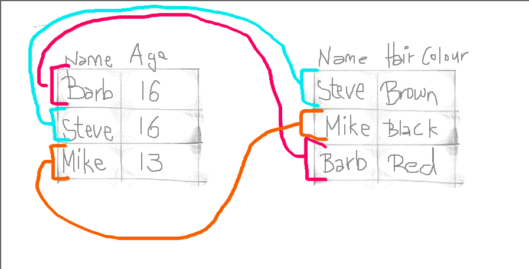


And by doing so, we produce a final table that contains all values, lined up *correctly* for each individual observation, like this: 


This is all we are doing, when merging tables, is we are making use that we line up the correct value for all the variables, for all our observations. 


So let's do this with our young people. Let's say we want to look at the extent of cannabis, alcohol, and cigarette trying in each wave of our cohort, as they age. To do this, we need to link all the waves in to one data set. We have established that the variable *NSID* is an anonymous identifier, that is unique to each person, so we can use that to link their answers in each wave. 


So remember the parameters you need to pass to the `VLOOKUP()` function, from last week? You need to tell it:

- first *what value to match*, 
- then *where the lookup table is*, 
- then *which column of this table you want*, 
- and finally *whether or not you want exact match*. 


In this case, we want to match the unique identifier, found for each person in the *NSID* column. This is the value to match. Then our lookup table is now *the other data set* which we want to link. The column will be the matching column to what we are copying over, and the exact match parameter we will set to "FALSE" (meaning we *do* want exact matches only). 

<span style="color:#d95f02">

So what does this look like in practice? 


Well let's open up our wave 1 (well technically you have them all open, so just bring wave 1 to the front). Now we don't want to overwrite this file, so save it as something new. Do this by selecting File > Save As... and choosing where to save it, and giving it a name. Here I will save it in the same folder where I've saved the individual waves data, and call it "next_stepsw1-3.xlsx" as it will contain waves one through three of the next steps longitudinal survey:


Now that you have this as a new file (which already contains the data from wave 1), you can get ready to merge in the data from waves 2 and 3. First, lets create column headers for the variables we will copy over. You can do this by simply copying over the column headers from the other data sets (waves 2 and 3). Like so: 


Notice that I'm not copying over the NSID column. This is because it would be exactly the same. It's enough to have this once, there is no need for three replications of the same exact column. If you are participant NS23533L, you will always have this value for the NSID column. This is used to match all your answers, and to copy over into this sheet, but it is *not* itself copied over. If this is confusing as to why, just raise your hand now, and we will come around to talk through it. 


Right so now we have all our column headers, let's copy over the column contents. When you type in the `VLOOKUP()` function into Excel, it gives you a handy reminder of all the elements you need to complete: 


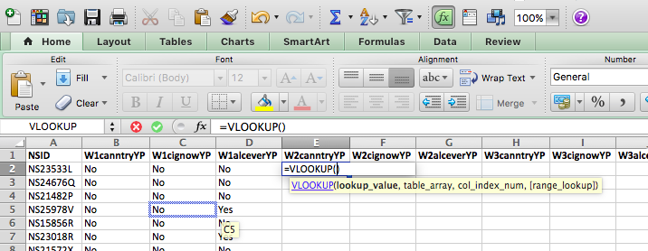


- *lookup value* - what value to match, 
- *table array* - where the lookup table is, 
- *col index num* - which column of this table you want, 
- and finally *range lookup* - whether or not you want exact match.


Our lookup value will be the NSID for this particular person. Here we find this in cell A2: 

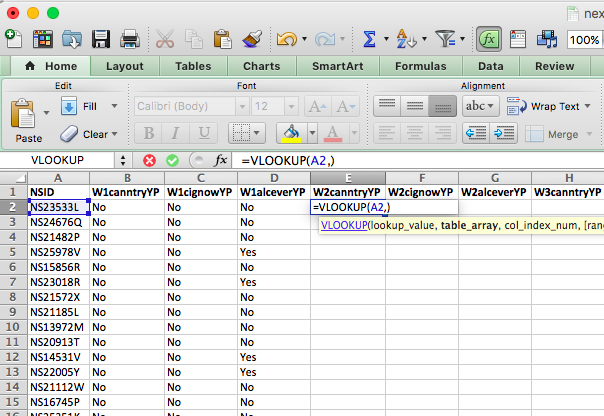


Now the table array is the lookup table. Where can we find the values for "W2canntryYP"? Well this is in the data set for wave 2. We've grabbed data from other sheets before, but never from a totally different file...! However the process is exactly the same. All you need to do, is find the data set, and select the range that represents your lookup table, which is all the data in this sheet!


Something like this: 


You can see that by going to the  sheet and highlighting the appropriate columns, your formula bar there, in your original file, is populated with the code to refer to those columns in that file! Just like we did when grabbing data from a different sheet within the same file. 


Remember the reference of a cell is `column letter + row number`? The reference for a cell from a sheet is `sheet name + ! + column letter + row number`? Well the reference for a cell from a sheet on an entirely different file is `[ + file name + ] + sheet name + ! + column letter + row number`. 


So you can see that by clicking and highlighting, excel has automatically populated with the reference, which in my case is: 


`[wave_2.xlsx]wave_2.csv!$A:$D` - which means I want from wave_2.xlsx file, the wave_2.csv sheet, columns A through D (static, because I've included the dollar signs there). 


If any of this is unclear flag us down to talk through these now. You've been slowly building up to this though. We have gradually made formulas more and more complex, so all these are, are formulas you've learned before, but all patched together, to be making some new formulas. 


So now we still have two parameters to define, the column index number, and the range lookup. Column index number asks you, which column, from your reference table do you want to grab. Since we've copied over our headings in order, we know that the first heading will be column number 2 (column 1 contains the reference IDs in the NSID variable. Remember the reference tables you made for recoding last week? Same concept, the values *to match* are in the first column). Then the second one will be column number 3, and the third, column number 4. So in this case, our column index number is 2, and the range lookup is FALSE, because we want an *exact match*. 


So our final formula looks like this: 


`=VLOOKUP(A2,[wave_2.xlsx]wave_2.csv!$A:$D,2,FALSE)`


**NOTE** it's possible that for some of you (likely those on PCs) there will be quotes around the sheet reference in this formula, something like this: 


`=VLOOKUP(A2,'[wave_2(1).xlsx]wave_2.csv'!$A:$D,4,FALSE) `


see the `'` around the `[wave_2(1).xlsx]wave_2.csv`? You *might* see this in your version. But still achieves the same thing. 


Double click on the little blue square on the bottom right hand of the blue frame around this cell to copy the formula all the way to the bottom. 


To get the other two columns from the same sheet, you use the *exact same formula* except you change the column index number. Does it make sense why you do this? Because you're grabbing a *different column*. You're always grabbing the one that corresponds to your header, which you've copied over. If this is unclear make sure to raise your hand, so we can go through this. It's worth going through it even if you feel like you get it, as you will be doing this again in your task, and it's something much easier explained in person!


So now, copy the formula for the next two columns, change the column index number to 3 and to 4 as appropriate:


and you will see the values for each person from both wave 1 and wave 2 in there:


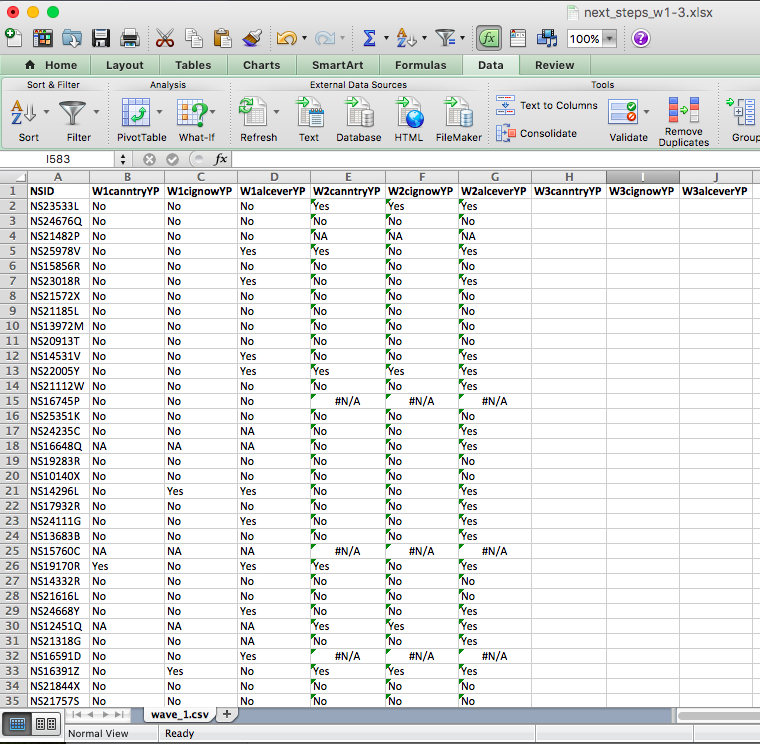


You can see that for some rows, in wave 2 we have a value of `#N/A`. This is because, that NSID is *not* found in the wave 2 data. 

</span>

One issue with longitudinal studies is something called **attrition**. Attrition occurs when cases are lost from a sample over time or over a series of sequential processes. One form of sample attrition occurs in longitudinal research when the subjects studied drop out of the research for a variety of reasons, which can include: unwillingness of subjects to continue to participate in research, difficulties in tracing original respondents for follow-up (for example, because of change of address) and nonavailability for other reasons (for example, death, serious illness). A survey of major longitudinal studies in the United States found that the average attrition rate was 17 per cent (Capaldi and Patterson, 1987, cited in Sapsford and Jupp, 1996). Therefore, quite a lot of cases may be lost. Attrition is one of the major methodological problems in longitudinal studies. It can deteriorate generalizability of findings if participants who stay in a study differ from those who drop out.


What you are seeing here are the presence of people who took part in wave 1, but not in wave 2. Attrition rates are important to know and mention in analysis of longitudinal data, to be able to discuss the issues which it may cause, as described above and in your readings. 


Attrition is only one cause of **missing data**. Sooner or later (usually sooner), anyone who does statistical analysis runs into problems with missing data. In a typical data set, information is missing for some variables for some cases. In surveys that ask people to report their income, for example, a sizable fraction of the respondents typically refuse to answer. Outright refusals are only one cause of missing data. In self-administered surveys, people often overlook or forget to answer some of the questions. Even trained interviewers occasionally may neglect to ask some questions. Sometimes respondents say that they just do not know the answer or do not have the information available to them. Sometimes the question is inapplicable to some respondents, such as asking unmarried people to rate the quality of their marriage. In longitudinal studies, people who are interviewed in one wave may die or move away before the next wave. When data are collated from multiple administrative records, some records may have become inadvertently lost.


You can see our second person with NAs there, NS15760C, also has NA values for the first wave. This means that while NS15760C was interviewed in the 1st wave (and potentially in waves 2 and 3 as well), they did not answer these questions! This could be because they put one of the answers that were coded as "NA", such as Refused to answer, wrote "Not applicable", or responses "Don't know", or because they were unable to complete or refused this whole section. Missing data is important, and it's important to know *why* your data is missing. When people refuse to answer something, it might be motivated by very different things than when people say "don't know" to something. If people with certain characteristics are more likely to not respond, then there might be systematic biases introduced through missing data. This is important to keep in mind. 

<span style="color:#d95f02">
OK so let's copy over wave 3 as well, and then we can have a look at our attrition and so on rates. 


Have a go at doing this on your own, following the steps from when we copied over wave 2, but this time from the wave 3 file. 


If you need a little nudge, the formula which I ended up with was: `=VLOOKUP(A2,[wave_3.xls]wave_3.csv!$A:$D,2,FALSE)`. Yours might look something similar. 


Then, when that is done, you will see a final data set with all the three waves of these questions present in your data:


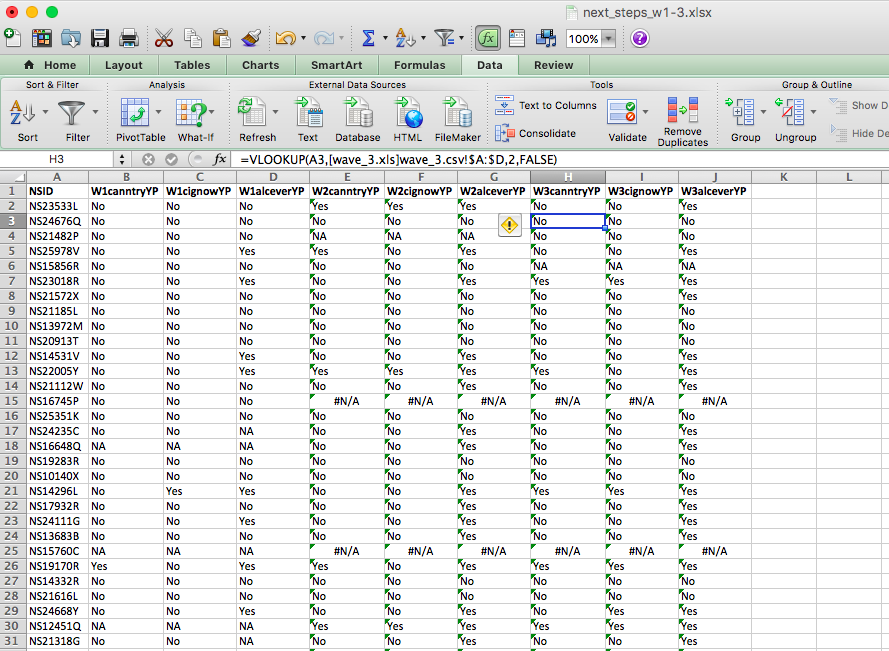


We picked up in the #N/A last time, there is another issue with longitudinal, and generally self-report data collection methods, available to spot here. Remember that all of our questions are asking people whether they have *ever* smoked, or *ever* tried cannabis, or *ever* had an alcoholic drink. So surely, once someone answers yes, you would expect them to keep answering yes, correct? Well, have a look at respondent number "NS23533L". While in wave 2, they admit to trying all cannabis and cigarettes and  alcohol, in wave three they seem to have forgotten this experience, and report that they have not ever tried either cannabis or cigarettes. The issue here is called **response bias**. 

</span>

Response bias is a general term for anything that influences the responses of participants away from an accurate or truthful response. These biases are most prevalent in the types of studies and research that involve participant self-report, such as structured interviews or surveys. It can be caused by a variety of factors, for example the phrasing of questions in surveys, the demeanour of the researcher, the way the experiment is conducted, or the desires of the participant to be a good experimental subject and to provide socially desirable responses may affect the response in some way. All of these " artefact" of survey and self-report research may have the potential to damage the validity of a measure or study. Because of response bias, it is possible that some study results are due to a systematic response bias rather than the hypothesized effect, which can have a profound effect on psychological and other types of research using questionnaires or surveys. It is therefore important for researchers to be aware of response bias and the effect it can have on their research so that they can attempt to prevent it from impacting their findings in a negative manner. Response biases can have a large impact on the validity of questionnaires or surveys.


There isn't much that we can do (at the stage of data analysis) to control for this. If you suspect that you will encounter response bias, you should consider this in your research design, and build measures into the data collection phase, that try to  account for or at least identify sources of response bias in your survey. 


## Complete cases (an approach to missing data)


There are a vast range of statistical techniques for accommodating missing data (see [www.missingdata.org.uk](www.missingdata.org.uk)). Perhaps the most commonly adopted is to simply exclude those participants in our dataset who have any data missing (in those variables we are concerned with) from our analysis. This is what is commonly known as a '**complete case analysis**' or 'listwise deletion' - we analyse only the complete cases. This approach simply says "we will not deal with any of the missing data", and instead subsets the analysis to the sample where participants have answered every question - in other words, only use the rows which do not have missing data. 


If data are missing complete randomly, meaning that the chance of data being missing is unrelated to any of the variables involved in our analysis, a complete case analysis is unbiased. This is because the subset of complete cases represent a random (albeit smaller than intended) sample from the population. In general, if the complete cases are systematically different from the sample as a whole (i.e. different to the incomplete cases), i.e. the data are not missing completely randomly, analysing only the complete cases will lead to biased estimates.


For example, suppose we are interested in estimating the median income of the some population. We send out an email asking a questionnaire to be completed, amongst which participants are asked to say how much they earn. But only a proportion of the target sample return the questionnaire, and so we have missing incomes for the remaining people. If those that returned an answer to the income question have systematically higher or lower incomes than those who did not return an answer, the median income of the complete cases will be biased. This is something to keep in mind when choosing the route of complete case analysis. 


### Activity 5: Selecting Complete Cases

<span style="color:#d95f02">

But how can we include only the compete cases? Well for this you can use the filter function of Excel. Remember the little funnel icon? Well if you go to the Data tab, you will see it: 


If you click on the Filter icon, you will see small downwards arrows appear on the column headers for your data, like so: 


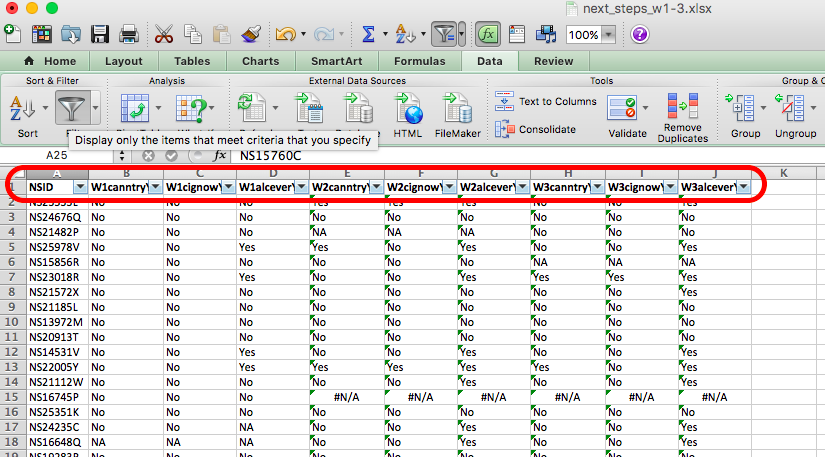


If you click on these arrows, you can see all the possible values that the variable can take, and you can see little check boxes next to these values. If you click in them you can toggle the tick/untick of these boxes, which means that you can hide the values which are not ticked. So in the first column, untick any value that is not "Yes" or "No", like so: 


You can see that any rows that had an NA value have been hidden. For example in the above image you can see that row 18 is gone, and instead we see row 17 followed by row 19. You can repeat this for all your rows, and you will end up with only cases where the person has answered "Yes" or "No" to these questions across all three waves of the study. You now have only the *complete cases* for your analysis. 

Filtering only hides these rows though, and they could still show up in your analysis. You don't really want to delete data, because that's never a good idea in case you make a mistake, or want to go back and re-do some analysis this time including some missing variables as well. Instead, one thing that you could do is to copy the complete cases only, over to a new sheet called "complete cases". To do this, create a new sheet (remember, plus sign at bottom of spreadsheet) and call it  "complete cases".


Then go back to your wave_1 sheet and copy all the columns, and then go back to your new, complete cases sheet, and paste in the values. You now have a new sheet, in your excel workbook, that has only the complete cases. 


So what do these complete cases look like? I can tell you, that there were originally 1000 people in this sample that I've subset for you. So now, after you've removed all the NAs, and have only complete cases, how many complete cases do you have?


If you did the same thing to me, you should have 622 cases left. Pretty big attrition rate, eh? Something to think about...!


Now, finally, since we've worked so hard on this data, let's have a look at it. Can you tell me, whether the percent of those who answered all questions in all three waves who *have* tried cannabis increases from wave to wave? 


If your gut reaction to this question was to do with fear and confusion, one thing you could do is think back to all the skills that we've learned so far, and which one of these you would need to draw on, to be able to answer this question. First, if you want to know if the percent of people who have tried cannabis (that is - answered yes to the question about trying cannabis) is greater for each wave than the wave before, you need to find out: what percent of people tried cannabis in wave 1, what about wave 2, and what about wave 3? In our newly created, complete cases data set, we know that we have one variable for cannabis trying in each wave. These are W1canntryYP for wave 1, W2canntryYP for wave 2, and W3canntryYP for wave 3. How can you find out the % who said yes for each one of these? Well remember our univariate analysis of a categorical variable, where we can find out the count of values for each variable with a pivot table? And then how we can translate those into percentages? 


If not, then refer back to your notes from the 2nd week on univariate analysis. If yes, you now know you need to make 3 pivot tables, and save the answers from each. You can then combine those into a **complex table**. Remember complex tables from the feedback session after the bivariate analysis labs, on week 3? 


So you can do something like this: 


In the end you will end up with a table like this: 

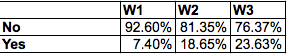


And you can even get fancy and plot this change over time, to emphasise that indeed, there is an increase in the percent of respondents who answer yes to trying cannabis wave on wave: 


But we'll do more plotting and visualisation after reading week, when we have our data viz session. 


<!--

##Drawing causal inference

Note about time etc


#Cross sectional data

Surveys etc


##Secondary Data Analysis

What is

Why 

How

##A brief notes on survey weights


#New forms of data

##Social media data

##Webscraping


##Bias in 

-->

## Ethics

I wanted to leave you with a final note on research ethics. It's an essential part of your research design that you consider the ethical implication of your study, both on your participants, on your researchers (including yourself), and on the wider community. 

Watch [this 7 minute video that gives a good introduction to research ethics](https://www.youtube.com/watch?v=Zbi7nIbAuMQ), and pay particular attention to the concepts of: 

- informed consent
- beneficence (benefits and harms to society)
- justice


The "IRB" section is specific to the USA, however, we also have our own code of ethics, and all research needs to undergo an ethical review. Internally, the University of Manchester has created an ethics decision tool. You can navigate through this tool to determine whether or not your research requires ethical approval. You can access the tool, and read more about the university's ethics procedures [here](https://www.manchester.ac.uk/research/environment/governance/ethics/)


## Summary

In sum, you should now be able to think about the research design that either you need to create to collect data, or that someone else has created in order to collect the data that you are working with. There are many decisions that go into designing a research study, and there are pros and cons associated with each approach. When you use randomised control trials, you have to consider the random assignment, when you use longitudinal data, you will have to join the data sets collected at different points in time, and think about things like attrition. The study design has implications for what research questions the data you collect will allow you to answer, and what analysis you'll be able to carry out.  You should be comfortable with the following terms:

- dependent (response/ outcome) variable
- independent (predictor) variable
- treatment
- control
- evaluation
- simple randomization
- stratified randomisation
- confounding variable
- waves
- attrition
- missing data
- response bias
- complete cases
- ethics
    + informed consent
    + beneficence (benefits and harms to society)
    + justice


<!--
#Sources

- [Alex R. Piquero & Nicole Leeper Piquero](http://www.encyclopedia.com/law/legal-and-political-magazines/criminology-and-criminal-justice-research-methods)
- [Jonathan Bartlett](http://thestatsgeek.com/2013/07/06/when-is-complete-case-analysis-unbiased/)

-->

<!--chapter:end:006-week5.Rmd-->

# Week 6 {#week6}

## Learning outcomes

This week is the most fun week in all of data analysis - the week where we learn about the principles of data visualisation. The visual display of your data is so important because it gives you a chance to communicate what is interesting in pictures. Simple, neat graphs can tell you in one glance, what you might have to read many paragraphs of text to otherwise learn. Visualisation is an art and a science, and this week we will explore the work in this area, and hopefully you will only produce beautiful, and meaningful visualisations of your data from now on. 

Here are some terms that we will cover today: 

- Visualising data
- Principles of good data visualisation
    + Ink to data ratio
- Grammar of graphics
- Exploratory viz
- Communicating results


## Visualising data


A picture is worth a thousand words; when presenting and interpreting data this basic idea also applies. There has been, indeed, a growing shift in data analysis toward more visual approaches to both interpretation and dissemination of numerical analysis. Part of the new data revolution consists in the mixing of ideas from visualisation of statistical analysis and visual design. Indeed data visualisation is one of the most interesting areas of development in the field.

Good graphics not only help researchers to make their data easier to understand by the general public. They are also a useful way for understanding the data ourselves. In many ways it is very often a more intuitive way to understand patterns in our data than trying to look at numerical results presented in a tabular form. 

Recent research has revealed that papers which have good graphics are perceived as overall more clear and more interesting, and their authors perceived as smarter (see [this presentation](https://vimeo.com/181771433))


## Why visualise data?


New insights. Visualising data can give you new insights into your own data (exploratory data visualisation) as well as effectively communicate the results from your studies to your audiences. 


Interactive data visualisation is something that has the power to really engage people with a topic. Instead of just passively telling people numbers in a table, visualisations can help engage your reader. But don't take my word for it, give it a go yourself! Have a look at [this article in The Upshot (NYT's data-driven venture, focused on politics, policy and economic analysis) ](https://www.nytimes.com/interactive/2017/04/14/upshot/drug-overdose-epidemic-you-draw-it.html). It should be an interesting little activity - you can draw the graph that represents the trends you think are happening, and then compare with the actual figures. Seriously try it out, it should be fun!


So we won't quite be learning how to make these kinds of interactive visualisations, but we will learn some basic principles behind effective data visualization. By the end of today you should also have a practical sense for why some graphs and figures work well, while others may fail to inform or actively mislead. You will know how to create a wide range of plots in Excel as well as how to refine plots for effective presentation.


## Anatomy of a plot - the Grammar of Graphics


>  The grammar of graphics takes us beyond a limited set
of charts (words) to an almost unlimited world of graphical forms (statements).
The rules of graphics grammar are sometimes mathematical and
sometimes aesthetic. 

- Leland Wilkinson (2005) *The Grammar of Graphics*


The grammar of graphics is about creating graphs mathematically. Essentially the philosophy behind this as that all graphics are made up of layers, the idea that you can build every graph from the same few components: a data set, a set of geoms—visual marks that represent data points, and a coordinate system.

Take this example (taken from *Wickham, H. (2010). A layered grammar of graphics. Journal of Computational and Graphical Statistics, 19(1), 3-28.*)

You have a table such as: 


You then want to plot this. To do so, you want to create a plot that combines the following layers: 


This will result in a final plot: 


> We often call graphics charts (from or Latin charta, a leaf of paper or papyrus). There are pie charts, bar charts, line charts, and so on. [The Grammar of Graphics] shuns chart typologies. For one thing, charts are usually instances of much more general objects. Once we understand that a pie is a divided bar in polar coordinates, we can construct other polar graphics that are less well known. We will also come to realize why a histogram is not a bar chart and why many other graphics that look similar nevertheless have different grammars. (...) The concept of a graphic is so general that we need organizing principles to create instances of graphics. We may not want to put a pie chart in a catalog, but we need to give users some simple way to produce one. 

- Leland Wilkinson (2005) *The Grammar of Graphics*


## Principles of good data visualisation 


There is a vast amount of research into what works in displaying quantitative information. 
The classic book is [The Visual Dispay of Quantitative Information by Edward Tufte](https://www.edwardtufte.com/tufte/books_vdqi), but since him there are many other researchers as well who focus on approaches to displaying data. Your reading for this week will provide you a crash course into data viz. 


The **Data-Ink ratio** is a concept introduced by Edward Tufte, the expert whose work has contributed significantly to designing effective data presentations. In his 1983 book, The Visual Display of Quantitative Data, he stated the goal is to "Above all else show the data". 

> A large share of ink on a graphic should present data-information, the ink changing as the data change. Data-ink is the non-erasable core of a graphic, the non-redundant ink arranged in response to variation in the numbers represented

- [Tufte, 1983](https://www.edwardtufte.com/tufte/books_vdqi)


Tufte refers to data-ink as the non-erasable ink used for the presentation of data. If data-ink would be removed from the image, the graphic would lose the content. Non-Data-Ink is accordingly the ink that does not transport the information but it is used for scales, labels and edges. The data-ink ratio is the proportion of Ink that is used to present actual data compared to the total amount of ink (or pixels) used in the entire display. (Ratio of Data-Ink to non-Data-Ink).


Good graphics should include only data-Ink. Non-Data-Ink is to be deleted everywhere where possible. The reason for this is to avoid drawing the attention of viewers of the data presentation to irrelevant elements.
The goal is to design a display with the highest possible data-ink ratio (that is, as close to the total of 1.0), without eliminating something that is necessary for effective communication.


### An example: 


This is an example of a graph with a low Data-Ink Ratio:


The border around the graph, the background color and the grid lines are all unnecessary data ink.


Now an example of a graph with a high Data-Ink Ratio:


We have deleted the border around the graph, the background color and the grid lines and have thus drawn the viewer's attention to horizontal scales that are data-ink. There is nothing else to distract and the key features of the data stand out clearly. 


### Criticisms


Inbar, et al, evaluated in 2007 the people's acceptance of the minimalist approach to visualize information. They asked 87 students to rate their preference for two different graphs displaying identical information - a standard bar-graph and a minimalist version [Inbar, 2007](http://portal.acm.org/citation.cfm?id=1362587). The results showed that the majority students did not like Tufte's minimalist design of bar-graphs - instead they seem to prefer "chartjunk". [Inbar, 2007](http://portal.acm.org/citation.cfm?id=1362587).


In the example shown above, increasing the data-ink ratio made it harder to read most of the data. For example, removing the top border of the chart removed an implied 20% line. It also made it harder to see how much the graph lies (in that it does not show a range from 0% to 100%, and/or does not show the domain from January through December). [How to Lie with Statistics](https://www.librarysearch.manchester.ac.uk/primo-explore/fulldisplay?docid=44MAN_ALMA_DS21134626320001631&context=L&vid=MU_NUI&search_scope=BLENDED&isFrbr=true&tab=local&lang=en_US) discusses this flaw in the example charts.


## What makes a bad graph bad?


Whether or not you subscribe to Tufte's school of minimalism, you should be able to recognise *bad* graphs. What makes a bad graph bad though? The generic overview answer to this is that bad graphs are the ones where it becomes difficult for your audience to interpret the meaning you are trying to convey. 


On the other hand, your audience might have some sort of expectations for what they require from you. You will have to manage a route between what you might be told that you need to produce, for example by a boss, and what is the best method for visualising your data in a way that communicates your results effectively. 


A good example of this dilemma is the pie chart. 

> A pie chart is perhaps the most ubiquitous of modern graphics. It has been reviled by statisticians (unjustifiably) and adored by managers (unjustifiably). It may be the most concrete chart, in the sense that it is a pie. A five-year-old can look at a slice and be a fairly good judge of proportion. (To prevent bias, give the child the knife and someone else the first choice of slices.) The pie is so popular nowadays that graphical operating systems include a primitive function for drawing a pie slice.

- Leland Wilkinson (2005) *The Grammar of Graphics*


Indeed, a lot of people shun the pie chart (see for example this blog entry titled [death to pie charts](http://www.storytellingwithdata.com/blog/2011/07/death-to-pie-charts)) or this story from Business Insider titled [pie charts are the words](http://www.businessinsider.com/pie-charts-are-the-worst-2013-6?IR=T), but managers have a particular affinity towards it.  While these seem emotional and unfair, there is actually justification for these. People are actually *not* that great in telling proportions from pie charts. If you are interested, have a look at [this study](https://eagereyes.org/blog/2016/a-reanalysis-of-a-study-about-square-pie-charts-from-2009), where researchers found that a square pie chart performs the best, when people have to guess the proportion that it represents. 


There are other charts as well, which are less popular to hate, but in certain situations may obscure important information. In some cases bar plots can hide important features of your data, and might not be the most appropriate means for comparison. See the below image for example, where the same data about 2 groups, green and purple, are visualised using 3 different methods, a histogram, which shows the green group following a normal distribution, and the purple group following a heavily skewed distribution (remember week 5), a boxplot that shows the same, and finally a bar plot, which makes the green and purple group appear identical: 


Now potentially, the  [kickstarter campaign](https://www.kickstarter.com/projects/1474588473/barbarplots/description) around actually banning bar plots might be a bit of an extreme leap, but it is important to keep in mind that the kind of visualisation that you choose might greatly impact the conclusions that people will draw about your data, and the story that you are able to tell. 


There are some recommendations on what to use (and not use) in certain contexts, which can help you avoid making a bad graph. For example, most data visualisation experts agree that you should not use 3D graphics unless there is a meaning to the third dimension. So using 3D graphics just for decoration, as in [this case](https://mir-s3-cdn-cf.behance.net/project_modules/disp/2505dd10837923.56030acd2ef20.jpg) is normally frowned upon. However there are cases when including a third dimension is vital to communicating your findings. See this [example](http://www.visualisingdata.com/2015/03/when-3d-works/).


You can see also an example in the graph below:


Because of the angle and the 3D you cannot really read off the extent of differences between regions. 


We want to create pictures of data that people, including ourselves, can look at and learn from.

But it is not always enough for you to know the perfect visualisation, it is important that you also know that your audience is comfortable interpreting these types of visualisations. Before I became a lecturer at Manchester, I worked as a crime analyst. I love data, and I was just coming out of my education, so I felt very comfortable with stats and data analysis, however my lack of real-world experience was made very evident when I entered my first ever briefing, with 3 Chief Inspectors from the Met Police to present them the work I'd done analysing confidence in police. My second slide was a set of boxplots, comparing the scores on a public attitudes survey between their sectors. It might have looked something like this (the data is fictitious by the way): 


```{r, echo=FALSE, message=FALSE, warning=FALSE}

library(ggplot2)
ggplot(mtcars, aes(y=mpg, x=as.factor(cyl)))+
  geom_boxplot() +
  ylab("Confidence score (out of 50)") +
  scale_x_discrete(name ="Sector",labels=c("North","East","Central"))


```


It was useless. I spent basically all my alloted time trying to talk through the graph, and it achieved the opposite effect of clearly displaying information, and telling the story of the different levels of confidence in each Sector. I did not take my audience into account, and that made my visualisation ineffective. It was not a great moment, but at least I got an embarrassing story to tell when teaching people about data visualisation. 


## What graph should I use?


There are a lot of points to consider when you are choosing what graph to use to visually represent your data. There are some best practice guidelines, but at the end of the day, you need to consider what is best for your data. What do you want to show? What graph will best communicate your message? Is it a comparison between groups? Is it the frequency distribution of 1 variable? 


As some guidance, you can use the below [cheatsheet, taken from Nathan Yau's blog Flowingdata](https://flowingdata.com/2009/01/15/flow-chart-shows-you-what-chart-to-use/):


However, keep in mind that this is more of a guideline, aimed to nudge you in the right direction. There are many ways to visualise the same data, and sometimes you might want to experiment with some of these, see what the differences are. You can also consider some inspiration [here](http://datavizproject.com/). 


Channels for mapping ordered data (continuous or other quantitative measures), arranged top-to-bottom from more to less effective, after Munzer (2014, 102) created by [Kieran Healy](http://socviz.co/):


Channels for mapping unordered categorical data, arranged top-to-bottom from more to less effective, after Munzer (2014, 102) created by [Kieran Healy](http://socviz.co/):


## Edges, Contrasts and Colors

Looking at pictures of data means looking at lines, shapes, and colors. Our visual system works in a way that makes some things easier for us to see than others. I am speaking in slightly vague terms here because the underlying details are the remit of vision science, and the exact mechanisms responsible are often the subject of ongoing research. I will not pretend to summarize or evaluate this material. In any case, independent of detailed explanation, the existence of the perceptual phenomena themselves can often be directly demonstrated through visual effects or “optical illusions” of various kinds. These effects demonstrate that, perception is not a simple matter of direct visual inputs producing straightforward mental representations of their content. Rather, our visual system is tuned to accomplish some tasks very well, and this comes at a cost in other ways.

The active nature of perception has long been recognized. The Hermann grid effect, shown in the figure below, was discovered in 1870. Ghostly blobs seem to appear at the intersections in the grid but only as long as one is not looking at them directly. 


A related effect is shown below. These are Mach bands. When the gray bars share a boundary, the apparent contrast between them appears to increase. Speaking loosely, we can say that our visual system is trying to construct a representation of what it is looking at based more on relative differences in the luminance (or brightness) of the bars, rather than their absolute value. 


Similarly, the ghostly blobs in the Hermann grid effect can be thought of as a side-effect of the visual system being tuned for a different task.


These sorts of effects extend to the role of background contrasts. The same shade of gray will be perceived very differently depending on whether it is against a darker background our a lighter one. Our ability to distinguish shades of brightness is not uniform, either. We are better at distinguishing darker shades than we are at distinguishing lighter ones. And the effects interact, too. We will do better at distinguishing very light shades of gray when they are set against a light background. When set against a dark background, differences in the middle-range of the light-to-dark spectrum are easier to distinguish.

Our visual system is attracted to edges, and we assess contrast and brightness in terms of relative rather than absolute values. Some of the more spectacular visual effects exploit our mostly successful efforts to construct representations of surfaces, shapes, and objects based on what we are seeing. Edward Adelson’s checkershadow illusion, shown below, is a good example.


## Colour


When choosing color schemes, we will want mappings from data to color that are not just numerically but also perceptually uniform. The goal in each case is to generate a perceptually uniform scheme, where hops from one level to the next are seen as having the same magnitude. Excel will take care of these for you, by offering colour palettes in the "Design" section of the Chart Layout tab: 


Gradients or sequential scales from low to high are one of three sorts of color palettes. When we are representing a scale with a neutral mid-point (as when we are showing temperatures, for instance, or variance in either direction from a zero point or a mean value), we want a diverging scale, where the steps away from the midpoint are perceptually even in both directions. The blue-to-red palette in the design layouts above is one example. Finally, perceptual uniformity matters for unordered categorical variables as well. We often use color to represent data for different countries, or political parties, or types of people, and so on. In those cases we want the colors in our qualitative palette to be easily distinguishable, but also have the same valence for the viewer. Unless we are doing it deliberately, we do not want one color to perceptually dominate the others. 


The main message here is that you should generally not put together your color palettes in an ad hoc way. It is too easy to go astray. In addition to the considerations we have been discussing, there we might also want to avoid producing plots that confuse people who are colour blind, for example, and color blindness comes in a variety of forms. Fortunately for us, almost all of the work has been done for us already. Different color spaces have been defined and standardized in ways that account for these uneven or nonlinear aspects of human color perception.


A good resource website is [colorbrewer](http://colorbrewer2.org/). This site offers many colour schemes that you can use in your graphs if you wanted to introduce manual colours. The site looks somewhat like this: 


Go to the site, and select  a colour scheme that you like. When you do you can see that you can adjust the number of categories that you need to create a colour scheme for: 


You will set these to the number of values in your categorical variable for example. 


Then you can also select the colur scheme that is most appropriate for your variable. If you have ordinal categories for example, then you could use a sequential scale - going from dark blue to light blue. On the other hand, if you have nominal variable, then a sequential colour scale would not make sense. In this case you would use a qualitative scale. If you are unsure why this is the case, raise your hand now, and we can help explain. 


You might be thinking that that's real nice, but how do we get these colours into our excel graphs? Well you may notice the code next to the colours:


These are ways for the computer to be able to understand what the value is for that colour. There are a few options. Here we see HEX values for each colour. 


A hex triplet is a six-digit, three-byte hexadecimal number used in HTML, CSS, SVG, and other computing applications to represent colors. The bytes represent the red, green and blue components of the color. One byte represents a number in the range 00 to FF (in hexadecimal notation), or 0 to 255 in decimal notation. This represents the least (0) to the most (255) intensity of each of the color components. Thus web colors specify colors in the True Color (24-bit RGB) color scheme. The hex triplet is formed by concatenating three bytes in hexadecimal notation, in the following order:

- Byte 1: red value (color type red)
- Byte 2: green value (color type green)
- Byte 3: blue value (color type blue)


Not sure if you might still be the generation that had any interaction with MySpace, but that was an excellent venue to learn about hex colours and html customisation. I guess a potentially more relevant venue would be tumlbr, if any of you use this and want to customise your pager, [you can use html to do this](https://www.tumblr.com/docs/en/custom_themes). Now you don't need to do this at all, but you should now know, that if you want to change the colour of something, you need to know the hex code for this colour. And this is what colourbrewer is telling you above. 


If you want the three colours you see there you have to use the codes `#ffeda0`, `#feb24c`, `#f03b20`. 


You can also change the display, from HEX to RGB or CMYK codes, which are just used in different contexts. You can ask colourbrewer to display these codes instead by changing the value in the dropdown menu: 


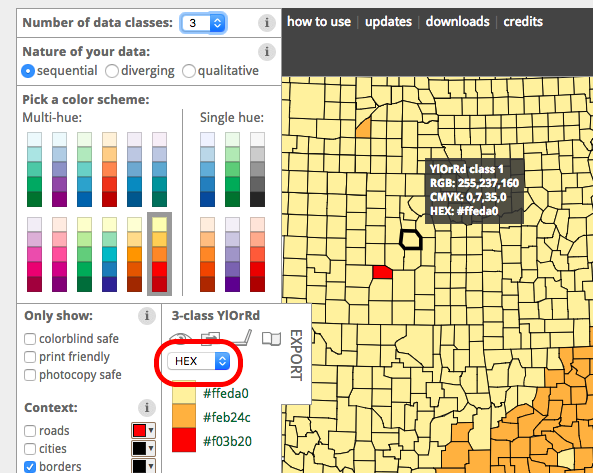


If this is something you're interested in I'm happy to chat about these, raise your hand now. 


Right, but how do we get these colours into our excel graph? Well let's give it a go.


### Activity 1: Custom colours in Excel graphs. 

<span style="color:#d95f02">
Download the FBI crime statistics data from Blackboard under the Week 6 materials in course content.


Open the data up in excel, and have a look at it. You can see that it include the number of crimes for various crime types for each year from 1994 to 2013, as well as some columns for crime rate. Crime rate is important because it normalises the *number* of crimes by the population at risk. Why is this important?


Well think about this - where do you expect more pickpocketing incidents, outside Piccadilly station, or in Platt Fields Park? Why? 


My guess is that you said Piccadilly station, and because there are more people close together. There are **more possible targets**. That's what you are accounting for when calculating crime rate. In this case, they are accounting for changes in the population between the years, to make sure that you can compare the crimes between the years. It might not make a lot of sense to say that a particular crime is increasing if the population is also increasing, because as a percentage, the crime might not actually be increasing at all. So instead we consider the population. 


But is the population increasing? Well lets create a column graph of the population. 


To do this, select the *Population* column, and choose the clustered column graph option: 


You can see however that the category axis labels are not very meaningful. They are only numbers, from 1 to 20, and do not help you answer whether population changes between the years. 


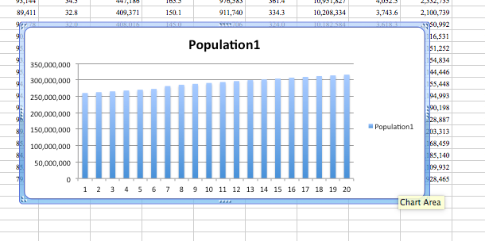


To add axis labels, right click anywhere on the chart area, and select the "Select Data..." option: 


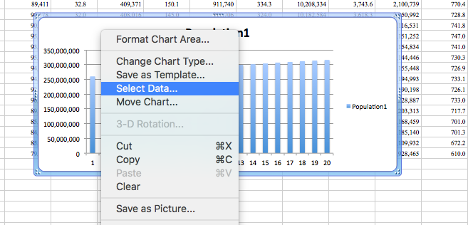


Then, click into the text box next to the *Category (X) axis labels*, and then select the values in the *Year* column. Make sure to select only the values, and not also the column header: 


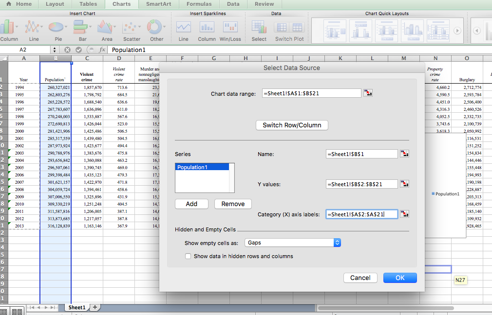


Now we can see the differences. However what we wanted to demonstrate here is how to change the colour of your graphs to what you wanted, potentially some colours from colourbrewer. 


Well to do this, you can double click on any of the bars, which should open up a popup window. 


On this, select the "Fill" option. On this you can see there is a dropdown menu, where you can select the fill. 


If you're on a PC, if you double click on the bars to change the fill, the pop up window doesn't have the color option immediately like what is shown above (for mac). Instead you will have to first select the option for "Solid fill", an then the colour option will appear: 


Click on the option for "More Colours..."


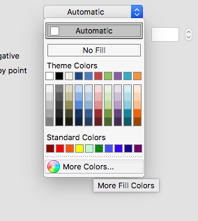


This opens up a new set of options. You can see it's set to RGB sliders. If you wanted to, you could use the RGB code, and set the red, green, and blue levels in a way that gets you your colour. If you are using a PC you will have to use the RGB code for the rest of the exercise (we'll get to this in a second). If you're using a mac, you can also just paste your hex code in the box below the sliders, that says "Hex Color #". 


So let's say that we want to change the colour to the middle value from the colourbrewer scale above. Well we can see that the hex code for that is `#feb24c`. So what we need to do is change the code in the text box above, where it says "FFFFFF" to "feb24c": 


If you're on a PC, then you will have to change the drop down selection menu on the colorbrewer2.org:


and set it to "RGB" scale. This will give you the values for the red, green, and blue sliders. In this case, that will be:

- R: 254
- G: 178
- B: 76


Enter those values in the pop-up window that appears:


So set each colour to this value, and click "OK", and ta-daaa, your graphs will appear with manual colour: 


</span>


In this case we don't have a stacked bar, we just have the one variable, so it's not hugely useful, but I wanted to demonstrate how you can insert your own colours there. You might want to do this later, in the more complex graphs. Your decisions about color will focus more on when and how it should be used. Colour is a powerful channel for picking out visual elements of interest, and can really make a difference to your graph. You are very welcome to use the excel default colours in your graphs within this course, but if you're interested in learning more about colour [have a look at this page](https://lisacharlotterost.github.io/2016/04/22/Colors-for-DataVis/). 


## Reading between the lines (points) 


What sorts of relationships are inferred, and under what circumstances? In general we want to identify groupings, classifications, or entities than can be treated as the same thing or part of the same thing:

- **Proximity:** Things that are spatially near to one another are related.
- **Similarity:** Things that look alike are related.
- **Connection:** Things that are visually tied to one another are related.
- **Continuity:** Partially hidden objects are completed into familiar shapes.
- **Closure:** Incomplete shapes are perceived as complete.
- **Figure/Ground:** Visual elements are either in the foreground or the background.
- **Common Fate:** Elements sharing a direction of movement are perceived as a unit.


## Exploratory data visualisation


Data visualisation helps you unlock the hidden meaning in your data. It is the first tool of the data analyst. When you are given a heap of data, the only way to start getting some insight into it is to start making some visualisations. If you remember in weeks 2 and 3, when we did our univariate and bivariate analyses, we always started with graphing our data. And in some instances, visualising data itself can lead to surprising insights. 


I suggest that in your own time, you listen to [this episode of the datastories podcast](http://datastori.es/66-iquantnyc/) which consists of an interview with Ben Wellington, the author of the blog [I Quant NY](http://iquantny.tumblr.com/). I mentioned him in the opening lecture, he's the guy who found the [fire hydrant that earns $30,000 a year](http://iquantny.tumblr.com/post/87573867759/success-how-nyc-open-data-and-reddit-saved-new). It's a good interview, so definitely bookmark it for later!


Exploratory data visualisation is a way for you to get to know your data. It is a way to explore patterns and trends that you might not immediately see. We've covered some of this when we were performing univariate and bivariate analyses, but we will focus on how data visualisation can help you answer questions about your data, and also spend some time on making sure these graphs are in line with good practice. 


### Comparing categories

<span style="color:#d95f02">
Let's practice answering questions with data. Go back to the FBI data you downloaded from Blackboard. 


So firstly, let's say we want to know the answer to the following question: 

- **What year had the highest violent crime rate?**


You can see that the appropriate data is in the column labelled *Violent Crime Rate*. So what do you think is the best way to visualise this? You could look at your chart selection thought starter above, and see that one option for comparisons is to use column graphs. So let's give that a go: 


Select the column that contains the data for violent crime rate. Highlight it. When you have highlighted that column then go to your chart selector, and select *Column* > *2-D Column* > *Clustered Column*. Like so: 


Once you select this, a default column chart should appear. You can see however that the category axis labels are not very meaningful. They are only numbers, from 1 to 20, and do not help you answer your question, *What year had the highest violent crime rate?*. 


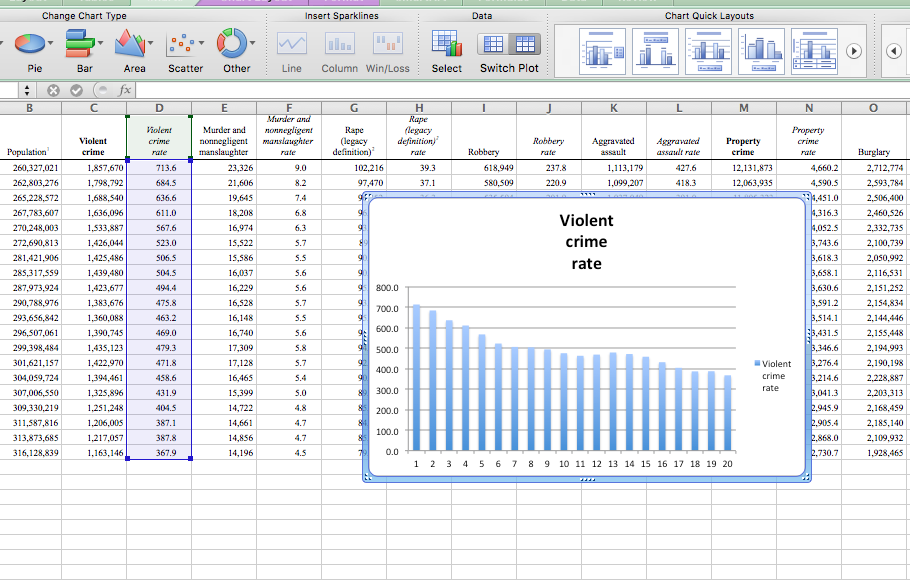


To add axis labels, right click anywhere on the chart area, and select the "Select Data..." option: 


Then, click into the text box next to the *Category (X) axis labels*, and then select the values in the *Year* column. Make sure to select only the values, and not also the column header: 


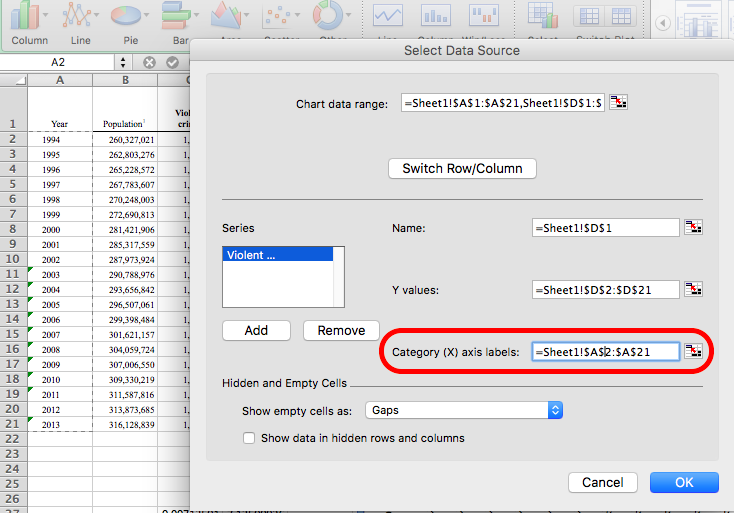


Once you've done that, click on "OK", and you will see the labels updated: 


Now you can see that your x-axis labels are meaningful, and essentially from this point on, you can use this graph to answer your question: *What year had the highest violent crime rate?*. 


We can see that 1994 had the highest violent crime rate. 


But this graph is not necessarily in line with the best practice around data ink, and around all of the visuals introduced having meaning. 


Firstly, we are talking about number of crimes per 100,000 population. Since we are talking about **number of crimes** we know that we will be talking about whole numbers. Even if we end up with some decimal points after dividing by population to get the rate, it would not necessarily be meaningful to report fractions of crimes. So we can remove the .0 from the y-axis labels, as it adds no value to our graph. To do this, double click on the text in the y-axis labels. It will bring up a window where you can see some choices to select what to edit, in the left hand side of the window. 


It might automatically be selected to "Scale":


Click on the next one down, the one that says "Number". In the options that come up, *untick* the box next to "Linked to source". Once you untick this box you should have available some options for you to make changes. You can then edit the text box next to where it says "Decimal places", and set it to 0, like so: 


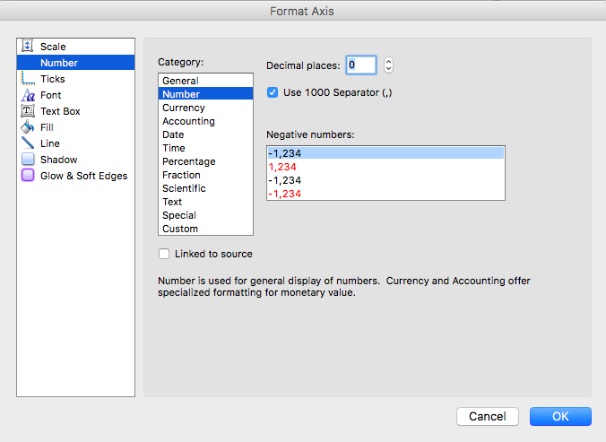


You can now also go to the other options, and make changes there. For example, you might decide that you want to increase the font size, to make your graph easier to read, and also that you might want to change your font to something easier to read, such as Arial:


On a PC, the "format axis" window has different options. There is no font or text box options for example. However you can do those things on the main screen of Excel (using the toolbar at the top). Just select the axis and change the fonts from there. Or you can change the font with this menu as well:


Click "OK" when you are finished. 


If you change your font, and also your font size, you should make sure to apply to all of your axis labels. To do this, just double click on the x-axis labels (the years) and the same pop-up window will appear. Make sure to set the font to the same font, and the font size to the same size for both axes, to ensure consistency: 


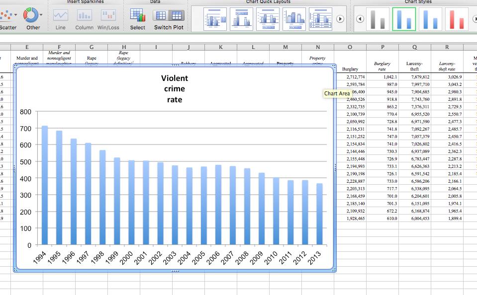


The other bit of information you're providing here that doesn't really have much meaning attached to it here is colour. What does the blue in the bars mean? And why is there a gradient? Why are the bars lighter blue on the top, and darker blue on the bottom? These are questions that people looking at this chart might ask, and we, the people who made the chart, do not actually have any good answers to!
(actually on the PC there might not be a gradient, but on a mac there is, and just in case, it's good to note this). 


So to get around this, let's set our bars to solid black, to get around any possible issues with introducing colour. To do this, this time double click on any of the bars, to open up a popup window. Again there will be options on the left hand side. First select the option for "Line" and make sure that you set this to "No Line": 


Then click on "Shadow" and make sure to just untick the box next to where it says "Shadow". Again there is no point to introduce a shadow here, as it would give you no additional information, it represents no data, and therefore can only introduce confusion into your chart. 


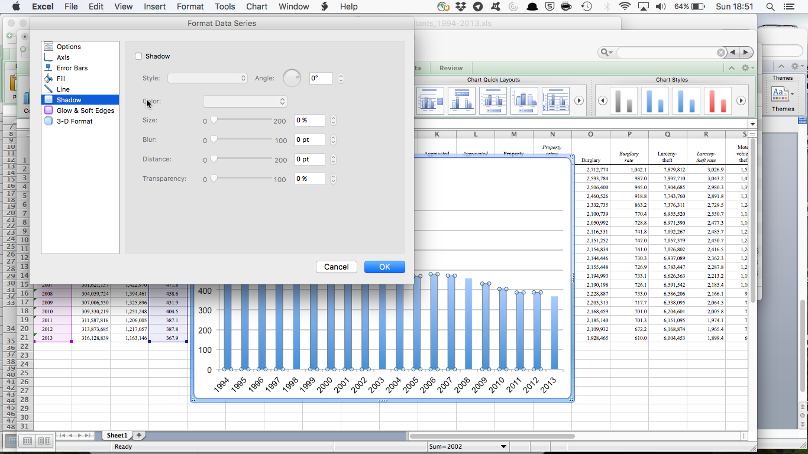


Finally, select fill, and set your fill colour to black: 


Once you are done with all this, you can click on "OK" and you will have your final bar graph ready to be inserted into a report: 


</span>


Ta-daaa. So is this the best graph to answer our question? Well you could explore a few more, and see what happens. 

<!--
Let's try a pie chart. We keep hating on it, let's see if we should give it another chance. 


Once again, select the column you're interested in , which is the rate of violent crimes. Now, instead of choosing a column chart, choose a pie chart as your visualisation strategy. 


Now how does that look? Is it something like this: 


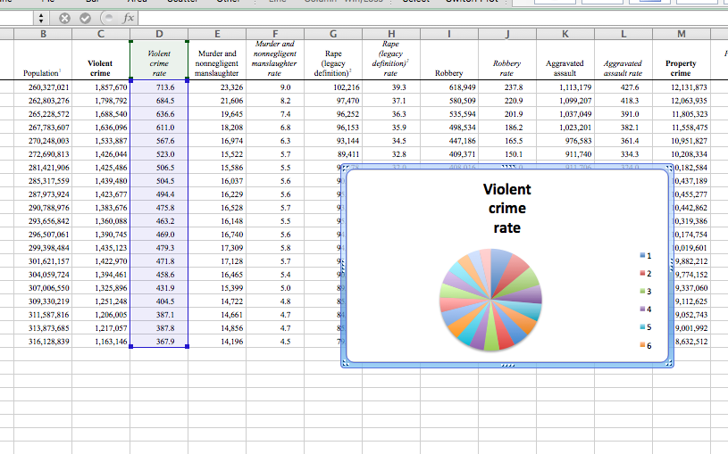


Can you answer your question using this chart? Do you know, from this, which year had the highest violent crime rate? 


How about from a donut chart:


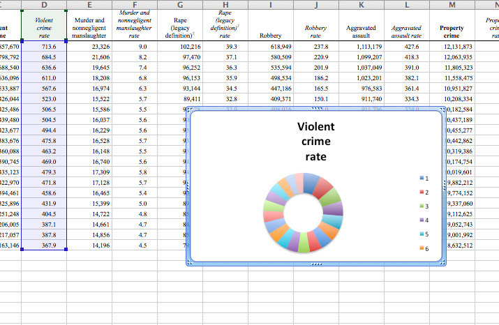


Not really, eh? Well it takes some time and thought to be able to determine what is best, and you can always try out a couple of options, and see which one you like best, and which one best helps you tell your story, and answer the question you are asking. And there might be more than one right answer. 


For example, to answer our question *What year had the highest violent crime rate?*, we could have just as well used a bar graph, as a column graph. A bar graph is basically a column graph on it's side:


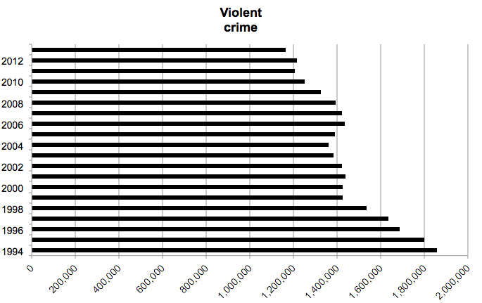
-->

### Activity 2: Exploring trends


We'll be talking about changes over time and trends and such next week, but it's interesting to note here how it would (or at least should) influence your chart choice if the question we ask is slightly different. Let's say we are still interested in trends in violent crime rate, but instead of asking which year had the highest violent crime rate, instead this time we are interested in a new question: 


- **Is violent crime rate going up, going down, or staying the same?**


Now we could, in theory, answer this question by looking at our bar graphs above. But the slight difference is, bar graphs are good at comparing **categories**. But what they dont do, is they do *not* link up these categories. And rightly so. Such charts are for visualising categorical variables, which should not hugely link. 


However, those of you still on top of your *levels of measurement* will have noticed, that year can actually be considered a continuous variable. And so it might lend itself to better *trend* visualisation by being presented through a *line graph*. 

<span style="color:#d95f02">
To select this, once again highlight the column with the data of interest (violent crime rate) and then this time select Line > Line for chart type: 


Once again you will see that your x-axis labels are not very helpful, they are numbersfrom 1 to 20, rather than labelled with the years that each data point represents. To address this, once again right-click anywhere in the chart, and select the "Select Data..." option: 


In the popup, once again click into the text box next to the *Category (X) axis labels*, and then select the values in the *Year* column. Make sure to select only the values, and not also the column header: 


When you click OK, the labels should appear on your chart: 


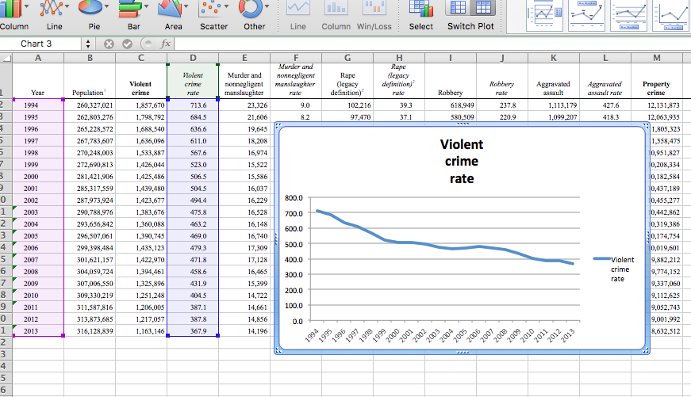


Now you don't always have to manually change the bits of the graph, you can also use some pre-created layouts that exist. You can find this in the top bar of excel, under a label called "Chart Quick Layouts": 


Again, a difference on the PC: When editing the line graph, there is not a heading called "Chart Quick Layouts". Instead, you can find the options for different layouts under the **"chart tools"** section and the tab called **"design"**. 


You can browse through and select one that looks like something you would like. 


Once you pick a quick chart format, you can still make edits to your graphs. For example, you can double click on the line to make another popup window appear. 


On this new window, you can click on "Line" option, and choose the colour you would like for the line. 


You can also see 3 options along the topic there, where you can choose between whether you want to edit the line etc, under the "Solid" option, but also change gradients under the "Gradient" option, and also edit the style of the line using the "Weights & Arrows" option. Click on this, and have a play with this as well: 

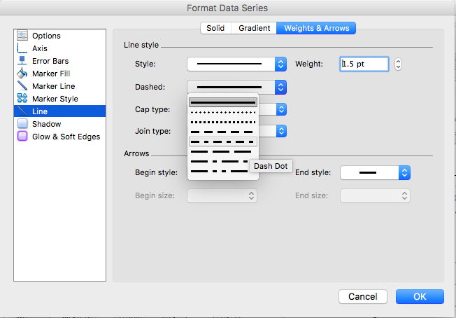


Again these might be slightly different on your version, or on a PC to a mac. For editing the line, all the options there are different as well. The main point here is for you to just play around and see what is available to change in the graph, so have a look, but here is the equivalent PC screen shot to show you:


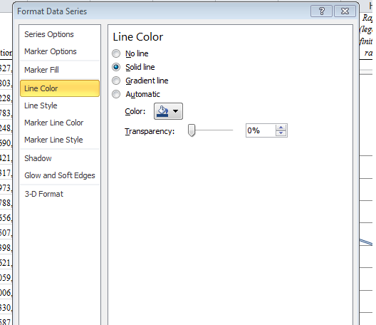


You can also add point markers to the line, this can help add clarity to your graph. Select the "Marker Style" option and you can choose a marker.


On PC: 


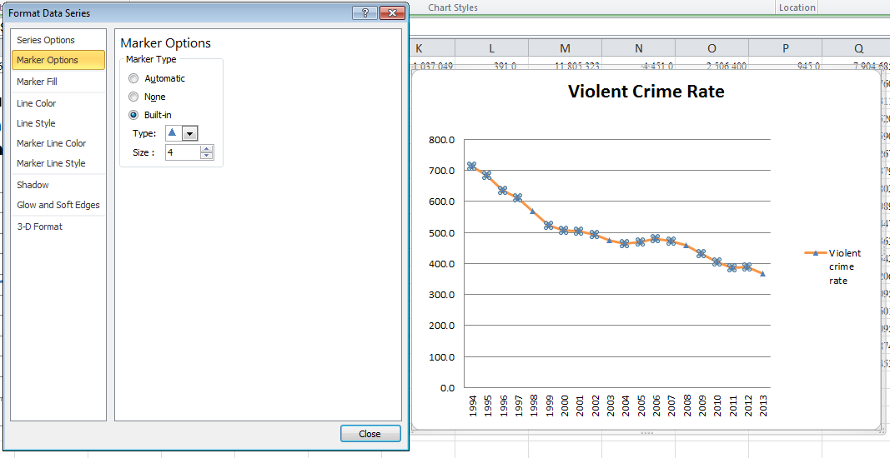


Make any changes you would like, and finally click "OK" to produce your final graph. 


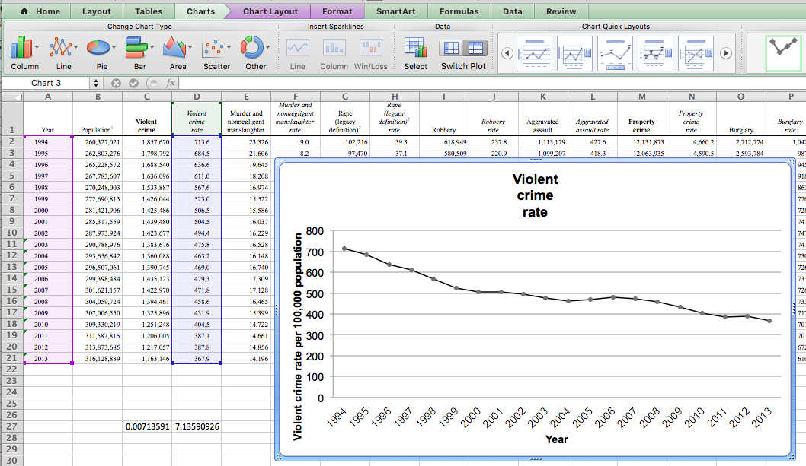


</span>


### Activity 3: Making a chart template

<span style="color:#d95f02">
Now you will probably find your own style for a graph, and you might not want to change these settings every time you create a graph. Let's say we want to create a separate graph for the rates of various crime types in this data. To make our lives easier, once we've gotten one graph to look just how we would like, we can save this as a template. 


To do this, click anywhere in the graph, and select "Save as Template...". 


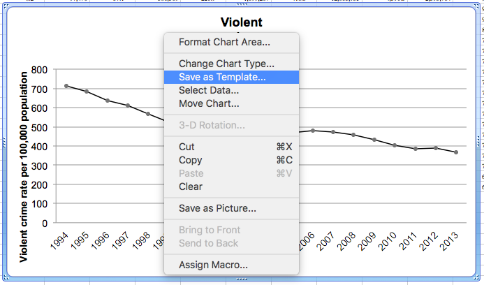


On a PC you won't have this option appear from the right-clicked menu, but you can find the "Save As Template" on the Chart tools > Design tab on the top menu in Excel: 


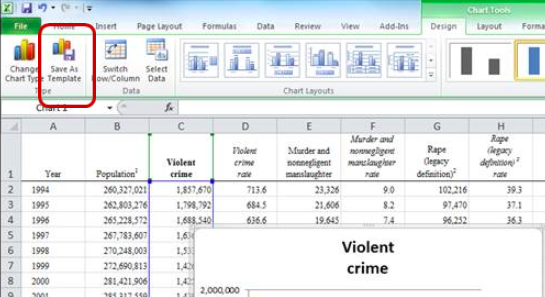


Choose a location to save, give it a name you might remember (here I call this "bw", short for black and white): 


On PC: 


Now, next time you build a graph you can use this template. Let's try, let's create another line graph this time for the rate of murder and nonnegligent manslaughter. So as you would, select the column with the data for rate of murder and nonnegligent manslaughter:


but instead of selecting Line graph, click on the "Other" option for graphs, and scroll to the bottom. You should see your template appear as one of the possible selections!


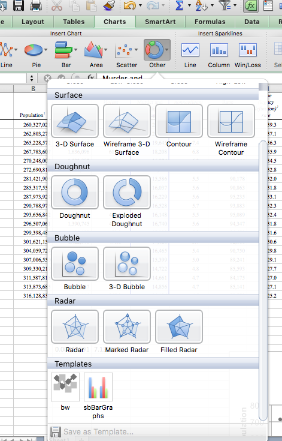


Again on the PC this is slightly different, you first create your graph with the line graph, and then when it's created, you right click anywhere in the chart and choose: 


Then go to templates, and choose "My templates":


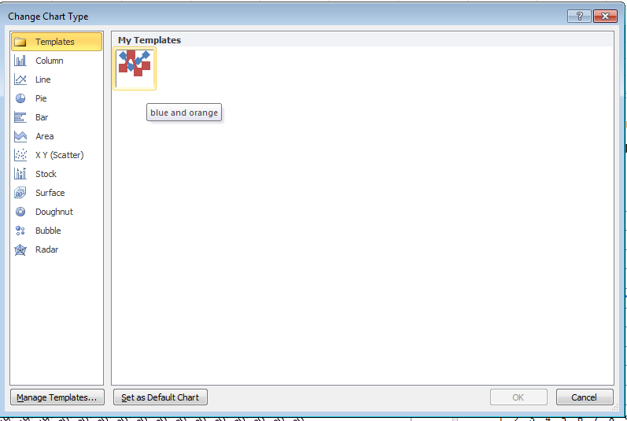


Click on the template, then click OK, and you should have your graph be updated to the new template. 
</span>

You can now see that the default chart that appears follows the formatting that you have carefully devised as your ideal format. You will still have to add any sort of data addition (for example specify where to find the years to populate the Category (X) axis labels). But it definitely saves you some time in terms of formatting. 


### Activity 4: Saving your graph

<span style="color:#d95f02">
When you are making your reports, there are two ways you can include your graph. 


One approach is just to save your graphs as pictures. To do this, you can just right click anywhere in the graph area, and select the "Save as picture..." option. 


Navigate to a folder where you collect your results, and save the image there. 


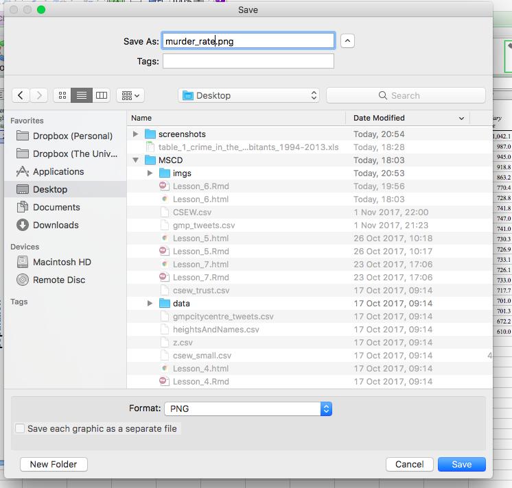


Of course, because nothing is easy, this option does not exist on PC. Instead, perhaps the best option may just be copying the graph and pasting it into a word doc and saving it there. 


Then when you are writing your essay, you can insert an image using the Insert > Picture from file option: 

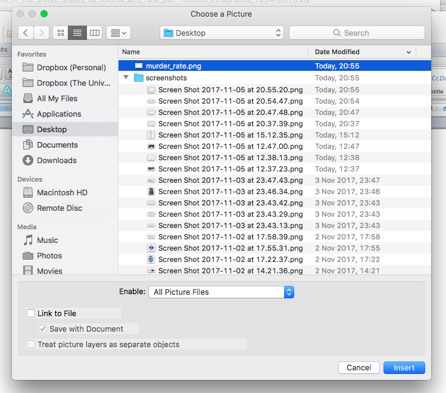

This will open up a popup window you can use to navigate to the picture you just saved, and selecting it. When you are done, click "OK", and your graph will appear :


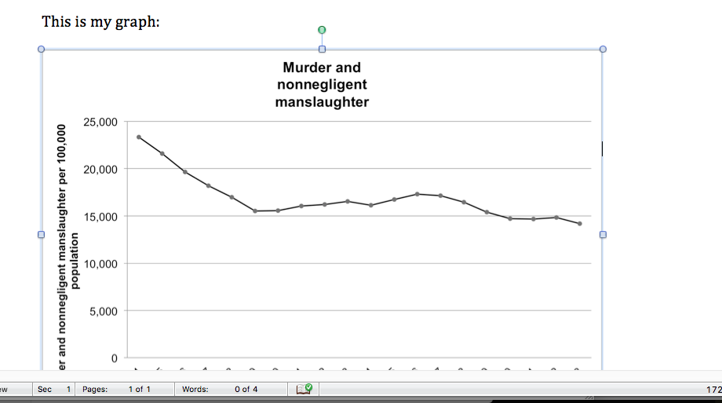


It is important that you label your graphs. You should include a short and to-the-point caption for the graph. You should also refer to the graph in your writing. Something like this: 


</span>

## Acvitity 5: More complex graphs


While we only covered descriptive analysis for univariate and bivariate analysis, when it comes to making sense of your data graphically, you can include further variables. 

<span style="color:#d95f02">
Let's show an example now. 


In the FBI data, you can see that we have quite a few columns (variables) for crime rates for various crime types. We looked at rates of violent crime and also murder and nonnegligent manslaughter, but there is also robbery, Aggravated assault, burglary, and some more. Let's say that we want to compare the trajectories of all these variables over the years, over time. 


You can start with a simple line graph for one of the variables. Let's select the violent crime rate, and build a line chart for this variable. You should be able to do this by now without guidance, but if you need assistance, just scroll up to where we did this earlier. 


Now once you've created this graph, right-click anywhere on the chart itself, and select the "Select Data..." option: 


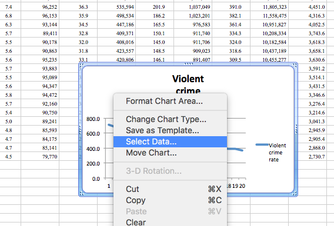


In the popup that appears, under the series box, click on the "Add" button:


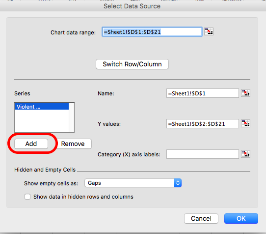


Once you clicked on the "Add" button, the field for "Name" and "Y values" should appear empty. Click in the text box next to name, and then click on the column header (variable name) for the next variable. Select "Robbery Rate":


Then, click in the text box next to the "Y values:" and then select the values in the robbery rate column: 


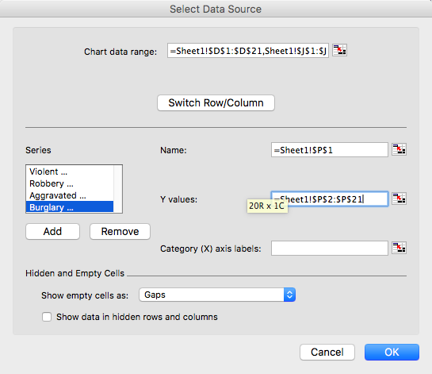


Then repeat this for every variable you want to add. For every variable, click on "Add", then for "Name" select the column header, and for "Y values" select the values for that variable. 


Repeat this for "Aggravated Assault Rate" and again for "Burglary Rate": 


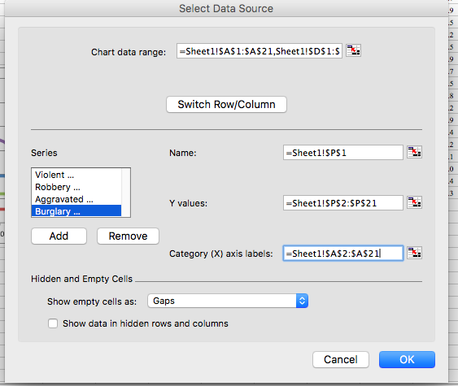


Finally, when you have added all these variables, click on OK, make any changes you'd like to, to the graph, and then ta-daa you will see all 4 variables on one graph: 


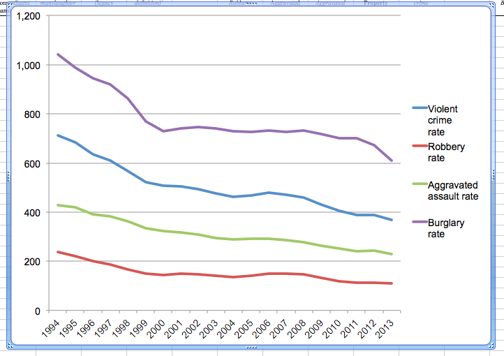


You could also create a stacked column chart, that shows you the cumulative crime rate in each year, while separating out for categories, using all the same variables. 


Again, start with building a column chart for just one of the variables. Let's build this for rate of violent crimes: 


So that will create this column chart: 


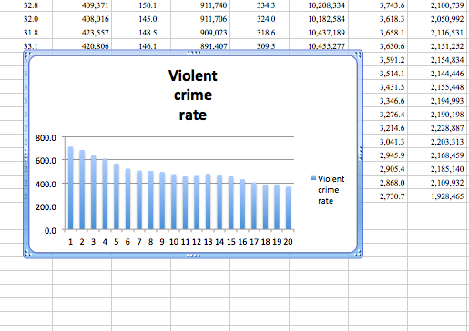


Now, just as we did with the line charts, just right-click anywhere on the chart area, and again select "Select Data...". 

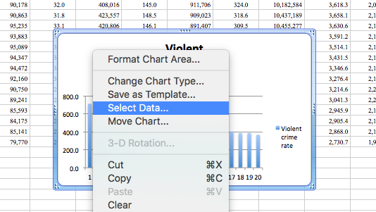


And again this will bring up a popup. Here, once again you can add variables with the "Add" button: 


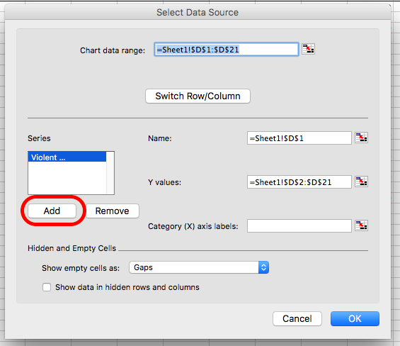


Once you clicked on the "Add" button, the field for "Name" and "Y values" should appear empty. Click in the text box next to "Name", and then click on the column header (variable name) for the next variable. Select "Robbery Rate" column header. Then click in the text box next to "Y values",  and then select the values for robbery rate: 


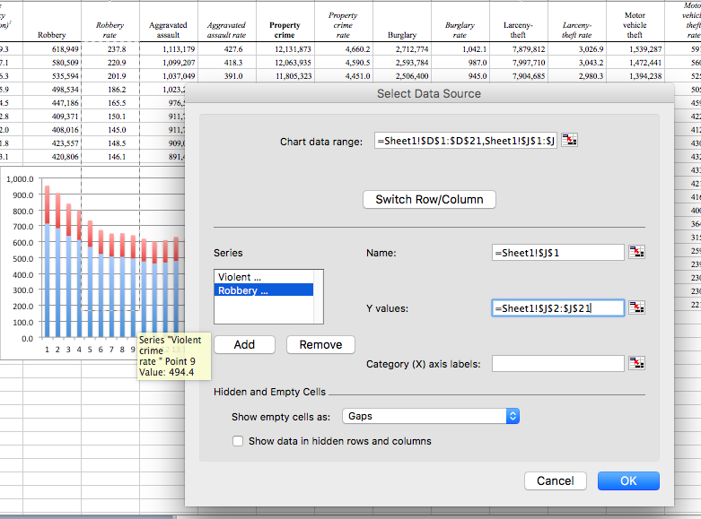


Then repeat this for every variable you want to add. For every variable, click on "Add", then for "Name" select the column header, and for "Y values" select the values for that variable. So in this case, again as we did for the line graphs, repeat this for "Aggravated Assault Rate" and again for "Burglary Rate": 


Then finally you should end up with a stacked bar chart of all these variables, that allows you to compare the rate of each crime type between years, but also allows you to compare a cumulative crime rate, if you consider the crimes of Violent crimes, Robbery, Assault, and Burglary together: 


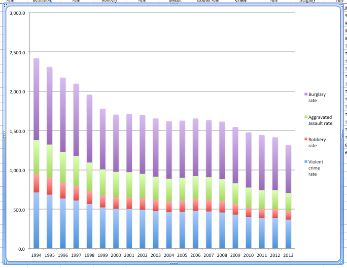

</span>

So you can see that you can use data visualisation as a way of putting together many variables into one graph. 


## More guidance on chart design

Read through this list on ["Dos and Don'ts of Charts and Graphs"](https://guides.library.duke.edu/datavis/topten) and have a look at some of [these examples](http://datajournalismhandbook.org/1.0/en/introduction_3.html) as well for some further inspiration. 


## Communicating results


We have been covering exploratory data analysis, where you take your data, and produce visualisations from that, but sometimes you can also compliment your results by visualising your tables and other outputs. An example would be the conditional formatting, which we covered in week 3. 


The most important thing when communicating your results is that you know your audience. Know what they understand, what they don't, and what you can tell them in one graph. Your graph has to tell a story. Think about why you are making it? What is the message that you want to convey? What is the story this graph is telling? You need to be clear with this to yourself, to make sure that your graph accomplishes it's mission in telling an interesting story about your data. 

> You should look at your data. Graphs and charts let you explore and learn about the structure of the information you collect. Good data visualizations also make it easier to communicate your ideas and findings to other people. Beyond that, producing effective plots from your own data is the best way to develop a good eye for reading and understanding graphs—good and bad—made by others, whether presented in research articles, business slide decks, public policy advocacy, or media reports.

- [Kieran Healy](http://socviz.co/)


### Activity 6: Interpreting results


You should, by becoming a maker of good graphs, become literate about graphs as well. If you are interested in something like a role as a crime analyst, part of your interview process might include something like a numeracy test, which will test your ability to interpret trends and data from graphs (amongst some other things). 

<span style="color:#d95f02">
Here's an example: 


#### Question 1  {-}

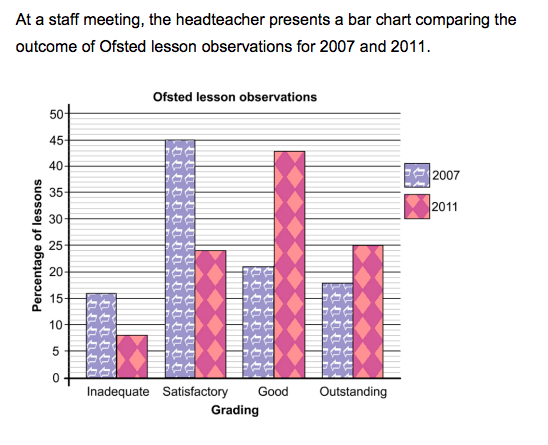

Then the test question could be something like this: 


Tick all the true statements:

- 68% of observed lessons were graded 'Good' or 'Outstanding' in 2011.
- In 2011 the percentage of lessons that were graded 'Good' or 'Outstanding' was twice the percentage of lessons that were graded 'Good' or 'Outstanding' in 2007.
- The percentage of lessons graded 'Inadequate' was halved between 2007 and 2011.


So, which one of these do you think are true statements? 


OK try again: 


#### Question 2  {-}

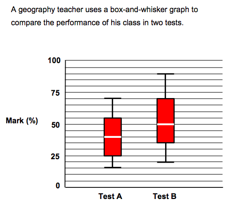


Tick all the true statements:

- The range of marks in Test A was greater than in Test B.
- The median mark in Test B was approximately 10 percentage points higher than the median mark in Test A.
- In Test B one-quarter of the pupils achieved 75% or more. 


And again: 


#### Question 3  {-}


Tick all the true statements:

- Two-thirds of the pupils spent 15 minutes or less on planning.
- The range of time used for planning was 22 minutes.
- The pupil with the median planning time achieved a final mark of 54. 


And finally:


#### Question 4  {-}


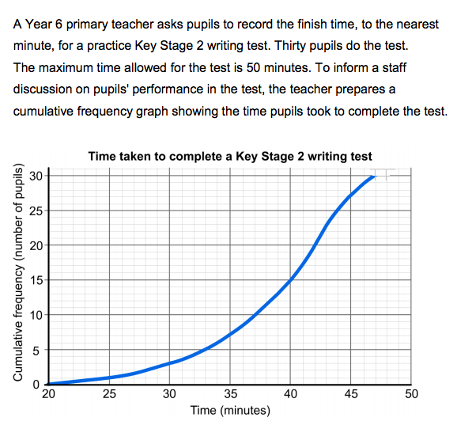


Tick all the true statements:

- All the pupils completed the test within the maximum time allowed.
- The median time taken was 40 minutes.
- No pupils recorded a time less than 29 minutes. 


Alright. Make a note of all of your answers before reading the results ahead. 
</span> 

#### Results {-}

OK I have the answers for you now: 


- For question 1 the correct answers were Options A and C
- For question 2 the correct answers were Option B
- For question 3 the correct answers were Options A, B and C
- For question 4 the correct answers were Options A and B


So, how did you do? If you are unsure about any of the answers, ask us now!


<!--
## Note on your feedback session 

The session next Tuesday will be a joint session between Lisa Williams, who will give you a brief overview of the Q-step programme, and also a chance to ask any questions that you have about this, and followed by an embedded employability session, where you will be taught an employable skill. Attendance will still be taken, the same way as I usually do, but there is no feedback lecture for this session. Instead, it is up to you to take your own time to watch the below video to learn more about data visualisation: 

- [video to watch for feedback session](https://vimeo.com/124674889)


If you have any questions about this just post on the discussion board where I will try to answer, or book office hours or ask away in the lab session. 

-->

## Summary

In sum, you should now be able to select a graph that represents your data in a meaningful way, that helps you describe your data as well as communicate your results to your audiences. You should be familiar with the following terms: 

- bar chart
- column chart
- line chart
- data ink ratio
- stacked bar chart
- conditional formatting
- producing summary statistics by groups
- if statements in excel
- box plots in excel
- association/ direction of a relationship between numeric variables
  + positive relationship
  + negative relationship
- form of a relationship between numeric variables 
  + linear relationship
  + non-linear relationship
- strength of a relationship between numeric variables
  + weak
  + moderate
  + strong
- scatterplot
- trendline
- correlation
- correlation does not mean causation


<!--chapter:end:007-week6.Rmd-->

# Week 7 {#week7}

## Learning outcomes

This week we consider another important factor that is present in our data that we don't always talk about, and that is the importance of *time*. The importance of place in criminology and crime analysis is widely discussed. We know certain areas can be crime hotspots, and we know that whether you come from a well of or depreived area you have different access to resources, and therefore your outcomes in terms of involvement with criminal justica system also differs. However time is just as important as place. We often hear that crime is "going up" or "going down" over time. It is very important, that as well-rounded criminologists, you are able to talk about these concepts with appropriate knowledge and understanding. 

When violence increases bewteen March and August, is that because we are seeing an increase in crime and offending? Or is it possible that the time of year has something to do with this? How much must crime increase and over how long of a time, in order to be able to confidently say that crime is on the increase? These are important, and not always easy questions to answer, and this week we will begin to think about this. 

Here are some terms that we will cover today: 


- Crime trends
- Temporal crime analysis
- Seasonality
- Time series data analysis
    + Moving averages
    + Smoothing techniques
    + Seasonal decomposition
- Signal vs noise


## Crime and incident trend identification


All crimes occur at a specific date and time, however such definite temporal information is only available when victims or witnesses are present, alarms are triggered, etc., at the time of occurrence. This specific temporal data is most often collected in crimes against persons. In these cases, cross-tabulations or histogram6 of weekday and hour by count will suffice. The great majority of reported events are crimes against property. In these cases, there are seldom victims or witnesses present. These events present the analyst with ‘ranged’ temporal data, that is, an event reported as occurring over a range of hours or even days. In the case of ranged temporal data, analysis is possible through use of equal chance or probability methods. If an event was reported as having occurred from Monday to Tuesday, in the absence of evidence to the contrary, it is assumed the event had an equal chance or probability of occurring on each of the two days, or .5 (%50). In the same manner, if an event was reported as having occurred over a 10 hour span there is a 10% chance the event occurred during any one of the hours. This technique requires a reasonable number of events in the data set to be effective. The resulting probabilities are totalled in each category and graphed or cross-tabulated. This produces a comparison of relative frequency, by weekday or hour [source](http://cradpdf.drdc-rddc.gc.ca/PDFS/unc76/p530054.pdf).


**Temporal crime analysis** looks at trends in crime or incidents. A crime or incident trend is a broad direction or pattern that specific types or general crime and/or incidents are following.

Three types of trend can be identified:

- overall trend – highlights if the problem is getting worse, better or staying the same over a period of time
- seasonal, monthly, weekly or daily cycles of offences – identified by comparing previous time periods with the same period being analysed
- random fluctuations – caused by a large number of minor influences, or a one-off event, and can include displacement of crime from neighbouring areas due to partnership activity or crime initiatives.


### Activity 1: Extracting temporal variables from dates


This week we will be looking at crime data from the USA. As you saw, the data from police.uk is aggregated by months. We do not know when the offences happened, only the month, but nothing more granular than that. American police data on the other hand is much more granular. 

<span style="color:#d95f02">
Cities release their own data. Here, we will be looking at crimes from Dallas, Texas. [You can see more about these data, and find the download link to the data dictionary here](https://www.dallasopendata.com/Public-Safety/All-Crime/p9zb-d4n6/about). You can download a subset of Dallas crime data from blackboard. Go to course content > week 7 > Data for week 7, and the file is *dallas_burg.xlsx*. Download this and open it up in excel. 


When you open the excel spreadsheet, you will see that there is a column for date called **Date.of.Occurrence**. The date is in the format dd/mm/yyyy. So the first date on there you can see is  16/11/2016. 


But what if I asked you the question: which year had the most residential burglaries? Or what if I want to know if residential burglaries happen more in the weekday, when people are at work, or in the weekends, maybe when people are away for a holiday? You have the date, so you should be able to answer these questions, right? 


Well you need to be able to have the right variables to answer these questions. To know what year saw the most residential burglaries, you need to have a variable for year. To know what day of the week has the most burglaries, you need to have a variable for day of the week. So how can we extract these variables from your date column? Well luckily excel can help us do this. 


So first you want to make sure that your date column is, in fact, a date. To be sure, you can right click on the column, and select "Format cells...":


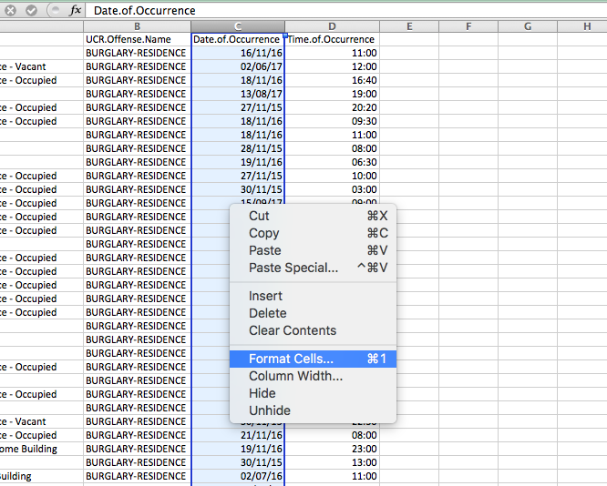


Under the "Category" sidebar select "Date", and pick a format that matches your date layout (for example, in this case it's date-month-year). 


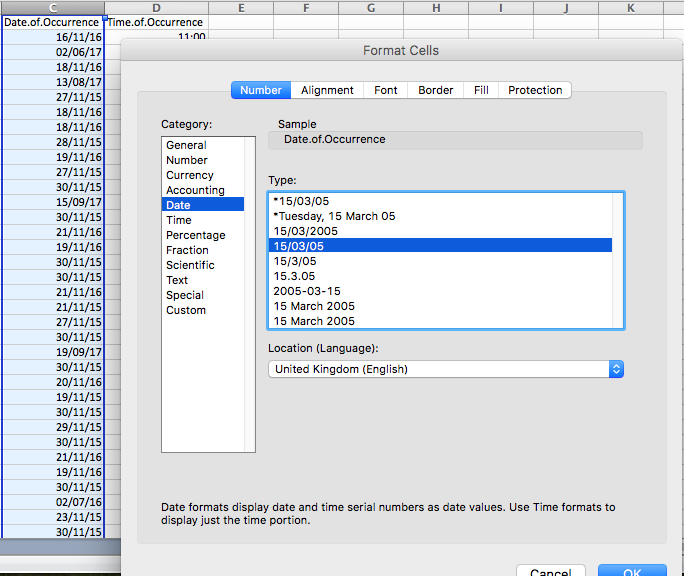


This way you make sure that Excel knows that your date column is a date. 
</span>


### Activity 2: Extract year from date column

<span style="color:#d95f02">
Now, let's start by answering our first question: which year had the most burglaries. To answer this, we first need a variable for year. Let's extract this from the date column. We can do this with the `=year()` function. Inside the brackets, you just have to put the date from which to extract the year. 


First, let's create a new column, called "Year", like so:


Then for the first cell, enter the formula `=year()`, and inside the brackets, put the date value for the first row, in this case, cell `C2`: 


You will see the cell be populated with the value for year, in this case 2016. Copy the formatting down to populate the whole "Year" column: 


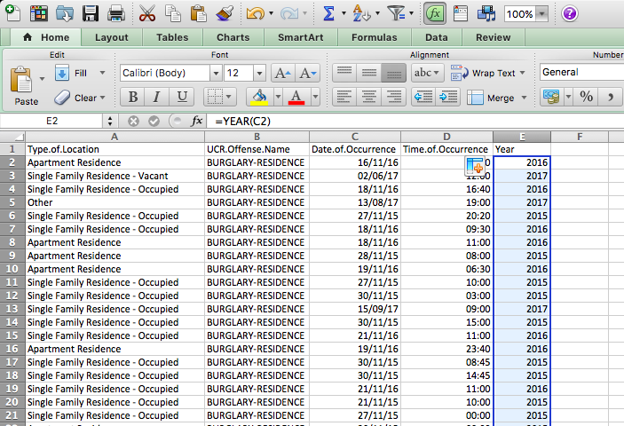


Ta-daa! You now have a column of years! Now how do you find out which year has the most number of burglaries? Well it's simple univariate analysis that we should be so familiar with by now! Yay!


So go ahead, build a pivot table to count the frequency of each variable for year. Try to do this now with no further guidance. If you do need some help, have a look at your notes from the univariate analysis lab, in week 2. But try to have a go. 


So which year had the most residential burglaries? 


TO answer this question, hopefully you built a pivot table with the year variable, and your table look should like this:

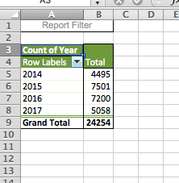

</span>

If not raise your hand now, and we will come around and help!


If it does, nice work! You can now identify that the year with the highest number of residential burglaries in Dallas was 2015. You should however note that since 2017 is not yet over, you have incomplete data for this year, and so you're not comparing like for like. Always think about how to interpret your findings, and keep in mind any possible limitations and issues associated with your data. 


### Activity 3: Extract day of week from date column 


Now let's go back to our 2nd question - do residential burglaries happen more in the weekday, when people are at work, or in the weekends, maybe when people are away for a holiday? 

<span style="color:#d95f02">
To answer this question, we need a variable for day of the week. First, create a new column call it Day.of.Week: 


Then populate this column with the day of the week. To do this, you can use the `=text()` function. You have to pass this function two parameters. The first is the value of the date column again, as was the case with the year function, and the second is the format that you want the text to take. 


If you ever forget this, excel will remind you: 


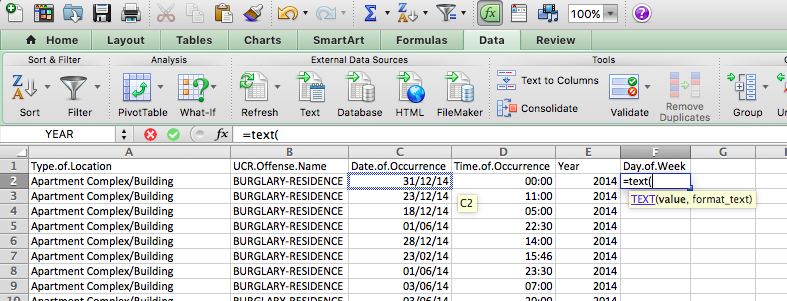


The value parameter, just like with the year function, is the cell in the *Date.of.Occurrence* column. In the case of our first row here, it's C2. The second value is the format parameter. Depending on what you pass here, a different value will be returned by the `text()` function. Here is a list of values, and their results: 


- *d:*	9
- *dd:*	09
- *ddd:*	Mon
- *dddd:*	Monday
- *m:*	1
- *mm:*	01
- *mmm:*	Jan
- *mmmm:*	January
- *mmmmm*:	J
- *yy:*	12
- *yyyy:*	2012
- *mm/dd/yyyy:*	01/09/2012
- *m/d/y:*	1/9/12
- *ddd, mmm d:*	Mon, Jan 9
- *mm/dd/yyyy h:mm AM/PM:*	01/09/2012 5:15 PM
- *dd/mm/yyyy hh:mm:ss:*	09/01/2012 17:15:00


Let's use the "dddd" option here to extract the full name of each weekday. So to do this, your formula should be: 


`=year(C2, "dddd")`


Like so: 


Now copy this for each row, and you will now find out the day of the week that each one of these burglaries falls on:


Can you make a pivot table that answers our question about weekends and weekdays yet? Well, not quite just yet. You would need a column for weekday/weekend. How can we do this?


Well think back to when we did re-coding in week 4. Remember the `VLOOKUP()` function? Remember the `VLOOKUP()` function takes 4 parameters. You have to tell it the **lookup_value** - the value to search for. You then have to tell it the **table_array** - which is your lookup table, with two columns of data. The VLOOKUP function *always* searches for the lookup value in the first column of table_array. Your table_array may contain various values such as text, dates, numbers, or logical values.You then have to tell it the **col_index_num** - the column number in table_array from which the value in the corresponding row should be returned. Finally, you still have to specify the **range_lookup**. This determines whether you are looking for an exact match (when you set to FALSE) or approximate match (when you set to TRUE or you omit it).


So the first thing you have to create is your lookup table. For each value of day of the week, you should assign a value of Weekday or Weekend. Something like this: 


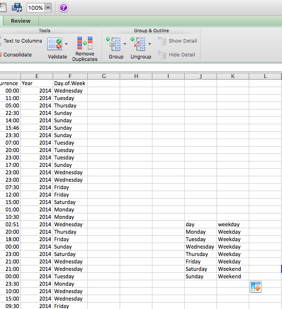


Now let's try to apply the formula. 

- **lookup_value** is the day of the week
- **table_array** is this table we just created
- **col_index_num** is the column which contains the values to translate into 
- **range_lookup** set this to FALSE, so we match on exact matched only


So 


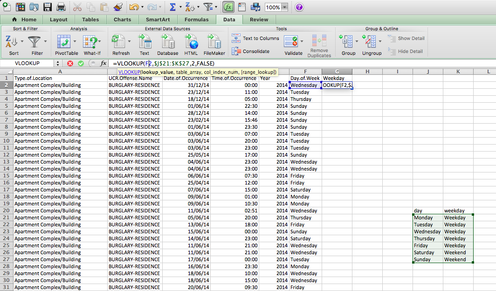


Make sure to add the dollar signs, to ensure that you can copy the formatting!


Now, finally you have a variable that tells you whether each burglary took place on a weekday or a weekend: 


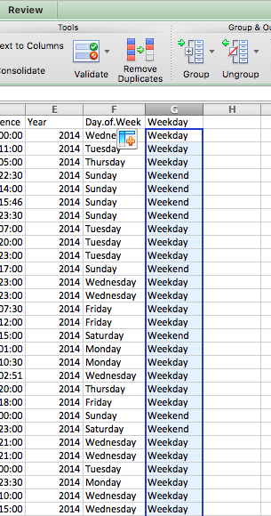


Now you can use this variable to create a pivot table, and see the number of burglaries on weekdays or weekends. Let's create this pivot table: 


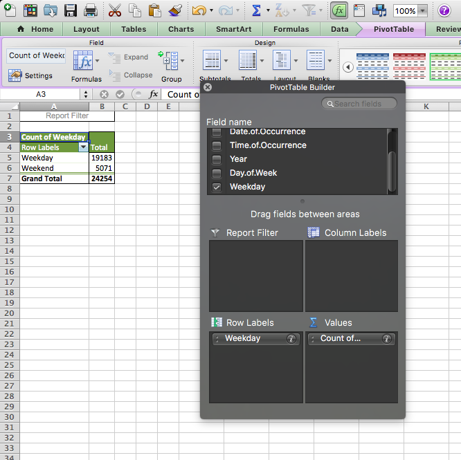


Unsurprisingly, there are a lot more burglaries on weekdays than weekends. Why do you think that is? Take a moment to chat to the person next to you and discuss. 


</span>

So what did you discuss? I am hoping that you mentioned that there were a lot more weekdays than weekend-days in our data, and in fact, in all weeks. There are 2.5 times as many weekdays than weekends in a week. I know, it's a sad truth, we work a lot more than we get to rest. But another thing that happens because of this, is that simply looking at the number of burglaries in weekdays and in weekdays might not be a very meaningful measure. Remember earlier, when we spoke about comparing like for like? Or last week, when we talked about the crime rate (per 100,000 population) versus the number of crimes? Well again here, we should calculate a rate; to truly be able to compare, we should look at a rate such as the number of burglaries *per day* for weekdays, and the number of burglaries *per day* for weekend-days. 


How do you calculate the rate? Well you do this simply by dividing the numerator (number of burglaries) by an appopriate denominator. What is the best denominator? Well it depends on the question you're looking to answer. Usually it's what comes after the *per*. If we are looking for number of crimes *per population* then we will be dividing by the population. If we are looking at number of burglaries *per household* we will be dividing by the number of households in an area. In this case, we were talking about the number of burglaries *per day* to compare between weekends and weekdays. So, your denominator will be the number of days for each group. 


So, to get the burglary rate (per day), we simply take our total number of burglaries from our pivot table, and divide by the number of days for each. As we know, there are 5 weekdays (boo) and 2 weekends (yaay). So let's divide accordingly: 


And copy also for the weekends, and voila we have our answer to the question, are there more burglaries on weekdays or weekends:


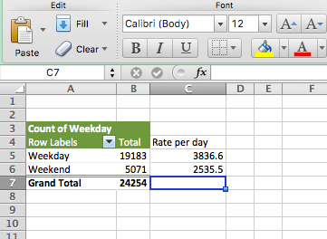


Now you can discuss again why you think this might be. For example, during the week, people are away from their homes for work, for the majority of each day, which leaves their home unprotected. I've mentioned the [crime triangle]() before. If the resident is not home, then there is an absence of a capable guardian, and there is an increased risk for a crime (such as burglary) to occur! 


There are many things that peak on certain days of the week. If you're interested in some more examples, [read this article in the Guardian about the most dangerous days of the week](https://www.theguardian.com/lifeandstyle/2013/may/29/most-dangerous-day-of-week). 


## Aggregating to simple intervals

Above the activities have you the ability to extract certain types of date categories from the date column. If we want to compare year on year increase or decrease, this is one approach. Or if we want to compare day of week, month of year, and so on. We did this by creating a new variable, and then using a pivot table. We could also look at the date as it is, we could have a look at the number of crimes each day, but often this can be noisy. Instead, sometimes we want to aggregate (group) these into simpler time intervals.

First, we've not had a look at our time variable yet, so we could start with that. 


### Activity 4: Aggregate to hour

<span style="color:#d95f02">
First create a new column for 'Hour':


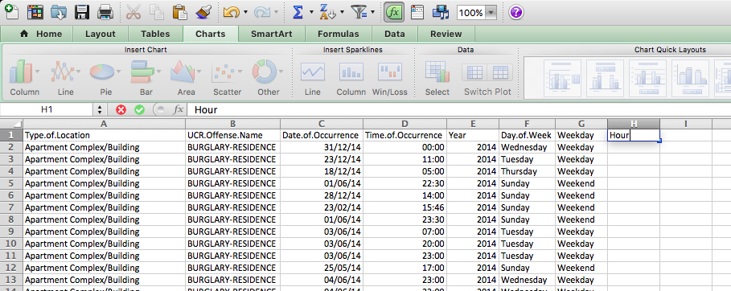


Then, use the `=HOUR()` function to extract the hour, just like we did to get the year using the `=YEAR()` function. Except, this time we are extracting hour from the "Time.of.Occurrence" variable, rather than the "Date.of.Occurrence" variable. Like so: 


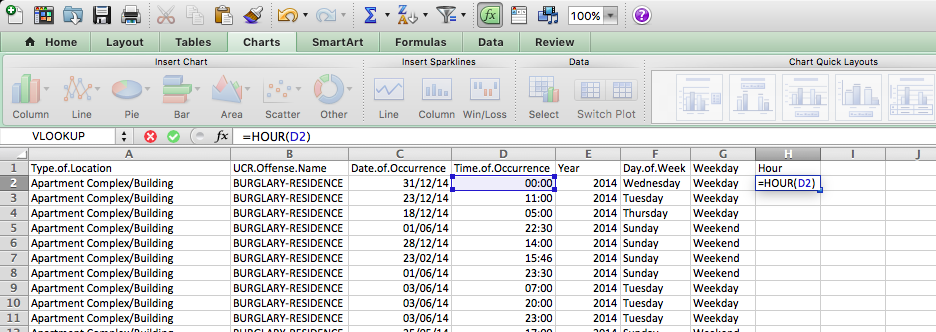


And finally, copy your formatting to all the rows: 


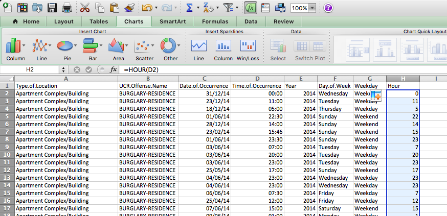

</span>

Now you have a column for the hour that the offence was committed in! 


You could also extract something else, for example the month and year from the date. To do this, you simply use this, you again create a new column, and this time use a formula that extracts text from the date: 

`=TEXT(*cell reference*,"mmm-yyyy")`

In where it says cell reference, just put in the reference to the column from the date (in this case it's C) and the cell number (2 for the first row). 

`=TEXT(C2,"mmm-yyyy")`

You can then copy this formula down the whole data set. 


NOTE: Now there is also a new feature in Excel 2016 that allows you to do automatic grouping by time. You can have a look through [this tutorial](https://blogs.office.com/en-us/2015/10/13/time-grouping-enhancements-in-excel-2016/?eu=true) to show you how you can use this new feature. 

So what can we do with all this great temporal data? Well let's start by visualising!


## Visualising time


Depending on what you're visualising, you can use either a linear approach, or a cyclical approach. A linear approach makes sense if you're plotting something against passing time. If you are looking at whether a trend is increasing or decreasing, this is something you would look at over time, because it would be moving forward. 


On the other hand, many measures of time are cyclical. For example, remember in the very first week, when we spoke about *levels of measurement* of variables, and we had a variable for time, and mentioned that this was *not* a numeric variable, instead it was categorical-ordinal, because it loops back around. After the 23rd hour of a day comes the 0 hour of the next! So representing this on a linear graph may mask some important variation. Let me show you an example: 


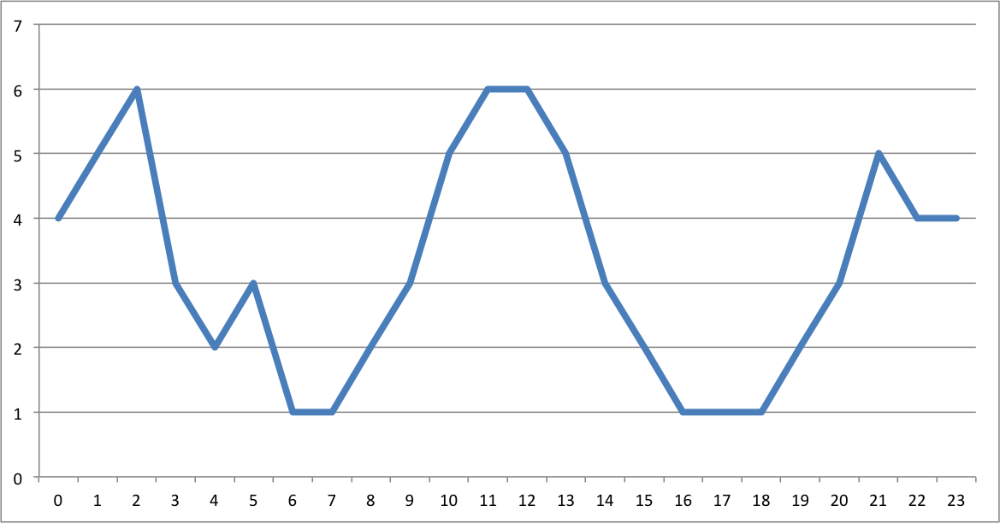


The above is some made-up data, of something, over the hours of a day. What do the peaks there look like to you? If I were looking at this, I would say we have 3 peaks. There is a peak in the early hours of the morning, like 1-2am, then again a peak midday, and again another peak in the evening around 9pm. 


This is the same data, but visualised in a cyclical way. In this visualisation, it actually appears that there are two main peaks. The peaks that were previously identified as two separate, possibly independent peaks have now bridged into 1, and we can see that instead there might be a continuum, and an ongoing event from 9pm to 2am. It is important to consider the cyclical nature of some of your temporal variables, and use the appropriate means to visualise them. 


It might be worth to have a look at some examples of temporal data being visualised, as well as making our own visualisations of time. Here I will focus on 3 approaches, **line graphs**, **radar graphs**, and **heatmaps**. 


### Activity 5: Line graphs


Let's start with viewing some examples of time visualised using a timeline, of continuous time passing: 


The world of sports is rich with data, but that data isn't always presented effectively (or accurately, for that matter). The folks over at FiveThirtyEight do it particularly well, though. In this interactive visualization below, they calculated what's called an "Elo rating" -- a simple measure of strength based on game-by-game results -- for every game in the history of the National Football League. That's over 30,000 ratings in total. Viewers can compare each team's Elo to see how each team performed across decades of play. [See here](http://projects.fivethirtyeight.com/complete-history-of-the-nfl/#ari)


Another example of a continuous timeline is the "what is warming the world" visualisation. Ever heard a version of the advice, "Don't simply show the data; tell a story with it"? That's exactly what this visualization from Bloomberg Business does -- and it's the interactive part that makes the story move along from beginning to end.

The point of the visualization is to disprove theories that claim that natural causes explain global warming. The first thing you'll see is the observed temperature as it's risen from 1880 to present day. As you scroll down, the visualization takes you through exactly how much different factors contribute to global warming in comparison to what's been observed, adding a richer layer of storytelling. The conclusion the authors want viewers to draw is made very clear. [See here](http://www.bloomberg.com/graphics/2015-whats-warming-the-world/)


<span style="color:#d95f02">
To make a line graph, we need to think about what we will represent on our horizontal (x) axis, and what we will represent on our vertical (y) axis. Let's say that on the Y axis we want to represent *number of burglaries*. OK, so what should we have on our X axis? That will be whatever we use to fill in the blank in the sentence: number of burglaries per _____________. Let's say we want to know any changes in the number of burglaries *per day*. Well to do this we will need to *count the number of times that each date appears in the data*. Remember what this means?


That's right! Univariate analysis time. Go ahead and use a pivot table to build a frequency table of the "Date.of.Occurrence" variable. You will eventually end up with something like this: 


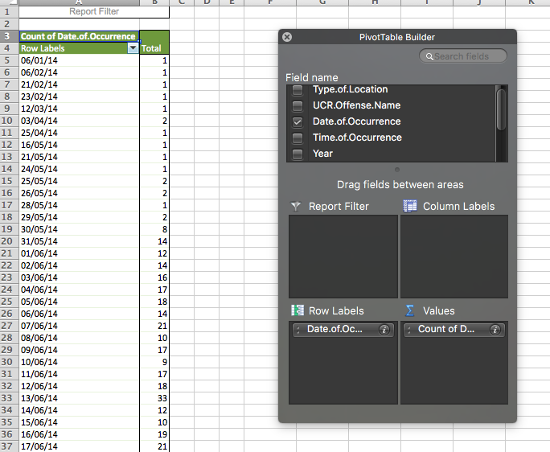


Now to turn this into a line graph. We've made quite a few line graphs before, including last week as well, but never with this many data points. However, the motions are still the same. You highlight your data, you select your appropriate chart (line graph), and then you also add the labels, using "Select Data" and populating the 'Category (X) axis labels' section in the popup window that appears. If any of this is confusing to you, re-visit last week's lab notes about data visualisation. 


When all said and done, you should end up with a chart that looks like this: 


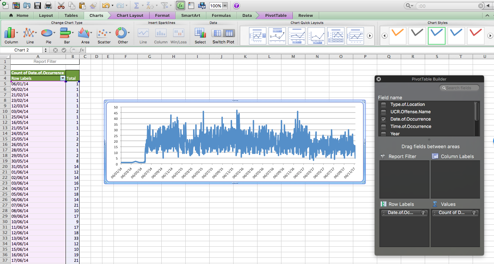


</span>

So is residential burglary going up or down in the city of Dallas? It's not easy to tell from this, is it? The thing with data at these intervals is that there is a lot of day-to-day variation, and what we would refer to as the **noise**. And in this **noise** we can loose sight of the **signal**. 


Signal-to-noise ratio (abbreviated SNR or S/N) is a measure used in science and engineering that compares the level of a desired signal to the level of background noise. While SNR is commonly quoted for electrical signals, it can be applied to any form of signal, and is sometimes used metaphorically to refer to the ratio of useful information to false or irrelevant data. 


One of my favourite books I've read in recent years is called [The Signal and the Noise by Nate Silver](https://www.theguardian.com/books/2012/nov/09/signal-and-noise-nate-silver-review) and if you enjoyed anything about this class, or you enjoyed reading the Tiger that Isn't text, I would highly recommend it! It can get a bit more technical in places, but it's got loads of very neat examples, and is an entertaining read overall. In this book, the author talks about the need to see past all the noise (the random variation in the data) in order to be able to make predictions (using the signal). 


So in this case of our burglaries, we would need to be able to somehow look past this variation in day-to-day changes, to be able to look at overall trends. For example, we could start to **smooth** this data, and instead of looking at the number of burglaries each day, begin to consider the *average number of burglaries every 10 days*, which would be something called the **10-point moving average**. This would be one approach to smooth our data. I will return to this later today. 


### Activity 6: Radar graphs

There are also multiple cyclical ways to visualise your data. One approach is to use radar graphs The below graphs all represent the same data, of page views for a website across different times of day. Here’s an example by Purna Duggirala that is essentailly a bubble chart that uses two clocks side by side: 


The biggest problem with the chart is the incorrect continuity. A single clock on its own isn’t a continuous range, it’s really only half a range. So the clock on the left is showing 12am – 12pm, but when you reach the end of the circle the data doesn’t continue on like the representation shows. Instead you need to jump over to the second clock and continue on around. It’s difficult to see the ranges right around both 12pm and 12am, since you lose context in one direction or another (and worse, you get the incorrect context from the bordering bubbles).


In a great show of Internet collaboration, the double clock chart spurred some other experimentation. Jorge Camos came up with a polar chart that plots the data on a single “clock face,” showing two 12 hour charts overlaid on top of each other.


Given that the 12-hour clock is a difficult metaphor to use for a visualization, many people choose to use a 24-hour circle. 24-hour circular charts typically start with midnight at the top of the chart and then proceed clockwise, showing all 24 hours in one 360-degree range. The benefit of a 24-hour circular chart is that the cyclical nature of the data is represented and the viewer can easily read the continuity at any point on the chart.


A simple example of a 24-hour circle comes from Stamen Design‘s Crimespotting. This isn’t a data-heavy visualization chart, since it doesn’t actually show any data other than sunrise and sunset times (instead it’s main purpose is as a filtering control). But it’s a good example of the general layout of 24-hour charts, and it’s very clean and well-labeled. You can read about the thinking that went into designing this “time of pie” on Stamen’s blog.


The inspiration for this time selector, which is documented in Tom Carden’s blog post, was the real-life timer control used for automating lights in your house.


This above is known as a radial chart. We will now learn how to build one in Excel. But before we do, I wanted to tell you guys the story of Florence Nightingale, the original data visualisation pioneer. I know, I know, we covered data visualisation last week, can I please get over it. But it's one of the most fun aspects of data analysis so no, I cannot, and now I will tell you about why Florence Nightingale wasn't just a famour nurse, she was a famous data pioneer!


This is Florence Nightingale's 'coxcomb' diagram on mortality in the army:


We all have an image of Nightingale - who died 100 years ago today - as a nurse, lady with the lamp, medical reformer and campaigner for soldiers' health. But she was also a datajournalist. After the disasters of the Crimean war, Florence Nightingale returned to become a passionate campaigner for improvements in the health of the British army. She developed the visual presentation of information, including the pie chart, first developed by William Playfair in 1801. Nightingale also used statistical graphics in reports to Parliament, realising this was the most effective way of bringing data to life.


Her report on mortality of the British Army, published in 1858, was packed with diagrams and tables of data. The coxcomb chart demonstrates the ratio of British soldiers who died during the Crimean War of sickness, rather than of wounds or other causes. Her work changed the course of history, enabling pro-active change through data collection. In 1858 Nightingale presented her visualisations to the health department demonstrating the conditions of the hospitals, and whose actions resulted in deaths being cut by two thirds.

<span style="color:#d95f02">
So, how do we make these in Excel. Well let's return to our within-day variation in residential burglaries. Let's visualise when they take place. 


To do this, we will first need to create a frequency table of the hour variable. Remember we are graphing UNIVARIATE ANALYSIS. We are describing one variable in our data, which is the hour variable. To know the frequency of each value of this variable (the number of burglaries in each hour), we must build a pivot table. 


So do this, create a pivot table that tells you the frequency of each hour: 


Now highlight the "Total" column, as it represents the number of burglaries in each hour, and this is what you want to graph. Then for charts select "Other", and then "Radar":


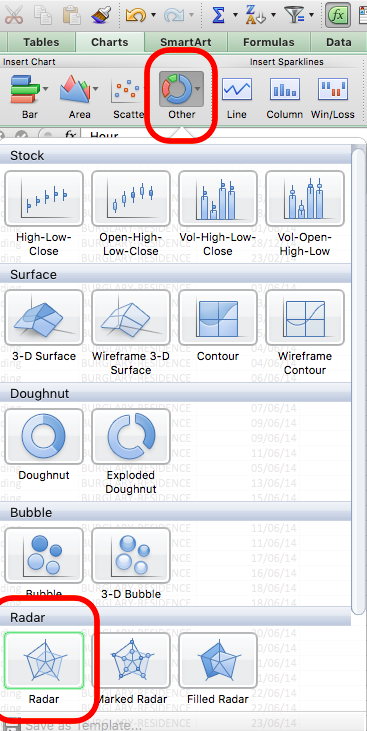


A radar graph will appear, something like this: 


Now there is something wrong with this graph. Can you spot it? Take a moment now to look... I'll wait here. 


Did you notice? If not, look again, this time, look at the graph, and tell me which hour has the most burglaries. Great, now look at the pivot table. Is it the same hour? (hint: no)


Why is this? Well our axes are not actually labelled! Remember, to label your axes, do as you did in the line graph, right click on the graph, "Select Data..." and populate the 'Category (X) axis labels' section in the popup window that appears with the hours. Now your graph should make sense: 


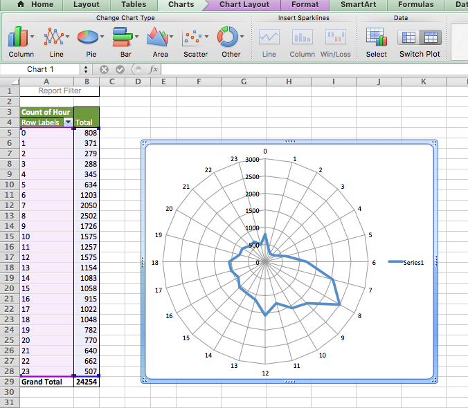


Much better. Clearly residential burglaries are happening in the morning, and in the day, and much less so in the night. But, is this any different between weekend and weekday? 


Now we are introducing a *second* variable. By now you should know that this means to answer this question, we will need **bivariate** analysis. So, create a bivariate table, by dragging the weekday variable which we created earlier into the "Column Labels" box in the pivot table options. This will create a crosstab for you: 


Now select the values for the "Weekday" column, and again for charts choose Other > Radial:


A chart will appear, showing you only the weekday burglaries. Now, right click this chart and select "Select Data..." option: 


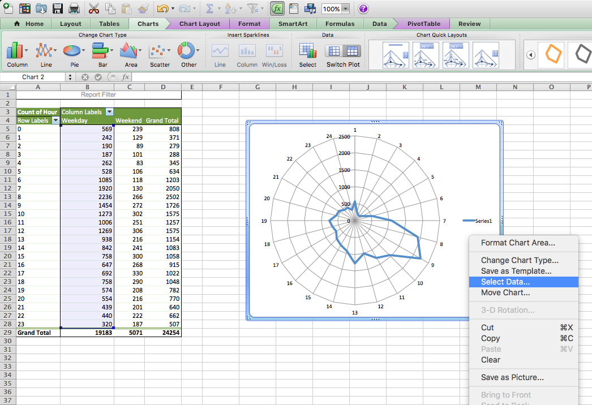


First, label your current data. Do this by clicking in the textbox next to the "Name:" label, and then clicking on the column header (cell B4):


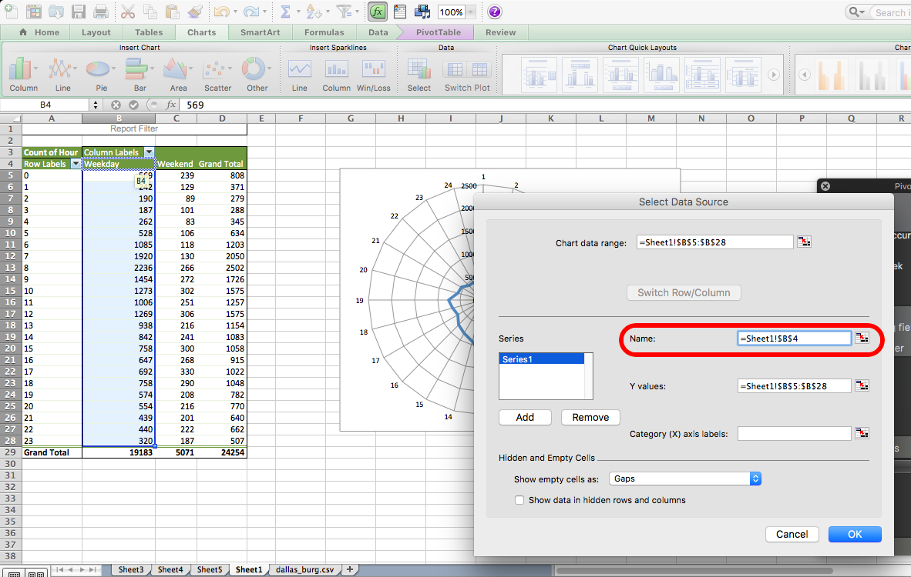


Then add the correct labels, but clicking on the box next to "Category (X) axis labels", and selecting the hours in the "Row Labels" column.


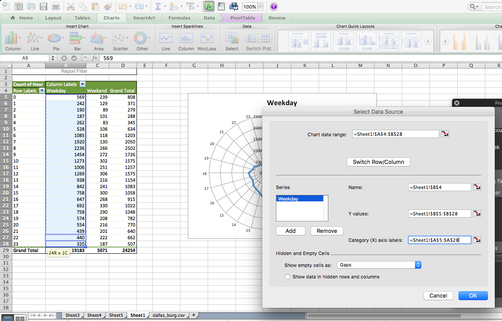


Now, add the weekend burglaries. Do this the same way we added multiple lines last week. You click on the "Add" button, and you put the name in the textbox next to "Name:", and the values in the text box next to the "Y-values" box. This time you can leave "Category (X) axis labels" empty, as it's already populated by the previous series:


Ta-daa here is your 2-variable radial graph. 


One issue though. Can you think of it? 


No? Well look how tiny the circle for the weekend is. This is because of the problem that we discussed earlier, there are simply many more burglaries in the weekday. So if we want to look at how within-day patterns differ between weekend and weekday, this graph isn't necessarily the best approach. Instead, we might want to look at *percentage* distribution, instead of count. 


To do this, change the pivot table to display percent instead of count. A reminder how to do this: you click on the little i (or arrow on a PC) to bring up a popup window, on which you select options: 


This brings up a menu where you can select what to "show data as". Choose % of column (because we want to know the percent of weekday crimes in each hour, and percent of weekend crimes in each hour, so our 100% are our columns, so we are looking at column percentages):


For doing this on a PC, to get the percentages for weekday/weekend burglaries, the options are slightly different. Need to go to the tab called "Show Values As" and then select % of Column:


And finally, ta-daa you have a radial graph that helps you compare the within-day temporal patterns of residential burglary between weekdays and weekends. 

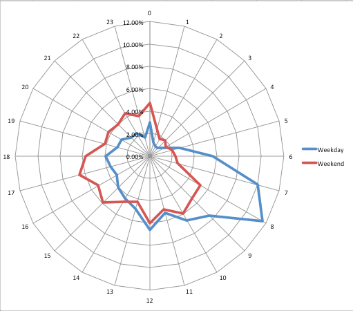

</span> 


## Activity 7: Heatmaps


Heatmaps visualise data through variations in colouring. When applied to a tabular format, Heatmaps are useful for cross-examining multivariate data, through placing variables in the rows and columns and colouring the cells within the table. Heatmaps are good for showing variance across multiple variables, revealing any patterns, displaying whether any variables are similar to each other, and for detecting if any correlations exist in-between them.

Typically, all the rows are one category (labels displayed on the left or right side) and all the columns are another category (labels displayed on the top or bottom). The individual rows and columns are divided into the subcategories, which all match up with each other in a matrix. The cells contained within the table either contain colour-coded categorical data or numerical data, that is based on a colour scale. The data contained within a cell is based on the relationship between the two variables in the connecting row and column.

A legend is required alongside a Heatmap in order for it to be successfully read. Categorical data is colour-coded, while numerical data requires a colour scale that blends from one colour to another, in order to represent the difference in high and low values. A selection of solid colours can be used to represent multiple value ranges (0-10, 11-20, 21-30, etc) or you can use a gradient scale for a single range (for example 0 - 100) by blending two or more colours together.

Because of their reliance on colour to communicate values, Heatmaps are a chart better suited to displaying a more generalised view of numerical data, as it’s harder to accurately tell the differences between colour shades and to extract specific data points from (unless of course, you include the raw data in the cells).

Heatmaps can also be used to show the changes in data over time if one of the rows or columns are set to time intervals. An example of this would be to use a Heatmap to compare the temperature changes across the year in multiple cities, to see where’s the hottest or coldest places. So the rows could list the cities to compare, the columns contain each month and the cells would contain the temperature values.

-[data viz catalogue](https://datavizcatalogue.com/methods/heatmap.html)

<span style="color:#d95f02">

So let's make a heatmap for burglary, from a crosstab looking at the frequency of burglary across days of the week *and* hours of the day. 


You can know, by the way that question is phrased, that your task here will require a bivariate analysis. To produce this, we will need a pivot table. So let's create our crosstab with pivot table, where we have day of week in the columns, and hour of day in the rows: 


Now this tells you all the information you want to know, but there are a lot of cells, with a lot of numbers, and it's not immediately obvious where we should be looking. A heatmap (via conditional formatting) creates an option for us to nudge people to find the high and low values in this table. 


To implement this, highlight the values in your table: 


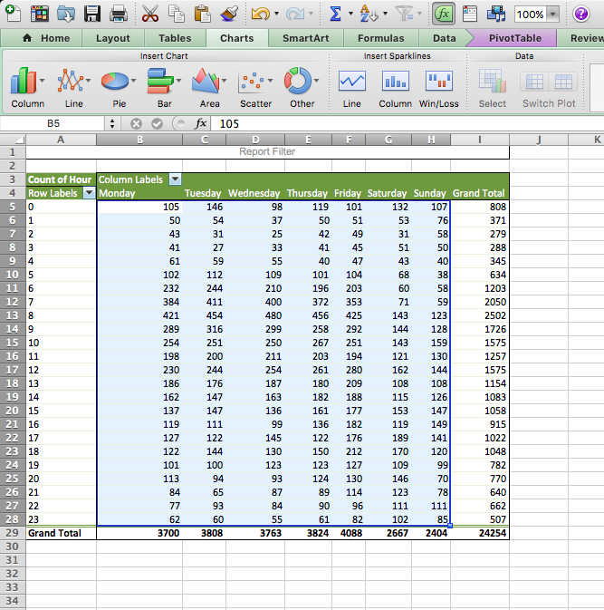


Then find the conditional formatting tab, and select a colour scheme that works for you. Remember to consider whether red values should be high or low? Is a high number good? Or is it bad? 


In this case, red is bad because it means more burglaries! So select this colourscheme and as if by magic, our table will now be highlighted in the form of a heatmap: 


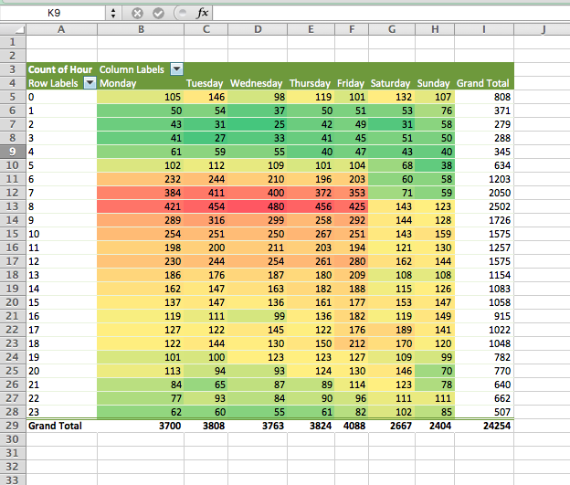


Now your eyes are immediately drawn to where the high values are, which apparently is Monday to Friday, 7 and 8 AM. We can see that on Saturday and Sunday even burglars want a lie-in, and therefore you see the green low burglary rate creep up later than on weekdays. Exciting stuff!
</span 


### More charts?


The Gantt chart is also a way to visualise the passage of time, or rather the tasks that you must complete as this time passes. You learned in the session covering research design about Gantt chards, which are essentially horizontal bar charts showing work completed in a certain period of time with respect to the time allocated for that particular task.


It is named after the American engineer and management consultant Henry Gantt who extensively used this framework for project management. We covered how to do these in the research design session, so please do refer back to those if you are not sure how to make them any more...!


There are also some non-conventional line-graph based timelines. While these appear initially like linear representations, it's actually possible for these to loop back, and reverse in time, making them slightly different. For example [this one about gas prices and driving practices](http://www.nytimes.com/imagepages/2010/05/02/business/02metrics.html), or this one about [driving safely](http://www.nytimes.com/interactive/2012/09/17/science/driving-safety-in-fits-and-starts.html) demonstrate this approach quite neatly. 


You could also have a stacked line chart to represent time: 


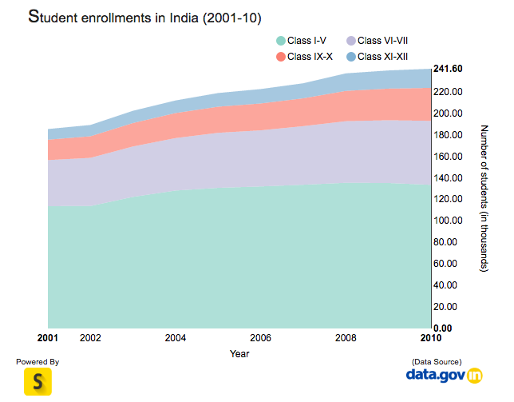


Stacked area charts are useful to show how both a cumulative total and individual components of that total changed over time.

The order in which we stack the variables is crucial because there can sometimes be a difference in the actual plot versus human perception. The chart plots the value vertically whereas we perceive the value to be at right angles to the general direction of the chart. For instance, in the case below, a bar graph would be a cleaner alternative.


Time is dynamic, and as a result there are many dynamic visualisations of time as well. For example, it is possible to build a gif as a graph output, with each measurement in time being one frame. This example, which represents time as frames in a gif, shows how the percent of the US population by age group has changed, and is predicted to change over time: 


Similarly Hans Rosling, who you might remember from the Joy of Stats video, was known for his dynamic representation of time, using videos and gifs:


You can see that there are many cool ways to represent time, and I've shown you only few. I hope you are interested to explore more!


## Time series

A Time Series is an ordered sequence of values of a variable at equally spaced time intervals.
Time series occur frequently when looking at industrial data. The usage of time series models is threefold:

- To help reveal or clarify trends by obtaining an understanding of the underlying forces and structure that produced the observed data
- To forecast future patterns of events by fitting a model
– To test the impact of interventions 


Time Series Analysis is an analytic technique that uses a sequence of data points, measured typically at successive, uniform time intervals, to identify trends and other characteristics of the data. For example, a time series analysis may be used to study a city’s crime rate over time and predict future crime trends.


All time-series data have three basic parts:

- A trend component;
- A seasonal component; and
- A random component.


Trends are often masked because of the combination of these three components – especially the random noise!


Two types of patterns are important:
- Linear or non-linear trends - i.e., upwards or downwards or both (quadratic); and
- Seasonal effects which follow the same overall trend but repeat themselves in systematic intervals over time. 


Smoothing data removes random variation and shows trends and cyclic components. Inherent in the collection of data taken over time is some form of random variation. There exist methods for reducing of canceling the effect due to random variation. An often-used technique in industry is "smoothing". This technique, when properly applied, reveals more clearly the underlying trend, seasonal and cyclic components.


In this course we will stick to the first option, and in particular we will look into producing *moving averages*. You should also know about the existence of *smoothing techniques*, and the sophisticated method for revealing trends is known as *seasonal decomposition*, however we will not be performing these ourselves today. 


### Moving averages


A moving average is a technique to get an overall idea of the trends in a data set; it is an average of any subset of numbers. The moving average is extremely useful for forecasting long-term trends. You can calculate it for any period of time. For example, if you have sales data for a twenty-year period, you can calculate a five-year moving average, a four-year moving average, a three-year moving average and so on. Stock market analysts will often use a 50 or 200 day moving average to help them see trends in the stock market and (hopefully) forecast where the stocks are headed.


An average represents the “middling” value of a set of numbers. The moving average is exactly the same, but the average is calculated several times for several subsets of data. For example, if you want a two-year moving average for a data set from 2000, 2001, 2002 and 2003 you would find averages for the subsets 2000/2001, 2001/2002 and 2002/2003. Moving averages are usually plotted and are best visualized.


Among the most popular technical indicators, moving averages are used to gauge the direction of the current trend. Every type of moving average (commonly written in this tutorial as MA) is a mathematical result that is calculated by averaging a number of past data points. Once determined, the resulting average is then plotted onto a chart in order to allow traders to look at smoothed data rather than focusing on the day-to-day price fluctuations that are inherent in all financial markets. 


The simplest form of a moving average, appropriately known as a simple moving average (SMA), is calculated by taking the arithmetic mean of a given set of values. For example, to calculate a basic 10-day moving average you would add up the closing prices from the past 10 days and then divide the result by 10. In Figure 1, the sum of the prices for the past 10 days (110) is divided by the number of days (10) to arrive at the 10-day average. If a trader wishes to see a 50-day average instead, the same type of calculation would be made, but it would include the prices over the past 50 days. The resulting average below (11) takes into account the past 10 data points in order to give traders an idea of how an asset is priced relative to the past 10 days. 


Perhaps you're wondering why technical traders call this tool a "moving" average and not just a regular mean? The answer is that as new values become available, the oldest data points must be dropped from the set and new data points must come in to replace them. Thus, the data set is constantly "moving" to account for new data as it becomes available. This method of calculation ensures that only the current information is being accounted for. In Figure 2, once the new value of 5 is added to the set, the red box (representing the past 10 data points) moves to the right and the last value of 15 is dropped from the calculation. Because the relatively small value of 5 replaces the high value of 15, you would expect to see the average of the data set decrease, which it does, in this case from 11 to 10. 
- [Moving Averages: What Are They?](http://www.investopedia.com/university/movingaverage/movingaverages1.asp#ixzz4xbKq8xgI )


It is important that you understand the concept of what we are covering, before we move on to the excel part of things, so I really want you to take time and watch this  [video on how to calculate moving average by hand](https://www.youtube.com/watch?v=vvbvVJiJ2fI). If you have any questions about this, ask now!


### Activity 8: Moving average in Excel

<span style="color:#d95f02">
Right now let's calculate the moving average in excel, using some example data on temperature measurement. You can download this data from the week 7 folder, in the data for week 7 subfolder. It should be called mov_avg_temp_example.xlsx. Then you can use it to follow along below this tutorial taken from [dummies.com](http://www.dummies.com/software/microsoft-office/excel/how-to-calculate-moving-averages-in-excel/)


The Data Analysis command provides a tool for calculating moving and exponentially smoothed averages in Excel. Suppose, for sake of illustration, that you’ve collected daily temperature information. You want to calculate the three-day moving average — the average of the last three days — as part of some simple weather forecasting. To calculate moving averages for this data set, take the following steps.


To calculate a moving average, first click the Data tab’s Data Analysis command button.


When Excel displays the Data Analysis dialog box, select the Moving Average item from the list and then click OK.


Identify the data that you want to use to calculate the moving average.
Click in the Input Range text box of the Moving Average dialog box. Then identify the input range, either by typing a worksheet range address or by using the mouse to select the worksheet range.
Your range reference should use absolute cell addresses. An absolute cell address precedes the column letter and row number with `$` signs, as in `$A$1:$A$10`.
If the first cell in your input range includes a text label to identify or describe your data, select the Labels in First Row check box.


In the Interval text box, tell Excel how many values to include in the moving average calculation.
You can calculate a moving average using any number of values. By default, Excel uses the most recent three values to calculate the moving average. To specify that some other number of values be used to calculate the moving average, enter that value into the Interval text box.


Tell Excel where to place the moving average data.
Use the Output Range text box to identify the worksheet range into which you want to place the moving average data. In the worksheet example, the moving average data has been placed into the worksheet range B2:B10.


(Optional) Specify whether you want a chart.
If you want a chart that plots the moving average information, select the Chart Output check box.


(Optional) Indicate whether you want standard error information calculated.
If you want to calculate standard errors for the data, select the Standard Errors check box. Excel places standard error values next to the moving average values. (The standard error information goes into C2:C10.)


After you finish specifying what moving average information you want calculated and where you want it placed, click OK.


</span>


**Note:** If Excel doesn’t have enough information to calculate a moving average for a standard error, it places the error message into the cell. You can see several cells that show this error message as a value.


If any of that was a bit unclear, you can have a go with another, different example, by following the steps in [this tutorial here](http://www.excel-easy.com/examples/moving-average.html)


So that's about it. If you're feeling very adventurous you can have a look at [seasonal decomposition in excel](https://www.searchlaboratory.com/2013/09/time-series-decomposition-using-excel/) and ome more in-depth learning about [moving average and soothing techniques in excel](http://www.informit.com/articles/article.aspx?p=2433607) as well. 

<!--
- [how to excel](http://www.dummies.com/software/microsoft-office/excel/how-to-calculate-moving-averages-in-excel/)
- [how to excel](http://www.excel-easy.com/examples/moving-average.html)
- [how to excel](http://www.statisticshowto.com/moving-average/)


- [Seasonal decomposition in excel](https://www.searchlaboratory.com/2013/09/time-series-decomposition-using-excel/)

[Moving average and soothing techniques in excel](http://www.informit.com/articles/article.aspx?p=2433607)


[more here: http://www.itl.nist.gov/div898/handbook/pmc/section4/pmc42.htm](http://www.itl.nist.gov/div898/handbook/pmc/section4/pmc42.htm)

-->

## Summary


In sum, you should now be able to begin to make sense of temporal data in criminology. You should know how to extract variables from a date variable, how to aggregate into meaningful intervals, know how to best visualise temporal trends, and knwo the appraoch of the moving average in order to be able to find the signal amidst the noise. You should be comfortable with the following terms: 

- time-series
- seasonality
- cyclical variable
- radar graph
- heatmap
- moving average
- smoothing
- signal & noise
- trend, seasonality, and randomness
- how to use the following formulas
  + text()
  + year()
  + hour()


<!--chapter:end:008-week7.Rmd-->

# Week 8 {#week8}

## Learning outcomes

Hello, and welcome to the first of two qualitative data analysis lab sessions. Today we will learn about the software package NVivo and how you can use this to analyse and manage your qualitative data (and literature).

In this session you’ll learn:

- Why we use computer aided qualitative data analysis software (CAQDAS) to manage and interrogate qualitative data, and more importantly, how to do it!
- Some basic but fundamental processes for importing your data into the software and how to organise your files.
- How to run some preliminary analysis in preparation for the real, heavy duty thought work next week.
Qualitative Data Analysis


## Why use software in qualitative data analysis?

To give you the corporate spiel:

NVivo provides a flexible range of different ways to handle the analysis of qualitative data - good code and retrieve tools with powerful tools for data visualisation and interrogation. A wide range of multimedia and social media data types are acceptable to NVivo.  Certain types of information are auto-processed on import. 

Essentially, the NVivo Software allows you to analyse and manage a range of qualitative data, from textual data such as interview transcripts or government documents, to videos, pictures and audio files. In these two sessions we’ll focus on textual data mainly, but once you feel comfortable with NVivo you might want to explore all the available functionality.

Note: the directions below are for the Mac version of NVivo. For those of you using the University computers, the Windows versions of NVivo 11 should be installed and ready for you to use. The functionality between the two versions is slightly different, but not drastic, so you should be able to figure it out.

I know some of you are Mac users too. If you prefer to use your Mac, you’ll need to download the latest version of NVivo. You can do this from the QSR website [here](http://www.qsrinternational.com/nvivo/support-overview/downloads).  Download NVivo for Mac (Version 11). 

You’ll need the License code to complete installation: **NVT11-LZ000-BHA2U-CI6N7-WNTJ0**

The lab sessions will be accompanied by chapter readings from this:


 

I’ve uploaded relevant chapters to Blackboard so you can make do with that for now. There is a eBook of the first edition available via the University Library catalogue too. Or, if you’re really into qualitative data analysis, you might want to purchase the book at some point, but that is definitely not vital.

The lab sessions will also be strongly supplemented with video tutorials from the QSR website. QSR is the organisation that manages NVivo. 

 


### Activity 1: 

Discover more about the NVivo tutorials [here](https://www.qsrinternational.com/nvivo/free-nvivo-resources/tutorials). Take a look at the website now and watch some of the starter videos. You can choose to watch the Windows or Mac tutorials; whichever suits your needs. If you haven’t watched them already, I would recommend watching the following before you get into the main lab work:

- Explore NVivo 11 Pro for Windows - [video here](https://www.youtube.com/watch?v=S7Z8izUiQjA) – and Mac – [video here](https://www.youtube.com/watch?v=ONUACL9UcWY). 
- How to [‘Import Documents’](https://www.youtube.com/watch?v=68OOsulWjGM). 
- How to [‘Create Memos’](https://www.youtube.com/watch?v=6Mkgh2B25RM).
- How to [‘Run a Word Frequency Query’](https://www.youtube.com/watch?v=Pm2sgWuGvTI).

I’ll be talking you through most of the above in the session notes today (see below). If you get stuck at any point, it’s worth re-watching these videos or seeing if there is a video available for your specific query. It’s a useful website.

## What kinds of data can I input into NVivo for analysis?

In brief, and just for your information, you can analyse the following kinds of data in NVivo:

**Text** – NVivo 11 can manage files that are .txt, .rtf, .doc, .docx, and .pdf. It is fine to include embedded charts, tables, graphs, or images. However, in Word files, headers and footers, page numbers, line numbering, comment boxes (as per MSWord) will not be visible once imported. 

**PDF format** - where the file has been converted into PDF from Word or similar application etc., the file can be imported as it is, though some functions- like Text search will not work quite as well as if they were in Word/RTF/plain text. If the PDF document was created (possibly scanned) without optical character recognition it may just be an image style format which can still be imported but the more limited ‘region selection’ mode not ‘text’ mode will be required to apply codes or annotations and text search tools are unlikely to work. 

- WE’LL BE DOING SOME IMPORTING OF DOCUMENTS AND PDFs TODAY…

**Datasets** – Import e.g. survey data direct from Excel and other database formats. 

**Multimedia** – NVivo 8 onwards recognizes many formats for visual, audio, and audiovisual materials. Most common formats are useable. For video files, the general rule of thumb is that if they will play in Windows Media PlayerTM, they will work in NVivo. 

**Social media data** (e.g. from Facebook, LinkedIn and Twitter) and Evernotes – can be imported into NVivo.  - WE’LL BE DOING THIS NEXT WEEK…

**Ncapture** – an interface between Internet Explorer and NVivo can be used to capture web pages, pre-code them and then import them into a project 


### Activity 2: Find some data…

Before we start with NVivo, I’d like you to find some data that you’ll use in the session today – you can use the data that I use and which are available on Blackboard but I think it’s more interesting for you (and will help you remember the processes better!) if you find some data that reflect your own criminological interests.

For instance, given my research expertise and the recent news coverage of the Panama Papers, in my example I’ve collected the top 5 Google news stories on Lewis Hamilton and Tax Avoidance:


But not everyone gets as excited as I do about researching the tax noncompliance of global individual and corporate elites…(Though I can never understand why!).

I’ve simply saved each news article in a folder on my desktop:

 


I then searched for reports and documents on tax avoidance from governmental authorities and non-governmental organisations. I simply searched ‘tax avoidance pdf’ and an array of official documents were found. I’ve saved five of these to my documents folder. 


I then searched for ‘tax avoidance criminology’ on Google Scholar – you could also try the University’s online databases (probably a more systematic approach in actual fact). 


In order to keep it nice and tidy, I’ve organised my documents into three folders: ‘Media Articles’, ‘Literature’ and ‘Journal Articles’

Nice and tidy.
 
 
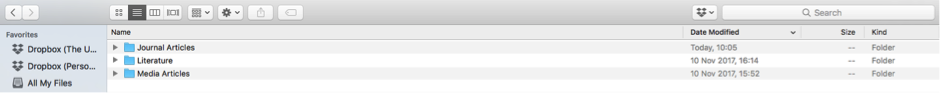 
 

They are now ready for ‘importing’ into NVivo later. 

So, go and find your own media articles (x 5), academic journal articles (x 5) and non-academic official sources (x  5). Save these to your p:Drive or in an accessible location. 

**NOTE: this is just an example data set, in a real research project, your literature and data search would need to be much more extensive and systematic, but for the purposes of demonstrating NVivo, it will suffice!.**

Ok, so now you’ve identified 15 textual data sources and saved them somewhere easily accessible (e.g. in a folder entitled ‘NVivo Sessions’)

So forget about these for now. We’ll be back. 


## Creating your NVivo project

### Activity 3: Getting started with NVivo

Let’s get started then. First, you’ll need to open NVivo from your computer. Search for it on your computer. This will open up a folder something like the following:


 

Second, you need to ‘create new project’. So click on the appropriate option. You’ll then need to name and save the project, put it in the same folder as your data:

 


Click ‘Create’ and hey presto:

 
 
 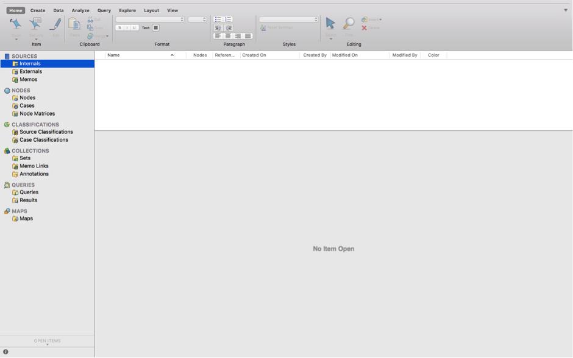

Everything you do in NVivo saves automatically. However, it’s worthwhile getting into the habit of saving after you do something important, just in case something goes wrong! You can ‘Save’ via the file tab.

So, what can you see in the interface?

## Understanding the interface

At the top of the screen are the ‘ribbon tabs’:

 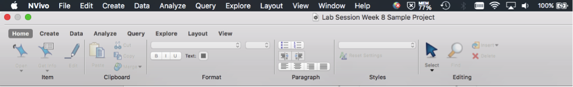

Ribbon tabs provide access to varying functions.

Basic ribbon tabs consist of: 

- *File* - Saving, Managing etc, 
- *Home* - editing functions etc., 
- *Create* - making new things 
- *Data* – various import options, 
- *Analyse* - Coding, linking, annotating, 
- *Query* - range of functions to vary queries and query views and output, 
- *Explore* - Charting, queries, models, 
- *Layout* – manipulating tabular outputs, 
- *View* – altering what you can see, arrangement of windows, coding stripes etc.


**NOTE: There are a few aspects of work that are only accessible via the ribbon tabs (for instance some of the editing tools are only accessible from the Home Tab, varying Code stripe views is only available from the View ribbon tabs, Charts and other visualisations are only accessible via the Analyse ribbon tab). But there are many other functions which are accessible more easily from the right button in the List panes. Some ribbon tabs only open up when you are in a particular function, for instance when you are in a Model, a specialized Model ribbon tab appears, but you create a new Model from the Explore Ribbon tab. You’ll figure this out through trial and error.**

So, below is the main window of the interface:


 


You organise all your research materials in the ‘Navigation View’. The navigation pane (left hand portion of the screen) is the main way of moving around the main functional areas of the software, Sources, Nodes etc. – and getting into the right folder you need in order to see the relevant ‘list’ so that you can open individual items. When you select a function – a set of folders appears in the top half of the pane. Select a folder and the relevant List appears on the right. Double click on an item in the list and the relevant item opens up in the Detail pane below. Successive opened items are tabbed I along the central bar separating the List pane from the Detail pane.

## Navigation View

Today you’ll learn about three of the sections in the Navigation View: Sources, Nodes and Memos


### Sources
Sources can be any type of data file or memo, embedded or external to the project.

Sources can be text, multimedia and datasets. There are three main folders associated with
sources.


### The ‘internals’ section:
Internals folder is designed to hold all ready-made data (to be ‘imported’) that you wish to work with directly within NVivo.


### Memos
Memo folder allows you to create any number of new documents as locations to write
notes and keep track of your analysis. If the new documents are created within or moved into the memo folder, the software sees them as memos and each memo can be linked to one document or node.

Material inside any of the above sources can be classified, coded, linked, and annotated according to needs of the researcher. We’ll do this mostly next week…

### Activity 4: Folders

Have a go at creating folders to house your data in the Internals section.
In a project consisting of different types of data we’d usually recommend that folders could be based on the type of data. This choice will vary depending on the complexity and variety of types of data. If you only have Interview data for instance, you might just create a folder called ‘Interviews’. You can decide to organise your folders in a way that suits your own thinking style.


**TIP:**  Keep the folder structure simple - although you can scope and filter later queries by folder - folders cannot reflect all the different features of your data. The assigning of attributes (via node classifications) will eventually reflect things like socio demographic information about your data/respondents/cases etc. You’ll need to think about this more if you decide to use NVivo at some point in your research, but don’t worry about these complexities just now!

So, right click at the top level (e.g. Internals) > New Folder – provide a name for your folder:
 
 
 
 
Then select ‘New Folder’
 
 
  
 
 
This will open a dialogue box where you can input your folder name. In this one, type ‘Media Articles’, or something along these lines. 

 
 
Then click ‘Done’. You can then create a second folder entitled ‘Literature’ and a third folder entitled ‘Journal Articles’. We’re now beginning to organise where our documents will go.

## Importing Data

Now we have folders we can import our data into these.

There are different things enabled during the import of data. For now, the straightforward importing of data, whether it is Text, PDF or the full range of audio-visual data – can follow essentially the same process. You just have to be careful to tell the software what type of data you are looking for e.g. ‘document’, ‘PDF’ etc.

Remember that ‘data’ and sources in NVivo are any material at all that will help you to integrate all the information that feeds into your project.

### Activity 5: Import data

For now, let’s just import your data and not worry about how you will organise data (with attributes or socio demographic variables).
First, make sure the Internals folder where you want to import your documents in the Navigation View is highlighted. For instance, we’ll start by importing our media articles, so single click the ‘Media Articles’ folder to highlight it.
 
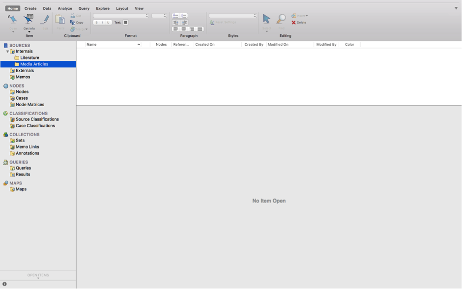 
 
Second, right click in the ‘List View’ to access the menu. Your ‘List View’ always corresponds to which ‘Source’ is in use in your Navigation View. Now select ‘Import’ and then ‘Documents’.

  

This will bring up your computer’s file search folder. Locate the folder where you saved your media articles and select the first one to import. Double click or select it and click Import.

Once imported, you’ll then need to name this document. I’ve called my first media article ‘Sky News LH’. Then click ‘Done’.

 
 

Your first article will now be imported. You’ll see it has appeared in your List View and the contents of the article can be seen in the Detail View.

You now need to repeat this process for all your media articles, your journal articles and your other literature. You’ll then have 15 documents imported into NVivo.

**NOTE: The key point to note here is that we can integrate different sources of data (e.g. media articles, academic literature, official reports) into one place to manage them together. You can even use NVivo to undertake your literature reviews in preparation for essay writing – we’ll look at this next week.**

When you import documents they can sometimes look a bit messy as below:

 

So you might want to tidy these up. To do this, simply open the document by double-clicking on it in the List View. Then ensure the ‘edit’ option is selected on the right hand side. You can then highlight text you wish to delete to tidy up your documents. 
NOTE: Edit mode/Read only mode: note that it is always possible to make changes to textual documents once you’ve imported them, but unless you change the default option, your files by default will be in protected Read only format when on display in the Detail pane.
Everything is now neat and tidy:

  

If you wish to close documents, you need to do this in the bottom left hand corner by clicking the small cross in the corner of the document you wish to close.

So we now have all our documents in NVivo. So what next? We need to think about why we are going to analyse these documents. To do this, let’s use the ‘Memos’ folder.

## Memos

Memos are related to planning, tracking processes and thinking ‘out loud’ about what is going on in your data. With that in mind, let’s create a framework of memos.
You can create folders to organize different aspects of note-making. Or you can have the one predefined folder Memos, but within it name your memos carefully with standard prefixes which tell you and others what type of memo it is – “PROCESS-…”, “THEORY…”


You create folders from the memos folder – Right click/New folder /name the folder as above. Or create memos within your chosen folder by using the Create ribbon tab along the tab/choose the memo icon - or alternatively as usual – you can select the correct folder and then right click in the List pane to create the new memo. I find right clicking is always the most straightforward way.
The new memo opens up in Edit mode so that you can begin work in it. If the memo closes, double click on the memo in the list, it will re-open but you will have to ‘click to edit ’ in order to write in it. 
So let’s try this.


### Activity 6: Memos

See if you can follow what I’ve done for your own data.

I’ve created two folders: ‘Research Questions’ and ‘Theoretical Framework’

 
 

I’ve highlighted the research questions folder, then right clicked in the List View to create a new Memo called ‘RQs’. I’ve then clicked in the Detail View and starting making notes on my research questions.

 
 

As you can see, in my first research question I’m interested in analysing how the media represented Lewis Hamilton following allegations of tax avoidance.

In the second question I’m aiming to analysis how media constructions differ from official constructions, if at all.

I’ve also created a second Memo entitled ‘Theoretical Framework’. In here I’ve made notes on which criminological theories I might use to inform my analysis. For instance, I’ve made notes about rational choice theory and routine activities theory. These theories can guide my analysis.

 
 

When I analyse my data (we’ll do this properly next week), we can begin to integrate our different data sources together and organise the data around key themes and codes. Coding our data is by far the most important step!!! Coding schemes and coded retrieval are key tools of qualitative analysis. To do this in NVivo, we use ‘Nodes’. 

For now, forget about ‘nodes’ and coding your data. We’ll do this next week in much more depth. For now, we’re going to learn to do a basic, superficial analysis of our textual data.

## Word frequency

Finding ways to give others insight into your qualitative survey data can be challenging. You often end up with pages of response text, which would quickly overwhelm readers. However, considering word frequency is a great option for instant accessibility to this qualitative data.

Word clouds, a visualisation of word frequency, can add clarity during text analysis in order to effectively communicate your data results. Word clouds can also reveal patterns in your responses that may guide future analysis.

### Activity 7: Word frequency

You’re now going to analyse your imported documents by the frequency with which words appear in them. To do this, first, open up the ‘Queries’ section in the Navigation View. Then select ‘Queries’ and right click in the List View pane. You’ll then get the options as below. Select ‘New Query’ and then ‘Word Frequency’:
 


This will open up the ‘Unnamed Query’ panel in the Detail View. (Ignore the untimely email that came from the TSSO…!). At this point, simply ensure all the default settings are selected and click ‘Run Query’.


 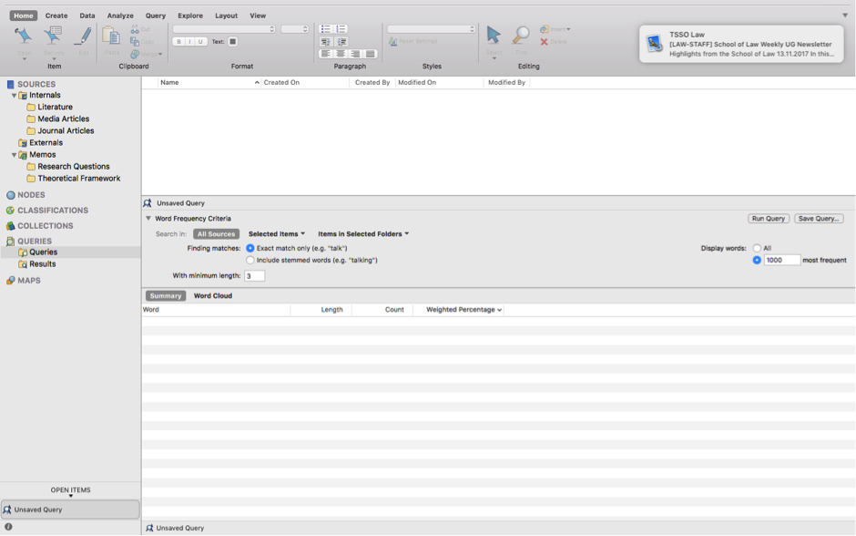

This will produce a list of all the words in all your documents order them according to ‘Count’ i.e. the word with the most hits appears at the top:

 

This is not great to look at so what we can do is create a ‘Word Cloud. Simply choose the ‘Word Cloud’ option at the top of the Detail View and this translates your query into a neat visualisation of the word frequencies:


 

We can then save this image as a picture. Right click anywhere in the Detail View and you’ll have an option to ‘Export’. Select this:

 


Make sure you choose a suitable file format, such as JPEG Image. Give the Word Cloud a name and click Ok.

 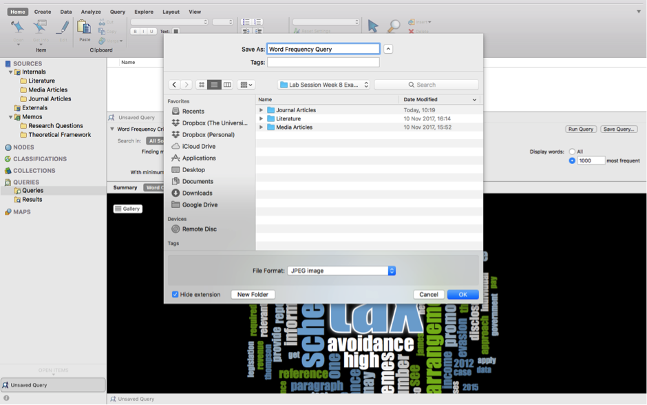

Your Word Cloud is then saved as a picture, like below. You could then insert this into any of essays or reports as an example of a superficial, but indicative, insight into the content of your documents.

 


That said, considering all my documents were identified in relation to ‘Tax’, it was pretty obvious that ‘Tax’ would be the main word, isn’t it?! In other words, the findings here are an artefact of my data search at the start.

So how about we remove ‘Tax’ from our word frequency query? To do this, you can go back to the ‘Summary’ tab, right click on the word you want to exclude, and then choose ‘Add to Stop Words List’.


 

Then run another query, as above, and see what happens now. 

If you like the new Word Cloud better, you can then ‘Save Query’, give it an appropriate title and it will save in your project.

 
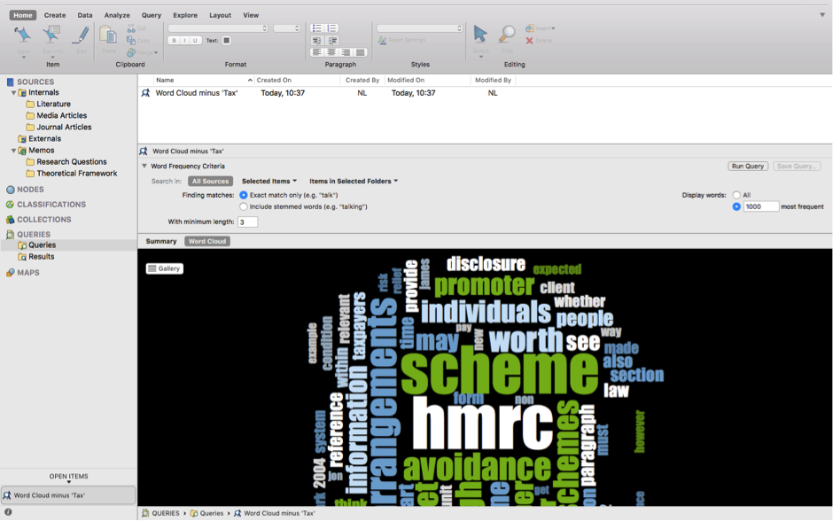

I’ve then followed the above directions again to save the Word Cloud as a JPEG for future use.
 
 
 
 

What does this tell us? Well, to be clear, this is a crude analysis. But it does throw up some interesting key words: ‘HMRC’, ‘Scheme’, ‘Arrangements’.

We can use these words to direct our coding of the data (or not). We’ll look at this more next week.

## Summary

You now know how to create a project in NVivo, import relevant documents, organise them into folders, tidy them up, create memos to structure your thinking, and undertake a basic analysis of your documents for frequencies.

These are all fundamentals to using NVivo. Of course, there are lots of tabs, functions and areas we haven’t explored, and won’t explore. These are much more advanced tools.

Next week we’ll build on these basics and put our minds to work on developing conceptual frameworks through coding our data – this is where the systematic analysis begins…


<!--chapter:end:009-week8.Rmd-->

# Week 9 {#week9}

## Learning outcomes


In this session you’ll learn:
- How to interrogate qualitative data using NVivo.
- How to build theory through deductive, inductive and abductive strategising.
- Some useful analysis features in NVivo, including how to work with non-textual data.


## Deduction, induction, adaption – key analytical strategies for qualitative data 

To recap from the lecture, this diagram gives some indication as to the directions of data analysis:

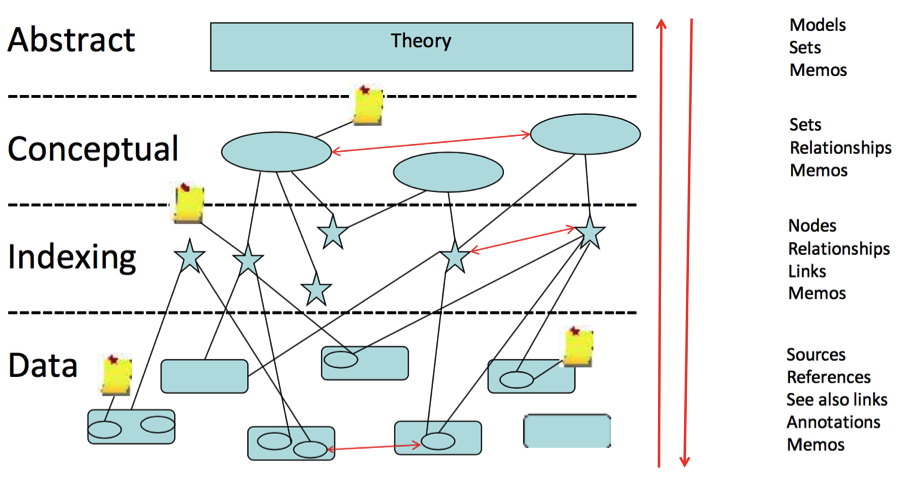 

We discussed this in the lecture so you’ll have an understanding now of strategies for approaching research including data collection and data analysis. 


**Induction** is considered to be ‘bottom-up’ where we start with very broad general interests but build theory and concepts by first coding and interrogating the data. The key here is to ensure existing theoretical perspectives and concepts do not over-define our analysis and thus obscure the possibility of identifying and developing new concepts and theories. 


**Deduction** is considered to be ‘top-down’ reasoning where we have predetermined ideas and theories and seek to test or evidence these. The coding categories we use are therefore explicit in directing the focus of our analysis.


**Abduction** integrates these two approaches, giving flexibility across the analytical process, and ensuring interplay between our ideas and data.


In this session you’ll learn how to interrogate your qualitative data using NVivo from all perspectives. You can read more about these strategies here.


## ‘Coding’ qualitative data using ‘nodes’


A ‘code in qualitative inquiry is most often a word or short phrase that symbolically assigns a summative, salient, essence-capturing, and/or evocative attribute for a portion of language-based or visual data’ (Saldaña, 2016: 3). You can read the [first chapter of Saldaña’s The Coding Manual here](http://stevescollection.weebly.com/uploads/1/3/8/6/13866629/saldana_2009_the-coding-manual-for-qualitative-researchers.pdf).


‘Coding’, ‘coding schemes’ and ‘coded retrieval’ of our data are key tools of qualitative analysis. The terminology and philosophies that underpin coding processes are explained below (but mainly in the lectures) and we find that specific methodologies use particular routines when coding. For instance, one common approach is informed by ‘Grounded Theory’ that involves both induction and deduction to code data. Here, researchers would undertake a first layer of ‘coding’, often called [‘open coding’](http://methods.sagepub.com/reference/sage-encyc-qualitative-research-methods/n299.xml), to break down data into indicative themes and concepts. This precedes more granular coding referred to as [‘axial coding’](http://methods.sagepub.com/reference/encyc-of-case-study-research/n54.xml), where categories and concepts are further refined. We’ll draw on this approach in today’s session. The structures of coding schemes, alternate groupings and basic retrieval mechanisms are key to moving forward with analysis. 


In NVivo we code our data using ‘nodes’. This is sometimes also termed the ‘indexing’ of our data.

**NOTE: If you only take one thing away from today’s session then it should be the importance of nodes. These are the fundamental building blocks of the theories and concepts we interpret in our data.**


So, let’s learn how to code using ‘nodes’.

### What are ‘Nodes’?

Node is a term which refers to a point in the NVivo database but a code label may be the name you give the node. Codes or nodes can be your ideas about the data – they can be generated inductively, deductively or abductively and may be refined, changed, grouped or deleted at any time. Applying nodes etc., to passages of source data at a minimum, provides the basic code and retrieve actions needed to accumulate together, all the bits of data linked by common threads and themes. 


**Nodes can be containers** within which we locate our data related to particular themes or ideas of interest. We can use them in this way organise our thinking. For instance, if we were looking at the Lewis Hamilton data from last week, we might have created nodes such as: ‘methods’, ‘ethics’ or ‘perceptions’ of tax avoidance. Within each of these ‘nodes’ we could copy key sections from our media articles, journal articles and policy documents into them in order to collect data about key themes. Nodes here then are more reflective and act as containers for or links to data exemplars based on, conceptual ideas, themes, codes or more structurally for people, contexts, places etc. Essentially, the terms nodes, codes, keywords, and themes are used similarly.


**Nodes can also be empty** – for example, they can act like hierarchical top-level codes with nodes underneath them that do contain or have been applied to, data. So, we might have created a top-level node entitled ‘tax avoidance’ and then created sub-level nodes entitled ‘methods’, ‘ethics’ and ‘perceptions’. We might even created further layers of nodes within each sub-level e.g. in the ‘perceptions’ node, we might break that down further to ‘perceptions of the public’, ‘perceptions of enforcement authorities’, ‘perception of politicians’, and so on.


These node layers therefore build a structural framework for our data. Plus, each Node of any sort can be linked directly to one memo – so that relevant analytic notes are easily accessible from the node itself. 


Let’s do this then. Here we’ll focus on using nodes for reflective purposes and for thematic purposes.

### Activity 1: Coding

We need to start by importing our data. Start by opening NVivo and creating a new project – call it something relevant for today’s session e.g. Lab Session Week 8.


On Blackboard you’ll fine two datasets in the Week 9 folder: 
1. Dataset 1 Probation Interviews
2. Dataset 2 GMP Twitter data. 


You’ll need to download and save these to your p:drive. (Dataset 1 is a zip file, you’ll need to unzip it). Once you’ve done this, go back to NVivo and import them, using the knowledge you gained last week. For instance, first, create folders within your internals section to house the data (see below). Second, import your data. If you import all the interviews at once, there is a small chance you computer will explode, catch fire, and burn the lab down. But let’s hope not. Be patient though, it can take a few minutes to import so much data at once. If it does crash though, you might just need to import the transcripts in smaller numbers. You can see what I’ve done in the screenshot below:

 

If you double click on any of the transcripts in the List Pane you’ll be able to see the content in the Detail Pane.

For Mac users, when you import the GMP Twitter Data, you can import as a ‘Dataset’, rather than as ‘Documents’. You’ll first encounter the screen below:
 
 

Simply click ‘next’, then ‘next’ again in the following window and then ‘Import’. You’ll then be able to see the Twitter data in the Detail View as below:

 
 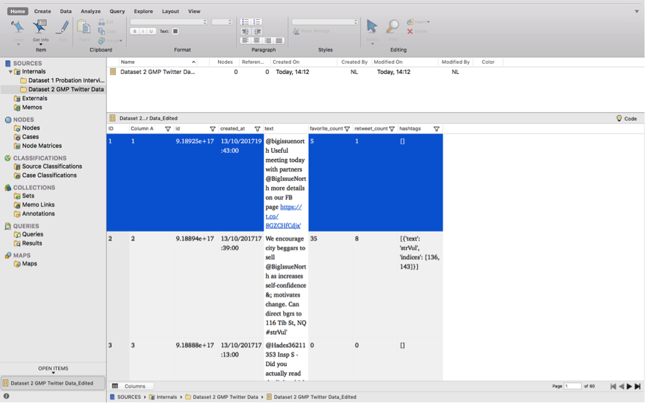


For Windows users, the process is slightly different as there is no ‘Datasets’ option. To import data from an Excel file on the Windows version of NVivo, go to “Import”, “Import survey” and “From Microsoft Excel File”. Alternatively, click on the “Data” heading and select “Survey”. In the drop down menu, select the file type (Excel or CSV, in this case our data is an Excel file). 


  


You will have to click through the Survey Import Wizard which looks like this: 


  

There are four steps to click through where you check to ensure the data will be imported correctly. In this case, you can just click ok through each step without making any changes. After step 4, click “Finish”. It may take a few minutes for NVivo to process the request. 
 
  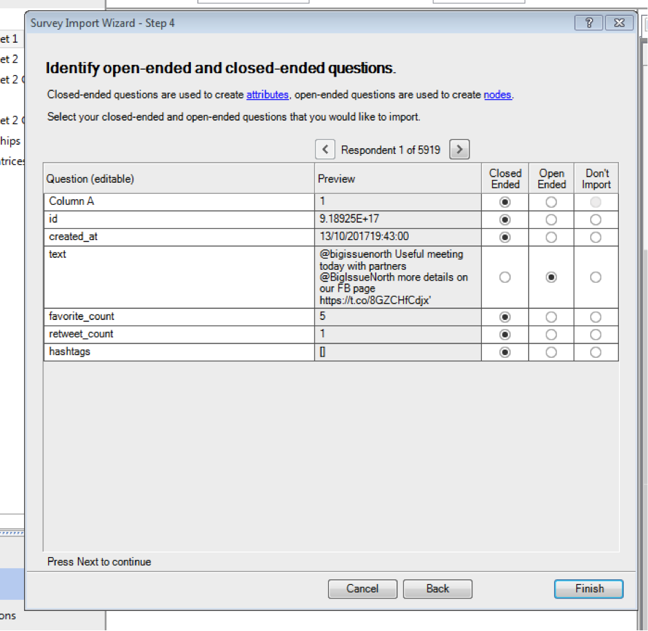

This should be the end result when you finish the import wizard:
 
 

Ok. So now we have both our datasets imported into NVivo. It’s probably worth saving your project now, just in case something goes wrong.

Usually, as these two datasets are very separate in terms of the purpose, we would probably create two separate projects in NVivo in order to keep our separate research projects apart. For the purposes of getting to know the software though, we can analyse both in one project today.

## Using ‘mind maps’ to organise your ‘analytical process and framework’ 

At this point, we need to give our coding some focus. To do this we can use ‘mind maps’ so we know how to code our data. To demonstrate this, we are going to code the interview data in Dataset 1 using a deductive approach; and then code the Twitter data in Dataset 2 using an inductive approach.

### Activity 2: Deductive coding

First, single click on ‘Maps’ in the Navigation Pane, then right click in the List Pane to create a new mind map. Call it Deductive Approach to Probation Interview Data. You should end up with the following:

 
 

Now, deductive logic assumes that we have a predetermined set of codes, ideas and themes that we intend to better understand. For instance, the interviews that were carried out with Chief Probation Officers (CPOs) in this research had the following clear research objectives:

1.	to investigate the social and educational backgrounds and career histories of CPOs;
2.	to explore their perceptions of community penalties, developments in these over the course of their careers and potential changes in the future;
3.	to examine the role of CPOs as managers and their relationships with central government, local agencies and their probation committees.
So we can extrapolate key ideas from these objectives and use them to guide our coding of the data. I’ve broken down the research objectives into key concepts and organised this in my mind map. Take a look at my screenshot below and see if you can replicate what I’ve done. You might choose to pick a different structure, or different codes, that’s fine too. Play around with creating ‘children’, ‘siblings’ and ‘floating ideas’. Play around with colours and structure.

  

What we’ve done here is create a predetermined framework for coding the interview data. That is, when we read the transcripts, we can assign these themes to what was said in the interviews. Plus, to save us having to create all the nodes individually, we can now just use the ‘create as nodes’ option. Click it then choose ‘Nodes’. Now click on ‘Nodes’ in the Navigation Pane and you’ll see the following – open up the folders so you can see all the nodes:

 
 

This is where the hard work begins. We now have to code our interview data.

There are multiple ways to code data at nodes you have already created. You can also use some of these methods to select more than one code to apply to the selected passage of data. 

The easiest way to do this is as follows (though NVivo gives you many ways to code the data). First, go back to your internals, click on the Dataset 1 folder, and double click on Interview 1 (int01). This will open the transcript in the Detail Pane. For ease, now click  on ‘Nodes’ so you can see all your created nodes and have them in mind when you read the transcript. Now start reading the transcript and each time you read something that corresponds with your ‘nodes’, you need to ‘code’ it.

For Mac users, to do this, simply highlight the text and right-click on it, choose ‘code selection’ and then ‘at existing nodes or cases’:

 

For Windows users this looks slightly different. You have to have to click on “Code” then a new window pops up with the nodes and you select from there. The right-click menu to code selected text looks like this:
 


You’ll notice the passage I’ve selected relates to career histories so I’m going to code this sentence in the corresponding node. However, I also think it relates to ‘educational background’ so I’m going to code this sentence in two ‘nodes’:

 

In Windows, to select multiple codes, you must hit “ctrl” and then click the additional node you want:
 

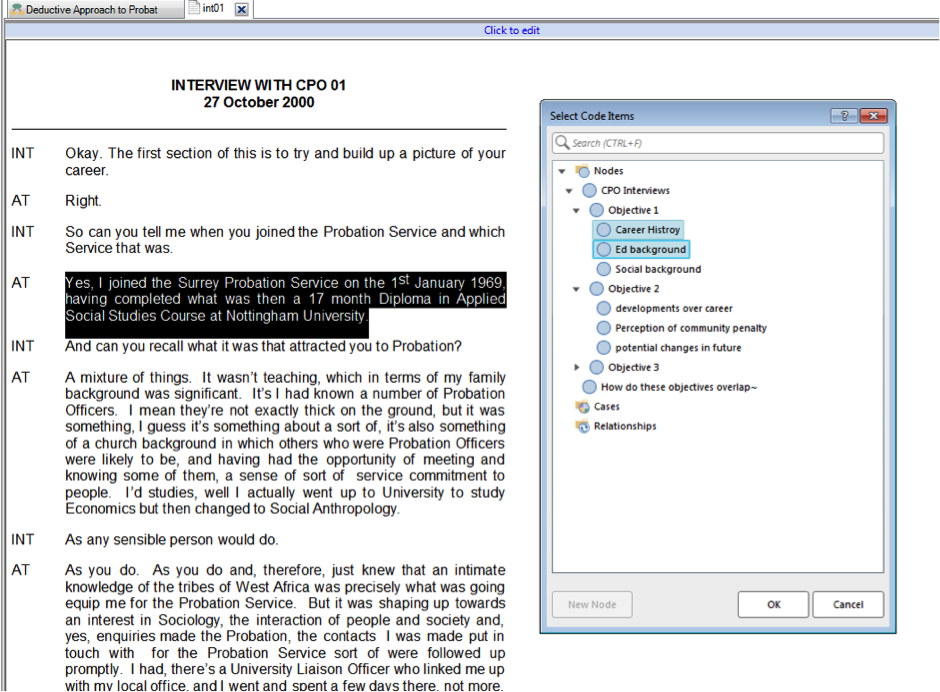

Keep reading through the transcript and coding segments at single or multiple nodes as you see fit. You’re now coding your data deductively using a predetermined conceptual/thematic framework.

Keep coding until you feel like you fully understand how this works and until you’ve coded some data for each of the predetermined ‘nodes’.  There is an option for “recent codes” that shows what nodes you have been using and this can be slightly easier than opening the window back up, but it depends on how you wish to code the data. Perhaps also code text from other interviews too. You don’t have to read all the transcripts, just read enough to understand the process and be comfortable with the software.

But where has all our coding gone? The best way to visualise what we’ve done is to go to the ribbon tab at the top, chose ‘view’, then ‘coding stripes’, then ‘nodes recently coding’ and you’ll see the following:

 
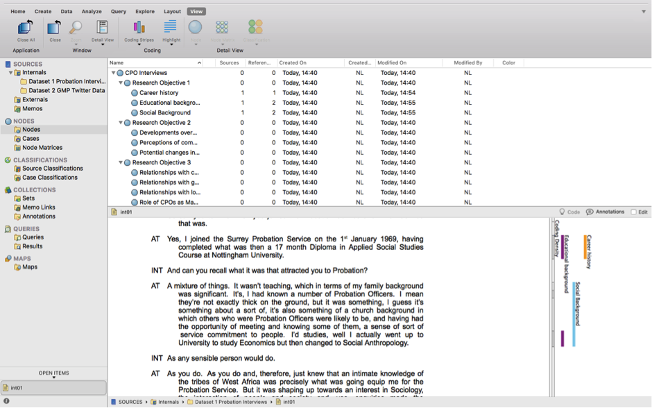


At the bottom right corner in the Detail Pane you’ll be able to see the nodes that we have coded.

To speed up the coding, you might want to ‘drag and drop’. This is a favourite for many researchers, as coding in this way allows you to drag a highlighted selection of data onto any code showing in the List pane. This, of course, necessitates the list pane be showing Nodes (as opposed to Sources or anything else from the Navigation pane). Simply hold down left click of mouse and drag it onto the desired node 

IMPORTANT: One way to speed up drag and drop coding and see the most nodes possible on the screen at one time is to rearrange the windows so that the List containing the nodes is on the left side, and the Detail pane of the source is on the right side. Do this by going to View Ribbon tab /Detail View /Right. Then arrange vertical splitter bars to accommodate as much text on the right as possible while seeing enough of the code labels on the left. You’ll then be able to view like this:

 

In theory, you would now read every single transcript and code your data. We’ll look at what you can do with this coding after we’ve looked at inductive coding.

### Activity 3: Inductive coding

To better organise our data and to keep our nodes for our two datasets separate, it’s worth creating two ‘node folders’. If we were working on only one dataset we wouldn't necessarily need to do this. However, for now, right-click on the ‘Nodes’ folder in the Nodes section in the Navigation Pane. Create a folder called Dataset 1, then another called Dataset 2. Now, click back on the Nodes folder, select all the Nodes you created, and drag them into the Dataset 1 folder. We can then put all our new Nodes for the Twitter data in the folder entitled Dataset 2, as below:

 


Now let’s start our Twitter data inductive coding. As above, let’s start by creating another mind map, but this time for the Twitter data. We’re not looking to create predetermined codes as with the deductive approach. Instead, we want to remain open minded about what themes are in the data. So let’s remind ourselves of this. See if you can produce something like the following:

 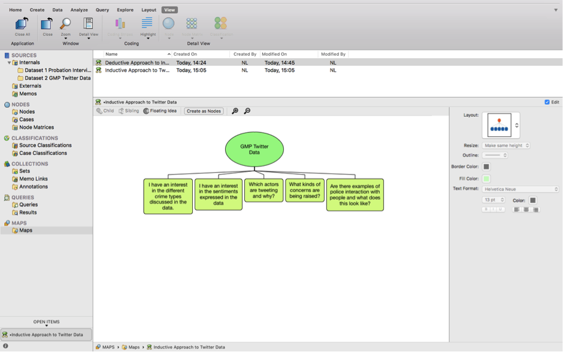
 
 

Remember, we don’t want to approach the data with too many concrete, predetermined ideas about what we will find in the data. Instead, we want to have a few open, guiding questions that will allow us to code our data as we read it.

So now to the hard work again. But this time we’ll need to create out nodes, inductively, as we read through the tweets. 

Start by clicking on Dataset 2 in the Sources section in the Navigation Pane, then double clicking on the dataset in the List Pane to open it up in the Detail Pane. For the purpose of the coding today we’re only really interested in the texts of the tweets. 

Read through the tweets one by one and each time you come across a theme of interest, code it by highlighting it, right-clicking and choosing ‘code selection’ then ‘at new node’. I think the first tweet relates to ‘partnership working’, so this is what I’ve called the node. I’ve now gone on to create more Nodes, some of the text relates to more than one Node. I’ve also started to create a hierarchy of Nodes and Sub-Nodes, as with the ‘Crime Types’ node folder. As you’ll see, I’ve changed the view to make it easier to create new Nodes and code at existing Nodes by dragging and dropping. I’ve also viewed the code stripes on the right hand side. You’ll notice that when you create Nodes that they are located in the top-level Nodes folder. So once you’ve finished your coding you can select and drag them into your Dataset 2 Nodes folder to keep it all well organised:

 


In theory, you’d read through all the tweets and code everything you consider important thematically in this case. You’d then read them all again; and again; and then again, and so on, until you're happy with the coding framework you’ve developed. You can do this in your own time. You could end up with hundreds of Nodes; you can merge Nodes; un-code text; delete nodes etc., until you’re satisfied.

**TIP: The great thing about folders in NVivo is that you can change your mind, restructure them and move or drag nodes around between them whenever you like – really easily. I’ll let you explore all this in your own time. It’s all intuitive and if you ever get stuck you can watch the tutorials on the QSR website.**


## Abductive coding

Essentially, this involves going back and forth between the deductive approach and the inductive approach. You might wish to create some pre-determined codes/nodes based on your interests and/or theory and then flexibly adapt these as you interrogate your data.

### Activity 4:  Retrieval – viewing coded data 

If you need to look vertically through one file at a time, reviewing what you have done, open a document and ensure Select Coding stripes /All has been selected:

 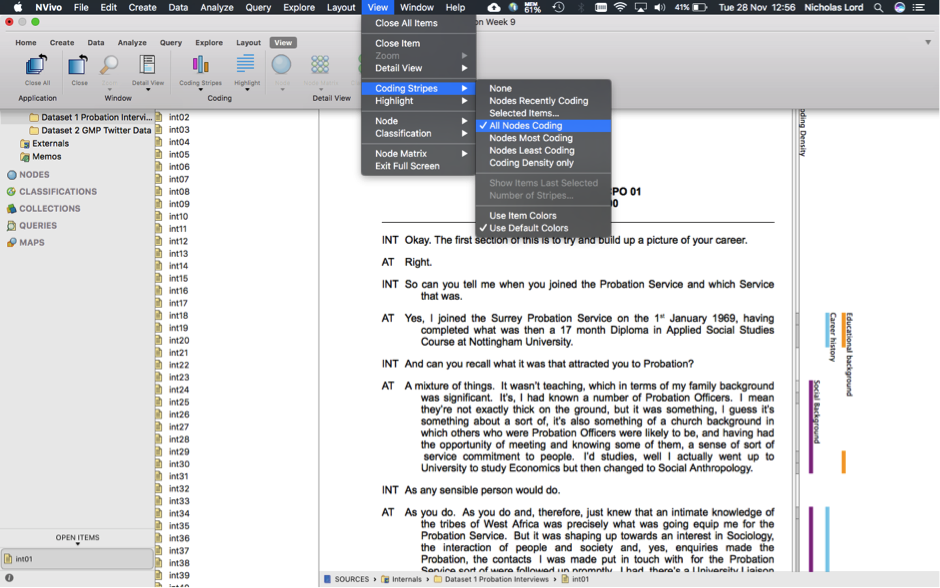

This way, you will see any codes appearing in the data. Though this is not so easy since all codes may occupy a very wide margin space and require much scrolling. Or you can selectively review codes (

Once you have done some coding, you may want to review the passages you have selected for a particular node. To do so, double click on the code you want in the List pane. This will open the code in the Detail pane. Each source that has references to the chosen code is listed, headed by a hyperlink back to the source.

The tabs down the side provide different ways to view the references, and are dependent on the type of data media coded there.

**ANALYSIS COMMENT: There are many reasons why you may wish to see what coding you’ve done, or what content is coded at a node. You may want to review your coding, to compare each passage with the other passages or by means of showing Coding stripes to browse what else is coded in this source at that node, or simply to get back to coding where you left off. **


### Activity 5: Viewing more context 

It may be useful to be able to see the surrounding context of a coding reference you’re examining. This can be done in several ways: 

- You can jump to the source by Right-clicking on the passage > Open Referenced Source. This will take you to the source and highlight the passage in which you were interested:

- You can view additional content surrounding your passage of interest without going back to the whole source by R-clicking on the passage > Coding Context > and choosing how much you wish to see:


 

this will bring in your selected quantity in light grey type so you can differentiate it from what’s actually coded at that node at which point you can select more of it to code into that node if you would like. 

## Export coded data 


There are extensive ways to output data material about your data to other formats and applications. Not all ways are included here since there are infinite combinations of settings required for different reasons which will be based on your own particular requirements. 

### Activity 6: Exporting via the list pane 

This is the general and usually used qualitative form of output which can be achieved almost anywhere in the package by different methods. This would usually be what is required for e.g. coded output and is easier to generate than the more formal Reporting functions below. 


In List pane – select the item/s you want to export content for, say a Node or a Document, Right click > Export 


**IMPORTANT: If you accept the default Entire Content an html file will be created** 


If you want a Word file or files to be created click on down arrow and select Reference View(Check any of the additional options carefully e.g. always check the Name option, this will insert the name of the item in the content itself. If you are uncertain about where the file will go, pay special attention to the File saving window which opens to allow you to create a new folder or to locate the file usefully. Similarly check the Open on Export option so that you can see the editable file/s you have generated on screen before closing them down. 


Give this a go now with the Nodes for Dataset 1. First, click on Dataset 1 Nodes in the Navigation pane. Then Right-click on the Node you want a report on (I’ve chosen the  ‘Career History’ Node) and choose Export. Find a suitable location to save the data and ensure you save as a Word file. This will be easiest to view. Now, you should have a neat overview of your Node that you could use for quotes in your essays, dissertations, or journal articles.


## Reports (NOTE: WINDOWS ONLY USERS! NOT SUPPORTED BY MAC, YET!!)


The formalized **Reports** and associated **Extracts** function (in Navigation bar or Explore/Ribbon group) specifically concerns the support provided for mixed qual/quant methods. Some of the reports only provide quantitative information or summaries. Experiment with these via the Help Menu. 


Two standardized Reports will also provide e.g. qualitative coded source data. 

- Coding Summary Report by Node 
- Coding Summary Report by Source 


These reports are essentially the same but allow for different sorting mechanisms. This would be a quick way to export many codes at once. Experiment with all the drop-down options and Select buttons. 


See if you can create a Report on your Nodes and Sources.


MAC USERS – play around to see what kind of things you can create. It's all about trial and error at this stage.

## Some other useful things to do

Below are some more tools you might get some use out of.

### Create another Word Cloud:


See if you can replicate something like this from last week:
 


This is a Word Cloud for Dataset 1 only.

### Create a Word Tree:

Using the Query function, I’ve done a text search for the words ‘Career’ AND ‘Probation’ AND ‘Money’ AND ‘Lifestyle’ in Dataset 1 and then chosen the ‘Word Tree’ option to better understand the key discourse around the term. In Windows, go to “Query” and then “Query Wizard”. Are there any relationships here? My query produced this:

 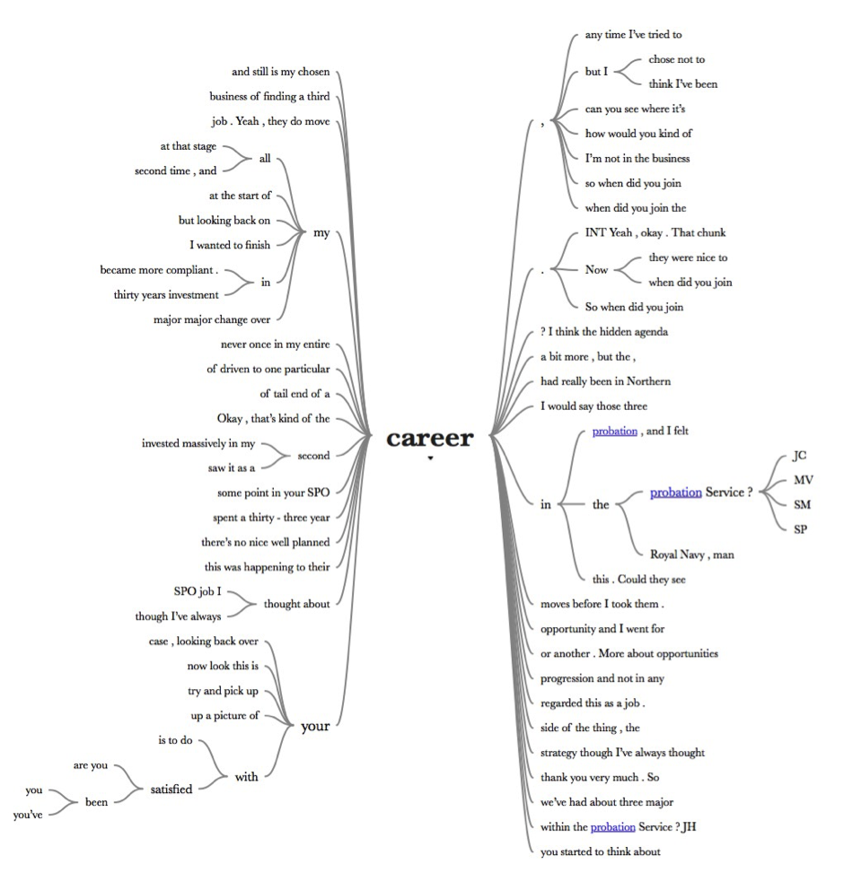

Whilst you can export your Word Tree into jpeg or PDF form, in NVivo you can also click on the different branches to better understand the connections. Try it out.

### Create a Concept Map (WINDOWS ONLY!!)

Windows users might want to create a concept map to connect data to different ideas and thoughts. It is very similar to the Mind Map function that we did earlier. [You can learn more about it here](https://www.youtube.com/watch?v=3R5gZKdOJD4).


## Other features…

Finally, here are some features that the more innovative amongst you may wish to make use of. Much of my data is textual in that I often carry out interviews with people knowledgeable of white-collar and corporate crimes. But you might be interested in generating different data, such as audio or visual:


### Graphics/pictures - making linked notes and coding 

Try importing a picture. Find something online and save it. Then import it. Here’s my example:

 


With the picture on view, click to edit, or enable the editing feature. You can then:

- Make a selection within the graphic/right click/ Insert a row – and write notes. 
- Make a selection/right click /Code selection. (
- Code the notes instead(

Have a play with coding and analysing pictures.


### Coding audio/video data 

Coding multimedia data is very similar to coding textual data. For either audio or video sources, you can select transcript text and code per usual, or you can select a segment on the progress bar and code that directly as if you’d highlighted text. 

So, if you have some music on your iTunes, try importing a song to see what it looks like then see if you can code lyrics and sections of the song. I’ve put some Bruce Springsteen in my project if you want to try it out there…

## More on capturing web material 

Last week we tried to import html pages for our media articles. But another, and actually better, way of doing this is by using NCapture.

A growing variety of web content and social media is available to you using NCapture, a web browser extension, that is available for free with NVivo. It allows you to capture and import a screenshot of any webpage as a PDF or various social media sites (such as Twitter, Facebook, and LinkedIn) as a dataset (table). Once you have NCapture installed, open your browser, and navigate to the website of interest. 


To learn more about this [click here](http://www.qsrinternational.com/nvivo/support-overview/faqs/what-is-ncapture). 


You’ll need to do this on your personal machines as it is unlikely to be installed on the lab computers. 


Once installed, the process is as follows:

- Click the NCapture icon in your browser bar 
- A dialogue box opens (right) 
- Choose your source type (probably ‘Web Page as PDF’), source name, optional description, memo nodes, etc. 
- Click Capture 
- See NCapture Progress page below 


**NOTE: WEB PAGES ARE CAPTURED USING THE PDF OPTION – SOCIAL MEDIA WOULD BE CAPTURED USING THE DATASET OPTION** 

- Go to the Sources section of the Navigation pane > Internals > Web Content subfolder (or wherever you’d like the new Sources to be created) (
- Go to the External Data Ribbon tab > From Other Sources > From NCapture (as seen left) (
- A dialogue box opens, as seen below , showing recent captures. Choose the captures you’d like, and click Import. Webpages will be brought in as pdfs; social media files as tables, depending on your choices during capture.


Then analyse as we have been doing in the sessions.


## Summary 

You can use your nodes to build your ideas and theories, or identify evidence to support your theoretical propositions. You can focus in on particular themes, compare across nodes and the data, and extract to support your academic work in a systematic way. Using NVIVO gives you structure and management for your data, helps you develop clear organizing and conceptual frameworks, and allows you to interrogate the data at different levels and in different directions.


<!--chapter:end:010-week9.Rmd-->

